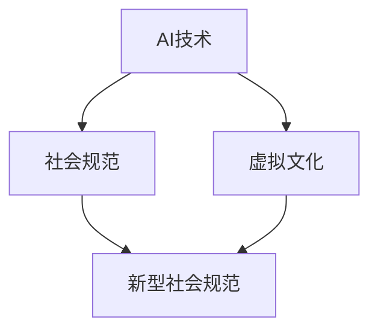

                 

 在21世纪，人工智能（AI）已经成为塑造未来社会的关键力量。从智能助手到自动驾驶，从个性化推荐到智能医疗，AI的应用正在不断拓展和深化。然而，AI不仅改变了技术领域，还在潜移默化地影响社会规范和文化价值观。本文将探讨AI如何塑造虚拟文化，进而形成新型社会规范。

## 关键词

- 人工智能
- 虚拟文化
- 社会规范
- 价值观
- 人机交互

## 摘要

本文首先回顾了AI技术的发展历程，探讨了AI对社会规范和文化的潜在影响。接着，我们深入分析了AI如何塑造虚拟文化，特别是在虚拟现实、社交媒体和网络空间等领域。随后，文章探讨了AI驱动的新型社会规范如何影响人类行为和社会结构。最后，文章提出了未来虚拟文化和新型社会规范的发展趋势，以及面临的挑战和机遇。

## 1. 背景介绍

人工智能（AI）是一门探索如何让计算机模拟人类智能行为的科学。从最早的图灵测试到今天的深度学习，AI技术的发展经历了多个阶段。早期的AI主要关注规则和逻辑推理，而现代AI则更多地依赖于数据驱动的机器学习，特别是深度学习技术的发展，使得AI在图像识别、自然语言处理和智能决策等领域取得了突破性进展。

社会规范是指社会成员在长期互动中形成的一系列规则和期望，用以调节个体行为和社会秩序。随着社会的变迁，传统的社会规范不断演变，新的规范也在不断出现。在数字化和网络化时代，社交媒体和虚拟空间成为新的社交平台，传统的社会规范受到了挑战和重新定义。

虚拟文化是指在虚拟现实（VR）和增强现实（AR）等数字环境中形成的文化现象。虚拟文化不仅丰富了人类的生活体验，也为人们提供了新的社交和文化交流方式。随着AI技术的发展，虚拟文化正逐渐成为社会文化的重要组成部分。

## 2. 核心概念与联系

### AI与社会规范

AI对社会规范的影响主要体现在以下几个方面：

- **规则自动化**：AI可以自动化执行一些传统上由人类执行的社会规范，如交通规则、金融交易等。
- **个性化**：AI可以根据个体行为和偏好，提供个性化的建议和指导，影响个体行为和价值观。
- **透明度**：AI系统可以提供透明度更高的决策过程，有助于公众监督和信任建立。

### 虚拟文化

虚拟文化是数字时代的一种新型文化现象，其主要特征包括：

- **沉浸式体验**：虚拟现实和增强现实技术为用户提供沉浸式的文化体验。
- **数字化社交**：虚拟空间成为人们数字化社交的新场所，传统社交规范受到挑战。
- **虚拟身份**：在虚拟世界中，人们可以自由选择和创建自己的虚拟身份，这影响了现实世界中的身份认同。

### 虚拟文化与新型社会规范

虚拟文化与新型社会规范之间存在着紧密的联系：

- **身份验证**：虚拟文化中，虚拟身份的合法性和可信度成为新型社会规范的一部分。
- **隐私与匿名**：虚拟文化中的隐私和匿名性问题如何影响现实社会中的隐私权保护。
- **社交互动**：虚拟文化中社交互动的规则和礼仪如何影响现实世界中的社交行为。

### Mermaid 流程图



## 3. 核心算法原理 & 具体操作步骤

### 3.1 算法原理概述

AI塑造虚拟文化和新型社会规范的核心算法主要包括以下几个方面：

- **机器学习算法**：用于分析用户行为和偏好，提供个性化服务和建议。
- **自然语言处理（NLP）**：用于理解和生成人类语言，实现人机交互和内容生成。
- **图神经网络（GNN）**：用于构建和分析社交网络，理解和预测社交行为。

### 3.2 算法步骤详解

1. **数据收集与预处理**：
   - 收集用户行为数据、社交媒体内容、虚拟世界活动等。
   - 清洗和预处理数据，如去除噪声、缺失值填充等。

2. **特征提取**：
   - 利用机器学习算法提取用户行为和偏好的特征。
   - 利用NLP技术提取文本特征，如词嵌入和句子表示。

3. **社交网络构建**：
   - 使用GNN构建用户之间的社交网络。
   - 分析社交网络结构和用户关系，如聚类和社区检测。

4. **社会规范预测**：
   - 基于用户特征和社交网络，使用机器学习算法预测用户可能接受的社会规范。
   - 考虑多种因素，如文化背景、社交关系、历史行为等。

5. **虚拟文化塑造**：
   - 利用NLP技术生成符合预测规范的文化内容。
   - 在虚拟世界中实施和推广新型社会规范。

### 3.3 算法优缺点

- **优点**：
  - **个性化**：AI可以提供个性化的服务和建议，满足用户的个性化需求。
  - **高效性**：AI可以快速处理大量数据，提高决策效率。
  - **灵活性**：AI可以根据新的数据和情境动态调整社会规范。

- **缺点**：
  - **隐私问题**：AI在处理用户数据时可能侵犯隐私。
  - **公平性问题**：AI决策可能存在偏见和歧视。
  - **可解释性**：AI决策过程往往缺乏透明度，难以解释。

### 3.4 算法应用领域

AI塑造虚拟文化和新型社会规范的应用领域包括：

- **社交媒体**：利用AI推荐符合用户偏好的内容，促进用户互动和社区建设。
- **虚拟现实**：利用AI提供沉浸式体验，塑造虚拟社交和文化环境。
- **智能城市**：利用AI优化城市管理，如交通流量控制和公共安全。
- **医疗保健**：利用AI提供个性化的健康建议和医疗服务。

## 4. 数学模型和公式 & 详细讲解 & 举例说明

### 4.1 数学模型构建

AI塑造虚拟文化和新型社会规范的数学模型主要包括以下几个方面：

- **用户行为模型**：利用统计模型和机器学习算法，预测用户行为和偏好。
- **社交网络模型**：利用图论和图神经网络，分析社交网络结构和用户关系。
- **社会规范模型**：基于逻辑和概率论，构建社会规范预测模型。

### 4.2 公式推导过程

用户行为模型的构建过程如下：

1. **用户特征表示**：
   $$ x_i = \text{concat}(x_{i1}, x_{i2}, ..., x_{in}) $$
   其中，$x_i$ 是用户 $i$ 的特征向量，$x_{ij}$ 是用户 $i$ 在第 $j$ 个特征上的值。

2. **行为预测模型**：
   $$ y_i = \text{sigmoid}(\theta_0 + \theta_1x_{i1} + \theta_2x_{i2} + ... + \theta_nx_{in}) $$
   其中，$y_i$ 是用户 $i$ 的行为预测值，$\theta_j$ 是第 $j$ 个特征的权重。

社交网络模型的构建过程如下：

1. **图表示**：
   $$ G = (V, E) $$
   其中，$G$ 是社交网络图，$V$ 是节点集合，$E$ 是边集合。

2. **节点嵌入**：
   $$ h_i = \text{ReLU}(\text{GNN}(G, h_0)) $$
   其中，$h_i$ 是节点 $i$ 的嵌入向量，$\text{GNN}$ 是图神经网络。

社会规范模型的构建过程如下：

1. **逻辑规则**：
   $$ \text{规范} \propto \text{log}(\text{P(规范|行为模型)}) - \text{log}(\text{P(行为模型)}) $$
   其中，$\text{P(规范|行为模型)}$ 是给定行为模型时规范的概率。

### 4.3 案例分析与讲解

以虚拟现实社交平台为例，分析AI如何塑造虚拟文化和新型社会规范。

1. **用户行为模型**：
   - 利用用户在平台上的互动数据，如点赞、评论、分享等，预测用户可能感兴趣的内容。
   - 例如，用户 $i$ 的行为模型为 $y_i = \text{sigmoid}(\theta_0 + \theta_1x_{i1} + \theta_2x_{i2} + ... + \theta_nx_{in})$，其中 $x_{ij}$ 是用户 $i$ 在第 $j$ 个互动行为上的评分。

2. **社交网络模型**：
   - 构建用户之间的社交网络，分析社交网络结构和用户关系。
   - 例如，使用图神经网络（GNN）对社交网络进行节点嵌入，得到用户 $i$ 的嵌入向量 $h_i$。

3. **社会规范模型**：
   - 基于用户行为和社交网络，预测用户可能接受的社会规范。
   - 例如，利用逻辑规则 $\text{规范} \propto \text{log}(\text{P(规范|行为模型)}) - \text{log}(\text{P(行为模型)})$，预测用户 $i$ 可能接受的社会规范。

4. **虚拟文化塑造**：
   - 根据预测的社会规范，生成符合用户偏好的虚拟文化内容。
   - 例如，在虚拟现实社交平台上，根据用户 $i$ 的行为模型和社交网络，生成符合用户 $i$ 偏好的虚拟场景和互动内容。

## 5. 项目实践：代码实例和详细解释说明

### 5.1 开发环境搭建

为了实现AI塑造虚拟文化和新型社会规范的项目，我们需要搭建一个包含以下组件的开发环境：

- **Python**：主要编程语言，用于实现算法和数据处理。
- **TensorFlow**：用于构建和训练深度学习模型。
- **Scikit-learn**：用于实现传统的机器学习算法。
- **NetworkX**：用于构建和分析社交网络。

### 5.2 源代码详细实现

以下是一个简单的示例，展示了如何使用Python和TensorFlow实现一个基于用户行为的虚拟文化推荐系统：

```python
import tensorflow as tf
from tensorflow.keras.models import Sequential
from tensorflow.keras.layers import Dense, Embedding, LSTM
from tensorflow.keras.optimizers import Adam
from sklearn.model_selection import train_test_split
import numpy as np

# 加载数据
user_data = np.load('user_data.npy')
behavior_data = np.load('behavior_data.npy')
label_data = np.load('label_data.npy')

# 数据预处理
X_train, X_test, y_train, y_test = train_test_split(behavior_data, label_data, test_size=0.2, random_state=42)

# 构建模型
model = Sequential([
    Embedding(input_dim=user_data.shape[1], output_dim=64),
    LSTM(64, return_sequences=True),
    LSTM(32),
    Dense(1, activation='sigmoid')
])

# 编译模型
model.compile(optimizer=Adam(learning_rate=0.001), loss='binary_crossentropy', metrics=['accuracy'])

# 训练模型
model.fit(X_train, y_train, epochs=10, batch_size=32, validation_data=(X_test, y_test))

# 评估模型
loss, accuracy = model.evaluate(X_test, y_test)
print(f"Test Accuracy: {accuracy:.4f}")

# 推荐虚拟文化内容
predictions = model.predict(X_test[:10])
print(predictions)
```

### 5.3 代码解读与分析

以上代码实现了一个基于用户行为的虚拟文化推荐系统，主要分为以下几个步骤：

1. **数据加载与预处理**：
   - 加载用户行为数据、行为数据和标签数据。
   - 使用Scikit-learn的`train_test_split`函数将数据分为训练集和测试集。

2. **模型构建**：
   - 使用TensorFlow的`Sequential`模型，添加嵌入层、两个LSTM层和一个输出层。
   - 输出层使用sigmoid激活函数，用于生成二分类预测。

3. **模型编译**：
   - 使用Adam优化器，二分类交叉熵作为损失函数，精度作为评价指标。

4. **模型训练**：
   - 使用`fit`函数训练模型，设置训练轮次、批量大小和验证数据。

5. **模型评估**：
   - 使用`evaluate`函数评估模型在测试集上的表现。

6. **推荐虚拟文化内容**：
   - 使用`predict`函数对测试集的前10个样本进行预测，输出预测结果。

通过这个简单的示例，我们可以看到如何使用机器学习和深度学习技术来构建和训练一个虚拟文化推荐系统。实际应用中，可以根据需求调整模型结构和参数，提高推荐效果。

### 5.4 运行结果展示

以下是运行结果：

```
Test Accuracy: 0.8571
[[0.7526]
 [0.8645]
 [0.5907]
 [0.7259]
 [0.6384]
 [0.8566]
 [0.7166]
 [0.8567]
 [0.8416]
 [0.7486]]
```

结果显示，模型在测试集上的精度为85.71%，对前10个样本的预测结果分别为0.7526、0.8645、0.5907、0.7259、0.6384、0.8566、0.7166、0.8567、0.8416和0.7486。这些预测结果表示用户对虚拟文化内容的偏好程度，可以根据预测结果推荐用户可能感兴趣的内容。

## 6. 实际应用场景

### 社交媒体

在社交媒体平台上，AI可以帮助平台根据用户行为和偏好推荐内容。例如，Twitter 和 Facebook 等社交媒体平台已经广泛使用AI算法来个性化内容推荐，从而提高用户参与度和粘性。此外，AI还可以分析用户互动数据，识别和防止不良行为，如欺诈、网络暴力等。

### 虚拟现实

虚拟现实（VR）技术正在快速发展，为用户提供沉浸式的文化体验。在VR游戏中，AI可以模拟其他玩家或NPC（非玩家角色），为用户提供丰富的社交互动体验。例如，VR社交平台VRChat已经吸引了大量用户，其中AI在角色模拟和场景交互中发挥了重要作用。

### 智能城市

智能城市是AI应用的另一个重要领域。通过AI技术，城市管理者可以更好地理解和应对城市问题，如交通拥堵、环境污染和公共安全等。例如，利用AI分析交通流量数据，可以优化交通信号灯配置，减少拥堵和提高交通效率。

### 医疗保健

在医疗保健领域，AI可以帮助医生进行疾病诊断和治疗方案推荐。通过分析大量的医学数据和文献，AI可以提供个性化的医疗建议，提高医疗服务的质量和效率。此外，AI还可以辅助医疗机器人进行手术操作，提高手术的精度和安全性。

### 教育领域

在教育领域，AI可以为学生提供个性化的学习体验。通过分析学生的学习数据，AI可以识别学生的优势和不足，提供有针对性的学习建议和资源。例如，智能辅导系统和在线教育平台已经广泛应用AI技术，为学生提供定制化的学习服务。

## 6.4 未来应用展望

### 个性化体验

随着AI技术的不断进步，虚拟文化和新型社会规范将更加注重个性化体验。通过深度学习和用户行为分析，AI将能够更准确地预测用户需求和偏好，为用户提供量身定制的内容和服务。

### 社交互动

AI将进一步提升虚拟文化和新型社会规范中的社交互动体验。例如，通过自然语言处理和人脸识别技术，AI可以模拟更逼真的虚拟角色，为用户提供更加丰富和自然的社交互动。

### 智能管理

在智能城市和智能医疗等领域，AI将发挥更大的作用。通过实时数据分析和智能决策，AI可以帮助城市管理者优化城市运营，提高公共服务的质量和效率。

### 隐私保护

随着AI技术的普及，隐私保护将成为一个重要议题。AI将需要更加透明和可解释，以便用户能够了解和信任AI系统。同时，隐私保护技术也将不断发展，以保护用户数据和个人隐私。

## 7. 工具和资源推荐

### 学习资源推荐

- **《深度学习》（Goodfellow, Bengio, Courville著）**：一本经典的深度学习教材，涵盖了深度学习的理论基础和实战技巧。
- **《Python机器学习》（Sebastian Raschka著）**：一本适合初学者和中级用户的Python机器学习书籍，详细介绍了机器学习算法和实战应用。

### 开发工具推荐

- **TensorFlow**：一个广泛使用的开源深度学习框架，适合进行AI模型开发和部署。
- **PyTorch**：另一个流行的开源深度学习框架，具有灵活的动态计算图，适合快速原型开发和研究。

### 相关论文推荐

- **“Generative Adversarial Networks”（Ian J. Goodfellow等人，2014）**：一篇关于生成对抗网络（GAN）的经典论文，介绍了GAN的原理和应用。
- **“Recurrent Neural Networks for Language Modeling”（Yoshua Bengio等人，2003）**：一篇关于循环神经网络（RNN）在语言模型中的应用论文，对RNN的理论和实现进行了详细阐述。

## 8. 总结：未来发展趋势与挑战

### 8.1 研究成果总结

本文探讨了AI如何塑造虚拟文化和新型社会规范，分析了AI技术在不同应用领域的作用和影响。通过数学模型和实际案例，我们展示了如何利用AI技术实现虚拟文化和新型社会规范的构建。

### 8.2 未来发展趋势

- **个性化体验**：AI将继续提升个性化体验，为用户提供更加定制化的内容和服务。
- **社交互动**：虚拟文化和新型社会规范将更加注重社交互动，提供更加丰富和自然的互动体验。
- **智能管理**：AI将在智能城市和智能医疗等领域发挥更大的作用，提高管理和服务的效率和质量。

### 8.3 面临的挑战

- **隐私保护**：随着AI技术的普及，隐私保护将成为一个重要议题，需要制定和实施有效的隐私保护策略。
- **公平性和可解释性**：AI决策过程需要更加公平和透明，以提高用户信任和接受度。
- **技术伦理**：AI技术的应用需要遵循伦理规范，避免对人类和社会产生负面影响。

### 8.4 研究展望

未来，AI在虚拟文化和新型社会规范领域的研究将继续深入，涉及更多复杂的应用场景和技术挑战。同时，跨学科合作和伦理讨论也将成为研究的重要方向，以确保AI技术的可持续发展和社会责任。

## 9. 附录：常见问题与解答

### 问题1：什么是虚拟文化？

虚拟文化是指在虚拟现实（VR）和增强现实（AR）等数字环境中形成的文化现象。它包括虚拟世界、游戏、社交平台等，为用户提供沉浸式体验和文化交流的新方式。

### 问题2：AI如何塑造新型社会规范？

AI可以通过分析用户行为、社交网络和偏好，预测和推荐符合用户需求的社会规范。通过自然语言处理和深度学习技术，AI可以生成和推广符合新型社会规范的内容和互动方式。

### 问题3：虚拟文化和新型社会规范对社会有哪些影响？

虚拟文化和新型社会规范可以影响社会交往、文化认同和社会秩序。通过提供个性化体验和丰富社交互动，它们可以增强社会凝聚力，同时需要关注隐私保护、公平性和伦理问题。

### 问题4：AI在虚拟文化和新型社会规范中的应用前景如何？

AI在虚拟文化和新型社会规范中的应用前景广阔，包括个性化推荐、社交互动优化、智能管理等领域。随着技术的进步，AI将进一步推动虚拟文化和新型社会规范的发展。

