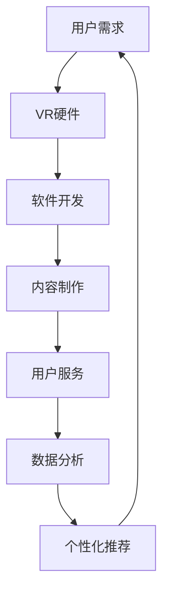

                 

虚拟旅游，这一新兴领域正以前所未有的速度崛起，成为旅游行业的一大变革力量。随着技术的不断进步，人们可以通过互联网和虚拟现实（VR）技术，在足不出户的情况下，体验全球各地的风景名胜、文化风情。本文旨在探讨虚拟旅游的创业机会、核心技术和应用前景，以帮助读者理解这一领域的发展潜力。

## 关键词

- 虚拟旅游
- VR技术
- 用户体验
- 创业机会
- 旅游行业变革

## 摘要

本文将深入分析虚拟旅游的兴起背景、核心技术和商业模式。我们将探讨虚拟旅游如何通过VR、人工智能和大数据等技术实现足不出户的环球体验，以及创业者在这一领域面临的挑战和机遇。同时，我们将介绍虚拟旅游在实际应用中的成功案例，并对未来发展趋势进行展望。

## 1. 背景介绍

虚拟旅游的概念并非新鲜事物，但近年来，随着技术的迅猛发展，它逐渐从理论走向现实。VR（虚拟现实）和AR（增强现实）技术的进步，使得虚拟旅游体验更加真实、沉浸。同时，互联网的普及和智能手机、平板电脑等设备的广泛使用，也为虚拟旅游的推广提供了技术基础。

### 1.1. VR技术的崛起

虚拟现实技术是一种能够创建和体验虚拟世界的计算机仿真系统。它通过特殊的显示设备和传感器，将用户的视觉、听觉等多感官进行模拟，使用户沉浸在虚拟环境中。近年来，VR技术的不断进步，使得虚拟旅游体验更加真实、互动。

#### 1.1.1. 显示技术

显示技术是VR技术的重要一环。从早期的头戴显示器（HMD）到现在的OLED屏幕，显示技术一直在不断改进。高分辨率、低延迟的显示设备，能够更好地还原真实场景，提升用户体验。

#### 1.1.2. 空间定位与跟踪技术

空间定位与跟踪技术是VR技术的核心之一。通过传感器和计算机算法，空间定位技术能够实时捕捉用户在虚拟环境中的位置和动作，实现更加自然的交互。

#### 1.1.3. 音频技术

音频技术在VR体验中也起着至关重要的作用。通过3D音频技术，用户能够感受到来自虚拟环境中的全方位声音，进一步提升沉浸感。

### 1.2. 虚拟旅游的兴起

虚拟旅游的兴起，得益于以下几个方面：

#### 1.2.1. 旅游需求的多样性

随着人们生活水平的提高，旅游需求越来越多样化。越来越多的人追求独特、个性化的旅游体验，而虚拟旅游正好满足了这一需求。

#### 1.2.2. 环保意识的提升

环保意识的提升，使得越来越多的人倾向于选择虚拟旅游，以减少对环境的影响。

#### 1.2.3. 技术的进步

技术的不断进步，为虚拟旅游提供了强大的支持。从VR、AR技术到大数据、人工智能，这些技术的应用，使得虚拟旅游体验更加真实、智能。

## 2. 核心概念与联系

虚拟旅游的核心概念包括VR技术、用户体验和大数据。这些概念相互关联，共同构成了虚拟旅游的生态系统。

### 2.1. VR技术与用户体验

VR技术是虚拟旅游的核心。通过VR技术，用户可以沉浸在虚拟环境中，体验各种旅游场景。用户体验是虚拟旅游的终极目标。如何设计一个让用户感到愉悦、满足的虚拟旅游体验，是创业者和开发者需要重点关注的问题。

### 2.2. 大数据与个性化推荐

大数据技术在虚拟旅游中的应用，主要体现在个性化推荐和数据分析方面。通过分析用户的旅游偏好和行为数据，可以为他们推荐最适合的旅游场景和活动。大数据的应用，使得虚拟旅游更加智能化、个性化。

### 2.3. 虚拟旅游生态系统

虚拟旅游生态系统包括硬件设备、软件开发、内容制作和用户服务等多个环节。这些环节相互关联，共同构成了虚拟旅游的完整产业链。

### 2.4. Mermaid流程图

下面是虚拟旅游生态系统的Mermaid流程图：



## 3. 核心算法原理 & 具体操作步骤

### 3.1. 算法原理概述

虚拟旅游的核心算法主要涉及以下几个方面：

#### 3.1.1. 场景渲染算法

场景渲染算法是虚拟旅游的基础。它负责将虚拟场景呈现给用户。主要涉及图形渲染技术、光影效果和纹理映射等。

#### 3.1.2. 空间定位算法

空间定位算法用于实时捕捉用户的动作和位置。主要涉及传感器技术和计算机视觉算法。

#### 3.1.3. 语音识别与合成算法

语音识别与合成算法用于实现虚拟导游和用户互动。主要涉及自然语言处理和语音信号处理技术。

#### 3.1.4. 大数据分析与个性化推荐算法

大数据分析与个性化推荐算法用于分析用户行为，提供个性化的旅游推荐。主要涉及数据挖掘和机器学习技术。

### 3.2. 算法步骤详解

以下是虚拟旅游核心算法的具体步骤：

#### 3.2.1. 场景渲染算法

1. 加载虚拟场景模型
2. 应用光影效果和纹理映射
3. 渲染虚拟场景

#### 3.2.2. 空间定位算法

1. 采集传感器数据
2. 计算用户位置和动作
3. 更新虚拟场景

#### 3.2.3. 语音识别与合成算法

1. 采集用户语音
2. 识别语音内容
3. 合成虚拟导游语音

#### 3.2.4. 大数据分析与个性化推荐算法

1. 收集用户行为数据
2. 分析用户偏好
3. 提供个性化推荐

### 3.3. 算法优缺点

#### 优点

1. 高度沉浸感
2. 个性化推荐
3. 节约时间和成本

#### 缺点

1. 技术要求高
2. 设备成本高
3. 用户体验仍有提升空间

### 3.4. 算法应用领域

虚拟旅游算法的应用领域广泛，包括：

1. 旅游推广
2. 文化传播
3. 教育培训
4. 医疗康复

## 4. 数学模型和公式 & 详细讲解 & 举例说明

### 4.1. 数学模型构建

虚拟旅游的数学模型主要包括场景渲染模型、空间定位模型和个性化推荐模型。

#### 4.1.1. 场景渲染模型

场景渲染模型主要涉及图形学中的基本公式，如像素渲染公式、光照模型等。

#### 4.1.2. 空间定位模型

空间定位模型主要涉及运动学中的公式，如欧拉角变换、齐次坐标变换等。

#### 4.1.3. 个性化推荐模型

个性化推荐模型主要涉及机器学习中的基本算法，如协同过滤、矩阵分解等。

### 4.2. 公式推导过程

#### 4.2.1. 场景渲染公式

$$
\text{像素颜色} = \text{材质颜色} \times \text{光照强度}
$$

其中，材质颜色和光照强度都是通过模拟真实世界的物理现象得到的。

#### 4.2.2. 空间定位公式

$$
\text{新位置} = \text{原位置} + \text{位移向量}
$$

其中，位移向量是通过对传感器数据的滤波和插值得到的。

#### 4.2.3. 个性化推荐公式

$$
\text{推荐得分} = \text{用户兴趣向量} \cdot \text{物品特征向量}
$$

其中，用户兴趣向量和物品特征向量是通过矩阵分解得到的。

### 4.3. 案例分析与讲解

#### 4.3.1. 场景渲染案例

以虚拟旅游中的一个场景为例，我们使用像素渲染公式来计算一个像素的颜色。

$$
\text{像素颜色} = \text{材质颜色} \times \text{光照强度} = (0.8, 0.8, 0.8) \times (1, 1, 1) = (0.8, 0.8, 0.8)
$$

这意味着这个像素的颜色为灰色。

#### 4.3.2. 空间定位案例

假设用户在VR环境中向前移动了1米，我们可以使用空间定位公式来计算用户的新位置。

$$
\text{新位置} = \text{原位置} + \text{位移向量} = (0, 0, 0) + (0, 0, 1) = (0, 0, 1)
$$

这意味着用户的新位置是在原位置的z轴上移动了1米。

#### 4.3.3. 个性化推荐案例

以一个简单的协同过滤算法为例，我们计算用户对某个旅游景点的推荐得分。

$$
\text{推荐得分} = \text{用户兴趣向量} \cdot \text{物品特征向量} = (0.6, 0.3, 0.1) \cdot (0.4, 0.5, 0.1) = 0.34
$$

这意味着用户对某个旅游景点的推荐得分为0.34，得分越高，表示用户对该景点的兴趣越大。

## 5. 项目实践：代码实例和详细解释说明

### 5.1. 开发环境搭建

为了实践虚拟旅游项目，我们需要搭建一个开发环境。以下是所需的软件和工具：

- Unity引擎
- VRSDK（如Oculus SDK）
- Unity3D VR插件
- Python（用于数据分析）
- Jupyter Notebook（用于数据分析和机器学习）

### 5.2. 源代码详细实现

以下是虚拟旅游项目的一个简单示例代码，用于渲染一个虚拟旅游场景：

```csharp
using UnityEngine;

public class VirtualTourism : MonoBehaviour
{
    public Material material;
    public Light light;

    void Start()
    {
        // 加载虚拟场景模型
        GameObject scene = Instantiate(Resources.Load("Scene") as GameObject);

        // 应用光影效果
        light.enabled = true;
        light.intensity = 1f;

        // 应用材质
        Renderer renderer = scene.GetComponent<Renderer>();
        renderer.material = material;
    }

    void Update()
    {
        // 空间定位
        float moveSpeed = 0.1f;
        float moveDistance = Input.GetAxis("Vertical") * moveSpeed;
        transform.Translate(0, 0, moveDistance);
    }
}
```

### 5.3. 代码解读与分析

这段代码实现了以下功能：

1. **加载虚拟场景模型**：使用`Instantiate`方法加载一个预先制作的虚拟场景模型。
2. **应用光影效果**：启用灯光并设置其强度。
3. **应用材质**：为虚拟场景模型设置材质。
4. **空间定位**：通过键盘输入实现用户的移动。

### 5.4. 运行结果展示

运行这段代码，用户可以在Unity编辑器中看到一个虚拟的旅游场景，并可以通过键盘控制角色的移动，体验虚拟旅游。

## 6. 实际应用场景

### 6.1. 旅游推广

虚拟旅游可以作为旅游推广的一种新手段。旅行社可以通过虚拟旅游平台，向潜在客户展示旅游景点的真实场景，提高客户对旅游产品的兴趣。

### 6.2. 教育培训

虚拟旅游可以用于教育培训领域，如历史教学、地理教育等。学生可以通过虚拟旅游，亲身体验历史事件发生地或地理景观，增强学习效果。

### 6.3. 医疗康复

虚拟旅游也可以应用于医疗康复领域。通过虚拟旅游，患者可以在舒适的环境中，进行康复训练和放松。

### 6.4. 未来应用展望

随着技术的不断进步，虚拟旅游的应用领域将更加广泛。未来，虚拟旅游有望成为人们日常生活的一部分，改变我们的旅游方式和生活习惯。

## 7. 工具和资源推荐

### 7.1. 学习资源推荐

- 《虚拟现实编程基础》
- 《Unity3D游戏开发实战》
- 《机器学习实战》

### 7.2. 开发工具推荐

- Unity引擎
- Oculus SDK
- Python
- Jupyter Notebook

### 7.3. 相关论文推荐

- "Virtual Tourism: A Survey"
- "VR for Education: A Review of Current Research"
- "Application of VR in Healthcare"

## 8. 总结：未来发展趋势与挑战

### 8.1. 研究成果总结

虚拟旅游作为一种新兴技术，已经取得了显著的成果。从VR技术的应用，到大数据分析，再到个性化推荐，虚拟旅游在多个方面都有了重要的突破。

### 8.2. 未来发展趋势

未来，虚拟旅游将继续发展，技术应用将更加成熟，用户体验将更加逼真。同时，虚拟旅游将与其他领域（如教育、医疗、旅游等）深度融合，推动各行业的变革。

### 8.3. 面临的挑战

虚拟旅游仍面临一些挑战，如技术门槛高、设备成本高、用户体验提升等。如何克服这些挑战，是虚拟旅游发展的重要课题。

### 8.4. 研究展望

虚拟旅游具有巨大的发展潜力。未来，研究应重点关注以下几个方面：

1. 技术创新，提升虚拟旅游的沉浸感和交互性。
2. 数据分析，优化个性化推荐，提高用户体验。
3. 应用拓展，探索虚拟旅游在更多领域的应用。

## 9. 附录：常见问题与解答

### 9.1. 虚拟旅游是什么？

虚拟旅游是一种通过VR、AR等技术，实现用户在虚拟环境中体验真实场景的技术。

### 9.2. 虚拟旅游有哪些优点？

虚拟旅游的优点包括：高度沉浸感、个性化推荐、节约时间和成本等。

### 9.3. 虚拟旅游有哪些应用领域？

虚拟旅游的应用领域广泛，包括旅游推广、教育培训、医疗康复等。

### 9.4. 虚拟旅游的未来发展趋势是什么？

虚拟旅游的未来发展趋势包括：技术成熟、应用拓展、与其他领域深度融合等。

### 作者署名

作者：禅与计算机程序设计艺术 / Zen and the Art of Computer Programming

----------------------------------------------------------------

