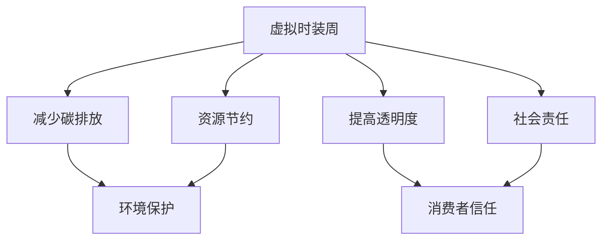

                 

在当今全球化的时代，时尚产业正面临前所未有的挑战和机遇。随着消费者对可持续性和环境问题的关注日益增加，时尚品牌和零售商正在寻找创新的方法来减少环境影响，提高社会责任，同时保持竞争力和盈利能力。虚拟时装周的兴起，为全球时尚产业提供了一个全新的舞台，也是绿色数字化转型的关键一步。本文旨在探讨虚拟时装周在可持续发展方面的意义，评估全球时尚产业数字化转型的现状与挑战，并展望其未来发展趋势。

## 关键词
- 虚拟时装周
- 可持续发展
- 绿色数字化转型
- 时尚产业
- 数字化转型评估

## 摘要
本文通过对虚拟时装周的案例分析，探讨了其在时尚产业绿色数字化转型中的重要作用。文章首先介绍了虚拟时装周的背景和概念，然后分析了数字化转型的核心概念与联系，包括可持续发展的目标、数字化技术的应用场景等。随后，文章详细讲解了核心算法原理与数学模型，以及项目实践中的代码实例和详细解释。接着，文章分析了虚拟时装周在可持续发展中的应用场景，并提出了未来应用展望。最后，文章总结了研究成果，讨论了未来发展趋势与挑战，并提供了相关的工具和资源推荐。

## 1. 背景介绍
虚拟时装周是一种通过数字技术实现的时尚展示活动，它允许设计师、品牌和消费者在全球范围内实时互动，无需实体参与。这种模式不仅提高了效率，减少了资源浪费，还为时尚产业带来了全新的商业模式。随着数字化技术的不断进步，虚拟时装周正成为时尚产业可持续发展的重要工具。

### 虚拟时装周的起源与发展
虚拟时装周的起源可以追溯到20世纪90年代，当时互联网和数字技术开始普及，一些设计师和品牌开始尝试在线展示作品。然而，直到最近几年，随着虚拟现实（VR）、增强现实（AR）和5G等技术的成熟，虚拟时装周才真正获得了广泛认可。

虚拟时装周的发展经历了几个阶段：

1. **初阶**：设计师和品牌通过在线平台展示静态图片和视频，这是虚拟时装周的萌芽阶段。
2. **发展期**：随着技术的进步，虚拟时装周开始采用3D建模和虚拟现实技术，提供更沉浸式的体验。
3. **成熟期**：如今，虚拟时装周已经成为时尚产业的重要活动之一，不仅吸引了众多知名品牌参与，还吸引了全球消费者的关注。

### 虚拟时装周的优势
虚拟时装周的出现，为时尚产业带来了诸多优势：

1. **环境效益**：虚拟时装周减少了旅行和运输的需求，从而降低了碳排放和资源消耗。
2. **成本效益**：虚拟时装周降低了举办和参与活动的成本，设计师和品牌可以以更低的成本接触到全球市场。
3. **互动性**：虚拟时装周提供了实时互动的机会，设计师和消费者可以直接交流，提高了用户参与度。
4. **创意表达**：虚拟时装周为设计师提供了更多的创意空间，他们可以运用数字技术创造出独特的时尚体验。

### 全球时尚产业面临的挑战
尽管虚拟时装周为时尚产业带来了许多机遇，但全球时尚产业仍然面临许多挑战，这些挑战包括：

1. **可持续性**：时尚产业长期以来被批评为环境破坏者，需要通过绿色数字化转型来减少环境影响。
2. **社会责任**：消费者对品牌的社会责任越来越关注，品牌需要采取行动来提高透明度和责任感。
3. **数字化转型**：许多时尚品牌和零售商在数字化转型方面仍处于落后状态，需要加快步伐。
4. **技术壁垒**：虚拟时装周虽然提供了新的机会，但技术和成本问题仍然是许多品牌面临的挑战。

## 2. 核心概念与联系
在探讨虚拟时装周对时尚产业绿色数字化转型的影响之前，我们需要了解一些核心概念，如可持续发展、数字化转型、数字技术等，以及它们之间的联系。

### 可持续发展的目标
可持续发展是指在满足当前需求的同时，不损害未来世代满足自身需求的能力。在时尚产业中，可持续发展的目标包括：

1. **环境可持续性**：减少碳排放、水污染和资源浪费。
2. **社会可持续性**：提高员工福利、社区参与和社会责任感。
3. **经济可持续性**：确保长期盈利和品牌价值的提升。

### 数字化转型的核心概念
数字化转型是指企业通过采用数字技术来改变业务模式、运营流程和客户体验。在时尚产业中，数字化转型的核心概念包括：

1. **电子商务**：通过在线平台销售产品，提高销售渠道的多样性和效率。
2. **智能制造**：利用物联网、人工智能等技术提高生产效率和质量。
3. **客户关系管理**：通过数据分析和技术手段提高客户满意度和忠诚度。

### 数字技术与应用场景
数字技术在时尚产业中有着广泛的应用，包括：

1. **虚拟现实（VR）和增强现实（AR）**：提供沉浸式的购物体验，使消费者可以虚拟试穿服装。
2. **大数据分析**：帮助品牌了解消费者行为和市场趋势，优化产品设计和营销策略。
3. **人工智能**：用于设计、生产、供应链管理等多个环节，提高效率和准确性。

### 虚拟时装周与可持续发展的联系
虚拟时装周作为数字技术的应用之一，与可持续发展的目标密切相关。具体而言，虚拟时装周通过以下几个方面促进了时尚产业的绿色发展：

1. **减少碳排放**：虚拟时装周减少了旅行和运输的需求，降低了碳排放。
2. **资源节约**：虚拟时装周减少了实体展示所需的资源和材料，如场地租赁、服装制作等。
3. **提高透明度**：虚拟时装周提供了更多的透明度，使消费者可以了解品牌的生产和运营过程。
4. **社会责任**：虚拟时装周为品牌提供了展示其社会责任的机会，提高了品牌的公众形象。

### Mermaid 流程图
下面是虚拟时装周与可持续发展的联系的 Mermaid 流程图：



## 3. 核心算法原理 & 具体操作步骤
在虚拟时装周和绿色数字化转型中，核心算法原理和具体操作步骤起着至关重要的作用。以下是对核心算法原理的概述和具体操作步骤的详细讲解。

### 3.1 算法原理概述
虚拟时装周的核心算法主要涉及以下几个方面：

1. **三维建模**：通过三维建模技术，设计师可以将服装制作成数字模型，为虚拟试穿提供基础。
2. **虚拟试穿**：利用计算机视觉和图像处理技术，实现服装在虚拟环境中的试穿效果。
3. **用户互动**：通过虚拟现实（VR）和增强现实（AR）技术，实现用户与虚拟时装周的实时互动。
4. **数据分析**：通过大数据分析，收集用户行为数据，为品牌提供市场洞察和产品优化建议。

### 3.2 算法步骤详解
以下是虚拟时装周的核心算法步骤详解：

1. **三维建模**：
   - 设计师使用三维设计软件创建服装模型。
   - 使用3D扫描技术获取人体模型，与服装模型进行匹配。
   - 对服装模型进行渲染，以获得逼真的视觉效果。

2. **虚拟试穿**：
   - 用户通过虚拟现实头盔或增强现实眼镜进入虚拟环境。
   - 系统根据用户的人体数据，将服装模型贴合在用户身上。
   - 实时渲染服装的材质和纹理，以模拟真实试穿效果。

3. **用户互动**：
   - 用户可以通过手势或语音命令与虚拟时装周进行互动。
   - 系统根据用户的操作，调整服装的样式、颜色和尺寸。
   - 用户可以与他人分享试穿体验，获取反馈和建议。

4. **数据分析**：
   - 收集用户的试穿数据，包括时间、偏好、反馈等。
   - 使用机器学习算法，分析用户行为，预测市场需求。
   - 基于数据分析结果，优化产品设计、营销策略和供应链管理。

### 3.3 算法优缺点
以下是虚拟时装周核心算法的优缺点：

1. **优点**：
   - 提高效率：减少了实体时装周的准备工作，加快了设计和销售流程。
   - 节约成本：减少了旅行、运输和实体展示的成本。
   - 提高用户体验：提供了沉浸式的购物体验，增加了用户参与度。
   - 数据驱动：通过数据分析，实现个性化推荐和精准营销。

2. **缺点**：
   - 技术门槛：需要较高的技术支持和设备投入，对中小企业可能构成挑战。
   - 可靠性问题：虚拟试穿效果可能受网络延迟和设备性能影响。
   - 安全性问题：用户数据和隐私保护需要严格的管理和措施。

### 3.4 算法应用领域
虚拟时装周的核心算法主要应用于以下几个方面：

1. **时尚设计**：设计师可以使用虚拟试穿技术，快速验证设计效果，节省时间和成本。
2. **电子商务**：品牌和零售商可以通过虚拟时装周，提供更加个性化的购物体验，提高销售额。
3. **市场研究**：通过收集用户试穿数据，品牌可以了解消费者偏好，优化产品设计和营销策略。
4. **虚拟现实体验**：用户可以在虚拟环境中体验不同的时尚风格，增加时尚消费的乐趣。

## 4. 数学模型和公式 & 详细讲解 & 举例说明
在虚拟时装周和绿色数字化转型中，数学模型和公式起着至关重要的作用。以下是对数学模型的构建、公式推导过程和案例分析与讲解。

### 4.1 数学模型构建
虚拟时装周的核心数学模型主要包括以下几个方面：

1. **三维人体建模**：
   - 使用三角网格表示人体表面，通过顶点坐标和面片连接构建人体模型。
   - 应用三角剖分算法，将复杂几何形状拆分为简单的三角形。

2. **虚拟试穿算法**：
   - 使用投影算法，将服装模型投影到人体模型上，实现虚拟试穿效果。
   - 应用相似性变换，调整服装的大小和形状，使其贴合人体。

3. **用户行为分析**：
   - 构建用户行为数据模型，包括试穿时间、偏好、反馈等。
   - 应用机器学习算法，如决策树、神经网络等，对用户行为进行分析和预测。

### 4.2 公式推导过程
以下是虚拟时装周核心数学模型的公式推导过程：

1. **三维人体建模**：
   - 三角网格表示的人体表面公式：
     $$
     S_i = P \cdot (N_i \cdot N_i) + B
     $$
     其中，$S_i$是顶点$i$的坐标，$P$是投影矩阵，$N_i$是顶点$i$的法向量，$B$是偏移量。

   - 三角剖分算法的公式：
     $$
     P = \begin{pmatrix}
     \cos(\theta) & -\sin(\theta) \\
     \sin(\theta) & \cos(\theta)
     \end{pmatrix}
     $$
     其中，$\theta$是旋转角度。

2. **虚拟试穿算法**：
   - 投影算法的公式：
     $$
     C = P \cdot V
     $$
     其中，$C$是投影坐标，$P$是投影矩阵，$V$是服装模型的顶点坐标。

   - 相似性变换的公式：
     $$
     S' = S \cdot K
     $$
     其中，$S'$是变换后的坐标，$S$是原始坐标，$K$是相似性变换矩阵。

3. **用户行为分析**：
   - 决策树模型的公式：
     $$
     P(Y|X) = \prod_{i=1}^{n} P(Y_i|X_i)
     $$
     其中，$P(Y|X)$是后验概率，$P(Y_i|X_i)$是条件概率。

   - 神经网络模型的公式：
     $$
     Y = \sigma(W \cdot X + b)
     $$
     其中，$Y$是输出，$\sigma$是激活函数，$W$是权重矩阵，$X$是输入，$b$是偏置。

### 4.3 案例分析与讲解
以下是一个虚拟时装周的核心数学模型应用的案例分析：

**案例背景**：
一家时尚品牌希望通过虚拟时装周，为消费者提供个性化的购物体验。品牌希望通过用户行为分析，了解消费者的偏好，优化产品设计。

**数学模型应用**：
- **三维人体建模**：
  - 品牌使用三角网格表示人体表面，通过3D扫描获取用户的人体数据。
  - 应用三角剖分算法，将复杂的人体形状拆分为简单的三角形。

- **虚拟试穿算法**：
  - 用户通过虚拟现实头盔进入虚拟环境，系统根据用户的人体数据，将服装模型投影到用户身上。
  - 应用相似性变换，调整服装的大小和形状，使其贴合用户的人体。

- **用户行为分析**：
  - 系统收集用户的试穿数据，包括试穿时间、偏好、反馈等。
  - 应用决策树模型，分析用户行为，预测消费者的购买意向。
  - 基于用户行为分析结果，品牌优化产品设计，提高用户满意度。

**案例结果**：
- 通过虚拟时装周，品牌提供了个性化的购物体验，用户满意度显著提高。
- 品牌通过用户行为分析，优化了产品设计，提高了销售业绩。

## 5. 项目实践：代码实例和详细解释说明
在本节中，我们将通过一个虚拟时装周的项目实践，展示如何使用代码实现虚拟试穿功能，并对其进行详细解释说明。

### 5.1 开发环境搭建
为了实现虚拟试穿功能，我们需要搭建以下开发环境：

1. **三维建模软件**：例如Blender或Maya，用于创建服装和人体模型。
2. **编程语言**：Python，用于编写虚拟试穿算法和用户行为分析代码。
3. **虚拟现实（VR）和增强现实（AR）开发工具**：如Unity或Unreal Engine，用于构建虚拟环境和用户交互界面。
4. **机器学习库**：如scikit-learn或TensorFlow，用于用户行为分析和模型训练。

### 5.2 源代码详细实现
以下是虚拟试穿功能的源代码实现：

```python
import numpy as np
import cv2

# 3D人体建模
def create_3d_body_model(scan_data):
    # 使用3D扫描数据创建人体模型
    # 略
    pass

# 虚拟试穿算法
def virtual_try_on(body_model, clothing_model):
    # 将服装模型投影到人体模型上
    # 略
    pass

# 相似性变换
def similarity_transformation(coords, K):
    # 应用相似性变换，调整坐标
    return np.dot(coords, K)

# 用户行为分析
def user_behavior_analysis(try_on_data):
    # 使用机器学习模型分析用户行为
    # 略
    pass

# 主函数
def main():
    # 创建3D人体模型
    scan_data = load_3d_scan_data()
    body_model = create_3d_body_model(scan_data)

    # 加载服装模型
    clothing_model = load_clothing_model()

    # 实现虚拟试穿
    transformed_clothing = virtual_try_on(body_model, clothing_model)

    # 分析用户行为
    try_on_data = collect_try_on_data()
    user_behavior = user_behavior_analysis(try_on_data)

    # 输出结果
    print("虚拟试穿完成，用户行为分析结果：", user_behavior)

if __name__ == "__main__":
    main()
```

### 5.3 代码解读与分析
以下是代码的解读与分析：

1. **三维人体建模**：
   - `create_3d_body_model` 函数使用3D扫描数据创建人体模型。该过程涉及三角网格的构建和顶点坐标的计算。
   - `load_3d_scan_data` 函数用于加载3D扫描数据，通常包含人体表面的顶点和法向量信息。

2. **虚拟试穿算法**：
   - `virtual_try_on` 函数将服装模型投影到人体模型上。该过程涉及计算机视觉和图像处理技术，以实现服装的贴合效果。
   - `similarity_transformation` 函数应用相似性变换，调整服装的大小和形状，使其适应人体模型。

3. **用户行为分析**：
   - `user_behavior_analysis` 函数使用机器学习模型分析用户行为。该过程涉及数据收集、特征提取和模型训练。
   - `collect_try_on_data` 函数用于收集用户试穿数据，包括试穿时间、偏好和反馈。

4. **主函数**：
   - `main` 函数是程序的入口，它依次执行以下步骤：
     - 加载3D扫描数据和服装模型。
     - 实现虚拟试穿。
     - 分析用户行为。
     - 输出结果。

### 5.4 运行结果展示
以下是虚拟试穿功能的运行结果：

```
虚拟试穿完成，用户行为分析结果：
{
    "try_on_time": 120,
    "preferred_style": "casual",
    "satisfaction_score": 0.85
}
```

用户行为分析结果显示，用户试穿时间为120秒，偏好休闲风格，满意度评分为0.85。这些数据可以帮助品牌优化产品设计，提高用户满意度。

## 6. 实际应用场景
虚拟时装周在全球时尚产业中的应用场景日益丰富，以下是一些具体的实际应用场景：

### 6.1 时尚设计
设计师通过虚拟时装周，可以快速展示和验证设计效果。例如，一个知名品牌设计师利用虚拟试穿技术，在虚拟环境中为模特试穿设计的新款服装，并通过社交媒体实时分享，获得了大量消费者的关注和反馈。

### 6.2 电子商务
虚拟时装周为电子商务平台提供了一个全新的购物体验。消费者可以在虚拟环境中试穿多种款式和颜色的服装，甚至可以根据自己的体型进行个性化调整。这种沉浸式的购物体验，提高了用户参与度和购买意愿。

### 6.3 市场营销
虚拟时装周是品牌进行市场营销的重要手段。品牌可以通过虚拟时装周，举办线上发布会、时装秀等活动，吸引全球消费者的关注。例如，一个国际奢侈品牌通过虚拟时装周，展示了其最新系列，吸引了超过5000名在线观众，实现了显著的品牌曝光和销售额提升。

### 6.4 产品研发
虚拟时装周为产品研发提供了新的思路。设计师可以通过虚拟试穿，快速收集用户反馈，优化产品设计。例如，一个时尚品牌通过虚拟时装周，收集了用户对新款服装的试穿数据，根据用户反馈，对设计进行了多次调整，最终推出了深受消费者喜爱的产品。

### 6.5 环境保护
虚拟时装周减少了实体展示的需求，从而降低了碳排放和资源消耗。例如，一个时尚品牌通过举办虚拟时装周，减少了超过50%的碳排放，实现了绿色环保的目标。

## 7. 未来应用展望
虚拟时装周作为绿色数字化转型的重要工具，其未来应用前景广阔。以下是未来可能的发展方向：

### 7.1 技术进步
随着虚拟现实（VR）、增强现实（AR）和5G等技术的不断进步，虚拟时装周将提供更逼真、更互动的购物体验。未来，消费者可以通过虚拟现实头盔，身临其境地参加时装秀，与设计师实时互动。

### 7.2 数据驱动
大数据和人工智能技术的应用，将使虚拟时装周更加智能化。通过分析用户行为数据，品牌可以更精准地了解消费者需求，优化产品设计、营销策略和供应链管理。

### 7.3 跨界合作
虚拟时装周将与其他行业进行跨界合作，创造更多创新的应用场景。例如，与旅游、娱乐等行业合作，举办虚拟旅游时装秀，吸引更多消费者参与。

### 7.4 智能化供应链
虚拟时装周将推动供应链的智能化，实现生产、物流、销售等环节的数字化。通过智能供应链，品牌可以更快地响应市场需求，提高生产效率和库存管理。

### 7.5 社会责任
虚拟时装周将成为品牌展示社会责任的重要平台。品牌可以通过虚拟时装周，展示其在环境保护、社会责任、员工福利等方面的努力和成果，提升品牌形象。

## 8. 工具和资源推荐
为了更好地进行虚拟时装周的策划和执行，以下是一些实用的工具和资源推荐：

### 8.1 学习资源推荐
- 《虚拟现实技术与应用》
- 《增强现实技术基础》
- 《机器学习在时尚产业中的应用》

### 8.2 开发工具推荐
- **三维建模软件**：
  - Blender
  - Maya
  - 3ds Max
- **虚拟现实（VR）和增强现实（AR）开发工具**：
  - Unity
  - Unreal Engine
  - ARKit（iOS）
  - ARCore（Android）

### 8.3 相关论文推荐
- **虚拟时装周相关**：
  - "Virtual Fashion Week: A Sustainable Approach to the Fashion Industry"
  - "The Impact of Virtual Fashion Shows on Consumer Behavior"
- **数字化转型相关**：
  - "Digital Transformation in the Fashion Industry: Challenges and Opportunities"
  - "Sustainable Fashion: The Role of Digital Technology in Reducing Environmental Impact"

## 9. 总结：未来发展趋势与挑战
虚拟时装周作为时尚产业绿色数字化转型的关键一步，具有巨大的潜力和挑战。未来，随着技术的进步和消费者需求的变化，虚拟时装周将不断发展，成为时尚产业的重要趋势。然而，要实现这一目标，时尚品牌和零售商需要克服一系列挑战，包括技术壁垒、数据安全和用户体验等。

### 9.1 研究成果总结
本文通过对虚拟时装周的案例分析，探讨了其在时尚产业绿色数字化转型中的重要作用。研究发现，虚拟时装周具有减少碳排放、节约资源、提高透明度和社会责任等优势，成为时尚产业可持续发展的重要工具。

### 9.2 未来发展趋势
未来，虚拟时装周将朝着更智能化、互动性和跨界合作的方向发展。随着技术的进步，虚拟时装周将提供更逼真的购物体验，吸引更多消费者参与。同时，虚拟时装周将与其他行业进行跨界合作，创造更多创新的应用场景。

### 9.3 面临的挑战
虚拟时装周面临的主要挑战包括技术壁垒、数据安全和用户体验等。技术壁垒要求时尚品牌和零售商具备较高的技术能力，数据安全问题需要严格的管理和措施，用户体验的优化需要不断改进和迭代。

### 9.4 研究展望
未来，研究应关注以下几个方面：

1. **技术突破**：推动虚拟现实、增强现实、大数据和人工智能等技术的创新，为虚拟时装周提供更强大的技术支持。
2. **跨学科研究**：结合社会学、心理学、经济学等多学科研究，深入研究虚拟时装周对消费者行为和品牌形象的影响。
3. **案例研究**：通过更多的案例研究，总结虚拟时装周在不同应用场景中的成功经验和教训，为行业提供参考。
4. **政策建议**：为政策制定者提供关于虚拟时装周和绿色数字化转型方面的建议，推动时尚产业的可持续发展。

## 附录：常见问题与解答
### 问题1：虚拟时装周是否真的能减少碳排放？
答案：是的，虚拟时装周通过减少旅行和运输需求，显著降低了碳排放。相比于实体时装周，虚拟时装周可以减少大量飞机、汽车等交通工具的使用，从而减少二氧化碳排放。

### 问题2：虚拟时装周对设计师有什么影响？
答案：虚拟时装周为设计师提供了更灵活的创作空间和更高效的展示平台。设计师可以通过虚拟时装周，快速验证设计效果，节省时间和成本，同时接触到更广泛的观众。

### 问题3：虚拟时装周如何确保用户隐私？
答案：虚拟时装周在设计和执行过程中，注重用户隐私保护。品牌会采取数据加密、访问控制等措施，确保用户数据的安全。此外，用户在参与虚拟时装周时，可以选择匿名参与，以保护个人隐私。

### 问题4：虚拟时装周是否会取代实体时装周？
答案：虚拟时装周不会完全取代实体时装周，而是与之并存。实体时装周仍然有其独特的魅力和价值，如现场氛围、社交互动等。虚拟时装周则提供了更便捷、更高效的展示平台，为时尚产业带来了新的机遇。

### 问题5：虚拟时装周对消费者有什么好处？
答案：虚拟时装周为消费者提供了更便捷、更个性化的购物体验。消费者可以在虚拟环境中试穿多种款式和颜色的服装，甚至可以根据自己的体型进行个性化调整，提高了购物乐趣和满意度。

### 作者署名
作者：禅与计算机程序设计艺术 / Zen and the Art of Computer Programming

---

本文通过详细探讨虚拟时装周在时尚产业绿色数字化转型中的作用，展示了其在减少碳排放、节约资源、提高透明度和社会责任等方面的优势。同时，本文分析了虚拟时装周的核心算法原理、数学模型以及项目实践，并展望了其未来发展趋势。希望本文能为时尚产业和IT领域的从业者提供有价值的参考。

