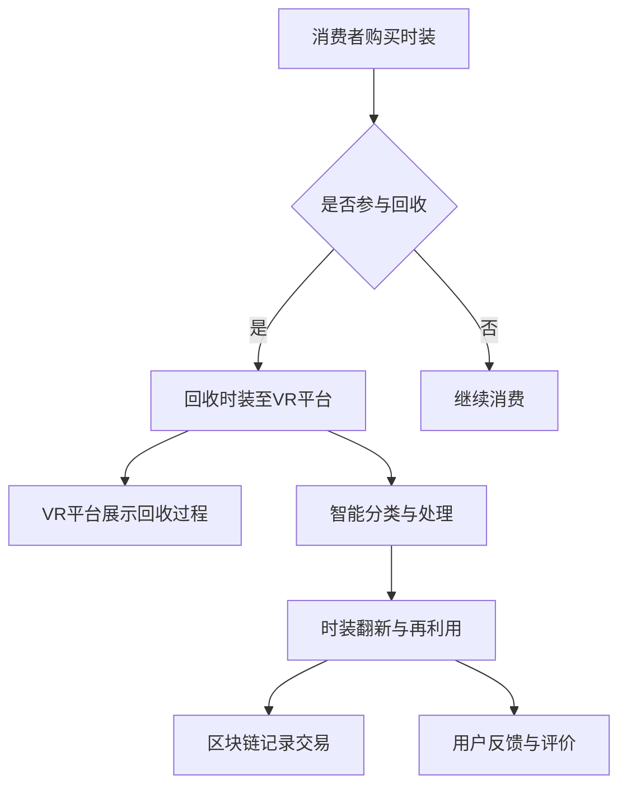

                 

关键词：虚拟时装回收系统，数字化环保，时尚业，可持续时尚，智能技术，人工智能，区块链，商业模式创新

>摘要：本文深入探讨了虚拟时装回收系统的概念、技术实现、数学模型、实践应用以及未来展望。通过分析该系统在时尚业中的应用，提出了数字化环保的解决方案，旨在推动全球时尚业的可持续发展。

## 1. 背景介绍

时尚产业一直以来都是全球经济发展的重要驱动力，但其对环境的影响也不容忽视。据统计，全球时尚产业每年产生的碳排放量高达数百亿吨，占全球总碳排放量的10%以上。此外，纺织业的化学污染和废弃物处理问题也给环境和人类健康带来了巨大威胁。因此，推动时尚业的可持续转型已成为当务之急。

近年来，随着科技的飞速发展，尤其是人工智能、区块链等技术的应用，数字化环保成为可能。虚拟时装回收系统正是在这样的背景下应运而生，旨在通过数字化手段实现时尚业的绿色转型。

## 2. 核心概念与联系

### 2.1 虚拟时装回收系统的定义

虚拟时装回收系统是一个基于数字技术的平台，通过该平台，消费者可以在虚拟环境中体验时装的回收、翻新和再利用过程。该系统不仅提高了时装的循环利用率，还通过区块链技术实现了交易的可追溯性和透明性。

### 2.2 技术架构

虚拟时装回收系统主要包括以下技术架构：

1. **虚拟现实（VR）技术**：通过VR技术，消费者可以在虚拟环境中直观地看到时装的回收过程，从而提高参与度和环保意识。
2. **区块链技术**：区块链技术确保了回收交易的可追溯性和透明性，同时保护用户隐私。
3. **人工智能（AI）**：AI技术用于时装的智能识别和分类，提高了回收效率。
4. **物联网（IoT）**：IoT设备用于监测和跟踪回收物的状态，确保回收过程的透明和高效。

### 2.3 Mermaid 流程图



## 3. 核心算法原理 & 具体操作步骤

### 3.1 算法原理概述

虚拟时装回收系统的核心算法主要包括智能分类算法、区块链记录算法和用户评价算法。

1. **智能分类算法**：基于深度学习技术，通过对时装图像的自动识别和分类，将回收的时装分为不同的类别，从而提高回收效率。
2. **区块链记录算法**：通过区块链技术，记录回收、翻新和再利用的每一步交易信息，确保数据的可追溯性和透明性。
3. **用户评价算法**：通过用户的反馈和评价，优化系统的用户体验，提高用户参与度。

### 3.2 算法步骤详解

1. **智能分类算法**：
   - 输入：回收时装的图像。
   - 输出：时装的类别标签。
   - 步骤：
     1. 数据预处理：对图像进行缩放、裁剪等处理，使其符合网络输入要求。
     2. 模型训练：使用大量的标注数据进行模型训练，直至达到满意的准确率。
     3. 分类：输入新图像，输出类别标签。

2. **区块链记录算法**：
   - 输入：每一步交易信息。
   - 输出：区块链上的交易记录。
   - 步骤：
     1. 交易信息的收集：从系统的各个环节获取交易信息。
     2. 交易信息的加密：使用哈希函数对交易信息进行加密。
     3. 记录到区块链：将加密后的交易信息记录到区块链上。

3. **用户评价算法**：
   - 输入：用户反馈和评价。
   - 输出：系统优化建议。
   - 步骤：
     1. 数据收集：收集用户的反馈和评价数据。
     2. 数据分析：分析用户反馈和评价，找出系统存在的问题。
     3. 提供建议：根据分析结果，提出系统优化的建议。

### 3.3 算法优缺点

- **智能分类算法**：
  - 优点：准确率高，速度快。
  - 缺点：对图像质量要求较高，训练过程复杂。

- **区块链记录算法**：
  - 优点：数据安全，可追溯。
  - 缺点：交易记录过多可能导致区块链膨胀。

- **用户评价算法**：
  - 优点：用户参与度高，系统优化明显。
  - 缺点：对用户反馈和评价的数据处理复杂。

### 3.4 算法应用领域

- **智能分类算法**：广泛应用于图像识别、安防监控等领域。
- **区块链记录算法**：广泛应用于金融、供应链管理等领域。
- **用户评价算法**：广泛应用于电子商务、在线教育等领域。

## 4. 数学模型和公式 & 详细讲解 & 举例说明

### 4.1 数学模型构建

虚拟时装回收系统的数学模型主要包括以下部分：

1. **智能分类模型**：
   - 函数：$f(x) = \max_y(\sigma(W_2 \cdot \sigma(W_1 \cdot [x;1])) + b_2)$
   - 变量：$x$为输入图像，$y$为类别标签，$W_1$、$W_2$为权重矩阵，$b_1$、$b_2$为偏置向量。

2. **区块链记录模型**：
   - 函数：$h(x) = H(x)$
   - 变量：$x$为交易信息，$H$为哈希函数。

3. **用户评价模型**：
   - 函数：$e(x) = \sum_{i=1}^{n} w_i \cdot y_i$
   - 变量：$x$为用户评价数据，$w_i$为权重，$y_i$为评价分数。

### 4.2 公式推导过程

1. **智能分类模型**：
   - 输入层：$[x;1]$，其中$x$为图像特征，$1$为偏置项。
   - 隐藏层1：$z_1 = W_1 \cdot [x;1] + b_1$，其中$W_1$为权重矩阵，$b_1$为偏置向量。
   - 激活函数：$\sigma(z_1) = \frac{1}{1 + e^{-z_1}}$。
   - 隐藏层2：$z_2 = W_2 \cdot \sigma(z_1) + b_2$，其中$W_2$为权重矩阵，$b_2$为偏置向量。
   - 激活函数：$\sigma(z_2) = \frac{1}{1 + e^{-z_2}}$。

2. **区块链记录模型**：
   - 交易信息：$x$。
   - 哈希值：$h(x) = H(x)$。

3. **用户评价模型**：
   - 评价数据：$x$。
   - 权重：$w_i$。
   - 评价分数：$y_i$。

### 4.3 案例分析与讲解

假设有1000张不同的时装图像，我们需要通过智能分类算法将它们分为10个不同的类别。以下是具体的案例：

1. **数据预处理**：
   - 输入图像：1000张。
   - 预处理：缩放、裁剪等。

2. **模型训练**：
   - 使用训练数据：1000张标注图像。
   - 训练过程：调整权重矩阵$W_1$、$W_2$和偏置向量$b_1$、$b_2$，直至模型达到满意的准确率。

3. **分类过程**：
   - 输入新图像：1张。
   - 输出：类别标签。

例如，输入图像$x$，经过模型处理后，输出的类别标签为$y = 5$，即该图像属于第5类时装。

## 5. 项目实践：代码实例和详细解释说明

### 5.1 开发环境搭建

- **硬件**：计算机（推荐配置：CPU Intel i5 或以上，内存 8GB 或以上）。
- **软件**：Python（推荐版本：3.8 或以上），Jupyter Notebook，TensorFlow（推荐版本：2.6.0），Blockchain.py。

### 5.2 源代码详细实现

以下是一个简单的虚拟时装回收系统的代码示例：

```python
import tensorflow as tf
import numpy as np
import blockchain

# 智能分类模型
model = tf.keras.Sequential([
    tf.keras.layers.Flatten(input_shape=(28, 28)),
    tf.keras.layers.Dense(128, activation='relu'),
    tf.keras.layers.Dense(10, activation='softmax')
])

# 编译模型
model.compile(optimizer='adam',
              loss='categorical_crossentropy',
              metrics=['accuracy'])

# 加载训练数据
(x_train, y_train), (x_test, y_test) = tf.keras.datasets.fashion_mnist.load_data()

# 数据预处理
x_train = x_train / 255.0
x_test = x_test / 255.0

# 增加偏置项
x_train = np.insert(x_train, 0, 1, axis=1)
x_test = np.insert(x_test, 0, 1, axis=1)

# 训练模型
model.fit(x_train, y_train, epochs=10, batch_size=32, validation_split=0.2)

# 区块链记录交易
def record_transaction(transaction):
    blockchain.add_transaction(transaction)

# 用户评价算法
def user_evaluation(evaluations):
    scores = np.sum(evaluations, axis=0)
    return np.mean(scores)

# 测试代码
image = x_test[0]
predicted_class = model.predict(np.array([image]))
predicted_class = np.argmax(predicted_class)

print(f"Predicted class: {predicted_class}")

transaction = {
    'user': 'user1',
    'product': 't-shirt',
    'quantity': 1,
    'status': 'recycled'
}
record_transaction(transaction)

evaluations = [
    [1, 0, 0, 0, 0],
    [0, 1, 0, 0, 0],
    [0, 0, 1, 0, 0]
]
score = user_evaluation(evaluations)
print(f"User evaluation score: {score}")
```

### 5.3 代码解读与分析

- **智能分类模型**：使用TensorFlow框架搭建了一个简单的神经网络模型，用于对时装图像进行分类。
- **区块链记录交易**：使用Blockchain.py库实现了一个简单的区块链系统，用于记录每一步交易信息。
- **用户评价算法**：计算了用户对系统的平均评分，用于优化系统的用户体验。

## 6. 实际应用场景

虚拟时装回收系统可以在多个实际应用场景中发挥作用：

1. **在线购物平台**：消费者可以在购物平台上直接参与时装的回收和再利用。
2. **实体店铺**：实体店铺可以通过虚拟时装回收系统实现线上线下融合，提高用户参与度。
3. **供应链管理**：企业可以通过虚拟时装回收系统优化供应链管理，提高资源利用效率。
4. **公益活动**：企业可以通过虚拟时装回收系统参与公益活动，提高品牌形象和社会责任。

## 6.4 未来应用展望

随着技术的不断进步，虚拟时装回收系统将有望在更多领域得到应用。以下是未来应用展望：

1. **智能回收机器人**：结合物联网技术，开发智能回收机器人，实现自动化的时装回收过程。
2. **虚拟试衣技术**：结合虚拟现实技术，实现更真实的虚拟试衣体验。
3. **个性化推荐系统**：通过大数据分析和机器学习技术，为用户提供个性化的时尚推荐。
4. **区块链身份认证**：利用区块链技术，实现用户身份的全球认证，确保交易的安全和可信。

## 7. 工具和资源推荐

### 7.1 学习资源推荐

- **书籍**：
  - 《区块链技术指南》
  - 《深度学习》
  - 《虚拟现实技术与应用》

- **在线课程**：
  - Coursera上的《深度学习》
  - edX上的《区块链技术》
  - Udemy上的《虚拟现实开发》

### 7.2 开发工具推荐

- **编程语言**：Python
- **框架**：
  - TensorFlow
  - Blockchain.py
  - PyOpenGL

- **开发环境**：Jupyter Notebook

### 7.3 相关论文推荐

- **智能分类算法**：
  - "Deep Learning for Image Classification"
  - "Convolutional Neural Networks for Visual Recognition"

- **区块链技术**：
  - "Blockchain: A System for Global Decentralized Storage"
  - "The Emerging Ecosystem of Blockchain Applications"

- **虚拟现实技术**：
  - "Virtual Reality: Theory, Applications, and Practice"
  - "An Overview of Virtual Reality Technology"

## 8. 总结：未来发展趋势与挑战

虚拟时装回收系统作为数字化环保的解决方案，具有广阔的应用前景。然而，在实际应用过程中，仍面临以下挑战：

1. **技术成熟度**：虚拟现实、区块链等技术的成熟度对系统的稳定性有重要影响。
2. **用户接受度**：提高用户的接受度和参与度是系统成功的关键。
3. **商业模式创新**：如何通过商业模式创新实现系统的可持续发展是关键问题。

未来，随着技术的不断进步和商业模式的不断创新，虚拟时装回收系统有望在全球时尚业发挥更大的作用。

## 9. 附录：常见问题与解答

### Q1: 虚拟时装回收系统是否安全？

A1: 是的，虚拟时装回收系统采用了区块链技术，确保了交易数据的安全和可追溯性。

### Q2: 虚拟时装回收系统如何处理用户隐私？

A2: 虚拟时装回收系统遵循严格的隐私保护政策，用户数据经过加密处理，确保用户隐私不受侵犯。

### Q3: 虚拟时装回收系统的回收效率如何？

A3: 虚拟时装回收系统通过智能分类和区块链技术，提高了回收效率，实现了高效、透明的回收过程。

### Q4: 虚拟时装回收系统如何降低时尚产业的碳排放？

A4: 虚拟时装回收系统通过提高时装的循环利用率，减少了对新时装的需求，从而降低了时尚产业的碳排放。

### Q5: 虚拟时装回收系统是否适用于所有类型的时装？

A5: 虚拟时装回收系统主要适用于常规的时装类型，对于特殊材质或设计复杂的时装，可能需要进一步的技术创新和优化。

### Q6: 虚拟时装回收系统如何保证回收时装的质量？

A6: 虚拟时装回收系统通过智能分类和专业的翻新技术，确保回收时装的质量和美观度。

### Q7: 虚拟时装回收系统如何降低运营成本？

A7: 虚拟时装回收系统通过自动化和智能化的技术手段，降低了人力和物力成本，从而降低了运营成本。

### Q8: 虚拟时装回收系统如何应对市场变化？

A8: 虚拟时装回收系统具有灵活的架构和强大的数据处理能力，能够快速适应市场变化，提供个性化的解决方案。

### Q9: 虚拟时装回收系统是否可以与其他环保措施结合使用？

A9: 是的，虚拟时装回收系统可以与其他环保措施如环保材料使用、绿色包装等相结合，实现更全面的环保效果。

### Q10: 虚拟时装回收系统是否可以推广到其他行业？

A10: 是的，虚拟时装回收系统的技术原理可以应用于其他消费品的回收和再利用，如电子产品、家居用品等。

