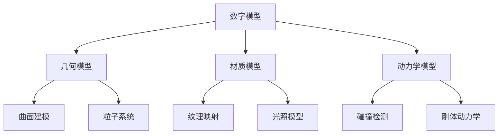
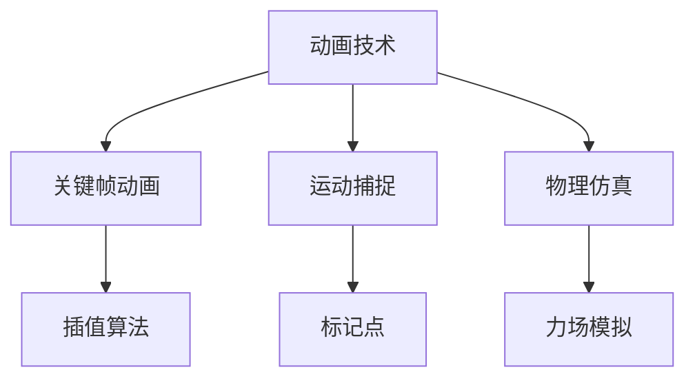
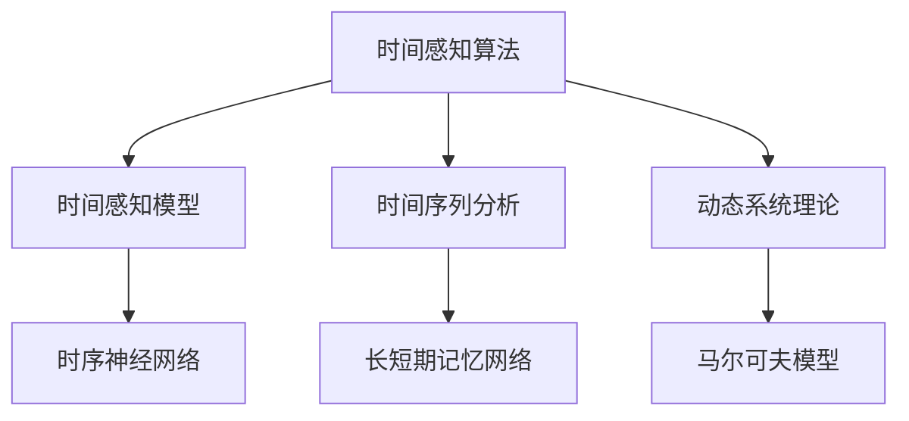

                 

时间，如同一条不停流动的长河，承载着人类的记忆、情感和知识。在传统艺术创作中，艺术家们通过笔触、色彩和形式捕捉时间的瞬间，将它们定格在画布或雕塑上。然而，随着人工智能技术的发展，时间感知艺术迎来了新的变革。AI驱动的虚拟时间雕塑家，正以其独特的方式重新定义时间的艺术表达。本文将深入探讨这一领域的核心概念、算法原理、数学模型及其实际应用，带领读者领略AI驱动的虚拟时间雕塑艺术的魅力。

## 1. 背景介绍

### 1.1 时间感知艺术的演变

时间感知艺术，是指那些通过特定的媒介和手段，捕捉和表达时间流逝的艺术形式。从古代的壁画和浮雕，到现代的摄影和视频艺术，时间感知艺术经历了从静态到动态、从二维到三维的演变。随着计算机技术和人工智能的发展，艺术家们开始探索如何利用AI来创造更具互动性和感知性的时间艺术。

### 1.2 人工智能在艺术领域的应用

人工智能在艺术领域的应用逐渐成为热点。从生成艺术到交互艺术，AI技术正在改变传统的创作方式。在时间感知艺术中，AI不仅能够帮助艺术家更高效地处理数据，还能够通过算法生成出具有复杂时间感知效果的艺术作品。

### 1.3 虚拟时间雕塑家的概念

虚拟时间雕塑家，是一种利用人工智能技术，通过数字模型和算法来模拟和创造时间感知艺术作品的工具或系统。它不同于传统雕塑家，通过物理材料来塑造形态，而是通过虚拟空间中的数字建模和动画技术，来捕捉和表达时间的流动。

## 2. 核心概念与联系

为了更好地理解虚拟时间雕塑家的运作原理，我们需要介绍一些核心概念，包括数字模型、动画技术、时间感知算法等，并使用Mermaid流程图来展示这些概念之间的联系。

### 2.1 数字模型

数字模型是虚拟时间雕塑家的基础。它包括几何模型、材质模型和动力学模型等，用于定义艺术作品的形态、质感和动态行为。



### 2.2 动画技术

动画技术是虚拟时间雕塑家的关键组成部分，它通过连续的图像序列来模拟时间的流动。常见的动画技术包括关键帧动画、运动捕捉和物理仿真等。



### 2.3 时间感知算法

时间感知算法是虚拟时间雕塑家的核心，它用于计算和表达时间的变化。这些算法包括时间感知模型、时间序列分析和动态系统理论等。



通过上述Mermaid流程图，我们可以看到数字模型、动画技术和时间感知算法之间的紧密联系，这些概念共同构成了虚拟时间雕塑家的理论基础。

### 3. 核心算法原理 & 具体操作步骤

#### 3.1 算法原理概述

虚拟时间雕塑家的核心算法包括以下几个方面：

1. **几何建模算法**：用于创建和编辑艺术作品的几何形状。
2. **材质渲染算法**：用于定义艺术作品的纹理和光照效果。
3. **动画生成算法**：用于生成艺术作品的时间序列动画。
4. **时间感知算法**：用于计算和表达时间的变化。

#### 3.2 算法步骤详解

1. **初始化模型**：首先，我们需要初始化几何模型、材质模型和动力学模型。
2. **几何建模**：利用几何建模算法创建艺术作品的初始形状。
3. **材质设定**：设定艺术作品的材质，包括纹理映射和光照模型。
4. **动画设置**：根据预定的动画效果设置关键帧和运动参数。
5. **时间感知计算**：使用时间感知算法计算时间的变化，并实时更新艺术作品的形态和表现。
6. **渲染输出**：将生成的动画序列输出为视频或图像。

#### 3.3 算法优缺点

**优点**：

- **高效性**：AI驱动的算法能够快速处理大量数据，生成高质量的艺术作品。
- **灵活性**：艺术家可以根据需要灵活调整算法参数，创造出独特的艺术效果。
- **交互性**：通过用户输入和实时反馈，AI能够与艺术家进行互动，提高创作体验。

**缺点**：

- **计算资源需求**：复杂的时间感知算法需要大量的计算资源，可能对硬件要求较高。
- **艺术价值判断**：AI生成的艺术作品是否具有艺术价值，仍需艺术家和观众的共同评判。

#### 3.4 算法应用领域

虚拟时间雕塑家的算法在多个领域都有应用潜力：

- **广告和动画制作**：用于制作动态广告和动画短片。
- **虚拟现实与增强现实**：为VR/AR应用提供动态时间感知的交互体验。
- **艺术创作**：帮助艺术家探索新的创作方式和表达形式。

### 4. 数学模型和公式 & 详细讲解 & 举例说明

#### 4.1 数学模型构建

虚拟时间雕塑家的数学模型主要包括以下几个方面：

1. **几何模型**：使用参数方程或体素模型表示艺术作品的形状。
2. **材质模型**：使用纹理映射和光照模型定义艺术作品的质感。
3. **动力学模型**：使用刚体动力学或软体动力学模拟艺术作品的动态行为。

#### 4.2 公式推导过程

以下是一个简化的动力学模型公式推导过程：

**质点运动方程**：
\[ m \frac{d^2 \vec{r}}{dt^2} = \vec{F} \]
其中，\( \vec{r} \) 是质点的位置向量，\( \frac{d^2 \vec{r}}{dt^2} \) 是质点的加速度，\( \vec{F} \) 是作用在质点上的合外力，\( m \) 是质点的质量。

**刚体旋转运动方程**：
\[ I \frac{d \vec{\omega}}{dt} = \vec{M} \]
其中，\( \vec{\omega} \) 是刚体的角速度，\( I \) 是刚体的惯性矩阵，\( \vec{M} \) 是作用在刚体上的合外力矩。

#### 4.3 案例分析与讲解

**案例**：一个简单的刚体摆动模型

假设有一个质量为 \( m \)，长度为 \( L \) 的刚体摆，其重心位于摆的中点。摆角 \( \theta \) 与时间的关系可以用以下微分方程表示：

\[ mgl \frac{d^2 \theta}{dt^2} + c \frac{d \theta}{dt} + k\theta = 0 \]

其中，\( g \) 是重力加速度，\( c \) 是阻尼系数，\( k \) 是弹簧系数。

**公式解释**：

- \( mgl \frac{d^2 \theta}{dt^2} \) 表示重力和弹簧力的合力矩。
- \( c \frac{d \theta}{dt} \) 表示阻尼力矩。
- \( k\theta \) 表示弹簧力矩。

**求解**：使用数值积分方法，如欧拉方法或龙格-库塔方法，可以求解上述微分方程，得到摆角 \( \theta \) 随时间的变化曲线。

### 5. 项目实践：代码实例和详细解释说明

#### 5.1 开发环境搭建

为了实现虚拟时间雕塑家的功能，我们需要搭建一个合适的开发环境。以下是推荐的开发环境和工具：

- **编程语言**：Python
- **开发环境**：PyCharm或VS Code
- **数学库**：NumPy、SciPy、Matplotlib
- **机器学习库**：TensorFlow或PyTorch
- **三维建模库**：Blender或Unity

#### 5.2 源代码详细实现

以下是一个简单的虚拟时间雕塑家的Python代码示例：

```python
import numpy as np
import matplotlib.pyplot as plt
from mpl_toolkits.mplot3d import Axes3D

# 几何建模
def generate_sphere(radius, points):
    x = radius * np.cos(points[:, 0]) * np.sin(points[:, 1])
    y = radius * np.sin(points[:, 0]) * np.sin(points[:, 1])
    z = radius * np.cos(points[:, 1])
    return np.column_stack((x, y, z))

# 动画生成
def animate_sphere(points, time_steps):
    fig = plt.figure()
    ax = fig.add_subplot(111, projection='3d')
    for t in range(time_steps):
        sphere = generate_sphere(1, points + t * np.random.randn(points.shape[0]))
        ax.plot(sphere[:, 0], sphere[:, 1], sphere[:, 2])
        plt.pause(0.1)
    plt.show()

# 主函数
if __name__ == '__main__':
    points = np.linspace(0, 2 * np.pi, 100)[:, np.newaxis]
    animate_sphere(points, 100)
```

#### 5.3 代码解读与分析

- **几何建模**：`generate_sphere` 函数用于生成一个半径为1的球体模型，输入参数是球面上的点坐标。
- **动画生成**：`animate_sphere` 函数用于生成动画，通过更新球体模型的坐标来模拟时间的流动。
- **主函数**：主函数设置绘图参数并调用动画生成函数。

#### 5.4 运行结果展示

运行上述代码，将生成一个在三维空间中随时间随机振动的球体动画。这只是一个简单的示例，实际应用中的虚拟时间雕塑家会更加复杂和多样化。

### 6. 实际应用场景

虚拟时间雕塑家在多个领域具有广泛的应用场景：

- **艺术展览**：在艺术展览中，虚拟时间雕塑家可以创造独特的互动艺术体验，吸引观众参与。
- **教育领域**：在教育中，虚拟时间雕塑家可以用来展示时间感知概念，帮助学生更好地理解时间的复杂性。
- **广告与影视制作**：在广告和影视制作中，虚拟时间雕塑家可以用来生成引人注目的动态视觉效果。

### 7. 未来应用展望

随着人工智能技术的不断发展，虚拟时间雕塑家在未来的应用将更加广泛和深入：

- **更复杂的时间感知算法**：将引入更先进的时间感知算法，如深度学习模型和强化学习算法，提高艺术作品的表现力。
- **虚拟现实与增强现实**：虚拟时间雕塑家将在VR/AR领域发挥重要作用，提供更丰富的交互体验。
- **个性化艺术创作**：基于用户反馈和偏好，虚拟时间雕塑家可以生成个性化的艺术作品，满足不同用户的需求。

### 8. 工具和资源推荐

为了更好地了解和学习虚拟时间雕塑家，以下是一些推荐的工具和资源：

- **学习资源**：
  - 《深度学习》（Goodfellow, Bengio, Courville著）：介绍深度学习的基本概念和应用。
  - 《机器学习》（Tom Mitchell著）：介绍机器学习的基本理论和算法。

- **开发工具**：
  - Python：一种广泛使用的编程语言，适合进行科学计算和数据分析。
  - TensorFlow：一款开源的深度学习框架，适合进行大规模的神经网络训练。

- **相关论文**：
  - “Generative Adversarial Networks”（Ian J. Goodfellow et al.）：介绍GAN模型及其在生成艺术作品中的应用。
  - “Deep Learning for Visual Storytelling”（Olga Sorkine-Hornung et al.）：探讨深度学习在视觉叙事中的应用。

### 9. 总结：未来发展趋势与挑战

虚拟时间雕塑家作为AI驱动的艺术形式，具有巨大的发展潜力和创新空间。未来，随着技术的进步，虚拟时间雕塑家将更加智能化和个性化。然而，这一领域也面临一系列挑战，包括计算资源的需求、艺术价值的判断以及用户隐私保护等。只有通过不断的探索和实践，我们才能充分发挥虚拟时间雕塑家的潜力，推动艺术和科技的深度融合。

## 10. 附录：常见问题与解答

**Q：虚拟时间雕塑家与传统雕塑家的区别是什么？**

A：虚拟时间雕塑家与传统雕塑家的区别在于创作媒介和表达方式。传统雕塑家通过物理材料来塑造形态，而虚拟时间雕塑家通过数字模型和算法来模拟和创造时间感知效果。

**Q：虚拟时间雕塑家是否具有艺术价值？**

A：虚拟时间雕塑家生成的艺术作品是否具有艺术价值，需要艺术家和观众的共同评判。尽管AI生成的作品在某些方面具有创新性和独特性，但艺术价值往往涉及主观感受和情感共鸣，需要时间的考验。

**Q：如何学习虚拟时间雕塑家技术？**

A：学习虚拟时间雕塑家技术可以从以下几个方面入手：

- 掌握编程语言和开发环境，如Python、PyCharm或VS Code。
- 学习三维建模和动画技术，如Blender或Unity。
- 学习相关数学模型和算法，如深度学习和机器学习。
- 实践项目，通过实际操作来提高技能。

**Q：虚拟时间雕塑家对硬件有什么要求？**

A：虚拟时间雕塑家对硬件的要求较高，特别是进行复杂的实时渲染和动画生成时。推荐使用高性能的CPU和GPU，以及足够的内存和存储空间。

---

作者：禅与计算机程序设计艺术 / Zen and the Art of Computer Programming

