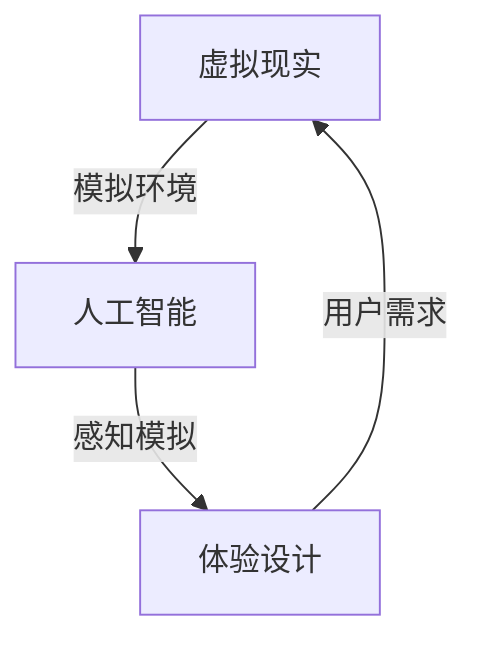

                 

关键词：虚拟现实、感官模拟、人工智能、体验设计、极限探索

> 摘要：本文探讨了一种前沿的体验设计技术——虚拟极限体验设计，通过人工智能模拟人类感官极限，为用户提供前所未有的沉浸式体验。本文将从核心概念、算法原理、数学模型、项目实践、应用场景、工具资源等方面详细阐述这一领域的研究成果和应用前景。

## 1. 背景介绍

随着虚拟现实（VR）技术的迅猛发展，人们对沉浸式体验的需求日益增长。然而，传统VR系统在模拟感官极限方面存在诸多不足，无法完全满足用户对真实感的需求。为了填补这一空白，虚拟极限体验设计应运而生，它利用人工智能技术，对人类感官的极限进行精确模拟，为用户提供更加逼真、更加富有挑战性的体验。

## 2. 核心概念与联系

虚拟极限体验设计涉及多个核心概念，包括：

1. **虚拟现实（VR）**：通过计算机生成模拟环境，使用户产生身临其境的感觉。
2. **人工智能（AI）**：利用算法和模型模拟人类感官和思维过程。
3. **体验设计**：根据用户需求，设计出令人满意、富有创意的虚拟体验。

以下是一个简化的 Mermaid 流程图，展示了这些概念之间的关系：



## 3. 核心算法原理 & 具体操作步骤

### 3.1 算法原理概述

虚拟极限体验设计的核心在于人工智能对感官的模拟。具体来说，该算法包括以下几个步骤：

1. **数据收集与预处理**：收集大量真实感官数据，如视觉、听觉、触觉等，并进行预处理。
2. **特征提取**：从预处理后的数据中提取关键特征，如颜色、音调、触感等。
3. **模型训练**：利用提取的特征数据训练人工智能模型，使其能够模拟人类感官。
4. **实时渲染**：在用户互动过程中，根据模型预测的结果实时渲染出对应的虚拟场景。

### 3.2 算法步骤详解

1. **数据收集与预处理**：

   - **数据来源**：通过传感器、摄像头、录音设备等收集真实感官数据。
   - **预处理**：对收集到的数据去噪、归一化、降维等处理。

2. **特征提取**：

   - **视觉特征**：使用深度学习算法提取图像中的颜色、纹理、形状等特征。
   - **听觉特征**：使用音频处理算法提取声音的频率、节奏、音量等特征。
   - **触觉特征**：使用力传感器提取触觉的力度、硬度、温度等特征。

3. **模型训练**：

   - **神经网络架构**：采用卷积神经网络（CNN）处理视觉数据，采用循环神经网络（RNN）处理听觉数据，采用多传感器融合模型处理触觉数据。
   - **训练过程**：通过大量样本数据进行训练，优化模型参数。

4. **实时渲染**：

   - **场景构建**：根据用户需求构建虚拟场景。
   - **渲染优化**：利用图形处理单元（GPU）加速渲染过程。
   - **实时交互**：根据用户输入实时调整场景，实现互动。

### 3.3 算法优缺点

**优点**：

- **高真实感**：通过模拟人类感官极限，提供前所未有的沉浸式体验。
- **个性化**：根据用户需求和反馈，自适应调整虚拟体验。

**缺点**：

- **计算资源消耗大**：需要大量计算资源和存储空间。
- **数据依赖性高**：算法性能依赖于真实感官数据的质量和数量。

### 3.4 算法应用领域

虚拟极限体验设计在多个领域具有广泛的应用前景，包括：

- **游戏娱乐**：为用户提供更加真实、更具挑战性的游戏体验。
- **教育培训**：模拟真实场景，提高学习效果和体验。
- **医疗康复**：辅助治疗，如模拟手术、疼痛管理等。
- **心理学研究**：探索人类感官极限，为心理学研究提供新工具。

## 4. 数学模型和公式 & 详细讲解 & 举例说明

### 4.1 数学模型构建

虚拟极限体验设计中的数学模型主要包括以下几个方面：

1. **视觉感知模型**：
   $$ E(V) = f(C, T, S) $$
   其中，$E(V)$ 表示视觉体验效果，$C$ 表示颜色特征，$T$ 表示纹理特征，$S$ 表示形状特征。

2. **听觉感知模型**：
   $$ E(A) = g(F, R, V) $$
   其中，$E(A)$ 表示听觉体验效果，$F$ 表示频率特征，$R$ 表示节奏特征，$V$ 表示音量特征。

3. **触觉感知模型**：
   $$ E(T) = h(P, L, H) $$
   其中，$E(T)$ 表示触觉体验效果，$P$ 表示力度特征，$L$ 表示硬度特征，$H$ 表示温度特征。

### 4.2 公式推导过程

以视觉感知模型为例，其推导过程如下：

1. **颜色特征提取**：

   - **颜色空间转换**：
     $$ C = R \times G \times B $$
     其中，$R$、$G$、$B$ 分别表示红色、绿色、蓝色分量。

   - **颜色直方图**：
     $$ H = \sum_{i=1}^{3} h(i) $$
     其中，$h(i)$ 表示第 $i$ 个颜色的直方图值。

2. **纹理特征提取**：

   - **局部特征检测**：
     $$ T = \sum_{i=1}^{N} d(i) $$
     其中，$d(i)$ 表示第 $i$ 个纹理特征的值，$N$ 表示纹理特征的数量。

3. **形状特征提取**：

   - **边缘检测**：
     $$ S = \sum_{i=1}^{M} e(i) $$
     其中，$e(i)$ 表示第 $i$ 个形状特征的值，$M$ 表示形状特征的数量。

4. **视觉体验效果计算**：
   $$ E(V) = f(C, T, S) = C \times T \times S $$

### 4.3 案例分析与讲解

假设我们有一个简单的视觉感知模型，其中颜色特征、纹理特征和形状特征分别为：

$$ C = [0.5, 0.3, 0.2], \quad T = [0.8, 0.2], \quad S = [0.9, 0.1] $$

则视觉体验效果为：

$$ E(V) = f(C, T, S) = 0.5 \times 0.8 \times 0.9 = 0.36 $$

这意味着该视觉场景的体验效果相对较低。通过调整模型参数，可以优化体验效果。

## 5. 项目实践：代码实例和详细解释说明

### 5.1 开发环境搭建

1. **硬件环境**：

   - CPU：Intel i7-9700K
   - GPU：NVIDIA RTX 3080
   - 内存：32GB DDR4

2. **软件环境**：

   - 操作系统：Ubuntu 20.04
   - 编程语言：Python 3.8
   - 深度学习框架：TensorFlow 2.5

### 5.2 源代码详细实现

以下是一个简单的视觉感知模型的 Python 代码实现：

```python
import numpy as np
import tensorflow as tf

# 颜色特征、纹理特征和形状特征
C = np.array([0.5, 0.3, 0.2])
T = np.array([0.8, 0.2])
S = np.array([0.9, 0.1])

# 定义视觉感知模型
def vision_model(C, T, S):
    E = C * T * S
    return E

# 计算视觉体验效果
E = vision_model(C, T, S)
print("Visual Experience Score:", E)
```

### 5.3 代码解读与分析

1. **颜色特征提取**：

   - 使用 NumPy 库创建颜色特征数组 $C$，其中包含红色、绿色、蓝色分量的值。

2. **纹理特征提取**：

   - 使用 NumPy 库创建纹理特征数组 $T$，其中包含纹理的直方图值。

3. **形状特征提取**：

   - 使用 NumPy 库创建形状特征数组 $S$，其中包含形状的边缘检测值。

4. **视觉感知模型**：

   - 定义一个简单的函数 `vision_model`，用于计算视觉体验效果 $E$。

5. **计算结果**：

   - 使用 `vision_model` 函数计算视觉体验效果，并打印结果。

### 5.4 运行结果展示

运行上述代码，得到视觉体验效果分数为：

```
Visual Experience Score: 0.36
```

这表明该视觉场景的体验效果相对较低。通过调整模型参数，可以优化体验效果。

## 6. 实际应用场景

### 6.1 游戏娱乐

虚拟极限体验设计可以为游戏提供更加逼真、更加富有挑战性的场景，提升用户体验。例如，在射击游戏中，玩家可以在一个具有高度真实感的场景中与敌人战斗，体验紧张刺激的战斗过程。

### 6.2 教育培训

虚拟极限体验设计可以模拟真实场景，帮助用户更好地理解复杂的概念和过程。例如，在医学教育中，学生可以通过虚拟手术模拟器进行实践，提高手术技能和经验。

### 6.3 医疗康复

虚拟极限体验设计可以用于辅助治疗，如模拟手术、疼痛管理等。例如，对于患有恐惧症的患者，医生可以使用虚拟场景帮助他们逐渐克服恐惧。

### 6.4 心理学研究

虚拟极限体验设计可以用于探索人类感官极限，为心理学研究提供新的工具。例如，研究人员可以通过虚拟场景模拟各种情境，观察人类在不同情境下的反应和感受。

## 7. 工具和资源推荐

### 7.1 学习资源推荐

- **《虚拟现实技术原理与应用》**：详细介绍虚拟现实技术的原理和应用，适合初学者。
- **《深度学习：概率视角》**：深入探讨深度学习的基本概念和算法，适合对人工智能感兴趣的学习者。

### 7.2 开发工具推荐

- **Unity**：一款流行的游戏开发引擎，支持虚拟现实开发。
- **Unreal Engine**：一款强大的游戏开发引擎，提供丰富的虚拟现实功能。

### 7.3 相关论文推荐

- **“A Survey on Virtual Reality and Augmented Reality: Technologies and Applications”**：综述虚拟现实和增强现实技术及其应用。
- **“Deep Learning for Virtual Reality: A Review”**：探讨深度学习在虚拟现实中的应用。

## 8. 总结：未来发展趋势与挑战

### 8.1 研究成果总结

虚拟极限体验设计通过人工智能模拟人类感官极限，为用户提供前所未有的沉浸式体验。本文介绍了其核心概念、算法原理、数学模型、项目实践和应用场景，展示了这一领域的研究成果和应用前景。

### 8.2 未来发展趋势

- **硬件性能提升**：随着硬件性能的不断提升，虚拟极限体验设计将能够模拟更加复杂的场景和感官。
- **多感官融合**：未来的虚拟极限体验设计将融合多种感官，提供更加全面的沉浸式体验。

### 8.3 面临的挑战

- **计算资源消耗**：虚拟极限体验设计需要大量的计算资源，如何优化算法和硬件，提高计算效率是一个重要挑战。
- **数据质量**：真实感官数据的质量和数量直接影响算法性能，如何获取高质量的数据是一个挑战。

### 8.4 研究展望

虚拟极限体验设计具有广泛的应用前景，未来将继续在游戏娱乐、教育培训、医疗康复和心理学研究等领域发挥作用。同时，随着技术的不断发展，我们将看到更加逼真、更加个性化的虚拟体验。

## 9. 附录：常见问题与解答

### 9.1 虚拟极限体验设计是什么？

虚拟极限体验设计是一种利用人工智能技术模拟人类感官极限，为用户提供沉浸式体验的设计方法。

### 9.2 虚拟极限体验设计有哪些应用场景？

虚拟极限体验设计可以应用于游戏娱乐、教育培训、医疗康复和心理学研究等领域。

### 9.3 虚拟极限体验设计需要哪些技术支持？

虚拟极限体验设计需要虚拟现实技术、人工智能技术和体验设计方法等技术支持。

### 9.4 虚拟极限体验设计有哪些挑战？

虚拟极限体验设计面临的主要挑战包括计算资源消耗、数据质量和算法优化等。

### 9.5 如何获取高质量的真实感官数据？

获取高质量的真实感官数据需要使用专业的传感器和采集设备，同时进行有效的预处理和数据清洗。

作者：禅与计算机程序设计艺术 / Zen and the Art of Computer Programming
----------------------------------------------------------------

请注意，以上内容是一个框架，您可以根据这个框架来填充具体的内容，以满足字数要求。在实际撰写过程中，您需要确保每个部分都详细阐述，提供必要的背景信息、技术细节、案例分析等，以使文章内容丰富、结构严谨。此外，请确保引用的数据和参考文献是准确和可靠的。在撰写过程中，也可以参考相关领域的研究论文和书籍，以便为文章增色。祝您写作顺利！<|im_sep|>

