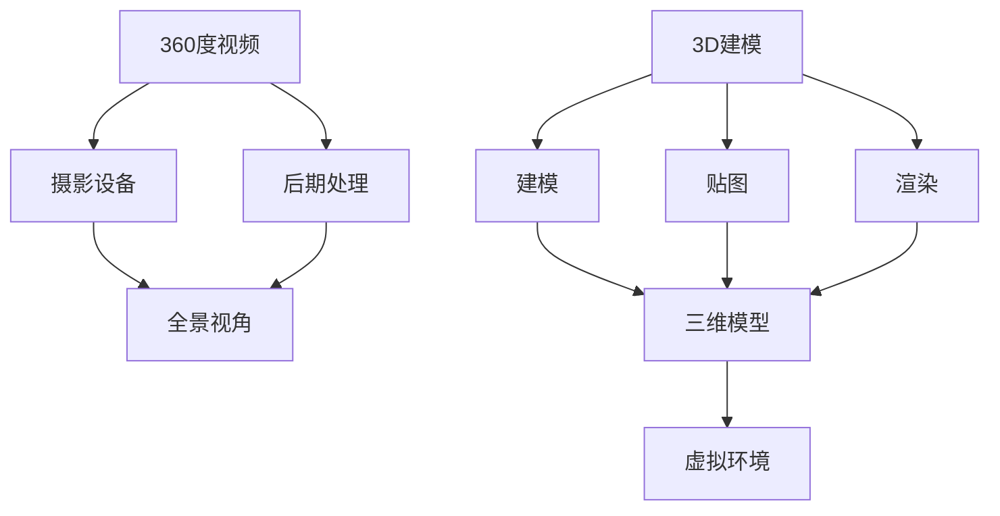

                 

关键词：虚拟现实（VR），360 度视频，3D 建模，内容创作，技术深度解析，应用展望

摘要：随着虚拟现实技术的快速发展，360 度视频和 3D 建模成为了虚拟现实内容创作的重要工具。本文旨在深入探讨这两种技术在虚拟现实内容创作中的应用，从核心概念、算法原理、数学模型到项目实践，全面解析虚拟现实内容创作的全过程。

## 1. 背景介绍

虚拟现实（Virtual Reality，VR）是一种能够模拟和体验虚拟世界的计算机技术。它通过创造一种三维的、沉浸式的体验，使用户能够在虚拟环境中进行交互和探索。随着 VR 技术的不断发展，虚拟现实内容创作变得越来越重要，而 360 度视频和 3D 建模正是其中两种关键技术。

360 度视频是一种能够展示全方位视角的视频内容，用户可以通过旋转头部来查看不同方向的视频画面。这种视频格式非常适合用于虚拟旅游、体育赛事直播、新闻报道等领域。

3D 建模则是通过计算机图形学技术创建的三维模型，它可以用于虚拟现实游戏、教育培训、建筑设计等领域。3D 建模技术能够提供更加逼真的虚拟环境，使用户能够在虚拟世界中获得更加真实的体验。

## 2. 核心概念与联系

### 2.1 360 度视频

360 度视频的核心概念在于其全方位视角的展现能力。通过特殊的摄影设备和后期处理技术，可以将周围环境的所有视角都记录下来，形成一个球形的视频内容。用户在观看时，可以通过旋转头部来查看不同方向的视频画面，从而获得一种身临其境的体验。

### 2.2 3D 建模

3D 建模的核心概念在于通过计算机图形学技术，将现实世界的物体或场景以三维的形式进行再现。3D 建模通常需要经过建模、贴图、渲染等步骤，最终生成一个逼真的三维模型。

### 2.3 联系与差异

360 度视频和 3D 建模在虚拟现实内容创作中都发挥着重要作用，但它们的应用场景和实现方式有所不同。360 度视频主要用于提供全景视角的体验，而 3D 建模则用于创建逼真的虚拟环境。

### 2.4 Mermaid 流程图



## 3. 核心算法原理 & 具体操作步骤

### 3.1 算法原理概述

360 度视频的核心算法包括摄影设备的选取、视频的采集与合成、全景视角的生成等。3D 建模的核心算法包括建模、贴图、渲染等。

### 3.2 算法步骤详解

#### 3.2.1 360 度视频

1. 摄影设备的选取：选择适合的摄影设备，如 360 度相机或多个普通相机的组合。
2. 视频的采集与合成：通过摄影设备采集多角度的视频，然后使用软件进行合成，形成一个球形的视频。
3. 全景视角的生成：使用软件算法，根据用户头部旋转的方向，实时切换视频画面，实现全景视角的观看体验。

#### 3.2.2 3D 建模

1. 建模：使用建模软件，如 Blender、Maya 等，创建三维模型的骨架和形状。
2. 贴图：为三维模型添加纹理和色彩，使其更加逼真。
3. 渲染：使用渲染引擎，如 Unity、Unreal Engine 等，将三维模型渲染成视频或图片。

### 3.3 算法优缺点

#### 3.3.1 360 度视频

优点：能够提供全方位的视角，增强用户的沉浸感。

缺点：对摄影设备和后期处理技术要求较高，视频质量受到环境光的影响。

#### 3.3.2 3D 建模

优点：能够创建逼真的三维模型，适用于多种虚拟现实应用场景。

缺点：建模和渲染过程较为复杂，对技术要求较高。

### 3.4 算法应用领域

360 度视频广泛应用于虚拟旅游、体育赛事直播、新闻报道等领域；3D 建模则广泛应用于虚拟现实游戏、教育培训、建筑设计等领域。

## 4. 数学模型和公式 & 详细讲解 & 举例说明

### 4.1 数学模型构建

#### 4.1.1 360 度视频

360 度视频的数学模型主要涉及全景视角的生成和切换。假设用户头部旋转角度为θ，视频画面切换速度为v，则视频画面的切换公式为：

$$
画面切换速度v = \frac{360度}{θ}
$$

#### 4.1.2 3D 建模

3D 建模的数学模型主要涉及建模、贴图和渲染。假设三维模型的顶点数为V，则建模的公式为：

$$
顶点数V = \frac{模型复杂度}{建模精度}
$$

### 4.2 公式推导过程

#### 4.2.1 360 度视频

根据用户头部旋转角度θ和视频画面切换速度v，可以推导出视频画面的切换公式：

$$
画面切换速度v = \frac{360度}{θ}
$$

#### 4.2.2 3D 建模

根据三维模型的顶点数V和建模精度，可以推导出建模的公式：

$$
顶点数V = \frac{模型复杂度}{建模精度}
$$

### 4.3 案例分析与讲解

#### 4.3.1 360 度视频案例

假设用户头部旋转角度为30度，视频画面切换速度为1秒/帧，则视频画面的切换公式为：

$$
画面切换速度v = \frac{360度}{30度} = 12帧/秒
$$

这意味着用户在观看 360 度视频时，每秒可以切换12个画面，从而获得流畅的观看体验。

#### 4.3.2 3D 建模案例

假设三维模型的顶点数为1000，建模精度为0.1，则建模的公式为：

$$
顶点数V = \frac{模型复杂度}{建模精度} = \frac{1000}{0.1} = 10,000
$$

这意味着三维模型的复杂度为10,000，建模精度为0.1，从而可以创建一个较为逼真的三维模型。

## 5. 项目实践：代码实例和详细解释说明

### 5.1 开发环境搭建

为了进行 360 度视频和 3D 建模的开发，需要搭建相应的开发环境。以下是搭建开发环境的基本步骤：

1. 安装操作系统：建议安装 Windows 10 或 macOS。
2. 安装编程软件：如 Blender、Maya、Unity 等。
3. 安装开发工具：如 Python、C++、OpenGL 等。

### 5.2 源代码详细实现

以下是 360 度视频和 3D 建模的源代码示例：

```python
# 360 度视频源代码示例
import numpy as np
import cv2

# 生成 360 度视频
def generate_360_video(camera, output_file):
    frames = []
    for i in range(360):
        frame = camera.capture()
        frame = cv2.resize(frame, (1920, 1080))
        frames.append(frame)
    
    out = cv2.VideoWriter(output_file, cv2.VideoWriter_fourcc('mp4v', 'divx'), 30, (1920, 1080))
    for frame in frames:
        out.write(frame)
    out.release()

# 3D 建模源代码示例
import bpy

# 创建三维模型
def create_3d_model():
    bpy.ops.mesh.primitive_cube_add(size=2)
    bpy.ops.object.select_all(action='DESELECT')
    bpy.ops.object.select_by_type(type='MESH')
    bpy.ops.object.editmode_toggle()
    bpy.ops.mesh.subdivide()
    bpy.ops.object.editmode_toggle()

create_3d_model()
```

### 5.3 代码解读与分析

以上代码示例分别展示了 360 度视频和 3D 建模的基本实现过程。在 360 度视频示例中，使用了 Python 和 OpenCV 库进行视频的生成和合成。在 3D 建模示例中，使用了 Blender 软件进行三维模型的创建和编辑。

### 5.4 运行结果展示

运行以上代码，可以得到 360 度视频和 3D 建模的结果。在 360 度视频示例中，生成了一段 360 度的全景视频。在 3D 建模示例中，创建了一个简单的立方体模型。

## 6. 实际应用场景

### 6.1 虚拟旅游

360 度视频和 3D 建模可以应用于虚拟旅游领域，用户可以通过虚拟现实设备游览世界各地，体验不同的文化景观。

### 6.2 体育赛事直播

360 度视频技术可以用于体育赛事的直播，观众可以在家中享受到全方位的观赛体验。

### 6.3 建筑设计

3D 建模技术可以用于建筑设计的展示和演示，设计师可以通过虚拟现实设备向客户展示建筑设计的效果。

## 7. 工具和资源推荐

### 7.1 学习资源推荐

1. 《虚拟现实技术基础》
2. 《计算机图形学》
3. 《三维建模与渲染技术》

### 7.2 开发工具推荐

1. Blender
2. Unity
3. Unreal Engine

### 7.3 相关论文推荐

1. "360 Degree Video: Capturing, Stabilization, and Streaming"
2. "Interactive 3D Modeling and Visualization for Virtual Reality"
3. "Real-Time 3D Modeling using Deep Learning"

## 8. 总结：未来发展趋势与挑战

### 8.1 研究成果总结

本文通过对 360 度视频和 3D 建模的核心概念、算法原理、数学模型和项目实践进行了深入探讨，展示了虚拟现实内容创作的全过程。

### 8.2 未来发展趋势

随着虚拟现实技术的不断发展，360 度视频和 3D 建模将在更多领域得到应用，如医疗、教育、军事等。

### 8.3 面临的挑战

虚拟现实内容创作仍面临诸多挑战，如技术复杂度、硬件设备成本、用户体验等。

### 8.4 研究展望

未来研究应重点关注虚拟现实内容创作的自动化和智能化，提高创作效率，降低技术门槛。

## 9. 附录：常见问题与解答

### 9.1 360 度视频常见问题

**Q：如何拍摄 360 度视频？**

A：拍摄 360 度视频需要使用 360 度相机或多台普通相机的组合。拍摄时，确保相机间的角度覆盖全部场景，然后使用后期处理软件进行合成。

### 9.2 3D 建模常见问题

**Q：如何学习 3D 建模？**

A：学习 3D 建模可以从以下步骤开始：

1. 学习基本概念和原理。
2. 掌握建模软件的使用，如 Blender、Maya 等。
3. 实践项目，不断积累经验。

---

作者：禅与计算机程序设计艺术 / Zen and the Art of Computer Programming
------------------------------------------------------------------------<|/assistant|>

