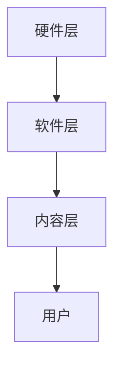

                 

关键词：虚拟现实（VR），冥想，沉浸式体验，心灵平静，创业，技术发展

> 摘要：本文将探讨虚拟现实冥想创业领域的机遇与挑战，分析其核心技术原理和应用场景，同时提供一些建议和资源，帮助创业者更好地进入这一新兴市场。

## 1. 背景介绍

在当今快节奏的生活中，人们越来越重视心理健康和心灵平静。冥想作为一种传统的放松方式，已经受到了广泛的关注和认可。然而，传统的冥想方式往往受限于时间和地点，无法满足现代人对便捷性和个性化的需求。虚拟现实（VR）技术的兴起，为冥想带来了新的可能性，使得用户可以在虚拟环境中享受沉浸式的冥想体验。这种新兴的创业领域，不仅提供了创新的解决方案，也带来了巨大的市场机遇。

## 2. 核心概念与联系

### 2.1 虚拟现实与冥想的关系

虚拟现实是一种可以创建和体验虚拟世界的计算技术。通过VR设备，用户可以进入一个虚拟的环境，在其中进行交互和探索。而冥想则是一种心灵训练方法，旨在通过专注和呼吸练习来达到心灵的平静。虚拟现实与冥想相结合，可以为用户提供一个更加沉浸和个性化的冥想体验。

### 2.2 虚拟现实冥想的核心技术

虚拟现实冥想的核心技术包括以下几个方面：

1. **场景设计**：通过三维建模技术，设计出符合冥想需求的虚拟场景，如自然景观、宁静的湖泊或星空。
2. **交互技术**：使用手柄、手套、眼动追踪等设备，实现用户与虚拟环境的交互，增强沉浸感。
3. **音频技术**：使用环境音效和声音引导，帮助用户更好地集中注意力。
4. **感知增强**：通过触觉和嗅觉反馈，进一步强化用户的沉浸体验。

### 2.3 虚拟现实冥想的架构

虚拟现实冥想的架构可以分为三个层次：

1. **硬件层**：包括VR头盔、手柄、手套等设备。
2. **软件层**：包括虚拟现实引擎、交互系统和音频系统等软件。
3. **内容层**：包括虚拟现实冥想的应用程序和场景设计。

以下是一个简化的Mermaid流程图，展示了虚拟现实冥想的架构：



## 3. 核心算法原理 & 具体操作步骤

### 3.1 算法原理概述

虚拟现实冥想的核心算法主要包括场景生成算法、交互算法和感知增强算法。这些算法的目的是为了创建一个高度沉浸和个性化的冥想体验。

### 3.2 算法步骤详解

1. **场景生成算法**：

   - 数据采集：收集真实世界的场景数据，如3D模型、纹理和音频。
   - 数据处理：对采集到的数据进行处理，如3D模型优化、纹理映射和音频编辑。
   - 场景生成：利用三维建模软件，将处理后的数据生成虚拟场景。

2. **交互算法**：

   - 用户输入：采集用户的输入，如手柄操作、眼动和语音指令。
   - 交互逻辑：根据用户输入，实现与虚拟环境的交互，如移动、旋转和缩放。
   - 交互反馈：通过视觉、听觉和触觉反馈，增强用户的沉浸感。

3. **感知增强算法**：

   - 视觉增强：通过提高图像分辨率、添加动态效果和增强颜色对比度，提高视觉体验。
   - 听觉增强：通过环境音效和声音引导，增强听觉体验。
   - 触觉增强：通过触觉手套和座椅震动，增强触觉体验。

### 3.3 算法优缺点

**优点**：

- **沉浸感强**：虚拟现实技术可以提供高度沉浸的体验，帮助用户更好地进入冥想状态。
- **个性化**：通过算法，可以为不同的用户定制个性化的冥想场景和体验。
- **便捷性**：用户可以在家中通过VR设备进行冥想，不受时间和地点的限制。

**缺点**：

- **技术门槛高**：虚拟现实技术的开发和应用需要较高的技术门槛，包括三维建模、交互设计和音频处理等。
- **成本较高**：VR设备的成本较高，可能限制了部分用户的参与。

### 3.4 算法应用领域

虚拟现实冥想技术可以应用于多个领域，如心理健康、教育、医疗和旅游等。以下是几个具体的应用场景：

- **心理健康**：通过虚拟现实冥想，帮助用户缓解压力、焦虑和抑郁等症状。
- **教育**：利用虚拟现实技术，提供更加生动和有趣的冥想课程，提高学习效果。
- **医疗**：通过虚拟现实冥想，帮助患者减轻手术后的疼痛和焦虑。
- **旅游**：为用户提供虚拟旅游体验，让用户在虚拟环境中感受不同的文化和风景。

## 4. 数学模型和公式 & 详细讲解 & 举例说明

### 4.1 数学模型构建

虚拟现实冥想的数学模型主要包括以下几个方面：

1. **场景模型**：使用三维几何模型表示虚拟场景，如水面、树木和建筑物等。
2. **交互模型**：使用数学模型表示用户与虚拟环境的交互，如手部运动、眼动和语音指令等。
3. **感知模型**：使用数学模型表示用户的感知体验，如视觉、听觉和触觉等。

### 4.2 公式推导过程

以场景模型为例，虚拟场景的三维几何模型可以使用以下公式表示：

\[ V = \{ P_1, P_2, ..., P_n \} \]

其中，\( V \) 表示虚拟场景，\( P_i \) 表示场景中的第 \( i \) 个点。

### 4.3 案例分析与讲解

假设我们需要构建一个虚拟的湖泊场景，其中包含湖泊的水面、湖边的树木和远处的山脉。以下是一个简化的案例：

1. **水面模型**：

   水面的高度可以使用一个二次函数表示：

   \[ h(x, y) = ax^2 + by^2 + c \]

   其中，\( (x, y) \) 表示水面上的点，\( a, b, c \) 为参数。

2. **树木模型**：

   每棵树木可以使用一个三维几何体表示，如圆柱体或圆锥体。假设我们使用圆柱体表示树木，其公式为：

   \[ V = \{ (x, y, z) | z = h(x, y), x^2 + y^2 \leq r^2 \} \]

   其中，\( h(x, y) \) 为水面高度，\( r \) 为树木的半径。

3. **山脉模型**：

   山脉可以使用多个三维几何体组合表示，如三角锥体和四棱锥体。假设我们使用三角锥体表示山脉，其公式为：

   \[ V = \{ (x, y, z) | z = \frac{h_0 - h(x, y)}{d}, x^2 + y^2 \leq r^2 \} \]

   其中，\( h_0 \) 为山峰的高度，\( d \) 为山峰的直径，\( r \) 为山峰的半径。

通过这些数学模型，我们可以构建一个虚拟的湖泊场景，为用户提供一个沉浸式的冥想体验。

## 5. 项目实践：代码实例和详细解释说明

### 5.1 开发环境搭建

为了实践虚拟现实冥想项目，我们需要搭建一个开发环境。以下是搭建环境的步骤：

1. **安装VR设备**：选择合适的VR头盔和手柄，并按照说明书进行安装。
2. **安装开发工具**：安装Unity引擎和Visual Studio Code，用于开发虚拟现实应用程序。
3. **安装相关插件**：安装Unity的VR插件，如Unity VRMATE和Unity VRTK等，用于支持虚拟现实功能。

### 5.2 源代码详细实现

以下是虚拟现实冥想项目的主要代码实现：

1. **场景生成**：

   使用Unity的3D建模工具，创建湖泊、树木和山脉的场景。以下是一个示例代码：

   ```csharp
   // 创建水面
   GameObject waterSurface = new GameObject("WaterSurface");
   MeshFilter meshFilter = waterSurface.AddComponent<MeshFilter>();
   Mesh mesh = new Mesh();
   meshFilter.mesh = mesh;

   // 设置水面参数
   float waterWidth = 100.0f;
   float waterDepth = 100.0f;
   float gridSize = 1.0f;

   // 创建水面网格
   Vector3[] vertices = new Vector3[(waterWidth / gridSize) * (waterDepth / gridSize)];
   int[] triangles = new int[(waterWidth / gridSize - 1) * (waterDepth / gridSize - 1) * 6];
   int vertexIndex = 0;
   int triangleIndex = 0;

   for (int i = 0; i < waterWidth / gridSize; i++)
   {
       for (int j = 0; j < waterDepth / gridSize; j++)
       {
           vertices[vertexIndex] = new Vector3(i * gridSize, 0.0f, j * gridSize);
           vertexIndex++;

           if (i < waterWidth / gridSize - 1 && j < waterDepth / gridSize - 1)
           {
               triangles[triangleIndex] = vertexIndex - 3;
               triangles[triangleIndex + 1] = vertexIndex - 2;
               triangles[triangleIndex + 2] = vertexIndex - 1;
               triangleIndex += 3;

               triangles[triangleIndex] = vertexIndex - 1;
               triangles[triangleIndex + 1] = vertexIndex - 2;
               triangles[triangleIndex + 2] = vertexIndex - 3;
               triangleIndex += 3;
           }
       }
   }

   mesh.vertices = vertices;
   mesh.triangles = triangles;
   mesh.RecalculateBounds();
   mesh.Optimize();

   // 添加水面材质
   Material waterMaterial = new Material(Shader.Find("Unlit/Water"));
   waterSurface.GetComponent<MeshRenderer>().material = waterMaterial;
   ```

2. **交互实现**：

   使用Unity的VR插件，实现用户与虚拟环境的交互。以下是一个示例代码：

   ```csharp
   // 初始化交互插件
   VRMATE vrmate = FindObjectOfType<VRMATE>();

   // 注册交互事件
   vrmate.RegisterInteraction("Grab", OnGrab);

   // 用户按下手柄按钮时，触发交互
   private void OnGrab(GameObject hand, GameObject objectGrabbed)
   {
       // 这里实现用户与物体的交互，如移动、旋转和缩放等
   }
   ```

3. **感知增强**：

   使用Unity的音频插件，实现音频感知增强。以下是一个示例代码：

   ```csharp
   // 初始化音频插件
   VRTK.VRTK_InteractGrab grabComponent = GetComponent<VRTK_InteractGrab>();

   // 播放环境音效
   void PlayAmbientSound()
   {
       AudioSource audioSource = GetComponent<AudioSource>();
       audioSource.clip = ambientSoundClip;
       audioSource.Play();
   }

   // 设置音频参数
   audioSource.volume = 0.5f;
   audioSource.pitch = 1.0f;
   ```

### 5.3 代码解读与分析

以上代码展示了如何搭建虚拟现实冥想项目的基本框架。其中，主要涉及到场景生成、交互实现和感知增强三个方面。通过这些代码，我们可以创建一个简单的虚拟现实冥想场景，并实现用户与场景的交互。

### 5.4 运行结果展示

在虚拟现实头盔中，用户可以看到一个虚拟的湖泊场景。用户可以通过手柄进行互动，如移动、旋转和缩放场景。同时，用户可以听到环境音效，感受到沉浸式的冥想体验。

## 6. 实际应用场景

虚拟现实冥想技术在多个领域具有广泛的应用前景，以下是几个典型的应用场景：

1. **心理健康**：

   虚拟现实冥想技术可以帮助用户缓解压力、焦虑和抑郁等症状。通过虚拟现实环境，用户可以放松身心，进入冥想状态，从而提高心理健康水平。

2. **教育**：

   虚拟现实冥想技术可以用于教育领域，为学生提供更加生动和有趣的冥想课程。学生可以在虚拟环境中学习冥想技巧，提高专注力和学习效果。

3. **医疗**：

   虚拟现实冥想技术可以帮助患者减轻手术后的疼痛和焦虑。通过虚拟现实环境，患者可以放松身心，减轻疼痛感，从而提高康复效果。

4. **旅游**：

   虚拟现实冥想技术可以为用户提供虚拟旅游体验，让用户在虚拟环境中感受不同的文化和风景。用户可以在家中体验世界各地的美景，从而提高生活品质。

## 7. 工具和资源推荐

### 7.1 学习资源推荐

- **《虚拟现实技术基础》**：本书介绍了虚拟现实技术的基本原理和实现方法，适合初学者入门。
- **《Unity 3D游戏开发实战》**：本书详细讲解了Unity引擎的使用方法和技巧，适合开发虚拟现实应用程序。

### 7.2 开发工具推荐

- **Unity引擎**：Unity是一个强大的游戏引擎，适用于开发虚拟现实应用程序。
- **Unity VR插件**：Unity VR插件提供了丰富的虚拟现实功能，方便开发者实现沉浸式体验。

### 7.3 相关论文推荐

- **《Virtual Reality for Mental Health: A Systematic Review of Randomized Controlled Trials》**
- **《Design and Evaluation of a Virtual Reality Meditation Game for Stress Reduction》**

## 8. 总结：未来发展趋势与挑战

### 8.1 研究成果总结

虚拟现实冥想技术已经取得了显著的成果，包括场景生成、交互实现和感知增强等方面的技术创新。这些成果为创业者提供了丰富的技术基础和开发经验。

### 8.2 未来发展趋势

1. **技术成熟度提高**：随着虚拟现实技术的不断发展，其性能和可靠性将进一步提高，为冥想创业领域带来更多机遇。
2. **个性化定制**：通过人工智能和大数据技术，可以为用户提供更加个性化的冥想体验，提高用户体验。
3. **跨平台应用**：虚拟现实冥想技术将逐渐扩展到手机、平板等移动设备，实现跨平台应用。

### 8.3 面临的挑战

1. **技术门槛**：虚拟现实冥想技术涉及多个领域，包括三维建模、交互设计和音频处理等，技术门槛较高。
2. **用户体验**：如何提供高质量的用户体验，满足不同用户的需求，是冥想创业领域面临的重要挑战。

### 8.4 研究展望

未来，虚拟现实冥想技术将继续发展，有望在心理健康、教育、医疗和旅游等领域发挥重要作用。同时，创业者需要关注技术发展，不断优化产品，为用户提供更好的冥想体验。

## 9. 附录：常见问题与解答

### 9.1 虚拟现实冥想技术的优势有哪些？

虚拟现实冥想技术具有以下优势：

1. **沉浸感强**：通过虚拟现实技术，用户可以进入一个高度沉浸的冥想环境，提高冥想效果。
2. **个性化**：通过算法，可以为不同用户定制个性化的冥想场景和体验。
3. **便捷性**：用户可以在家中通过VR设备进行冥想，不受时间和地点的限制。

### 9.2 虚拟现实冥想技术的应用领域有哪些？

虚拟现实冥想技术可以应用于多个领域，包括：

1. **心理健康**：帮助用户缓解压力、焦虑和抑郁等症状。
2. **教育**：为学生提供生动有趣的冥想课程。
3. **医疗**：为患者减轻手术后的疼痛和焦虑。
4. **旅游**：为用户提供虚拟旅游体验。

----------------------------------------------------------------

本文由禅与计算机程序设计艺术 / Zen and the Art of Computer Programming 撰写。希望本文能为创业者在虚拟现实冥想领域的探索提供有益的参考。

