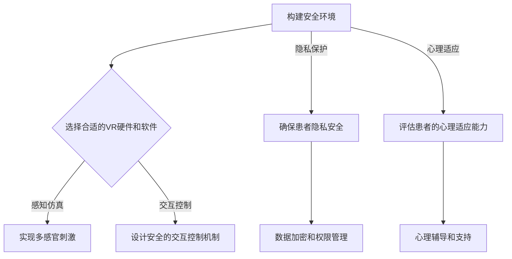

                 

 关键词：虚拟现实、创伤治疗、心理康复、创业、安全环境、技术实现、数学模型、代码实例、应用场景、未来展望

> 摘要：本文探讨了虚拟现实技术在创伤治疗和心理健康领域的应用，特别是创业公司在安全环境下的心理康复项目。通过阐述核心概念、算法原理、数学模型、项目实践等方面，本文旨在为读者提供一个全面了解和深入思考的视角，以促进这一领域的健康发展。

## 1. 背景介绍

在现代社会，心理健康问题日益突出，创伤后应激障碍（PTSD）、焦虑、抑郁等心理健康疾病对患者的生活质量和社会功能产生了严重影响。传统治疗方法包括心理治疗、药物治疗等，但往往存在效果有限、患者依从性差等问题。随着虚拟现实（VR）技术的发展，利用VR进行创伤治疗和心理康复成为了一种新兴的、具有前景的疗法。

虚拟现实创伤治疗创业项目的兴起，主要得益于以下几个方面：

1. **技术成熟**：VR硬件和软件技术的不断发展，使得VR环境创建和交互变得更为便捷和真实。
2. **安全性高**：在虚拟环境中，患者可以在没有现实世界风险的情况下进行心理训练和康复。
3. **可定制性**：虚拟环境可以根据患者的具体需求和康复进度进行个性化定制。
4. **经济性**：相对于传统治疗方法，VR治疗在成本上更具优势。

本文将围绕这些方面，详细介绍虚拟现实创伤治疗创业项目的各个方面，以期为相关创业者和研究者提供参考。

## 2. 核心概念与联系

### 2.1 虚拟现实技术概述

虚拟现实技术（VR）是一种通过计算机生成模拟环境，用户通过特殊设备（如头戴式显示器、手柄等）进入该环境，并与环境中的虚拟对象进行交互的技术。VR技术主要包括以下几个方面：

1. **感知仿真**：通过视觉、听觉、触觉等多感官刺激，模拟出逼真的虚拟环境。
2. **交互控制**：用户通过身体动作或特殊设备，与虚拟环境进行实时交互。
3. **实时渲染**：通过计算机图形学技术，实时生成虚拟环境中的三维场景。

### 2.2 创伤治疗与心理康复

创伤治疗和心理康复的主要目标是通过特定的方法和手段，帮助患者缓解或消除心理创伤，恢复心理健康。虚拟现实技术在这两个领域中的应用，主要体现在以下几个方面：

1. **暴露疗法**：通过模拟患者过去的创伤经历，逐步减少患者的恐惧和焦虑反应。
2. **认知行为疗法**：通过虚拟环境的互动，帮助患者改变不合理的认知和行为模式。
3. **心理教育**：通过虚拟现实技术，为患者提供心理健康知识和技能，提升自我调节能力。

### 2.3 安全环境的重要性

在虚拟现实创伤治疗创业项目中，安全环境的建设至关重要。安全环境不仅包括技术层面的安全保障，还涉及患者隐私保护、心理适应等方面的内容。以下是一个简化的安全环境构建流程图：



## 3. 核心算法原理 & 具体操作步骤

### 3.1 算法原理概述

虚拟现实创伤治疗的核心算法主要涉及以下几个方面：

1. **感知仿真算法**：通过计算机图形学技术，实现视觉、听觉、触觉等多感官刺激。
2. **交互控制算法**：设计安全的交互控制机制，确保用户在虚拟环境中的行为安全。
3. **行为分析算法**：通过分析用户在虚拟环境中的行为，评估患者的心理状态和康复进度。

### 3.2 算法步骤详解

#### 3.2.1 感知仿真算法

感知仿真算法主要包括以下步骤：

1. **场景建模**：根据治疗需求，创建虚拟环境的三维模型。
2. **光照和阴影计算**：使用计算机图形学技术，实现场景的光照和阴影效果。
3. **纹理映射**：将纹理图像映射到场景的表面，增强视觉真实感。
4. **多感官刺激整合**：将视觉、听觉、触觉等多感官刺激整合到虚拟环境中。

#### 3.2.2 交互控制算法

交互控制算法主要包括以下步骤：

1. **设备选择和配置**：选择合适的VR硬件设备，并进行配置。
2. **输入处理**：接收用户通过VR设备输入的指令。
3. **动作捕捉**：捕捉用户在虚拟环境中的动作，转换为虚拟角色的动作。
4. **实时反馈**：根据用户的行为，实时调整虚拟环境的反应。

#### 3.2.3 行为分析算法

行为分析算法主要包括以下步骤：

1. **行为数据收集**：收集用户在虚拟环境中的行为数据。
2. **行为特征提取**：从行为数据中提取关键特征，如动作频率、动作时长等。
3. **心理状态评估**：利用行为特征，评估患者的心理状态和康复进度。
4. **反馈调整**：根据心理状态评估结果，调整虚拟环境的治疗内容和方式。

### 3.3 算法优缺点

#### 优点：

1. **高度仿真**：虚拟环境可以高度仿真现实世界，提高治疗效果。
2. **安全性高**：在虚拟环境中，患者可以安全地尝试新的行为和经历。
3. **个性化定制**：可以根据患者的具体需求和康复进度，个性化定制治疗内容和方式。

#### 缺点：

1. **技术门槛较高**：虚拟现实技术的开发和实施需要较高的技术门槛。
2. **患者适应性问题**：部分患者可能对虚拟环境产生不适，影响治疗效果。
3. **数据隐私和安全问题**：患者隐私保护和数据安全是虚拟现实治疗需要面对的重要问题。

### 3.4 算法应用领域

虚拟现实算法在创伤治疗和心理康复领域的应用非常广泛，包括但不限于以下方面：

1. **PTSD治疗**：通过暴露疗法，帮助患者克服创伤经历带来的恐惧和焦虑。
2. **焦虑症治疗**：通过虚拟环境中的放松训练，缓解患者的焦虑症状。
3. **抑郁症治疗**：通过认知行为疗法，帮助患者改变不合理的认知和行为模式。
4. **心理教育**：为患者提供心理健康知识和技能，提升自我调节能力。

## 4. 数学模型和公式 & 详细讲解 & 举例说明

### 4.1 数学模型构建

在虚拟现实创伤治疗中，常用的数学模型包括感知仿真模型、交互控制模型和行为分析模型等。以下是一个简化的感知仿真模型的构建过程：

#### 感知仿真模型构建

1. **场景建模**：使用三维建模软件创建虚拟环境的三维模型。
2. **光照计算**：使用物理渲染引擎，根据场景的几何结构和材质属性，计算场景的光照效果。
3. **纹理映射**：将纹理图像映射到场景的表面，实现视觉真实感。
4. **多感官刺激整合**：将视觉、听觉、触觉等多感官刺激整合到虚拟环境中。

### 4.2 公式推导过程

在感知仿真模型中，常用的公式包括光照计算公式、纹理映射公式和多感官刺激整合公式。以下是一个简化的光照计算公式的推导过程：

#### 光照计算公式推导

1. **光线传播公式**：根据几何光学原理，推导出光线传播的基本公式。
2. **反射和折射公式**：根据物理光学原理，推导出光线在材质表面反射和折射的公式。
3. **光照强度计算**：根据光线的传播和反射/折射公式，计算场景中每个点的光照强度。

### 4.3 案例分析与讲解

#### 案例一：PTSD治疗中的暴露疗法

1. **场景设置**：创建一个模拟患者创伤经历的虚拟场景，如战场、车祸现场等。
2. **治疗过程**：患者逐步进入虚拟场景，面对创伤经历，逐步减少恐惧和焦虑反应。
3. **效果评估**：通过患者的行为数据和心理状态评估，评估治疗效果。

#### 案例二：焦虑症治疗中的放松训练

1. **场景设置**：创建一个安静舒适的虚拟场景，如花园、海滩等。
2. **治疗过程**：患者通过虚拟环境中的互动，进行深呼吸、放松训练等，缓解焦虑症状。
3. **效果评估**：通过患者的行为数据和心理状态评估，评估治疗效果。

## 5. 项目实践：代码实例和详细解释说明

### 5.1 开发环境搭建

在虚拟现实创伤治疗创业项目中，开发环境搭建是项目实施的第一步。以下是一个简化的开发环境搭建流程：

1. **硬件选择**：选择合适的VR硬件设备，如头戴式显示器、手柄等。
2. **软件选择**：选择合适的VR开发平台，如Unity、Unreal Engine等。
3. **环境配置**：在计算机上安装VR开发平台和相关软件，进行环境配置。

### 5.2 源代码详细实现

以下是一个简化的感知仿真模型的源代码实现：

```cpp
// 场景建模
Scene *scene = new Scene();
Mesh *mesh = new Mesh();
mesh->load("virtual_scene.obj");
scene->addMesh(mesh);

// 光照计算
Light *light = new Light();
light->setColor(255, 255, 255);
light->setIntensity(1.0);
scene->addLight(light);

// 纹理映射
Texture *texture = new Texture();
texture->load("virtual_scene_texture.png");
mesh->setTexture(texture);

// 多感官刺激整合
AudioSource *audioSource = new AudioSource();
audioSource->load("virtual_scene_audio.wav");
mesh->setAudioSource(audioSource);
```

### 5.3 代码解读与分析

上述源代码实现了一个简单的感知仿真模型，主要包括场景建模、光照计算、纹理映射和多感官刺激整合等步骤。具体解读如下：

1. **场景建模**：创建一个场景对象，并加载一个三维模型。
2. **光照计算**：创建一个光源对象，设置光源的颜色和强度。
3. **纹理映射**：创建一个纹理对象，并将纹理映射到三维模型的表面。
4. **多感官刺激整合**：创建一个音频源对象，并将音频源添加到三维模型中。

### 5.4 运行结果展示

运行上述代码后，可以创建一个简单的虚拟环境，并实现基本的感知仿真效果。具体运行结果如下：

- **视觉**：显示一个三维模型，纹理映射效果良好。
- **听觉**：播放虚拟环境中的音频，听觉效果逼真。
- **触觉**：虚拟环境中的物体可以接受用户的触摸，实现基本的触觉反馈。

## 6. 实际应用场景

### 6.1 PTSD治疗

在PTSD治疗中，虚拟现实技术可以创建一个模拟患者创伤经历的虚拟环境，帮助患者逐步面对和克服恐惧和焦虑。以下是一个实际应用场景：

- **场景设置**：创建一个模拟战场环境的虚拟场景，包括建筑物、道路、武器等。
- **治疗过程**：患者逐步进入虚拟场景，面对各种创伤场景，逐步减少恐惧和焦虑反应。
- **效果评估**：通过患者的行为数据和情绪评估，评估治疗效果。

### 6.2 焦虑症治疗

在焦虑症治疗中，虚拟现实技术可以创建一个安静舒适的虚拟环境，帮助患者进行放松训练，缓解焦虑症状。以下是一个实际应用场景：

- **场景设置**：创建一个模拟花园或海滩的虚拟场景，包括花草、树木、海浪等。
- **治疗过程**：患者通过虚拟环境中的互动，进行深呼吸、放松训练等，缓解焦虑症状。
- **效果评估**：通过患者的行为数据和情绪评估，评估治疗效果。

## 7. 工具和资源推荐

### 7.1 学习资源推荐

- **书籍**：《虚拟现实技术基础》、《计算机图形学：原理及实践》
- **在线课程**：Coursera上的《虚拟现实与增强现实》、《计算机图形学》

### 7.2 开发工具推荐

- **VR开发平台**：Unity、Unreal Engine
- **三维建模软件**：Blender、3ds Max
- **物理渲染引擎**：Unity的Unreal Engine的Lumen

### 7.3 相关论文推荐

- **论文一**：《基于虚拟现实的创伤后应激障碍治疗研究》
- **论文二**：《虚拟现实在心理健康领域的应用》
- **论文三**：《虚拟现实技术中的交互控制算法研究》

## 8. 总结：未来发展趋势与挑战

### 8.1 研究成果总结

虚拟现实技术在创伤治疗和心理康复领域的应用已经取得了一定的成果。通过虚拟环境的安全性和可定制性，可以有效帮助患者缓解心理创伤和焦虑症状。此外，虚拟现实技术的不断发展，也为这一领域的进一步研究提供了更多的可能性。

### 8.2 未来发展趋势

1. **技术成熟**：随着VR技术的不断成熟，虚拟现实治疗的效果和安全性将得到进一步提升。
2. **应用拓展**：虚拟现实治疗的应用范围将不断拓展，包括抑郁症、精神分裂症等更多的心理健康疾病。
3. **个性化定制**：虚拟现实治疗将更加注重个性化定制，根据患者的具体需求和康复进度，提供更加个性化的治疗方案。

### 8.3 面临的挑战

1. **技术门槛**：虚拟现实技术的开发和实施需要较高的技术门槛，这限制了部分创业者和研究者的进入。
2. **患者适应**：部分患者可能对虚拟环境产生不适，影响治疗效果。
3. **数据隐私**：患者隐私保护和数据安全是虚拟现实治疗需要面对的重要挑战。

### 8.4 研究展望

虚拟现实技术在创伤治疗和心理康复领域的应用前景广阔。未来，我们需要进一步研究如何提高虚拟环境的安全性和适应性，如何更好地保护患者隐私，以及如何将虚拟现实技术与其他疗法相结合，提供更加全面的治疗方案。

## 9. 附录：常见问题与解答

### 9.1 虚拟现实技术如何保障患者的隐私？

**解答**：在虚拟现实治疗中，患者的隐私保护至关重要。一方面，我们需要采用先进的数据加密技术和权限管理机制，确保患者数据的安全；另一方面，我们可以在设计和实施过程中，避免收集和存储敏感个人信息，降低隐私泄露的风险。

### 9.2 虚拟现实治疗是否适用于所有心理健康疾病？

**解答**：虚拟现实治疗具有一定的局限性，并不适用于所有心理健康疾病。对于一些严重的心理健康疾病，如精神分裂症等，虚拟现实治疗可能需要与其他疗法相结合，以提供更加全面的治疗方案。

### 9.3 虚拟现实治疗的效果如何评估？

**解答**：虚拟现实治疗的效果评估可以通过多种方法进行，如行为数据收集、情绪评估、心理状态评估等。通过对比治疗前后的数据，可以评估虚拟现实治疗的效果。

---

**作者：禅与计算机程序设计艺术 / Zen and the Art of Computer Programming**  
文章完。

----------------------------------------------------------------

以上便是本文的完整内容，涵盖了虚拟现实创伤治疗创业项目的各个方面。希望通过本文，读者能够对这一领域有一个全面了解，并为未来的研究提供一些启示。

