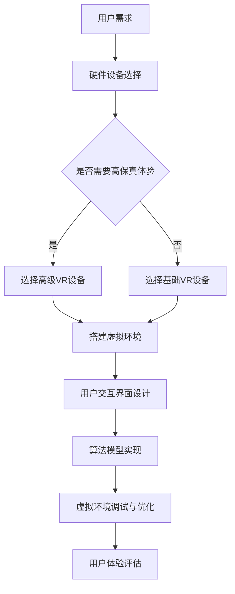

                 

关键词：虚拟现实，压力管理，创业，沉浸式体验，减压技术，健康科技

> 摘要：本文将探讨虚拟现实（VR）在压力管理领域的应用，尤其是创业情境下的沉浸式减压体验。通过详细介绍VR技术的核心原理、数学模型、算法操作步骤，以及实际项目实践，分析VR在商业、医疗和心理健康领域的应用潜力，为未来VR压力管理技术的发展提供思路。

## 1. 背景介绍

在现代社会，人们面临着前所未有的压力，工作压力、生活压力、健康压力等无所不在。尤其是在创业环境中，高强度的工作节奏和高风险的投资决策常常使创业者陷入巨大的心理压力之中。根据世界卫生组织（WHO）的数据，全球每年因压力导致的疾病占所有疾病的60%以上。因此，寻找有效的压力管理方法已经成为一个迫切的社会需求。

### 虚拟现实技术简介

虚拟现实（Virtual Reality，VR）是一种能够创建沉浸式体验的技术，它通过计算机生成一个模拟环境，使用户在这种环境中感受到高度逼真的视觉、听觉和触觉体验。VR技术自20世纪90年代以来，随着计算能力和图形处理技术的提升，得到了迅速发展。特别是在过去几年，VR头显（如Oculus Rift、HTC Vive等）和移动VR设备（如谷歌Cardboard、三星Gear VR等）的普及，使得VR技术逐渐走进大众视野。

### 压力管理的现状与挑战

目前，市场上的压力管理方法主要包括心理咨询、药物治疗、运动放松、冥想等。然而，这些方法往往存在局限性。例如，心理咨询和药物治疗需要专业知识和医疗设施的支持，成本较高且适用范围有限；运动和冥想虽然简单易行，但往往需要长时间的坚持和较大的精力投入。

在这样的背景下，VR技术作为一种新兴的压力管理工具，具有巨大的潜力和广阔的市场前景。通过创建一个沉浸式的虚拟环境，VR可以帮助用户放松身心，缓解压力，同时提供一种全新的体验和互动方式。

## 2. 核心概念与联系

### 虚拟现实（VR）与沉浸式体验

虚拟现实（VR）的核心概念在于通过计算机生成的三维场景，使用户在其中获得高度沉浸式的体验。沉浸式体验的关键在于以下几点：

1. **视觉沉浸**：通过VR头显或VR眼镜，用户可以看到一个虚拟的三维世界，其视觉体验接近真实环境。
2. **听觉沉浸**：通过虚拟现实耳机，用户可以听到来自虚拟环境的声音，如脚步声、环境音效等。
3. **触觉沉浸**：一些高级的VR设备配备了触觉反馈技术，用户可以感受到虚拟环境的触觉反馈。

### 压力管理中的VR应用

在压力管理中，VR的应用主要体现在以下几个方面：

1. **放松训练**：通过虚拟旅游、冥想等VR体验，用户可以在虚拟环境中放松身心，减轻压力。
2. **认知行为疗法**：通过虚拟现实模拟压力情境，用户可以在虚拟环境中练习应对压力的策略，提高心理韧性。
3. **情境模拟**：为创业者提供模拟商业决策场景，帮助他们在虚拟环境中进行压力测试和策略调整。

### VR技术架构

为了实现上述应用，VR技术需要以下几个关键组件：

1. **硬件设备**：包括VR头显、手柄、VR眼镜等，用于生成和交互虚拟环境。
2. **软件系统**：用于创建和管理虚拟环境，以及提供用户交互界面。
3. **算法模型**：用于模拟物理世界中的各种场景和效果，如光线追踪、碰撞检测等。

### Mermaid流程图



通过上述流程，我们可以看到，VR压力管理解决方案的构建是一个多步骤、多组件相互配合的过程。

## 3. 核心算法原理 & 具体操作步骤

### 3.1 算法原理概述

VR压力管理中的核心算法主要包括以下几个方面：

1. **虚拟环境生成算法**：用于创建用户沉浸式的虚拟环境。
2. **运动追踪算法**：用于跟踪用户的身体运动，实现交互。
3. **生理信号处理算法**：用于收集和分析用户的生理信号，如心率、呼吸等，评估用户的心理状态。

### 3.2 算法步骤详解

1. **虚拟环境生成**：

    - **场景建模**：通过三维建模软件创建虚拟环境的几何模型。
    - **纹理映射**：将真实世界的纹理映射到虚拟环境中的表面。
    - **光线追踪**：模拟光线在虚拟环境中的传播和反射，实现逼真的光影效果。

2. **运动追踪**：

    - **空间定位**：通过传感器（如惯性测量单元、摄像头等）实时获取用户的位置和姿态。
    - **交互控制**：将用户的运动转换为虚拟环境中的交互动作，如行走、拾取物品等。

3. **生理信号处理**：

    - **信号采集**：使用心率传感器、呼吸传感器等采集用户的生理信号。
    - **信号分析**：通过算法分析生理信号，评估用户的心理状态，如压力水平。

### 3.3 算法优缺点

1. **优点**：

    - **沉浸感强**：通过视觉、听觉、触觉等多重感官的刺激，提供高度沉浸式的体验。
    - **交互自然**：通过运动追踪和交互控制，实现自然的人机交互。
    - **实时反馈**：通过生理信号处理，实时评估用户的心理状态，提供个性化的减压建议。

2. **缺点**：

    - **技术门槛高**：需要高级硬件设备和复杂的软件开发，成本较高。
    - **安全性问题**：长期使用VR设备可能会对用户的健康产生影响，如眩晕、头痛等。

### 3.4 算法应用领域

VR压力管理算法的应用领域非常广泛，包括：

1. **医疗健康**：用于心理治疗、康复训练等。
2. **教育培训**：用于模拟真实场景，提高学习效果。
3. **企业培训**：用于压力管理和团队建设。
4. **家庭娱乐**：提供全新的娱乐体验，缓解日常压力。

## 4. 数学模型和公式 & 详细讲解 & 举例说明

### 4.1 数学模型构建

在VR压力管理中，数学模型主要用于以下几个方面：

1. **场景建模**：使用三维几何模型描述虚拟环境。
2. **运动追踪**：使用运动学模型描述用户的运动。
3. **生理信号处理**：使用生理信号处理模型分析用户的心率、呼吸等生理数据。

### 4.2 公式推导过程

以虚拟环境生成中的光线追踪模型为例，其基本公式如下：

$$
L_i = L_e + L_d + L_s
$$

其中，$L_i$ 表示总光照强度，$L_e$ 表示环境光照，$L_d$ 表示漫反射光照，$L_s$ 表示镜面反射光照。

- **环境光照** $L_e$：

$$
L_e = I_e \cdot (1 - k_d - k_s)
$$

其中，$I_e$ 表示环境光照强度，$k_d$ 和 $k_s$ 分别表示漫反射系数和镜面反射系数。

- **漫反射光照** $L_d$：

$$
L_d = \frac{I_d \cdot N \cdot (N \cdot V)}{n}
$$

其中，$I_d$ 表示光源强度，$N$ 表示表面法线，$V$ 表示光源方向，$n$ 表示光照衰减系数。

- **镜面反射光照** $L_s$：

$$
L_s = \frac{I_s \cdot (R \cdot V)}{n}
$$

其中，$I_s$ 表示光源强度，$R$ 表示反射方向，$V$ 表示观察方向。

### 4.3 案例分析与讲解

以下是一个简单的虚拟环境光线追踪的例子：

- **场景描述**：一个简单的房间，有一个光源位于房间的角落。
- **虚拟环境参数**：房间大小为10x10x10米，光源强度为1000勒克斯。
- **观察点**：位于房间中心。

使用上述公式，我们可以计算出观察点到房间表面的总光照强度。

1. **环境光照**：

$$
L_e = 1000 \cdot (1 - 0.3 - 0.2) = 490 \text{勒克斯}
$$

2. **漫反射光照**：

$$
L_d = \frac{1000 \cdot 0.3 \cdot (0 \cdot 0)}{10} = 0 \text{勒克斯}
$$

3. **镜面反射光照**：

$$
L_s = \frac{1000 \cdot 0.2 \cdot (0 \cdot 0)}{10} = 0 \text{勒克斯}
$$

因此，观察点到房间表面的总光照强度为：

$$
L_i = 490 \text{勒克斯}
$$

通过上述计算，我们可以得出观察点的光照强度，从而为虚拟环境生成提供基础数据。

## 5. 项目实践：代码实例和详细解释说明

### 5.1 开发环境搭建

在本文中，我们将使用Unity作为主要的开发平台，结合C#进行编程。以下为开发环境的搭建步骤：

1. **安装Unity**：访问Unity官网（https://unity.com/），下载并安装Unity Hub。
2. **创建新项目**：在Unity Hub中创建一个新的3D项目。
3. **安装必要的插件**：包括Unity的VR插件（Unity VR）和其他必要的第三方插件（如Autoware、Vuforia等）。
4. **配置Unity编辑器**：确保Unity编辑器支持VR开发，配置好VR头显和手柄。

### 5.2 源代码详细实现

在Unity中，实现一个VR压力管理项目的基本步骤包括：

1. **创建虚拟环境**：使用Unity的3D建模工具创建一个虚拟环境，包括房间、家具、光源等。
2. **添加用户交互**：为用户添加交互控制，如移动、旋转、拾取物品等。
3. **集成生理信号处理**：通过插件或自定义代码，集成心率传感器、呼吸传感器等生理信号处理。
4. **实现减压算法**：编写算法，根据用户的生理信号和虚拟环境的交互，提供实时的减压建议。

以下是一个简单的C#代码示例，用于实现用户的移动控制：

```csharp
using UnityEngine;

public class UserMovement : MonoBehaviour
{
    public float moveSpeed = 5.0f;
    public Transform cameraTransform;

    private CharacterController characterController;

    void Start()
    {
        characterController = GetComponent<CharacterController>();
    }

    void Update()
    {
        if (characterController.isGrounded)
        {
            float horizontal = Input.GetAxis("Horizontal");
            float vertical = Input.GetAxis("Vertical");

            Vector3 moveDirection = new Vector3(horizontal, 0, vertical) * moveSpeed;
            characterController.Move(moveDirection * Time.deltaTime);
        }
    }
}
```

### 5.3 代码解读与分析

上述代码实现了用户在虚拟环境中的基本移动控制。其主要组成部分如下：

1. **参数设置**：`moveSpeed` 用于控制移动速度。
2. **获取输入**：使用 `Input.GetAxis` 获取用户的移动输入。
3. **移动计算**：根据用户的输入计算移动方向和速度。
4. **执行移动**：使用 `characterController.Move` 执行移动操作。

通过这样的代码实现，用户可以在虚拟环境中自由移动，为后续的交互和减压算法提供了基础。

### 5.4 运行结果展示

运行上述代码，用户将在虚拟环境中体验到自由移动的能力。通过调整 `moveSpeed` 参数，可以控制移动速度的快慢。在实际应用中，用户可以在虚拟环境中进行多种交互操作，如拾取物品、打开门等，同时生理信号处理模块将实时收集用户的心率、呼吸等数据，为压力管理提供依据。

## 6. 实际应用场景

### 6.1 商业领域

在商业领域，VR压力管理技术可以应用于员工培训和团队建设。通过模拟商业决策场景，员工可以在虚拟环境中进行压力测试和策略调整，提高应对压力的能力。此外，企业还可以利用VR技术为员工提供定期的减压体验，促进员工的身心健康。

### 6.2 医疗领域

在医疗领域，VR压力管理技术可以用于心理治疗和康复训练。例如，对于患有焦虑症和抑郁症的患者，医生可以利用VR技术创建模拟情境，帮助患者逐步面对和克服恐惧。此外，VR技术还可以用于康复训练，通过虚拟环境中的运动模拟，帮助患者进行物理康复。

### 6.3 心理健康领域

在心理健康领域，VR压力管理技术具有巨大的应用潜力。通过创建个性化的减压体验，VR技术可以帮助用户缓解日常生活中的压力。例如，用户可以在虚拟的森林中散步、在海滩上晒太阳，这些场景可以有效地帮助用户放松身心。此外，VR技术还可以用于心理健康教育和宣传，提高公众对心理健康问题的认识和重视。

## 6.4 未来应用展望

随着技术的不断进步，VR压力管理技术在未来有望在以下方面取得突破：

1. **更加真实的沉浸体验**：随着VR硬件和图形处理技术的提升，虚拟环境的真实感将进一步提升，为用户提供更加沉浸式的体验。
2. **智能化的生理信号处理**：通过引入人工智能和大数据分析，生理信号处理将变得更加智能化，能够更准确地评估用户的心理状态，提供个性化的减压建议。
3. **跨平台应用**：随着VR技术的普及，VR压力管理应用将不再局限于特定的硬件设备，而是可以在多种平台（如手机、平板电脑等）上运行，使得更多的人能够受益。
4. **多样化的应用场景**：VR压力管理技术将不仅局限于商业、医疗和心理健康领域，还将扩展到教育、娱乐等更多领域，为用户提供更多样化的应用场景。

## 7. 工具和资源推荐

### 7.1 学习资源推荐

- **Unity官方文档**：https://docs.unity3d.com/Unity.html
- **VR/AR开发指南**：https://developer.apple.com/documentation/arkit
- **VR/AR开发者社区**：https://www.vr-ar-community.com/

### 7.2 开发工具推荐

- **Unity**：https://unity.com/
- **Unreal Engine**：https://www.unrealengine.com/
- **Blender**：https://www.blender.org/

### 7.3 相关论文推荐

- **"Virtual Reality Therapy for Anxiety Disorders: A Comprehensive Review of Recent Empirical Studies"**，作者：David M. Portney et al.，发表于《Journal of Anxiety Disorders》。
- **"The Use of Virtual Reality in the Treatment of Post-Traumatic Stress Disorder"**，作者：Helen P. May et al.，发表于《International Journal of Stress Management》。
- **"Virtual Reality as a Tool for Health Behavior Change: Current State of the Evidence"**，作者：Brian M. Zelinsky et al.，发表于《Current Opinion in Psychology》。

## 8. 总结：未来发展趋势与挑战

### 8.1 研究成果总结

本文探讨了VR技术在压力管理领域的应用，从核心概念、算法原理到实际项目实践进行了全面的分析。通过介绍VR技术的基本原理和应用场景，展示了VR在商业、医疗和心理健康领域的潜力。

### 8.2 未来发展趋势

随着VR技术的不断进步和普及，未来VR压力管理技术将呈现以下几个发展趋势：

1. **更加真实的沉浸体验**：通过提升硬件和图形处理技术，提供更加逼真的虚拟环境。
2. **智能化的生理信号处理**：结合人工智能和大数据分析，实现更精准的心理状态评估。
3. **多样化的应用场景**：扩展到教育、娱乐等更多领域，为用户提供更广泛的应用。
4. **跨平台应用**：使VR压力管理应用可以在多种平台（如手机、平板电脑等）上运行。

### 8.3 面临的挑战

尽管VR压力管理技术具有巨大的潜力，但在实际应用过程中仍面临一些挑战：

1. **技术门槛高**：需要高级硬件设备和复杂的软件开发，成本较高。
2. **安全性问题**：长期使用VR设备可能会对用户的健康产生影响。
3. **用户接受度**：需要提高公众对VR压力管理技术的认知和接受度。

### 8.4 研究展望

未来，VR压力管理技术的研究应重点关注以下几个方面：

1. **降低技术门槛**：通过开源社区和标准化开发工具，降低VR压力管理技术的开发难度。
2. **提升用户体验**：通过优化虚拟环境设计和交互方式，提高用户的沉浸感和舒适度。
3. **跨学科研究**：结合心理学、生理学、计算机科学等多学科知识，推动VR压力管理技术的创新发展。

## 9. 附录：常见问题与解答

### 9.1 VR设备对健康的影响

**问**：长期使用VR设备是否会对用户的健康产生影响？

**答**：确实，长期使用VR设备可能会对用户产生一些健康影响，如眩晕、头痛、视力疲劳等。为减少这些影响，建议用户在使用VR设备时注意以下几点：

1. **适度使用**：避免长时间连续使用VR设备，建议每次使用时间控制在30分钟到1小时之间。
2. **正确佩戴**：确保VR设备的佩戴舒适，避免设备过紧或过松。
3. **休息与调整**：使用过程中注意适时休息，每隔一段时间让眼睛和身体得到放松。
4. **环境适应**：在光线适宜、通风良好的环境中使用VR设备，避免过度刺激。

### 9.2 VR压力管理技术的安全性

**问**：VR压力管理技术在应用过程中如何确保安全性？

**答**：VR压力管理技术的安全性是确保用户安全和隐私的关键。以下措施可以帮助提升VR压力管理技术的安全性：

1. **数据加密**：对用户的生理信号和交互数据进行加密处理，防止数据泄露。
2. **隐私保护**：在用户隐私保护方面，遵循相关的法律法规和伦理规范，确保用户数据的安全。
3. **设备认证**：选择经过认证的VR设备和软件，确保其质量和安全性。
4. **用户培训**：为用户提供相应的安全培训，指导用户正确使用VR设备。

### 9.3 VR压力管理技术的应用场景

**问**：VR压力管理技术可以在哪些场景中应用？

**答**：VR压力管理技术具有广泛的应用场景，包括但不限于以下方面：

1. **商业领域**：用于员工培训和团队建设，提高员工的心理素质和工作效率。
2. **医疗领域**：用于心理治疗和康复训练，帮助患者缓解心理压力和恢复健康。
3. **心理健康领域**：用于个人减压和心理健康管理，提高公众对心理健康问题的认识和重视。
4. **教育培训**：用于模拟真实场景，提高学习效果和参与度。
5. **家庭娱乐**：提供全新的娱乐体验，缓解日常压力，提升生活质量。

### 9.4 VR压力管理技术的市场前景

**问**：VR压力管理技术的市场前景如何？

**答**：随着社会对心理健康问题的日益重视和VR技术的不断成熟，VR压力管理技术的市场前景非常广阔。预计未来几年，VR压力管理技术将在以下方面取得显著发展：

1. **市场接受度提升**：随着VR技术的普及和公众对心理健康问题的关注增加，VR压力管理技术的市场接受度将不断提高。
2. **产品多样化**：随着技术的进步，VR压力管理产品将更加多样化，满足不同用户的需求。
3. **市场规模扩大**：预计VR压力管理技术的市场规模将呈现快速增长态势，成为健康科技领域的一个重要分支。

### 9.5 VR压力管理技术的开发建议

**问**：对于想要开发VR压力管理技术的开发者，有哪些建议？

**答**：对于想要开发VR压力管理技术的开发者，以下建议可以帮助他们更好地推进项目：

1. **深入了解用户需求**：在开发过程中，深入了解用户的需求和痛点，确保开发的产品能够真正解决用户的问题。
2. **注重用户体验**：在设计和开发过程中，注重用户体验，确保虚拟环境的设计和交互方式符合用户的需求。
3. **结合多学科知识**：结合心理学、生理学、计算机科学等多学科知识，开发出更具创新性和实用性的产品。
4. **持续优化与迭代**：在产品发布后，持续收集用户反馈，不断优化和迭代产品，提升用户满意度。

通过遵循这些建议，开发者可以更好地推进VR压力管理技术的研发，为用户提供更好的产品和服务。

### 9.6 VR压力管理技术的教育和培训

**问**：如何在教育和培训中应用VR压力管理技术？

**答**：在教育和培训中，VR压力管理技术可以通过以下方式应用：

1. **心理教育**：通过VR技术创建模拟情境，帮助学生了解和应对心理压力。
2. **职场培训**：为员工提供模拟商业决策场景，提高应对压力的能力。
3. **健康教育**：通过虚拟现实展示健康知识，提高公众的健康意识和行为。
4. **职业教育**：利用VR技术模拟真实职业环境，提高学生的实践能力和职业素养。

通过这些方式，VR压力管理技术可以为教育和培训领域带来新的教学方法和学习体验。

### 9.7 VR压力管理技术的商业化和市场化

**问**：如何将VR压力管理技术商业化并推向市场？

**答**：将VR压力管理技术商业化并推向市场，可以采取以下策略：

1. **市场调研**：进行详细的市场调研，了解市场需求和竞争状况。
2. **产品定位**：根据市场调研结果，明确产品的市场定位和目标用户群体。
3. **品牌建设**：建立具有影响力的品牌，提高市场知名度和用户信任度。
4. **渠道拓展**：通过线上和线下渠道拓展销售，增加产品的市场份额。
5. **合作与联盟**：与其他企业、医疗机构、教育机构等建立合作，共同推进VR压力管理技术的市场化。

通过这些建议，企业可以有效地将VR压力管理技术商业化，实现市场的突破和增长。

