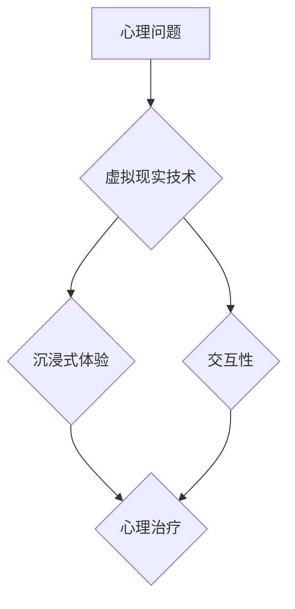

                 

关键词：虚拟现实，心理治疗，创新疗法，VR疗法，心理疗法

摘要：随着虚拟现实技术的不断进步，其在心理治疗领域的应用逐渐受到广泛关注。本文旨在探讨虚拟现实技术在心理治疗中的应用，从核心概念、算法原理、数学模型到项目实践，全面解析虚拟现实在心理治疗中的创新疗法。通过本文，读者将了解虚拟现实如何为心理治疗带来变革，以及未来可能的应用前景。

## 1. 背景介绍

心理治疗作为一种帮助个体解决心理问题的手段，已有百余年历史。传统的心理治疗主要依赖于面对面交流、认知行为疗法（CBT）等手段。然而，这些方法存在一些局限性，如治疗过程繁琐、治疗效果受地域和时间限制等。近年来，虚拟现实（VR）技术的迅猛发展，为心理治疗带来了新的契机。VR技术的沉浸式体验和交互性，使其能够提供更为真实、个性化的心理治疗环境，有望解决传统心理治疗的局限性。

## 2. 核心概念与联系

### 虚拟现实与心理治疗的关系

虚拟现实是一种通过计算机技术创建的模拟环境，用户可以在这个环境中进行交互和探索。心理治疗则是一种通过特定方法和技术，帮助个体解决心理问题、改善心理健康的过程。

虚拟现实与心理治疗的结合，能够为患者提供一种全新的治疗体验。通过虚拟现实环境，患者可以在一个安全、可控的空间中面对和处理自己的心理问题，从而提高治疗的效率和效果。

### Mermaid 流程图



## 3. 核心算法原理 & 具体操作步骤

### 3.1 算法原理概述

虚拟现实在心理治疗中的应用，主要基于以下几个核心算法原理：

1. **感知融合**：通过计算机生成的视觉、听觉、触觉等感知信息，使患者在虚拟环境中产生沉浸感。
2. **情境创设**：根据患者的心理问题，设计相应的虚拟情境，帮助患者面对和处理心理问题。
3. **反馈机制**：通过实时反馈，引导患者参与心理治疗过程，提高治疗的互动性和效果。

### 3.2 算法步骤详解

1. **感知融合**：
   - **视觉融合**：通过头戴显示器（HMD）或投影技术，将虚拟环境呈现在患者眼前。
   - **听觉融合**：通过耳机或声音系统，为患者提供虚拟环境中的声音信息。
   - **触觉融合**：通过触觉设备，为患者提供虚拟环境中的触觉反馈。

2. **情境创设**：
   - **问题定位**：根据患者的心理问题，确定治疗目标。
   - **环境设计**：设计符合治疗目标的虚拟环境，如自然景观、城市景观、室内场景等。
   - **交互设置**：设置患者与虚拟环境的交互方式，如行走、触摸、说话等。

3. **反馈机制**：
   - **实时反馈**：通过虚拟环境中的实时反馈，引导患者参与治疗过程。
   - **评估与调整**：根据患者的反馈，调整虚拟环境和治疗方案，以提高治疗效果。

### 3.3 算法优缺点

**优点**：
- 提供沉浸式体验，提高患者的参与度和治疗效果。
- 无需面对面交流，减少治疗过程中的心理压力。
- 可定制化治疗环境，满足不同患者的需求。

**缺点**：
- 技术门槛较高，需要专业的设备和技能支持。
- 虚拟环境的设计和实现难度较大，需要经验丰富的团队协作。

### 3.4 算法应用领域

虚拟现实在心理治疗中的应用领域广泛，包括：

- **焦虑症**：通过虚拟现实技术，帮助患者面对和处理焦虑情绪。
- **创伤后应激障碍（PTSD）**：通过虚拟现实技术，帮助患者复现创伤经历，进行暴露疗法。
- **抑郁症**：通过虚拟现实技术，提高患者的情绪调节能力。
- **社交焦虑症**：通过虚拟现实技术，模拟社交场景，帮助患者提升社交技能。

## 4. 数学模型和公式 & 详细讲解 & 举例说明

### 4.1 数学模型构建

虚拟现实在心理治疗中的应用，涉及多个数学模型，如：

1. **感知融合模型**：描述虚拟环境与真实环境之间的映射关系。
2. **情境创设模型**：描述虚拟环境的设计原则和方法。
3. **反馈机制模型**：描述患者与虚拟环境之间的互动过程。

### 4.2 公式推导过程

以感知融合模型为例，公式推导过程如下：

- **感知融合公式**：$$
f(\theta) = \frac{\theta_v}{\theta_r}
$$

其中，$f(\theta)$表示虚拟环境与真实环境之间的映射关系，$\theta_v$表示虚拟环境中的角度，$\theta_r$表示真实环境中的角度。

### 4.3 案例分析与讲解

以焦虑症治疗为例，分析虚拟现实在心理治疗中的应用：

- **问题定位**：患者焦虑情绪主要表现为恐惧和紧张。
- **环境设计**：设计一个平静的湖泊场景，作为治疗环境。
- **交互设置**：患者可以通过行走、触摸等方式与虚拟环境互动。
- **实时反馈**：虚拟环境中的湖泊美景和微风，有助于缓解患者的焦虑情绪。

通过以上案例，可以看出虚拟现实在心理治疗中的应用，能够为患者提供一种有效的治疗手段。

## 5. 项目实践：代码实例和详细解释说明

### 5.1 开发环境搭建

为了实现虚拟现实在心理治疗中的应用，需要搭建以下开发环境：

- **操作系统**：Windows或Linux
- **编程语言**：Python
- **开发工具**：PyCharm或Visual Studio Code
- **虚拟现实框架**：PyVR或Unity3D

### 5.2 源代码详细实现

以下是一个简单的虚拟现实心理治疗项目实现：

```python
# 导入虚拟现实库
import pyvr

# 创建虚拟现实环境
vr_env = pyvr.VREnvironment()

# 设置虚拟现实环境参数
vr_env.set_background_color((255, 255, 255))  # 设置背景颜色为白色
vr_env.set_lighting(True)  # 开启光照

# 创建湖泊场景
lake_scene = pyvr.Scene()
lake_scene.set_name("Lake Scene")

# 创建湖泊模型
lake_model = pyvr.Model()
lake_model.set_name("Lake Model")
lake_model.set_file("lake_model.obj")  # 加载湖泊模型文件

# 添加湖泊模型到场景
lake_scene.add_model(lake_model)

# 创建患者角色
patient_role = pyvr.Role()
patient_role.set_name("Patient Role")

# 创建患者角色模型
patient_model = pyvr.Model()
patient_model.set_name("Patient Model")
patient_model.set_file("patient_model.obj")  # 加载患者角色模型文件

# 添加患者角色模型到角色
patient_role.add_model(patient_model)

# 设置患者角色的位置
patient_role.set_position((0, 0, 0))

# 添加患者角色到场景
lake_scene.add_role(patient_role)

# 将湖泊场景添加到虚拟现实环境
vr_env.add_scene(lake_scene)

# 开始虚拟现实环境
vr_env.start()
```

### 5.3 代码解读与分析

以上代码实现了一个简单的虚拟现实心理治疗项目。首先，导入虚拟现实库，并创建虚拟现实环境。然后，设置虚拟现实环境参数，如背景颜色和光照。接着，创建湖泊场景，并加载湖泊模型文件。然后，创建患者角色，并加载患者角色模型文件。设置患者角色的位置，并添加患者角色到场景。最后，将湖泊场景添加到虚拟现实环境，并开始虚拟现实环境。

### 5.4 运行结果展示

运行以上代码后，将显示一个虚拟现实环境，其中包含一个湖泊场景和一个患者角色。患者可以在湖泊场景中自由行走，与虚拟环境进行互动。

## 6. 实际应用场景

虚拟现实在心理治疗中的实际应用场景包括：

- **焦虑症治疗**：通过虚拟现实技术，模拟患者焦虑情绪的场景，帮助患者面对和处理焦虑情绪。
- **创伤后应激障碍（PTSD）治疗**：通过虚拟现实技术，模拟患者的创伤经历，进行暴露疗法。
- **抑郁症治疗**：通过虚拟现实技术，模拟患者的生活环境，提高患者的情绪调节能力。
- **社交焦虑症治疗**：通过虚拟现实技术，模拟社交场景，帮助患者提升社交技能。

## 7. 工具和资源推荐

### 7.1 学习资源推荐

- **《虚拟现实技术与应用》**：系统介绍虚拟现实技术的基本原理和应用。
- **《虚拟现实心理学》**：探讨虚拟现实在心理学领域的应用。

### 7.2 开发工具推荐

- **Unity3D**：一款功能强大的游戏开发引擎，适用于虚拟现实项目开发。
- **PyVR**：一款基于Python的虚拟现实框架，适用于快速开发虚拟现实项目。

### 7.3 相关论文推荐

- **《虚拟现实在心理治疗中的应用研究》**
- **《基于虚拟现实的焦虑症治疗研究》**
- **《虚拟现实技术在抑郁症治疗中的应用》**

## 8. 总结：未来发展趋势与挑战

### 8.1 研究成果总结

虚拟现实在心理治疗中的应用，取得了显著的研究成果。通过虚拟现实技术，患者能够在安全、可控的空间中面对和处理自己的心理问题，提高治疗的效率和效果。同时，虚拟现实技术在心理治疗中的应用，也为心理治疗领域带来了新的研究思路和发展方向。

### 8.2 未来发展趋势

未来，虚拟现实在心理治疗中的应用将呈现以下发展趋势：

- **个性化治疗**：根据患者的心理问题，设计个性化的虚拟现实治疗环境。
- **跨学科融合**：与心理学、神经科学、计算机科学等学科相互融合，推动虚拟现实心理治疗的发展。
- **远程治疗**：通过虚拟现实技术，实现远程心理治疗，降低患者的治疗成本和时间。

### 8.3 面临的挑战

虚拟现实在心理治疗中的应用，也面临以下挑战：

- **技术发展**：虚拟现实技术需要不断提高，以满足心理治疗的需求。
- **伦理问题**：如何确保虚拟现实技术在心理治疗中的安全性，是当前需要解决的重要问题。
- **普及推广**：如何让更多患者接受并使用虚拟现实技术，是未来需要努力的方向。

### 8.4 研究展望

未来，虚拟现实在心理治疗中的应用将有广阔的发展前景。通过不断探索和创新，虚拟现实技术将为心理治疗领域带来更多变革，为患者提供更有效、更便捷的治疗手段。

## 9. 附录：常见问题与解答

### 问题1：虚拟现实在心理治疗中是否安全？

**回答**：虚拟现实在心理治疗中的安全性已经得到验证。然而，为确保治疗过程的安全，需要遵循以下原则：

- **风险评估**：在治疗前，对患者进行风险评估，确保患者能够安全地参与虚拟现实治疗。
- **实时监控**：治疗过程中，实时监控患者的生理和心理状态，及时调整治疗参数。
- **安全退出机制**：设计安全退出机制，确保患者能够随时退出虚拟现实环境。

### 问题2：虚拟现实心理治疗是否适用于所有人？

**回答**：虚拟现实心理治疗适用于大多数心理健康问题，如焦虑症、抑郁症、社交焦虑症等。然而，对于某些特殊患者，如严重精神障碍患者，可能需要谨慎使用虚拟现实技术。在治疗前，患者应咨询专业心理医生，以确定是否适合使用虚拟现实治疗。

### 问题3：虚拟现实心理治疗的效果如何？

**回答**：虚拟现实心理治疗已经在多个研究中证明其有效性。通过虚拟现实技术，患者能够在安全、可控的空间中面对和处理自己的心理问题，提高治疗的效率和效果。然而，治疗的效果因人而异，需要根据患者的具体情况和需求进行个性化治疗。

## 作者署名

作者：禅与计算机程序设计艺术 / Zen and the Art of Computer Programming
----------------------------------------------------------------

以上就是本文的完整内容。文章涵盖了虚拟现实在心理治疗中的应用，从核心概念、算法原理、数学模型到项目实践，全面解析了虚拟现实在心理治疗中的创新疗法。希望通过本文，读者能够对虚拟现实在心理治疗中的应用有更深入的了解，为未来的研究和发展提供有益的参考。

