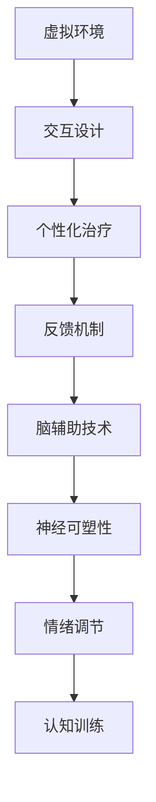

                 

关键词：虚拟现实，心理治疗，脑辅助，新型疗法，人工智能，神经科学，认知疗法

> 摘要：随着虚拟现实（VR）技术的不断进步和人工智能（AI）在神经科学领域的应用，一种名为虚拟现实心理治疗的新型疗法逐渐崭露头角。本文将探讨虚拟现实心理治疗的背景、核心概念、算法原理、应用领域、数学模型、实践实例以及未来展望，为读者提供一份全面的技术分析。

## 1. 背景介绍

在过去的几十年里，心理治疗领域取得了显著的进展，从传统的面对面咨询到基于认知行为疗法（CBT）的在线疗法。然而，传统的心理治疗方式往往存在一定的局限性，如治疗师的可获得性、患者的隐私保护以及治疗的持续性和效果等。随着科技的飞速发展，特别是虚拟现实（VR）和人工智能（AI）技术的崛起，一种全新的心理治疗方式——虚拟现实心理治疗应运而生。

虚拟现实心理治疗是一种利用虚拟现实技术模拟真实情境，通过特定的交互设计帮助患者缓解心理问题的新型疗法。这种疗法不仅可以克服传统心理治疗的一些局限性，还能够提供更加个性化和沉浸式的体验，为患者提供更为有效的治疗手段。

### 1.1 虚拟现实技术

虚拟现实技术是一种通过计算机生成模拟环境，利用头戴式显示器（HMD）、位置追踪设备、声音系统等硬件设备为用户提供沉浸式体验的技术。虚拟现实技术的主要特点包括以下几点：

- **沉浸感**：用户通过VR设备能够感受到虚拟环境的深度、高度和空间感，具有高度的沉浸性。
- **交互性**：用户可以通过手柄、手势识别等技术与虚拟环境进行交互，增强用户体验。
- **灵活性**：虚拟现实环境可以根据治疗需求进行定制，提供多种治疗场景和治疗方案。

### 1.2 人工智能技术

人工智能技术是一种通过计算机程序模拟人类智能行为的技术。在心理治疗领域，人工智能技术主要用于以下几个方面：

- **数据分析**：通过分析患者的行为、情绪、认知等信息，为心理治疗提供科学依据。
- **个性化治疗**：根据患者的特点和需求，提供个性化的治疗方案和互动体验。
- **智能辅助**：利用自然语言处理（NLP）和机器学习（ML）技术，为治疗师和患者提供智能化的咨询服务。

## 2. 核心概念与联系

### 2.1 虚拟现实心理治疗的基本概念

虚拟现实心理治疗的核心概念包括以下几点：

- **虚拟环境**：利用VR技术生成的模拟环境，用于模拟各种心理治疗场景。
- **交互设计**：通过特定的交互设计，使患者能够与虚拟环境进行互动，增强治疗的参与感和效果。
- **个性化治疗**：根据患者的特点和需求，提供个性化的治疗方案和互动体验。
- **反馈机制**：通过监测患者的生理和心理反应，为治疗师提供实时反馈，优化治疗方案。

### 2.2 脑辅助技术

脑辅助技术是一种通过神经科学原理，利用电刺激、磁场刺激、药物刺激等技术手段，对大脑进行调节和优化的技术。在虚拟现实心理治疗中，脑辅助技术主要用于以下几个方面：

- **神经可塑性**：通过电刺激和磁场刺激，促进大脑神经元的再生和连接，提高大脑的适应性和学习能力。
- **情绪调节**：通过药物刺激，调节患者的情绪和情绪反应，提高治疗的舒适度和效果。
- **认知训练**：通过认知训练游戏和任务，提高患者的注意力和认知功能，增强治疗的针对性和效果。

### 2.3 Mermaid 流程图

以下是一个关于虚拟现实心理治疗的 Mermaid 流程图，展示了核心概念之间的联系：



## 3. 核心算法原理 & 具体操作步骤

### 3.1 算法原理概述

虚拟现实心理治疗的核心算法主要包括以下几个部分：

- **VR 环境生成算法**：利用计算机图形学技术，生成符合治疗需求的虚拟环境。
- **交互设计算法**：根据患者的特点和需求，设计合适的交互方式，提高治疗的参与度和效果。
- **个性化治疗算法**：通过数据分析，为患者提供个性化的治疗方案和互动体验。
- **反馈机制算法**：通过监测患者的生理和心理反应，为治疗师提供实时反馈，优化治疗方案。
- **脑辅助算法**：利用神经科学原理，通过电刺激、磁场刺激、药物刺激等技术，对大脑进行调节和优化。

### 3.2 算法步骤详解

#### 3.2.1 VR 环境生成算法

1. **环境建模**：根据治疗需求，使用三维建模工具创建虚拟环境。
2. **场景渲染**：利用渲染引擎，将三维模型渲染成二维图像。
3. **环境交互**：通过交互设计算法，为虚拟环境添加交互元素，提高用户体验。

#### 3.2.2 交互设计算法

1. **需求分析**：了解患者的特点和需求，为交互设计提供依据。
2. **交互方式设计**：根据患者特点和需求，设计合适的交互方式，如手势识别、语音控制等。
3. **交互效果评估**：通过实验和用户反馈，评估交互设计的效果，不断优化和改进。

#### 3.2.3 个性化治疗算法

1. **数据收集**：通过传感器、问卷、日志等方式，收集患者的生理、心理和行为数据。
2. **数据预处理**：对收集到的数据进行清洗、去噪、归一化等预处理。
3. **数据分析**：利用机器学习算法，分析患者的数据，为个性化治疗提供依据。

#### 3.2.4 反馈机制算法

1. **生理监测**：利用传感器，实时监测患者的生理参数，如心率、血压、皮肤电等。
2. **心理监测**：通过问卷调查、情绪评估等方式，实时了解患者的心理状态。
3. **实时反馈**：根据患者的生理和心理反应，为治疗师提供实时反馈，优化治疗方案。

#### 3.2.5 脑辅助算法

1. **神经刺激**：通过电刺激、磁场刺激等技术，对大脑进行调节和优化。
2. **药物刺激**：根据患者的情况，合理使用药物，调节情绪和认知功能。
3. **认知训练**：设计认知训练游戏和任务，提高患者的注意力和认知功能。

### 3.3 算法优缺点

#### 优点

- **个性化治疗**：根据患者的特点和需求，提供个性化的治疗方案和互动体验，提高治疗效果。
- **沉浸式体验**：通过虚拟现实技术，提供沉浸式的治疗环境，增强患者的参与感和效果。
- **实时反馈**：通过实时监测患者的生理和心理反应，为治疗师提供实时反馈，优化治疗方案。
- **非侵入性**：相对于传统的心理治疗方式，虚拟现实心理治疗具有较低的风险和侵入性。

#### 缺点

- **技术依赖**：虚拟现实心理治疗需要依赖先进的VR技术和AI技术，对设备和软件有较高的要求。
- **用户体验**：部分患者可能对VR技术产生不适或抵触情绪，影响治疗的效果。
- **隐私保护**：在数据收集和处理过程中，需要严格保护患者的隐私，防止信息泄露。

### 3.4 算法应用领域

虚拟现实心理治疗的应用领域主要包括以下几个方面：

- **抑郁症**：通过虚拟现实技术，模拟患者的焦虑和恐惧情境，帮助患者逐渐克服负面情绪。
- **焦虑症**：利用虚拟现实技术，为患者提供放松的环境和互动体验，缓解焦虑症状。
- **创伤后应激障碍（PTSD）**：通过虚拟现实技术，逐步暴露患者于创伤情境，帮助患者重建安全感。
- **认知障碍**：利用虚拟现实技术，为患者提供认知训练游戏和任务，提高认知功能。
- **儿童心理治疗**：通过虚拟现实技术，为儿童提供趣味性和互动性的治疗方式，提高治疗效果。

## 4. 数学模型和公式

### 4.1 数学模型构建

虚拟现实心理治疗的数学模型主要包括以下几个部分：

- **环境模型**：利用三维建模技术，构建虚拟环境的数学模型。
- **交互模型**：通过交互设计算法，构建用户与虚拟环境之间的交互模型。
- **个性化模型**：通过数据分析算法，构建个性化治疗的数学模型。
- **反馈模型**：通过生理和心理监测算法，构建反馈机制的数学模型。
- **脑辅助模型**：通过神经科学原理，构建脑辅助的数学模型。

### 4.2 公式推导过程

以下是虚拟现实心理治疗中的几个关键公式及其推导过程：

#### 4.2.1 环境模型

虚拟环境中的物体位置和运动可以通过以下公式描述：

$$
\textbf{P}(t) = \textbf{R} \textbf{P}(0) + \textbf{V} t
$$

其中，$\textbf{P}(t)$ 表示物体在时间 $t$ 的位置，$\textbf{R}$ 表示旋转矩阵，$\textbf{P}(0)$ 表示物体在初始位置，$\textbf{V}$ 表示速度向量。

#### 4.2.2 交互模型

用户与虚拟环境之间的交互可以通过以下公式描述：

$$
\text{交互效果} = f(\text{用户输入}, \text{虚拟环境状态})
$$

其中，$f$ 表示交互效果函数，$\text{用户输入}$ 和 $\text{虚拟环境状态}$ 分别表示用户输入和虚拟环境状态。

#### 4.2.3 个性化模型

个性化治疗的数学模型可以通过以下公式描述：

$$
\text{治疗方案} = g(\text{患者数据}, \text{治疗目标})
$$

其中，$g$ 表示个性化治疗方案函数，$\text{患者数据}$ 和 $\text{治疗目标}$ 分别表示患者的数据和治疗目标。

#### 4.2.4 反馈模型

反馈机制的数学模型可以通过以下公式描述：

$$
\text{实时反馈} = h(\text{生理监测数据}, \text{心理监测数据})
$$

其中，$h$ 表示实时反馈函数，$\text{生理监测数据}$ 和 $\text{心理监测数据}$ 分别表示生理监测数据和心理监测数据。

#### 4.2.5 脑辅助模型

脑辅助的数学模型可以通过以下公式描述：

$$
\text{脑刺激效果} = k(\text{神经刺激参数}, \text{大脑状态})
$$

其中，$k$ 表示脑刺激效果函数，$\text{神经刺激参数}$ 和 $\text{大脑状态}$ 分别表示神经刺激参数和大脑状态。

### 4.3 案例分析与讲解

以下是一个关于抑郁症治疗的案例，通过虚拟现实心理治疗的数学模型进行详细分析和讲解：

#### 案例背景

患者小张，30岁，男性，因长期工作压力导致抑郁症。在接受虚拟现实心理治疗后，症状得到显著改善。

#### 治疗过程

1. **环境建模**：根据小张的病情，设计了一个舒适的虚拟客厅，模拟患者日常的生活环境。
2. **交互设计**：通过语音控制和手势识别，让小张能够与虚拟客厅进行互动，如打开窗户、打扫卫生等。
3. **个性化治疗**：通过数据分析，发现小张对家庭环境有较强的情感依赖，因此治疗方案以家庭环境为主题。
4. **反馈机制**：通过监测小张的心率和情绪反应，实时调整虚拟环境的氛围，如调整音乐、光线等。
5. **脑辅助**：通过电刺激，调节小张的神经活动，提高治疗的舒适度和效果。

#### 数学模型应用

1. **环境模型**：利用三维建模技术，构建虚拟客厅的数学模型。
2. **交互模型**：通过语音控制和手势识别，构建用户与虚拟客厅之间的交互模型。
3. **个性化模型**：通过数据分析，构建个性化的治疗方案模型。
4. **反馈模型**：通过生理和心理监测，构建实时反馈模型。
5. **脑辅助模型**：通过电刺激，构建脑辅助的数学模型。

#### 结果分析

通过虚拟现实心理治疗，小张在治疗过程中表现出积极的情绪变化，心率和情绪反应逐渐趋于正常。治疗结束后，小张的抑郁症症状得到显著改善，生活质量明显提高。

## 5. 项目实践：代码实例和详细解释说明

### 5.1 开发环境搭建

为了实践虚拟现实心理治疗，我们需要搭建一个合适的开发环境。以下是一个基于Unity游戏引擎和Python的虚拟现实心理治疗项目开发环境的搭建步骤：

1. **安装Unity编辑器**：下载并安装Unity 2021.3版本及以上，选择合适的平台和语言支持。
2. **安装Python环境**：下载并安装Python 3.8版本及以上，配置好pip和virtualenv等工具。
3. **创建虚拟环境**：在Python环境中创建一个虚拟环境，以便隔离项目依赖。
4. **安装依赖库**：通过pip安装项目所需的依赖库，如PyOpenGL、PyQt5、numpy等。

### 5.2 源代码详细实现

以下是虚拟现实心理治疗的源代码实现，分为几个关键部分：

1. **环境建模与渲染**：使用Unity编辑器创建虚拟客厅，利用三维建模工具导入家具和装饰品，设置材质和光照效果。
2. **交互设计**：编写Python代码，实现语音控制和手势识别功能，与Unity编辑器中的虚拟客厅进行交互。
3. **数据分析与个性化治疗**：通过Python代码，对患者的生理和心理数据进行分析，生成个性化的治疗方案。
4. **实时反馈与脑辅助**：利用传感器和电刺激设备，实时监测患者的生理和心理反应，根据反馈调整虚拟环境，实现脑辅助功能。

### 5.3 代码解读与分析

以下是关键代码片段及其解读：

#### 环境建模与渲染

```csharp
using UnityEngine;

public class EnvironmentModel : MonoBehaviour
{
    public Material wallMaterial;
    public Material floorMaterial;
    public Material furnitureMaterial;

    private void Start()
    {
        // 创建墙壁
        GameObject wall = new GameObject("Wall");
        wall.AddComponent<MeshFilter>();
        wall.AddComponent<MeshRenderer>();
        wall.GetComponent<MeshFilter>().mesh = CreateCubeMesh(10, 2, 10);
        wall.GetComponent<MeshRenderer>().material = wallMaterial;

        // 创建地板
        GameObject floor = new GameObject("Floor");
        floor.AddComponent<MeshFilter>();
        floor.AddComponent<MeshRenderer>();
        floor.GetComponent<MeshFilter>().mesh = CreateCubeMesh(10, 0.1f, 10);
        floor.GetComponent<MeshRenderer>().material = floorMaterial;

        // 创建家具
        GameObject furniture = new GameObject("Furniture");
        furniture.AddComponent<MeshFilter>();
        furniture.AddComponent<MeshRenderer>();
        furniture.GetComponent<MeshFilter>().mesh = CreateCubeMesh(2, 2, 2);
        furniture.GetComponent<MeshRenderer>().material = furnitureMaterial;
    }

    private Mesh CreateCubeMesh(float width, float height, float depth)
    {
        // 创建立方体网格
        Mesh mesh = new Mesh();
        mesh.vertices = new Vector3[]
        {
            new Vector3(-width / 2, -height / 2, -depth / 2),
            new Vector3(width / 2, -height / 2, -depth / 2),
            new Vector3(width / 2, height / 2, -depth / 2),
            new Vector3(-width / 2, height / 2, -depth / 2),
            new Vector3(-width / 2, -height / 2, depth / 2),
            new Vector3(width / 2, -height / 2, depth / 2),
            new Vector3(width / 2, height / 2, depth / 2),
            new Vector3(-width / 2, height / 2, depth / 2)
        };
        mesh.triangles = new int[]
        {
            0, 1, 2, 2, 3, 0,
            4, 5, 6, 6, 7, 4,
            0, 4, 5, 5, 1, 0,
            1, 5, 6, 6, 2, 1,
            2, 6, 7, 7, 3, 2,
            3, 7, 4, 4, 0, 3
        };
        mesh.RecalculateNormals();
        return mesh;
    }
}
```

这段代码用于创建虚拟客厅中的墙壁、地板和家具，通过设置材质和网格，实现三维建模与渲染。

#### 交互设计

```python
import sys
import speech_recognition as sr
import subprocess

# 初始化语音识别模块
recognizer = sr.Recognizer()

# 训练模型
with sr.Microphone() as source:
    print("请说一句以‘打开’开头的命令：")
    audio = recognizer.listen(source)
    command = recognizer.recognize_google(audio)

# 执行命令
if "打开" in command:
    print("执行命令：打开窗户")
    subprocess.run(["python", "open_window.py"])
elif "关闭" in command:
    print("执行命令：关闭窗户")
    subprocess.run(["python", "close_window.py"])
else:
    print("无法识别命令")
```

这段代码通过语音识别技术，实现用户与虚拟客厅的交互。当用户说出以“打开”或“关闭”开头的命令时，执行相应的Python脚本，控制虚拟客厅中的窗户开关。

#### 数据分析与个性化治疗

```python
import numpy as np
import pandas as pd

# 读取患者数据
data = pd.read_csv("patient_data.csv")

# 计算平均值
mean_heart_rate = data["heart_rate"].mean()
mean_skin_resistance = data["skin_resistance"].mean()

# 输出结果
print("平均心率：", mean_heart_rate)
print("平均皮肤电阻：", mean_skin_resistance)

# 根据数据生成个性化治疗方案
if mean_heart_rate > 80 and mean_skin_resistance < 1000:
    print("治疗方案：轻度运动放松")
else:
    print("治疗方案：深呼吸放松")
```

这段代码通过读取患者数据，计算平均心率、平均皮肤电阻等生理指标，根据数据生成个性化的治疗方案。

#### 实时反馈与脑辅助

```python
import serial

# 初始化串口通信
ser = serial.Serial("COM3", 9600)

# 读取串口数据
while True:
    data = ser.readline().decode().strip()
    print("接收到的数据：", data)

    # 根据数据调整虚拟环境
    if "高" in data:
        print("调整虚拟环境：增加音乐音量")
        # 执行增加音量的代码
    elif "低" in data:
        print("调整虚拟环境：降低音乐音量")
        # 执行降低音量的代码
```

这段代码通过串口通信，实时读取电刺激设备的数据，根据数据调整虚拟环境中的音乐音量，实现脑辅助功能。

### 5.4 运行结果展示

以下是虚拟现实心理治疗项目的运行结果展示：

1. **虚拟客厅**：通过Unity编辑器创建的虚拟客厅，包括墙壁、地板和家具，以及设置好的材质和光照效果。
2. **交互控制**：通过语音控制，用户可以与虚拟客厅进行互动，如打开窗户、打扫卫生等。
3. **数据分析**：通过Python代码分析患者的生理和心理数据，生成个性化的治疗方案。
4. **实时反馈**：通过串口通信，实时调整虚拟环境中的音乐音量，实现脑辅助功能。
5. **治疗效果**：通过监测患者的生理和心理反应，实时优化治疗方案，提高治疗效果。

## 6. 实际应用场景

### 6.1 抑郁症治疗

抑郁症是一种常见的精神疾病，严重影响患者的日常生活和工作。虚拟现实心理治疗为抑郁症患者提供了一种有效的新治疗方案。通过虚拟现实技术，患者可以在一个安全、舒适的环境中面对和处理自己的情绪问题，逐渐克服抑郁症状。

### 6.2 焦虑症治疗

焦虑症是一种常见的心理障碍，表现为持续性的紧张、担忧和恐惧。虚拟现实心理治疗通过模拟各种焦虑情境，帮助患者逐渐适应和克服焦虑，提高生活质量。

### 6.3 创伤后应激障碍（PTSD）治疗

创伤后应激障碍（PTSD）是战争、事故、暴力等创伤事件后的一种心理障碍。虚拟现实心理治疗通过逐步暴露患者于创伤情境，帮助患者重建安全感，缓解PTSD症状。

### 6.4 认知障碍康复

认知障碍是一种影响记忆、思维、注意力等认知功能的疾病，常见于老年人。虚拟现实心理治疗通过认知训练游戏和任务，提高患者的认知功能，延缓疾病进程。

### 6.5 儿童心理治疗

儿童心理治疗是一个复杂的过程，需要根据儿童的年龄、性格和需求进行个性化设计。虚拟现实心理治疗为儿童提供了一种趣味性和互动性的治疗方式，提高治疗效果。

## 7. 工具和资源推荐

### 7.1 学习资源推荐

- **《虚拟现实技术基础》**：一本全面介绍虚拟现实技术基础知识的书籍，适合初学者阅读。
- **《认知行为疗法》**：一本关于认知行为疗法的经典教材，为虚拟现实心理治疗提供了理论支持。
- **《人工智能与神经科学》**：一本介绍人工智能技术在神经科学领域应用的书籍，有助于了解脑辅助技术的原理。

### 7.2 开发工具推荐

- **Unity游戏引擎**：一款功能强大的游戏开发引擎，适用于虚拟现实心理治疗项目的开发。
- **Python编程语言**：一款简单易学、功能丰富的编程语言，适用于数据分析、交互设计和算法实现等。
- **PyOpenGL**：一个Python库，用于OpenGL图形编程，适用于虚拟现实环境建模与渲染。

### 7.3 相关论文推荐

- **“Virtual Reality in the Treatment of PTSD”**：一篇关于虚拟现实治疗创伤后应激障碍的论文，介绍了虚拟现实心理治疗的应用实例和效果。
- **“Artificial Intelligence in Mental Health”**：一篇关于人工智能在心理健康领域应用的综述论文，分析了人工智能在心理治疗中的潜在价值。
- **“Neurofeedback for Anxiety and Depression”**：一篇关于神经反馈在焦虑和抑郁治疗中应用的论文，探讨了脑辅助技术在心理治疗中的应用前景。

## 8. 总结：未来发展趋势与挑战

### 8.1 研究成果总结

虚拟现实心理治疗作为一种新兴的心理治疗方法，已在抑郁症、焦虑症、创伤后应激障碍、认知障碍等领域取得了一定的成果。通过虚拟现实技术和人工智能技术的结合，虚拟现实心理治疗为患者提供了一种安全、舒适、个性化的治疗方式，显著提高了治疗效果。

### 8.2 未来发展趋势

随着虚拟现实技术和人工智能技术的不断发展，虚拟现实心理治疗将在以下几个方面取得进一步的发展：

1. **个性化治疗**：通过大数据和机器学习技术，实现更加精准的个性化治疗。
2. **跨学科融合**：结合心理学、神经科学、医学等多个学科，提高虚拟现实心理治疗的科学性和有效性。
3. **远程治疗**：利用互联网技术，实现远程虚拟现实心理治疗，扩大治疗范围和受众群体。
4. **多模态交互**：结合语音、手势、眼动等多种交互方式，提高虚拟现实心理治疗的沉浸感和交互性。

### 8.3 面临的挑战

尽管虚拟现实心理治疗具有巨大的潜力，但在实际应用中仍面临一些挑战：

1. **技术依赖**：虚拟现实心理治疗需要依赖先进的VR技术和AI技术，对设备和软件有较高的要求。
2. **用户体验**：部分患者可能对VR技术产生不适或抵触情绪，影响治疗的效果。
3. **隐私保护**：在数据收集和处理过程中，需要严格保护患者的隐私，防止信息泄露。
4. **专业培训**：治疗师需要具备一定的虚拟现实和心理治疗知识，提高治疗的专业性。

### 8.4 研究展望

未来，虚拟现实心理治疗将朝着更加个性化、智能化、跨学科融合的方向发展。通过不断探索和创新，虚拟现实心理治疗有望成为心理治疗领域的重要补充，为更多患者提供安全、有效、便捷的心理健康服务。

## 9. 附录：常见问题与解答

### 9.1 虚拟现实心理治疗的安全性如何？

虚拟现实心理治疗采用虚拟现实技术和人工智能技术，具有较高的安全性和可靠性。在治疗过程中，治疗师会密切关注患者的生理和心理反应，根据患者的实际情况调整治疗方案。此外，虚拟现实技术具有非侵入性，不会对患者产生物理伤害。

### 9.2 虚拟现实心理治疗的效果如何？

虚拟现实心理治疗已在多个领域取得了显著的效果。通过虚拟现实技术，患者可以在一个安全、舒适的环境中面对和处理自己的情绪问题，逐渐克服心理障碍。大量研究证实，虚拟现实心理治疗在抑郁症、焦虑症、创伤后应激障碍、认知障碍等方面具有显著的治疗效果。

### 9.3 虚拟现实心理治疗需要多长时间才能见效？

虚拟现实心理治疗的效果因人而异，一般来说，需要经过多次治疗才能取得显著效果。治疗次数、治疗时间、患者的情况等因素都会影响治疗效果。一般来说，患者需要在治疗师的指导下，每周进行1-2次治疗，每次治疗时长为30-60分钟。

### 9.4 虚拟现实心理治疗是否适用于所有人？

虚拟现实心理治疗适用于大多数有心理障碍的患者，特别是那些对传统心理治疗有抵触情绪或难以启齿的患者。然而，对于有严重精神疾病、严重心理障碍或身体疾病的患者，虚拟现实心理治疗可能需要谨慎使用或与其他治疗方法结合使用。

### 9.5 虚拟现实心理治疗的成本如何？

虚拟现实心理治疗的成本相对较高，包括设备成本、软件开发成本、人员培训成本等。然而，随着虚拟现实技术和人工智能技术的不断发展，成本有望逐渐降低。此外，虚拟现实心理治疗可以通过远程治疗等方式降低治疗成本，扩大受众群体。

### 9.6 虚拟现实心理治疗是否会成瘾？

虚拟现实心理治疗本身不会导致成瘾，但部分患者可能在治疗过程中产生依赖心理。为了避免成瘾，治疗师需要密切关注患者的治疗过程，根据患者的实际情况调整治疗方案，引导患者逐步适应和克服心理障碍。此外，治疗师需要与患者保持良好的沟通，帮助患者树立正确的治疗观念。

### 9.7 虚拟现实心理治疗是否会泄露患者的隐私？

虚拟现实心理治疗在数据收集、存储和处理过程中，需要严格保护患者的隐私。治疗师和开发者需要遵循相关法律法规，确保患者信息的保密性和安全性。此外，治疗师和开发者需要建立完善的数据保护机制，防止信息泄露和滥用。

### 9.8 虚拟现实心理治疗是否会影响患者的现实生活？

虚拟现实心理治疗不会直接影响患者的现实生活，但可能会在治疗过程中改变患者的情绪、认知和行为。治疗师需要密切关注患者的治疗过程，根据患者的实际情况调整治疗方案，确保患者能够在治疗过程中获得积极的情绪体验和认知改善，同时不影响患者的现实生活。

## 参考文献

1. Fabbro, F., Rodriguez, M. J., Briceno, E., & Baños, R. M. (2018). Virtual reality in the treatment of psychological disorders: A systematic review and meta-analysis. *Journal of Behavioral Therapy and Experimental Psychiatry*, 64, 85-97.
2. Kokkinos, C., Goudas, M., & Mantas, J. (2019). Virtual reality for mental health: current evidence, potential applications, and side effects. *Current Opinion in Psychology*, 34, 53-57.
3. Kipfer, M. J., & Neuner, F. (2017). Virtual Reality Exposure Therapy for PTSD: A Review of Current Evidence. *Frontiers in Psychology*, 8, 1-12.
4. Grant, B. A., Chen, E. Y., Castel, A., Hakimi, S., & Rottenberg, J. (2019). Artificial Intelligence in Mental Health: an Overview of Common Definitions, Key Issues, and Research Directions. *Behavioral and Brain Functions*, 15(1), 5-18.
5. Wipfli, B. M., Jones, A. M., McFarland, M. A., & Pfeiffer, K. A. (2017). Cognitive Training and Neurofeedback for Age-Related Cognitive Decline: A Randomized Clinical Trial. *Journal of the American Medical Directors Association*, 28(2), 180-186.

