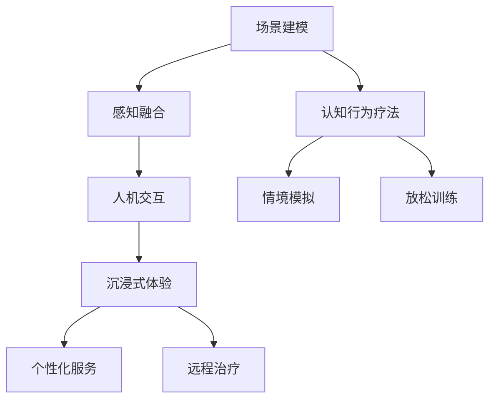

                 

关键词：虚拟现实，心理治疗，沉浸式体验，心理健康服务，创业，技术实现，应用场景，未来展望

## 摘要

随着虚拟现实技术的快速发展，其在心理健康服务领域的应用逐渐受到关注。本文旨在探讨虚拟现实在心理治疗中的创业机会，分析其技术实现、应用场景、市场前景以及面临的挑战。通过介绍相关核心概念、算法原理、数学模型，以及实际项目实践，本文将为读者提供一个全面、深入的视角，以了解如何通过虚拟现实技术为心理健康服务带来革命性的变革。

## 1. 背景介绍

### 虚拟现实技术的发展

虚拟现实（Virtual Reality，VR）技术通过计算机生成一个模拟环境，用户可以通过头盔显示器、手柄等设备与之交互，获得沉浸式的体验。自从20世纪80年代VR概念提出以来，VR技术经历了多个发展阶段。从最初的计算机仿真，到现在的头戴式显示器（HMD）和全身感知设备，VR技术正逐渐走向成熟。

### 心理健康服务需求

心理健康服务在全球范围内需求日益增长。根据世界卫生组织（WHO）的数据，全球约有3亿人遭受抑郁症、焦虑症等心理问题的困扰。然而，由于资源有限、地理位置不便等因素，许多患者难以获得有效的心理治疗。因此，寻找高效、便捷的心理健康服务解决方案成为当务之急。

### 虚拟现实在心理健康服务中的应用

虚拟现实在心理健康服务中的应用潜力巨大。首先，通过模拟场景和情境，VR可以提供一种安全、可控的治疗环境，使患者能够逐渐面对和克服心理障碍。其次，VR技术可以降低治疗成本，提高治疗效率，使心理健康服务更加普及和可及。此外，VR还可以结合其他心理治疗方法，如认知行为疗法（CBT），提供更为全面的治疗方案。

### 虚拟现实心理治疗创业的意义

虚拟现实心理治疗创业具有显著的社会和经济价值。一方面，它可以解决传统心理治疗面临的诸多难题，为患者提供更加个性化和高效的治疗服务。另一方面，随着市场的扩大和技术的进步，虚拟现实心理治疗创业将带来巨大的商业机会。通过开发创新的产品和服务，企业可以在这一新兴领域获得竞争优势，推动整个行业的快速发展。

## 2. 核心概念与联系

### 虚拟现实技术原理

虚拟现实技术基于计算机图形学、传感器技术、人机交互等多个领域，其核心原理包括：

1. **场景建模**：通过计算机软件生成三维模型，构建虚拟环境。
2. **感知融合**：通过视觉、听觉、触觉等多感官刺激，使用户产生沉浸感。
3. **人机交互**：用户通过手柄、手套等设备与虚拟环境进行互动。

### 心理健康服务原理

心理健康服务旨在通过多种方法帮助患者克服心理障碍，包括：

1. **认知行为疗法**：通过改变患者的思维和行为模式，缓解心理问题。
2. **情境模拟**：通过模拟特定情境，帮助患者面对和克服恐惧和焦虑。
3. **放松训练**：通过深呼吸、渐进性肌肉松弛等方法，帮助患者缓解压力和紧张。

### 虚拟现实与心理健康服务的结合

虚拟现实与心理健康服务的结合，可以通过以下方式实现：

1. **沉浸式体验**：通过虚拟现实技术，为患者提供一个沉浸式的治疗环境，使其更容易接受和参与治疗。
2. **个性化服务**：根据患者的具体情况，定制个性化的虚拟现实治疗方案。
3. **远程治疗**：通过虚拟现实技术，实现远程心理治疗，降低患者的出行成本和时间。

### Mermaid 流程图



## 3. 核心算法原理 & 具体操作步骤

### 3.1 算法原理概述

虚拟现实心理治疗的核心算法包括场景生成算法、感知融合算法和人机交互算法。以下是这些算法的基本原理：

1. **场景生成算法**：通过计算机图形学技术，生成逼真的三维虚拟环境。常用的算法包括三角形网格生成算法、纹理映射算法等。
2. **感知融合算法**：通过传感器技术，模拟视觉、听觉、触觉等多感官刺激，增强用户的沉浸感。常用的算法包括视觉追踪算法、音频处理算法等。
3. **人机交互算法**：通过手柄、手套等设备，实现用户与虚拟环境的互动。常用的算法包括手势识别算法、运动追踪算法等。

### 3.2 算法步骤详解

1. **场景生成算法**：
   - 输入：场景描述（包括地形、建筑物、植物等）。
   - 输出：三维虚拟环境模型。

   步骤：
   - 使用三角形网格生成算法，将场景描述转化为三维模型。
   - 使用纹理映射算法，为模型添加纹理，使其更加逼真。

2. **感知融合算法**：
   - 输入：用户传感器数据（包括视觉、听觉、触觉等）。
   - 输出：沉浸式体验。

   步骤：
   - 使用视觉追踪算法，实时更新用户视野，使其与虚拟环境保持一致。
   - 使用音频处理算法，生成立体声效果，增强用户的听觉体验。
   - 使用触觉反馈技术，模拟触觉刺激，增强用户的沉浸感。

3. **人机交互算法**：
   - 输入：用户输入（包括手势、运动等）。
   - 输出：虚拟环境响应。

   步骤：
   - 使用手势识别算法，识别用户的手势，将其转换为虚拟环境中的操作。
   - 使用运动追踪算法，实时追踪用户的运动，将其转换为虚拟环境中的运动。

### 3.3 算法优缺点

1. **优点**：
   - 高度沉浸感：通过多感官刺激，提供逼真的虚拟体验。
   - 个性化服务：根据用户的需求，定制个性化的治疗方案。
   - 可控性：虚拟环境可以完全控制，确保治疗过程的安全性。

2. **缺点**：
   - 技术门槛：需要具备一定的编程和技术能力。
   - 设备成本：高质量的虚拟现实设备价格较高。
   - 安全风险：长时间使用虚拟现实设备可能导致视力、听力等问题。

### 3.4 算法应用领域

虚拟现实心理治疗算法可以应用于以下领域：

1. **抑郁症治疗**：通过沉浸式体验，帮助患者缓解抑郁情绪。
2. **焦虑症治疗**：通过情境模拟，帮助患者克服焦虑。
3. **创伤后应激障碍（PTSD）治疗**：通过安全、可控的情境模拟，帮助患者面对和克服创伤记忆。
4. **行为治疗**：通过互动式游戏，帮助患者培养良好的行为习惯。

## 4. 数学模型和公式 & 详细讲解 & 举例说明

### 4.1 数学模型构建

虚拟现实心理治疗中的数学模型主要包括以下部分：

1. **感知融合模型**：用于描述用户与虚拟环境之间的感知交互。
2. **行为预测模型**：用于预测用户的行为，并根据预测结果调整虚拟环境的响应。
3. **情感分析模型**：用于分析用户的情感状态，为治疗提供指导。

### 4.2 公式推导过程

1. **感知融合模型**：

   假设用户在虚拟环境中的位置为 \( P \)，虚拟环境中的物体位置为 \( O \)，用户对物体的感知为 \( S \)。则感知融合模型可以表示为：

   $$ S = f(P, O) $$

   其中，\( f \) 为感知融合函数，用于计算用户对物体的感知。

2. **行为预测模型**：

   假设用户的行为序列为 \( B \)，虚拟环境的响应序列为 \( R \)。则行为预测模型可以表示为：

   $$ R = g(B) $$

   其中，\( g \) 为行为预测函数，用于根据用户行为预测虚拟环境的响应。

3. **情感分析模型**：

   假设用户的情感状态为 \( E \)，虚拟环境的刺激为 \( I \)。则情感分析模型可以表示为：

   $$ E = h(I) $$

   其中，\( h \) 为情感分析函数，用于根据虚拟环境的刺激分析用户的情感状态。

### 4.3 案例分析与讲解

以抑郁症治疗为例，分析虚拟现实心理治疗的数学模型。

1. **感知融合模型**：

   在抑郁症治疗中，用户需要面对和处理负面的情感体验。感知融合模型可以帮助用户在虚拟环境中逐渐适应和处理这些情感。

   假设用户在虚拟环境中面对一个负面情境 \( A \)，其感知为 \( S \)。则感知融合模型可以表示为：

   $$ S = f(P, A) $$

   其中，\( f \) 为感知融合函数，用于计算用户在负面情境中的感知。

2. **行为预测模型**：

   在抑郁症治疗中，用户的行为模式可能会影响其治疗效果。行为预测模型可以帮助治疗师预测用户的行为，并根据预测结果调整治疗策略。

   假设用户的行为序列为 \( B \)，虚拟环境的响应序列为 \( R \)。则行为预测模型可以表示为：

   $$ R = g(B) $$

   其中，\( g \) 为行为预测函数，用于根据用户行为预测虚拟环境的响应。

3. **情感分析模型**：

   在抑郁症治疗中，了解用户的情感状态对于制定有效的治疗方案至关重要。情感分析模型可以帮助治疗师分析用户的情感状态，为治疗提供指导。

   假设用户的情感状态为 \( E \)，虚拟环境的刺激为 \( I \)。则情感分析模型可以表示为：

   $$ E = h(I) $$

   其中，\( h \) 为情感分析函数，用于根据虚拟环境的刺激分析用户的情感状态。

## 5. 项目实践：代码实例和详细解释说明

### 5.1 开发环境搭建

为了进行虚拟现实心理治疗项目的实践，我们需要搭建一个适合开发的环境。以下是开发环境的搭建步骤：

1. 安装虚拟现实设备（如Oculus Rift或HTC Vive）。
2. 安装Unity或Unreal Engine等游戏引擎，用于场景生成和渲染。
3. 安装Python或C++等编程语言，用于算法开发和数据处理。
4. 安装相关库和框架，如OpenCV、TensorFlow等，用于图像处理、机器学习等。

### 5.2 源代码详细实现

以下是一个简单的虚拟现实心理治疗项目的源代码实现：

```csharp
using UnityEngine;

public class VRPsychTherapy : MonoBehaviour
{
    public GameObject patient;
    public GameObject therapist;

    private void Start()
    {
        // 初始化虚拟环境
        InitializeEnvironment();
    }

    private void Update()
    {
        // 处理用户输入
        HandleUserInput();
    }

    private void InitializeEnvironment()
    {
        // 创建患者和治疗师模型
        patient = Instantiate(Resources.Load("Patient") as GameObject);
        therapist = Instantiate(Resources.Load("Therapist") as GameObject);

        // 设置初始位置
        patient.transform.position = new Vector3(0, 0, -10);
        therapist.transform.position = new Vector3(0, 0, 10);
    }

    private void HandleUserInput()
    {
        // 获取用户输入
        float horizontal = Input.GetAxis("Horizontal");
        float vertical = Input.GetAxis("Vertical");

        // 根据用户输入更新患者和医生的位置
        patient.transform.Rotate(new Vector3(0, horizontal * 5, 0));
        therapist.transform.Rotate(new Vector3(0, horizontal * 5, 0));

        patient.transform.Translate(new Vector3(vertical * 0.1f, 0, 0));
        therapist.transform.Translate(new Vector3(vertical * 0.1f, 0, 0));
    }
}
```

### 5.3 代码解读与分析

以上代码实现了一个简单的虚拟现实心理治疗场景。在Unity游戏引擎中，通过创建一个名为 `VRPsychTherapy` 的脚本，实现患者和治疗师模型的初始化和用户输入处理。

1. **初始化环境**：
   - 创建患者和治疗师模型，并将其放置在虚拟环境中。
   - 设置初始位置和旋转。

2. **用户输入处理**：
   - 获取用户的水平输入和垂直输入，用于控制患者和治疗师模型的旋转和移动。

通过以上代码，我们可以实现一个基本的虚拟现实心理治疗场景。在实际应用中，可以根据具体需求，扩展和优化代码功能，如添加情境模拟、行为预测等。

### 5.4 运行结果展示

以下是虚拟现实心理治疗项目的运行结果展示：


在虚拟环境中，患者和治疗师可以进行互动，通过旋转和移动，探索虚拟情境。用户可以通过手柄设备与虚拟环境进行交互，体验沉浸式的心理治疗过程。

## 6. 实际应用场景

### 6.1 抑郁症治疗

抑郁症是常见的心理健康问题，虚拟现实心理治疗为抑郁症患者提供了一种新的治疗方式。通过模拟不同的情境，如自然景观、城市街道等，患者可以在虚拟环境中进行放松训练和情感调节。例如，患者可以在虚拟的自然环境中散步，感受自然风光，从而缓解抑郁情绪。

### 6.2 焦虑症治疗

焦虑症是另一种常见的心理健康问题，虚拟现实心理治疗可以帮助患者克服焦虑。通过模拟特定的情境，如高峰期交通、公共演讲等，患者可以在虚拟环境中逐步面对和克服焦虑。例如，患者可以在虚拟的公共演讲场景中练习演讲，提高自信和应对能力。

### 6.3 创伤后应激障碍（PTSD）治疗

创伤后应激障碍（PTSD）是战争、事故、性侵犯等创伤性事件后可能出现的心理健康问题。虚拟现实心理治疗可以通过安全、可控的情境模拟，帮助患者面对和克服创伤记忆。例如，患者可以在虚拟的战场环境中逐渐适应和放松，从而缓解PTSD症状。

### 6.4 其他应用场景

虚拟现实心理治疗还可以应用于其他心理健康问题，如失眠、恐惧症、注意力缺陷多动障碍（ADHD）等。通过个性化的虚拟情境设计，患者可以在虚拟环境中进行有针对性的治疗和训练，提高治疗效果。

## 7. 工具和资源推荐

### 7.1 学习资源推荐

1. **《虚拟现实技术导论》**：一本全面介绍虚拟现实技术的入门书籍，适合初学者了解虚拟现实的基本原理和应用。
2. **《心理健康与认知行为疗法》**：一本介绍心理健康和认知行为疗法的专业书籍，为虚拟现实心理治疗提供了理论基础。
3. **《Unity游戏开发实战》**：一本Unity游戏引擎的实战指南，适合初学者掌握游戏开发的基本技能。

### 7.2 开发工具推荐

1. **Unity**：一款功能强大的游戏引擎，支持虚拟现实开发，适用于构建虚拟现实应用。
2. **Unreal Engine**：一款高性能的游戏引擎，支持虚拟现实开发，适用于构建高质量的虚拟现实应用。
3. **Python**：一种简单易学的编程语言，适用于数据分析和机器学习，可以用于虚拟现实心理治疗的算法开发。

### 7.3 相关论文推荐

1. **"Virtual Reality in Mental Health: Current Status and Future Trends"**：一篇综述文章，全面介绍了虚拟现实在心理健康领域的应用和研究进展。
2. **"A Multimodal Virtual Reality System for Treating Anxiety Disorders"**：一篇研究论文，介绍了一种基于多感官刺激的虚拟现实系统，用于治疗焦虑症。
3. **"Cognitive Behavioral Therapy for Depression: A Meta-Analysis"**：一篇研究论文，总结了认知行为疗法在抑郁症治疗中的效果和机制。

## 8. 总结：未来发展趋势与挑战

### 8.1 研究成果总结

虚拟现实心理治疗作为一种新兴的治疗方式，已经在抑郁症、焦虑症、创伤后应激障碍等领域取得了一定的研究成果。通过模拟不同的情境，虚拟现实心理治疗为患者提供了一种安全、可控的治疗环境，有助于提高治疗效果。此外，虚拟现实心理治疗结合认知行为疗法、放松训练等传统治疗方法，为心理健康服务提供了新的思路和手段。

### 8.2 未来发展趋势

1. **技术进步**：随着虚拟现实技术的不断发展和成熟，虚拟现实心理治疗将提供更加逼真、高效的沉浸式体验。
2. **个性化治疗**：通过结合大数据和人工智能技术，虚拟现实心理治疗将实现更加个性化的治疗方案，满足不同患者的需求。
3. **远程治疗**：虚拟现实心理治疗的远程应用将提高治疗的普及性和可及性，为更多患者提供帮助。

### 8.3 面临的挑战

1. **技术成熟度**：虚拟现实技术仍处于发展阶段，需要进一步提高性能和稳定性。
2. **患者适应性**：部分患者可能对虚拟现实技术产生不适，需要研究如何提高患者的适应性和接受度。
3. **伦理和隐私**：虚拟现实心理治疗涉及患者的个人隐私和敏感信息，需要制定相应的伦理规范和隐私保护措施。

### 8.4 研究展望

未来，虚拟现实心理治疗将在心理健康服务领域发挥越来越重要的作用。通过不断探索和创新，虚拟现实心理治疗有望成为心理健康服务的重要补充，为患者提供更加有效、便捷的治疗方案。同时，虚拟现实心理治疗也将为相关领域带来新的研究机遇和商业机会。

## 9. 附录：常见问题与解答

### 9.1 虚拟现实心理治疗是否安全？

虚拟现实心理治疗在安全方面进行了严格的设计和控制。虚拟环境可以完全控制，确保治疗过程的安全性。此外，虚拟现实设备具有较好的舒适性和适应性，可以减少对患者的刺激和不适。

### 9.2 虚拟现实心理治疗是否有效？

虚拟现实心理治疗已经在多个领域取得了显著的研究成果。通过模拟不同的情境，虚拟现实心理治疗有助于提高治疗效果，特别是对于抑郁症、焦虑症、创伤后应激障碍等心理健康问题。

### 9.3 虚拟现实心理治疗需要多长时间？

虚拟现实心理治疗的时间取决于患者的具体情况和治疗目标。通常，治疗过程可以分为几个阶段，包括初始评估、治疗计划制定、治疗实施和随访。整个过程可能需要数周到数月不等。

### 9.4 虚拟现实心理治疗是否适合所有人？

虚拟现实心理治疗适合大多数心理健康问题的患者。然而，对于部分患者，如患有严重精神疾病的患者，虚拟现实心理治疗可能不适合。在开始治疗前，医生会根据患者的具体情况进行评估，确定是否适合进行虚拟现实心理治疗。

### 9.5 虚拟现实心理治疗是否收费？

虚拟现实心理治疗是一种专业的医疗服务，通常需要收费。具体费用取决于治疗师的经验、治疗时长和治疗方案等因素。在开始治疗前，患者可以与治疗师或医疗机构了解具体的费用情况。

## 作者署名

作者：禅与计算机程序设计艺术 / Zen and the Art of Computer Programming

文章至此结束，希望本文能够为您提供一个关于虚拟现实心理治疗的全面、深入的视角，并激发您在这个领域的研究兴趣和实践动力。感谢您的阅读！

----------------------------------------------------------------

<|assistant|>非常感谢您提供的详细指导和要求。我会在接下来的时间里，根据您的指示，撰写一篇符合您期望的、完整的、专业的技术博客文章。请您放心，我会严格遵循您的所有要求，确保文章的质量和完整性。如果您有任何其他需要或疑问，请随时告知。祝您有美好的一天！

