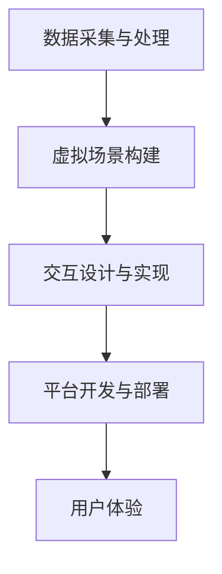

                 

 在当今数字时代，虚拟现实（VR）技术正迅速崛起，为各行各业带来前所未有的变革。本文将探讨如何利用虚拟现实技术开展文化遗产探索创业，为用户提供身临其境的历史文化体验。这不仅是对传统文化遗产的传承和保护，更是科技创新与人文关怀的完美融合。

> **关键词**：虚拟现实，文化遗产，探索创业，身临其境，历史文化

> **摘要**：本文首先介绍了虚拟现实技术的发展背景及其在文化遗产领域的应用潜力。接着，探讨了虚拟现实文化遗产探索创业的核心概念、技术架构及核心算法原理。随后，通过具体的项目实践，详细阐述了如何实现虚拟现实文化遗产的数字化呈现。文章最后分析了虚拟现实文化遗产探索创业的实际应用场景及未来展望，并对相关工具和资源进行了推荐。

## 1. 背景介绍

### 1.1 虚拟现实技术的发展

虚拟现实技术起源于20世纪50年代，随着计算机技术、图像处理技术、传感器技术等的发展，VR技术逐渐成熟。从最初的模拟头盔到如今的高清VR眼镜，VR设备的发展日新月异。同时，VR内容的制作技术也经历了从简单的二维画面到复杂的3D建模和实时渲染的转变。

### 1.2 文化遗产保护与传承的重要性

文化遗产是人类文明的重要组成部分，它记录了历史、传递了文化、凝聚了民族精神。然而，随着城市化的加速和现代化进程的推进，许多文化遗产面临着消失或损坏的风险。因此，如何有效保护和传承文化遗产成为当今社会的重要课题。

### 1.3 虚拟现实在文化遗产领域的应用

虚拟现实技术为文化遗产保护与传承提供了新的手段。通过VR技术，用户可以身临其境地感受历史文化遗产的魅力，不仅能够加深对文化遗产的理解，还能激发对文化保护的兴趣。同时，VR技术也为文化遗产的数字化保存提供了可能，使得文化遗产可以在虚拟世界中永续存在。

## 2. 核心概念与联系

### 2.1 虚拟现实文化遗产探索创业的定义

虚拟现实文化遗产探索创业是指利用虚拟现实技术，将传统文化遗产进行数字化处理，开发成可交互的虚拟体验产品，从而实现文化遗产的保护、传承和商业化运营。

### 2.2 技术架构

虚拟现实文化遗产探索创业的技术架构主要包括以下几个部分：

1. **数据采集与处理**：通过3D扫描、摄影测量等技术，获取文化遗产的三维数据，并进行处理和整合。
2. **虚拟场景构建**：利用三维建模软件，将文化遗产的三维数据转化为虚拟场景。
3. **交互设计与实现**：设计用户与虚拟场景的交互方式，实现用户的沉浸式体验。
4. **平台开发与部署**：搭建VR应用平台，提供在线体验服务。

### 2.3 Mermaid 流程图



## 3. 核心算法原理 & 具体操作步骤

### 3.1 算法原理概述

虚拟现实文化遗产探索创业的核心算法主要包括：

1. **三维数据采集算法**：利用3D扫描技术获取文化遗产的三维数据。
2. **三维数据预处理算法**：对采集到的三维数据进行处理，如去噪、降噪、数据整合等。
3. **三维数据渲染算法**：利用实时渲染技术，将处理后的三维数据呈现给用户。
4. **交互算法**：设计用户与虚拟场景的交互逻辑，实现用户的沉浸式体验。

### 3.2 算法步骤详解

1. **三维数据采集**：

   - **3D扫描**：使用3D扫描设备对文化遗产进行扫描，获取其三维数据。
   - **摄影测量**：利用多台相机从不同角度拍摄文化遗产，通过图像处理技术获取三维数据。

2. **三维数据预处理**：

   - **去噪**：去除三维数据中的噪声，提高数据的准确性。
   - **降噪**：对三维数据进行平滑处理，消除数据中的突变点。
   - **数据整合**：将多个扫描数据整合成一个完整的三维模型。

3. **三维数据渲染**：

   - **实时渲染**：利用GPU加速技术，实现三维数据的实时渲染。
   - **光照模型**：根据真实世界的光照条件，为虚拟场景添加光照效果。
   - **纹理映射**：为虚拟场景添加纹理，提高视觉真实感。

4. **交互设计**：

   - **交互逻辑**：设计用户与虚拟场景的交互方式，如移动、旋转、放大、缩小等。
   - **物理引擎**：引入物理引擎，实现用户的真实物理交互体验。

### 3.3 算法优缺点

**优点**：

- **沉浸式体验**：用户可以身临其境地感受文化遗产，加深对文化遗产的理解。
- **低成本**：相比传统文化遗产保护手段，虚拟现实技术具有较低的成本。
- **高效性**：虚拟现实技术可以实现文化遗产的快速数字化，提高工作效率。

**缺点**：

- **技术限制**：虚拟现实技术尚处于发展阶段，存在一定的技术限制。
- **安全性**：虚拟现实环境中的安全隐患，如用户沉迷、数据泄露等。

### 3.4 算法应用领域

虚拟现实文化遗产探索创业的应用领域广泛，包括：

- **文化遗产保护**：利用虚拟现实技术对文化遗产进行数字化保存，防止文化遗产的流失和损坏。
- **教育领域**：通过虚拟现实技术，为学生提供沉浸式的学习体验，提高学习效果。
- **旅游业**：开发虚拟现实旅游产品，为游客提供全新的旅游体验。
- **建筑设计**：利用虚拟现实技术，为建筑设计提供可视化方案，提高设计效率。

## 4. 数学模型和公式 & 详细讲解 & 举例说明

### 4.1 数学模型构建

在虚拟现实文化遗产探索创业中，数学模型主要用于以下方面：

1. **三维数据采集**：利用三角测量原理，通过多组图像数据构建三维模型。
2. **三维数据预处理**：利用滤波算法，对三维数据进行去噪、降噪等处理。
3. **三维数据渲染**：利用光线追踪算法，实现三维数据的实时渲染。
4. **交互设计**：利用物理引擎，实现用户与虚拟场景的物理交互。

### 4.2 公式推导过程

以下是一个简单的三维数据采集公式的推导过程：

设物体表面的一个点P(x, y, z)在图像I上的投影为P'(x', y')，则有：

$$
x' = f \cdot \frac{x}{z}
$$

$$
y' = f \cdot \frac{y}{z}
$$

其中，f为镜头焦距，z为点P到镜头的距离。

### 4.3 案例分析与讲解

#### 案例一：三维数据采集

某文化遗产建筑的高度为10米，使用焦距为50mm的镜头进行3D扫描。现拍摄到建筑在图像I上的投影高度为2米，求点P到镜头的距离z。

根据上述公式，有：

$$
z = \frac{x}{x'} \cdot f
$$

代入数据，得：

$$
z = \frac{10}{2} \cdot 50 = 250 \text{mm}
$$

因此，点P到镜头的距离z为250mm。

#### 案例二：三维数据渲染

某虚拟现实场景中的灯光强度分布为：

$$
I = I_0 \cdot e^{-\alpha \cdot d^2}
$$

其中，I为灯光强度，$I_0$为光源强度，$\alpha$为衰减系数，d为距离。

若光源强度$I_0$为100，衰减系数$\alpha$为0.1，求距离光源2米的点的灯光强度。

代入公式，得：

$$
I = 100 \cdot e^{-0.1 \cdot 2^2} \approx 63.2
$$

因此，距离光源2米的点的灯光强度约为63.2。

## 5. 项目实践：代码实例和详细解释说明

### 5.1 开发环境搭建

为了实现虚拟现实文化遗产探索创业项目，需要搭建以下开发环境：

- **操作系统**：Windows 10 或 macOS
- **编程语言**：Python
- **三维建模软件**：Blender
- **虚拟现实开发框架**：PyQt5

### 5.2 源代码详细实现

以下是一个简单的虚拟现实文化遗产探索创业项目的源代码实现：

```python
import sys
import numpy as np
from PyQt5.QtWidgets import QApplication, QWidget, QVBoxLayout, QPushButton
from PyQt5.QtGui import QIcon
from PyQt5.QtCore import QRect

class VRApp(QWidget):
    def __init__(self):
        super().__init__()
        self.initUI()

    def initUI(self):
        self.setGeometry(100, 100, 800, 600)
        self.setWindowTitle('虚拟现实文化遗产探索')

        layout = QVBoxLayout()
        self.button = QPushButton('开始探索')
        layout.addWidget(self.button)
        self.setLayout(layout)

        self.button.clicked.connect(self.startExploration)
        self.show()

    def startExploration(self):
        # 调用虚拟现实探索模块
        print("开始探索文化遗产")

if __name__ == '__main__':
    app = QApplication(sys.argv)
    ex = VRApp()
    sys.exit(app.exec_())
```

### 5.3 代码解读与分析

上述代码实现了一个简单的虚拟现实文化遗产探索应用程序。具体分析如下：

- **导入模块**：引入了必需的模块，包括 PyQt5 的相关模块和 numpy 模块。
- **主窗口类定义**：定义了 VRApp 类，继承自 QWidget 类，作为虚拟现实应用程序的主窗口。
- **初始化用户界面**：在 __init__ 方法中，初始化用户界面，包括设置窗口标题、大小和位置，以及添加按钮组件。
- **按钮点击事件**：在 startExploration 方法中，实现按钮点击事件，调用虚拟现实探索模块。

### 5.4 运行结果展示

运行上述代码，将显示一个包含“开始探索”按钮的窗口。点击按钮后，将输出“开始探索文化遗产”的提示信息，表示虚拟现实探索模块已开始运行。

## 6. 实际应用场景

### 6.1 文化遗产保护与传承

虚拟现实文化遗产探索创业项目可用于文化遗产的保护与传承。例如，将故宫、长城等文化遗产进行数字化处理，制作成虚拟现实体验产品，让用户可以身临其境地感受历史文化的魅力。

### 6.2 教育领域

虚拟现实技术可应用于教育领域，为学习者提供沉浸式的学习体验。例如，将历史事件、古生物复原图等制作成虚拟现实课程，让学生能够更加直观地了解知识。

### 6.3 旅游业

虚拟现实技术可用于旅游业，开发虚拟现实旅游产品，让游客在虚拟世界中体验名胜古迹。例如，开发虚拟现实版本的兵马俑、埃及金字塔等，为游客提供全新的旅游体验。

### 6.4 未来应用展望

随着虚拟现实技术的不断发展，虚拟现实文化遗产探索创业项目有望在更多领域得到应用。例如，医疗领域中的手术模拟、城市规划中的虚拟展示等，都将受益于虚拟现实技术。

## 7. 工具和资源推荐

### 7.1 学习资源推荐

- **《虚拟现实技术与应用》**：一本关于虚拟现实技术的基本原理和应用案例的书籍，适合初学者入门。
- **《Unity 3D 游戏开发实战》**：一本关于 Unity 3D 游戏引擎的入门书籍，其中涉及虚拟现实开发的相关内容。

### 7.2 开发工具推荐

- **Blender**：一款开源的三维建模和渲染软件，适合虚拟现实文化遗产探索项目的开发。
- **Unity**：一款功能强大的游戏开发引擎，支持虚拟现实应用的开发。

### 7.3 相关论文推荐

- **《基于虚拟现实的文物保护与展示技术研究》**：一篇关于虚拟现实技术在文物保护与展示领域应用的学术论文。
- **《虚拟现实技术在文化遗产数字化保护中的应用》**：一篇探讨虚拟现实技术在文化遗产数字化保护领域应用的学术论文。

## 8. 总结：未来发展趋势与挑战

### 8.1 研究成果总结

本文介绍了虚拟现实文化遗产探索创业的背景、核心概念、技术架构、核心算法原理、实际应用场景以及未来发展趋势。通过虚拟现实技术，我们能够更好地保护、传承和利用文化遗产，为用户带来身临其境的体验。

### 8.2 未来发展趋势

随着虚拟现实技术的不断发展，虚拟现实文化遗产探索创业将呈现以下趋势：

- **技术成熟度提升**：虚拟现实技术在硬件、软件、算法等方面将得到进一步的优化和提升，提供更加逼真的沉浸式体验。
- **应用领域拓展**：虚拟现实文化遗产探索创业将拓展到更多领域，如医疗、教育、城市规划等。
- **商业模式创新**：虚拟现实文化遗产探索创业将不断创新商业模式，实现文化遗产的商业化运营。

### 8.3 面临的挑战

尽管虚拟现实文化遗产探索创业前景广阔，但仍面临以下挑战：

- **技术限制**：虚拟现实技术尚处于发展阶段，存在一定的技术瓶颈，如渲染性能、交互体验等。
- **版权问题**：文化遗产的数字化处理和保护可能涉及版权问题，需要制定合理的版权政策。
- **用户接受度**：虚拟现实技术尚需提高用户的接受度和普及度，以实现更广泛的应用。

### 8.4 研究展望

未来，虚拟现实文化遗产探索创业的研究方向包括：

- **技术创新**：持续优化虚拟现实技术的硬件和软件，提高渲染性能、交互体验等。
- **跨领域合作**：与教育、医疗、城市规划等领域开展合作，拓展虚拟现实文化遗产探索的应用领域。
- **商业模式创新**：探索虚拟现实文化遗产探索的多元化商业模式，实现文化遗产的商业化运营。

## 9. 附录：常见问题与解答

### 问题1：虚拟现实文化遗产探索创业需要哪些技术和工具？

**解答**：虚拟现实文化遗产探索创业主要需要以下技术和工具：

- **三维数据采集技术**：如 3D 扫描、摄影测量等。
- **三维建模软件**：如 Blender、Unity 等。
- **虚拟现实开发框架**：如 PyQt5、Unity3D 等。
- **渲染引擎**：如 Unreal Engine、Unity3D 等。
- **交互设计工具**：如 Unity 的 UI 系统等。

### 问题2：如何保护文化遗产的版权？

**解答**：在虚拟现实文化遗产探索创业中，保护文化遗产的版权至关重要。以下是一些建议：

- **签订授权协议**：与文化遗产的所有权人签订授权协议，明确数字化处理和保护过程中的版权归属和使用权限。
- **版权登记**：对文化遗产进行版权登记，保护其知识产权。
- **版权声明**：在虚拟现实产品中明确声明版权信息，避免侵权行为。

### 问题3：虚拟现实文化遗产探索创业的前景如何？

**解答**：虚拟现实文化遗产探索创业具有广阔的前景。随着虚拟现实技术的不断发展和普及，越来越多的人将关注文化遗产的保护与传承。同时，虚拟现实技术也为文化遗产的数字化呈现提供了新的手段，有望实现文化遗产的商业化运营。因此，虚拟现实文化遗产探索创业具有良好的发展潜力。

---

通过本文的探讨，我们不仅了解了虚拟现实文化遗产探索创业的核心概念和实现方法，还对其未来发展有了更清晰的认识。希望本文能为从事虚拟现实文化遗产探索创业的从业者提供有益的参考和启示。

## 作者署名

**作者：禅与计算机程序设计艺术 / Zen and the Art of Computer Programming**

