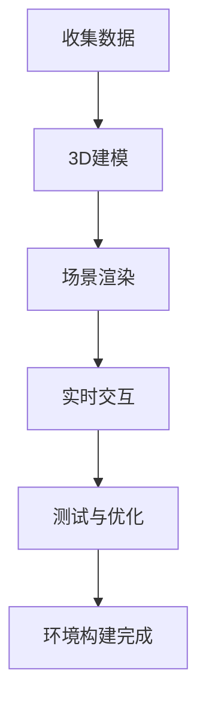

                 

## 1. 背景介绍

在信息科技飞速发展的今天，虚拟现实（Virtual Reality，VR）技术已经成为改变多个行业的重要力量。尤其是旅游行业，VR技术的引入使得游客能够在家中通过虚拟现实体验各种旅游目的地，实现“足不出户，游遍天下”的梦想。这不仅为旅游业带来了全新的发展契机，也为创业者提供了一个极具潜力的市场。

### VR技术的崛起

虚拟现实技术的起源可以追溯到20世纪60年代。然而，直到21世纪初，随着计算能力的提升和传感技术的进步，VR技术才逐渐成熟，开始走入公众视野。VR设备如头戴式显示器（HMD）和手柄控制器的出现，使得用户能够更真实地体验虚拟环境。此外，高清图像处理技术和360度全景摄像技术的应用，使得VR内容的呈现更加逼真。

### 旅游行业的变革

传统旅游行业面临着游客需求多样化、旅游体验个性化等挑战。VR技术的引入，正好为这些问题提供了新的解决方案。首先，通过VR技术，旅游企业可以提供更加丰富和真实的旅游预览，吸引更多潜在客户。其次，游客可以通过VR体验提前了解旅游目的地的特色和景点，从而做出更明智的旅行决策。

### 创业机遇

在VR旅游规划领域，创业者可以从多个角度入手。例如，可以开发VR旅游体验平台，为游客提供全方位的虚拟旅游服务；可以打造VR旅游攻略APP，帮助游客规划个性化旅行路线；还可以推出VR旅游教育产品，为学校和家庭提供沉浸式的地理和环境教育。

## 2. 核心概念与联系

### VR旅游规划的核心概念

在VR旅游规划中，核心概念主要包括虚拟现实环境构建、交互体验设计、旅游内容创建和用户体验优化。

- **虚拟现实环境构建**：这是VR旅游规划的基础，涉及到3D建模、场景渲染和实时交互等技术。
- **交互体验设计**：旨在提升用户在虚拟环境中的沉浸感和互动性，通常包括手柄控制、语音交互和体感控制等。
- **旅游内容创建**：需要收集和整理旅游目的地的相关信息，如风景、文化、历史等，并将这些内容转化为虚拟体验。
- **用户体验优化**：通过用户反馈和行为分析，不断改进和优化虚拟旅游体验。

### 虚拟现实环境构建的流程图

下面是一个简单的Mermaid流程图，展示虚拟现实环境构建的基本流程：



### 交互体验设计的关键点

- **控制方式**：选择适合用户使用的控制方式，如手柄、手势或语音控制。
- **反馈机制**：通过视觉、听觉和触觉等多感官反馈，提升用户的沉浸感。
- **实时响应**：确保系统对用户的操作能快速响应，减少延迟。

### 旅游内容创建的要素

- **景观数据**：包括风景照片、视频和360度全景图等。
- **文化信息**：涉及当地的历史、风俗和美食等。
- **互动元素**：如虚拟导游、互动游戏和问答环节等。

### 用户体验优化的方法

- **用户反馈**：定期收集用户反馈，了解用户的使用习惯和需求。
- **数据分析**：通过数据分析，找出用户使用中的问题和瓶颈。
- **迭代改进**：根据用户反馈和数据分析结果，不断优化虚拟旅游体验。

## 3. 核心算法原理 & 具体操作步骤

### 3.1 算法原理概述

在VR旅游规划中，核心算法主要涉及以下几个方面：

- **3D建模算法**：用于创建虚拟环境的3D模型。
- **图像处理算法**：用于处理和优化虚拟环境中的图像。
- **交互算法**：用于处理用户在虚拟环境中的交互操作。
- **用户行为分析算法**：用于分析用户在虚拟旅游中的行为，以优化用户体验。

### 3.2 算法步骤详解

#### 3D建模算法

1. **数据收集**：通过卫星图像、全景照片和无人机拍摄等方式，收集旅游目的地的景观数据。
2. **数据处理**：对收集到的数据进行分析和处理，提取有用信息。
3. **模型构建**：利用三维建模软件，根据处理后的数据构建虚拟环境的3D模型。
4. **模型优化**：对模型进行优化，包括降低面数、提高渲染效率等。

#### 图像处理算法

1. **图像增强**：通过图像增强技术，提高虚拟环境中的图像质量。
2. **去噪**：去除图像中的噪声，提高图像的清晰度。
3. **色彩校正**：调整图像的色彩，使其更符合真实环境。

#### 交互算法

1. **控制方式识别**：识别用户使用的控制方式，如手柄、手势或语音控制。
2. **操作响应**：根据用户的操作，实时响应该操作，如移动、旋转或缩放。
3. **反馈机制**：通过视觉、听觉和触觉等多感官反馈，提升用户的沉浸感。

#### 用户行为分析算法

1. **行为数据收集**：收集用户在虚拟旅游中的行为数据，如移动轨迹、停留时间和互动行为等。
2. **行为分析**：对收集到的行为数据进行分析，找出用户使用中的问题和瓶颈。
3. **行为预测**：基于用户行为数据，预测用户未来的行为，以优化虚拟旅游体验。

### 3.3 算法优缺点

#### 3D建模算法

- **优点**：能够快速构建高质量的虚拟环境，提供丰富的视觉体验。
- **缺点**：对计算资源要求较高，数据处理过程复杂。

#### 图像处理算法

- **优点**：能够显著提高虚拟环境的图像质量，提升用户体验。
- **缺点**：处理过程可能引入一定的延迟，影响交互体验。

#### 交互算法

- **优点**：能够提供直观、自然的交互方式，增强用户的沉浸感。
- **缺点**：实现复杂，需要充分考虑用户交互习惯和设备性能。

#### 用户行为分析算法

- **优点**：能够根据用户行为数据优化虚拟旅游体验，提高用户满意度。
- **缺点**：对用户隐私保护要求较高，数据收集和使用需遵循相关法律法规。

### 3.4 算法应用领域

- **旅游行业**：用于虚拟旅游规划和推广，提高旅游目的地的知名度和吸引力。
- **教育领域**：用于虚拟实验教学，提供沉浸式的学习体验。
- **游戏行业**：用于游戏场景设计和交互，提升游戏体验。
- **医疗领域**：用于虚拟手术演练和心理健康治疗，提高治疗效果。

## 4. 数学模型和公式 & 详细讲解 & 举例说明

### 4.1 数学模型构建

在VR旅游规划中，数学模型主要用于优化虚拟环境的渲染和交互体验。以下是一个简单的数学模型，用于计算用户在虚拟环境中的移动速度和方向。

#### 模型公式：

$$
v = k \times \sqrt{d}
$$

其中，$v$表示移动速度，$k$为常数，$d$为用户与虚拟环境的距离。

#### 参数解释：

- **$v$**：移动速度，单位为米/秒。
- **$k$**：常数，用于调节移动速度与距离的关系。
- **$d$**：用户与虚拟环境的距离，单位为米。

### 4.2 公式推导过程

该公式基于物理学中的运动学原理，推导过程如下：

1. **设定初始条件**：假设用户从虚拟环境中的原点出发，移动到距离原点$d$米的位置。
2. **计算移动时间**：根据运动学公式，用户从原点移动到$d$米位置所需的时间为$t$，即$t = \frac{d}{v}$。
3. **推导移动速度**：将时间$t$代入速度公式，得到$v = \frac{d}{t}$。
4. **引入常数$k$**：为了使速度公式更具有普遍性，引入常数$k$，得到$v = k \times \sqrt{d}$。

### 4.3 案例分析与讲解

假设用户在虚拟环境中的移动速度$k=0.1$米/秒平方，计算用户从距离原点$10$米的位置移动到距离原点$20$米的位置所需的时间和移动速度。

#### 步骤：

1. **计算移动时间**：根据公式$t = \frac{d}{v}$，代入$d=20$米和$k=0.1$米/秒平方，得到$t = \frac{20}{0.1 \times \sqrt{20}} = 6.67$秒。
2. **计算移动速度**：根据公式$v = k \times \sqrt{d}$，代入$k=0.1$米/秒平方和$d=20$米，得到$v = 0.1 \times \sqrt{20} = 1.414$米/秒。

#### 结果：

用户从距离原点$10$米的位置移动到距离原点$20$米的位置，需要$6.67$秒，移动速度为$1.414$米/秒。

### 4.4 优点与应用

该数学模型具有以下优点：

- **直观性**：通过简单的公式，直观地表达了用户移动速度与距离的关系。
- **可调性**：通过调整常数$k$，可以灵活地控制用户移动速度，适应不同场景的需求。

在实际应用中，该模型可以用于虚拟环境的交互设计，帮助用户更自然地探索虚拟世界。

## 5. 项目实践：代码实例和详细解释说明

### 5.1 开发环境搭建

在进行VR旅游规划项目开发之前，我们需要搭建一个合适的开发环境。以下是一个基本的开发环境搭建步骤：

1. **安装操作系统**：推荐使用Linux系统，如Ubuntu 20.04。
2. **安装开发工具**：安装Python 3、Visual Studio Code、PyCharm等开发工具。
3. **安装依赖库**：安装必要的依赖库，如PyQt5、OpenGL、numpy等。
4. **配置虚拟环境**：创建一个虚拟环境，以便管理和隔离项目依赖。

### 5.2 源代码详细实现

以下是VR旅游规划项目的一个简单示例代码，展示了如何使用Python和PyQt5创建一个基本的虚拟旅游界面。

```python
import sys
from PyQt5.QtWidgets import QApplication, QMainWindow, QWidget, QVBoxLayout, QPushButton, QLabel
from PyQt5.QtGui import QIcon
from PyQt5.QtCore import QSize

class VirtualTourWindow(QMainWindow):
    def __init__(self):
        super().__init__()
        self.setWindowTitle("虚拟旅游规划")
        self.setGeometry(100, 100, 800, 600)
        
        self.central_widget = QWidget()
        self.setCentralWidget(self.central_widget)
        
        layout = QVBoxLayout()
        self.central_widget.setLayout(layout)
        
        self.tour_button = QPushButton("开始虚拟旅游")
        layout.addWidget(self.tour_button)
        
        self.label = QLabel("请选择旅游目的地：")
        layout.addWidget(self.label)
        
        self.tour_label = QLabel()
        layout.addWidget(self.tour_label)
        
        self.tour_button.clicked.connect(self.start_tour)
        
    def start_tour(self):
        destination = "巴黎"
        tour_image = "paris_tour.jpg"
        self.tour_label.setText(f"您正在游览：{destination}")
        self.tour_label.setPixmap(QIcon(tour_image).pixmap(QSize(600, 400)))
        
if __name__ == "__main__":
    app = QApplication(sys.argv)
    window = VirtualTourWindow()
    window.show()
    sys.exit(app.exec_())
```

### 5.3 代码解读与分析

#### 主窗口类定义

```python
class VirtualTourWindow(QMainWindow):
```

这里定义了一个继承自`QMainWindow`的类`VirtualTourWindow`，用于创建虚拟旅游的主窗口。

#### 初始化函数

```python
    def __init__(self):
        super().__init__()
        self.setWindowTitle("虚拟旅游规划")
        self.setGeometry(100, 100, 800, 600)
        
        self.central_widget = QWidget()
        self.setCentralWidget(self.central_widget)
        
        layout = QVBoxLayout()
        self.central_widget.setLayout(layout)
```

在初始化函数中，首先设置了窗口的基本属性，如窗口标题、位置和大小。然后创建一个`QWidget`作为中央窗口部件，并设置其布局为`QVBoxLayout`。

#### 添加界面元素

```python
        self.tour_button = QPushButton("开始虚拟旅游")
        layout.addWidget(self.tour_button)
        
        self.label = QLabel("请选择旅游目的地：")
        layout.addWidget(self.label)
        
        self.tour_label = QLabel()
        layout.addWidget(self.tour_label)
```

这里添加了三个界面元素：一个按钮、一个标签和一个标签。按钮用于启动虚拟旅游，标签用于显示旅游目的地信息。

#### 按钮点击事件处理

```python
        self.tour_button.clicked.connect(self.start_tour)
```

按钮点击事件连接到`start_tour`函数，当按钮被点击时，将触发该函数。

#### 开始虚拟旅游函数

```python
    def start_tour(self):
        destination = "巴黎"
        tour_image = "paris_tour.jpg"
        self.tour_label.setText(f"您正在游览：{destination}")
        self.tour_label.setPixmap(QIcon(tour_image).pixmap(QSize(600, 400)))
```

`start_tour`函数用于处理按钮点击事件。首先设置旅游目的地和旅游图片，然后更新标签的文本和图片，以显示虚拟旅游信息。

### 5.4 运行结果展示

当运行上述代码时，将弹出一个虚拟旅游窗口，包含一个按钮和一个标签。点击按钮后，标签将显示当前旅游目的地和相应的旅游图片。


## 6. 实际应用场景

### 6.1 旅游预订平台

虚拟现实技术可以集成到在线旅游预订平台中，提供虚拟旅游体验功能。用户在预订旅游之前，可以先行体验旅游目的地，从而做出更加明智的决策。

### 6.2 旅游教育产品

虚拟现实技术可以为教育领域提供丰富的旅游资源，如历史遗迹、自然景观等。学生可以通过虚拟现实设备，沉浸式地学习地理和环境知识。

### 6.3 旅游推广活动

旅游企业可以利用虚拟现实技术举办线上旅游推广活动，如虚拟旅游展览、虚拟旅游直播等，吸引更多游客。

### 6.4 虚拟旅游体验中心

在商业区或购物中心，可以设置虚拟旅游体验中心，让游客亲身体验虚拟旅游。通过提供多种虚拟旅游体验，提升游客的旅游兴趣。

## 7. 工具和资源推荐

### 7.1 学习资源推荐

- **《虚拟现实技术基础》**：一本全面介绍虚拟现实技术的基础知识的教材。
- **《虚拟现实开发实践》**：涵盖虚拟现实开发工具和技术的实践指南。

### 7.2 开发工具推荐

- **Unity**：一款流行的虚拟现实游戏引擎，支持多种平台开发。
- **Unreal Engine**：一款功能强大的虚拟现实游戏引擎，适用于高级虚拟现实开发。

### 7.3 相关论文推荐

- **"Virtual Reality in Tourism: A Review"**：一篇关于虚拟现实在旅游行业应用的综述性论文。
- **"An Overview of Virtual Reality Technologies for Tourism"**：一篇关于虚拟现实技术在旅游行业应用的详细介绍论文。

## 8. 总结：未来发展趋势与挑战

### 8.1 研究成果总结

虚拟现实技术在旅游行业的应用已经取得了一系列重要成果，包括虚拟旅游环境的构建、交互体验的设计、旅游内容的创建和用户体验的优化等。这些成果为旅游行业带来了全新的发展机遇，也为创业者提供了广阔的市场空间。

### 8.2 未来发展趋势

- **技术进步**：随着计算能力和传感技术的不断提升，虚拟现实体验将更加逼真和流畅。
- **应用场景扩展**：虚拟现实技术将不仅限于旅游行业，还将广泛应用于教育、医疗、游戏等领域。
- **产业链完善**：虚拟现实产业链将逐渐完善，从硬件设备到软件平台，再到内容创作和运营，形成完整的产业生态。

### 8.3 面临的挑战

- **技术瓶颈**：虚拟现实技术的性能和稳定性仍有待提高，尤其是在复杂场景和高分辨率图像处理方面。
- **内容质量**：高质量的虚拟旅游内容创作需要大量的人力和物力投入，成本较高。
- **用户接受度**：虚拟现实技术的普及和用户接受度仍需提高，尤其是在偏远地区和老年人群体中。

### 8.4 研究展望

未来，虚拟现实技术在旅游行业的发展将重点围绕以下几个方面：

- **智能化**：通过人工智能技术，实现虚拟旅游体验的个性化推荐和智能化互动。
- **高效率**：通过优化算法和开发工具，提高虚拟旅游内容的创建和渲染效率。
- **高质量**：通过引入高分辨率图像和实时交互技术，提升虚拟旅游体验的质量。

## 9. 附录：常见问题与解答

### Q：虚拟现实旅游规划项目的开发难度如何？

A：虚拟现实旅游规划项目的开发难度较高，需要具备一定的编程能力、3D建模和图像处理知识。此外，还需要熟练掌握虚拟现实开发工具和平台，如Unity和Unreal Engine。

### Q：虚拟现实旅游规划项目的成本如何？

A：虚拟现实旅游规划项目的成本取决于项目的规模和复杂度。一般来说，初期投入包括开发工具、硬件设备和人力资源等。随着项目的推进，内容创作和推广成本可能会逐渐增加。

### Q：虚拟现实旅游规划项目的市场前景如何？

A：虚拟现实旅游规划项目的市场前景非常广阔。随着旅游需求的多样化和个性化，虚拟现实技术将为旅游业带来全新的发展机遇。此外，随着5G和人工智能等技术的发展，虚拟现实旅游体验将更加逼真和流畅，市场前景可期。

### Q：如何保证虚拟现实旅游规划项目的用户体验？

A：保证虚拟现实旅游规划项目的用户体验需要从多个方面入手，包括：

- **交互设计**：设计直观、自然的交互方式，提高用户操作的便捷性。
- **内容质量**：提供高质量、丰富的虚拟旅游内容，满足用户的需求。
- **性能优化**：优化虚拟环境的渲染和交互性能，减少延迟和卡顿。
- **用户反馈**：定期收集用户反馈，了解用户的需求和意见，不断优化和改进虚拟旅游体验。

---

作者：禅与计算机程序设计艺术 / Zen and the Art of Computer Programming

