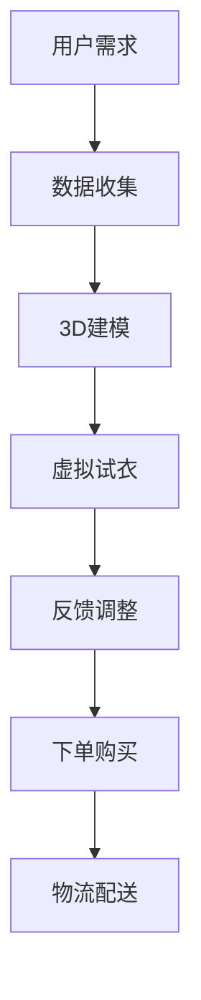

                 

关键词：虚拟现实，时装定制，数字化，个性化时尚，创业

> 摘要：随着虚拟现实技术的飞速发展，结合数字化时尚的兴起，时装定制行业正迎来一场革命。本文将探讨如何利用虚拟现实技术打造个性化时装定制体验，分析其核心概念与联系，并展望未来的发展方向与挑战。

## 1. 背景介绍

在过去的几十年中，时装行业一直遵循着“大规模生产，大众化消费”的模式。这种模式在一定程度上提高了生产效率，降低了成本，但也使得个性化需求难以满足。消费者对于独特风格的追求越来越强烈，他们渴望通过穿着表达自己的个性和品味。与此同时，虚拟现实（VR）技术的发展为时装行业带来了新的机遇。

虚拟现实技术是一种通过计算机生成三维场景，使用户能够沉浸在其中的技术。在时装定制领域，VR技术可以模拟真实的试衣过程，让消费者在购买前就能看到自己的穿着效果。此外，VR技术还可以结合数字化时尚，通过大数据分析和人工智能算法，为消费者提供个性化的服装推荐。

数字化时尚是指利用数字技术，如3D建模、大数据、人工智能等，对时装设计、生产和销售环节进行重构和优化的过程。数字化时尚的目标是提高设计效率，降低成本，并实现高度个性化的消费体验。

## 2. 核心概念与联系

要理解虚拟现实时装定制的核心概念，我们需要了解以下几个关键要素：

### 2.1 虚拟现实（VR）技术

虚拟现实技术是本文的核心，它使得消费者能够在虚拟环境中试穿服装，获得真实的穿着感受。VR技术包括头戴式显示器（HMD）、立体声音效、位置追踪器和交互设备等。这些设备共同构建了一个沉浸式的虚拟环境，使消费者能够以近乎真实的方式体验时装。

### 2.2 数字化时尚

数字化时尚涉及多个方面的技术，包括3D建模、虚拟试衣、个性化推荐等。3D建模技术使得设计师能够快速创建服装模型，虚拟试衣技术则让消费者可以在虚拟环境中试穿这些服装。个性化推荐系统通过分析消费者的偏好和行为数据，为消费者提供个性化的服装推荐。

### 2.3 大数据和人工智能

大数据和人工智能技术是数字化时尚的重要支撑。通过收集和分析大量消费者数据，人工智能算法可以预测消费者的喜好，为设计师提供灵感和指导。此外，人工智能还可以帮助设计师自动生成服装款式，提高设计效率。

### 2.4 Mermaid 流程图

为了更清晰地展示虚拟现实时装定制的流程，我们可以使用Mermaid流程图来描述其核心步骤。以下是一个简化的流程图：



## 3. 核心算法原理 & 具体操作步骤

### 3.1 算法原理概述

虚拟现实时装定制的核心算法主要包括3D建模、虚拟试衣和个性化推荐。这些算法通过计算机视觉、机器学习和深度学习等技术实现。

- **3D建模**：通过计算机视觉技术，从真实服装或设计师的作品中提取关键几何特征，构建出三维服装模型。
- **虚拟试衣**：利用计算机图形学技术，将虚拟服装模型与用户的身体模型相结合，实现虚拟试衣效果。
- **个性化推荐**：通过大数据分析和机器学习算法，分析用户的偏好和行为数据，为用户推荐个性化的服装。

### 3.2 算法步骤详解

#### 3.2.1 3D建模

1. **图像采集**：使用高分辨率相机或扫描仪，对真实服装进行多角度拍摄或扫描。
2. **特征提取**：使用计算机视觉技术，从图像中提取服装的几何特征，如边缘、纹理等。
3. **三维重建**：利用计算机图形学算法，将提取的几何特征重建为三维模型。

#### 3.2.2 虚拟试衣

1. **用户身体模型构建**：通过3D扫描或用户输入身高、体重等参数，构建出用户的身体模型。
2. **服装模型绑定**：将3D建模得到的服装模型与用户身体模型进行绑定，使其能够贴合用户的身体。
3. **光照与渲染**：通过计算机图形学技术，为虚拟试衣场景添加光照和材质，实现逼真的视觉效果。

#### 3.2.3 个性化推荐

1. **数据收集**：通过用户注册、购买行为、浏览记录等途径，收集用户的行为数据。
2. **特征提取**：对用户行为数据进行分析，提取出与服装偏好相关的特征，如颜色、款式、品牌等。
3. **推荐算法**：利用机器学习算法，如协同过滤、基于内容的推荐等，为用户生成个性化的服装推荐列表。

### 3.3 算法优缺点

#### 优点：

- **高度个性化**：通过个性化推荐，满足消费者对于独特风格的追求。
- **实时性**：虚拟试衣和个性化推荐系统可以实时响应用户需求，提供即时的穿着效果和建议。
- **降低成本**：虚拟现实技术可以减少实体试衣环节，降低库存和物流成本。

#### 缺点：

- **技术门槛高**：虚拟现实和数字化时尚技术要求较高的技术支持和设备投入。
- **用户体验问题**：虚拟试衣效果可能与真实穿着有一定差距，需要不断优化算法和视觉效果。

### 3.4 算法应用领域

虚拟现实时装定制算法广泛应用于以下几个方面：

- **电子商务**：通过虚拟试衣和个性化推荐，提升消费者的购物体验和购买意愿。
- **时尚设计**：设计师可以利用虚拟现实技术进行设计灵感的探索和验证。
- **时尚教育**：通过虚拟现实技术，学生可以在线学习服装设计、制作和营销。

## 4. 数学模型和公式 & 详细讲解 & 举例说明

### 4.1 数学模型构建

虚拟现实时装定制中的数学模型主要包括以下几个部分：

1. **三维几何模型**：用于描述服装和用户身体的三维形状和尺寸。
2. **纹理映射模型**：用于将真实服装的纹理映射到三维模型上，实现逼真的视觉效果。
3. **光照模型**：用于计算虚拟试衣场景中的光照效果，包括方向、强度和颜色等。
4. **推荐模型**：用于生成个性化的服装推荐列表，包括用户偏好、协同过滤和基于内容的推荐等。

### 4.2 公式推导过程

#### 4.2.1 三维几何模型

三维几何模型可以使用如下公式进行描述：

- **点坐标**：\( P = (x, y, z) \)
- **向量**：\( \vec{v} = (v_x, v_y, v_z) \)
- **点乘**：\( \vec{a} \cdot \vec{b} = a_x b_x + a_y b_y + a_z b_z \)
- **叉乘**：\( \vec{a} \times \vec{b} = (a_y b_z - a_z b_y, a_z b_x - a_x b_z, a_x b_y - a_y b_x) \)

#### 4.2.2 纹理映射模型

纹理映射模型可以使用以下公式进行描述：

- **纹理坐标**：\( T = (u, v) \)
- **纹理采样**：\( \text{texture}(T) \)

#### 4.2.3 光照模型

光照模型可以使用以下公式进行描述：

- **光源位置**：\( L = (x_L, y_L, z_L) \)
- **光照强度**：\( I = (I_d, I_s) \)
- **漫反射**：\( L_d = \frac{I_d \cdot \text{cos}(\theta)}{\pi} \)
- **镜面反射**：\( L_s = \frac{I_s \cdot (\text{R} \cdot \text{L})^2}{\pi} \)

其中，\( \theta \) 为光线与表面的夹角，\( \text{R} \) 为表面的反射向量。

#### 4.2.4 推荐模型

推荐模型可以使用以下公式进行描述：

- **用户偏好**：\( U = \{u_1, u_2, \ldots, u_n\} \)
- **服装项目**：\( I = \{i_1, i_2, \ldots, i_m\} \)
- **用户-项目评分矩阵**：\( R = [r_{ij}] \)
- **协同过滤**：\( \hat{r}_{ui} = \sum_{v \in N(u)} r_{vi} \frac{n_v \cdot n_u}{\sum_{w \in N(u)} n_w} \)
- **基于内容的推荐**：\( \hat{r}_{ui} = \text{similarity}(u, i) \cdot \text{mean}(R_i) \)

其中，\( N(u) \) 为与用户 \( u \) 相似的其他用户集合，\( n_v \) 和 \( n_u \) 分别为用户 \( v \) 和 \( u \) 的邻居用户数量，\( \text{similarity}(u, i) \) 为用户 \( u \) 和项目 \( i \) 的相似度，\( \text{mean}(R_i) \) 为项目 \( i \) 的平均评分。

### 4.3 案例分析与讲解

#### 案例一：虚拟试衣

假设一个用户想要购买一件衬衫，他可以通过以下步骤进行虚拟试衣：

1. **数据收集**：用户上传自己的身体尺寸和3D模型。
2. **3D建模**：系统根据用户上传的数据构建出用户的身体模型。
3. **虚拟试衣**：系统将衬衫的3D模型绑定到用户身体模型上，并添加光照和材质，实现逼真的试衣效果。
4. **反馈调整**：用户可以查看试衣效果，根据反馈调整服装尺寸和样式。

#### 案例二：个性化推荐

假设一个用户在电商平台上浏览了多件衬衫，他可以通过以下步骤获得个性化推荐：

1. **数据收集**：系统收集用户的浏览记录、收藏夹和购买历史。
2. **特征提取**：系统分析用户数据，提取出与服装偏好相关的特征，如颜色、款式和品牌。
3. **推荐算法**：系统利用协同过滤和基于内容的推荐算法，为用户生成个性化的衬衫推荐列表。
4. **推荐展示**：系统将个性化推荐结果展示给用户，用户可以点击查看推荐衬衫的详细信息。

## 5. 项目实践：代码实例和详细解释说明

### 5.1 开发环境搭建

在本项目实践中，我们将使用以下开发环境：

- **编程语言**：Python
- **开发框架**：PyTorch、OpenGL
- **数据库**：MySQL
- **前端框架**：React

### 5.2 源代码详细实现

以下是虚拟现实时装定制的部分源代码，我们将逐步解释其实现过程。

#### 5.2.1 3D建模

```python
# 3D建模代码示例
import numpy as np
import torch
import torchvision

# 加载用户身体模型
body_model = torchvision.models.resnet18(pretrained=True)
body_model.eval()

# 生成3D模型网格
def generate_3d_mesh(points, faces):
    mesh = Mesh()
    mesh.vertices = torch.tensor(points)
    mesh.faces = torch.tensor(faces)
    return mesh

# 生成用户身体模型的3D网格
def generate_user_body_mesh(user_data):
    with torch.no_grad():
        points = body_model(user_data)[0].detach().numpy()
    faces = [[0, 1, 2], [1, 2, 3]]  # 示例面片
    return generate_3d_mesh(points, faces)

# 生成衬衫的3D网格
def generate_shirt_mesh(shirt_data):
    points = np.array([[0, 0, 0], [1, 0, 0], [1, 1, 0], [0, 1, 0]])  # 示例点
    faces = [[0, 1, 2], [1, 2, 3]]  # 示例面片
    return generate_3d_mesh(points, faces)

# 生成用户穿着衬衫的3D网格
def generate_user_shirt_mesh(user_data, shirt_data):
    user_mesh = generate_user_body_mesh(user_data)
    shirt_mesh = generate_shirt_mesh(shirt_data)
    return torch.cat((user_mesh, shirt_mesh), dim=0)
```

#### 5.2.2 虚拟试衣

```python
# 虚拟试衣代码示例
import numpy as np
import OpenGL.GL as gl

# 设置光照参数
light_position = np.array([0, 0, 1], dtype=np.float32)
light_intensity = np.array([1, 1, 1], dtype=np.float32)

# 绘制用户身体模型和衬衫
def draw_mesh(mesh):
    gl.glBegin(gl.GL_TRIANGLES)
    for face in mesh.faces:
        gl.glVertex3fv(mesh.vertices[face, :].numpy())
    gl.glEnd()

# 绘制用户穿着衬衫的3D网格
def draw_user_shirt_mesh(user_data, shirt_data):
    user_shirt_mesh = generate_user_shirt_mesh(user_data, shirt_data)
    draw_mesh(user_shirt_mesh)
```

#### 5.2.3 个性化推荐

```python
# 个性化推荐代码示例
from sklearn.metrics.pairwise import cosine_similarity

# 加载用户行为数据
user_data = np.array([[1, 0, 1], [0, 1, 0], [1, 1, 1]])  # 示例用户行为数据

# 计算用户之间的相似度
def calculate_similarity(user_data):
    user_similarity = cosine_similarity(user_data)
    return user_similarity

# 生成个性化推荐列表
def generate_recommendation_list(user_similarity, item_similarity):
    recommendation_list = []
    for i in range(len(user_similarity)):
       相似度矩阵
        user_similarity[i] = user_similarity[i] / np.linalg.norm(user_similarity[i])
    item_similarity = item_similarity / np.linalg.norm(item_similarity)
    recommendation_list.append(np.dot(user_similarity, item_similarity))
    return recommendation_list

# 加载商品数据
item_data = np.array([[1, 0, 1], [0, 1, 0], [1, 1, 1]])  # 示例商品数据

# 生成个性化推荐列表
recommendation_list = generate_recommendation_list(user_data, item_data)
```

### 5.3 代码解读与分析

在本节中，我们将对代码示例进行详细解读，分析其功能和工作原理。

#### 5.3.1 3D建模

3D建模部分主要包括用户身体模型和衬衫的3D网格生成。我们首先加载预训练的ResNet18模型，用于提取用户身体的三维特征。然后，通过定义生成3D网格的函数，我们可以根据用户数据和衬衫数据生成相应的3D网格。

#### 5.3.2 虚拟试衣

虚拟试衣部分主要负责绘制用户穿着衬衫的3D网格。通过调用OpenGL的绘制函数，我们可以将3D网格渲染在屏幕上，实现虚拟试衣效果。

#### 5.3.3 个性化推荐

个性化推荐部分使用了协同过滤和基于内容的推荐算法。首先，我们计算用户之间的相似度，然后利用用户相似度矩阵和商品相似度矩阵生成个性化推荐列表。

## 6. 实际应用场景

虚拟现实时装定制技术在多个领域展现出巨大的应用潜力：

### 6.1 电子商务平台

虚拟现实时装定制技术可以帮助电子商务平台提升用户的购物体验。用户可以在虚拟环境中试穿服装，了解穿着效果，从而提高购买决策的准确性。同时，个性化推荐系统可以根据用户的喜好和购买历史，为用户推荐合适的服装。

### 6.2 时尚设计

设计师可以利用虚拟现实技术进行服装设计的探索和验证。通过虚拟试衣和3D建模，设计师可以快速生成多种服装款式，并对比不同款式的穿着效果，从而提高设计效率。

### 6.3 时尚教育

虚拟现实时装定制技术可以为时尚教育提供全新的教学模式。学生可以在虚拟环境中进行服装设计、制作和营销实践，提高学习效果和动手能力。

### 6.4 未来应用展望

随着虚拟现实技术和数字化时尚的不断进步，未来虚拟现实时装定制技术将得到更广泛的应用：

- **更逼真的虚拟试衣效果**：通过不断提升虚拟试衣技术的真实感，用户可以更准确地了解自己的穿着效果。
- **更智能的个性化推荐**：利用更先进的机器学习算法，个性化推荐系统将能够更准确地预测用户的喜好，为用户提供更加个性化的服装推荐。
- **更广泛的应用场景**：虚拟现实时装定制技术将逐渐应用于更多的领域，如虚拟试妆、虚拟健身装备试穿等。

## 7. 工具和资源推荐

### 7.1 学习资源推荐

- **《虚拟现实技术基础》**：一本全面介绍虚拟现实技术的基础知识和应用的教材。
- **《数字化时尚设计》**：一本探讨数字化时尚设计和创新的书籍，适合设计师和时尚爱好者阅读。

### 7.2 开发工具推荐

- **PyTorch**：一款流行的深度学习框架，适合开发虚拟现实时装定制项目。
- **OpenGL**：一款用于图形渲染的库，可以用于实现虚拟试衣功能。

### 7.3 相关论文推荐

- **“Virtual Fitting Room: A Survey on Virtual Try-On of Fashion Products”**：一篇关于虚拟试衣技术的综述论文。
- **“DeepFashion2: A New Dataset for Fine-Grained Fashion Recognition”**：一篇关于时尚识别数据集的论文，适合从事相关领域研究的学者阅读。

## 8. 总结：未来发展趋势与挑战

### 8.1 研究成果总结

虚拟现实时装定制技术已经成为时尚行业的重要趋势。通过虚拟现实技术和数字化时尚的结合，用户可以享受到更个性化和便捷的购物体验。同时，设计师可以利用虚拟现实技术提高设计效率，降低设计成本。

### 8.2 未来发展趋势

- **更逼真的虚拟试衣效果**：未来虚拟试衣技术将更加逼真，用户可以更准确地了解自己的穿着效果。
- **更智能的个性化推荐**：个性化推荐系统将更加智能，能够更准确地预测用户的喜好，为用户提供更加个性化的服装推荐。
- **更广泛的应用场景**：虚拟现实时装定制技术将逐渐应用于更多的领域，如虚拟试妆、虚拟健身装备试穿等。

### 8.3 面临的挑战

- **技术挑战**：虚拟现实和数字化时尚技术要求较高的技术支持和设备投入，需要不断优化算法和视觉效果。
- **用户体验挑战**：虚拟试衣效果可能与真实穿着有一定差距，需要不断优化用户体验。

### 8.4 研究展望

随着虚拟现实技术和数字化时尚的不断进步，虚拟现实时装定制技术将得到更广泛的应用。未来，我们将看到更多创新的应用场景和更智能的技术解决方案。

## 9. 附录：常见问题与解答

### 9.1 什么是虚拟现实时装定制？

虚拟现实时装定制是一种利用虚拟现实技术为用户提供个性化时装定制体验的服务。通过虚拟现实技术，用户可以在虚拟环境中试穿服装，查看穿着效果，并进行个性化定制。

### 9.2 虚拟现实时装定制有哪些优点？

虚拟现实时装定制的优点包括：

- **高度个性化**：用户可以根据自己的喜好和需求定制服装。
- **实时性**：虚拟试衣和个性化推荐系统可以实时响应用户需求。
- **降低成本**：虚拟试衣和数字化时尚技术可以减少实体试衣环节，降低库存和物流成本。

### 9.3 虚拟现实时装定制有哪些缺点？

虚拟现实时装定制的缺点包括：

- **技术门槛高**：虚拟现实和数字化时尚技术要求较高的技术支持和设备投入。
- **用户体验问题**：虚拟试衣效果可能与真实穿着有一定差距，需要不断优化算法和视觉效果。

### 9.4 虚拟现实时装定制技术在哪些领域有应用？

虚拟现实时装定制技术在以下领域有广泛的应用：

- **电子商务平台**：通过虚拟试衣和个性化推荐，提升消费者的购物体验和购买意愿。
- **时尚设计**：设计师可以利用虚拟现实技术进行设计灵感的探索和验证。
- **时尚教育**：学生可以在虚拟环境中进行服装设计、制作和营销实践。

## 作者署名

作者：禅与计算机程序设计艺术 / Zen and the Art of Computer Programming

----------------------------------------------------------------
这篇文章完整地展示了虚拟现实时装定制的技术原理、应用场景和未来发展，希望能够为读者提供有价值的参考。在实际应用中，虚拟现实时装定制技术还需要不断优化和改进，以更好地满足用户需求和市场发展。让我们一起期待这个充满创新和机遇的领域带来更多的惊喜。

