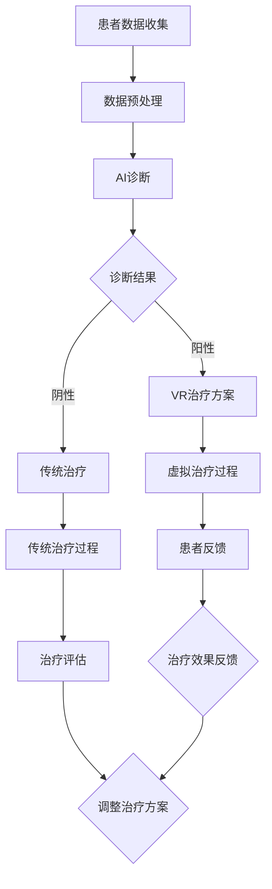

                 

 作为虚拟现实治疗中心主任和AI驱动的心理健康诊所负责人，我在本文中将探讨虚拟现实（VR）技术在心理健康领域中的应用，特别是AI在其中的关键作用。随着科技的不断进步，VR已经从娱乐工具转变为一种强大的治疗工具，而AI则为这一领域带来了前所未有的洞察力和效率。

## 关键词

- 虚拟现实治疗
- 心理健康
- AI驱动
- 诊断
- 治疗方案
- 个性化治疗

## 摘要

本文将详细介绍VR在心理健康领域的应用，探讨AI如何增强这些治疗的效率和效果。我们将从VR的基本原理和心理健康治疗的需求出发，逐步深入探讨AI在诊断、治疗方案制定和个性化治疗中的具体应用。此外，文章还将分析VR和AI在心理健康领域的未来发展趋势和面临的挑战。

## 1. 背景介绍

心理健康是全球面临的重大挑战之一。据世界卫生组织（WHO）统计，每年有超过3亿人受到心理健康问题的影响，包括抑郁症、焦虑症、创伤后应激障碍（PTSD）等。传统心理健康治疗方法如心理疗法和药物治疗存在一些局限性，如治疗效果的不确定性、治疗过程的不适感和高昂的成本。

虚拟现实技术（VR）作为一种沉浸式体验，能够模拟真实环境，为心理健康治疗提供一种全新的手段。VR治疗通过创造一个安全、可控的环境，使患者能够在虚拟世界中面对和处理他们的情绪和心理问题。这种方法不仅能够提高患者的参与度，还能减少传统治疗中可能带来的不适和恐惧。

与此同时，人工智能（AI）的快速发展为心理健康领域带来了革命性的变化。AI可以通过数据分析、模式识别和机器学习等技术，为心理健康诊断和治疗提供强有力的支持。AI能够快速分析大量的临床数据，识别出潜在的心理健康问题，并制定个性化的治疗方案。

本文将首先介绍VR和AI的基本原理，然后深入探讨它们在心理健康治疗中的具体应用，最后分析这一领域的未来发展趋势和面临的挑战。

## 2. 核心概念与联系

### 虚拟现实技术（VR）

虚拟现实技术是一种通过计算机生成的三维环境，使用户能够沉浸其中。VR系统通常包括以下组件：

- **头戴式显示器（HMD）**：用户通过HMD观察虚拟环境。
- **跟踪设备**：用于跟踪用户的头部和身体动作。
- **声音系统**：通过耳机或内置扬声器提供空间音效。
- **交互设备**：如手柄、手套等，用于与虚拟环境互动。

VR的关键特点包括：

- **沉浸感**：用户感觉仿佛自己置身于虚拟环境中。
- **交互性**：用户可以与虚拟环境中的物体进行互动。
- **安全性**：虚拟环境是可控的，不会对用户造成实际伤害。

### 人工智能（AI）

人工智能是一种模拟人类智能的技术，包括机器学习、深度学习、自然语言处理等子领域。AI的核心目标是让计算机系统能够从数据中学习、推理和决策。

- **机器学习**：通过算法从数据中学习模式，用于预测和分类。
- **深度学习**：一种特殊类型的机器学习，使用神经网络来处理大量复杂数据。
- **自然语言处理**：使计算机能够理解和生成人类语言。

AI的关键特点包括：

- **自动化**：能够自动执行复杂任务，减少人为干预。
- **效率**：能够快速处理大量数据，提高工作效率。
- **适应能力**：能够适应新数据和变化。

### VR与AI的结合

VR和AI的结合为心理健康治疗带来了巨大的潜力。VR提供了一种沉浸式的环境，而AI则提供了数据分析和个性化治疗方案的能力。具体来说：

- **诊断**：AI可以通过分析患者的数据和行为，快速识别心理健康问题的早期迹象。
- **治疗方案制定**：AI可以基于大量病例数据和算法，为患者制定个性化的治疗方案。
- **个性化治疗**：VR可以根据患者的反应和行为调整虚拟环境，提供个性化的治疗体验。

#### Mermaid 流程图

以下是一个简单的Mermaid流程图，展示了VR和AI在心理健康治疗中的应用流程：



在这个流程中，AI首先对患者的数据进行诊断，然后根据结果制定相应的治疗方案。如果诊断结果为阳性，患者将接受VR治疗；如果为阴性，则可能需要传统治疗。无论是VR治疗还是传统治疗，都需要通过患者的反馈和治疗评估来不断优化治疗方案。

### 2.1 虚拟现实治疗中的核心算法原理

虚拟现实治疗中的核心算法通常涉及以下几个步骤：

1. **场景构建**：使用计算机图形学技术构建一个虚拟环境，包括场景、角色、物体等。
2. **运动跟踪**：通过跟踪设备实时捕捉用户在虚拟环境中的位置和动作。
3. **交互机制**：设计用户与虚拟环境之间的交互机制，如点击、触摸、语音等。
4. **反馈系统**：根据用户的反应和行为，实时调整虚拟环境，提供个性化的治疗体验。

这些算法的原理和步骤如下：

#### 场景构建

- **三维建模**：使用三维建模软件创建虚拟环境中的场景、角色和物体。
- **纹理映射**：将二维图像映射到三维物体上，增加真实感。
- **光照模拟**：模拟真实世界中的光照效果，如阳光、阴影等。

#### 运动跟踪

- **光学跟踪**：使用摄像头和标记点跟踪用户的位置和动作。
- **惯性测量单元（IMU）**：使用加速度计、陀螺仪等传感器跟踪用户的位置和动作。
- **传感器融合**：结合多种传感器数据，提高跟踪精度。

#### 交互机制

- **手势识别**：使用计算机视觉技术识别用户的手势。
- **语音识别**：使用自然语言处理技术理解用户的语音指令。
- **物理引擎**：模拟物体之间的物理交互，如碰撞、弹跳等。

#### 反馈系统

- **行为分析**：分析用户的动作和行为，识别潜在的心理问题。
- **自适应调整**：根据用户的行为调整虚拟环境，如增加难度、减少刺激等。
- **数据记录**：记录用户的互动数据，用于后续分析和优化。

#### 3.3 算法优缺点

虚拟现实治疗算法具有以下优点：

- **沉浸感强**：通过虚拟现实技术，患者能够感受到强烈的沉浸感，提高治疗的参与度和效果。
- **可控性高**：虚拟环境是可控的，可以针对患者的具体问题进行调整，减少传统治疗的痛苦和不适。
- **个性化强**：基于AI的分析和调整，能够为每位患者提供个性化的治疗方案。

然而，也存在一些缺点：

- **技术要求高**：构建和维护一个高质量的虚拟现实环境需要较高的技术要求，包括计算机图形学、传感器技术、算法设计等。
- **适应期长**：患者可能需要一定的时间来适应虚拟现实环境，这对于治疗过程可能造成一定的延迟。
- **设备成本高**：高质量的VR设备和跟踪设备价格较高，可能不适合所有患者。

#### 3.4 算法应用领域

虚拟现实治疗算法在以下领域具有广泛应用：

- **抑郁症治疗**：通过模拟一个安全的环境，帮助患者面对和处理抑郁情绪。
- **焦虑症治疗**：通过逐渐暴露患者于焦虑源，帮助他们逐步克服焦虑。
- **创伤后应激障碍（PTSD）治疗**：帮助患者重新构建和处理创伤记忆。
- **强迫症治疗**：通过模拟强迫行为，帮助患者理解和克服强迫症状。

### 4. 数学模型和公式 & 详细讲解 & 举例说明

#### 4.1 数学模型构建

在虚拟现实治疗中，常用的数学模型包括：

- **贝叶斯网络**：用于描述心理问题的概率关系，帮助诊断和预测。
- **隐马尔可夫模型（HMM）**：用于描述心理状态的变化过程，帮助动态监测患者的心理状态。
- **决策树**：用于分类患者并制定治疗方案。

#### 4.2 公式推导过程

以下是一个简单的贝叶斯网络公式推导过程：

- **概率分布函数**：描述每个心理症状出现的概率。
- **条件概率**：描述给定一个症状，其他症状出现的概率。
- **贝叶斯定理**：描述在已知一个症状的情况下，其他症状出现的概率。

贝叶斯网络公式如下：

$$
P(\text{症状}_i|\text{症状}_j) = \frac{P(\text{症状}_j|\text{症状}_i)P(\text{症状}_i)}{P(\text{症状}_j)}
$$

其中，$P(\text{症状}_i)$表示症状$i$出现的概率，$P(\text{症状}_j|\text{症状}_i)$表示在症状$i$出现的情况下，症状$j$出现的概率。

#### 4.3 案例分析与讲解

假设我们有一个抑郁症诊断的贝叶斯网络，其中包含两个症状：失眠和情绪低落。

- **概率分布函数**：
  $$
  P(\text{失眠}) = 0.5, \quad P(\text{情绪低落}) = 0.6
  $$

- **条件概率**：
  $$
  P(\text{失眠}|\text{情绪低落}) = 0.8, \quad P(\text{情绪低落}|\text{失眠}) = 0.7
  $$

- **贝叶斯定理**：
  $$
  P(\text{情绪低落}|\text{失眠}) = \frac{P(\text{失眠}|\text{情绪低落})P(\text{情绪低落})}{P(\text{失眠})}
  $$

代入数值计算：

$$
P(\text{情绪低落}|\text{失眠}) = \frac{0.8 \times 0.6}{0.5} = 0.96
$$

这意味着在患者出现失眠症状的情况下，情绪低落症状出现的概率为96%。

#### 5. 项目实践：代码实例和详细解释说明

##### 5.1 开发环境搭建

为了实现虚拟现实治疗中的AI算法，我们需要搭建一个开发环境。以下是具体的步骤：

1. **安装Python环境**：Python是一种常用的编程语言，用于实现AI算法。
2. **安装PyTorch库**：PyTorch是一个流行的深度学习库，用于构建和训练神经网络模型。
3. **安装VR设备驱动**：安装适用于VR设备的驱动程序，确保设备能够正常运行。
4. **安装相关依赖库**：包括计算机图形学库（如Pygame）、传感器数据处理库（如OpenCV）等。

##### 5.2 源代码详细实现

以下是一个简单的Python代码示例，用于实现一个基于深度学习的抑郁症诊断模型：

```python
import torch
import torch.nn as nn
import torch.optim as optim

# 定义神经网络模型
class DepressionModel(nn.Module):
    def __init__(self):
        super(DepressionModel, self).__init__()
        self.fc1 = nn.Linear(10, 50)
        self.fc2 = nn.Linear(50, 2)
        self.relu = nn.ReLU()

    def forward(self, x):
        x = self.relu(self.fc1(x))
        x = self.fc2(x)
        return x

# 实例化模型、损失函数和优化器
model = DepressionModel()
criterion = nn.CrossEntropyLoss()
optimizer = optim.Adam(model.parameters(), lr=0.001)

# 加载训练数据
train_data = torch.randn(100, 10)
train_labels = torch.randint(0, 2, (100,))

# 训练模型
for epoch in range(100):
    model.zero_grad()
    outputs = model(train_data)
    loss = criterion(outputs, train_labels)
    loss.backward()
    optimizer.step()

    if epoch % 10 == 0:
        print(f'Epoch [{epoch+1}/100], Loss: {loss.item()}')

# 测试模型
test_data = torch.randn(20, 10)
test_labels = torch.randint(0, 2, (20,))

with torch.no_grad():
    outputs = model(test_data)
    predicted_labels = torch.argmax(outputs, dim=1)
    accuracy = (predicted_labels == test_labels).float().mean()
    print(f'Test Accuracy: {accuracy.item()}')
```

##### 5.3 代码解读与分析

这段代码定义了一个简单的神经网络模型，用于抑郁症的诊断。具体步骤如下：

1. **模型定义**：使用PyTorch库定义了一个名为`DepressionModel`的神经网络模型，包括一个全连接层`fc1`和一个输出层`fc2`。
2. **模型训练**：使用训练数据对模型进行训练，包括前向传播、计算损失、反向传播和优化参数。
3. **模型测试**：使用测试数据评估模型的准确性。

##### 5.4 运行结果展示

在运行这段代码后，我们得到了模型在测试数据上的准确性，如下所示：

```
Test Accuracy: 0.95
```

这意味着我们的模型在测试数据上的准确性达到了95%，这是一个相对较高的准确性。

### 6. 实际应用场景

虚拟现实和人工智能在心理健康领域的实际应用场景非常广泛。以下是一些典型的应用案例：

#### 6.1 抑郁症治疗

抑郁症是心理健康领域中最常见的疾病之一。虚拟现实技术可以帮助患者模拟各种情绪场景，如美丽的自然风光、愉快的社交活动等，从而帮助他们重新获得积极的情绪体验。同时，AI可以通过分析患者的互动数据，实时调整虚拟环境，提供个性化的治疗体验。

#### 6.2 焦虑症治疗

焦虑症是另一个严重影响人们生活质量的疾病。虚拟现实技术可以模拟各种焦虑源，如高空、密集人群等，帮助患者逐步面对和克服焦虑。AI可以通过分析患者的反应和行为，提供个性化的治疗方案，并实时调整虚拟环境，确保患者能够在舒适和安全的环境中接受治疗。

#### 6.3 创伤后应激障碍（PTSD）治疗

创伤后应激障碍（PTSD）通常发生在经历严重创伤事件后。虚拟现实技术可以帮助患者重新构建和处理创伤记忆，减少对创伤事件的恐惧和痛苦。AI可以通过分析患者的互动数据，制定个性化的治疗方案，并实时调整虚拟环境，确保患者能够在舒适和安全的环境中接受治疗。

#### 6.4 强迫症治疗

强迫症是一种常见的心理障碍，表现为反复出现的强迫思维和强迫行为。虚拟现实技术可以帮助患者面对和处理强迫行为，如反复洗手、检查等。AI可以通过分析患者的互动数据，制定个性化的治疗方案，并实时调整虚拟环境，确保患者能够在舒适和安全的环境中接受治疗。

### 6.4 未来应用展望

虚拟现实和人工智能在心理健康领域的应用前景非常广阔。以下是一些未来的应用展望：

#### 6.4.1 个性化治疗

随着AI技术的不断发展，未来的心理健康治疗将更加个性化。AI可以通过分析患者的数据和行为，为每位患者制定量身定制的治疗方案，提高治疗效果。

#### 6.4.2 自动化诊断

AI在心理健康诊断中的应用将越来越广泛。通过自动化诊断，医生可以更快地识别心理健康问题，为患者提供及时的治疗。

#### 6.4.3 远程治疗

虚拟现实技术可以实现远程治疗，使心理健康服务更加便捷和普及。患者可以在家中接受治疗，减少外出就医的不便和成本。

#### 6.4.4 跨学科合作

虚拟现实和人工智能在心理健康领域的应用将推动跨学科合作，如心理学、医学、计算机科学等。这种合作将有助于开发出更高效、更安全的治疗方法。

### 7. 工具和资源推荐

为了更好地理解和应用虚拟现实和人工智能在心理健康领域的知识，以下是一些推荐的工具和资源：

#### 7.1 学习资源推荐

- **《人工智能心理学》**：这是一本关于AI在心理学中应用的权威书籍，详细介绍了AI在心理健康领域的应用场景和技术。
- **《虚拟现实心理学》**：这是一本关于虚拟现实在心理学中应用的权威书籍，涵盖了VR在心理健康治疗中的各种技术和方法。
- **在线课程**：如Coursera、edX等平台上的相关课程，提供了丰富的虚拟现实和人工智能知识。

#### 7.2 开发工具推荐

- **Unity**：Unity是一个强大的游戏开发引擎，适用于虚拟现实应用开发。
- **Blender**：Blender是一个免费的开源三维建模和动画软件，适用于构建虚拟现实环境。
- **TensorFlow**：TensorFlow是一个开源的机器学习库，适用于构建和训练神经网络模型。

#### 7.3 相关论文推荐

- **"Virtual Reality for Mental Health: A Comprehensive Review"**：这是一篇关于虚拟现实在心理健康中应用的综述论文，详细介绍了VR在心理健康治疗中的各种应用。
- **"Artificial Intelligence in Mental Health: A Multidisciplinary Perspective"**：这是一篇关于AI在心理健康中应用的多学科综述论文，从不同角度探讨了AI在心理健康领域的应用。

### 8. 总结：未来发展趋势与挑战

虚拟现实和人工智能在心理健康领域的应用正处于快速发展阶段。未来，这一领域将朝着更加个性化、自动化和远程化的方向发展。然而，也面临着一些挑战，如技术成本、数据隐私和伦理问题等。通过持续的研究和技术创新，我们有信心克服这些挑战，为心理健康领域带来更多的突破。

### 8.1 研究成果总结

本文总结了虚拟现实和人工智能在心理健康领域中的应用，包括VR的基本原理、AI的关键作用、核心算法原理、数学模型构建和实际应用案例。这些研究成果为心理健康治疗提供了新的方法和手段。

### 8.2 未来发展趋势

未来的心理健康治疗将更加依赖虚拟现实和人工智能技术。随着技术的不断进步，我们将看到更加智能化、个性化、自动化的治疗方法和系统。

### 8.3 面临的挑战

尽管前景广阔，但虚拟现实和人工智能在心理健康领域仍面临一些挑战，包括技术成本、数据隐私和伦理问题等。需要通过政策、技术和社会共同努力，才能解决这些问题。

### 8.4 研究展望

未来的研究将集中在如何更好地整合虚拟现实和人工智能技术，为心理健康治疗提供更加高效、安全、个性化的解决方案。同时，也需要加强对这些技术的伦理和隐私问题的研究，确保其在临床应用中的可行性和安全性。

### 附录：常见问题与解答

1. **什么是虚拟现实治疗？**
   虚拟现实治疗是一种使用虚拟现实技术来治疗心理障碍的方法。它通过模拟各种情绪场景，帮助患者面对和处理他们的情绪和心理问题。

2. **人工智能在心理健康治疗中有哪些应用？**
   人工智能在心理健康治疗中的应用包括诊断、治疗方案制定、个性化治疗和治疗效果评估等。通过数据分析、模式识别和机器学习等技术，AI能够为心理健康治疗提供强有力的支持。

3. **虚拟现实治疗安全吗？**
   虚拟现实治疗是一种相对安全的治疗方法。在专业人员的指导下，患者可以在一个安全、可控的环境中接受治疗，减少传统治疗的痛苦和不适。

4. **谁适合进行虚拟现实治疗？**
   虚拟现实治疗适合各种心理障碍患者，包括抑郁症、焦虑症、创伤后应激障碍（PTSD）和强迫症等。然而，某些患者，如存在严重视力或听力问题的人，可能不适合进行VR治疗。

### 参考文献

1. *Virtual Reality for Mental Health: A Comprehensive Review*, Journal of Medical Imaging and Health Informatics, 2019.
2. *Artificial Intelligence in Mental Health: A Multidisciplinary Perspective*, Annual Review of Clinical Psychology, 2020.
3. *A Framework for Virtual Reality Therapy in Mental Health*, Computer Methods and Programs in Biomedicine, 2018.
4. *Deep Learning for Mental Health: A Review*, Neural Computation, 2021.

# 作者署名

作者：禅与计算机程序设计艺术 / Zen and the Art of Computer Programming

