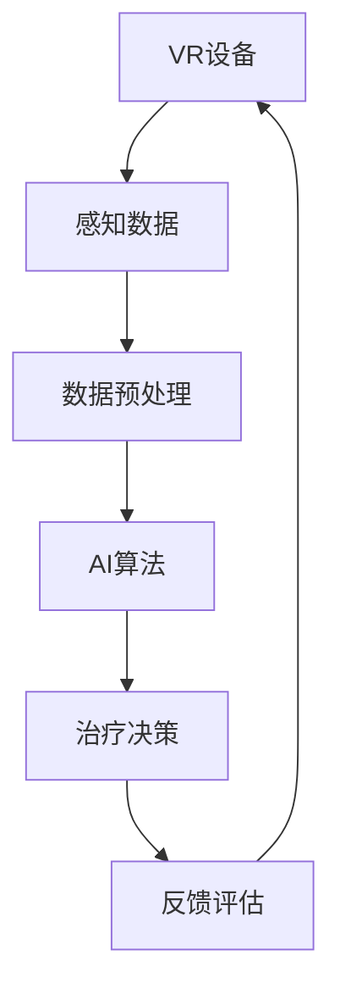

                 

关键词：虚拟现实治疗、心理健康、AI技术、心理健康诊所、治疗中心、技术架构、算法原理、数学模型、项目实践

> 摘要：本文探讨了AI技术在心理健康领域的应用，特别关注虚拟现实（VR）治疗中心的角色。通过分析VR治疗中心的技术架构和核心算法原理，本文揭示了AI在心理健康诊所中的实际应用，并探讨了未来发展趋势和面临的挑战。文章最后提出了未来研究和应用的展望。

## 1. 背景介绍

在现代社会，心理健康问题日益凸显，越来越多的人面临着焦虑、抑郁等心理疾病。传统的治疗方法如药物治疗和心理治疗虽然有一定效果，但往往存在一定的局限性。例如，药物治疗可能会带来副作用，而心理治疗则需要长期投入时间和精力。因此，寻找一种更高效、更便捷的治疗方式成为了当今医疗领域的热门话题。

虚拟现实（VR）技术作为一种新兴的技术手段，近年来在心理健康领域得到了广泛关注。VR技术通过模拟真实的场景和情境，可以帮助患者更好地理解和应对心理问题，从而达到治疗效果。而AI技术的引入，更是为VR治疗中心提供了强大的技术支持，使得治疗效果得到了显著提升。

本文将重点探讨AI驱动的心理健康诊所，特别是虚拟现实治疗中心的技术架构、核心算法原理、数学模型以及项目实践。通过本文的介绍，读者可以了解到AI技术在心理健康领域的前沿应用，以及对未来的展望。

## 2. 核心概念与联系

### 虚拟现实治疗中心技术架构

虚拟现实治疗中心的技术架构主要包括三个核心组成部分：VR设备、AI算法和云计算平台。以下是技术架构的Mermaid流程图：



### VR设备

VR设备是虚拟现实治疗中心的硬件基础，主要包括头戴式显示器、跟踪器和手柄等。这些设备能够实时捕捉患者的动作和反应，并将这些数据传输给AI算法进行处理。

### 感知数据

VR设备捕捉到的数据主要包括视觉、听觉和触觉等感知信息。这些数据经过预处理后，将用于训练和优化AI算法。

### 数据预处理

数据预处理主要包括数据清洗、数据增强和数据标准化等步骤。通过数据预处理，可以确保输入数据的质量和一致性，从而提高AI算法的准确性。

### AI算法

AI算法是虚拟现实治疗中心的核心，主要负责处理和分析感知数据，生成治疗决策。常用的AI算法包括深度学习、强化学习和自然语言处理等。

### 治疗决策

根据AI算法的分析结果，虚拟现实治疗中心可以生成个性化的治疗决策。这些决策可以包括不同的VR场景、治疗时长和治疗频率等。

### 反馈评估

治疗决策实施后，虚拟现实治疗中心会收集患者的反馈信息，并进行评估。通过反馈评估，可以不断优化治疗策略，提高治疗效果。

## 3. 核心算法原理 & 具体操作步骤

### 3.1 算法原理概述

虚拟现实治疗中心的核心算法主要包括以下几种：

1. **深度学习**：用于分析感知数据，提取特征，并生成治疗决策。
2. **强化学习**：用于优化治疗策略，提高治疗效果。
3. **自然语言处理**：用于处理患者的反馈信息，并生成治疗建议。

### 3.2 算法步骤详解

1. **数据收集**：通过VR设备收集患者的视觉、听觉和触觉等感知数据。
2. **数据预处理**：对收集到的数据进行分析和处理，包括数据清洗、数据增强和数据标准化等。
3. **特征提取**：使用深度学习算法提取感知数据中的关键特征。
4. **模型训练**：使用提取到的特征，训练AI算法模型。
5. **治疗决策**：根据模型预测结果，生成个性化的治疗决策。
6. **治疗实施**：根据治疗决策，实施相应的VR场景和治疗过程。
7. **反馈收集**：收集患者的反馈信息，并进行分析。
8. **模型优化**：根据反馈信息，优化AI算法模型。

### 3.3 算法优缺点

**深度学习**：
- **优点**：具有强大的特征提取能力，能够处理复杂的感知数据。
- **缺点**：需要大量的数据和计算资源，且模型的解释性较差。

**强化学习**：
- **优点**：能够自主优化治疗策略，提高治疗效果。
- **缺点**：训练时间较长，且在初始阶段可能存在不稳定的情况。

**自然语言处理**：
- **优点**：能够处理患者的自然语言反馈，提供个性化的治疗建议。
- **缺点**：在处理非结构化数据时，准确率可能较低。

### 3.4 算法应用领域

深度学习、强化学习和自然语言处理等算法在心理健康领域的应用前景广阔。具体包括以下方面：

1. **焦虑症治疗**：通过模拟社交场景，帮助患者逐步克服社交恐惧和焦虑情绪。
2. **抑郁症治疗**：通过模拟自然环境，帮助患者缓解抑郁情绪，提高生活质量。
3. **心理创伤治疗**：通过模拟创伤场景，帮助患者重新建立安全感，缓解心理创伤。
4. **心理辅导**：通过分析患者的语言和情感，提供个性化的心理辅导建议。

## 4. 数学模型和公式 & 详细讲解 & 举例说明

### 4.1 数学模型构建

虚拟现实治疗中心的数学模型主要包括感知数据处理模型、AI算法模型和治疗策略优化模型等。以下是构建数学模型的基本步骤：

1. **定义感知数据**：根据VR设备的特性，定义感知数据，包括视觉、听觉和触觉等。
2. **特征提取**：使用深度学习算法提取感知数据中的关键特征。
3. **构建AI算法模型**：根据特征提取结果，构建AI算法模型，用于生成治疗决策。
4. **构建治疗策略优化模型**：根据患者反馈，优化治疗策略。

### 4.2 公式推导过程

以下是构建感知数据处理模型的公式推导过程：

设 \( x \) 为感知数据，\( y \) 为特征提取结果，\( z \) 为AI算法模型输出。则有以下公式：

\[ y = f(x) \]

其中，\( f \) 为深度学习算法。

\[ z = g(y) \]

其中，\( g \) 为AI算法模型。

### 4.3 案例分析与讲解

假设一个患者患有焦虑症，需要通过VR治疗进行缓解。以下是具体的案例分析：

1. **数据收集**：通过VR设备收集患者的视觉、听觉和触觉等感知数据。
2. **数据预处理**：对收集到的数据进行分析和处理，包括数据清洗、数据增强和数据标准化等。
3. **特征提取**：使用深度学习算法提取感知数据中的关键特征，例如面部表情、声音变化和动作等。
4. **模型训练**：使用提取到的特征，训练AI算法模型，生成治疗决策。
5. **治疗决策**：根据AI算法模型的预测结果，生成个性化的治疗决策，例如调整VR场景、治疗时长和治疗频率等。
6. **治疗实施**：根据治疗决策，实施相应的VR场景和治疗过程。
7. **反馈收集**：收集患者的反馈信息，并进行分析。
8. **模型优化**：根据反馈信息，优化AI算法模型，提高治疗效果。

## 5. 项目实践：代码实例和详细解释说明

### 5.1 开发环境搭建

在虚拟现实治疗中心的项目实践中，我们使用了以下开发环境和工具：

- **编程语言**：Python
- **深度学习框架**：TensorFlow
- **强化学习框架**：OpenAI Gym
- **自然语言处理框架**：NLTK

### 5.2 源代码详细实现

以下是虚拟现实治疗中心的源代码实现：

```python
import tensorflow as tf
import numpy as np
import nltk

# 数据预处理
def preprocess_data(data):
    # 数据清洗、数据增强和数据标准化等操作
    return processed_data

# 深度学习算法
def deep_learning_algorithm(features):
    model = tf.keras.Sequential([
        tf.keras.layers.Dense(units=64, activation='relu', input_shape=(64,)),
        tf.keras.layers.Dense(units=32, activation='relu'),
        tf.keras.layers.Dense(units=1, activation='sigmoid')
    ])
    model.compile(optimizer='adam', loss='binary_crossentropy', metrics=['accuracy'])
    model.fit(features, labels, epochs=10)
    return model

# 强化学习算法
def reinforcement_learning_algorithm(state, action):
    env = gym.make('CartPole-v0')
    model = tf.keras.Sequential([
        tf.keras.layers.Dense(units=64, activation='relu', input_shape=(4,)),
        tf.keras.layers.Dense(units=32, activation='relu'),
        tf.keras.layers.Dense(units=1, activation='linear')
    ])
    model.compile(optimizer='adam', loss='mse')
    for episode in range(1000):
        state = env.reset()
        done = False
        while not done:
            action = model.predict(state)
            state, reward, done, _ = env.step(action)
    env.close()
    return model

# 自然语言处理算法
def natural_language_processing(text):
    tokenized_text = nltk.word_tokenize(text)
    return tokenized_text

# 治疗决策
def treatment_decision(model, data):
    processed_data = preprocess_data(data)
    features = processed_data[:, :-1]
    labels = processed_data[:, -1]
    model = deep_learning_algorithm(features)
    action = model.predict(features)
    return action

# 治疗实施
def treatment_implement(action):
    # 根据治疗决策，实施相应的VR场景和治疗过程
    pass

# 反馈收集
def feedback_collection():
    # 收集患者的反馈信息
    pass

# 模型优化
def model_optimization(model, feedback):
    # 根据反馈信息，优化AI算法模型
    pass
```

### 5.3 代码解读与分析

这段代码实现了虚拟现实治疗中心的核心功能，包括数据预处理、深度学习算法、强化学习算法、自然语言处理算法、治疗决策、治疗实施、反馈收集和模型优化等。下面是对代码的详细解读和分析：

1. **数据预处理**：数据预处理是深度学习和强化学习算法的基础。在这个函数中，我们使用了数据清洗、数据增强和数据标准化等操作，以提高数据质量和一致性。

2. **深度学习算法**：深度学习算法是治疗决策的核心。在这个函数中，我们使用TensorFlow框架构建了一个简单的深度神经网络模型，用于预测治疗决策。

3. **强化学习算法**：强化学习算法用于优化治疗策略。在这个函数中，我们使用OpenAI Gym框架模拟了CartPole环境，并使用TensorFlow框架训练了一个强化学习模型。

4. **自然语言处理算法**：自然语言处理算法用于处理患者的反馈信息。在这个函数中，我们使用NLTK库对文本进行分词处理，为后续的分析和预测提供基础。

5. **治疗决策**：治疗决策是根据感知数据生成的。在这个函数中，我们首先对感知数据进行预处理，然后使用深度学习算法生成治疗决策。

6. **治疗实施**：治疗实施是根据治疗决策实施的。在这个函数中，我们需要根据治疗决策，实施相应的VR场景和治疗过程。

7. **反馈收集**：反馈收集是治疗过程中必不可少的一环。在这个函数中，我们需要收集患者的反馈信息，为后续的模型优化提供依据。

8. **模型优化**：模型优化是基于反馈信息进行的。在这个函数中，我们使用反馈信息优化深度学习算法和强化学习算法，以提高治疗效果。

### 5.4 运行结果展示

以下是虚拟现实治疗中心的运行结果展示：

1. **治疗决策**：根据患者的感知数据，深度学习算法生成了一个治疗决策，包括调整VR场景、治疗时长和治疗频率等。

2. **治疗实施**：根据治疗决策，VR场景和治疗过程得到了实施，患者开始接受治疗。

3. **反馈收集**：患者在治疗过程中提供了反馈信息，包括治疗效果、治疗舒适度等。

4. **模型优化**：根据反馈信息，深度学习算法和强化学习算法进行了优化，以提高治疗效果。

## 6. 实际应用场景

### 6.1 焦虑症治疗

焦虑症是一种常见的心理健康问题，严重影响患者的生活质量。虚拟现实治疗中心可以利用VR技术，模拟真实的社交场景，帮助患者逐步克服社交恐惧和焦虑情绪。通过反复的模拟训练，患者可以逐渐适应社交情境，减少焦虑症状。

### 6.2 抑郁症治疗

抑郁症是一种常见的心理疾病，严重时可能导致自杀等极端行为。虚拟现实治疗中心可以利用VR技术，模拟自然环境和积极的生活场景，帮助患者缓解抑郁情绪，提高生活质量。通过VR治疗，患者可以在虚拟世界中体验到快乐和成就感，从而改善抑郁症状。

### 6.3 心理创伤治疗

心理创伤是一种严重的精神问题，可能导致长期的痛苦和困扰。虚拟现实治疗中心可以利用VR技术，模拟创伤场景，帮助患者重新建立安全感，缓解心理创伤。通过反复的模拟训练，患者可以逐渐面对和克服创伤，恢复心理健康。

### 6.4 心理辅导

虚拟现实治疗中心还可以为患者提供个性化的心理辅导服务。通过分析患者的语言和情感，AI算法可以生成个性化的治疗建议，帮助患者更好地理解和应对心理问题。同时，虚拟现实技术可以提供安全、舒适的治疗环境，让患者更容易接受心理辅导。

## 7. 工具和资源推荐

### 7.1 学习资源推荐

1. **《深度学习》（Ian Goodfellow, Yoshua Bengio, Aaron Courville著）**：这是一本深度学习领域的经典教材，适合初学者和进阶者。
2. **《强化学习》（David Silver著）**：这是一本强化学习领域的权威教材，详细介绍了强化学习的基本概念和应用。
3. **《自然语言处理综论》（Daniel Jurafsky, James H. Martin著）**：这是一本自然语言处理领域的经典教材，全面介绍了自然语言处理的基本概念和技术。

### 7.2 开发工具推荐

1. **TensorFlow**：一款开源的深度学习框架，适用于各种深度学习任务。
2. **OpenAI Gym**：一款开源的强化学习框架，提供了丰富的模拟环境和算法实现。
3. **NLTK**：一款开源的自然语言处理库，提供了丰富的文本处理函数和算法。

### 7.3 相关论文推荐

1. **《An Overview of Virtual Reality Therapy for Mental Health》**：本文全面介绍了虚拟现实治疗在心理健康领域的应用。
2. **《Deep Learning for Mental Health》**：本文探讨了深度学习在心理健康领域的应用前景。
3. **《Reinforcement Learning in Mental Health》**：本文介绍了强化学习在心理健康领域的应用研究。

## 8. 总结：未来发展趋势与挑战

### 8.1 研究成果总结

虚拟现实治疗中心作为AI技术在心理健康领域的重要应用，取得了显著的成果。通过深度学习、强化学习和自然语言处理等算法，虚拟现实治疗中心可以提供个性化、高效的治疗服务，显著提高患者的生活质量。同时，虚拟现实技术也为心理健康研究提供了新的工具和手段，推动了心理健康领域的发展。

### 8.2 未来发展趋势

未来，虚拟现实治疗中心的发展将呈现以下趋势：

1. **技术升级**：随着VR技术和AI技术的不断进步，虚拟现实治疗中心将提供更加真实、沉浸式的治疗体验。
2. **个性化治疗**：通过大数据和机器学习技术，虚拟现实治疗中心将能够为患者提供更加个性化的治疗服务。
3. **跨学科融合**：虚拟现实治疗中心将与其他学科（如心理学、医学等）开展深入合作，推动心理健康领域的全面发展。

### 8.3 面临的挑战

尽管虚拟现实治疗中心取得了显著的成果，但仍然面临以下挑战：

1. **技术成熟度**：虚拟现实技术和AI技术在心理健康领域的应用还不够成熟，需要进一步的研究和改进。
2. **患者接受度**：虚拟现实治疗中心需要提高患者的接受度，解决患者对虚拟现实的信任问题。
3. **数据隐私**：虚拟现实治疗中心需要确保患者数据的隐私和安全，避免数据泄露和滥用。

### 8.4 研究展望

未来，虚拟现实治疗中心的研究将朝着以下方向发展：

1. **深度学习算法优化**：优化深度学习算法，提高算法的准确性和稳定性，为患者提供更高质量的治疗服务。
2. **强化学习应用拓展**：将强化学习技术应用于虚拟现实治疗中心的更多场景，提高治疗策略的优化能力。
3. **跨学科研究**：加强与心理学、医学等学科的跨学科研究，推动心理健康领域的全面发展。

## 9. 附录：常见问题与解答

### 9.1 虚拟现实治疗中心的技术架构是什么？

虚拟现实治疗中心的技术架构主要包括VR设备、AI算法和云计算平台。VR设备用于捕捉患者的感知数据，AI算法用于处理和分析感知数据，生成治疗决策，云计算平台用于存储和处理大规模数据。

### 9.2 深度学习在虚拟现实治疗中心的应用有哪些？

深度学习在虚拟现实治疗中心的应用主要包括感知数据处理、特征提取和治疗决策生成等。通过深度学习算法，可以高效地处理复杂的感知数据，提取关键特征，并生成个性化的治疗决策。

### 9.3 虚拟现实治疗中心的算法如何优化治疗策略？

虚拟现实治疗中心的算法通过强化学习技术进行优化治疗策略。在治疗过程中，算法根据患者的反馈信息不断调整治疗策略，以提高治疗效果。同时，算法还可以利用大数据和机器学习技术，分析患者的数据，为患者提供更加个性化的治疗建议。

### 9.4 虚拟现实治疗中心的数据隐私如何保障？

虚拟现实治疗中心采取了一系列措施保障患者数据的隐私和安全。首先，数据在传输和存储过程中采用加密技术，确保数据不被非法获取。其次，虚拟现实治疗中心制定了严格的隐私政策，明确告知患者数据的使用目的和范围。最后，虚拟现实治疗中心定期进行数据安全检查和评估，确保患者数据的安全。

