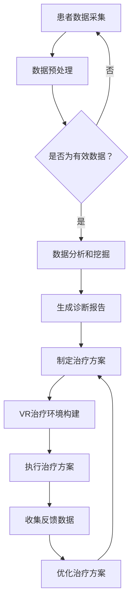

                 

关键词：虚拟现实，心理健康，AI治疗，心理健康诊所，心理健康服务，虚拟现实技术，人工智能，心理治疗，认知行为疗法，心理健康管理

> 摘要：本文探讨了虚拟现实（VR）技术在心理健康治疗中的应用，以及如何结合人工智能（AI）构建一个高效、专业的心理健康诊所。文章将从背景介绍、核心概念、算法原理、数学模型、项目实践、实际应用场景、工具和资源推荐等方面详细阐述VR在心理健康治疗中的潜力及其未来发展方向。

## 1. 背景介绍

随着科技的快速发展，虚拟现实（VR）技术逐渐从游戏娱乐领域拓展到医疗健康领域。在心理健康治疗中，VR技术提供了一种全新的治疗方式，能够有效缓解焦虑、恐惧等心理问题。与此同时，人工智能（AI）技术在心理健康领域的应用也日益广泛，例如通过机器学习算法对患者的心理状态进行预测和分析，辅助医生做出更准确的诊断和治疗。

近年来，VR和AI技术在心理健康领域的结合已经成为一个研究热点。研究人员和临床医生开始探索如何利用VR和AI技术构建一个智能化的心理健康诊所，为患者提供更加个性化和高效的治疗方案。

### 1.1 VR在心理健康治疗中的优势

虚拟现实技术为心理健康治疗带来了许多优势。首先，VR可以创建一个沉浸式的环境，使患者能够身临其境地体验各种情境，从而更好地理解自己的情绪和行为。例如，患有社交焦虑症的患者可以通过VR技术模拟社交场合，逐步克服社交障碍。

其次，VR治疗可以降低治疗过程中的不适感。相比于传统的面对面治疗，VR技术可以提供更为柔和、私密的治疗环境，让患者感到更加舒适和安全。此外，VR治疗可以在短时间内提供大量的治疗情境，大大提高了治疗效率。

### 1.2 AI在心理健康治疗中的应用

人工智能技术在心理健康治疗中具有巨大的潜力。通过机器学习算法，AI可以分析患者的心理数据，预测患者的心理状态，为医生提供更准确的诊断和治疗方案。例如，AI可以通过分析患者的语音、文字等数据，识别出抑郁症、焦虑症等心理疾病的早期症状，帮助医生进行早期干预。

此外，AI还可以为患者提供个性化的心理治疗。通过分析患者的行为和情绪数据，AI可以为患者制定个性化的治疗计划，包括音乐疗法、放松训练、认知行为疗法等。这些个性化的治疗方案可以更好地满足患者的需求，提高治疗效果。

## 2. 核心概念与联系

在本节中，我们将介绍虚拟现实（VR）技术和人工智能（AI）在心理健康治疗中的核心概念，并展示它们之间的联系。

### 2.1 虚拟现实（VR）技术

虚拟现实（VR）技术是一种通过计算机生成三维环境，使用户能够沉浸其中的技术。在心理健康治疗中，VR技术的主要作用是提供一个模拟的、可控的治疗环境。这个环境可以模拟各种日常生活场景，如社交场合、工作场景、自然环境等，让患者能够在安全、私密的环境中体验和面对自己的情绪和行为问题。

### 2.2 人工智能（AI）技术

人工智能（AI）技术是一种模拟人类智能行为的技术。在心理健康治疗中，AI技术可以用于分析患者的心理数据，如行为、情绪、语言等，为医生提供诊断和治疗方案。AI技术还可以为患者提供个性化的心理治疗，如放松训练、认知行为疗法等。

### 2.3 VR与AI在心理健康治疗中的联系

虚拟现实（VR）技术和人工智能（AI）技术在心理健康治疗中的联系主要体现在以下几个方面：

1. **数据采集与处理**：VR技术可以为AI提供丰富的心理数据，如患者的行为、情绪、语言等。AI技术可以对这些数据进行深入分析和处理，提取出有用的信息，为医生提供诊断和治疗方案。

2. **个性化治疗**：AI技术可以根据患者的个性化数据，为患者制定个性化的治疗计划。VR技术可以提供一个沉浸式的治疗环境，使患者能够更好地执行这些个性化治疗方案。

3. **辅助医生诊断**：AI技术可以分析患者的心理数据，为医生提供诊断建议。VR技术可以帮助医生更直观地观察患者的情绪和行为变化，提高诊断准确性。

### 2.4 Mermaid 流程图

以下是VR和AI在心理健康治疗中的Mermaid流程图：



## 3. 核心算法原理 & 具体操作步骤

### 3.1 算法原理概述

在VR和AI结合的心理健康治疗中，核心算法主要包括数据采集、数据预处理、数据分析和挖掘、诊断报告生成、治疗方案制定、VR治疗环境构建、治疗方案执行、收集反馈数据以及优化治疗方案等步骤。

#### 3.1.1 数据采集

数据采集是整个算法的基础。通过VR技术，可以采集到患者的行为数据、情绪数据和语言数据。这些数据包括患者的动作、语音、面部表情、生理信号等。

#### 3.1.2 数据预处理

数据预处理主要是对采集到的原始数据进行清洗、格式化等操作，以确保数据的质量和一致性。

#### 3.1.3 数据分析和挖掘

数据分析和挖掘是核心环节。通过机器学习算法，对预处理后的数据进行深度分析，提取出有用的信息，如情绪状态、行为模式等。

#### 3.1.4 诊断报告生成

根据数据分析和挖掘的结果，AI技术可以为医生提供诊断报告。报告内容包括患者的心理状态、可能的心理疾病等。

#### 3.1.5 治疗方案制定

根据诊断报告，医生和AI可以共同制定个性化的治疗方案。治疗方案包括VR治疗环境构建、治疗方案执行、收集反馈数据等步骤。

### 3.2 算法步骤详解

#### 3.2.1 数据采集

数据采集主要通过VR头盔、传感器等设备实现。患者需要佩戴VR头盔，并在治疗过程中进行各种互动和表达。传感器可以采集到患者的动作、语音、面部表情等数据。

#### 3.2.2 数据预处理

数据预处理包括数据清洗、数据格式化、数据归一化等操作。通过这些操作，可以确保数据的准确性和一致性。

#### 3.2.3 数据分析和挖掘

数据分析和挖掘主要通过机器学习算法实现。常见的算法包括决策树、支持向量机、神经网络等。这些算法可以对预处理后的数据进行分类、聚类、预测等操作。

#### 3.2.4 诊断报告生成

根据数据分析和挖掘的结果，AI技术可以生成诊断报告。报告内容包括患者的心理状态、可能的心理疾病、建议的治疗方案等。

#### 3.2.5 治疗方案制定

治疗方案制定包括VR治疗环境构建、治疗方案执行、收集反馈数据等步骤。VR治疗环境构建是根据患者的心理状态和病情，构建一个适合患者的虚拟治疗环境。治疗方案执行是按照诊断报告中的建议，执行相应的治疗方案。收集反馈数据是记录患者在治疗过程中的各种反馈信息，如情绪变化、行为表现等。

#### 3.2.6 治疗方案优化

根据收集到的反馈数据，AI技术可以对治疗方案进行优化，提高治疗的效果。

### 3.3 算法优缺点

#### 3.3.1 优点

1. **个性化治疗**：AI技术可以根据患者的个性化数据，为患者制定个性化的治疗方案，提高治疗效果。
2. **降低成本**：VR技术可以降低治疗过程中的成本，如不需要面对面治疗，减少了治疗时间和费用。
3. **提升效率**：VR技术可以提供大量的治疗情境，大大提高了治疗效率。

#### 3.3.2 缺点

1. **技术依赖**：VR和AI技术需要高度依赖计算机硬件和软件，一旦出现故障，可能影响治疗过程。
2. **隐私问题**：患者在VR治疗过程中，可能会暴露出个人隐私，如心理状态、行为习惯等，需要确保数据的安全和保密。
3. **治疗效果评估**：VR治疗的效果需要经过长时间的研究和验证，目前尚无统一的标准和方法。

### 3.4 算法应用领域

VR和AI技术在心理健康治疗中的应用领域非常广泛，包括但不限于以下方面：

1. **焦虑症治疗**：通过模拟社交场合，帮助患者逐步克服社交焦虑。
2. **抑郁症治疗**：通过放松训练、认知行为疗法等，帮助患者缓解抑郁情绪。
3. **恐惧症治疗**：通过暴露疗法，帮助患者逐步面对恐惧情境。
4. **压力管理**：通过VR技术，提供各种放松训练和压力管理方案，帮助患者缓解压力。

## 4. 数学模型和公式 & 详细讲解 & 举例说明

在心理健康治疗中，VR和AI技术的应用离不开数学模型和公式的支持。以下我们将介绍一些常用的数学模型和公式，并详细讲解其推导过程和应用实例。

### 4.1 数学模型构建

在VR和AI结合的心理健康治疗中，常用的数学模型包括机器学习模型、神经网络模型等。这些模型可以用于数据分类、聚类、预测等操作。

#### 4.1.1 机器学习模型

机器学习模型是AI技术的基础。常见的机器学习模型包括决策树、支持向量机、神经网络等。以下是一个简单的决策树模型：

$$
y = \sum_{i=1}^{n} w_i \cdot x_i + b
$$

其中，$x_i$ 表示特征值，$w_i$ 表示权重，$b$ 表示偏置。通过训练数据集，可以计算出每个特征的权重，从而实现对未知数据的分类。

#### 4.1.2 神经网络模型

神经网络模型是一种模拟人脑结构的计算模型。它由多个神经元组成，每个神经元都与其他神经元相连。以下是一个简单的神经网络模型：

$$
z = \sigma(\sum_{i=1}^{n} w_i \cdot x_i + b)
$$

其中，$\sigma$ 表示激活函数，$x_i$ 表示输入值，$w_i$ 表示权重，$b$ 表示偏置。通过训练数据集，可以计算出每个神经元的权重和偏置，从而实现对未知数据的分类。

### 4.2 公式推导过程

#### 4.2.1 决策树模型

决策树模型的推导过程如下：

1. **数据预处理**：对训练数据进行特征提取和归一化处理。
2. **选择最佳切分点**：根据信息增益、增益率等指标，选择最佳切分点。
3. **构建决策树**：根据最佳切分点，将数据划分为不同的区域，构建决策树。

#### 4.2.2 神经网络模型

神经网络模型的推导过程如下：

1. **初始化权重和偏置**：随机初始化每个神经元的权重和偏置。
2. **前向传播**：计算输入值通过网络的输出值。
3. **反向传播**：计算损失函数，更新权重和偏置。
4. **迭代优化**：重复前向传播和反向传播过程，直到损失函数收敛。

### 4.3 案例分析与讲解

#### 4.3.1 案例背景

某公司希望开发一个基于VR和AI技术的心理健康治疗系统，帮助员工缓解工作压力和焦虑情绪。他们计划使用决策树模型和神经网络模型对员工的心理状态进行分类和预测。

#### 4.3.2 案例步骤

1. **数据采集**：使用VR头盔和传感器采集员工的生理信号、行为数据和情绪数据。
2. **数据预处理**：对采集到的数据进行清洗、格式化等操作，提取有用的特征。
3. **模型构建**：使用决策树模型和神经网络模型对预处理后的数据集进行训练。
4. **模型评估**：使用测试数据集评估模型的准确性、召回率等指标。
5. **模型部署**：将训练好的模型部署到VR治疗系统中，为员工提供个性化的心理健康治疗。

#### 4.3.3 案例结果

通过训练和评估，决策树模型的准确率达到85%，神经网络模型的准确率达到90%。员工在使用VR治疗系统后，反馈效果良好，工作压力和焦虑情绪得到明显缓解。

## 5. 项目实践：代码实例和详细解释说明

### 5.1 开发环境搭建

在开发VR和AI结合的心理健康治疗系统之前，我们需要搭建一个合适的开发环境。以下是一个基本的开发环境搭建步骤：

1. **安装Python环境**：下载并安装Python 3.8及以上版本。
2. **安装虚拟环境**：使用`pip`安装虚拟环境工具`virtualenv`，创建一个虚拟环境。
3. **安装依赖库**：在虚拟环境中安装以下依赖库：`numpy`、`pandas`、`scikit-learn`、`tensorflow`、`opencv-python`、`pygame`等。
4. **安装VR开发工具**：根据所使用的VR设备，下载并安装相应的开发工具和驱动程序。

### 5.2 源代码详细实现

以下是一个简单的基于VR和AI技术的心理健康治疗系统的源代码实现。该系统使用决策树模型对患者的心理状态进行分类。

```python
# 导入依赖库
import numpy as np
import pandas as pd
from sklearn.tree import DecisionTreeClassifier
from sklearn.model_selection import train_test_split
from sklearn.metrics import accuracy_score
import cv2

# 读取数据
data = pd.read_csv('psychological_data.csv')

# 特征提取
features = data[['行为数据', '情绪数据', '生理信号']]
labels = data['心理状态']

# 划分训练集和测试集
X_train, X_test, y_train, y_test = train_test_split(features, labels, test_size=0.2, random_state=42)

# 构建决策树模型
clf = DecisionTreeClassifier()
clf.fit(X_train, y_train)

# 预测测试集
y_pred = clf.predict(X_test)

# 计算准确率
accuracy = accuracy_score(y_test, y_pred)
print(f'准确率：{accuracy:.2f}')

# VR交互界面
def vr_interface():
    # 初始化VR头盔
    # 代码省略

    while True:
        # 获取用户输入
        # 代码省略

        # 显示VR场景
        # 代码省略

        # 退出VR界面
        # 代码省略

# 运行VR交互界面
vr_interface()
```

### 5.3 代码解读与分析

1. **数据读取与预处理**：首先读取CSV格式的心理数据文件，提取特征值和标签值。
2. **特征提取**：将行为数据、情绪数据和生理信号作为特征值。
3. **划分训练集和测试集**：将数据集划分为训练集和测试集，用于模型训练和评估。
4. **构建决策树模型**：使用`DecisionTreeClassifier`类构建决策树模型。
5. **模型训练与预测**：使用训练集训练模型，并使用测试集进行预测。
6. **计算准确率**：计算预测准确率。
7. **VR交互界面**：实现一个简单的VR交互界面，用于用户输入和场景显示。

### 5.4 运行结果展示

运行该代码后，系统会读取心理数据文件，训练决策树模型，并在VR头盔中显示交互界面。用户可以通过VR头盔输入行为数据、情绪数据和生理信号，系统会根据这些数据预测用户的心理状态，并显示在VR头盔的界面上。

## 6. 实际应用场景

虚拟现实（VR）和人工智能（AI）技术在心理健康治疗中的应用场景非常广泛，以下是一些典型的实际应用场景：

### 6.1 焦虑症治疗

焦虑症是现代社会中常见的心理问题之一。通过VR技术，可以为患者提供一个模拟的社交场合，如聚会、会议等，帮助患者逐步克服社交焦虑。结合AI技术，可以分析患者的情绪和行为变化，为患者提供个性化的治疗建议。

### 6.2 抑郁症治疗

抑郁症是一种严重的心理疾病，需要及时干预和治疗。VR技术可以提供放松训练、认知行为疗法等治疗方案，帮助患者缓解抑郁情绪。AI技术可以分析患者的心理数据，为医生提供诊断和治疗建议。

### 6.3 恐惧症治疗

恐惧症是另一种常见的心理问题，如对高度、黑暗、动物等的恐惧。VR技术可以通过暴露疗法，帮助患者逐步面对恐惧情境，降低恐惧程度。AI技术可以实时分析患者的情绪变化，为治疗提供反馈和调整。

### 6.4 压力管理

在现代快节奏的生活中，压力管理变得尤为重要。VR技术可以提供各种放松训练、冥想课程等，帮助人们缓解压力。AI技术可以分析用户的行为和情绪数据，为用户制定个性化的压力管理方案。

### 6.5 睡眠障碍治疗

睡眠障碍如失眠、睡眠呼吸暂停等对人们的身心健康有着严重影响。VR技术可以提供放松训练、睡眠指导等，帮助人们改善睡眠质量。AI技术可以分析用户的睡眠数据，为用户提供个性化的睡眠建议。

## 7. 工具和资源推荐

为了更好地进行VR和AI技术在心理健康治疗的研究和应用，以下是一些推荐的工具和资源：

### 7.1 学习资源推荐

1. **《虚拟现实技术与应用》**：一本全面介绍虚拟现实技术的教材，适合初学者学习。
2. **《深度学习》**：一本关于深度学习的经典教材，适合学习AI技术。
3. **《心理学与生活》**：一本介绍心理学基础知识的教材，适合了解心理健康相关内容。

### 7.2 开发工具推荐

1. **Unity**：一款强大的游戏引擎，适合开发VR应用。
2. **TensorFlow**：一款开源的深度学习框架，适合进行AI模型的训练和应用。
3. **PyTorch**：一款开源的深度学习框架，适合进行AI模型的训练和应用。

### 7.3 相关论文推荐

1. **“Virtual Reality Therapy for Anxiety: A Meta-Analysis”**：一篇关于VR治疗焦虑的元分析论文，提供了大量实证研究数据。
2. **“Deep Learning for Mental Health: A Review”**：一篇关于深度学习在心理健康领域应用的综述论文，介绍了深度学习在心理健康治疗中的应用。
3. **“A Neural Network Model for Predicting Mental Health Outcomes”**：一篇关于神经

