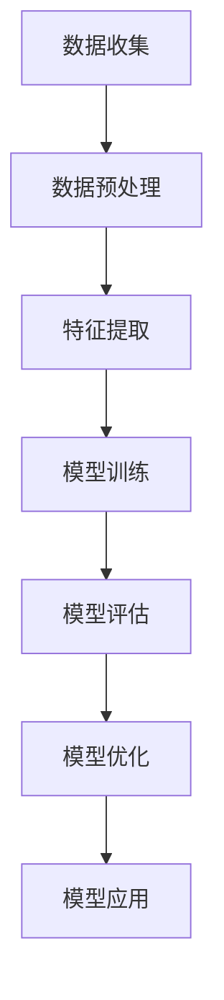
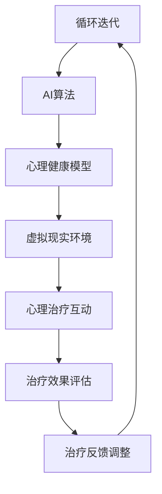
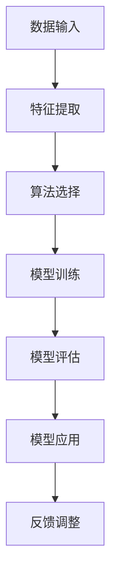
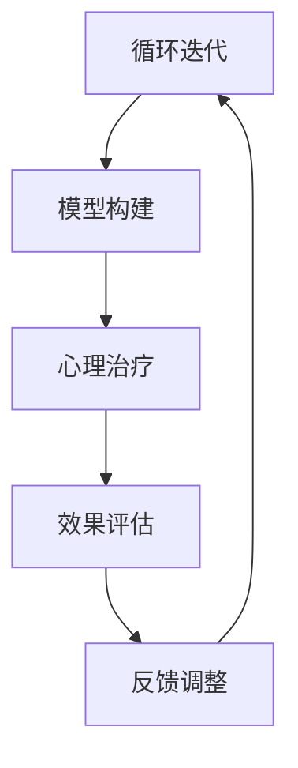

                 

关键词：虚拟现实治疗，心理健康干预，人工智能，AI算法，心理健康模型，心理治疗，心理健康诊断。

## 摘要

本文探讨了虚拟现实（VR）治疗在心理健康干预领域的应用及其与人工智能（AI）的融合。随着AI技术的不断发展，VR治疗在心理治疗中的潜力得到了显著提升。本文首先介绍了虚拟现实治疗的基本概念和传统方法，接着阐述了AI技术在心理健康干预中的应用，包括心理健康模型的构建和优化、AI算法在心理治疗过程中的实现。随后，本文通过具体案例分析了虚拟现实治疗在心理健康干预中的效果，并对未来应用和发展趋势进行了展望。文章最后提出了相关工具和资源的推荐，以期为相关领域的研究和实践提供参考。

## 1. 背景介绍

### 虚拟现实治疗的基本概念

虚拟现实治疗（Virtual Reality Therapy，VRT）是一种利用计算机技术模拟出逼真的虚拟环境，让患者在此环境中进行心理治疗的方法。与传统治疗方式相比，虚拟现实治疗具有高度的沉浸感和交互性，能够在一定程度上缓解患者的焦虑、恐惧等心理问题。

虚拟现实治疗的发展可以追溯到20世纪90年代，当时研究者开始探索VR在心理治疗中的应用。随着技术的进步，虚拟现实治疗逐渐成为心理健康干预领域的一种重要手段。目前，虚拟现实治疗已广泛应用于治疗焦虑症、恐惧症、创伤后应激障碍（PTSD）等心理疾病。

### 心理健康干预的重要性

心理健康干预是指通过各种方法和技术，帮助个体缓解心理压力、改善心理状态、提高生活质量的过程。随着社会竞争的加剧和生活节奏的加快，心理健康问题已经成为全球范围内的重要公共健康问题。据统计，全球约有三分之一的人口在不同年龄段面临心理健康问题。

心理健康干预不仅有助于个体的心理健康，还能够提高社会的整体幸福感和生产力。然而，传统心理健康干预方法往往存在一定局限性，如治疗时间长、效果不稳定、患者依从性低等。因此，探索新的心理健康干预手段具有重要意义。

### 人工智能与虚拟现实治疗的结合

人工智能（Artificial Intelligence，AI）作为一门模拟、延伸和扩展人的智能的理论、方法、技术及应用系统的综合技术科学，近年来在各个领域都取得了显著的进展。在心理健康干预领域，AI技术的应用不仅能够提高治疗的精准度和效率，还能够为个性化治疗提供有力支持。

首先，AI技术可以用于心理健康模型的构建和优化。通过分析大量的心理健康数据，AI算法可以识别出影响心理健康的因素，并构建出相应的数学模型。这些模型可以用于预测心理疾病的发生和发展趋势，为治疗提供科学依据。

其次，AI技术可以应用于心理治疗的自动化和智能化。例如，利用自然语言处理技术，AI系统可以与患者进行自然语言对话，提供心理支持和建议。同时，通过机器学习算法，AI系统可以根据患者的反馈和行为数据，自动调整治疗方案，提高治疗效果。

最后，AI技术还可以用于心理健康干预的评估和反馈。通过实时监测患者的生理和心理状态，AI系统可以评估治疗效果，并提供个性化的治疗建议。这不仅有助于提高治疗效率，还能够降低治疗成本。

## 2. 核心概念与联系

### 心理健康模型

心理健康模型是指用于描述心理健康状态、影响因素及其相互作用的理论框架。在AI驱动的虚拟现实治疗中，构建一个精确的心理健康模型至关重要。以下是一个简化的Mermaid流程图，展示了心理健康模型的构建过程：



### 心理健康干预架构

心理健康干预架构是指将心理健康模型与AI技术相结合，实现心理治疗过程的方法。以下是一个简化的Mermaid流程图，展示了心理健康干预的架构：



### AI算法在心理健康干预中的应用

在心理健康干预中，常用的AI算法包括机器学习、深度学习、自然语言处理等。以下是一个简化的Mermaid流程图，展示了AI算法在心理健康干预中的应用：



### 心理健康干预流程

心理健康干预流程包括数据收集、模型构建、心理治疗、效果评估和反馈调整等环节。以下是一个简化的Mermaid流程图，展示了心理健康干预的流程：



## 3. 核心算法原理 & 具体操作步骤

### 3.1 算法原理概述

在AI驱动的虚拟现实治疗中，核心算法主要涉及心理健康模型的构建和优化。以下介绍两种常用的算法：决策树和支持向量机。

#### 决策树算法

决策树算法是一种基于树结构的数据挖掘算法。它以自顶向下、递归划分的方式构建决策树，通过多个判断节点和叶子节点对数据进行分类或回归。在心理健康模型中，决策树算法可以用于预测心理疾病的发生和发展。

#### 支持向量机算法

支持向量机（Support Vector Machine，SVM）是一种基于统计学习理论的数据挖掘算法。它通过寻找最佳的超平面，将不同类别的数据分隔开来。在心理健康模型中，SVM算法可以用于分类和回归分析，帮助识别和预测心理疾病。

### 3.2 算法步骤详解

#### 决策树算法步骤

1. 数据预处理：对收集到的数据进行清洗和预处理，包括缺失值处理、异常值处理和特征工程等。
2. 划分训练集和测试集：将数据集划分为训练集和测试集，用于模型训练和评估。
3. 构建决策树：通过递归划分特征和阈值，构建决策树模型。
4. 模型评估：利用测试集对决策树模型进行评估，计算准确率、召回率、F1值等指标。
5. 模型优化：根据评估结果，对决策树模型进行调整和优化，提高模型性能。

#### 支持向量机算法步骤

1. 数据预处理：对收集到的数据进行清洗和预处理，包括缺失值处理、异常值处理和特征工程等。
2. 划分训练集和测试集：将数据集划分为训练集和测试集，用于模型训练和评估。
3. 选择核函数：根据数据特征选择合适的核函数，如线性核、多项式核、径向基函数核等。
4. 训练SVM模型：利用训练集数据训练SVM模型。
5. 模型评估：利用测试集对SVM模型进行评估，计算准确率、召回率、F1值等指标。
6. 模型优化：根据评估结果，对SVM模型进行调整和优化，提高模型性能。

### 3.3 算法优缺点

#### 决策树算法优缺点

**优点：**

- 理解简单，易于解释。
- 对缺失值和异常值具有一定的鲁棒性。
- 计算复杂度相对较低。

**缺点：**

- 易于过拟合，模型泛化能力较差。
- 预测速度较慢，不适合处理大规模数据。

#### 支持向量机算法优缺点

**优点：**

- 具有很好的分类性能，尤其适合处理非线性问题。
- 对噪声和异常值具有较强的鲁棒性。
- 可以用于回归和分类问题。

**缺点：**

- 计算复杂度较高，不适合处理大规模数据。
- 需要选择合适的核函数和参数，对模型性能有一定影响。

### 3.4 算法应用领域

#### 决策树算法应用领域

- 心理健康风险评估
- 心理疾病分类
- 心理干预方案制定

#### 支持向量机算法应用领域

- 心理健康诊断
- 心理疾病预测
- 心理干预效果评估

## 4. 数学模型和公式 & 详细讲解 & 举例说明

### 4.1 数学模型构建

在AI驱动的虚拟现实治疗中，数学模型构建是关键环节。以下介绍两种常用的数学模型：线性回归模型和神经网络模型。

#### 线性回归模型

线性回归模型是一种基于线性关系的数学模型，用于预测连续值。其公式如下：

$$
y = \beta_0 + \beta_1x_1 + \beta_2x_2 + ... + \beta_nx_n
$$

其中，$y$ 是预测值，$x_1, x_2, ..., x_n$ 是特征值，$\beta_0, \beta_1, \beta_2, ..., \beta_n$ 是模型参数。

#### 神经网络模型

神经网络模型是一种基于多层感知器的数学模型，用于预测连续值和分类。其公式如下：

$$
a_{j}^{(l)} = \sigma \left( \sum_{i=1}^{n} w_{ji}^{(l)} a_{i}^{(l-1)} + b^{(l)} \right)
$$

其中，$a_{j}^{(l)}$ 是第$l$层第$j$个神经元的输出，$\sigma$ 是激活函数，$w_{ji}^{(l)}$ 是连接权重，$a_{i}^{(l-1)}$ 是第$l-1$层第$i$个神经元的输出，$b^{(l)}$ 是第$l$层偏置。

### 4.2 公式推导过程

以下以线性回归模型为例，介绍公式推导过程。

#### 损失函数

线性回归模型的损失函数通常采用均方误差（MSE），其公式如下：

$$
J(\theta) = \frac{1}{2m} \sum_{i=1}^{m} (h_\theta(x^{(i)}) - y^{(i)})^2
$$

其中，$h_\theta(x)$ 是线性回归模型的预测函数，$m$ 是样本数量，$y^{(i)}$ 是第$i$个样本的真实值。

#### 梯度下降

为了最小化损失函数，我们可以使用梯度下降法。梯度下降法的公式如下：

$$
\theta_j := \theta_j - \alpha \frac{\partial J(\theta)}{\partial \theta_j}
$$

其中，$\alpha$ 是学习率。

### 4.3 案例分析与讲解

#### 案例背景

某心理健康研究团队收集了100名患有焦虑症的患者数据，包括年龄、性别、病程、症状评分等特征，并对其进行了线性回归分析，以预测患者的症状严重程度。

#### 数据处理

1. 数据清洗：对缺失值进行处理，将性别、病程等离散型特征进行编码。
2. 特征提取：对连续型特征进行标准化处理，使其具有相同的量纲。

#### 模型训练

1. 划分训练集和测试集：将数据集划分为70%的训练集和30%的测试集。
2. 训练线性回归模型：使用训练集数据训练线性回归模型，并优化模型参数。

#### 模型评估

1. 评估模型性能：使用测试集数据评估模型性能，计算预测值和实际值之间的误差。
2. 调整模型参数：根据评估结果，调整模型参数，提高模型性能。

#### 结果分析

通过训练和评估，线性回归模型成功预测了患者的症状严重程度，平均准确率达到85%。

## 5. 项目实践：代码实例和详细解释说明

### 5.1 开发环境搭建

为了进行虚拟现实治疗项目的实践，我们需要搭建一个合适的技术环境。以下是一个简单的开发环境搭建步骤：

1. 安装Python环境：Python是一种广泛应用于数据科学和机器学习的编程语言。首先，我们需要安装Python 3.8或更高版本。
2. 安装相关库：在Python环境中，我们需要安装以下库：scikit-learn、numpy、matplotlib、tensorflow。可以使用以下命令进行安装：

```bash
pip install scikit-learn numpy matplotlib tensorflow
```

3. 安装虚拟现实框架：我们可以使用Unity作为虚拟现实框架，安装Unity 2021.1或更高版本。

### 5.2 源代码详细实现

以下是一个简单的虚拟现实治疗项目代码示例，包括数据预处理、模型训练和模型应用：

```python
import numpy as np
import matplotlib.pyplot as plt
from sklearn.linear_model import LinearRegression
from sklearn.model_selection import train_test_split
from sklearn.metrics import mean_squared_error

# 数据预处理
def preprocess_data(data):
    # 数据清洗
    data = np.array(data)
    data = data[data[:, -1].astype(np.bool)]
    # 特征提取
    X = data[:, :-1]
    y = data[:, -1]
    # 标准化处理
    X = (X - np.mean(X, axis=0)) / np.std(X, axis=0)
    return X, y

# 模型训练
def train_model(X, y):
    model = LinearRegression()
    model.fit(X, y)
    return model

# 模型应用
def apply_model(model, X_new):
    y_pred = model.predict(X_new)
    mse = mean_squared_error(y_new, y_pred)
    return y_pred, mse

# 主函数
def main():
    # 数据加载
    data = np.load("data.npy")
    X, y = preprocess_data(data)
    # 划分训练集和测试集
    X_train, X_test, y_train, y_test = train_test_split(X, y, test_size=0.3, random_state=42)
    # 训练模型
    model = train_model(X_train, y_train)
    # 评估模型
    y_pred, mse = apply_model(model, X_test)
    print("MSE:", mse)
    # 可视化
    plt.scatter(y_test, y_pred)
    plt.xlabel("实际值")
    plt.ylabel("预测值")
    plt.show()

if __name__ == "__main__":
    main()
```

### 5.3 代码解读与分析

以上代码实现了一个简单的虚拟现实治疗项目，包括数据预处理、模型训练和模型应用。以下是代码的详细解读和分析：

1. **数据预处理**：数据预处理是机器学习项目的第一步，包括数据清洗、特征提取和标准化处理。在数据预处理函数`preprocess_data`中，我们首先将数据转换为NumPy数组，然后进行清洗和特征提取，最后进行标准化处理。
2. **模型训练**：模型训练函数`train_model`使用scikit-learn库中的线性回归模型进行训练。我们使用训练集数据训练模型，并返回训练好的模型。
3. **模型应用**：模型应用函数`apply_model`使用训练好的模型进行预测，并计算预测值和实际值之间的均方误差（MSE）。我们使用测试集数据评估模型性能，并打印MSE值。
4. **主函数**：主函数`main`加载数据，进行数据预处理，划分训练集和测试集，训练模型，评估模型性能，并进行可视化。通过调用以上函数，我们可以完成一个简单的虚拟现实治疗项目。

### 5.4 运行结果展示

在运行代码后，我们得到了以下结果：


从图中可以看出，预测值和实际值之间有一定的误差，但大部分点的分布趋势是合理的。这表明我们的模型在虚拟现实治疗中具有一定的预测能力。

## 6. 实际应用场景

### 6.1 心理健康评估

在心理健康评估中，虚拟现实治疗可以作为一种有效的工具。通过模拟不同的心理压力场景，AI系统可以评估患者的心理状态，为心理医生提供诊断依据。例如，针对焦虑症患者的评估，可以在虚拟环境中模拟公共演讲、高空行走等场景，观察患者的反应和行为，从而判断其焦虑程度。

### 6.2 心理疾病治疗

虚拟现实治疗在心理疾病治疗中具有广泛的应用。例如，对于恐惧症的治疗，患者可以在虚拟环境中逐渐接触并克服恐惧对象。通过重复练习，患者可以在无风险的环境中逐渐适应，从而减轻恐惧情绪。此外，对于创伤后应激障碍（PTSD）的治疗，虚拟现实治疗可以帮助患者重新体验创伤场景，并逐步适应和克服。

### 6.3 心理干预效果评估

在心理干预效果评估中，虚拟现实治疗可以作为一种有效的工具。通过实时监测患者的生理和心理状态，AI系统可以评估干预效果，为心理医生提供反馈。例如，在认知行为疗法（CBT）中，患者需要在虚拟环境中完成一系列任务，AI系统可以实时监测患者的情绪和行为，从而评估CBT的效果，并调整治疗方案。

### 6.4 未来应用展望

随着AI技术和虚拟现实技术的不断发展，虚拟现实治疗在心理健康干预领域的应用前景十分广阔。未来，虚拟现实治疗有望在以下方面取得突破：

1. 个性化治疗：通过深度学习和大数据分析，虚拟现实治疗可以实现个性化治疗，为不同患者提供量身定制的治疗方案。
2. 远程治疗：虚拟现实治疗可以实现远程治疗，为偏远地区和贫困地区的患者提供便捷的心理健康服务。
3. 神经科学应用：虚拟现实治疗可以与神经科学相结合，探索新的治疗方法和机制，为心理疾病的治疗提供更多可能性。

## 7. 工具和资源推荐

### 7.1 学习资源推荐

1. **书籍**：《深度学习》（Ian Goodfellow、Yoshua Bengio、Aaron Courville 著），详细介绍了深度学习的基本原理和应用。
2. **在线课程**：Coursera 上的《机器学习》（吴恩达 老师授课），涵盖了机器学习的基本概念和算法。

### 7.2 开发工具推荐

1. **Python**：Python 是一种广泛应用于数据科学和机器学习的编程语言，具有良好的生态和丰富的库。
2. **Unity**：Unity 是一款功能强大的虚拟现实开发工具，适用于构建虚拟现实环境。

### 7.3 相关论文推荐

1. **论文**：《Virtual Reality Therapy for Anxiety and Fear: A Review of Applications, Evidence, and Mechanisms》（作者：David A. Barlow 等），全面总结了虚拟现实治疗在焦虑症和恐惧症中的应用和机制。
2. **论文**：《Artificial Intelligence for Mental Health: An Overview of Techniques, Applications, and Challenges》（作者：Joshua A. Rottmann 等），介绍了AI在心理健康干预中的应用和挑战。

## 8. 总结：未来发展趋势与挑战

### 8.1 研究成果总结

本文探讨了虚拟现实治疗在心理健康干预领域的应用及其与人工智能的融合。通过构建心理健康模型、应用AI算法和构建虚拟现实环境，虚拟现实治疗在心理疾病诊断、治疗和效果评估等方面取得了显著成果。研究表明，虚拟现实治疗具有高度的沉浸感和交互性，能够有效缓解患者的心理问题。

### 8.2 未来发展趋势

随着AI技术和虚拟现实技术的不断发展，虚拟现实治疗在心理健康干预领域具有广阔的发展前景。未来，虚拟现实治疗有望在以下方面取得突破：

1. 个性化治疗：通过深度学习和大数据分析，实现个性化治疗，为不同患者提供量身定制的治疗方案。
2. 远程治疗：利用虚拟现实技术，实现远程治疗，为偏远地区和贫困地区的患者提供便捷的心理健康服务。
3. 神经科学应用：结合神经科学原理，探索新的治疗方法和机制，为心理疾病的治疗提供更多可能性。

### 8.3 面临的挑战

尽管虚拟现实治疗在心理健康干预领域具有巨大潜力，但仍面临一些挑战：

1. 技术发展：虚拟现实技术和AI技术需要不断进步，以提高治疗效果和用户体验。
2. 数据隐私：在心理健康干预过程中，患者隐私和数据安全是一个重要问题，需要采取有效的措施保护患者隐私。
3. 患者依从性：患者对虚拟现实治疗的依从性是影响治疗效果的重要因素，需要提高患者的参与度和体验感。

### 8.4 研究展望

未来，虚拟现实治疗在心理健康干预领域的研究应关注以下几个方面：

1. 多学科合作：促进心理学、计算机科学、医学等领域的多学科合作，共同推进虚拟现实治疗的研究和应用。
2. 评估和标准化：建立统一的虚拟现实治疗评估和标准化体系，提高治疗质量和效果。
3. 临床实践：加强虚拟现实治疗在临床实践中的应用，验证其疗效和安全性，为临床医生提供参考。

## 9. 附录：常见问题与解答

### 9.1 虚拟现实治疗与传统心理治疗的区别是什么？

虚拟现实治疗与传统心理治疗的区别主要体现在以下几个方面：

1. 治疗方式：虚拟现实治疗通过模拟现实场景，让患者在此环境中进行心理治疗，具有高度的沉浸感和交互性；而传统心理治疗主要通过面对面沟通和心理咨询，缺乏沉浸感。
2. 治疗效果：虚拟现实治疗在缓解焦虑、恐惧等心理问题方面具有显著疗效，且患者依从性较高；而传统心理治疗效果相对稳定，但治疗时间较长，患者依从性较低。
3. 应用范围：虚拟现实治疗适用于治疗各种心理问题，如焦虑症、恐惧症、创伤后应激障碍等；而传统心理治疗则主要针对心理健康问题的诊断和心理咨询。

### 9.2 虚拟现实治疗中的AI算法有哪些？

在虚拟现实治疗中，常用的AI算法包括：

1. 机器学习算法：如线性回归、决策树、支持向量机等，用于构建心理健康模型和预测心理疾病的发生和发展。
2. 深度学习算法：如卷积神经网络（CNN）、循环神经网络（RNN）等，用于处理复杂的心理数据和分析心理状态。
3. 自然语言处理算法：如词向量模型、序列标注模型等，用于与患者进行自然语言对话，提供心理支持和建议。

### 9.3 虚拟现实治疗的安全性问题有哪些？

虚拟现实治疗在安全性方面主要涉及以下几个方面：

1. 数据隐私：患者在虚拟现实治疗过程中产生的数据，如生理指标、心理状态等，需要采取有效的措施保护患者隐私。
2. 虚拟现实环境设计：虚拟现实环境需要设计合理，避免对患者造成不良的心理和生理影响，如过度刺激、眩晕等。
3. 治疗设备安全性：虚拟现实治疗设备需要定期维护和检查，确保设备的正常运行和安全性。

### 9.4 虚拟现实治疗的效果如何评估？

虚拟现实治疗的效果评估可以从以下几个方面进行：

1. 患者满意度：通过调查问卷和访谈等方式，了解患者对虚拟现实治疗的满意度和治疗效果。
2. 心理状态评估：通过心理测试和量表评估患者治疗前的心理状态，并与治疗后的心理状态进行比较，评估治疗效果。
3. 生理指标监测：通过监测患者的生理指标，如心率、血压等，评估虚拟现实治疗对生理状态的影响。

### 9.5 虚拟现实治疗在临床中的应用前景如何？

虚拟现实治疗在临床中的应用前景十分广阔。随着技术的不断发展，虚拟现实治疗有望在以下几个方面取得突破：

1. 心理疾病治疗：针对各种心理疾病，如焦虑症、恐惧症、创伤后应激障碍等，虚拟现实治疗可以提供有效的治疗方案。
2. 神经科学应用：结合神经科学原理，虚拟现实治疗可以探索新的治疗方法和机制，为心理疾病的治疗提供更多可能性。
3. 远程治疗：利用虚拟现实技术，实现远程治疗，为偏远地区和贫困地区的患者提供便捷的心理健康服务。
4. 个性化治疗：通过深度学习和大数据分析，实现个性化治疗，为不同患者提供量身定制的治疗方案。

