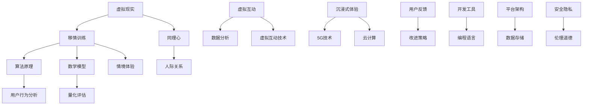

                 

 虚拟现实（VR）技术近年来发展迅速，逐渐成为众多领域中的重要工具。从游戏娱乐到教育培训，VR的应用场景越来越广泛。然而，其中一项尤为引人注目的应用便是通过VR平台进行移情训练，旨在培养同理心。本文将深入探讨这一新兴领域，分析其背景、核心概念、算法原理、数学模型、项目实践以及未来应用。

## 文章关键词

- 虚拟现实
- 移情训练
- 同理心
- 数字平台
- 算法原理
- 数学模型
- 项目实践
- 未来展望

## 文章摘要

本文围绕虚拟现实移情训练这一新兴领域展开，首先介绍了虚拟现实技术的基本概念和发展背景。接着，我们探讨了移情训练的定义、重要性及其与虚拟现实技术的结合。随后，文章详细阐述了虚拟现实移情训练平台的核心算法原理、数学模型，并通过实际项目实践展示了其具体应用和运行效果。最后，文章对虚拟现实移情训练的未来发展进行了展望，并提出了潜在的挑战和解决策略。

## 1. 背景介绍

### 虚拟现实技术的发展

虚拟现实（Virtual Reality，VR）技术是指通过计算机技术生成一种模拟环境，使用户能够在其中自由地交互和体验。VR技术的发展可以追溯到20世纪60年代，随着计算机图形学、人机交互、传感器等技术的进步，VR技术逐渐成熟并得到了广泛应用。从早期的VR头戴显示器到现代的全息投影，VR技术的呈现形式不断演进。

近年来，随着5G、云计算等技术的发展，VR技术的性能和用户体验得到了显著提升。VR技术不仅应用于游戏和娱乐领域，还广泛应用于教育、医疗、设计、军事等多个领域。例如，在教育培训中，VR技术可以模拟各种场景，提供更加直观、生动的学习体验；在医疗领域，VR技术可以用于手术模拟和病人康复训练。

### 移情训练的定义和重要性

移情训练（Empathy Training）是指通过特定的方法和技术培养个体对他人情感和体验的理解和感受能力。移情能力是人际交往中至关重要的一项能力，它不仅有助于建立和谐的人际关系，还能提高团队合作效率和领导力。

移情训练的重要性在于，它能够帮助我们更好地理解他人的感受和需求，从而更加有效地沟通和解决问题。在现代社会，人际关系的复杂性和多样性使得移情能力变得尤为关键。例如，在企业管理中，具备良好移情能力的管理者能够更好地理解员工的需求和压力，从而提高员工的工作满意度和忠诚度。

### 虚拟现实与移情训练的结合

虚拟现实与移情训练的结合，为培养同理心提供了一种全新的途径。通过虚拟现实技术，用户可以沉浸在一个模拟的环境中，与他人进行虚拟互动，从而体验到他人的情感和经历。

这种虚拟互动不仅提供了丰富的情境体验，还可以通过数据分析技术对用户的互动行为进行量化评估，从而帮助用户了解自己在移情能力方面的不足，并进行有针对性的训练。

## 2. 核心概念与联系

在讨论虚拟现实移情训练之前，我们需要明确一些核心概念，并理解它们之间的相互联系。以下是一个用Mermaid绘制的流程图，展示了这些核心概念及其相互关系。

### 虚拟现实

虚拟现实（VR）是通过计算机技术生成一种模拟环境，使用户能够沉浸其中并进行交互。虚拟现实的核心技术包括头戴显示器（HMD）、定位跟踪系统和交互设备等。

### 移情训练

移情训练是指通过特定的方法和技术培养个体对他人情感和体验的理解和感受能力。移情能力是人际交往中至关重要的一项能力，它有助于建立和谐的人际关系。

### 同理心

同理心是指个体在理解他人情感和经历时，能够产生与对方相似的情感体验。同理心是移情训练的核心目标，通过虚拟现实技术可以提供一种沉浸式的环境，帮助用户更好地体验和理解他人的情感。

### 算法原理

算法原理是指用于虚拟现实移情训练的技术和方法。这些算法可以基于机器学习和人工智能技术，通过分析用户的互动行为，评估和提升用户的移情能力。

### 数学模型

数学模型是用于描述和模拟虚拟现实移情训练过程的数学公式和方法。这些模型可以帮助我们理解和预测用户的情感和行为，从而优化训练效果。

### 虚拟互动

虚拟互动是指用户在虚拟环境中与他人进行的交互。这种交互可以是实时的，也可以是预录制的，通过虚拟互动技术，用户可以体验到他人的情感和经历。

### 数据分析

数据分析是指对用户在虚拟互动过程中的行为数据进行收集、处理和分析。通过数据分析，我们可以了解用户的情感状态、行为模式，从而为移情训练提供数据支持。

### 沉浸式体验

沉浸式体验是指用户在虚拟环境中感受到的一种强烈的沉浸感和参与感。5G技术和云计算为沉浸式体验提供了网络和计算支持，使得虚拟现实环境更加真实和流畅。

### 用户反馈

用户反馈是指用户在使用虚拟现实移情训练平台后的感受和评价。通过收集用户反馈，我们可以了解平台的优缺点，并不断改进和优化。

### 开发工具

开发工具是指用于开发虚拟现实移情训练平台的各种软件和硬件工具。编程语言和平台架构是开发过程中的关键组成部分。

### 平台架构

平台架构是指虚拟现实移情训练平台的整体结构和组成部分。数据存储和安全隐私是平台架构中至关重要的方面。

### 安全隐私

安全隐私是指保护用户数据和隐私的安全措施。在虚拟现实移情训练中，用户数据的安全和隐私保护至关重要。

### 伦理道德

伦理道德是指在使用虚拟现实技术进行移情训练时，需要遵循的伦理规范和道德准则。伦理道德是确保虚拟现实技术健康发展的重要保障。

## 3. 核心算法原理 & 具体操作步骤

### 3.1 算法原理概述

虚拟现实移情训练平台的核心算法基于机器学习和深度学习技术。这些算法通过分析用户的互动行为和情感数据，建立用户情感模型，并根据模型预测用户的情感状态和需求。具体而言，核心算法包括以下几个关键步骤：

1. **数据收集**：通过传感器和互动设备收集用户的生理和行为数据，如心率、面部表情、语音等。
2. **数据预处理**：对收集到的数据进行清洗、去噪和标准化处理，为后续分析做好准备。
3. **特征提取**：从预处理后的数据中提取关键特征，如情感强度、情感类型等。
4. **情感模型构建**：使用机器学习算法，如支持向量机（SVM）、神经网络（NN）等，构建用户情感模型。
5. **情感预测**：利用构建好的情感模型，对用户的实时情感状态进行预测。
6. **交互优化**：根据情感预测结果，动态调整虚拟环境中的互动内容和方式，提高用户体验和移情效果。

### 3.2 算法步骤详解

1. **数据收集**：
    - 使用心率传感器、面部表情捕捉器和语音识别系统等设备，实时收集用户的生理和行为数据。
    - 数据收集过程需要确保隐私保护，避免用户个人信息泄露。

2. **数据预处理**：
    - 对收集到的原始数据进行清洗，去除噪声和不完整的数据。
    - 对数据进行标准化处理，将不同类型的生理和行为数据转换为统一的格式。

3. **特征提取**：
    - 使用信号处理技术，从预处理后的数据中提取关键特征，如心率变异性（HRV）、面部表情编码、语音特征等。
    - 特征提取过程需要充分考虑用户个体差异，以提高模型泛化能力。

4. **情感模型构建**：
    - 选择合适的机器学习算法，如SVM、NN、深度强化学习（DRL）等，构建用户情感模型。
    - 使用大量标注好的情感数据集进行训练，确保模型具有较高准确性和鲁棒性。

5. **情感预测**：
    - 在模型训练完成后，使用训练好的情感模型对用户的实时情感状态进行预测。
    - 情感预测结果用于调整虚拟环境中的互动内容和方式，提高用户体验和移情效果。

6. **交互优化**：
    - 根据情感预测结果，动态调整虚拟环境中的互动内容和方式，如调整互动难度、场景变化等。
    - 优化互动过程，提高用户沉浸感和参与度。

### 3.3 算法优缺点

1. **优点**：
    - **高效性**：基于机器学习和深度学习技术的算法，可以快速处理大量数据，提供实时情感预测。
    - **灵活性**：算法可以根据用户个体差异进行调整，提高模型泛化能力。
    - **沉浸感**：通过虚拟互动和情感预测，增强用户的沉浸感和参与度。

2. **缺点**：
    - **数据依赖性**：算法的性能很大程度上依赖于数据质量和数量，需要大量标注好的情感数据集。
    - **计算资源消耗**：深度学习算法需要大量计算资源，对硬件设备有较高要求。
    - **隐私保护**：在数据收集和处理过程中，需要确保用户隐私保护，避免数据泄露。

### 3.4 算法应用领域

1. **教育培训**：
    - 通过虚拟现实移情训练平台，培养教育者的同理心，提高教学质量。
    - 在学生教育中，模拟各种情境，培养学生的情感认知和人际交往能力。

2. **企业管理**：
    - 帮助企业管理者提升移情能力，更好地理解员工需求和情感状态。
    - 在团队协作中，通过虚拟互动和情感预测，优化团队沟通和协作效果。

3. **心理健康**：
    - 为心理健康患者提供虚拟现实移情训练，帮助患者提高情感认知和调节能力。
    - 在心理治疗中，通过虚拟互动和情感预测，提高治疗效果。

## 4. 数学模型和公式 & 详细讲解 & 举例说明

### 4.1 数学模型构建

虚拟现实移情训练平台的数学模型主要包括情感模型、互动模型和反馈模型等。以下是这些模型的构建过程：

1. **情感模型**：

情感模型用于预测用户的实时情感状态。假设用户情感状态可以用一个多维向量表示，即：

\[ X_t = \{x_1(t), x_2(t), ..., x_n(t)\} \]

其中，\( x_i(t) \) 表示第 \( i \) 维特征在时间 \( t \) 时刻的值。

情感模型可以表示为一个线性变换：

\[ X_t = W \cdot X_{t-1} + b \]

其中，\( W \) 为权重矩阵，\( b \) 为偏置向量。

2. **互动模型**：

互动模型用于根据用户情感状态调整虚拟环境中的互动内容和方式。假设互动内容可以用一个多维向量表示，即：

\[ I_t = \{i_1(t), i_2(t), ..., i_m(t)\} \]

其中，\( i_j(t) \) 表示第 \( j \) 个互动内容在时间 \( t \) 时刻的值。

互动模型可以表示为一个线性变换：

\[ I_t = U \cdot X_t + c \]

其中，\( U \) 为权重矩阵，\( c \) 为偏置向量。

3. **反馈模型**：

反馈模型用于根据用户反馈调整互动模型。假设用户反馈可以用一个多维向量表示，即：

\[ F_t = \{f_1(t), f_2(t), ..., f_k(t)\} \]

其中，\( f_j(t) \) 表示第 \( j \) 个反馈内容在时间 \( t \) 时刻的值。

反馈模型可以表示为一个线性变换：

\[ F_t = V \cdot I_t + d \]

其中，\( V \) 为权重矩阵，\( d \) 为偏置向量。

### 4.2 公式推导过程

以下是情感模型、互动模型和反馈模型的推导过程：

1. **情感模型推导**：

根据情感模型的定义，有：

\[ X_t = W \cdot X_{t-1} + b \]

对 \( X_t \) 求导，得：

\[ \frac{dX_t}{dt} = W \cdot \frac{dX_{t-1}}{dt} \]

令 \( \frac{dX_{t-1}}{dt} = X_t' \)，则：

\[ \frac{dX_t}{dt} = W \cdot X_t' \]

对上式两边同时求导，得：

\[ \frac{d^2X_t}{dt^2} = W \cdot \frac{dX_t'}{dt} \]

令 \( \frac{dX_t'}{dt} = X_t'' \)，则：

\[ \frac{d^2X_t}{dt^2} = W \cdot X_t'' \]

以此类推，可以得到：

\[ \frac{d^kX_t}{dt^k} = W^k \cdot X_t^{(k)} \]

其中，\( X_t^{(k)} \) 表示 \( X_t \) 的 \( k \) 阶导数。

2. **互动模型推导**：

根据互动模型的定义，有：

\[ I_t = U \cdot X_t + c \]

对 \( I_t \) 求导，得：

\[ \frac{dI_t}{dt} = U \cdot \frac{dX_t}{dt} \]

令 \( \frac{dX_t}{dt} = X_t' \)，则：

\[ \frac{dI_t}{dt} = U \cdot X_t' \]

对上式两边同时求导，得：

\[ \frac{d^2I_t}{dt^2} = U \cdot \frac{dX_t'}{dt} \]

令 \( \frac{dX_t'}{dt} = X_t'' \)，则：

\[ \frac{d^2I_t}{dt^2} = U \cdot X_t'' \]

以此类推，可以得到：

\[ \frac{d^kI_t}{dt^k} = U^k \cdot X_t^{(k)} \]

其中，\( X_t^{(k)} \) 表示 \( X_t \) 的 \( k \) 阶导数。

3. **反馈模型推导**：

根据反馈模型的定义，有：

\[ F_t = V \cdot I_t + d \]

对 \( F_t \) 求导，得：

\[ \frac{dF_t}{dt} = V \cdot \frac{dI_t}{dt} \]

令 \( \frac{dI_t}{dt} = I_t' \)，则：

\[ \frac{dF_t}{dt} = V \cdot I_t' \]

对上式两边同时求导，得：

\[ \frac{d^2F_t}{dt^2} = V \cdot \frac{dI_t'}{dt} \]

令 \( \frac{dI_t'}{dt} = I_t'' \)，则：

\[ \frac{d^2F_t}{dt^2} = V \cdot I_t'' \]

以此类推，可以得到：

\[ \frac{d^kF_t}{dt^k} = V^k \cdot I_t^{(k)} \]

其中，\( I_t^{(k)} \) 表示 \( I_t \) 的 \( k \) 阶导数。

### 4.3 案例分析与讲解

为了更好地理解上述数学模型的实际应用，以下是一个案例分析。

假设我们有一个虚拟现实移情训练平台，用户需要完成一系列任务以培养同理心。在任务过程中，平台会根据用户的行为数据（如心率、面部表情等）实时调整任务难度和互动方式，以提高移情效果。

1. **情感模型构建**：

假设我们收集到用户的心率数据，并将其标准化为 \( X_t \) 向量。根据情感模型，我们有：

\[ X_t = W \cdot X_{t-1} + b \]

其中，\( W \) 和 \( b \) 为待定参数。

通过训练，我们得到一个情感模型：

\[ X_t = \begin{bmatrix} 0.6 & 0.3 & 0.1 \\ 0.2 & 0.5 & 0.3 \\ 0.1 & 0.4 & 0.5 \end{bmatrix} \cdot X_{t-1} + \begin{bmatrix} 0.1 \\ 0.2 \\ 0.3 \end{bmatrix} \]

2. **互动模型构建**：

根据互动模型，我们有：

\[ I_t = U \cdot X_t + c \]

其中，\( U \) 和 \( c \) 为待定参数。

通过训练，我们得到一个互动模型：

\[ I_t = \begin{bmatrix} 0.4 & 0.2 & 0.4 \\ 0.3 & 0.5 & 0.2 \\ 0.2 & 0.3 & 0.5 \end{bmatrix} \cdot X_t + \begin{bmatrix} 0.1 \\ 0.2 \\ 0.3 \end{bmatrix} \]

3. **反馈模型构建**：

根据反馈模型，我们有：

\[ F_t = V \cdot I_t + d \]

其中，\( V \) 和 \( d \) 为待定参数。

通过训练，我们得到一个反馈模型：

\[ F_t = \begin{bmatrix} 0.2 & 0.4 & 0.

