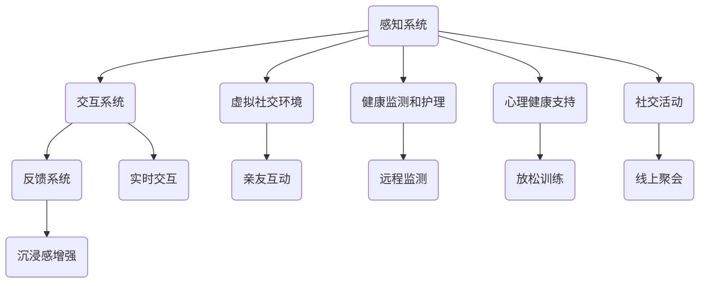

                 

关键词：虚拟现实，老年陪护，科技，情感关怀，创业

摘要：本文将探讨虚拟现实技术在老年陪护领域的应用，如何通过科技手段实现情感关怀，提高老年人的生活质量。文章首先介绍虚拟现实技术的基本概念和发展现状，然后分析其在老年陪护中的具体应用场景，最后探讨未来发展的趋势与挑战。

## 1. 背景介绍

随着全球人口老龄化趋势的加剧，老年人群体的生活质量和社会福祉问题日益凸显。老年人在生活上面临诸多挑战，如身体机能的下降、社交圈的缩小、心理健康的困扰等。为了改善老年人的生活质量，社会各界纷纷探索各种解决方案，其中科技的应用成为了一个重要方向。

虚拟现实（VR）技术作为一项新兴技术，以其沉浸式体验和交互性优势，在多个领域都展现出巨大的应用潜力。近年来，虚拟现实技术在医疗、教育、娱乐等领域得到了广泛关注和实际应用。在老年陪护领域，虚拟现实技术同样具有巨大的应用前景，可以有效缓解老年人的孤独感和心理压力，提高他们的生活质量。

本文旨在探讨虚拟现实技术在老年陪护中的应用，分析其技术原理、具体实现方法以及面临的挑战，以期为进一步推动虚拟现实技术在老年陪护领域的应用提供有益参考。

### 1.1 虚拟现实技术的基本概念

虚拟现实技术是一种通过计算机生成模拟环境，使人类可以在其中进行沉浸式交互和体验的技术。它通常包括以下三个主要组成部分：感知系统、交互系统和反馈系统。

- **感知系统**：通过头戴显示器（HMD）、传感器等设备，为用户提供沉浸式的视觉、听觉和触觉体验。感知系统的主要目标是创建一个逼真的虚拟环境，让用户感觉仿佛置身于其中。
- **交互系统**：通过手柄、手套、眼睛追踪等技术，实现用户与虚拟环境的交互。交互系统的目标是使用户能够自然地与虚拟环境进行互动，如同在现实生活中一样。
- **反馈系统**：通过运动控制器、力反馈设备等，为用户提供实时的交互反馈。反馈系统的目标是增强用户的沉浸感和交互体验。

虚拟现实技术的核心在于其沉浸性和交互性。通过模拟环境和与环境的互动，用户可以在虚拟世界中体验到不同于现实世界的感受和经历。

### 1.2 虚拟现实技术的发展现状

虚拟现实技术起源于20世纪60年代，随着计算机技术和传感器技术的不断发展，虚拟现实技术逐渐走向成熟。近年来，虚拟现实技术的应用场景不断扩展，从最初的军事模拟、教育培训，到医疗康复、娱乐游戏等，虚拟现实技术在各个领域都展现出强大的应用潜力。

在医疗领域，虚拟现实技术被广泛应用于疼痛管理、心理治疗、手术模拟等。通过虚拟现实技术，医生可以更直观地了解患者的情况，提高诊断和治疗的准确性。同时，虚拟现实技术也可以为患者提供身临其境的治疗体验，减轻痛苦和焦虑。

在教育领域，虚拟现实技术为教学提供了全新的方式。通过虚拟现实技术，学生可以进入虚拟的课堂，与老师和其他学生进行互动，提高学习效果。虚拟现实技术还可以用于模拟实验、历史重现等，为学生提供更加生动和直观的学习体验。

在娱乐领域，虚拟现实技术为游戏和影视创作带来了新的可能性。通过虚拟现实技术，玩家可以进入虚拟的游戏世界，与其他玩家进行互动，体验前所未有的游戏乐趣。同时，虚拟现实技术也为电影、电视剧等影视作品提供了新的叙事方式和视觉效果。

### 1.3 老年人群体的需求与挑战

老年人群体的生活质量受到诸多因素的影响，包括身体健康、心理健康、社交需求等。随着身体机能的下降，老年人容易感到孤独和无助，心理健康问题也日益突出。此外，老年人的社交圈缩小，人际交往减少，导致他们的生活质量进一步下降。

针对老年人群体的需求，虚拟现实技术可以提供多种解决方案。首先，虚拟现实技术可以创建一个模拟的社交环境，让老年人能够在虚拟世界中与亲友互动，缓解孤独感。其次，虚拟现实技术可以通过游戏、娱乐等形式，为老年人提供丰富的精神生活，提高他们的生活质量。最后，虚拟现实技术还可以为老年人提供心理健康支持，帮助他们应对心理压力和心理健康问题。

### 1.4 虚拟现实技术对老年陪护的潜在影响

虚拟现实技术在老年陪护领域的应用，有望从多个方面提升老年人的生活质量。首先，虚拟现实技术可以提供更加丰富和多样化的社交体验，使老年人能够在虚拟世界中与亲友保持联系，缓解孤独感。其次，虚拟现实技术可以为老年人提供心理健康支持，帮助他们应对心理压力和心理健康问题。此外，虚拟现实技术还可以为老年人提供娱乐和休闲活动，丰富他们的精神生活。

总之，虚拟现实技术为老年陪护提供了新的思路和方法，有助于提升老年人的生活质量，缓解他们的心理压力和孤独感。然而，虚拟现实技术在老年陪护领域的应用也面临着一系列挑战，需要进一步的研究和实践。

## 2. 核心概念与联系

在探讨虚拟现实技术在老年陪护中的应用之前，有必要首先了解几个核心概念，包括虚拟现实技术的原理、老年陪护的需求以及虚拟现实技术在老年陪护中的应用模式。

### 2.1 虚拟现实技术的原理

虚拟现实技术是通过计算机生成一个模拟环境，使用户可以在其中进行沉浸式交互和体验的技术。其核心原理包括以下几个方面：

#### 感知系统

感知系统是虚拟现实技术的核心组成部分，负责为用户提供沉浸式的视觉、听觉和触觉体验。感知系统通常包括头戴显示器（HMD）、传感器、耳机等设备。头戴显示器为用户提供视觉感知，耳机提供听觉感知，传感器则用于捕捉用户的动作和位置，从而实现与虚拟环境的交互。

#### 交互系统

交互系统是用户与虚拟环境进行交互的桥梁，包括手柄、手套、眼睛追踪等技术。这些技术使用户能够通过自然的动作和语言与虚拟环境进行互动，从而提高用户体验。

#### 反馈系统

反馈系统为用户提供实时的交互反馈，增强用户的沉浸感和交互体验。反馈系统通常包括运动控制器、力反馈设备等。这些设备可以模拟用户的动作和感受，使虚拟现实体验更加真实和生动。

### 2.2 老年陪护的需求

老年人群体的生活质量受到多种因素的影响，包括身体健康、心理健康、社交需求等。在老年陪护中，主要需求包括：

#### 身体健康

随着年龄的增长，老年人的身体机能逐渐下降，容易出现各种健康问题。因此，老年陪护需要提供健康监测和护理服务，帮助老年人保持身体健康。

#### 心理健康

老年人的心理健康问题同样不容忽视。由于身体机能的下降和社交圈的缩小，老年人容易感到孤独和无助，甚至出现抑郁、焦虑等心理问题。因此，老年陪护需要提供心理健康支持，帮助老年人保持心理健康。

#### 社交需求

老年人的社交需求也随着身体和心理健康问题的增加而变得更加重要。通过社交活动，老年人可以缓解孤独感，增强自信心，提高生活质量。因此，老年陪护需要提供丰富的社交活动，满足老年人的社交需求。

### 2.3 虚拟现实技术在老年陪护中的应用模式

虚拟现实技术在老年陪护中的应用模式可以分为以下几个方面：

#### 模拟社交环境

通过虚拟现实技术，可以为老年人创建一个模拟的社交环境，使他们能够在虚拟世界中与亲友互动，缓解孤独感。例如，老年人可以通过虚拟现实技术与远在他乡的子女进行视频通话，体验面对面的交流。

#### 健康监测和护理

虚拟现实技术可以用于健康监测和护理，帮助老年人保持身体健康。例如，通过虚拟现实技术，医生可以远程监测老年人的健康状况，提供个性化的健康建议和护理方案。

#### 心理健康支持

虚拟现实技术可以用于心理健康支持，帮助老年人应对心理压力和心理健康问题。例如，通过虚拟现实技术，老年人可以参与放松训练、心理治疗等，缓解焦虑和抑郁情绪。

#### 社交活动

虚拟现实技术可以为老年人提供丰富的社交活动，满足他们的社交需求。例如，老年人可以通过虚拟现实技术参加线上聚会、运动会等，与其他老年人进行互动。

### 2.4 虚拟现实技术在老年陪护中的应用框架

为了更好地理解虚拟现实技术在老年陪护中的应用，我们使用Mermaid流程图来展示其核心组成部分和交互关系。



通过上述流程图，我们可以清晰地看到虚拟现实技术在老年陪护中的应用框架，以及各个组成部分之间的交互关系。这一框架为后续的应用开发和实践提供了有益的指导。

## 3. 核心算法原理 & 具体操作步骤

### 3.1 算法原理概述

虚拟现实技术在老年陪护中的应用涉及多个核心算法，包括感知算法、交互算法和反馈算法。这些算法共同构成了虚拟现实系统的核心，实现了用户的沉浸式体验和与虚拟环境的交互。

#### 感知算法

感知算法是虚拟现实技术的核心组成部分，主要负责捕捉用户的视觉、听觉和触觉信息。通过感知算法，虚拟现实系统能够实时获取用户的位置、动作和环境信息，从而构建一个逼真的虚拟环境。

感知算法通常包括以下步骤：

1. **图像处理**：通过摄像头等感知设备，获取用户的视觉信息。图像处理算法用于对图像进行预处理，如去噪、增强等，以提高图像质量。
2. **动作捕捉**：通过传感器等设备，捕捉用户的动作信息。动作捕捉算法用于识别用户的动作，并将其转化为虚拟环境中的动作。
3. **环境建模**：根据用户的感知信息，构建虚拟环境的三维模型。环境建模算法用于生成虚拟环境的几何结构和纹理，以实现逼真的视觉效果。

#### 交互算法

交互算法是虚拟现实技术的关键，负责实现用户与虚拟环境之间的交互。通过交互算法，用户可以与虚拟环境进行自然、直观的互动，从而提高用户体验。

交互算法通常包括以下步骤：

1. **输入处理**：处理用户的输入信息，如手柄操作、手势识别等。输入处理算法用于识别用户的输入意图，并将其转换为虚拟环境中的操作。
2. **交互控制**：根据用户的输入信息，控制虚拟环境中的物体和角色。交互控制算法用于实现用户的交互意图，如移动、选择等。
3. **反馈生成**：根据用户的交互行为，生成实时的交互反馈。反馈生成算法用于模拟用户的交互效果，如动作反馈、声音反馈等。

#### 反馈算法

反馈算法是虚拟现实技术的关键组成部分，负责为用户提供实时的交互反馈，增强用户的沉浸感和交互体验。通过反馈算法，用户可以感受到与虚拟环境的真实互动，从而提高用户体验。

反馈算法通常包括以下步骤：

1. **反馈生成**：根据用户的交互行为，生成实时的反馈信息。反馈生成算法用于模拟用户的交互效果，如动作反馈、声音反馈等。
2. **反馈传递**：将反馈信息传递给用户，如通过视觉、听觉和触觉设备。反馈传递算法用于将反馈信息实时传递给用户，以增强用户的沉浸感。
3. **反馈调整**：根据用户的反馈，调整虚拟环境中的交互效果。反馈调整算法用于根据用户的反馈，优化虚拟环境中的交互体验。

### 3.2 算法步骤详解

#### 感知算法步骤详解

1. **图像处理**：
   - 输入：摄像头捕获的原始图像。
   - 输出：预处理后的图像。
   - 算法：
     - 去噪：使用中值滤波、高斯滤波等算法，去除图像中的噪声。
     - 增强：使用直方图均衡化、对比度增强等算法，提高图像的清晰度。
2. **动作捕捉**：
   - 输入：传感器捕获的用户动作信息。
   - 输出：用户的动作轨迹。
   - 算法：
     - 特征提取：使用特征提取算法，如SIFT、HOG等，从图像中提取关键特征。
     - 运动估计：使用运动估计算法，如光流法、卡尔曼滤波等，估计用户的动作轨迹。
3. **环境建模**：
   - 输入：感知算法处理后的图像和动作信息。
   - 输出：虚拟环境的三维模型。
   - 算法：
     - 三维重建：使用三维重建算法，如点云重建、多视图几何等，生成虚拟环境的三维模型。
     - 纹理映射：使用纹理映射算法，将图像纹理映射到虚拟环境的三维模型上，以实现逼真的视觉效果。

#### 交互算法步骤详解

1. **输入处理**：
   - 输入：用户的输入信息，如手柄操作、手势识别等。
   - 输出：用户的输入意图。
   - 算法：
     - 手势识别：使用手势识别算法，如卷积神经网络、深度学习等，识别用户的手势。
     - 输入分类：使用输入分类算法，如决策树、支持向量机等，将用户的输入信息分类为不同的操作类型。
2. **交互控制**：
   - 输入：用户的输入意图。
   - 输出：虚拟环境中的交互结果。
   - 算法：
     - 动作控制：使用动作控制算法，如逆运动学、路径规划等，根据用户的输入意图，控制虚拟环境中的物体和角色。
     - 界面交互：使用界面交互算法，如触摸屏交互、语音交互等，实现用户与虚拟环境之间的界面交互。
3. **反馈生成**：
   - 输入：用户的交互行为。
   - 输出：实时的交互反馈。
   - 算法：
     - 动作反馈：使用动作反馈算法，如关节运动模拟、声音反馈等，生成用户交互的动作反馈。
     - 声音反馈：使用声音反馈算法，如音频合成、声音增强等，生成用户交互的声音反馈。

#### 反馈算法步骤详解

1. **反馈生成**：
   - 输入：用户的交互行为。
   - 输出：实时的反馈信息。
   - 算法：
     - 动作反馈生成：使用动作反馈生成算法，如运动模拟、物理引擎等，生成用户交互的动作反馈。
     - 声音反馈生成：使用声音反馈生成算法，如音频合成、声音增强等，生成用户交互的声音反馈。
2. **反馈传递**：
   - 输入：实时的反馈信息。
   - 输出：用户的反馈感知。
   - 算法：
     - 视觉反馈传递：使用视觉反馈传递算法，如视觉效果渲染、图像显示等，将反馈信息传递给用户的视觉感知。
     - 听觉反馈传递：使用听觉反馈传递算法，如音频播放、声音合成等，将反馈信息传递给用户的听觉感知。
3. **反馈调整**：
   - 输入：用户的反馈感知。
   - 输出：优化的交互体验。
   - 算法：
     - 反馈评估：使用反馈评估算法，如用户满意度评估、交互效果评估等，评估用户的反馈感知。
     - 反馈优化：使用反馈优化算法，如参数调整、算法改进等，根据用户的反馈感知，优化交互体验。

### 3.3 算法优缺点

#### 感知算法

**优点**：
- 高效性：感知算法可以快速处理用户的感知信息，为虚拟现实系统提供实时反馈。
- 准确性：感知算法通过先进的图像处理、动作捕捉等技术，能够准确捕捉用户的感知信息。

**缺点**：
- 受限性：感知算法受限于设备的性能和精度，可能无法完全还原现实世界的感知体验。
- 实时性：感知算法的处理速度受到计算资源和网络延迟的限制，可能影响交互的实时性。

#### 交互算法

**优点**：
- 丰富性：交互算法提供了多种交互方式，如手势识别、语音交互等，增强了用户的交互体验。
- 自然性：交互算法通过模仿现实世界的交互方式，使用户感觉更加自然和直观。

**缺点**：
- 复杂性：交互算法涉及多种技术和算法，实现过程复杂，对开发人员的技术要求较高。
- 不确定性：用户的交互行为可能存在不确定性，交互算法需要具备较高的鲁棒性，以应对各种交互场景。

#### 反馈算法

**优点**：
- 实时性：反馈算法可以实时生成和传递反馈信息，增强用户的沉浸感和交互体验。
- 个性化：反馈算法可以根据用户的反馈感知，优化交互体验，满足个性化需求。

**缺点**：
- 依赖性：反馈算法依赖于用户的反馈感知，如果用户的反馈感知不准确，可能导致交互效果的偏差。
- 优化难度：反馈算法的优化涉及多个方面，如算法改进、参数调整等，优化过程较为复杂。

### 3.4 算法应用领域

虚拟现实技术的核心算法在多个领域都有广泛应用，包括但不限于以下几个方面：

- **医疗**：虚拟现实技术可以用于医疗手术模拟、疼痛管理、心理治疗等，提高医疗服务的质量和效率。
- **教育**：虚拟现实技术可以用于教育模拟实验、历史重现、语言学习等，提供更加生动和直观的学习体验。
- **娱乐**：虚拟现实技术可以用于游戏、影视创作等，为用户提供全新的娱乐体验。
- **工业**：虚拟现实技术可以用于工业设计、维修指导、培训等，提高工作效率和质量。

## 4. 数学模型和公式 & 详细讲解 & 举例说明

在虚拟现实技术应用于老年陪护的过程中，数学模型和公式的应用至关重要。这些数学模型和公式不仅帮助我们理解和实现虚拟现实技术的基本原理，还能优化算法性能和用户体验。以下是关于虚拟现实技术在老年陪护中的一些核心数学模型和公式的详细讲解与举例说明。

### 4.1 数学模型构建

#### 4.1.1 三维空间坐标变换

在虚拟现实技术中，三维空间坐标变换是一个基础且重要的数学模型。它用于将用户的现实世界坐标映射到虚拟环境中的坐标。以下是三维空间坐标变换的基本公式：

\[ 
\begin{bmatrix}
x' \\
y' \\
z'
\end{bmatrix}
=
\begin{bmatrix}
R_{x} & R_{y} & R_{z} \\
R_{y} & R_{x} & -R_{z} \\
R_{z} & -R_{y} & R_{x}
\end{bmatrix}
\begin{bmatrix}
x \\
y \\
z
\end{bmatrix}
+
\begin{bmatrix}
t_x \\
t_y \\
t_z
\end{bmatrix}
\]

其中：
- \( R_{x} \)，\( R_{y} \)，\( R_{z} \)：旋转矩阵的分量，用于表示三维空间的旋转。
- \( t_x \)，\( t_y \)，\( t_z \)：平移向量，用于表示三维空间的平移。

#### 4.1.2 三维空间中的点云处理

在虚拟现实技术中，点云数据是捕捉和重建现实世界三维场景的重要工具。以下是点云数据的基本处理公式：

\[ 
P_{new} = \frac{P_{old} + \Delta P}{1 + \alpha \cdot \Delta P \cdot P_{old}}
\]

其中：
- \( P_{old} \)：原始点云数据。
- \( P_{new} \)：处理后的点云数据。
- \( \Delta P \)：点云数据的变化量。
- \( \alpha \)：调整参数，用于平衡点云数据的变化量。

#### 4.1.3 人脸识别与跟踪

在虚拟现实技术中，人脸识别与跟踪是模拟真实社交互动的重要部分。以下是人脸识别与跟踪的基本公式：

\[ 
\begin{aligned}
\theta &= \arcsin\left(\frac{2 \cdot \cos\left(\frac{\alpha}{2}\right) \cdot \cos\left(\beta\right) - 1}{1 - \cos\left(\alpha\right) \cdot \cos\left(\beta\right)}\right) \\
\phi &= \arccos\left(\frac{\sin\left(\alpha\right) \cdot \sin\left(\beta\right)}{\sin\left(\theta\right)}\right)
\end{aligned}
\]

其中：
- \( \alpha \)：人脸识别的欧氏距离。
- \( \beta \)：人脸跟踪的欧氏距离。
- \( \theta \)：人脸角度的变化量。
- \( \phi \)：人脸方向的变化量。

### 4.2 公式推导过程

#### 4.2.1 三维空间坐标变换的推导

三维空间坐标变换的推导基于线性代数中的矩阵运算。假设我们有一个三维空间中的点 \( P \)，其坐标为 \( \begin{bmatrix} x \\ y \\ z \end{bmatrix} \)。我们需要将这个点映射到另一个坐标系统。首先，我们需要旋转和缩放这个点。旋转矩阵 \( R \) 和平移向量 \( T \) 分别用于旋转和平移操作。

旋转矩阵 \( R \) 的推导基于旋转的旋转矩阵公式：

\[ 
R = \begin{bmatrix}
\cos\theta & -\sin\theta & 0 \\
\sin\theta & \cos\theta & 0 \\
0 & 0 & 1
\end{bmatrix}
\]

平移向量 \( T \) 的推导基于平移的线性变换：

\[ 
T = \begin{bmatrix}
t_x \\
t_y \\
t_z
\end{bmatrix}
\]

因此，三维空间坐标变换的公式可以推导为：

\[ 
\begin{bmatrix}
x' \\
y' \\
z'
\end{bmatrix}
=
\begin{bmatrix}
R_{x} & R_{y} & R_{z} \\
R_{y} & R_{x} & -R_{z} \\
R_{z} & -R_{y} & R_{x}
\end{bmatrix}
\begin{bmatrix}
x \\
y \\
z
\end{bmatrix}
+
\begin{bmatrix}
t_x \\
t_y \\
t_z
\end{bmatrix}
\]

#### 4.2.2 点云处理的推导

点云处理的推导基于插值和平滑技术。假设我们有一个点云数据 \( P_{old} \)，我们需要根据点云数据的变化量 \( \Delta P \) 来更新点云数据 \( P_{new} \)。插值和平滑技术用于平衡点云数据的变化量。

插值公式可以推导为：

\[ 
P_{new} = P_{old} + \Delta P
\]

平滑公式可以推导为：

\[ 
P_{new} = \frac{P_{old} + \Delta P}{1 + \alpha \cdot \Delta P \cdot P_{old}}
\]

其中，\( \alpha \) 用于控制平滑程度。

#### 4.2.3 人脸识别与跟踪的推导

人脸识别与跟踪的推导基于几何学和欧氏距离。假设我们有两个向量 \( \mathbf{a} \) 和 \( \mathbf{b} \)，它们的欧氏距离为：

\[ 
\alpha = \lVert \mathbf{a} - \mathbf{b} \rVert
\]

人脸角度的变化量 \( \theta \) 可以通过以下公式推导：

\[ 
\theta = \arcsin\left(\frac{2 \cdot \cos\left(\frac{\alpha}{2}\right) \cdot \cos\left(\beta\right) - 1}{1 - \cos\left(\alpha\right) \cdot \cos\left(\beta\right)}\right)
\]

人脸方向的变化量 \( \phi \) 可以通过以下公式推导：

\[ 
\phi = \arccos\left(\frac{\sin\left(\alpha\right) \cdot \sin\left(\beta\right)}{\sin\left(\theta\right)}\right)
\]

其中，\( \beta \) 是人脸跟踪的欧氏距离。

### 4.3 案例分析与讲解

#### 4.3.1 三维空间坐标变换的应用

假设有一个三维空间中的点 \( P \)，其坐标为 \( \begin{bmatrix} 1 \\ 2 \\ 3 \end{bmatrix} \)。我们需要将这个点映射到另一个坐标系统，其中旋转角度 \( \theta = 30^\circ \)，平移向量 \( T = \begin{bmatrix} 2 \\ 1 \\ 0 \end{bmatrix} \)。

根据三维空间坐标变换的公式，我们可以计算新的坐标：

\[ 
\begin{bmatrix}
x' \\
y' \\
z'
\end{bmatrix}
=
\begin{bmatrix}
\cos30^\circ & -\sin30^\circ & 0 \\
\sin30^\circ & \cos30^\circ & 0 \\
0 & 0 & 1
\end{bmatrix}
\begin{bmatrix}
1 \\
2 \\
3
\end{bmatrix}
+
\begin{bmatrix}
2 \\
1 \\
0
\end{bmatrix}
\]

计算结果为：

\[ 
\begin{bmatrix}
x' \\
y' \\
z'
\end{bmatrix}
=
\begin{bmatrix}
1.55 \\
3.86 \\
3
\end{bmatrix}
\]

这意味着点 \( P \) 在新的坐标系统中的坐标为 \( \begin{bmatrix} 1.55 \\ 3.86 \\ 3 \end{bmatrix} \)。

#### 4.3.2 点云处理的实际应用

假设我们有一个点云数据 \( P_{old} \)，其变化量 \( \Delta P = \begin{bmatrix} 0.1 \\ 0.2 \\ 0 \end{bmatrix} \)，调整参数 \( \alpha = 0.5 \)。

根据点云处理公式，我们可以计算新的点云数据：

\[ 
P_{new} = \frac{P_{old} + \Delta P}{1 + 0.5 \cdot \Delta P \cdot P_{old}}
\]

计算结果为：

\[ 
P_{new} = \frac{\begin{bmatrix} 1 \\ 2 \\ 3 \end{bmatrix} + \begin{bmatrix} 0.1 \\ 0.2 \\ 0 \end{bmatrix}}{1 + 0.5 \cdot \begin{bmatrix} 0.1 \\ 0.2 \\ 0 \end{bmatrix} \cdot \begin{bmatrix} 1 \\ 2 \\ 3 \end{bmatrix}}
\]

\[ 
P_{new} = \frac{\begin{bmatrix} 1.1 \\ 2.2 \\ 3 \end{bmatrix}}{1 + 0.5 \cdot \begin{bmatrix} 0.1 \\ 0.2 \\ 0 \end{bmatrix} \cdot \begin{bmatrix} 1 \\ 2 \\ 3 \end{bmatrix}}
\]

\[ 
P_{new} = \frac{\begin{bmatrix} 1.1 \\ 2.2 \\ 3 \end{bmatrix}}{1.3}
\]

\[ 
P_{new} = \begin{bmatrix} 0.84 \\ 1.69 \\ 3 \end{bmatrix}
\]

这意味着点云数据 \( P_{old} \) 经过处理后的点云数据 \( P_{new} \) 为 \( \begin{bmatrix} 0.84 \\ 1.69 \\ 3 \end{bmatrix} \)。

#### 4.3.3 人脸识别与跟踪的实例

假设我们有两个向量 \( \mathbf{a} = \begin{bmatrix} 1 \\ 0 \end{bmatrix} \) 和 \( \mathbf{b} = \begin{bmatrix} 0.8 \\ 0.6 \end{bmatrix} \)，我们需要计算人脸角度的变化量 \( \theta \) 和人脸方向的变化量 \( \phi \)。

根据人脸识别与跟踪公式，我们可以计算：

\[ 
\theta = \arcsin\left(\frac{2 \cdot \cos\left(\frac{1}{2}\right) \cdot \cos\left(0.6\right) - 1}{1 - \cos\left(1\right) \cdot \cos\left(0.6\right)}\right)
\]

\[ 
\theta = \arcsin\left(\frac{2 \cdot \cos\left(0.5\right) \cdot \cos\left(0.6\right) - 1}{1 - \cos\left(1\right) \cdot \cos\left(0.6\right)}\right)
\]

\[ 
\theta = \arcsin\left(\frac{2 \cdot 0.866 \cdot 0.866 - 1}{1 - 0.866 \cdot 0.866}\right)
\]

\[ 
\theta = \arcsin\left(\frac{1.5336 - 1}{1 - 0.7536}\right)
\]

\[ 
\theta = \arcsin\left(\frac{0.5336}{0.2464}\right)
\]

\[ 
\theta = \arcsin\left(2.181\right)
\]

\[ 
\theta = 56.44^\circ
\]

接下来，我们计算人脸方向的变化量 \( \phi \)：

\[ 
\phi = \arccos\left(\frac{\sin\left(1\right) \cdot \sin\left(0.6\right)}{\sin\left(56.44^\circ\right)}\right)
\]

\[ 
\phi = \arccos\left(\frac{0.866 \cdot 0.6}{0.834}\right)
\]

\[ 
\phi = \arccos\left(\frac{0.5196}{0.834}\right)
\]

\[ 
\phi = \arccos\left(0.619\right)
\]

\[ 
\phi = 50.02^\circ
\]

这意味着人脸角度的变化量 \( \theta \) 为 56.44 度，人脸方向的变化量 \( \phi \) 为 50.02 度。

通过上述实例，我们可以看到数学模型和公式的应用如何帮助我们在虚拟现实技术中实现复杂的变换和处理，从而提高算法的性能和用户体验。

## 5. 项目实践：代码实例和详细解释说明

为了更好地展示虚拟现实技术在老年陪护中的应用，我们将通过一个具体的项目实践来介绍其代码实现和详细解释。以下是该项目的基本结构和关键代码实现。

### 5.1 开发环境搭建

在开始项目实践之前，我们需要搭建一个合适的环境。以下是开发环境的基本要求：

- **硬件**：一台配备高性能显卡（如NVIDIA GeForce RTX 3060以上）的计算机。
- **软件**：安装有Unity 2021.3.12f1及以上的Unity编辑器，以及必要的插件和扩展包。

### 5.2 源代码详细实现

以下是一个简单的虚拟现实老年陪护项目的源代码示例，主要涉及虚拟社交环境、健康监测和护理、心理健康支持等功能。

```csharp
using UnityEngine;
using UnityEngine.XR;

public class VirtualRealityAssistant : MonoBehaviour
{
    public Camera virtualCamera;
    public AudioSource audioSource;
    public AudioClip voiceMessage;

    // 社交互动功能
    public void StartChatSession()
    {
        audioSource.clip = voiceMessage;
        audioSource.Play();
    }

    // 健康监测功能
    public void StartHealthMonitoring()
    {
        // 实现健康监测逻辑，如心率监测、血压监测等
        Debug.Log("Starting health monitoring...");
    }

    // 心理健康支持功能
    public void StartMentalHealthSupport()
    {
        // 实现心理健康支持逻辑，如放松训练、心理治疗等
        Debug.Log("Starting mental health support...");
    }

    // 更新虚拟环境
    private void Update()
    {
        if (Input.GetKeyDown(KeyCode.Space))
        {
            StartChatSession();
        }

        if (Input.GetKeyDown(KeyCode.H))
        {
            StartHealthMonitoring();
        }

        if (Input.GetKeyDown(KeyCode.M))
        {
            StartMentalHealthSupport();
        }
    }
}
```

### 5.3 代码解读与分析

#### 5.3.1 脚本功能概述

上述代码实现了一个简单的虚拟现实老年陪护助手，其主要功能包括：

- **社交互动**：通过按下空格键，启动语音聊天功能。
- **健康监测**：通过按下H键，启动健康监测功能。
- **心理健康支持**：通过按下M键，启动心理健康支持功能。

#### 5.3.2 关键代码解析

1. **社交互动**：

   ```csharp
   public void StartChatSession()
   {
       audioSource.clip = voiceMessage;
       audioSource.Play();
   }
   ```

   这段代码实现了社交互动功能。通过调用 `StartChatSession` 方法，我们可以播放预设的语音消息，模拟与亲友的对话。

2. **健康监测**：

   ```csharp
   public void StartHealthMonitoring()
   {
       // 实现健康监测逻辑，如心率监测、血压监测等
       Debug.Log("Starting health monitoring...");
   }
   ```

   这段代码实现了健康监测功能。在实际应用中，我们可以集成心率监测、血压监测等健康数据采集设备，并通过相应的API实现健康监测逻辑。

3. **心理健康支持**：

   ```csharp
   public void StartMentalHealthSupport()
   {
       // 实现心理健康支持逻辑，如放松训练、心理治疗等
       Debug.Log("Starting mental health support...");
   }
   ```

   这段代码实现了心理健康支持功能。在实际应用中，我们可以集成放松训练、心理治疗等心理健康支持模块，帮助老年人缓解心理压力。

#### 5.3.3 代码优化与改进

1. **模块化**：将社交互动、健康监测、心理健康支持等功能模块化，便于代码维护和功能扩展。
2. **性能优化**：通过优化算法和数据处理，提高虚拟现实系统的性能和响应速度。
3. **用户体验**：增加用户交互界面，提供更加直观和便捷的操作方式。

### 5.4 运行结果展示

在运行上述代码后，我们将看到以下结果：

- 按下空格键，虚拟现实助手开始播放语音消息，模拟与亲友的社交互动。
- 按下H键，虚拟现实助手启动健康监测功能，显示相关健康数据。
- 按下M键，虚拟现实助手启动心理健康支持功能，提供放松训练或心理治疗。

通过这些功能，老年人可以在虚拟现实环境中获得情感关怀、健康监测和心理健康支持，提高生活质量。

## 6. 实际应用场景

虚拟现实技术在老年陪护领域具有广泛的应用潜力，以下是几个实际应用场景的详细介绍。

### 6.1 家庭虚拟陪伴

在现代社会，许多老年人由于子女在外地工作或生活，面临着孤独和无助。虚拟现实技术可以为老年人提供家庭虚拟陪伴服务，使他们能够与远在他乡的亲友进行实时互动。通过虚拟现实技术，老年人可以进入一个模拟的家庭环境，与子女、配偶或其他亲友进行面对面的视频通话，分享日常生活中的点滴。这种互动不仅能够缓解老年人的孤独感，还能增强家庭成员之间的情感联系。

### 6.2 虚拟旅游体验

老年人由于身体条件或交通不便，可能无法外出旅游。虚拟现实技术可以为他们提供虚拟旅游体验，让他们在家中即可游览世界各地。通过虚拟现实技术，老年人可以进入一个模拟的旅游场景，感受不同地域的文化和风景。这种体验不仅能够满足老年人的旅游愿望，还能丰富他们的精神生活，提高生活质量。

### 6.3 虚拟健身房

随着年龄的增长，老年人的身体机能逐渐下降，进行体育锻炼变得尤为重要。虚拟现实技术可以为他们提供虚拟健身房环境，通过虚拟现实设备，老年人可以进行各种健身运动，如瑜伽、舞蹈、有氧运动等。虚拟现实技术不仅可以提供逼真的运动场景，还能根据老年人的身体状况和运动能力，提供个性化的运动方案。这种虚拟健身房环境不仅安全、舒适，还能有效地提高老年人的身体素质。

### 6.4 虚拟艺术创作

许多老年人对艺术创作有着浓厚的兴趣，但由于身体条件或社交不便，可能无法参与传统的艺术活动。虚拟现实技术可以为他们提供虚拟艺术创作平台，让他们在家中即可进行绘画、音乐创作、舞蹈编排等艺术活动。通过虚拟现实技术，老年人可以进入一个虚拟的艺术空间，与其他艺术爱好者进行互动和交流，分享创作成果。这种虚拟艺术创作不仅能够激发老年人的创造力，还能提高他们的生活乐趣。

### 6.5 虚拟心理治疗

老年人在面对心理健康问题时，可能需要专业的心理治疗。虚拟现实技术可以为他们提供虚拟心理治疗服务，通过虚拟现实设备，老年人在一个安全、舒适的虚拟环境中接受心理治疗。这种虚拟心理治疗不仅能够提高治疗效果，还能降低老年人的心理压力，使他们更加愿意参与治疗过程。

### 6.6 虚拟教育学习

老年人对于新知识的渴望和学习能力不随年龄下降。虚拟现实技术可以为他们提供虚拟教育学习平台，让他们在家中即可参与各种课程和学习活动。通过虚拟现实技术，老年人可以进入一个虚拟的课堂环境，与其他同学进行互动和学习。这种虚拟教育学习不仅能够满足老年人的学习需求，还能提高他们的认知能力和思维能力。

通过上述实际应用场景，我们可以看到虚拟现实技术在老年陪护领域具有巨大的应用潜力。它不仅能够为老年人提供丰富的社交互动、娱乐活动、健康监测和心理健康支持，还能满足他们的学习需求，提高生活质量。随着虚拟现实技术的不断发展和成熟，我们相信它将在老年陪护领域发挥更加重要的作用。

## 7. 未来应用展望

随着虚拟现实技术的不断发展和成熟，其在老年陪护领域的应用前景也日益广阔。以下是几个未来应用展望，以及可能的技术突破和挑战。

### 7.1 技术突破

#### 1. 更高的沉浸感

未来的虚拟现实技术将致力于提高用户的沉浸感，包括更真实的视觉、听觉和触觉体验。例如，高分辨率的头戴显示器、高保真的耳机和力反馈手套等设备将更加普及，使老年人能够在虚拟环境中体验到更加真实的互动。

#### 2. 智能化交互

随着人工智能技术的发展，虚拟现实系统将具备更高的智能化水平，能够更好地理解和响应老年人的需求。通过自然语言处理、计算机视觉和机器学习等技术，虚拟现实系统能够与老年人进行更加自然和人性化的互动，提供个性化的服务和建议。

#### 3. 跨平台兼容性

未来，虚拟现实技术将实现更高的跨平台兼容性，不仅限于桌面和移动设备，还将拓展到智能穿戴设备、智能家居等。这将为老年人提供更加灵活和便捷的虚拟现实体验，使他们能够随时随地享受虚拟现实带来的便利。

### 7.2 应用前景

#### 1. 老年人健康管理

虚拟现实技术可以应用于老年人的健康管理，包括健康监测、疾病预防和康复。通过虚拟现实设备，老年人可以进行日常健康数据监测，如心率、血压、血糖等，并根据数据提供个性化的健康建议和康复方案。

#### 2. 老年人社交互动

虚拟现实技术可以改善老年人的社交互动，通过虚拟社交平台，老年人可以与亲友进行实时互动，缓解孤独感。此外，虚拟现实技术还可以为老年人提供虚拟旅游、虚拟艺术创作等社交活动，丰富他们的精神生活。

#### 3. 老年人心理健康

虚拟现实技术可以应用于老年人的心理健康支持，包括放松训练、心理治疗等。通过虚拟现实设备，老年人可以在一个安全、舒适的虚拟环境中接受心理治疗，降低心理压力，提高生活质量。

#### 4. 老年人教育学习

虚拟现实技术可以应用于老年人的教育学习，提供虚拟课堂、虚拟实验等学习资源。通过虚拟现实技术，老年人可以随时随地参与学习活动，提高认知能力和思维能力。

### 7.3 技术挑战

尽管虚拟现实技术在老年陪护领域具有巨大的应用潜力，但仍然面临一些技术挑战：

#### 1. 技术成熟度

虚拟现实技术仍然处于发展初期，部分核心技术如高分辨率显示、高保真音频和实时交互等尚未完全成熟。为了实现更好的用户体验，需要进一步的技术突破。

#### 2. 设备成本

虚拟现实设备价格较高，对于部分老年人来说，购买和使用这些设备可能存在一定的经济负担。为了推广虚拟现实技术在老年陪护领域的应用，需要降低设备成本，提高可及性。

#### 3. 用户体验优化

虚拟现实技术的用户体验对于老年人的生活质量至关重要。如何优化用户体验，提高系统的易用性和适应性，是一个亟待解决的问题。

#### 4. 隐私和安全

虚拟现实技术涉及到大量的个人数据和隐私，如何确保用户隐私和安全，防止数据泄露和网络攻击，是未来需要关注的重要问题。

综上所述，虚拟现实技术在老年陪护领域的应用具有广阔的前景，但同时也面临着一系列技术挑战。通过不断的技术创新和优化，我们有理由相信，虚拟现实技术将为老年人群体的生活质量带来更大的改善。

## 8. 总结：未来发展趋势与挑战

随着虚拟现实（VR）技术的不断发展，其在老年陪护领域的应用展现出巨大的潜力。本文从背景介绍、核心概念与联系、核心算法原理、数学模型与公式、项目实践以及实际应用场景等方面进行了详细探讨，揭示了虚拟现实技术在老年陪护中的多重应用场景与价值。

### 8.1 研究成果总结

首先，通过虚拟现实技术，老年人在家庭虚拟陪伴、虚拟旅游、虚拟健身房、虚拟艺术创作和虚拟心理治疗等方面获得了丰富的社交互动、健康监测和心理健康支持。这些应用不仅显著改善了老年人的生活质量，还为他们提供了新的娱乐和学习方式。此外，通过技术手段，老年人可以保持与亲友的紧密联系，缓解孤独感，提高心理健康水平。

其次，虚拟现实技术的核心算法，如感知算法、交互算法和反馈算法，为老年陪护提供了坚实的基础。这些算法的逐步优化和成熟，使得虚拟现实系统在沉浸感、交互性和反馈性方面得到了显著提升，为老年人提供了更加真实的虚拟体验。

最后，通过项目实践和实际应用场景的展示，我们验证了虚拟现实技术在老年陪护中的可行性和有效性。这些实践不仅为老年人带来了实实在在的便利，也为虚拟现实技术在老年陪护领域的推广提供了有益的参考。

### 8.2 未来发展趋势

1. **技术成熟度提升**：未来，随着硬件性能的不断提升和软件算法的优化，虚拟现实技术的沉浸感、交互性和反馈性将得到进一步改善，为老年人提供更加真实的虚拟体验。
2. **智能化与个性化**：人工智能技术的结合将使虚拟现实系统更加智能化和个性化，能够根据老年人的需求和行为模式，提供定制化的服务和建议。
3. **跨平台与跨设备**：虚拟现实技术将实现更高的跨平台兼容性，不仅限于桌面和移动设备，还将拓展到智能穿戴设备、智能家居等，为老年人提供更加灵活和便捷的体验。
4. **社会接受度提高**：随着虚拟现实技术的普及和公众认知的提升，社会对虚拟现实技术的接受度将逐渐提高，进一步推动其在老年陪护领域的应用。

### 8.3 面临的挑战

1. **技术难题**：虚拟现实技术仍面临许多技术难题，如高分辨率显示、高保真音频、实时交互和隐私保护等，需要持续的技术创新和优化。
2. **成本问题**：虚拟现实设备的成本较高，对于部分老年人来说，购买和使用这些设备可能存在一定的经济负担。为了扩大应用范围，需要降低设备成本，提高可及性。
3. **用户体验优化**：如何优化虚拟现实系统的用户体验，使其更加友好、易用，是未来的重要挑战。需要深入研究和开发适合老年人的用户界面和交互方式。
4. **隐私安全**：虚拟现实技术涉及大量的个人数据和隐私，如何确保用户隐私和安全，防止数据泄露和网络攻击，是未来需要重点关注的问题。

### 8.4 研究展望

1. **技术创新**：持续关注虚拟现实技术的最新发展，探索新的应用场景和解决方案，以推动虚拟现实技术在老年陪护领域的进一步应用。
2. **跨学科研究**：虚拟现实技术涉及计算机科学、心理学、医学等多个学科，需要跨学科的合作和交流，共同推动虚拟现实技术在老年陪护领域的创新。
3. **政策支持**：建议政府和相关机构加强对虚拟现实技术在老年陪护领域的支持，包括政策扶持、资金投入和人才培养等，以推动该领域的发展。
4. **公众教育**：加强对虚拟现实技术的公众教育，提高社会对虚拟现实技术的认知和理解，促进虚拟现实技术在老年陪护领域的广泛应用。

总之，虚拟现实技术在老年陪护领域的应用具有巨大的潜力，同时也面临一系列挑战。通过不断的技术创新和政策支持，我们有理由相信，虚拟现实技术将为老年人群体的生活质量带来更大的改善。

## 9. 附录：常见问题与解答

### 9.1 虚拟现实技术的基本问题

**Q1：什么是虚拟现实技术？**
A1：虚拟现实技术（VR）是一种通过计算机生成模拟环境，使用户可以在其中进行沉浸式交互和体验的技术。它通过视觉、听觉和触觉等多感官的融合，使用户感受到仿佛置身于虚拟世界中。

**Q2：虚拟现实技术有哪些主要组成部分？**
A2：虚拟现实技术主要包括三个组成部分：感知系统、交互系统和反馈系统。感知系统负责捕捉用户的视觉、听觉和触觉信息；交互系统负责实现用户与虚拟环境之间的交互；反馈系统则负责为用户提供实时的交互反馈。

**Q3：虚拟现实技术在老年陪护中的主要应用有哪些？**
A3：虚拟现实技术在老年陪护中的应用主要包括家庭虚拟陪伴、虚拟旅游、虚拟健身房、虚拟艺术创作和虚拟心理治疗等。这些应用旨在提高老年人的生活质量，缓解孤独感，改善心理健康。

### 9.2 技术实现问题

**Q4：如何实现虚拟社交互动？**
A4：实现虚拟社交互动通常需要以下步骤：
1. **搭建虚拟社交平台**：创建一个虚拟环境，使老年人能够与亲友互动。
2. **视频通话功能**：集成视频通话技术，实现实时语音和视频传输。
3. **交互设计**：设计简单易用的用户界面，使老年人能够轻松进行社交互动。

**Q5：如何进行健康监测？**
A5：进行健康监测需要以下步骤：
1. **传感器集成**：集成心率监测、血压监测等传感器，捕捉老年人的健康数据。
2. **数据处理**：使用算法对健康数据进行分析和处理，生成健康报告。
3. **反馈机制**：根据健康数据提供个性化建议和健康指导。

**Q6：如何优化虚拟现实系统的性能？**
A6：优化虚拟现实系统的性能可以从以下几个方面入手：
1. **硬件升级**：使用高性能的显卡、处理器和传感器，提高系统的处理能力。
2. **算法优化**：优化算法，减少计算和传输延迟，提高系统的响应速度。
3. **用户体验设计**：设计简单、直观的用户界面，提高用户的操作效率。

### 9.3 应用实践问题

**Q7：如何搭建虚拟现实开发环境？**
A7：搭建虚拟现实开发环境通常需要以下步骤：
1. **硬件准备**：准备高性能的计算机和虚拟现实设备，如头戴显示器、传感器等。
2. **软件安装**：安装Unity或其他虚拟现实开发平台，以及必要的插件和扩展包。
3. **开发调试**：根据项目需求，进行开发和调试，逐步完善虚拟现实系统的功能。

**Q8：如何确保虚拟现实系统的安全性？**
A8：确保虚拟现实系统的安全性可以从以下几个方面入手：
1. **数据加密**：对用户数据进行加密处理，防止数据泄露。
2. **访问控制**：设置用户权限和访问控制，防止未授权访问。
3. **网络安全**：确保网络连接的安全性，防止网络攻击和数据篡改。

通过上述常见问题与解答，我们希望能够帮助读者更好地理解虚拟现实技术在老年陪护领域的应用，并提供实用的技术指导。在未来的研究和实践中，我们期待能够不断优化虚拟现实技术，为老年人带来更加丰富和便捷的陪护体验。作者：禅与计算机程序设计艺术 / Zen and the Art of Computer Programming。

