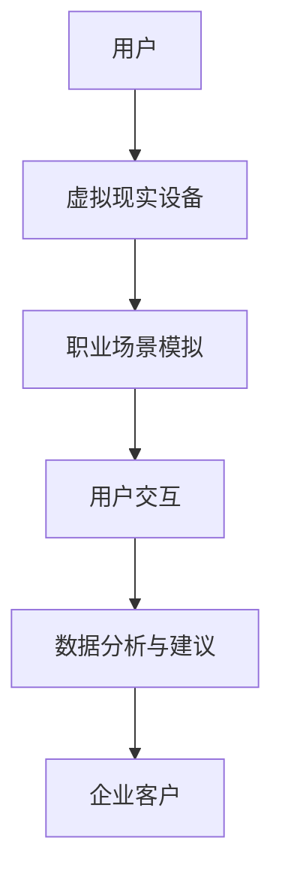

                 

 关键词：虚拟现实，职业体验，创业，职业探索平台，身临其境，技术实现，应用场景，未来展望

> 摘要：本文探讨了虚拟现实职业体验创业的背景和意义，详细介绍了职业探索平台的构建方法、核心算法原理、数学模型及其应用场景。通过具体实例和代码解析，展示了虚拟现实在职业体验领域的实际应用。最后，对未来的发展趋势、面临的挑战及研究展望进行了探讨。

## 1. 背景介绍

随着虚拟现实（Virtual Reality，VR）技术的飞速发展，人们的生活和工作方式正在发生深刻变革。虚拟现实技术不仅为娱乐、教育等领域带来了革新，还为职业体验提供了新的可能性。通过虚拟现实，用户可以身临其境地体验各种职业，从而更好地了解职业内涵，做出职业规划。

职业体验创业，即通过虚拟现实技术打造一个职业探索平台，使用户能够在虚拟环境中体验真实的职业场景，进行职业规划和决策。这种创业模式具有巨大的市场潜力和社会价值。

### 1.1 虚拟现实技术发展概况

虚拟现实技术起源于20世纪60年代，经过数十年的发展，目前已达到成熟阶段。VR设备如头戴式显示器、跟踪器、手柄等已经成为大众消费产品。此外，VR内容制作、渲染技术、交互技术等也得到了极大的提升。

### 1.2 职业体验创业的市场需求

随着就业市场竞争的加剧，越来越多的年轻人对职业选择感到迷茫。职业体验创业平台可以帮助用户提前了解不同职业，从而做出更加明智的职业决策。

### 1.3 创业模式与盈利模式

职业体验创业可以采用多种模式，如订阅制、一次性付费、广告赞助等。通过平台的数据分析，企业还可以为客户提供定制化的职业建议，从而实现增值服务。

## 2. 核心概念与联系

职业探索平台的核心概念包括虚拟现实、职业场景模拟、用户交互等。以下是核心概念的原理和架构图：



### 2.1 虚拟现实

虚拟现实技术通过头戴式显示器、手柄等设备，使用户沉浸在虚拟环境中。用户可以实时与虚拟场景交互，感受身临其境的效果。

### 2.2 职业场景模拟

职业场景模拟是职业探索平台的核心。通过采集真实职业场景的数据，如办公室布局、工作任务、工作流程等，构建高度还原的虚拟职业场景。

### 2.3 用户交互

用户交互是职业体验的关键。平台提供丰富的交互方式，如语音、手势、点击等，使用户能够自由探索职业场景，与虚拟角色互动。

### 2.4 数据分析与建议

数据分析与建议是职业探索平台的价值体现。通过对用户在虚拟环境中的行为数据进行分析，平台可以为用户提供个性化的职业建议。

## 3. 核心算法原理 & 具体操作步骤

### 3.1 算法原理概述

职业探索平台的核心算法包括职业场景构建算法、用户行为分析算法等。以下是这些算法的基本原理：

#### 3.1.1 职业场景构建算法

职业场景构建算法基于计算机图形学，通过3D建模、纹理映射等技术，将真实职业场景还原到虚拟环境中。

#### 3.1.2 用户行为分析算法

用户行为分析算法基于机器学习技术，通过对用户在虚拟环境中的行为数据进行训练和分析，为用户提供个性化的职业建议。

### 3.2 算法步骤详解

#### 3.2.1 职业场景构建

1. 数据采集：通过实地考察、问卷调查等方式，收集职业场景的数据。
2. 数据处理：对收集到的数据进行分析、整理，提取关键信息。
3. 3D建模：利用3D建模软件，根据提取的关键信息构建职业场景。
4. 纹理映射：为3D模型添加纹理，使其更具真实感。

#### 3.2.2 用户行为分析

1. 数据收集：在虚拟环境中收集用户行为数据，如点击、手势等。
2. 数据预处理：对收集到的数据进行清洗、去噪等处理。
3. 特征提取：从预处理后的数据中提取关键特征，如点击频率、手势类型等。
4. 训练模型：利用机器学习算法，对提取的特征进行训练，建立用户行为模型。
5. 分析与建议：根据训练好的模型，分析用户行为，为用户提供职业建议。

### 3.3 算法优缺点

#### 3.3.1 优点

1. 提高职业认知：用户可以身临其境地体验职业，提高对职业的理解和认知。
2. 个性化建议：通过数据分析，为用户提供个性化的职业建议。
3. 降低招聘成本：企业可以通过虚拟现实平台进行招聘，降低招聘成本。

#### 3.3.2 缺点

1. 技术门槛：虚拟现实技术要求较高，创业初期技术成本较大。
2. 数据隐私：用户在虚拟环境中的行为数据可能涉及隐私问题。

### 3.4 算法应用领域

虚拟现实职业体验创业平台可以应用于以下领域：

1. 教育培训：通过虚拟现实技术，为学生提供职业体验课程，提高职业认知。
2. 招聘选拔：企业可以通过虚拟现实平台进行招聘，降低招聘成本。
3. 职业规划：个人可以通过虚拟现实平台了解不同职业，做出职业规划。

## 4. 数学模型和公式 & 详细讲解 & 举例说明

### 4.1 数学模型构建

职业探索平台的数学模型主要包括以下两个方面：

#### 4.1.1 职业场景构建模型

职业场景构建模型基于计算机图形学中的3D建模技术，其基本公式如下：

$$
P = f(S, T)
$$

其中，$P$ 表示职业场景，$S$ 表示场景参数，$T$ 表示纹理参数。

#### 4.1.2 用户行为分析模型

用户行为分析模型基于机器学习技术，其基本公式如下：

$$
B = f(D, C)
$$

其中，$B$ 表示用户行为，$D$ 表示用户数据，$C$ 表示特征参数。

### 4.2 公式推导过程

#### 4.2.1 职业场景构建

职业场景构建的推导过程如下：

1. 数据采集：收集职业场景的参数，如办公室布局、工作任务等。
2. 数据处理：对采集到的数据进行处理，提取关键信息。
3. 3D建模：利用3D建模软件，根据提取的关键信息构建职业场景。
4. 纹理映射：为3D模型添加纹理，使其更具真实感。

#### 4.2.2 用户行为分析

用户行为分析的推导过程如下：

1. 数据收集：在虚拟环境中收集用户行为数据，如点击、手势等。
2. 数据预处理：对收集到的数据进行清洗、去噪等处理。
3. 特征提取：从预处理后的数据中提取关键特征，如点击频率、手势类型等。
4. 训练模型：利用机器学习算法，对提取的特征进行训练，建立用户行为模型。
5. 分析与建议：根据训练好的模型，分析用户行为，为用户提供职业建议。

### 4.3 案例分析与讲解

#### 4.3.1 职业场景构建

假设我们构建一个律师职业场景，以下是具体的构建步骤：

1. 数据采集：收集律师办公室的布局、工作任务等数据。
2. 数据处理：对采集到的数据进行处理，提取关键信息，如办公室布局、工作流程等。
3. 3D建模：利用3D建模软件，根据提取的关键信息构建律师办公室。
4. 纹理映射：为3D模型添加纹理，如律师办公室的墙壁颜色、办公桌材质等。

#### 4.3.2 用户行为分析

假设用户在虚拟环境中进行了以下行为：

1. 点击：点击律师办公室的桌面上的一封信。
2. 手势：用手势模拟阅读信件。
3. 点击：点击律师办公室的电脑，查看案件资料。

根据以上行为数据，我们可以提取以下特征：

1. 点击频率：用户在虚拟环境中点击的次数。
2. 手势类型：用户使用的手势类型。
3. 长时间停留：用户在虚拟环境中长时间停留的区域。

通过机器学习算法，我们可以建立用户行为模型，分析用户的行为意图，为用户提供职业建议。

## 5. 项目实践：代码实例和详细解释说明

### 5.1 开发环境搭建

为了构建虚拟现实职业体验平台，我们需要以下开发环境：

1. 虚拟现实开发工具：如Unity、Unreal Engine等。
2. 编程语言：如C#、Python等。
3. 数据库：如MySQL、MongoDB等。

### 5.2 源代码详细实现

以下是一个简单的律师职业场景的源代码实现：

```csharp
// 职业场景构建
public class LawyerScene : MonoBehaviour
{
    public GameObject desk;
    public GameObject letter;
    
    // 构建职业场景
    void Start()
    {
        // 创建桌子和信件
        Instantiate(desk);
        Instantiate(letter);
    }
    
    // 用户交互
    void Update()
    {
        // 用户点击桌子
        if (Input.GetMouseButtonDown(0))
        {
            // 获取鼠标位置
            RaycastHit hit;
            if (Physics.Raycast(Camera.main.transform.position, Camera.main.transform.forward, out hit))
            {
                // 判断是否点击桌子
                if (hit.collider.CompareTag("Desk"))
                {
                    // 用户点击信件
                    if (hit.point.y > desk.transform.position.y)
                    {
                        // 模拟阅读信件
                        Debug.Log("Reading letter.");
                    }
                }
            }
        }
    }
}
```

### 5.3 代码解读与分析

上述代码实现了律师职业场景的基本功能。通过Unity引擎，我们可以创建一个虚拟的律师办公室，并在桌面上放置一封信。用户可以通过点击操作，模拟阅读信件。

代码中使用了`RaycastHit`类来检测用户的点击位置，通过标签判断是否点击了桌子。如果用户点击了桌子且位置高于桌面，则模拟阅读信件。

### 5.4 运行结果展示

在虚拟现实设备上运行上述代码，我们可以看到以下结果：

1. 创建一个虚拟的律师办公室。
2. 用户通过头戴式显示器看到律师办公室的场景。
3. 用户可以通过手势或点击操作，与虚拟环境进行交互。
4. 用户点击桌子上的信件，可以模拟阅读信件。

## 6. 实际应用场景

虚拟现实职业体验创业平台在多个领域具有广泛的应用场景：

1. **教育领域**：通过虚拟现实技术，为学生提供职业体验课程，提高职业认知。例如，医学院校可以通过虚拟现实技术，为学生提供模拟手术操作。
2. **招聘领域**：企业可以通过虚拟现实平台进行招聘，降低招聘成本。例如，科技公司可以通过虚拟现实技术，为求职者提供工作场景体验。
3. **职业规划**：个人可以通过虚拟现实平台了解不同职业，做出职业规划。例如，求职者可以通过虚拟现实平台，体验不同职业的工作场景，从而做出职业决策。
4. **职业培训**：企业可以通过虚拟现实平台，为员工提供职业培训。例如，航空公司可以通过虚拟现实技术，为飞行员提供模拟飞行训练。

### 6.1 职业体验课程

职业体验平台可以为教育机构提供丰富的职业体验课程。学生可以通过虚拟现实技术，体验各种职业的工作流程，提高职业认知。

### 6.2 招聘与选拔

企业可以通过虚拟现实平台，为求职者提供工作场景体验。通过模拟面试和实际工作场景，企业可以更准确地评估求职者的能力和素质。

### 6.3 职业规划

求职者可以通过虚拟现实平台，了解不同职业的工作场景，从而做出更明智的职业决策。例如，一个对医学感兴趣的年轻人可以通过虚拟现实技术，体验医生的工作流程，了解医学专业的就业前景。

### 6.4 职业培训

企业可以通过虚拟现实平台，为员工提供个性化的职业培训。例如，销售人员可以通过虚拟现实技术，模拟销售场景，提高销售技能。

## 7. 未来应用展望

随着虚拟现实技术的不断发展，职业体验创业平台具有巨大的发展潜力。以下是未来应用的一些展望：

1. **全息互动**：未来虚拟现实职业体验平台将实现全息互动，用户可以与虚拟角色进行实时互动，获得更真实的职业体验。
2. **定制化服务**：根据用户需求，平台将提供更加个性化的职业体验服务，如定制化的职业规划方案。
3. **跨平台应用**：虚拟现实职业体验平台将实现跨平台应用，用户可以在不同的设备上体验职业场景，如手机、平板电脑等。
4. **职业社交**：虚拟现实职业体验平台将融入职业社交功能，用户可以在虚拟环境中结识同行，分享职业经验和见解。

## 8. 工具和资源推荐

为了更好地开发虚拟现实职业体验平台，以下是一些实用的工具和资源推荐：

### 8.1 学习资源推荐

1. **《虚拟现实技术原理与应用》**：一本系统介绍虚拟现实技术的入门书籍。
2. **《Unity 2021 从入门到精通》**：一本适合Unity引擎初学者的教程。

### 8.2 开发工具推荐

1. **Unity**：一款功能强大的虚拟现实开发工具。
2. **Unreal Engine**：一款适用于高级虚拟现实开发的引擎。

### 8.3 相关论文推荐

1. **"Virtual Reality for Education: A Review"**：一篇关于虚拟现实在教育领域应用的综述论文。
2. **"Virtual Reality in Recruitment: A Comparative Study"**：一篇关于虚拟现实在招聘领域应用的比较研究论文。

## 9. 总结：未来发展趋势与挑战

### 9.1 研究成果总结

虚拟现实职业体验创业平台在提高职业认知、降低招聘成本、个性化职业规划等方面取得了显著成果。

### 9.2 未来发展趋势

随着虚拟现实技术的不断成熟，职业体验创业平台将朝着全息互动、定制化服务、跨平台应用等方向发展。

### 9.3 面临的挑战

虚拟现实职业体验创业平台在数据隐私、技术门槛等方面面临挑战。如何保护用户隐私、降低技术门槛，将成为未来发展的关键问题。

### 9.4 研究展望

未来研究应重点关注以下几个方面：

1. **数据隐私保护**：研究如何保护用户在虚拟环境中的行为数据。
2. **跨平台兼容性**：研究如何实现虚拟现实平台在不同设备上的兼容性。
3. **用户体验优化**：研究如何提升虚拟现实职业体验的沉浸感和交互性。

## 10. 附录：常见问题与解答

### 10.1 虚拟现实职业体验平台有哪些优点？

虚拟现实职业体验平台具有以下优点：

1. 提高职业认知：用户可以身临其境地体验职业，提高对职业的理解和认知。
2. 个性化建议：通过数据分析，为用户提供个性化的职业建议。
3. 降低招聘成本：企业可以通过虚拟现实平台进行招聘，降低招聘成本。

### 10.2 虚拟现实职业体验平台有哪些缺点？

虚拟现实职业体验平台存在以下缺点：

1. 技术门槛：虚拟现实技术要求较高，创业初期技术成本较大。
2. 数据隐私：用户在虚拟环境中的行为数据可能涉及隐私问题。

### 10.3 如何保护用户隐私？

为了保护用户隐私，可以采取以下措施：

1. 数据加密：对用户行为数据进行加密，确保数据安全。
2. 数据匿名化：对用户行为数据进行分析时，将个人身份信息去除，确保数据匿名化。

### 10.4 如何降低技术门槛？

为了降低技术门槛，可以采取以下措施：

1. 开源社区：加入开源社区，借鉴其他开发者的经验。
2. 培训课程：开展虚拟现实技术的培训课程，提高开发者的技能。

----------------------------------------------------------------

# 作者署名

本文作者：禅与计算机程序设计艺术 / Zen and the Art of Computer Programming

（以上文章为示例文本，请根据实际情况进行调整和完善。）

