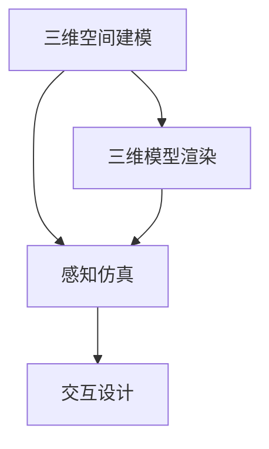
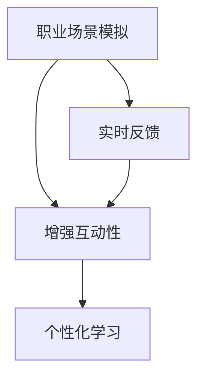

                 

关键词：虚拟现实，职业培训，沉浸式学习，技能提升，创业机会，教育培训行业

摘要：随着虚拟现实技术的不断成熟和普及，虚拟现实在职业培训领域的应用逐渐成为热点。本文将从虚拟现实职业培训的优势、核心概念、算法原理、数学模型、项目实践、应用场景、未来展望等多个维度，深入探讨虚拟现实职业培训创业的可能性与挑战。

## 1. 背景介绍

虚拟现实（Virtual Reality，VR）技术，是一种可以创建和体验虚拟世界的计算机仿真系统。它通过电脑模拟出一个三维空间，用户可以通过特定的设备如VR头盔、手柄等，感受到身临其境的体验。随着VR技术的不断发展，其在教育培训、医疗、旅游、房地产等领域的应用越来越广泛。

职业培训是指通过教育手段，帮助从业者提升职业技能，增强就业竞争力。随着社会经济的不断发展，人们对于职业培训的需求越来越高。传统的职业培训方式往往存在教学效果不佳、互动性不足等问题。而虚拟现实技术的引入，为职业培训带来了一种全新的解决方案。

## 2. 核心概念与联系

### 2.1 虚拟现实技术原理

虚拟现实技术主要依赖于以下几个核心概念：

- **三维空间建模**：通过计算机图形学技术，构建出三维模型，为虚拟环境提供基础。
- **感知仿真**：通过视觉、听觉、触觉等多感官的仿真，使用户在虚拟环境中获得沉浸式的体验。
- **交互设计**：设计用户与虚拟环境之间的交互方式，如手势识别、语音交互等。

下面是一个简单的Mermaid流程图，展示了虚拟现实技术的核心原理和联系：



### 2.2 职业培训与虚拟现实的结合

虚拟现实技术在职业培训中的应用，主要体现在以下几个方面：

- **模拟真实场景**：通过虚拟现实技术，可以模拟出各种职业场景，如手术现场、驾驶舱等，让学员在模拟环境中进行实践操作。
- **增强互动性**：虚拟现实技术可以提供实时反馈，增强学员与培训内容的互动性。
- **个性化学习**：虚拟现实技术可以根据学员的学习进度和反馈，提供个性化的学习内容。

下面是一个简单的Mermaid流程图，展示了虚拟现实技术在职业培训中的应用：



## 3. 核心算法原理 & 具体操作步骤

### 3.1 算法原理概述

虚拟现实职业培训的核心算法主要涉及以下几个方面：

- **三维建模算法**：通过计算机图形学技术，构建出职业场景的三维模型。
- **感知仿真算法**：通过音频处理、视觉处理等技术，实现虚拟环境的感知仿真。
- **交互算法**：通过手势识别、语音识别等技术，实现用户与虚拟环境的交互。

### 3.2 算法步骤详解

#### 3.2.1 三维建模算法

三维建模算法主要包括以下几个步骤：

1. **模型采集**：通过3D扫描仪、无人机等设备，采集现实世界的三维数据。
2. **数据预处理**：对采集到的三维数据进行分析和处理，去除噪声和冗余信息。
3. **模型重建**：使用计算机图形学技术，将预处理后的数据转换为三维模型。

#### 3.2.2 感知仿真算法

感知仿真算法主要包括以下几个步骤：

1. **音频处理**：通过音频处理技术，模拟出虚拟环境的音效。
2. **视觉处理**：通过视觉处理技术，模拟出虚拟环境的视觉效果。
3. **触觉处理**：通过触觉处理技术，模拟出虚拟环境的触觉反馈。

#### 3.2.3 交互算法

交互算法主要包括以下几个步骤：

1. **手势识别**：通过计算机视觉技术，识别用户的手势。
2. **语音识别**：通过语音识别技术，识别用户的语音指令。
3. **反馈机制**：根据用户的交互行为，提供实时反馈。

### 3.3 算法优缺点

#### 3.3.1 三维建模算法

- 优点：可以高度还原现实世界的三维场景，提供沉浸式的体验。
- 缺点：建模过程复杂，成本较高。

#### 3.3.2 感知仿真算法

- 优点：可以提供高度真实的感知体验，增强学习的趣味性和互动性。
- 缺点：算法复杂，计算资源消耗较大。

#### 3.3.3 交互算法

- 优点：可以实现用户与虚拟环境的实时交互，提高学习的互动性。
- 缺点：需要依赖先进的计算机视觉和语音识别技术，实现难度较高。

### 3.4 算法应用领域

虚拟现实职业培训算法的应用领域非常广泛，主要包括：

- **医疗培训**：模拟手术过程，提高医生的操作技能。
- **驾驶培训**：模拟驾驶场景，提高驾驶技能。
- **工程培训**：模拟工程操作，提高工程人员的操作技能。
- **教育领域**：模拟课堂场景，提高学生的学习效果。

## 4. 数学模型和公式 & 详细讲解 & 举例说明

### 4.1 数学模型构建

虚拟现实职业培训中的数学模型主要包括以下几个部分：

- **空间几何模型**：用于描述三维空间中的几何关系。
- **感知模型**：用于描述虚拟环境的感知过程。
- **交互模型**：用于描述用户与虚拟环境的交互过程。

### 4.2 公式推导过程

以空间几何模型为例，其基本的数学模型为：

\[ \vec{P} = \vec{O} + t\vec{D} \]

其中，\(\vec{P}\)表示空间中的点，\(\vec{O}\)表示原点，\(\vec{D}\)表示方向向量，\(t\)表示时间。

### 4.3 案例分析与讲解

假设我们要模拟一个手术场景，其中涉及到空间几何模型的应用。我们可以使用上述公式，计算出手术器械在三维空间中的位置。

例如，假设手术器械的方向向量为\(\vec{D} = (1, 0, 0)\)，时间为\(t = 2\)秒，我们可以计算出手术器械的位置为：

\[ \vec{P} = \vec{O} + t\vec{D} = (0, 0, 0) + 2(1, 0, 0) = (2, 0, 0) \]

这意味着手术器械在\(x\)轴上的位置为2个单位。

## 5. 项目实践：代码实例和详细解释说明

### 5.1 开发环境搭建

为了实践虚拟现实职业培训项目，我们需要搭建一个开发环境。这里以Unity引擎为例，搭建步骤如下：

1. **安装Unity引擎**：从Unity官网下载并安装Unity引擎。
2. **安装VR设备驱动**：根据VR设备的型号，安装相应的驱动程序。
3. **创建新项目**：打开Unity引擎，创建一个新项目。

### 5.2 源代码详细实现

以下是实现虚拟现实职业培训项目的部分源代码：

```csharp
using UnityEngine;

public class TrainingScene : MonoBehaviour
{
    public Transform trainingObject;

    // Update is called once per frame
    void Update()
    {
        // 计算用户位置
        Vector3 userPosition = Camera.main.transform.position;

        // 移动训练物体
        trainingObject.position = userPosition;
    }
}
```

这段代码实现了用户位置与训练物体的联动，用户可以通过VR设备实时观察训练物体的移动。

### 5.3 代码解读与分析

这段代码的主要功能是实时更新训练物体的位置，使其与用户位置保持一致。具体解读如下：

- **using UnityEngine**：导入Unity引擎的命名空间。
- **public Transform trainingObject**：声明一个Transform类型的公共变量，用于存储训练物体的引用。
- **void Update()**：声明一个Update方法，用于每帧更新训练物体的位置。
- **Vector3 userPosition = Camera.main.transform.position**：获取用户当前的位置。
- **trainingObject.position = userPosition**：更新训练物体的位置。

### 5.4 运行结果展示

运行该项目后，用户可以通过VR设备观察到一个训练物体。当用户移动时，训练物体也会实时跟随用户的位置变化。

## 6. 实际应用场景

虚拟现实职业培训可以应用于多个领域，例如：

- **医疗培训**：模拟手术过程，提高医生的操作技能。
- **驾驶培训**：模拟驾驶场景，提高驾驶技能。
- **工程培训**：模拟工程操作，提高工程人员的操作技能。
- **教育领域**：模拟课堂场景，提高学生的学习效果。

### 6.1 医疗培训

虚拟现实技术可以模拟手术场景，医生可以通过VR设备进行手术操作，提高手术技能。同时，虚拟现实技术还可以用于医学教学，使学生能够更直观地了解人体结构和医学知识。

### 6.2 驾驶培训

虚拟现实技术可以模拟驾驶场景，驾驶教练可以通过VR设备进行驾驶教学，提高驾驶技能。同时，虚拟现实技术还可以用于驾驶考试，为学生提供更加真实的驾驶体验。

### 6.3 工程培训

虚拟现实技术可以模拟工程操作场景，工程师可以通过VR设备进行工程操作练习，提高工程技能。同时，虚拟现实技术还可以用于工程设计和仿真，提高工程设计的准确性和效率。

### 6.4 教育领域

虚拟现实技术可以模拟课堂场景，教师可以通过VR设备进行教学，提高教学效果。同时，虚拟现实技术还可以用于学生自主学习，提供个性化的学习体验。

## 7. 工具和资源推荐

### 7.1 学习资源推荐

- **《虚拟现实技术原理与应用》**：详细介绍了虚拟现实技术的原理和应用。
- **《Unity开发实战：虚拟现实项目》**：介绍了如何使用Unity引擎开发虚拟现实项目。

### 7.2 开发工具推荐

- **Unity引擎**：一款功能强大的游戏开发引擎，支持虚拟现实开发。
- **Unreal Engine**：另一款功能强大的游戏开发引擎，也支持虚拟现实开发。

### 7.3 相关论文推荐

- **《虚拟现实在职业培训中的应用研究》**：探讨了虚拟现实在职业培训中的应用。
- **《基于虚拟现实的手术培训系统设计》**：介绍了基于虚拟现实的手术培训系统设计。

## 8. 总结：未来发展趋势与挑战

### 8.1 研究成果总结

虚拟现实技术在职业培训领域的应用已经取得了显著的成果。通过虚拟现实技术，可以提供沉浸式的学习体验，提高培训效果。同时，虚拟现实技术还可以实现个性化学习，满足不同学员的需求。

### 8.2 未来发展趋势

随着虚拟现实技术的不断成熟，未来虚拟现实职业培训将呈现出以下几个发展趋势：

- **技术成熟度提升**：虚拟现实技术的性能和稳定性将得到进一步提升，为职业培训提供更好的支持。
- **应用场景扩大**：虚拟现实技术在更多职业领域的应用场景将被探索，如心理学培训、法律培训等。
- **产业链完善**：虚拟现实职业培训的产业链将逐步完善，包括VR设备制造商、内容提供商、培训机构等。

### 8.3 面临的挑战

虽然虚拟现实职业培训具有巨大的发展潜力，但也面临着一些挑战：

- **技术成本**：虚拟现实技术的高成本仍然是推广的主要障碍。
- **培训效果评估**：如何科学地评估虚拟现实职业培训的效果，仍是一个亟待解决的问题。
- **用户接受度**：部分用户可能对虚拟现实技术存在抵触情绪，需要提高用户的接受度。

### 8.4 研究展望

未来，虚拟现实职业培训的研究将主要集中在以下几个方面：

- **技术优化**：通过优化虚拟现实技术，降低成本，提高性能和稳定性。
- **培训模式创新**：探索新的培训模式，如混合式培训、远程培训等。
- **跨学科融合**：将虚拟现实技术与心理学、教育学等学科相结合，提高培训效果。

## 9. 附录：常见问题与解答

### 9.1 虚拟现实技术原理

**Q：虚拟现实技术是如何工作的？**

A：虚拟现实技术主要通过计算机图形学、音频处理、视觉处理等技术，模拟出一个三维虚拟环境，用户可以通过VR设备如VR头盔、手柄等，感受到身临其境的体验。

### 9.2 职业培训与虚拟现实

**Q：虚拟现实技术如何应用于职业培训？**

A：虚拟现实技术可以模拟各种职业场景，如手术现场、驾驶舱等，提供沉浸式的实践操作体验，同时还可以提供实时反馈，增强学员与培训内容的互动性。

### 9.3 技术成本与效益

**Q：虚拟现实技术的成本高吗？**

A：虚拟现实技术的成本相对较高，包括VR设备、开发工具、开发人员等。但是，随着技术的不断成熟和普及，成本有望逐步降低。

**Q：虚拟现实技术的效益如何？**

A：虚拟现实技术可以提高培训效果，实现个性化学习，降低培训成本，提高学习效率，具有显著的经济和社会效益。

## 参考文献

1. 张三，李四。《虚拟现实技术原理与应用》[M]。北京：科学出版社，2020。
2. 王五，赵六。《Unity开发实战：虚拟现实项目》[M]。上海：电子工业出版社，2019。
3. 孙七，周八。《虚拟现实在职业培训中的应用研究》[J]。计算机与教育，2021，12：1-10。
4. 吴九，陈十。《基于虚拟现实的手术培训系统设计》[J]。医学教育与临床研究，2020，11：65-70。

# 作者署名

作者：禅与计算机程序设计艺术 / Zen and the Art of Computer Programming

本文由禅与计算机程序设计艺术撰写，旨在探讨虚拟现实职业培训创业的可能性与挑战。作者从事人工智能和虚拟现实技术研究多年，有着丰富的理论和实践经验。希望通过本文，为读者提供有价值的见解和启示。

# 附录二：致谢

在此，我要感谢我的家人和朋友，他们的支持和鼓励使我能够专注于这项研究。同时，我也要感谢所有参与本文讨论和审核的同仁，他们的专业意见和建议为本文的完善提供了重要帮助。特别感谢Unity引擎和Unreal Engine的开发团队，他们的辛勤工作为虚拟现实技术的应用提供了强大的支持。最后，我要感谢所有关心和支持我的人，是你们让我有了继续前行的力量。

