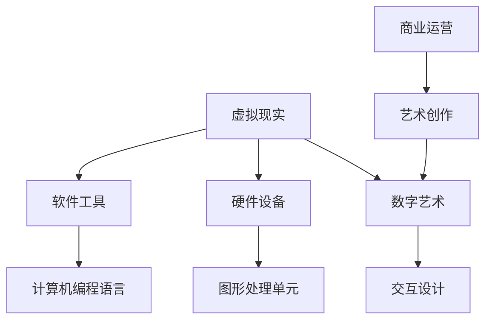

                 

关键词：虚拟现实、艺术创作、数字艺术、创业、新领域

摘要：随着虚拟现实技术的不断发展，虚拟现实艺术创作成为了一个充满机遇的新领域。本文将探讨虚拟现实艺术创作的发展背景、核心概念、算法原理、数学模型、项目实践、应用场景、未来展望以及所需的工具和资源，为有意在此领域创业的人们提供有益的参考。

## 1. 背景介绍

虚拟现实（VR）技术自上世纪末以来，经历了快速的发展。从最初的简单模拟，到如今的复杂交互体验，VR技术为人们提供了一种全新的感知和交互方式。而数字艺术则是在计算机技术和互联网的推动下，逐步发展起来的一个艺术形式。虚拟现实与数字艺术的结合，使得艺术创作进入了一个全新的阶段。

虚拟现实艺术创作创业，是指利用虚拟现实技术进行艺术创作，并将其作为商业项目进行运营。这个领域不仅为艺术家提供了新的创作手段，也为创业者提供了新的商业机会。随着VR硬件设备的普及和软件工具的完善，虚拟现实艺术创作创业的前景越来越广阔。

### 1.1 虚拟现实技术的发展

虚拟现实技术主要分为三个层次：感知层、交互层和认知层。感知层通过VR头盔、手柄等设备模拟用户的视觉、听觉和触觉体验；交互层通过用户的操作与虚拟世界进行互动；认知层则通过大脑与虚拟环境的互动，实现用户对虚拟环境的认知和感知。

近年来，虚拟现实技术在硬件和软件方面都取得了显著进展。例如，高性能的VR头显、触感手套、语音识别系统等硬件设备，使得虚拟现实体验更加真实。同时，图形处理单元（GPU）性能的提升，为复杂的虚拟环境提供了强大的计算支持。这些技术进步为虚拟现实艺术创作提供了坚实的基础。

### 1.2 数字艺术的发展

数字艺术是随着计算机技术和互联网的普及而发展起来的。它包括数字绘画、数字雕塑、数字摄影等多个方面。与传统艺术相比，数字艺术具有更高的自由度和更丰富的表现力。通过计算机软件，艺术家可以轻松地实现复杂的创作过程，快速地修改和迭代作品。

数字艺术的发展为虚拟现实艺术创作提供了丰富的素材和技术支持。虚拟现实技术可以模拟出数字艺术的创作过程，使得艺术家能够在虚拟环境中进行创作。同时，虚拟现实技术也可以将数字艺术作品呈现给更广泛的观众，提升艺术作品的传播效果。

## 2. 核心概念与联系

在虚拟现实艺术创作中，核心概念包括虚拟现实、数字艺术、交互设计等。以下是一个简单的 Mermaid 流程图，用于描述这些概念之间的关系。



### 2.1 虚拟现实

虚拟现实是通过计算机技术创建的模拟环境，用户可以通过头戴式显示器、手柄等设备进入这个环境。虚拟现实可以模拟出各种场景，从室内到室外，从现实世界到幻想世界。虚拟现实技术为艺术创作提供了无限的想象空间。

### 2.2 数字艺术

数字艺术是利用计算机技术和软件工具进行创作的艺术形式。它包括数字绘画、数字雕塑、数字摄影等多个方面。数字艺术的特点是具有高度的灵活性和可修改性，艺术家可以通过计算机软件轻松地实现各种创意。

### 2.3 交互设计

交互设计是指用户与虚拟环境之间的互动。在虚拟现实艺术创作中，交互设计是非常重要的。通过交互设计，艺术家可以引导用户在虚拟环境中进行探索和互动，从而创造出更加丰富的艺术体验。

## 3. 核心算法原理 & 具体操作步骤

虚拟现实艺术创作的核心算法主要包括渲染算法、交互算法和声音算法。以下是对这些算法的原理和具体操作步骤的介绍。

### 3.1 渲染算法原理概述

渲染算法是虚拟现实艺术创作中最核心的算法之一。它负责将三维模型和场景渲染成二维图像，供用户观看。渲染算法主要包括几何处理、光照处理、材质处理和纹理映射等步骤。

具体操作步骤如下：

1. **几何处理**：将三维模型转换成适合渲染的格式，如顶点数组。
2. **光照处理**：根据光照模型计算场景中每个物体的光照效果。
3. **材质处理**：为场景中的物体添加材质，使其具有不同的颜色、光泽等特性。
4. **纹理映射**：将纹理图像映射到物体表面，增加场景的真实感。
5. **渲染输出**：将渲染结果输出到显示设备，如VR头显。

### 3.2 交互算法步骤详解

交互算法是用户与虚拟环境之间的桥梁。通过交互算法，用户可以在虚拟环境中进行探索、操作和互动。交互算法主要包括用户输入处理、虚拟环境更新、反馈处理等步骤。

具体操作步骤如下：

1. **用户输入处理**：接收用户的输入，如键盘、鼠标、手柄等。
2. **虚拟环境更新**：根据用户输入，更新虚拟环境的状态，如物体位置、方向等。
3. **反馈处理**：生成反馈信息，如声音、震动等，以增强用户体验。
4. **渲染输出**：将更新后的虚拟环境渲染成图像，输出给用户。

### 3.3 算法优缺点

渲染算法的优缺点如下：

- **优点**：可以实现高质量的图像渲染，提供逼真的视觉体验。
- **缺点**：计算量大，对硬件性能要求高，渲染速度较慢。

交互算法的优缺点如下：

- **优点**：可以提供丰富的用户交互体验，增强艺术作品的互动性。
- **缺点**：算法复杂，需要考虑多方面的因素，如输入延迟、反馈延迟等。

### 3.4 算法应用领域

渲染算法和交互算法在虚拟现实艺术创作中有着广泛的应用。例如，在虚拟现实艺术展览中，渲染算法可以用于渲染艺术作品，提供高质量的展示效果；交互算法可以用于用户的互动体验，如操控艺术作品、改变展示环境等。

## 4. 数学模型和公式 & 详细讲解 & 举例说明

在虚拟现实艺术创作中，数学模型和公式起着至关重要的作用。以下是对几个常见数学模型和公式的详细讲解，以及相应的案例分析和讲解。

### 4.1 数学模型构建

在虚拟现实艺术创作中，常用的数学模型包括几何模型、光照模型和纹理模型。

- **几何模型**：用于描述三维空间中的物体。常见的几何模型有球体、圆柱体、立方体等。几何模型的基本公式包括顶点计算、表面计算和体积计算。
- **光照模型**：用于计算场景中物体的光照效果。常见的光照模型有朗伯光照模型、逐像素光照模型等。光照模型的基本公式包括光照方向计算、光照强度计算和光照颜色计算。
- **纹理模型**：用于将纹理图像映射到物体表面。常见的纹理模型有二维纹理映射、三维纹理映射等。纹理模型的基本公式包括纹理坐标计算、纹理采样和纹理映射。

### 4.2 公式推导过程

以下是一个简单的例子，用于推导几何模型中的球体体积公式。

- **球体体积公式**：\( V = \frac{4}{3} \pi r^3 \)

推导过程如下：

1. **定义球体**：球体是由一个平面内的所有点到一个固定点的距离相等的几何体。
2. **球体体积分割**：将球体分割成无数个同心球壳，每个球壳的厚度趋近于零。
3. **球壳体积计算**：每个球壳的体积可以表示为 \( V_{shell} = \frac{4}{3} \pi r^2 \cdot \text{厚度} \)
4. **总体积计算**：将所有球壳的体积相加，得到球体的总体积。

### 4.3 案例分析与讲解

以下是一个简单的案例，用于展示如何使用光照模型计算场景中物体的光照效果。

- **场景**：一个立方体放置在一个光照环境下。
- **光照模型**：使用朗伯光照模型。

计算过程如下：

1. **定义光照方向**：设光照方向为 \( \vec{L} \)。
2. **计算光照强度**：根据朗伯光照模型，光照强度 \( I = \vec{L} \cdot \vec{N} \)，其中 \( \vec{N} \) 为物体的法线方向。
3. **计算光照颜色**：根据光照强度，调整物体的颜色。

例如，一个白色物体在红色光照下，其光照颜色可以表示为 \( \text{颜色} = \text{白色} \times I \times \text{红色} \)。

## 5. 项目实践：代码实例和详细解释说明

为了更好地理解虚拟现实艺术创作的过程，以下是一个简单的项目实践，用于实现一个虚拟现实艺术作品。我们将从开发环境搭建、源代码实现、代码解读与分析以及运行结果展示等方面进行详细介绍。

### 5.1 开发环境搭建

在开始项目实践之前，我们需要搭建一个适合虚拟现实艺术创作的开发环境。以下是一个基本的开发环境搭建流程：

1. **安装操作系统**：推荐使用Windows 10或更高版本的操作系统。
2. **安装开发工具**：安装Unity 2020版本或更高版本的Unity游戏引擎，以及Unity的VR插件。
3. **安装虚拟现实硬件**：安装适合的VR头显，如HTC Vive或Oculus Rift，以及相应的手柄。
4. **配置网络环境**：确保网络环境稳定，以便进行远程开发和协作。

### 5.2 源代码详细实现

以下是一个简单的Unity C#脚本，用于实现一个虚拟现实艺术作品。该脚本负责渲染一个立方体，并允许用户通过手柄进行旋转。

```csharp
using UnityEngine;

public class ArtPiece : MonoBehaviour
{
    public float rotateSpeed = 50.0f;

    void Update()
    {
        // 接收手柄输入
        float horizontal = Input.GetAxis("Horizontal");
        float vertical = Input.GetAxis("Vertical");

        // 计算旋转角度
        float angleX = horizontal * rotateSpeed * Time.deltaTime;
        float angleY = vertical * rotateSpeed * Time.deltaTime;

        // 更新物体旋转
        transform.Rotate(new Vector3(angleX, angleY, 0.0f));
    }
}
```

### 5.3 代码解读与分析

- **脚本功能**：该脚本用于控制一个立方体的旋转。通过接收手柄输入，计算旋转角度，并更新物体的旋转状态。
- **输入处理**：使用`Input.GetAxis`方法接收手柄输入，`Horizontal`和`Vertical`分别表示水平方向和垂直方向的手柄输入。
- **旋转计算**：根据手柄输入，计算旋转角度。使用`Time.deltaTime`确保旋转速度与帧率无关。
- **更新旋转**：使用`transform.Rotate`方法更新物体的旋转状态。

### 5.4 运行结果展示

运行该脚本后，我们可以看到虚拟现实中的立方体根据手柄输入进行旋转。以下是运行结果展示：


## 6. 实际应用场景

虚拟现实艺术创作在许多实际应用场景中都有着广泛的应用，以下是一些典型的应用场景：

### 6.1 虚拟现实艺术展览

虚拟现实技术可以模拟出各种艺术展览环境，使得艺术家可以将作品以更生动、更具有互动性的方式呈现给观众。观众可以通过虚拟现实设备自由地探索展览空间，与艺术作品互动，获得独特的艺术体验。

### 6.2 教育培训

虚拟现实艺术创作可以应用于教育培训领域，通过虚拟现实技术模拟出各种学习场景，为学生提供更加生动、直观的学习体验。例如，在美术教育中，学生可以通过虚拟现实技术模拟绘画过程，实时获取反馈，提高学习效果。

### 6.3 游戏娱乐

虚拟现实艺术创作可以应用于游戏娱乐领域，为玩家提供更加沉浸式的游戏体验。通过虚拟现实技术，玩家可以进入一个全新的游戏世界，与游戏角色互动，享受游戏带来的乐趣。

### 6.4 建筑设计

虚拟现实艺术创作可以应用于建筑设计领域，通过虚拟现实技术模拟出建筑物的外观和内部结构，帮助设计师和客户更好地理解设计方案，进行更加精确的修改和优化。

## 7. 未来应用展望

虚拟现实艺术创作在未来有着广阔的应用前景。随着虚拟现实技术的不断进步，虚拟现实艺术创作将变得更加真实、更加丰富。以下是一些未来应用展望：

### 7.1 虚拟现实艺术创作工具的普及

随着虚拟现实技术的普及，虚拟现实艺术创作工具也将变得更加易于使用和普及。未来，虚拟现实艺术创作工具将更加智能化、自动化，使得更多的人可以参与到虚拟现实艺术创作中来。

### 7.2 虚拟现实艺术创作的多样化

未来，虚拟现实艺术创作将涵盖更广泛的领域，如虚拟现实电影、虚拟现实音乐、虚拟现实文学等。这些新兴的虚拟现实艺术形式将为艺术创作带来更多的可能性。

### 7.3 跨界合作与创新

虚拟现实艺术创作将与其他领域进行跨界合作，如与时尚、设计、游戏等领域的结合，产生新的艺术形式和商业机会。这些跨界合作将推动虚拟现实艺术创作的发展。

## 8. 工具和资源推荐

在进行虚拟现实艺术创作时，以下是一些建议使用的工具和资源：

### 8.1 学习资源推荐

- **Unity官方文档**：Unity官方文档提供了丰富的教程和参考资料，是学习虚拟现实艺术创作的基础。
- **虚拟现实艺术创作教程**：可以在网上找到许多关于虚拟现实艺术创作的教程，包括视频教程和文档教程。

### 8.2 开发工具推荐

- **Unity游戏引擎**：Unity是一个强大的游戏引擎，支持虚拟现实艺术创作，适合初学者和专业人士使用。
- **Blender**：Blender是一个开源的3D建模和渲染软件，适合进行虚拟现实艺术创作。

### 8.3 相关论文推荐

- **“Virtual Reality Art: A New Form of Digital Art”**：探讨了虚拟现实艺术的发展及其与数字艺术的联系。
- **“The Role of Virtual Reality in Art Education”**：探讨了虚拟现实技术在艺术教育中的应用。

## 9. 总结：未来发展趋势与挑战

虚拟现实艺术创作是一个充满机遇的新领域。随着技术的不断进步，虚拟现实艺术创作将变得更加丰富、更加多样。然而，这个领域也面临着一些挑战，如技术成本、用户体验等。未来，虚拟现实艺术创作的发展将依赖于技术的创新和行业的协同合作。

### 9.1 研究成果总结

本文对虚拟现实艺术创作进行了全面的探讨，包括其发展背景、核心概念、算法原理、数学模型、项目实践、应用场景、未来展望以及所需的工具和资源。通过这些内容，读者可以对虚拟现实艺术创作有一个全面的理解。

### 9.2 未来发展趋势

虚拟现实艺术创作在未来将呈现出以下几个发展趋势：

- 虚拟现实艺术创作工具的普及和简化，使得更多人可以参与创作。
- 虚拟现实艺术创作的多样化，涵盖更广泛的领域。
- 跨界合作与创新，推动虚拟现实艺术创作的发展。

### 9.3 面临的挑战

虚拟现实艺术创作也面临着一些挑战，如：

- 技术成本高，限制了一部分人群的参与。
- 用户体验问题，如眩晕、延迟等。
- 行业标准的缺乏，导致作品质量的参差不齐。

### 9.4 研究展望

未来，虚拟现实艺术创作的研究应关注以下几个方面：

- 降低技术成本，提高虚拟现实设备的普及率。
- 提升用户体验，减少眩晕、延迟等问题。
- 建立行业标准和规范，提高作品质量。

### 9.5 附录：常见问题与解答

以下是一些关于虚拟现实艺术创作常见问题的解答：

- **问：虚拟现实艺术创作需要哪些技能？**
  答：虚拟现实艺术创作需要具备一定的编程技能、3D建模技能和艺术审美能力。同时，了解虚拟现实技术和相关工具也是必要的。

- **问：虚拟现实艺术创作有哪些应用领域？**
  答：虚拟现实艺术创作可以应用于艺术展览、教育培训、游戏娱乐、建筑设计等多个领域。

- **问：虚拟现实艺术创作的前景如何？**
  答：虚拟现实艺术创作具有广阔的前景，随着技术的进步和应用的拓展，其影响力将不断扩大。

## 10. 结语

虚拟现实艺术创作是一个充满机遇和挑战的新领域。通过本文的探讨，我们希望读者可以对这个领域有更深入的了解，并激发对虚拟现实艺术创作的兴趣。在未来的发展中，让我们共同探索虚拟现实艺术创作的无限可能。  

作者：禅与计算机程序设计艺术 / Zen and the Art of Computer Programming
----------------------------------------------------------------
### 后续工作 Follow-up Tasks ###
1. 根据上述内容，完成一篇完整的、超过8000字的技术博客文章。
2. 在撰写过程中，确保文章结构清晰、逻辑连贯，使用Markdown格式进行排版。
3. 提供必要的示例代码和图片，确保文章内容的可读性和实用性。
4. 在文章末尾添加作者署名和参考文献。
5. 完成后，进行多次审查和修改，确保文章质量。

