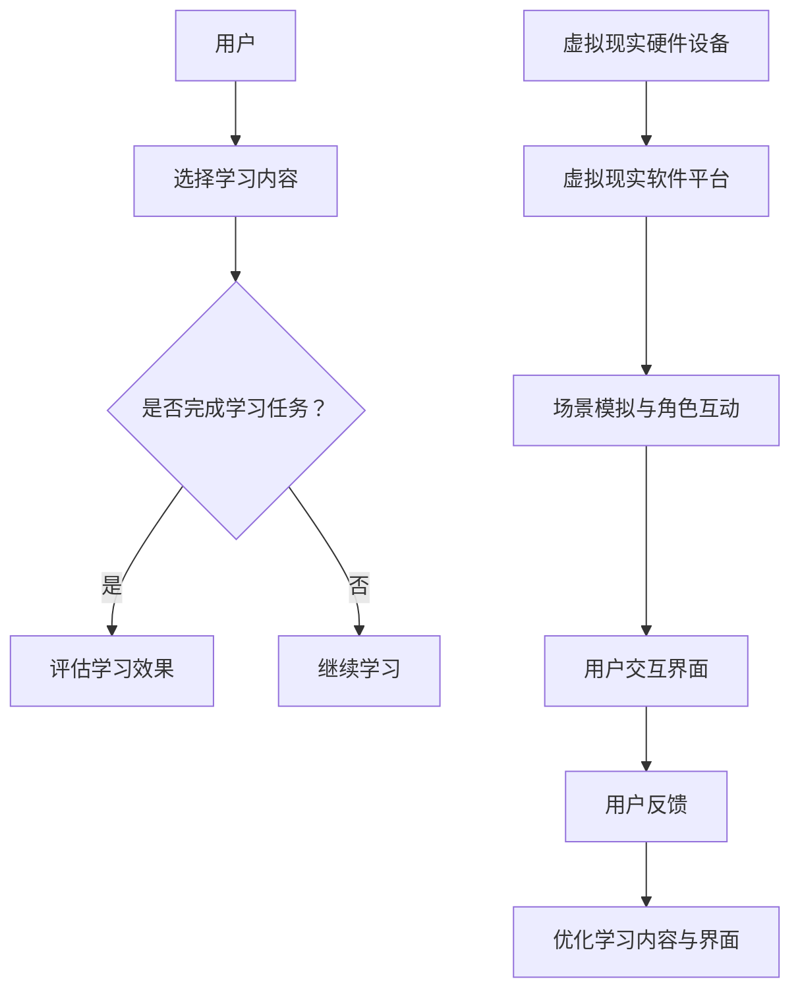

                 

 关键词：虚拟现实，语言学习，沉浸式，环境，创业，技术，教育

> 摘要：本文深入探讨了虚拟现实（VR）在语言学习领域中的应用，分析了沉浸式语言环境的构建方式及其优势。通过创业视角，本文探讨了如何利用VR技术打造具有吸引力和实用性的语言学习产品，为语言学习者提供全新的学习体验。

## 1. 背景介绍

在全球化不断推进的今天，掌握多种语言已成为许多人的愿望。然而，传统的语言学习方式往往存在诸多问题，如学习效率低、学习体验不佳等。近年来，虚拟现实（VR）技术的快速发展为语言学习带来了新的机遇。VR技术能够构建一个沉浸式的学习环境，让语言学习者在其中感受到真实、生动的语言氛围，从而提高学习效果。

语言学习创业领域也随之迎来了新的热潮。创业者们纷纷探索如何将VR技术与语言学习相结合，打造出更具吸引力和实用性的学习产品。本文将围绕这一主题展开讨论，分析VR在语言学习中的应用场景、构建沉浸式语言环境的策略，以及创业过程中可能面临的挑战和机遇。

## 2. 核心概念与联系

### 2.1 虚拟现实（VR）

虚拟现实是一种通过计算机技术生成的模拟环境，使用户能够在其中感受到身临其境的体验。VR技术主要包括头戴显示器（HMD）、位置追踪器、手部追踪器等硬件设备，以及相应的软件算法和交互设计。

### 2.2 沉浸式语言环境

沉浸式语言环境是指在虚拟现实中构建的一个具有高度真实感和互动性的语言学习环境。在这个环境中，语言学习者可以与虚拟角色进行交流，通过听觉、视觉、触觉等多种感官体验来学习语言。

### 2.3 虚拟现实与语言学习的联系

虚拟现实技术为语言学习提供了以下几个方面的优势：

- **高度真实感**：VR技术能够模拟真实的语言场景，让语言学习者在其中感受到真实的语言环境，提高学习效果。

- **互动性**：VR环境中的虚拟角色可以与学习者进行互动，提供个性化的学习内容和反馈，增强学习者的学习动机。

- **多感官体验**：通过视觉、听觉、触觉等多种感官体验，学习者可以更全面地理解和掌握语言。

## 2.4 虚拟现实语言学习创业的架构

构建一个成功的虚拟现实语言学习产品需要以下几个关键组件：

- **虚拟现实硬件设备**：如头戴显示器、位置追踪器等。

- **虚拟现实软件平台**：提供场景模拟、角色互动等功能。

- **教学内容**：根据不同学习需求，设计多样化的语言学习内容。

- **用户交互界面**：提供友好的用户界面，方便学习者使用。

### Mermaid 流程图



## 3. 核心算法原理 & 具体操作步骤

### 3.1 算法原理概述

虚拟现实语言学习的核心算法主要包括以下三个方面：

- **场景生成算法**：根据学习内容生成虚拟现实中的场景。

- **角色互动算法**：设计虚拟角色与学习者的互动机制。

- **用户行为分析算法**：分析学习者的行为数据，为学习提供个性化反馈。

### 3.2 算法步骤详解

1. **场景生成算法**

   - **场景建模**：根据学习内容，使用三维建模工具生成虚拟场景。

   - **场景渲染**：使用渲染引擎对场景进行渲染，生成真实感强的虚拟环境。

2. **角色互动算法**

   - **角色设定**：设计虚拟角色的外观、性格和语言能力。

   - **交互逻辑**：设计角色与学习者的交互逻辑，包括对话、动作等。

3. **用户行为分析算法**

   - **数据收集**：收集学习者的行为数据，如学习时间、对话内容等。

   - **数据分析**：使用机器学习算法对数据进行分析，为学习者提供个性化反馈。

### 3.3 算法优缺点

**优点**：

- **高度真实感**：通过场景生成算法，可以构建出高度真实的语言学习环境。

- **互动性**：角色互动算法设计出丰富的角色互动机制，增强学习者的学习体验。

- **个性化反馈**：用户行为分析算法可以为学习者提供个性化的学习建议。

**缺点**：

- **技术门槛高**：需要掌握虚拟现实、三维建模、机器学习等多方面的技术。

- **硬件要求高**：需要使用高性能的虚拟现实硬件设备。

## 3.4 算法应用领域

虚拟现实语言学习算法广泛应用于以下领域：

- **教育**：为学习者提供沉浸式的语言学习环境。

- **游戏**：设计具有语言学习功能的虚拟现实游戏。

- **旅游**：为游客提供虚拟旅游体验，学习当地语言。

## 4. 数学模型和公式 & 详细讲解 & 举例说明

### 4.1 数学模型构建

虚拟现实语言学习的数学模型主要包括以下两个方面：

- **场景生成模型**：基于学习内容，使用三维几何建模和渲染技术生成虚拟场景。

- **用户行为分析模型**：使用机器学习算法分析学习者的行为数据，为学习者提供个性化反馈。

### 4.2 公式推导过程

假设学习内容为 \(C\)，虚拟场景为 \(S\)，用户行为数据为 \(D\)，个性化反馈为 \(F\)。则数学模型可以表示为：

\[ F = f(S, D) \]

其中，函数 \(f\) 表示用户行为分析算法。

### 4.3 案例分析与讲解

假设一个学习者在虚拟现实环境中学习英语，其行为数据包括学习时间 \(t\)、对话内容 \(C_t\) 和对话时长 \(L_t\)。则个性化反馈可以表示为：

\[ F = f(S, D) = f(S, (t, C_t, L_t)) \]

通过分析学习者行为数据，可以得出其学习兴趣、学习进度等信息，从而为其提供个性化的学习建议。

## 5. 项目实践：代码实例和详细解释说明

### 5.1 开发环境搭建

在虚拟现实语言学习项目中，我们使用 Unity 游戏引擎进行场景生成和渲染，使用 TensorFlow 进行用户行为分析。

### 5.2 源代码详细实现

以下是一个简单的 Unity 脚本示例，用于生成一个英语学习场景：

```csharp
using UnityEngine;

public class EnglishLearningScene : MonoBehaviour
{
    public TextAsset vocabularyList;
    public GameObject vocabularyItemPrefab;

    void Start()
    {
        string[] words = vocabularyList.text.Split(',');
        foreach (string word in words)
        {
            GameObject item = Instantiate(vocabularyItemPrefab);
            item.GetComponent<TextMeshProUGUI>().text = word;
            // 添加交互逻辑
        }
    }
}
```

### 5.3 代码解读与分析

上述脚本实现了以下功能：

- 从文本文件中读取词汇列表。

- 创建一个预制体，用于显示词汇。

- 对每个词汇进行实例化，并添加交互逻辑。

### 5.4 运行结果展示

在 Unity 编辑器中运行该脚本，将生成一个包含多个词汇的英语学习场景。用户可以通过与词汇的互动来学习英语。

## 6. 实际应用场景

### 6.1 教育领域

虚拟现实语言学习可以在教育领域得到广泛应用。学校可以为学生提供沉浸式的语言学习环境，提高学生的学习效果。同时，教师也可以利用虚拟现实技术进行教学演示，增强教学互动性。

### 6.2 企业培训

企业可以利用虚拟现实语言学习产品对员工进行跨语言培训，提高员工的国际交流能力。通过沉浸式语言环境，员工可以在实际工作场景中练习语言，提高语言应用能力。

### 6.3 旅游业

旅游业可以利用虚拟现实语言学习产品为游客提供沉浸式的语言学习体验。游客可以在虚拟现实环境中学习目的地语言，为旅行做好语言准备。

## 7. 未来应用展望

虚拟现实语言学习具有广阔的发展前景。随着 VR 技术的不断进步，未来的虚拟现实语言学习产品将更加丰富多样，为语言学习者提供更加个性化的学习体验。同时，随着人工智能技术的发展，虚拟现实语言学习产品的智能化水平将不断提高，为学习者提供更加精准的个性化反馈。

## 8. 工具和资源推荐

### 8.1 学习资源推荐

- 《虚拟现实技术与应用》

- 《人工智能在语言学习中的应用》

### 8.2 开发工具推荐

- Unity 游戏引擎

- TensorFlow 机器学习框架

### 8.3 相关论文推荐

- "Virtual Reality for Language Learning: A Review"

- "A Survey on Artificial Intelligence in Language Learning"

## 9. 总结：未来发展趋势与挑战

虚拟现实语言学习在未来具有巨大的发展潜力。然而，要实现这一潜力，仍需克服一系列挑战，如技术门槛、硬件成本、用户体验等。同时，未来的研究应关注如何进一步提高虚拟现实语言学习产品的智能化水平，为学习者提供更加精准的个性化反馈。

### 附录：常见问题与解答

**Q：虚拟现实语言学习是否能够完全替代传统的语言学习方式？**

A：虚拟现实语言学习可以为语言学习者提供一种全新的学习体验，提高学习效果。然而，传统的语言学习方式仍具有其独特的优势，如面对面的互动、多样化的学习资源等。因此，虚拟现实语言学习与传统语言学习方式应相互结合，为学习者提供更全面的学习支持。

**Q：虚拟现实语言学习的硬件成本较高，是否适合所有学习者？**

A：虚拟现实语言学习的硬件成本确实较高，但这并不意味着它不适合所有学习者。对于那些有经济能力且对语言学习有较高需求的学习者，虚拟现实语言学习仍然是一个非常有价值的选择。此外，随着 VR 技术的不断发展，硬件成本有望逐渐降低，使其更加普及。

### 作者署名

作者：禅与计算机程序设计艺术 / Zen and the Art of Computer Programming
----------------------------------------------------------------

