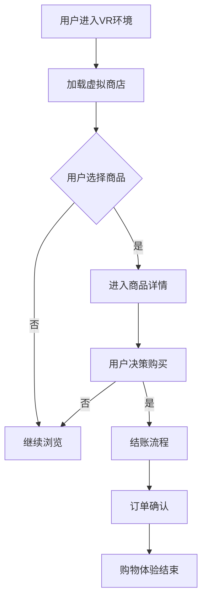

                 

关键词：虚拟现实，购物体验，创业，沉浸式技术，人机交互，AI，用户参与度

> 摘要：本文深入探讨虚拟现实技术在购物领域的应用，解析其如何通过沉浸式购物体验驱动创业。我们将分析VR技术的核心概念、人机交互机制、用户体验设计，并探讨其在提升用户参与度、增强购物决策中的作用。文章还将探讨当前VR购物创业面临的挑战及未来发展趋势。

## 1. 背景介绍

在数字时代，电子商务已经成为人们日常生活中不可或缺的一部分。随着互联网技术的发展，消费者对购物体验的需求也日益多样化。传统电商的平面展示和有限互动性已经无法满足日益增长的个性化需求。虚拟现实（Virtual Reality，VR）技术的崛起为商家提供了一个全新的展示和互动平台，使得消费者能够在虚拟环境中体验购物，从而提升了购物体验的沉浸感和互动性。

虚拟现实技术不仅提供了一种全新的购物方式，也为创业者带来了新的商机。在VR购物体验中，消费者可以置身于一个完全虚拟的环境，感受商品的细节、材质、色彩和动态效果，如同亲身经历。这种沉浸式的购物体验不仅提升了用户的参与度，还可以帮助用户更准确地做出购物决策。

近年来，随着硬件设备和网络技术的不断进步，VR技术逐渐走向成熟，并在多个行业得到应用。然而，在购物领域的应用仍然处于探索阶段。本文将分析VR购物创业的优势、挑战以及未来的发展趋势，为创业者提供有价值的参考。

## 2. 核心概念与联系

### 2.1 VR技术简介

虚拟现实（VR）是一种通过计算机模拟技术创造出的一种三维虚拟环境，用户可以通过特定的设备（如头戴式显示器、VR手套等）进入这个环境，并与之进行交互。VR技术的核心在于提供一种沉浸式体验，让用户感觉自己真的存在于一个虚拟世界中。

VR技术主要包括以下几个方面：

- **感知与交互**：用户通过视觉、听觉、触觉等多种感官感知虚拟环境，并通过手部动作、语音等与虚拟环境进行互动。
- **实时渲染**：通过计算机实时渲染出复杂的虚拟场景，确保用户在交互过程中能够获得流畅的视觉体验。
- **跟踪与定位**：通过传感器和定位技术，精确跟踪用户的动作和位置，确保虚拟环境与现实世界的同步。

### 2.2 人机交互机制

在VR购物体验中，人机交互是关键。VR技术通过多种交互方式提升了用户的参与度：

- **手势交互**：用户可以通过手部动作来操控虚拟环境，如抓取、放置商品等。
- **语音交互**：用户可以通过语音命令来查询商品信息、添加购物车等。
- **眼动追踪**：通过眼动传感器，系统可以记录用户的视线，实现更精准的交互。

这些交互方式不仅提供了直观的体验，还可以根据用户的反馈进行动态调整，从而提升用户体验。

### 2.3 用户体验设计

用户体验（UX）设计在VR购物中起着至关重要的作用。一个良好的UX设计应该：

- **直观易懂**：用户无需过多的学习即可理解如何使用VR购物系统。
- **情感共鸣**：通过设计创造情感共鸣，让用户在购物过程中感受到愉悦。
- **个性化定制**：根据用户的历史购物行为和偏好，提供个性化的推荐和服务。

为了实现这些目标，设计师需要深入了解用户的需求和心理，并通过用户调研和反馈进行不断的优化。

### 2.4 Mermaid 流程图

下面是一个简化的VR购物体验流程图，使用Mermaid语法绘制：



## 3. 核心算法原理 & 具体操作步骤

### 3.1 算法原理概述

VR购物体验的核心在于实时渲染和交互。具体而言，它涉及到以下几个核心算法：

- **三维模型渲染**：通过计算机图形学算法，实时渲染三维模型，包括商品的三维建模和场景的构建。
- **碰撞检测**：通过算法判断用户动作与虚拟环境中的物体之间的碰撞，确保交互的物理准确性。
- **用户追踪**：通过传感器和定位技术，实时追踪用户的动作和位置，实现虚拟环境与真实世界的同步。

### 3.2 算法步骤详解

1. **三维模型渲染**：
   - **几何建模**：使用三维建模软件创建商品的三维模型。
   - **纹理映射**：将图像纹理映射到三维模型上，增强视觉真实感。
   - **光照处理**：模拟真实世界中的光照效果，提升视觉效果。

2. **碰撞检测**：
   - **空间分割**：将虚拟环境划分为多个区域，减少计算量。
   - **OBB树**：使用OBB（AABB）树进行碰撞检测，提高效率。

3. **用户追踪**：
   - **传感器数据采集**：使用传感器（如头戴显示器中的摄像头、IMU传感器等）采集用户动作数据。
   - **滤波算法**：使用滤波算法（如卡尔曼滤波）处理传感器数据，减少噪声。
   - **轨迹预测**：根据历史数据和当前状态，预测用户的下一步动作。

### 3.3 算法优缺点

#### 优点：

- **沉浸感强**：通过三维模型和实时渲染，提供高度沉浸的购物体验。
- **交互性强**：多种交互方式（如手势、语音、眼动等）提升了用户的参与度。
- **个性化推荐**：基于用户行为和偏好，提供个性化的商品推荐。

#### 缺点：

- **技术门槛高**：需要复杂的算法和硬件支持，开发难度大。
- **计算资源消耗大**：实时渲染和用户追踪需要大量的计算资源。
- **用户体验一致性**：硬件设备的不同可能影响用户体验的一致性。

### 3.4 算法应用领域

VR购物算法主要应用于以下几个方面：

- **电子商务**：通过VR技术提升购物体验，增强用户购买意愿。
- **零售业**：在实体店中引入VR购物体验，提升顾客体验和销售额。
- **产品展示**：对于复杂的产品（如房产、汽车等），通过VR技术进行虚拟展示。

## 4. 数学模型和公式 & 详细讲解 & 举例说明

### 4.1 数学模型构建

在VR购物体验中，关键数学模型包括：

- **三维模型渲染**：涉及三维几何学、纹理映射和光照模型。
- **碰撞检测**：使用空间分割和OBB树进行高效检测。
- **用户追踪**：涉及传感器数据处理和轨迹预测。

### 4.2 公式推导过程

以下是三维模型渲染中的光照模型推导：

设物体表面点P的亮度L为：

$$ L = I_0 \cdot (\cos \theta \cdot \cos \phi + \cos \theta \cdot \cos \phi \cdot n) $$

其中，\( I_0 \)为光源强度，\( \theta \)和\( \phi \)分别为光源方向与表面法线方向之间的角度，\( n \)为表面法线方向。

### 4.3 案例分析与讲解

#### 案例一：三维模型渲染

假设我们使用三角形网格模型来渲染一个球体，球体的半径为\( r \)，我们需要计算每个三角形的顶点亮度。

1. **计算表面法线**：对于每个三角形顶点，计算其法线方向。
2. **光源方向**：定义一个光源方向向量\( L \)。
3. **计算亮度**：使用上述光照模型公式，计算每个三角形的亮度。
4. **纹理映射**：将纹理图像映射到三角形上，根据亮度调整纹理亮度。

#### 案例二：碰撞检测

假设使用OBB树进行碰撞检测，我们需要计算两个OBB盒的相交区域。

1. **计算OBB盒**：对于每个物体，计算其最小外接盒（OBB）。
2. **空间分割**：将虚拟环境分割为多个OBB区域。
3. **相交检测**：对于每个OBB区域，计算与其他OBB区域的相交情况。
4. **碰撞响应**：根据碰撞检测结果，调整物体位置和速度。

## 5. 项目实践：代码实例和详细解释说明

### 5.1 开发环境搭建

为了实现VR购物系统，我们需要搭建以下开发环境：

- **VR硬件**：VR头戴显示器（如Oculus Rift、HTC Vive）和手柄。
- **开发工具**：Unity引擎、Unreal Engine等。
- **编程语言**：C#、C++等。
- **依赖库**：如OpenVR、OpenXR等。

### 5.2 源代码详细实现

以下是使用Unity引擎实现的VR购物系统的主要代码部分：

```csharp
using UnityEngine;

public class VRShoppingSystem : MonoBehaviour
{
    public GameObject productPrefab;
    public Transform shoppingCart;

    private void Start()
    {
        LoadProducts();
    }

    private void LoadProducts()
    {
        // 从数据库加载商品信息
        foreach (var product in products)
        {
            GameObject obj = Instantiate(productPrefab, transform);
            obj.name = product.name;
            obj.GetComponent<MeshFilter>().mesh = product.mesh;
            obj.GetComponent<MeshRenderer>().material.mainTexture = product.texture;
        }
    }

    private void Update()
    {
        if (Input.GetKeyDown(KeyCode.Space))
        {
            AddToCart();
        }
    }

    private void AddToCart()
    {
        // 添加商品到购物车
        var product = FindObjectBy名字(productPrefab.name);
        if (product != null)
        {
            Instantiate(product, shoppingCart);
        }
    }

    private GameObject FindObjectBy名字(string name)
    {
        return GameObject.Find(name);
    }
}
```

### 5.3 代码解读与分析

这段代码是VR购物系统的基础，其主要功能是加载商品信息并实现添加商品到购物车的操作。

- **产品加载**：通过从数据库加载商品信息，创建产品对象并将其放置在场景中。
- **用户交互**：通过键盘或手柄输入，实现商品添加到购物车的操作。
- **购物车管理**：将添加到购物车的商品实例化到购物车对象下。

### 5.4 运行结果展示

在Unity引擎中运行该系统，用户可以看到虚拟商店中的商品，并通过手柄或键盘将其添加到购物车。该系统提供了一个基础的VR购物体验，但实际应用中还需要添加更多的功能和优化，如用户追踪、语音交互、实时渲染等。

## 6. 实际应用场景

### 6.1 零售业

虚拟现实技术已经在零售业中得到广泛应用。例如，许多服装品牌已经开始使用VR技术进行虚拟试衣，消费者可以在虚拟环境中试穿衣服，从而减少实际试穿的次数。这种体验不仅提升了用户的购物体验，还可以帮助商家减少库存成本。

### 6.2 房产销售

在房产销售领域，VR技术可以提供沉浸式的看房体验。用户可以通过VR设备游览虚拟的房产模型，感受房屋的布局、装修风格和光照效果。这种体验有助于提升房产的销售效率，特别是在无法亲自看房的场景中。

### 6.3 教育培训

VR购物体验还可以应用于教育培训领域。例如，医学教育中可以通过虚拟现实技术模拟手术过程，让医学生进行实践操作，提升其操作技能。此外，VR购物体验还可以用于销售培训，让销售人员体验不同的销售场景，提升销售技巧。

### 6.4 未来应用展望

随着技术的不断发展，VR购物体验有望在更多领域得到应用。未来，VR购物体验可能会进一步与人工智能技术结合，实现更加智能化的购物建议和推荐。此外，随着5G网络的普及，VR购物体验将变得更加流畅和真实。未来，VR购物体验有望成为电子商务的重要组成部分，为消费者提供全新的购物方式。

## 7. 工具和资源推荐

### 7.1 学习资源推荐

- **《虚拟现实技术原理与应用》**：详细介绍了VR技术的理论基础和应用实例。
- **《Unity 2021官方文档**：提供了丰富的Unity引擎使用教程和实例。
- **《虚拟现实购物体验设计**：探讨了VR购物体验的设计原则和实践方法。

### 7.2 开发工具推荐

- **Unity引擎**：一款功能强大的游戏和VR应用开发工具。
- **Unreal Engine**：一款高性能的VR应用开发引擎。
- **OpenVR**：用于开发VR应用的跨平台库。

### 7.3 相关论文推荐

- **“Virtual Reality in Retail: Enhancing Customer Experience”**：探讨了VR在零售业中的应用。
- **“An Overview of Virtual Reality Shopping Experiences”**：总结了当前VR购物体验的研究现状。

## 8. 总结：未来发展趋势与挑战

### 8.1 研究成果总结

虚拟现实技术在购物领域的应用已经取得了一系列成果。通过沉浸式的购物体验，消费者能够获得更加真实的购物感受，提升了购物决策的准确性。此外，VR技术还为零售业、房产销售和教育培训等领域带来了新的应用场景。

### 8.2 未来发展趋势

随着技术的不断进步，VR购物体验有望在更多领域得到应用。未来，VR购物体验将更加智能化，通过人工智能技术实现更加个性化的购物建议。此外，随着5G网络的普及，VR购物体验将变得更加流畅和真实。

### 8.3 面临的挑战

尽管VR购物体验具有巨大的潜力，但仍然面临一些挑战。首先，技术门槛较高，需要复杂的算法和硬件支持。其次，用户体验一致性差，不同硬件设备可能影响体验效果。此外，数据隐私和安全问题也是需要关注的重要方面。

### 8.4 研究展望

未来的研究应重点关注以下几个方面：

- **降低技术门槛**：通过简化算法和优化硬件，降低VR购物系统的开发难度。
- **提升用户体验**：通过研究人机交互机制，提升用户在VR购物环境中的舒适度和参与度。
- **数据隐私与安全**：研究有效的数据隐私保护机制，确保用户数据的安全。

## 9. 附录：常见问题与解答

### 问题1：VR购物体验的硬件设备有哪些？

**解答**：常见的VR购物体验硬件设备包括头戴式显示器（如Oculus Rift、HTC Vive）、手柄、VR手套、眼动传感器等。

### 问题2：如何确保VR购物体验的一致性？

**解答**：为了确保VR购物体验的一致性，可以从以下几个方面进行优化：

- **选择高性能硬件**：使用高性能的VR头戴显示器和手柄，确保流畅的交互体验。
- **优化算法**：通过优化碰撞检测和用户追踪算法，减少计算延迟和误差。
- **用户反馈**：通过用户反馈进行不断的优化和调整，确保体验的一致性。

### 问题3：VR购物体验中的数据隐私如何保护？

**解答**：在VR购物体验中，保护用户数据隐私非常重要。可以从以下几个方面进行数据隐私保护：

- **数据加密**：使用加密技术保护用户数据。
- **访问控制**：设置严格的访问控制机制，确保只有授权人员可以访问用户数据。
- **隐私政策**：明确告知用户数据收集和使用的目的，并取得用户同意。

---

**作者：禅与计算机程序设计艺术 / Zen and the Art of Computer Programming**

