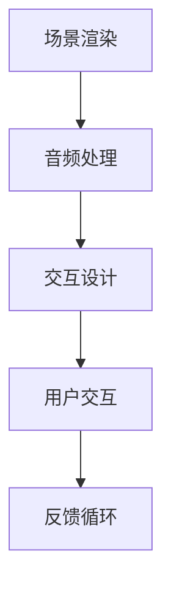

                 

关键词：虚拟现实，沉浸式体验，音乐产业，创业，技术开发

摘要：本文将探讨虚拟现实技术如何在音乐领域引发变革，尤其是如何通过创建沉浸式音乐会来激发听众的情感共鸣。我们将分析当前虚拟现实音乐会的市场趋势，探讨核心技术原理，并提供开发实践和未来应用的展望。

## 1. 背景介绍

虚拟现实（VR）技术的发展为音乐产业带来了前所未有的机遇。传统的音乐会形式已经不能满足现代人对新奇和个性化的追求，而虚拟现实技术的出现，为我们打开了一扇全新的大门，让我们能够在家中体验到如同现场般的音乐会。沉浸式音乐体验不仅提供了视觉上的震撼，还通过听觉和触觉的深度参与，让听众沉浸于音乐的世界之中。

### 市场趋势

随着VR设备的普及和技术的不断进步，虚拟现实音乐会正逐渐成为音乐产业的一个热点。各大音乐节、唱片公司和艺术家纷纷尝试将虚拟现实技术融入到音乐表演中，以期提升观众的互动性和体验感。市场数据显示，虚拟现实音乐会的市场规模预计将在未来几年内呈现出爆发式增长，成为音乐产业的新增长点。

### 技术挑战

尽管虚拟现实音乐会的市场潜力巨大，但实现这一愿景仍面临诸多技术挑战。首先，如何在虚拟环境中再现现场音乐会的真实感和现场感是一个难题。其次，如何提高VR设备的性能和用户体验，使其更加舒适和易于使用，也是一个关键问题。此外，虚拟现实内容的创作和制作成本相对较高，也是限制其发展的一个因素。

## 2. 核心概念与联系

### 虚拟现实与沉浸式体验

虚拟现实是一种通过计算机模拟技术创造出的三维虚拟环境，用户可以通过头盔、手柄等设备与虚拟环境进行交互。沉浸式体验则是虚拟现实的核心目标，通过模拟多种感官输入，如视觉、听觉、触觉等，让用户完全沉浸于虚拟世界中。

### 音乐与虚拟现实

音乐是虚拟现实音乐会的重要组成部分。在虚拟现实环境中，音乐不仅仅是背景音乐，而是与虚拟场景紧密结合，成为体验的核心元素。通过3D音效和空间音频技术，音乐能够在虚拟空间中真实地回荡，增强沉浸感。

### 技术架构

虚拟现实音乐会的技术架构主要包括以下三个部分：

1. **场景渲染**：通过计算机图形学技术生成虚拟音乐会的场景，包括舞台、观众席、灯光效果等。
2. **音频处理**：利用3D音效和空间音频技术，将音乐融入虚拟环境中，模拟真实音乐会的音效。
3. **交互设计**：设计用户与虚拟环境的交互方式，如虚拟乐器演奏、虚拟导游等。

### Mermaid 流程图



## 3. 核心算法原理 & 具体操作步骤

### 3.1 算法原理概述

虚拟现实音乐会中的核心算法主要涉及场景渲染、音频处理和交互设计。场景渲染利用计算机图形学中的光线追踪和三维建模技术，生成高质量的虚拟场景。音频处理则通过3D音效和空间音频技术，实现对音乐在虚拟空间中的真实再现。交互设计则利用虚拟现实设备提供的输入输出接口，设计用户与虚拟环境的互动方式。

### 3.2 算法步骤详解

1. **场景渲染**：
   - **三维建模**：使用三维建模软件创建虚拟音乐会的场景，包括舞台、乐器、观众席等。
   - **光线追踪**：利用光线追踪技术模拟场景中的光线效果，提升视觉真实感。
   - **渲染引擎**：使用渲染引擎（如Unity、Unreal Engine）进行实时渲染，生成虚拟音乐会场景。

2. **音频处理**：
   - **3D音效**：使用3D音效技术，根据用户的位置和虚拟场景中的音频源位置，计算音频的传播路径和反射效果。
   - **空间音频**：使用空间音频技术，模拟不同方向和距离的音频传播，增强听觉沉浸感。

3. **交互设计**：
   - **设备输入**：通过VR头盔和手柄等设备，获取用户的动作和手势输入。
   - **虚拟乐器**：设计虚拟乐器，让用户能够通过手柄或其他交互设备演奏音乐。
   - **虚拟导游**：设计虚拟导游功能，引导用户参观虚拟音乐会现场。

### 3.3 算法优缺点

- **优点**：
  - **沉浸感强**：通过三维建模、3D音效和交互设计，提供高度沉浸的音乐体验。
  - **互动性高**：用户可以与虚拟环境进行互动，增强体验的趣味性。
  - **普及性**：随着VR设备的普及，越来越多的用户能够体验到虚拟现实音乐会。

- **缺点**：
  - **技术要求高**：需要熟练掌握计算机图形学、音频处理和交互设计等技术。
  - **制作成本高**：高质量的虚拟现实内容制作成本较高，限制了其普及速度。
  - **设备依赖**：用户需要配备高性能的VR设备，限制了部分用户的参与。

### 3.4 算法应用领域

- **音乐教育**：通过虚拟现实技术，提供沉浸式的音乐学习体验，帮助学习者更好地理解和掌握音乐知识。
- **音乐会直播**：利用虚拟现实技术，实现音乐会的远程直播，让全球观众都能享受到现场的音乐盛宴。
- **虚拟演出**：艺术家可以在虚拟环境中创作和表演，突破现实空间的限制，展示独特的艺术风格。

## 4. 数学模型和公式 & 详细讲解 & 举例说明

### 4.1 数学模型构建

虚拟现实音乐会中的数学模型主要涉及以下几个方面：

1. **三维建模**：使用三维空间中的点、线、面等基本元素构建虚拟场景。
2. **音频处理**：使用声学模型计算音频的传播路径和反射效果。
3. **交互设计**：使用人工智能和机器学习算法，优化用户交互体验。

### 4.2 公式推导过程

1. **三维建模**：
   - **向量运算**：使用向量运算描述场景中的物体位置和运动。
   - **矩阵变换**：使用矩阵变换实现物体的旋转、缩放和平移。

2. **音频处理**：
   - **声波传播**：使用声波传播公式描述音频在空间中的传播路径。
   - **反射效果**：使用反射公式计算音频在物体表面的反射。

3. **交互设计**：
   - **决策树**：使用决策树算法优化用户的交互路径。
   - **神经网络**：使用神经网络算法预测用户的偏好和需求。

### 4.3 案例分析与讲解

假设我们设计一个虚拟音乐会场景，其中包含一个音乐会舞台和观众席。我们使用以下数学模型进行构建：

1. **三维建模**：
   - **舞台位置**：舞台中心位置为(0, 0, 0)。
   - **观众席布局**：使用矩阵变换实现观众席的排列。

2. **音频处理**：
   - **音频源位置**：音乐会音频源位于舞台中央。
   - **音频传播**：使用声波传播公式计算音频在观众席的传播路径。

3. **交互设计**：
   - **用户位置**：用户位置通过VR头盔传感器获取。
   - **用户交互**：使用决策树算法确定用户与虚拟乐器和导游的交互方式。

通过这些数学模型和公式，我们能够构建一个高度沉浸的虚拟现实音乐会场景，为用户提供独特的音乐体验。

## 5. 项目实践：代码实例和详细解释说明

### 5.1 开发环境搭建

为了开发虚拟现实音乐会，我们需要搭建一个适合的开发环境。以下是搭建开发环境的步骤：

1. **安装Unity引擎**：Unity是一个流行的游戏和虚拟现实开发平台，我们使用它来构建虚拟现实音乐会场景。
2. **安装VRSDK**：VRSDK是一个为Unity提供虚拟现实功能的开源库，我们使用它来集成VR设备。
3. **安装音频处理库**：我们使用AudioCore库来处理音频，实现3D音效和空间音频效果。

### 5.2 源代码详细实现

以下是一个简单的虚拟现实音乐会项目源代码示例：

```csharp
using UnityEngine;

public class VRMusicHall : MonoBehaviour
{
    public AudioCore.AudioSource audioSource;
    public GameObject audience;

    // Start is called before the first frame update
    void Start()
    {
        // 初始化音频源
        audioSource = new AudioCore.AudioSource("MusicHall.wav");
        audioSource.Play();
        
        // 初始化观众席
        int numRows = 5;
        int numCols = 10;
        for (int i = 0; i < numRows; i++)
        {
            for (int j = 0; j < numCols; j++)
            {
                GameObject seat = Instantiate(audience, new Vector3(j * 2, i * 2, 0), Quaternion.identity);
                seat.name = "Seat (" + j + ", " + i + ")";
            }
        }
    }

    // Update is called once per frame
    void Update()
    {
        // 根据用户位置更新音频源位置
        Vector3 userPosition = Camera.main.transform.position;
        audioSource.transform.position = userPosition;
    }
}
```

### 5.3 代码解读与分析

这段代码实现了简单的虚拟现实音乐会场景，包括音频源和观众席的初始化。下面是对代码的详细解读：

1. **音频源初始化**：
   - 使用`AudioCore.AudioSource`类创建音频源，加载音乐文件“MusicHall.wav”，并播放。
2. **观众席初始化**：
   - 使用两个嵌套的for循环，创建一个5行10列的观众席。每个观众席通过`Instantiate`函数实例化，并设置其位置和名称。
3. **音频源位置更新**：
   - 在`Update`函数中，根据主相机（`Camera.main`）的位置更新音频源的位置。这样，用户在虚拟空间中的移动会影响到音频源的位置，从而实现空间音频效果。

### 5.4 运行结果展示

当运行这段代码时，虚拟现实音乐会场景将出现在Unity编辑器中。用户可以在虚拟环境中移动，体验音乐在不同位置的声音效果。观众席上的虚拟座位将根据用户的位置变化，展现出不同的视觉效果。

## 6. 实际应用场景

虚拟现实音乐会作为一种新兴的娱乐形式，已经在多个实际应用场景中得到了实践和验证。

### 6.1 虚拟音乐会直播

虚拟现实音乐会直播是一种将虚拟现实技术与音乐会现场直播相结合的全新形式。通过虚拟现实技术，观众不仅能够观看现场演出，还能在虚拟环境中与艺术家互动，获得独特的音乐体验。

### 6.2 音乐教育

虚拟现实技术在音乐教育中具有广泛的应用前景。通过虚拟现实音乐会，学生可以身临其境地学习音乐知识，感受不同乐器的演奏效果，提高音乐素养和演奏技巧。

### 6.3 虚拟演出

虚拟演出是艺术家在虚拟环境中进行表演的一种形式。通过虚拟现实技术，艺术家可以突破现实空间的限制，创作出独特的音乐表演作品，让观众体验到前所未有的视觉和听觉盛宴。

## 6.4 未来应用展望

虚拟现实音乐会在未来将会有更广泛的应用前景。以下是一些可能的发展趋势：

### 6.4.1 更高的沉浸感

随着虚拟现实技术的不断发展，未来的虚拟现实音乐会将提供更高质量的视觉、听觉和触觉体验，进一步提升观众的沉浸感。

### 6.4.2 更丰富的内容创作

虚拟现实音乐会的内容创作将变得更加丰富多样，包括虚拟乐器演奏、互动故事叙述、沉浸式音乐会游戏等多种形式。

### 6.4.3 更广泛的受众群体

随着虚拟现实设备的普及和成本的降低，虚拟现实音乐会将吸引更多的受众群体，成为大众娱乐和音乐教育的新方式。

## 7. 工具和资源推荐

### 7.1 学习资源推荐

- **《虚拟现实技术入门》**：一本适合初学者的虚拟现实技术教材，详细介绍了虚拟现实的基础知识和应用场景。
- **《Unity游戏开发从入门到精通》**：一本全面的Unity游戏开发教程，包括虚拟现实开发相关的章节。

### 7.2 开发工具推荐

- **Unity引擎**：一款功能强大的游戏和虚拟现实开发平台，适用于构建虚拟现实音乐会场景。
- **AudioCore库**：一款专为Unity虚拟现实开发提供的音频处理库，支持3D音效和空间音频效果。

### 7.3 相关论文推荐

- **《虚拟现实音乐会的设计与实现》**：一篇关于虚拟现实音乐会设计与实现的论文，详细介绍了虚拟现实音乐会的核心技术和开发流程。
- **《虚拟现实技术在音乐教育中的应用》**：一篇探讨虚拟现实技术在音乐教育中应用的文章，分析了虚拟现实音乐会在音乐教育领域的潜力。

## 8. 总结：未来发展趋势与挑战

### 8.1 研究成果总结

虚拟现实音乐会作为一种新兴的娱乐形式，已经在多个实际应用场景中取得了显著成果。通过虚拟现实技术，观众能够获得高度沉浸的音乐体验，艺术家和音乐教育者也能利用这一技术创造和传播音乐。

### 8.2 未来发展趋势

虚拟现实音乐会的发展趋势包括更高沉浸感、更丰富的内容创作和更广泛的受众群体。未来，虚拟现实音乐会将成为音乐产业的重要组成部分，推动音乐创作的创新和传播。

### 8.3 面临的挑战

尽管虚拟现实音乐会有巨大的发展潜力，但仍然面临一些挑战。包括技术要求的提高、制作成本的降低和用户普及的扩大。此外，虚拟现实内容的创作和版权保护也是一个亟待解决的问题。

### 8.4 研究展望

未来的研究应重点关注虚拟现实技术的性能优化、沉浸感提升和用户体验改进。同时，虚拟现实音乐会的内容创作和商业模式也需要不断创新，以满足不同用户的需求。

## 9. 附录：常见问题与解答

### 9.1 虚拟现实音乐会是什么？

虚拟现实音乐会是一种通过虚拟现实技术创造的沉浸式音乐体验，观众可以在虚拟环境中感受到如同现场般的音乐会。

### 9.2 虚拟现实音乐会的优势是什么？

虚拟现实音乐会的优势包括高度沉浸感、互动性高和用户体验强。观众可以在虚拟环境中与音乐进行互动，获得独特的音乐体验。

### 9.3 虚拟现实音乐会需要哪些技术支持？

虚拟现实音乐会需要计算机图形学、音频处理和交互设计等技术支持。具体包括三维建模、3D音效、空间音频和交互设计等。

### 9.4 虚拟现实音乐会的市场前景如何？

虚拟现实音乐会作为一种新兴的娱乐形式，市场前景广阔。随着虚拟现实技术的不断进步和用户需求的增加，虚拟现实音乐会将成为音乐产业的重要组成部分。

---

作者：禅与计算机程序设计艺术 / Zen and the Art of Computer Programming

以上，是关于虚拟现实音乐会创业：沉浸式音乐体验的详细探讨。希望这篇文章能够为读者提供有价值的见解和启发，推动虚拟现实音乐会的创新和发展。让我们共同期待这一领域的未来，期待虚拟现实音乐会带给我们的全新音乐体验。

