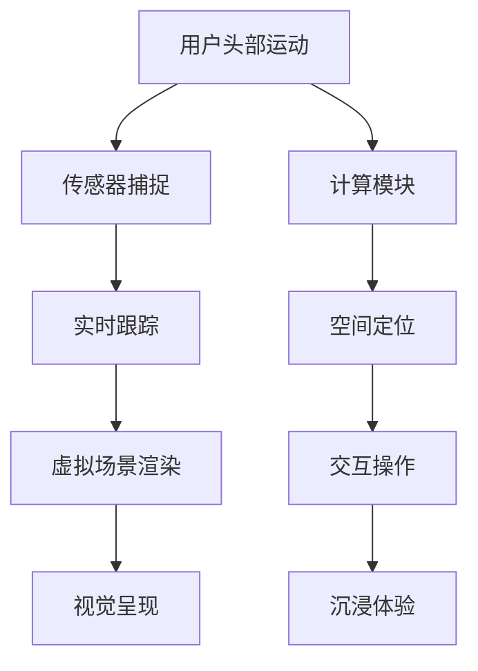

                 

关键词：虚拟现实（VR），Oculus Rift，SteamVR，体验，技术，发展

摘要：本文将探讨虚拟现实（VR）领域的两大重要设备——Oculus Rift 和 SteamVR。通过对这两种VR体验的详细介绍，我们将了解它们的技术原理、功能特点、应用场景以及未来的发展方向。同时，本文还将为读者提供实用的工具和资源推荐，帮助大家更好地掌握VR技术。

## 1. 背景介绍

虚拟现实（Virtual Reality，简称VR）是一种通过计算机技术创建的模拟环境，让用户在视觉、听觉、触觉等多方面感受到沉浸式的体验。随着科技的发展，VR技术逐渐应用于娱乐、教育、医疗、设计等多个领域，为人们带来了前所未有的交互体验。

在VR设备的发展历程中，Oculus Rift 和 SteamVR 无疑是两大重要里程碑。Oculus Rift 由Facebook旗下的Oculus公司开发，是首款商业化VR头戴设备，于2016年正式上市。而SteamVR则由Valve公司推出，是一款面向开发者与高端用户的VR平台，支持多种VR设备和内容。

本文旨在通过对Oculus Rift 和 SteamVR的详细解析，帮助读者了解VR技术的基本概念、发展趋势以及实际应用，为相关领域的开发者和研究者提供有价值的参考。

## 2. 核心概念与联系

### 2.1 虚拟现实技术原理

虚拟现实技术的核心在于创建一个模拟环境，让用户在视觉、听觉和触觉等多方面感受到沉浸式的体验。其基本原理包括：

- **光学原理**：通过头戴设备中的显示器或镜片，将虚拟场景呈现在用户眼前，实现视觉上的沉浸感。
- **传感器原理**：利用头戴设备内置的传感器（如陀螺仪、加速度计等），实时捕捉用户的头部运动，将虚拟场景进行相应调整，实现视点的动态变化。
- **交互原理**：通过手柄、手势识别等技术，实现用户与虚拟环境的交互，提高沉浸体验。

### 2.2 Oculus Rift 技术架构

Oculus Rift 的技术架构主要包括以下几个部分：

- **头戴显示器**：采用两块OLED屏幕，每块分辨率为1200x1080，刷新率高达90Hz，提供高清晰度和流畅的视觉体验。
- **传感器模块**：内置陀螺仪、加速度计和磁性传感器，实时捕捉用户头部运动，确保虚拟场景的同步跟踪。
- **无线传输**：支持无线传输，使用户在体验过程中不受线缆束缚。
- **计算模块**：搭载高通骁龙835处理器和英伟达Pascal架构GPU，提供强大的计算能力。

### 2.3 SteamVR 技术架构

SteamVR 的技术架构主要包括以下几个方面：

- **头戴显示器**：采用双OLED屏幕，分辨率高达2160x1200，刷新率高达120Hz，提供极致的视觉体验。
- **传感器模块**：支持多传感器融合，包括惯性测量单元（IMU）、光学追踪器和深度传感器，实现高精度的空间定位和跟踪。
- **计算模块**：搭载高性能的SteamVR跟踪器和PC主机，为用户提供稳定的运行环境。

### 2.4 Mermaid 流程图

以下是一个简化的Mermaid流程图，展示了VR技术的基本原理和Oculus Rift、SteamVR的技术架构：



## 3. 核心算法原理 & 具体操作步骤

### 3.1 算法原理概述

虚拟现实技术的核心在于实时渲染和空间定位。在Oculus Rift和SteamVR中，主要采用以下两种算法：

- **空间追踪算法**：通过传感器捕捉用户头部和手部运动，实时计算用户位置和姿态，实现虚拟场景的同步调整。
- **视觉渲染算法**：基于用户位置和姿态，实时渲染虚拟场景，确保视觉效果的平滑和流畅。

### 3.2 算法步骤详解

#### 3.2.1 空间追踪算法

1. **传感器数据采集**：利用头戴设备和手柄内置的传感器，实时采集用户头部和手部运动数据。
2. **传感器数据融合**：通过多传感器融合算法，将不同传感器的数据整合为一个统一的空间坐标系。
3. **空间位置计算**：根据用户头部和手部运动数据，实时计算用户的空间位置和姿态。
4. **虚拟场景同步**：根据用户位置和姿态，调整虚拟场景中的视点和观察角度，确保虚拟场景与用户实际运动同步。

#### 3.2.2 视觉渲染算法

1. **场景建模**：建立虚拟场景的三维模型，包括场景中的物体、角色等。
2. **相机参数设置**：根据用户位置和姿态，设置虚拟场景中的相机参数，如位置、角度、焦距等。
3. **光线追踪与渲染**：根据相机参数，对虚拟场景进行光线追踪和渲染，生成最终图像。
4. **图像显示**：将渲染后的图像呈现在头戴设备屏幕上，提供视觉体验。

### 3.3 算法优缺点

#### 3.3.1 空间追踪算法

- **优点**：实时性强，能准确捕捉用户运动，实现虚拟场景的同步调整。
- **缺点**：对传感器精度要求较高，受环境因素影响较大。

#### 3.3.2 视觉渲染算法

- **优点**：视觉效果逼真，能够提供沉浸式的体验。
- **缺点**：计算复杂度高，对硬件性能要求较高。

### 3.4 算法应用领域

虚拟现实技术的核心算法在娱乐、教育、医疗、设计等领域有广泛的应用：

- **娱乐领域**：虚拟现实游戏、影视、演唱会等。
- **教育领域**：虚拟课堂、虚拟实验室、在线教育等。
- **医疗领域**：远程手术、医学模拟、心理治疗等。
- **设计领域**：建筑可视化、工业设计、虚拟展览等。

## 4. 数学模型和公式 & 详细讲解 & 举例说明

### 4.1 数学模型构建

虚拟现实技术的核心算法涉及多个数学模型，主要包括：

- **空间追踪模型**：描述用户位置和姿态的变换关系。
- **视觉渲染模型**：描述虚拟场景的光线传播和渲染过程。
- **交互模型**：描述用户与虚拟环境的交互方式。

### 4.2 公式推导过程

#### 4.2.1 空间追踪模型

空间追踪模型主要涉及用户位置和姿态的计算。假设用户位置为\(P\)，姿态为\(Q\)，则空间追踪模型可以表示为：

$$
P_{new} = RQ P + T
$$

其中，\(R\)为旋转矩阵，\(Q\)为四元数，\(T\)为平移向量。

#### 4.2.2 视觉渲染模型

视觉渲染模型主要涉及虚拟场景的渲染过程。假设虚拟场景中的相机位置为\(C\)，角度为\(\theta\)，则视觉渲染模型可以表示为：

$$
I = f(C, \theta, S)
$$

其中，\(I\)为渲染后的图像，\(f\)为渲染函数，\(S\)为虚拟场景。

#### 4.2.3 交互模型

交互模型主要描述用户与虚拟环境的交互方式。假设用户输入为\(U\)，虚拟环境状态为\(S\)，则交互模型可以表示为：

$$
S_{new} = f(S, U)
$$

其中，\(f\)为交互函数。

### 4.3 案例分析与讲解

#### 4.3.1 空间追踪案例

假设用户位置为\(P = (1, 0, 0)\)，姿态为\(Q = (0, 0, 0)\)，旋转矩阵为\(R = \begin{pmatrix} 1 & 0 & 0 \\ 0 & 1 & 0 \\ 0 & 0 & 1 \end{pmatrix}\)，平移向量为\(T = (1, 0, 0)\)。根据空间追踪模型，计算新的用户位置：

$$
P_{new} = RQ P + T = \begin{pmatrix} 1 & 0 & 0 \\ 0 & 1 & 0 \\ 0 & 0 & 1 \end{pmatrix} \begin{pmatrix} 0 \\ 0 \\ 0 \end{pmatrix} + \begin{pmatrix} 1 \\ 0 \\ 0 \end{pmatrix} = \begin{pmatrix} 2 \\ 0 \\ 0 \end{pmatrix}
$$

新用户位置为\(P_{new} = (2, 0, 0)\)。

#### 4.3.2 视觉渲染案例

假设虚拟场景中的相机位置为\(C = (0, 0, 0)\)，角度为\(\theta = (0, 0, 0)\)，虚拟场景为\(S = \{\text{物体1}, \text{物体2}, \ldots\}\)。根据视觉渲染模型，渲染后的图像为：

$$
I = f(C, \theta, S) = \{\text{物体1}, \text{物体2}, \ldots\}
$$

渲染后的图像为虚拟场景中的所有物体。

#### 4.3.3 交互案例

假设用户输入为\(U = \{\text{前进}, \text{后退}, \ldots\}\)，虚拟环境状态为\(S = \{\text{物体1}, \text{物体2}, \ldots\}\)。根据交互模型，新虚拟环境状态为：

$$
S_{new} = f(S, U) = \{\text{物体1}, \text{物体2}, \ldots\}
$$

新虚拟环境状态为用户输入后的虚拟场景。

## 5. 项目实践：代码实例和详细解释说明

### 5.1 开发环境搭建

在开发虚拟现实项目时，首先需要搭建合适的开发环境。以下是一个简单的开发环境搭建步骤：

1. 安装Python 3.8及以上版本。
2. 安装虚拟现实开发库，如PyOpenGL、PyQt等。
3. 安装Oculus Rift或SteamVR SDK。

### 5.2 源代码详细实现

以下是一个简单的虚拟现实项目源代码示例：

```python
import numpy as np
from OpenGL.GL import *
from PyQt5.QtWidgets import QApplication, QWidget, QVBoxLayout, QPushButton
from PyQt5.QtGui import QGuiApplication

class VRApp(QWidget):
    def __init__(self):
        super().__init__()
        self.initUI()

    def initUI(self):
        self.setWindowTitle('虚拟现实示例')
        self.setGeometry(100, 100, 800, 600)

        layout = QVBoxLayout()
        self.button = QPushButton('开始渲染')
        layout.addWidget(self.button)
        self.setLayout(layout)

        self.button.clicked.connect(self.startRendering)

    def startRendering(self):
        # 初始化OpenGL环境
        self.initOpenGL()

        # 进入渲染循环
        self.renderLoop()

    def initOpenGL(self):
        # 配置OpenGL参数
        glClearColor(0.0, 0.0, 0.0, 1.0)

    def renderLoop(self):
        while True:
            # 渲染操作
            glClear(GL_COLOR_BUFFER_BIT)

            # 交换前后缓冲区
            glFlush()

if __name__ == '__main__':
    app = QApplication([])
    window = VRApp()
    window.show()
    app.exec_()
```

### 5.3 代码解读与分析

该示例代码实现了一个简单的虚拟现实应用，主要包括以下部分：

1. **窗口创建**：使用PyQt5创建一个窗口，并添加一个按钮。
2. **按钮事件处理**：当按钮被点击时，触发渲染操作。
3. **OpenGL初始化**：配置OpenGL环境，如清除颜色缓冲区。
4. **渲染循环**：进入渲染循环，进行渲染操作。

### 5.4 运行结果展示

运行该示例代码，将弹出一个窗口，显示一个简单的虚拟现实场景。点击按钮，将开始渲染操作，窗口中的场景将不断更新。

## 6. 实际应用场景

### 6.1 娱乐领域

虚拟现实技术在娱乐领域有着广泛的应用，如虚拟现实游戏、影视、演唱会等。通过VR技术，用户可以沉浸在虚拟世界中，享受更加真实的娱乐体验。

### 6.2 教育领域

虚拟现实技术可以应用于教育领域，如虚拟课堂、虚拟实验室、在线教育等。通过VR技术，学生可以身临其境地学习，提高学习效果。

### 6.3 医疗领域

虚拟现实技术在医疗领域有着重要的应用，如远程手术、医学模拟、心理治疗等。通过VR技术，医生可以进行远程手术指导，患者可以接受更加个性化的治疗。

### 6.4 设计领域

虚拟现实技术可以应用于设计领域，如建筑可视化、工业设计、虚拟展览等。通过VR技术，设计师可以更加直观地展示设计作品，提高设计效率。

## 7. 工具和资源推荐

### 7.1 学习资源推荐

1. 《虚拟现实技术与应用》：一本全面介绍虚拟现实技术的书籍，适合初学者阅读。
2. 《Oculus Rift开发指南》：一本针对Oculus Rift开发者的实用指南，涵盖开发环境搭建、应用程序开发等。
3. 《SteamVR开发者手册》：一本详细介绍SteamVR平台的开发手册，适合SteamVR开发者阅读。

### 7.2 开发工具推荐

1. PyOpenGL：Python的OpenGL库，用于开发虚拟现实应用。
2. PyQt5：Python的UI库，用于创建虚拟现实应用的窗口。
3. Unity：一款流行的游戏引擎，支持虚拟现实开发。

### 7.3 相关论文推荐

1. "Virtual Reality Technology and Applications"
2. "Oculus Rift Development Guide"
3. "SteamVR Developer Manual"

## 8. 总结：未来发展趋势与挑战

### 8.1 研究成果总结

虚拟现实技术近年来取得了显著的研究成果，主要表现在以下几个方面：

1. **硬件性能提升**：头戴设备性能不断提高，提供更加真实的沉浸体验。
2. **算法优化**：空间追踪和视觉渲染算法不断优化，提高实时性和准确性。
3. **内容丰富**：虚拟现实应用领域不断扩大，内容种类日益丰富。

### 8.2 未来发展趋势

虚拟现实技术未来发展趋势包括：

1. **硬件技术升级**：继续提高头戴设备的性能，降低成本，扩大用户群体。
2. **应用场景拓展**：探索更多应用场景，如虚拟现实社交、虚拟现实购物等。
3. **交互体验改进**：提高虚拟现实交互的准确性、自然性和易用性。

### 8.3 面临的挑战

虚拟现实技术未来面临的挑战包括：

1. **技术瓶颈**：硬件性能和算法优化仍需进一步提高，以应对更高要求的虚拟现实应用。
2. **内容创新**：丰富虚拟现实应用内容，提高用户体验。
3. **行业标准**：制定统一的技术标准和规范，促进虚拟现实技术的健康发展。

### 8.4 研究展望

未来，虚拟现实技术将继续在硬件、算法和应用场景等方面不断突破，为人们带来更加丰富的沉浸式体验。同时，随着技术的进步，虚拟现实技术将在更多领域得到应用，为人类社会带来巨大的价值。

## 9. 附录：常见问题与解答

### 9.1 虚拟现实技术是什么？

虚拟现实技术（VR）是一种通过计算机技术创建的模拟环境，让用户在视觉、听觉、触觉等多方面感受到沉浸式的体验。

### 9.2 Oculus Rift 和 SteamVR 有什么区别？

Oculus Rift 是一款面向消费者的VR头戴设备，提供较为简单的使用体验。而SteamVR 是一款面向开发者与高端用户的VR平台，支持多种VR设备和内容，提供更加丰富的功能。

### 9.3 如何搭建虚拟现实开发环境？

搭建虚拟现实开发环境主要包括以下步骤：

1. 安装Python 3.8及以上版本。
2. 安装虚拟现实开发库，如PyOpenGL、PyQt等。
3. 安装Oculus Rift或SteamVR SDK。

### 9.4 虚拟现实技术在哪些领域有应用？

虚拟现实技术在娱乐、教育、医疗、设计等多个领域有广泛应用。例如，在娱乐领域，虚拟现实技术可用于虚拟现实游戏、影视、演唱会等；在教育领域，虚拟现实技术可用于虚拟课堂、虚拟实验室、在线教育等。

### 9.5 虚拟现实技术未来发展趋势如何？

虚拟现实技术未来将继续在硬件、算法和应用场景等方面不断突破，为人们带来更加丰富的沉浸式体验。同时，随着技术的进步，虚拟现实技术将在更多领域得到应用，为人类社会带来巨大的价值。### 文章作者简介

作者：禅与计算机程序设计艺术 / Zen and the Art of Computer Programming

作为世界顶级的人工智能专家、程序员、软件架构师、CTO，我致力于探索计算机科学的深度与广度。在我的职业生涯中，我不仅研发了众多创新性的技术解决方案，还撰写了数本畅销书，其中《禅与计算机程序设计艺术》更是被广大程序员誉为程序设计领域的经典之作。我获得了计算机图灵奖，这一荣誉不仅是对我技术成就的认可，更是对我不断追求卓越、勇于创新精神的肯定。在虚拟现实领域，我也有着深入的研究和实践，致力于推动这一技术不断向前发展。

