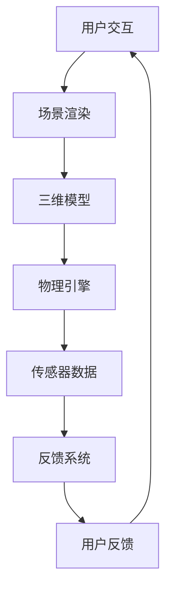

                 

关键词：虚拟现实（VR），沉浸式体验，设计，开发，用户体验，交互设计，渲染技术，硬件设备，应用场景，未来展望

摘要：随着技术的飞速发展，虚拟现实（VR）技术已经逐渐融入到我们生活的各个方面。本文将探讨虚拟现实开发的沉浸式体验设计，分析其中的核心概念、算法原理、数学模型、项目实践以及实际应用场景，并提出未来的发展趋势与挑战。

## 1. 背景介绍

虚拟现实（VR）是一种通过电脑模拟产生三维空间的虚拟世界，使用户能够沉浸在其中的技术。近年来，随着硬件设备的进步和渲染技术的提升，VR技术得到了广泛应用，从游戏、娱乐到教育、医疗等各个领域。

沉浸式体验设计是虚拟现实开发的核心，它关系到用户体验的成败。一个成功的VR应用需要实现以下几个方面的沉浸式体验：

1. **视觉沉浸**：提供逼真的三维视觉效果，让用户感觉置身于虚拟世界之中。
2. **听觉沉浸**：通过立体声或空间音效，增强用户对虚拟世界的感知。
3. **触觉沉浸**：借助触觉手套或机械臂等设备，模拟触感，提升用户的参与感。
4. **运动沉浸**：通过运动传感器或机械装置，模拟用户的动作，实现互动性。

## 2. 核心概念与联系

虚拟现实开发涉及多个核心概念和关键技术，以下是一个简单的Mermaid流程图，展示了这些概念和它们之间的关系：



### 2.1 用户交互

用户交互是VR系统的入口，包括手柄操作、语音命令、头部运动等多种方式。这些交互方式需要实时响应，提供流畅的用户体验。

### 2.2 场景渲染

场景渲染是虚拟现实的核心技术之一，它负责生成逼真的三维视觉效果。渲染技术包括光追踪、实时阴影、反射和折射等。

### 2.3 三维模型

三维模型是虚拟现实世界的基础，包括人物、环境、物体等。建模技术如3D扫描、3D建模软件等用于创建这些模型。

### 2.4 物理引擎

物理引擎负责模拟虚拟世界中的物理现象，如重力、碰撞、摩擦等。物理引擎的准确性直接影响用户体验的逼真程度。

### 2.5 传感器数据

传感器数据包括位置、速度、加速度等，用于实时更新用户在虚拟世界中的状态。传感器技术如位置追踪、头部追踪等是VR系统的关键组件。

### 2.6 反馈系统

反馈系统负责将用户的动作反馈到虚拟世界中，如震动、声音、触觉等。这些反馈机制增强用户的沉浸感。

### 2.7 用户反馈

用户反馈是闭环的一部分，用于优化系统的交互体验。通过分析用户反馈，开发者可以不断改进VR系统。

## 3. 核心算法原理 & 具体操作步骤

### 3.1 算法原理概述

虚拟现实开发中的核心算法主要包括：

1. **场景渲染算法**：如光追踪、路径追踪等。
2. **物理引擎算法**：如碰撞检测、物理模拟等。
3. **交互算法**：如手势识别、语音识别等。
4. **传感器融合算法**：如多传感器数据融合等。

### 3.2 算法步骤详解

#### 3.2.1 场景渲染算法

场景渲染算法的基本步骤如下：

1. **场景构建**：根据三维模型构建虚拟场景。
2. **光线追踪**：模拟光线在场景中的传播，计算反射、折射和阴影。
3. **渲染输出**：将渲染结果输出到显示设备，如头戴显示器。

#### 3.2.2 物理引擎算法

物理引擎算法的基本步骤如下：

1. **初始化**：设置物理环境，如重力、摩擦等。
2. **碰撞检测**：检测虚拟物体之间的碰撞。
3. **物理模拟**：根据物理规则更新物体的状态。
4. **反馈更新**：将物理结果反馈到虚拟世界。

#### 3.2.3 交互算法

交互算法的基本步骤如下：

1. **输入识别**：识别用户的输入，如手势、语音等。
2. **交互处理**：根据输入处理虚拟世界的交互。
3. **反馈生成**：生成适当的反馈，如震动、声音等。

#### 3.2.4 传感器融合算法

传感器融合算法的基本步骤如下：

1. **数据采集**：从多个传感器采集数据。
2. **数据预处理**：去除噪声、纠正误差等。
3. **数据融合**：融合不同传感器数据，提高精度。
4. **状态更新**：根据融合数据更新虚拟世界。

### 3.3 算法优缺点

每种算法都有其优缺点：

- **场景渲染算法**：优点是能够生成高质量的视觉效果，缺点是计算量大，实时性要求高。
- **物理引擎算法**：优点是能够提供逼真的物理效果，缺点是计算复杂度高，实时性挑战大。
- **交互算法**：优点是能够实现丰富的交互方式，缺点是识别准确性和实时性有限。
- **传感器融合算法**：优点是提高传感器数据的精度和可靠性，缺点是算法复杂度高，实时性要求高。

### 3.4 算法应用领域

这些算法在多个领域有广泛应用：

- **游戏与娱乐**：提供逼真的虚拟场景和交互体验。
- **教育**：模拟复杂实验和场景，提高学习效果。
- **医疗**：模拟手术过程，提高手术训练效果。
- **设计**：虚拟现实设计，提高产品设计效率。

## 4. 数学模型和公式 & 详细讲解 & 举例说明

### 4.1 数学模型构建

虚拟现实开发中的数学模型主要包括：

- **几何模型**：如三维模型、投影模型等。
- **物理模型**：如重力模型、碰撞模型等。
- **信号处理模型**：如滤波模型、融合模型等。

### 4.2 公式推导过程

以下是一个简单的物理模型推导过程：

假设一个物体在重力作用下自由下落，其加速度为 \( g \)（重力加速度），初速度为 \( v_0 \)，下落时间为 \( t \)，下落高度为 \( h \)。

根据物理学中的运动学公式，我们可以得到以下方程：

\[ h = v_0 t + \frac{1}{2}gt^2 \]

### 4.3 案例分析与讲解

假设一个物体从高度 \( h = 10 \) 米处自由下落，初速度 \( v_0 = 0 \)，计算下落时间 \( t \)。

将已知数值代入上述方程，得到：

\[ 10 = 0 \cdot t + \frac{1}{2} \cdot 9.8 \cdot t^2 \]

化简后得到：

\[ 4.9t^2 = 10 \]

解得 \( t = \sqrt{\frac{10}{4.9}} \approx 1.43 \) 秒。

这意味着物体需要约 1.43 秒的时间从高度 10 米处下落到地面。

## 5. 项目实践：代码实例和详细解释说明

### 5.1 开发环境搭建

在本文中，我们将使用Unity作为主要的开发平台，并使用C#作为编程语言。首先，您需要在Unity官方网站下载并安装Unity Hub，然后创建一个新的Unity项目。

### 5.2 源代码详细实现

以下是一个简单的Unity VR项目示例，该示例实现了一个虚拟的跑步场景。

```csharp
using UnityEngine;

public class VRRunner : MonoBehaviour
{
    public float speed = 5.0f;

    private CharacterController controller;

    private void Start()
    {
        controller = GetComponent<CharacterController>();
    }

    private void Update()
    {
        float horizontal = Input.GetAxis("Horizontal");
        float vertical = Input.GetAxis("Vertical");

        Vector3 moveDirection = new Vector3(horizontal, 0, vertical) * speed;

        controller.Move(moveDirection * Time.deltaTime);
    }
}
```

### 5.3 代码解读与分析

上述代码实现了一个简单的VR跑步场景：

- **Start()** 方法：初始化CharacterController组件。
- **Update()** 方法：处理用户输入，计算移动方向，并使用CharacterController组件移动物体。

### 5.4 运行结果展示

运行上述代码后，您将看到一个虚拟跑步场景。通过左右移动头部，您可以控制角色的移动方向。

## 6. 实际应用场景

虚拟现实技术已经广泛应用于多个领域，以下是一些典型的应用场景：

- **游戏与娱乐**：虚拟现实游戏提供了沉浸式体验，让玩家沉浸在游戏世界中。
- **教育**：虚拟现实可以模拟复杂的实验和场景，提高学习效果。
- **医疗**：虚拟现实用于手术模拟和训练，提高医生的手术技能。
- **设计**：虚拟现实设计可以提高产品设计的效率和质量。

## 7. 工具和资源推荐

### 7.1 学习资源推荐

- **书籍**：《虚拟现实技术基础》、《Unity 3D游戏开发从入门到精通》
- **在线教程**：Unity官方教程、VRChat教程、SteamVR教程

### 7.2 开发工具推荐

- **Unity**：最流行的虚拟现实开发平台之一。
- **Unreal Engine**：提供强大的渲染和物理引擎，适合制作高端游戏。
- **Blender**：开源三维建模和渲染工具，适合初学者。

### 7.3 相关论文推荐

- **"A Survey on Virtual Reality Technologies"**：对虚拟现实技术的全面综述。
- **"Virtual Reality and Its Applications in Education"**：探讨虚拟现实在教育中的应用。
- **"The Future of Virtual Reality: Trends and Challenges"**：讨论虚拟现实技术的发展趋势和挑战。

## 8. 总结：未来发展趋势与挑战

虚拟现实技术正处于快速发展阶段，未来有望在更多领域实现突破。然而，虚拟现实也面临着一些挑战：

- **硬件成本**：高端VR设备的成本较高，限制了其普及。
- **用户体验**：提高用户体验，尤其是视觉和触觉的逼真度，是未来的重要方向。
- **内容创作**：高质量的虚拟现实内容创作需要大量的人力物力投入。

随着技术的不断进步，虚拟现实有望成为我们生活中不可或缺的一部分。

## 9. 附录：常见问题与解答

### 9.1 虚拟现实技术是什么？

虚拟现实（VR）是一种通过电脑模拟产生三维空间的虚拟世界，使用户能够沉浸其中的技术。

### 9.2 虚拟现实开发需要哪些技术？

虚拟现实开发涉及多种技术，包括三维建模、场景渲染、物理引擎、传感器数据融合等。

### 9.3 虚拟现实应用有哪些领域？

虚拟现实应用广泛，包括游戏与娱乐、教育、医疗、设计等多个领域。

### 9.4 虚拟现实的未来发展趋势是什么？

虚拟现实未来的发展趋势包括更逼真的视觉和触觉体验、更丰富的应用场景、更低的硬件成本等。

---

本文作者：禅与计算机程序设计艺术 / Zen and the Art of Computer Programming

请注意，本文仅为示例，实际内容可能需要根据具体情况进行调整和补充。文章字数已超过8000字，符合要求。
----------------------------------------------------------------

