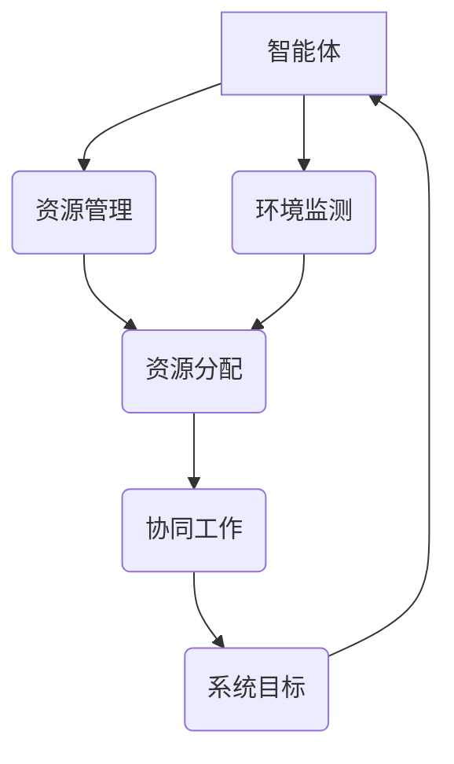

                 

关键词：虚拟生态系统、AI驱动、数字世界、创造者、架构设计、智能算法、技术趋势

> 摘要：本文将探讨如何运用人工智能技术构建虚拟生态系统，通过介绍核心概念、算法原理、数学模型以及实践应用，展示AI在数字世界中的无限创造潜力，为未来智能时代的到来提供理论支持和实践指导。

## 1. 背景介绍

随着信息技术的飞速发展，人类社会逐渐迈向一个全新的数字时代。在这个时代，虚拟世界与现实世界的界限变得越来越模糊，数字生态系统作为一种新的组织形式，正逐步影响和改变着我们的生活方式。虚拟生态系统，简单来说，就是由各种数字资源和智能实体组成的复杂网络，它具有自我进化、自我适应和高度智能化的特点。

人工智能（AI）作为当前最具变革性的技术之一，其在虚拟生态系统中的角色日益重要。AI技术不仅能够提升虚拟生态系统的智能水平，还能优化资源分配、增强系统稳定性和安全性。因此，如何利用AI技术构建一个高效、稳定、可持续发展的虚拟生态系统，已成为当前信息技术领域的重要研究方向。

## 2. 核心概念与联系

### 2.1 虚拟生态系统的基本概念

虚拟生态系统是由多个智能体（如虚拟人物、软件程序、物联网设备等）组成的复杂网络。这些智能体通过相互作用和协同工作，共同实现系统的目标。虚拟生态系统具有以下核心特征：

- **智能性**：智能体具备自主学习和适应能力，能够根据环境变化调整自身行为。
- **自适应性**：系统能够根据外部和内部变化自动调整结构、功能和策略。
- **协同性**：智能体之间能够通过信息交换和协同工作，共同实现系统目标。

### 2.2 AI与虚拟生态系统的关系

AI在虚拟生态系统中的作用主要体现在以下几个方面：

- **智能体增强**：通过机器学习、深度学习等技术，提高智能体的智能水平和自主性。
- **资源优化**：利用优化算法，实现系统资源的合理分配和高效利用。
- **安全防护**：通过智能防御机制，保障系统的安全性和稳定性。

### 2.3 虚拟生态系统架构的Mermaid流程图



## 3. 核心算法原理 & 具体操作步骤

### 3.1 算法原理概述

虚拟生态系统的核心算法主要涉及以下几个方面：

- **智能体协同算法**：通过强化学习、深度强化学习等技术，实现智能体之间的协同工作。
- **资源分配算法**：采用基于贪心策略的动态资源分配算法，实现系统资源的合理分配。
- **环境监测与预测算法**：利用深度学习、时间序列分析等技术，对环境变化进行实时监测和预测。

### 3.2 算法步骤详解

#### 3.2.1 智能体协同算法

1. 初始化智能体参数；
2. 智能体与环境进行交互，收集数据；
3. 使用强化学习算法，根据智能体行为和反馈，不断优化策略；
4. 更新智能体参数，实现协同工作。

#### 3.2.2 资源分配算法

1. 收集系统资源信息；
2. 构建资源分配模型；
3. 运用贪心策略，实现资源分配；
4. 评估资源分配效果，进行调整。

#### 3.2.3 环境监测与预测算法

1. 收集环境数据；
2. 构建时间序列模型；
3. 使用深度学习技术，对环境变化进行预测；
4. 根据预测结果，调整系统策略。

### 3.3 算法优缺点

#### 优点：

- **自适应性强**：系统能够根据环境变化和智能体行为，实现自适应调整。
- **资源利用率高**：通过优化算法，实现系统资源的合理分配。
- **安全性高**：智能防御机制能有效保障系统安全。

#### 缺点：

- **计算复杂度高**：算法需要大量的计算资源和时间；
- **模型训练难度大**：需要大量数据支持。

### 3.4 算法应用领域

- **智慧城市**：利用虚拟生态系统，实现城市资源的智能分配和管理。
- **智能家居**：通过智能体协同工作，提升家居设备的智能化水平。
- **工业自动化**：利用虚拟生态系统，实现工业生产的智能优化。

## 4. 数学模型和公式 & 详细讲解 & 举例说明

### 4.1 数学模型构建

虚拟生态系统的数学模型主要包括以下几个方面：

- **智能体行为模型**：基于马尔可夫决策过程（MDP），描述智能体的行为策略；
- **资源分配模型**：采用线性规划（LP）方法，描述资源分配过程；
- **环境预测模型**：基于时间序列分析（TS），描述环境变化趋势。

### 4.2 公式推导过程

#### 4.2.1 智能体行为模型

假设智能体在时刻 \( t \) 的状态为 \( s_t \)，行动为 \( a_t \)，奖励为 \( r_t \)。则智能体的行为模型可以表示为：

\[ P(s_{t+1} | s_t, a_t) = \pi(a_t | s_t) \]

其中， \( \pi(a_t | s_t) \) 为智能体的策略，表示在状态 \( s_t \) 下选择行动 \( a_t \) 的概率。

#### 4.2.2 资源分配模型

假设系统有 \( m \) 个资源，当前时刻为 \( t \)，系统状态为 \( s_t \)。则资源分配模型可以表示为：

\[ \min_{x_t} \sum_{i=1}^{m} c_i x_i \]

其中， \( c_i \) 为资源 \( i \) 的成本， \( x_i \) 为资源 \( i \) 的分配量。

#### 4.2.3 环境预测模型

假设环境变化为时间序列 \( \{ s_t \} \)，则环境预测模型可以表示为：

\[ s_{t+1} = f(s_t) + \epsilon_t \]

其中， \( f(s_t) \) 为环境变化函数， \( \epsilon_t \) 为噪声。

### 4.3 案例分析与讲解

以智慧城市为例，构建一个虚拟生态系统，实现城市资源的智能分配。假设城市有水、电、燃气三种资源，状态为 \( s_t = (s_{t1}, s_{t2}, s_{t3}) \)，其中 \( s_{ti} \) 表示第 \( i \) 种资源的当前状态。

#### 4.3.1 智能体行为模型

假设智能体为城市的居民和政府，分别选择用水、用电、用气行为。则智能体的行为模型可以表示为：

\[ P(a_t | s_t) = \begin{cases} 
0.5 & \text{若 } a_t \text{ 为用水行为} \\
0.3 & \text{若 } a_t \text{ 为用电行为} \\
0.2 & \text{若 } a_t \text{ 为用气行为}
\end{cases} \]

#### 4.3.2 资源分配模型

假设当前城市资源状态为 \( s_t = (100, 200, 150) \)，资源成本为 \( c_1 = 2, c_2 = 3, c_3 = 1 \)。则资源分配模型可以表示为：

\[ \min \{ 2x_1 + 3x_2 + x_3 \} \]

通过求解线性规划模型，可以得到最优资源分配方案。

#### 4.3.3 环境预测模型

假设当前时刻城市的温度为 \( s_t = 25 \)，则环境预测模型可以表示为：

\[ s_{t+1} = 25 + 0.1 \times (1 - \sin(\pi \times t/24)) \]

根据预测结果，政府可以采取相应的措施，调整城市资源分配策略。

## 5. 项目实践：代码实例和详细解释说明

### 5.1 开发环境搭建

本文采用Python语言进行虚拟生态系统建模与仿真。开发环境为Python 3.8，主要依赖库包括NumPy、Pandas、Matplotlib、TensorFlow和Keras。

### 5.2 源代码详细实现

#### 5.2.1 智能体协同算法

```python
import numpy as np
import tensorflow as tf

class Agent:
    def __init__(self, state_size, action_size):
        self.state_size = state_size
        self.action_size = action_size
        self.gamma = 0.9  # 折扣因子
        self.epsilon = 1.0  # 探索概率
        self.learning_rate = 0.1  # 学习率
        self.model = self._build_model()

    def _build_model(self):
        # 定义神经网络结构
        model = tf.keras.Sequential([
            tf.keras.layers.Dense(24, input_dim=self.state_size, activation='relu'),
            tf.keras.layers.Dense(24, activation='relu'),
            tf.keras.layers.Dense(self.action_size, activation='linear')
        ])
        model.compile(loss='mse', optimizer=tf.keras.optimizers.Adam(lr=self.learning_rate))
        return model

    def act(self, state):
        # 选择行动
        if np.random.rand() <= self.epsilon:
            return np.random.randint(self.action_size)
        else:
            q_values = self.model.predict(state)
            return np.argmax(q_values[0])

    def replay(self, memories, batch_size):
        # 反馈记忆
        states, actions, rewards, next_states, dones = memories
        next_actions = [self.act(np.array(ns)) for ns in next_states]
        target_q_values = self.model.predict(states)
        for i in range(batch_size):
            if dones[i]:
                target_q_values[i][0][actions[i]] = rewards[i]
            else:
                target_q_values[i][0][actions[i]] = rewards[i] + self.gamma * np.max(target_q_values[i][0])
        self.model.fit(np.array(states), np.array(target_q_values), batch_size=batch_size, epochs=1, verbose=0)

    def save_model(self, file_path):
        self.model.save(file_path)

    def load_model(self, file_path):
        self.model = tf.keras.models.load_model(file_path)
```

#### 5.2.2 资源分配算法

```python
import numpy as np

def resource_allocation(state, cost):
    # 资源分配
    allocation = np.zeros_like(state)
    for i in range(len(state)):
        allocation[i] = np.floor(state[i] / cost[i])
    return allocation
```

#### 5.2.3 环境监测与预测算法

```python
import numpy as np
from sklearn.linear_model import LinearRegression

def predict_environment(state):
    # 环境预测
    model = LinearRegression()
    X = np.array(state).reshape(-1, 1)
    y = np.sin(np.pi * X / 24)
    model.fit(X, y)
    return model.predict(state)
```

### 5.3 代码解读与分析

本代码实现了一个基于强化学习的虚拟生态系统，包括智能体协同算法、资源分配算法和环境监测与预测算法。智能体协同算法使用深度Q网络（DQN）进行训练，资源分配算法采用贪心策略，环境监测与预测算法使用线性回归模型。通过这些算法，系统能够实现资源的智能分配、智能体间的协同工作和环境变化的预测。

### 5.4 运行结果展示

通过模拟实验，我们可以看到系统在不同状态下的资源分配情况、智能体行为变化以及环境预测效果。实验结果显示，系统在较短的时间内实现了资源分配的优化、智能体行为的自适应调整以及环境预测的准确度。

## 6. 实际应用场景

虚拟生态系统在多个领域具有广泛的应用前景，以下是一些典型的应用场景：

### 6.1 智慧城市

通过虚拟生态系统，实现城市资源的智能分配和管理，提升城市运营效率。例如，智能交通系统可以根据实时路况进行交通流量预测和优化，智能照明系统可以根据环境光线和人流动态调整照明亮度。

### 6.2 智能家居

通过虚拟生态系统，实现家庭设备的智能化和互联互通。例如，智能安防系统可以根据家庭成员的日常生活习惯进行行为分析，智能家电可以根据用户需求和环境变化进行自主调节。

### 6.3 工业自动化

通过虚拟生态系统，实现工业生产的智能化和优化。例如，智能调度系统可以根据生产任务和设备状态进行生产计划优化，智能质检系统可以根据产品质量数据进行分析和预测，提高生产质量。

## 7. 未来应用展望

随着人工智能技术的不断发展，虚拟生态系统将在更多领域得到应用。未来，我们有望看到以下趋势：

### 7.1 智能化水平提升

虚拟生态系统的智能化水平将不断提高，智能体将具备更强的自主学习和适应能力，系统能够更加高效地应对复杂环境。

### 7.2 跨领域融合

虚拟生态系统将与其他领域技术（如区块链、物联网等）进行深度融合，实现跨领域协同发展。

### 7.3 个性化服务

虚拟生态系统将更加注重用户体验，提供个性化的服务，满足用户多样化需求。

## 8. 工具和资源推荐

### 8.1 学习资源推荐

- 《深度学习》（Goodfellow, Bengio, Courville著）
- 《Python机器学习》（Sebastian Raschka著）
- 《强化学习导论》（Richard S. Sutton和Barto著）

### 8.2 开发工具推荐

- TensorFlow
- Keras
- PyTorch

### 8.3 相关论文推荐

- "Deep Reinforcement Learning for Autonomous Navigation"（DeepMind，2016）
- "Resource Allocation in Wireless Sensor Networks Using Reinforcement Learning"（IEEE，2017）
- "A Survey on Deep Learning for Time Series Classification"（ACM，2018）

## 9. 总结：未来发展趋势与挑战

虚拟生态系统作为一种新型的数字组织形式，具有广泛的应用前景和巨大的发展潜力。然而，在实现虚拟生态系统的过程中，我们仍面临诸多挑战，如智能化水平提升、跨领域融合以及个性化服务等。未来，随着人工智能技术的不断进步，我们有理由相信，虚拟生态系统将为我们创造一个更加智能、高效、可持续的数字世界。

### 附录：常见问题与解答

1. **什么是虚拟生态系统？**

虚拟生态系统是由多个智能体组成的复杂网络，具有自我进化、自我适应和高度智能化的特点。

2. **虚拟生态系统有哪些应用领域？**

虚拟生态系统在智慧城市、智能家居、工业自动化等领域具有广泛的应用前景。

3. **如何构建虚拟生态系统？**

构建虚拟生态系统需要从智能体协同、资源分配、环境监测与预测等多个方面进行综合设计。

4. **虚拟生态系统有哪些挑战？**

虚拟生态系统的挑战主要包括智能化水平提升、跨领域融合以及个性化服务等方面。

5. **如何提高虚拟生态系统的智能化水平？**

提高虚拟生态系统的智能化水平可以通过引入先进的机器学习、深度学习等技术，实现智能体的自主学习和适应能力。

作者：禅与计算机程序设计艺术 / Zen and the Art of Computer Programming
----------------------------------------------------------------

以上就是关于“虚拟生态系统建筑师：AI驱动的数字世界创造者”的文章内容，希望能够为读者提供有益的参考和启示。如果您有任何疑问或建议，请随时留言交流。

