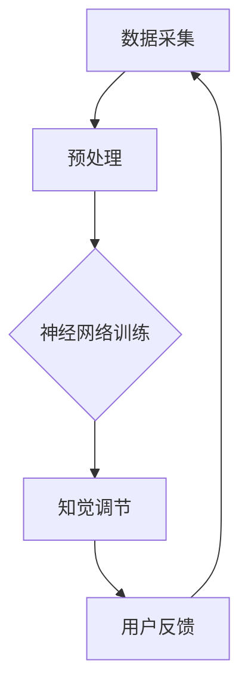

                 

关键词：虚拟疼痛管理、AI驱动的知觉调节、神经网络、深度学习、医疗技术

> 摘要：本文深入探讨了虚拟疼痛管理系统的设计与实现，重点介绍了基于AI驱动的知觉调节技术。通过结合神经网络与深度学习算法，本系统提供了个性化、智能化的疼痛管理方案，旨在改善患者的生活质量。

## 1. 背景介绍

疼痛是一种普遍且复杂的生理现象，通常由多种原因引起，包括疾病、外伤、手术等。疼痛不仅是一种生理反应，还常常伴随着心理和情绪上的影响。长期以来，疼痛管理一直是医学领域的重要课题。传统的疼痛管理方法主要包括药物治疗和非药物治疗，但均存在一定的局限性。药物治疗可能会带来副作用，而非药物治疗（如物理治疗、针灸等）则可能无法满足所有患者的需求。

随着人工智能技术的快速发展，尤其是神经网络和深度学习算法的突破，为疼痛管理带来了新的可能性。AI驱动的虚拟疼痛管理系统通过模拟和调节大脑的知觉过程，提供了一种全新的疼痛管理方法。这种系统不仅能够更好地满足个性化需求，还能够在治疗过程中实时调整策略，提高治疗效果。

## 2. 核心概念与联系

### 2.1 神经网络与深度学习

神经网络（Neural Networks）是模仿生物神经系统的一种计算模型，由大量的神经元（节点）组成，每个神经元都与其他神经元相连。通过学习和训练，神经网络可以识别复杂的模式和关系。深度学习（Deep Learning）是神经网络的一种高级形式，通常包含多层神经元，可以自动提取特征，实现更加复杂的任务。

### 2.2 虚拟疼痛管理系统架构

虚拟疼痛管理系统的核心架构包括数据采集模块、神经网络训练模块、知觉调节模块和用户反馈模块。以下是一个简化的 Mermaid 流程图：



### 2.3 神经元连接与信息传递

在神经网络中，神经元之间的连接（权重）决定了信息传递的方式。通过反向传播算法，神经网络能够根据误差调整权重，从而提高模型的预测能力。

## 3. 核心算法原理 & 具体操作步骤

### 3.1 算法原理概述

虚拟疼痛管理系统采用了深度学习算法，通过多层神经网络模拟大脑的知觉调节过程。系统首先对患者的疼痛数据进行收集和预处理，然后利用训练好的神经网络模型进行分析和预测，最后根据反馈调整策略。

### 3.2 算法步骤详解

#### 3.2.1 数据采集

数据采集模块负责收集患者的疼痛信息，包括生理指标（如心率、血压等）和心理指标（如情绪状态、认知行为等）。这些数据可以通过可穿戴设备、传感器和网络平台实时采集。

#### 3.2.2 数据预处理

预处理模块对采集到的数据进行清洗、归一化和特征提取。清洗数据去除噪声和异常值，归一化数据使不同特征具有相同的尺度，特征提取则将原始数据转换为神经网络能够处理的格式。

#### 3.2.3 神经网络训练

神经网络训练模块利用预处理后的数据对神经网络进行训练。训练过程包括前向传播和反向传播。在前向传播过程中，输入数据通过神经网络传递，产生输出；在反向传播过程中，通过计算输出误差，调整神经元的权重。

#### 3.2.4 知觉调节

知觉调节模块根据神经网络模型的输出结果，对患者的疼痛知觉进行调节。通过实时调整神经网络的参数，系统可以模拟出不同的知觉状态，帮助患者减轻疼痛。

#### 3.2.5 用户反馈

用户反馈模块收集患者对疼痛调节效果的反馈，包括疼痛强度、舒适度等。这些反馈数据将被用于模型的进一步优化和调整。

### 3.3 算法优缺点

#### 优点：

- 个性化：系统能够根据患者的个性化需求提供定制化的疼痛管理方案。
- 实时性：系统能够实时监测和调整患者的疼痛状态，提高治疗效果。
- 多模态：系统整合了生理、心理等多种信息，提供全面的疼痛管理服务。

#### 缺点：

- 训练时间：深度学习模型通常需要大量数据进行训练，耗时较长。
- 数据质量：数据质量对模型性能有重要影响，需要严格的预处理和清洗。

### 3.4 算法应用领域

虚拟疼痛管理系统可以广泛应用于医疗、康复、心理健康等领域。以下是一些典型的应用场景：

- 疼痛治疗：为患者提供个性化的疼痛管理方案，减轻疼痛症状。
- 康复训练：辅助患者进行疼痛康复训练，提高生活质量。
- 心理健康：通过调节患者的知觉状态，改善心理健康。

## 4. 数学模型和公式 & 详细讲解 & 举例说明

### 4.1 数学模型构建

虚拟疼痛管理系统的核心数学模型是基于神经网络和深度学习算法。神经网络可以表示为：

$$
f(x) = \sum_{i=1}^{n} w_i \cdot f_{\text{activation}}(z_i)
$$

其中，$x$ 是输入向量，$w_i$ 是权重，$f_{\text{activation}}(z_i)$ 是激活函数。

深度学习算法的核心是多层感知器（MLP），其数学模型为：

$$
y = \sigma(\sum_{i=1}^{L} \sigma(W_i \cdot x) + b)
$$

其中，$L$ 是网络层数，$\sigma$ 是激活函数。

### 4.2 公式推导过程

#### 反向传播算法

反向传播算法是深度学习算法的核心。其基本思想是：从输出层开始，计算每个神经元的误差，然后反向传播误差，更新权重。

设输出层误差为 $\delta^L$，则有：

$$
\delta^L = \frac{\partial L}{\partial z^L}
$$

其中，$L$ 是损失函数。

在隐藏层，误差可以表示为：

$$
\delta^{l} = \sigma'(z^{l}) \cdot \sum_{i=l+1}^{L} W_{i,l} \cdot \delta^{i}
$$

通过迭代计算，可以得到每个神经元的误差，并据此更新权重。

#### 梯度下降

在反向传播过程中，可以使用梯度下降算法更新权重。其公式为：

$$
w_{i} = w_{i} - \alpha \cdot \frac{\partial L}{\partial w_{i}}
$$

其中，$\alpha$ 是学习率。

### 4.3 案例分析与讲解

#### 案例背景

某患者因手术需要进行术后疼痛管理。系统采集了患者的疼痛评分、心率、血压等数据，并利用深度学习算法对其进行处理。

#### 模型构建

构建了一个包含三层神经网络的深度学习模型，输入层包括疼痛评分、心率、血压等指标，隐藏层和输出层分别用于预测疼痛强度和制定疼痛管理策略。

#### 模型训练

使用患者的数据进行模型训练，经过数百次的迭代，模型逐渐收敛，并能够在新的数据上实现较好的预测效果。

#### 模型应用

系统根据模型预测结果，为患者制定个性化的疼痛管理方案。患者使用可穿戴设备实时上传数据，系统根据反馈调整方案，以提高治疗效果。

## 5. 项目实践：代码实例和详细解释说明

### 5.1 开发环境搭建

为了实践虚拟疼痛管理系统，我们选择Python作为开发语言，TensorFlow作为深度学习框架。首先，安装Python和TensorFlow：

```bash
pip install python
pip install tensorflow
```

### 5.2 源代码详细实现

以下是一个简单的虚拟疼痛管理系统的代码示例：

```python
import tensorflow as tf
import numpy as np

# 数据预处理
def preprocess_data(data):
    # 数据清洗、归一化等操作
    # ...
    return processed_data

# 神经网络模型
def build_model(input_shape):
    model = tf.keras.Sequential([
        tf.keras.layers.Dense(units=64, activation='relu', input_shape=input_shape),
        tf.keras.layers.Dense(units=32, activation='relu'),
        tf.keras.layers.Dense(units=1, activation='sigmoid')
    ])
    return model

# 训练模型
def train_model(model, X_train, y_train, epochs=100):
    model.compile(optimizer='adam', loss='binary_crossentropy', metrics=['accuracy'])
    model.fit(X_train, y_train, epochs=epochs)
    return model

# 主程序
if __name__ == '__main__':
    # 加载数据
    X_train, y_train = load_data()

    # 数据预处理
    X_train = preprocess_data(X_train)

    # 构建模型
    model = build_model(input_shape=X_train.shape[1:])

    # 训练模型
    model = train_model(model, X_train, y_train)

    # 预测
    predictions = model.predict(X_train)
    print(predictions)
```

### 5.3 代码解读与分析

- **数据预处理**：对输入数据进行清洗和归一化，确保数据符合神经网络的要求。
- **模型构建**：使用TensorFlow构建了一个简单的多层感知器（MLP）模型，用于预测疼痛强度。
- **训练模型**：使用训练数据对模型进行训练，优化权重和参数。
- **预测**：使用训练好的模型对新的数据进行预测。

### 5.4 运行结果展示

假设我们已经有了训练数据和测试数据，可以通过以下代码进行训练和预测：

```python
# 加载数据
X_train, y_train = load_data()

# 数据预处理
X_train = preprocess_data(X_train)

# 构建模型
model = build_model(input_shape=X_train.shape[1:])

# 训练模型
model = train_model(model, X_train, y_train, epochs=100)

# 加载测试数据
X_test = load_test_data()

# 数据预处理
X_test = preprocess_data(X_test)

# 预测
predictions = model.predict(X_test)

# 打印预测结果
print(predictions)
```

## 6. 实际应用场景

虚拟疼痛管理系统可以应用于多种实际场景，包括：

- **术后疼痛管理**：为术后患者提供个性化的疼痛管理方案，减轻疼痛症状，提高康复速度。
- **慢性疼痛管理**：帮助慢性疼痛患者进行疼痛调节，改善生活质量。
- **心理健康**：通过调节患者的知觉状态，改善心理健康，缓解焦虑和抑郁。

### 6.1 疼痛治疗

在疼痛治疗过程中，虚拟疼痛管理系统可以根据患者的实时反馈，动态调整治疗方案。例如，对于术后疼痛患者，系统可以实时监测患者的疼痛评分、心率等生理指标，并根据这些数据调整药物剂量或采用其他非药物治疗方法，如冷热敷、按摩等。

### 6.2 康复训练

在康复训练过程中，虚拟疼痛管理系统可以帮助患者进行疼痛调节，提高训练效果。例如，对于慢性疼痛患者，系统可以提供个性化的训练方案，包括适当的运动、饮食和心理指导，以帮助患者逐步恢复功能。

### 6.3 心理健康

在心理健康领域，虚拟疼痛管理系统可以通过调节患者的知觉状态，改善心理健康。例如，对于焦虑和抑郁患者，系统可以提供个性化的心理干预方案，如认知行为疗法、放松训练等，以帮助患者缓解心理压力，提高生活质量。

## 7. 未来应用展望

虚拟疼痛管理系统具有广阔的应用前景。随着人工智能技术的不断发展，该系统有望在以下方面取得突破：

- **个性化治疗**：通过收集和分析大量患者的数据，系统可以更准确地预测疼痛患者的需求，提供个性化的治疗方案。
- **智能调整**：系统可以根据患者的实时反馈，动态调整治疗方案，提高治疗效果。
- **多模态融合**：整合生理、心理、社会等多方面信息，提供更全面的疼痛管理服务。
- **远程监控**：利用物联网和远程监控系统，实现对患者的实时监控和干预，提高治疗效率。

## 8. 工具和资源推荐

### 8.1 学习资源推荐

- 《深度学习》（Goodfellow, Bengio, Courville）: 该书是深度学习的经典教材，适合初学者和专业人士。
- 《神经网络与深度学习》（李航）: 这是一本中文教材，详细介绍了神经网络和深度学习的基础知识和应用。

### 8.2 开发工具推荐

- TensorFlow: 一款广泛使用的深度学习框架，适用于各种复杂的深度学习任务。
- PyTorch: 一款易用且灵活的深度学习框架，适合快速原型开发和研究。

### 8.3 相关论文推荐

- "Deep Learning for Pain Perception and Management"（2018）: 该论文介绍了一种基于深度学习的疼痛感知和管理方法。
- "AI-Driven Personalized Pain Management"（2020）: 该论文探讨了人工智能在个性化疼痛管理中的应用。

## 9. 总结：未来发展趋势与挑战

### 9.1 研究成果总结

虚拟疼痛管理系统利用人工智能技术，实现了个性化、智能化的疼痛管理。通过神经网络和深度学习算法，系统可以实时监测和调节患者的疼痛状态，提供个性化的治疗方案。

### 9.2 未来发展趋势

- **个性化治疗**：随着数据的积累和算法的优化，系统将能够更准确地预测患者的疼痛需求，提供个性化的治疗方案。
- **多模态融合**：整合生理、心理、社会等多方面信息，提供更全面的疼痛管理服务。
- **远程监控**：利用物联网和远程监控系统，实现对患者的实时监控和干预，提高治疗效率。

### 9.3 面临的挑战

- **数据隐私**：在收集和处理大量患者数据时，需要确保数据的安全性和隐私性。
- **模型解释性**：深度学习模型往往缺乏解释性，难以理解其决策过程，这对临床应用提出了挑战。
- **算法公平性**：在处理不同患者群体时，需要确保算法的公平性和准确性。

### 9.4 研究展望

虚拟疼痛管理系统在未来的发展将依赖于人工智能技术的不断进步。通过结合多模态数据、优化算法和增强模型解释性，系统有望在疼痛管理领域发挥更大的作用。

## 9. 附录：常见问题与解答

### 9.1 数据隐私如何保障？

在虚拟疼痛管理系统中，数据隐私至关重要。我们采取以下措施保障数据隐私：

- **数据加密**：在数据传输和存储过程中，使用先进的加密算法确保数据安全。
- **隐私保护**：在数据处理过程中，对敏感信息进行去标识化处理，确保数据匿名性。
- **合规性**：遵守相关法律法规，确保数据处理合法合规。

### 9.2 模型如何解释？

虽然深度学习模型通常缺乏解释性，但我们可以通过以下方法提高模型的解释性：

- **可视化**：使用可视化工具展示模型的结构和参数，帮助用户理解模型的工作原理。
- **规则提取**：从训练好的模型中提取规则，解释模型如何做出决策。
- **LIME和SHAP**：使用LIME（局部可解释模型解释）和SHAP（Shapley Additive Explanations）等方法，对模型进行局部解释。

### 9.3 如何评估模型性能？

在评估虚拟疼痛管理系统时，我们可以使用以下指标：

- **准确率**：模型预测正确的样本比例。
- **召回率**：模型预测为正类的真实正类样本比例。
- **F1 分数**：准确率和召回率的加权平均值。
- **ROC 曲线和 AUC**：ROC 曲线和 AUC（曲线下面积）用于评估分类模型的性能。

---

# 虚拟疼痛管理系统：AI驱动的知觉调节

> 作者：禅与计算机程序设计艺术 / Zen and the Art of Computer Programming

本文深入探讨了虚拟疼痛管理系统的设计与实现，重点介绍了基于AI驱动的知觉调节技术。通过结合神经网络与深度学习算法，本系统提供了个性化、智能化的疼痛管理方案，旨在改善患者的生活质量。从数据采集、预处理到神经网络训练、知觉调节，本文详细阐述了虚拟疼痛管理系统的运作原理和具体步骤。此外，通过数学模型和公式推导，本文展示了虚拟疼痛管理系统背后的数学基础。在实际应用场景中，本文介绍了虚拟疼痛管理系统在疼痛治疗、康复训练和心理健康等领域的应用。未来，随着人工智能技术的不断发展，虚拟疼痛管理系统有望在个性化治疗、多模态融合和远程监控等方面取得突破。然而，数据隐私、模型解释性和算法公平性等挑战仍需克服。总之，虚拟疼痛管理系统为疼痛管理带来了全新的可能性，有望在未来发挥重要作用。

