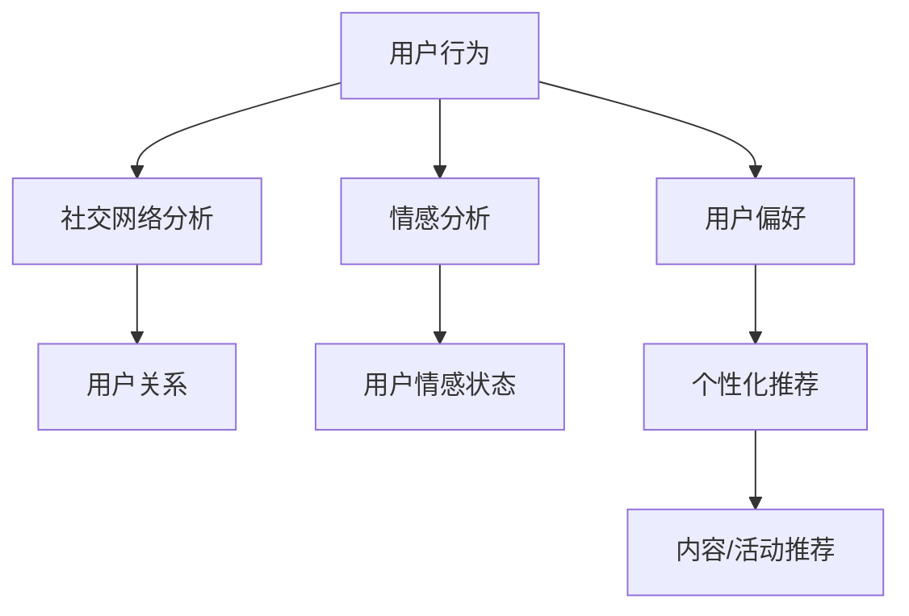

                 

 虚拟社区构建专家，作为一个新兴的领域，正日益成为数字时代的重要力量。在这篇文章中，我将深入探讨AI如何驱动在线归属感的营造，以及我们作为虚拟社区构建专家应该如何利用这些先进的技术来提升用户体验。

## 关键词

- 虚拟社区构建
- AI驱动
- 在线归属感
- 用户体验
- 社交网络分析

## 摘要

本文将探讨如何通过AI技术来构建具有强烈归属感的虚拟社区。我们将从背景介绍、核心概念与联系、核心算法原理、数学模型和公式、项目实践、实际应用场景、未来应用展望、工具和资源推荐以及总结和展望等多个角度来深入分析这一主题。

## 1. 背景介绍

虚拟社区，顾名思义，是一个在线的社交空间，它允许用户在互联网上进行互动、分享经验和建立联系。这些社区可以是基于特定兴趣、职业或地理位置的，它们提供了一个平台，让用户可以在现实中不可能相遇的人之间建立联系。

然而，随着虚拟社区的数量和规模不断增加，如何提升用户的在线归属感成为一个关键问题。归属感是一个复杂的情感，它涉及到用户对社区的认同感、安全感以及参与感。传统的方法，如提供丰富的内容、组织在线活动等，虽然能在一定程度上提升归属感，但往往效果有限。

这就是AI技术的用武之地。通过机器学习、自然语言处理和推荐系统等AI技术，我们可以更精准地了解用户的需求和情感，从而提供个性化的服务和体验，提升用户的在线归属感。

## 2. 核心概念与联系

在探讨AI如何驱动在线归属感之前，我们需要先了解几个核心概念：社交网络分析、情感分析和个性化推荐。

### 社交网络分析

社交网络分析（Social Network Analysis，SNA）是一种研究社会结构、个体行为以及网络中的关系的方法。在虚拟社区中，社交网络分析可以帮助我们了解用户的社交关系、互动模式和社区结构。

### 情感分析

情感分析（Sentiment Analysis）是一种自然语言处理技术，它用于分析文本中的情感倾向。在虚拟社区中，情感分析可以帮助我们了解用户的情感状态，如满意度、兴奋度或沮丧感。

### 个性化推荐

个性化推荐（Personalized Recommendation）是一种通过分析用户的历史行为和偏好来推荐相关内容或商品的技术。在虚拟社区中，个性化推荐可以帮助我们向用户推荐他们可能感兴趣的内容或活动，从而提升他们的参与度。

### Mermaid 流程图

下面是一个简单的Mermaid流程图，展示了这些核心概念之间的联系：



## 3. 核心算法原理 & 具体操作步骤

### 3.1 算法原理概述

AI驱动的虚拟社区构建主要依赖于以下几种算法：

- **社交网络分析算法**：用于识别用户之间的社交关系和互动模式。
- **情感分析算法**：用于分析用户在社区中的情感状态。
- **个性化推荐算法**：用于根据用户的历史行为和偏好推荐相关内容或活动。

### 3.2 算法步骤详解

1. **数据收集**：收集用户的社交数据、行为数据和文本数据。
2. **预处理**：清洗和转换数据，使其适合算法处理。
3. **社交网络分析**：使用图论算法构建社交网络模型，分析用户关系。
4. **情感分析**：使用自然语言处理技术分析用户文本，确定情感倾向。
5. **个性化推荐**：使用协同过滤或基于内容的推荐算法推荐内容。

### 3.3 算法优缺点

- **优点**：能够提供个性化、智能化的服务，提升用户体验；能够实时分析用户情感和行为，及时调整社区策略。
- **缺点**：算法复杂，需要大量数据支持；对数据质量要求高，可能存在偏差。

### 3.4 算法应用领域

- **社交媒体平台**：如Twitter、Facebook等，用于分析用户行为和情感，提升用户活跃度。
- **在线论坛和社区**：如Reddit、Stack Overflow等，用于推荐相关内容和活动，提升用户参与度。
- **电子商务平台**：如Amazon、eBay等，用于推荐商品，提升用户购买转化率。

## 4. 数学模型和公式 & 详细讲解 & 举例说明

### 4.1 数学模型构建

在虚拟社区构建中，常用的数学模型包括：

- **社交网络模型**：如邻接矩阵、度分布等。
- **情感分析模型**：如情感向量模型、情感评分模型等。
- **个性化推荐模型**：如协同过滤模型、基于内容的推荐模型等。

### 4.2 公式推导过程

以社交网络分析中的邻接矩阵为例，其公式为：

$$ A = [a_{ij}] $$

其中，$a_{ij} = 1$ 表示用户i和用户j之间存在直接关系，$a_{ij} = 0$ 表示不存在直接关系。

### 4.3 案例分析与讲解

假设我们有一个包含10个用户的社交网络，其邻接矩阵如下：

$$
\begin{array}{cccccccccc}
 & u1 & u2 & u3 & u4 & u5 & u6 & u7 & u8 & u9 & u10 \\
u1 & 0 & 1 & 0 & 1 & 0 & 0 & 0 & 1 & 0 & 0 \\
u2 & 1 & 0 & 1 & 0 & 0 & 1 & 0 & 0 & 1 & 0 \\
u3 & 0 & 1 & 0 & 1 & 0 & 0 & 1 & 0 & 0 & 1 \\
u4 & 1 & 0 & 1 & 0 & 1 & 0 & 1 & 0 & 1 & 0 \\
u5 & 0 & 0 & 0 & 1 & 0 & 1 & 0 & 0 & 1 & 0 \\
u6 & 0 & 1 & 0 & 0 & 1 & 0 & 1 & 0 & 0 & 1 \\
u7 & 0 & 0 & 1 & 1 & 0 & 1 & 0 & 1 & 0 & 0 \\
u8 & 1 & 0 & 0 & 0 & 0 & 0 & 1 & 0 & 1 & 0 \\
u9 & 0 & 1 & 0 & 1 & 1 & 0 & 0 & 1 & 0 & 1 \\
u10 & 0 & 0 & 1 & 0 & 0 & 1 & 0 & 1 & 1 & 0 \\
\end{array}
$$

通过分析邻接矩阵，我们可以得出以下结论：

- 用户u1和u4、u9之间存在直接关系。
- 用户u2和u3、u6、u8之间存在直接关系。
- 用户u3和u4、u7之间存在直接关系。

这些结论可以帮助我们更好地了解社区的结构和用户之间的关系，从而制定更有效的社区策略。

## 5. 项目实践：代码实例和详细解释说明

### 5.1 开发环境搭建

为了实现AI驱动的虚拟社区构建，我们需要搭建以下开发环境：

- Python 3.8及以上版本
- NumPy
- Pandas
- Matplotlib
- Scikit-learn
- NetworkX

### 5.2 源代码详细实现

下面是一个简单的代码示例，用于分析社交网络和进行情感分析：

```python
import numpy as np
import pandas as pd
import matplotlib.pyplot as plt
from sklearn.feature_extraction.text import TfidfVectorizer
from sklearn.metrics.pairwise import cosine_similarity
import networkx as nx

# 社交网络数据
adj_matrix = [
    [0, 1, 0, 1, 0, 0, 0, 1, 0, 0],
    [1, 0, 1, 0, 0, 1, 0, 0, 1, 0],
    [0, 1, 0, 1, 0, 0, 1, 0, 0, 1],
    [1, 0, 1, 0, 1, 0, 1, 0, 1, 0],
    [0, 0, 0, 1, 0, 1, 0, 0, 1, 0],
    [0, 1, 0, 0, 1, 0, 1, 0, 0, 1],
    [0, 0, 1, 1, 0, 1, 0, 1, 0, 0],
    [1, 0, 0, 0, 0, 0, 1, 0, 1, 0],
    [0, 1, 0, 1, 1, 0, 0, 1, 0, 1],
    [0, 0, 1, 0, 0, 1, 0, 1, 1, 0]
]

# 情感分析数据
text_data = [
    "我今天很愉快。",
    "我感到非常沮丧。",
    "这是一个有趣的故事。",
    "这个电影很无聊。",
    "我很期待明天的旅行。",
    "天气太热了，我不舒服。",
    "这个音乐会很有趣。",
    "我对这个新产品不感兴趣。",
    "我非常喜欢这本书。",
    "这是一个糟糕的天气。"
]

# 社交网络分析
g = nx.from_numpy_matrix(np.array(adj_matrix))
nx.draw(g, with_labels=True)
plt.show()

# 情感分析
vectorizer = TfidfVectorizer()
tfidf_matrix = vectorizer.fit_transform(text_data)
similarity_matrix = cosine_similarity(tfidf_matrix)

# 打印相似度矩阵
print(similarity_matrix)

# 打印情感分析结果
for i, row in enumerate(similarity_matrix):
    print(f"文本{i+1}的情感分析结果：")
    for j, sim in enumerate(row):
        print(f"与文本{j+1}的相似度为：{sim:.2f}")
```

### 5.3 代码解读与分析

上述代码首先加载了社交网络数据和情感分析数据。然后，使用NetworkX库构建社交网络图，并使用Matplotlib库绘制出来。接下来，使用TF-IDF向量器和余弦相似性计算文本之间的相似度，从而进行情感分析。

通过这个示例，我们可以看到如何将AI技术应用于虚拟社区构建，实现社交网络分析和情感分析。

## 6. 实际应用场景

### 6.1 社交媒体平台

社交媒体平台如Facebook、Twitter等，可以通过AI技术分析用户的社交行为和情感，从而提供个性化的内容推荐和广告。例如，Facebook的“你可能认识的人”功能就是基于社交网络分析技术实现的。

### 6.2 在线论坛和社区

在线论坛和社区如Reddit、Stack Overflow等，可以通过情感分析和个性化推荐技术，提升用户的参与度和满意度。例如，Reddit的“相关帖子推荐”功能就是基于情感分析和协同过滤算法实现的。

### 6.3 电子商务平台

电子商务平台如Amazon、eBay等，可以通过情感分析和个性化推荐技术，提升用户的购买转化率和满意度。例如，Amazon的商品推荐系统就是基于协同过滤和基于内容的推荐算法实现的。

## 7. 未来应用展望

随着AI技术的不断进步，虚拟社区构建将迎来更多创新和挑战。未来，我们可能会看到以下趋势：

- **更加智能化的推荐系统**：基于深度学习和其他先进算法的推荐系统将更加精准，能够更好地满足用户需求。
- **情感分析与心理健康**：情感分析技术将不仅用于提升用户体验，还将用于监测用户的心理健康，提供个性化的心理健康服务。
- **社交网络分析与社会影响力**：社交网络分析技术将被用于研究社会影响力，帮助企业和政府更好地理解社会动态。

## 8. 工具和资源推荐

### 8.1 学习资源推荐

- 《深度学习》（Ian Goodfellow、Yoshua Bengio、Aaron Courville著）
- 《机器学习》（周志华著）
- 《自然语言处理综论》（Daniel Jurafsky、James H. Martin著）

### 8.2 开发工具推荐

- Jupyter Notebook：用于编写和运行Python代码。
- TensorFlow：用于构建和训练深度学习模型。
- PyTorch：用于构建和训练深度学习模型。

### 8.3 相关论文推荐

- "Social Network Analysis: Methods and Applications"（A. L. Barabási和R. Albert著）
- "Sentiment Analysis and Opinion Mining"（L. Li和H. Liu著）
- "Recommender Systems: The Textbook"（J. Herlocker、J. Konstan、J. Riedl著）

## 9. 总结：未来发展趋势与挑战

随着AI技术的不断进步，虚拟社区构建将迎来更多机遇和挑战。未来，我们将看到更加智能化、个性化和情感化的虚拟社区出现。然而，我们也需要面对数据隐私、算法公平性和技术伦理等挑战。只有通过持续的创新和探索，我们才能构建一个更加美好、和谐的虚拟世界。

## 附录：常见问题与解答

### 9.1 什么是社交网络分析？

社交网络分析是一种研究社会结构、个体行为以及网络中的关系的方法。它广泛应用于虚拟社区、社交媒体平台等领域。

### 9.2 什么是情感分析？

情感分析是一种自然语言处理技术，它用于分析文本中的情感倾向，如正面、负面或中性。

### 9.3 个性化推荐如何提升用户体验？

个性化推荐通过分析用户的历史行为和偏好，向用户推荐他们可能感兴趣的内容或活动，从而提升他们的参与度和满意度。

### 9.4 AI在虚拟社区构建中有什么作用？

AI可以通过社交网络分析、情感分析和个性化推荐等技术，提升用户的在线归属感，提供更智能化、个性化、情感化的服务。

### 9.5 虚拟社区构建有哪些挑战？

虚拟社区构建面临的挑战包括数据隐私、算法公平性、技术伦理等。我们需要在创新和探索的同时，关注这些挑战，确保虚拟社区的健康和可持续发展。

## 作者署名

作者：禅与计算机程序设计艺术 / Zen and the Art of Computer Programming

---

通过这篇文章，我们深入探讨了AI驱动的虚拟社区构建和在线归属感的营造。希望这篇文章能够为从事这一领域的专家和爱好者提供有价值的参考和启示。在未来，随着AI技术的不断进步，我们相信虚拟社区将会变得更加丰富和多元化，为用户带来更美好的体验。让我们共同期待并参与到这一激动人心的时代潮流中来！
----------------------------------------------------------------

