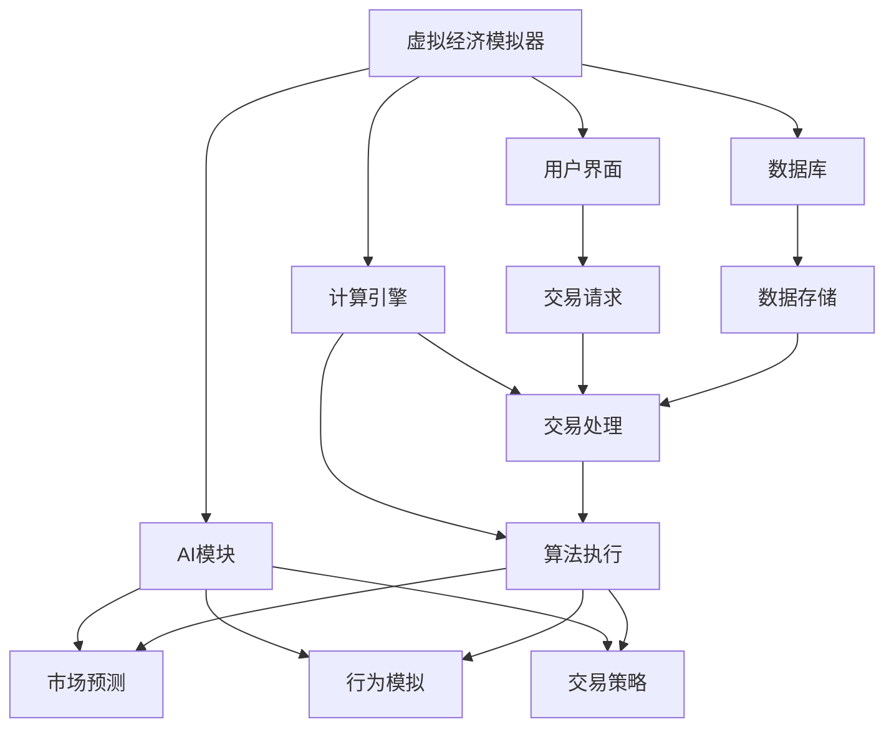

                 

关键词：虚拟经济模拟器，人工智能，价值交换，实验设计，程序设计，技术博客，深度学习，区块链，分布式系统，加密货币，算法，数学模型，应用场景。

> 摘要：本文深入探讨了虚拟经济模拟器程序员的角色与职责，特别是在AI驱动的背景下如何设计新型价值交换实验。通过对核心概念、算法原理、数学模型和实际应用案例的详细阐述，文章旨在为读者提供全面的技术见解和未来展望。

## 1. 背景介绍

虚拟经济模拟器是一种仿真的系统，它模拟了现实经济中的各种交易和交换过程。在过去的几十年中，虚拟经济模拟器主要用于教育、研究和学术探讨。然而，随着人工智能（AI）技术的迅速发展，这些模拟器开始被赋予新的生命力，成为探索新型价值交换机制的实验平台。

人工智能在虚拟经济模拟器中的应用主要体现在两个方面：一是通过机器学习算法对市场行为进行预测和分析，二是利用深度学习模型模拟人类行为，从而创建一个更加真实和动态的模拟环境。这些技术的融合使得虚拟经济模拟器不再仅仅是学术工具，而成为了创新研究和实际应用的重要载体。

本文将围绕虚拟经济模拟器的程序员这一角色，探讨如何利用AI技术设计新型价值交换实验。这不仅要求程序员具备深厚的编程功底，还需要对经济学、心理学、计算机科学等多个领域有深刻的理解。

## 2. 核心概念与联系

### 2.1 虚拟经济模拟器

虚拟经济模拟器是一个软件系统，它模拟了真实世界中的经济活动，包括商品交易、货币交换、市场波动等。这个系统通常由以下几个核心组件构成：

- **用户界面**：用户可以通过界面与模拟器交互，进行交易、查询数据等操作。
- **数据库**：存储了模拟器中的所有数据，包括用户信息、交易记录、市场状态等。
- **计算引擎**：负责处理交易请求、执行算法、模拟市场行为等。
- **AI模块**：用于预测市场走势、分析用户行为、优化交易策略等。

### 2.2 人工智能

人工智能是模拟器中不可或缺的一部分，它通过学习历史数据，预测未来市场趋势，帮助用户做出更明智的决策。具体来说，AI在虚拟经济模拟器中主要应用于以下方面：

- **市场预测**：利用机器学习算法，如线性回归、决策树、神经网络等，预测市场未来的价格波动。
- **行为模拟**：通过深度学习模型，如生成对抗网络（GAN）、强化学习等，模拟用户的行为和市场动态。
- **交易策略**：根据历史数据和当前市场状况，自动生成最优的交易策略。

### 2.3 价值交换

价值交换是虚拟经济模拟器的核心功能，它模拟了商品和货币在市场中的流通和交换。价值交换机制的设计直接影响模拟器的真实性和实用性。以下是一些常见的价值交换机制：

- **供求关系**：根据商品的需求和供应量，自动调整价格，实现市场平衡。
- **拍卖机制**：模拟真实世界的拍卖过程，通过竞价实现商品的价值交换。
- **代币经济**：引入虚拟货币，通过发行、交易等方式模拟货币的流通和交换。

### 2.4 Mermaid 流程图

为了更直观地展示核心概念和它们之间的联系，下面是一个用Mermaid绘制的流程图：



## 3. 核心算法原理 & 具体操作步骤

### 3.1 算法原理概述

虚拟经济模拟器中的核心算法主要包括机器学习算法、深度学习模型和加密货币交易算法。这些算法共同作用，为模拟器提供了丰富的功能。

- **机器学习算法**：主要用于市场预测和交易策略生成。常见的算法有线性回归、决策树、随机森林、支持向量机等。
- **深度学习模型**：用于模拟用户行为和市场动态。常用的模型有卷积神经网络（CNN）、循环神经网络（RNN）、生成对抗网络（GAN）等。
- **加密货币交易算法**：实现虚拟货币的发行、交易和挖矿。常见的算法有基于区块链的加密算法、分布式哈希表等。

### 3.2 算法步骤详解

下面是虚拟经济模拟器中的核心算法步骤：

#### 3.2.1 机器学习算法步骤

1. **数据采集**：从数据库中获取历史交易数据、市场数据等。
2. **数据预处理**：对采集到的数据进行清洗、归一化等处理。
3. **模型训练**：选择合适的机器学习算法，训练模型。
4. **模型评估**：使用验证集评估模型性能，调整参数。
5. **模型部署**：将训练好的模型部署到计算引擎中，用于市场预测和交易策略生成。

#### 3.2.2 深度学习模型步骤

1. **数据采集**：与机器学习算法相同，采集历史数据、用户行为等。
2. **数据预处理**：对采集到的数据进行清洗、归一化等处理。
3. **模型设计**：设计合适的深度学习模型架构，如CNN、RNN等。
4. **模型训练**：使用预处理后的数据训练模型。
5. **模型评估**：评估模型性能，调整参数。
6. **模型部署**：将训练好的模型部署到计算引擎中，用于模拟用户行为和市场动态。

#### 3.2.3 加密货币交易算法步骤

1. **区块链初始化**：创建区块链，设置初始参数。
2. **交易验证**：验证交易的有效性，确保数据一致性。
3. **挖矿**：矿工验证交易，生成新的区块并添加到区块链中。
4. **交易记录**：将交易记录存储到区块链中，确保透明性和不可篡改性。
5. **交易结算**：根据交易记录进行结算，更新用户余额。

### 3.3 算法优缺点

#### 3.3.1 机器学习算法

**优点**：
- **预测能力强**：通过学习历史数据，可以预测未来市场趋势。
- **泛化能力强**：可以应用于各种类型的市场和商品。

**缺点**：
- **训练时间较长**：特别是深度学习模型，需要大量的计算资源。
- **对数据质量要求高**：数据清洗和预处理是关键步骤，否则会影响模型性能。

#### 3.3.2 深度学习模型

**优点**：
- **模拟能力强**：可以模拟复杂的市场行为和用户行为。
- **自适应性强**：可以根据市场变化调整模型参数。

**缺点**：
- **训练难度大**：需要大量的计算资源和时间。
- **解释性差**：深度学习模型通常难以解释，增加了使用难度。

#### 3.3.3 加密货币交易算法

**优点**：
- **安全性高**：区块链技术确保了交易记录的透明性和不可篡改性。
- **去中心化**：去中心化结构提高了系统的可靠性和稳定性。

**缺点**：
- **交易效率低**：相比传统支付系统，区块链交易速度较慢。
- **能源消耗大**：特别是挖矿过程，需要大量的电力资源。

### 3.4 算法应用领域

#### 3.4.1 股票市场预测

利用机器学习算法和深度学习模型，可以预测股票市场的价格走势，帮助投资者做出更明智的决策。

#### 3.4.2 货币市场交易

通过加密货币交易算法，可以实现虚拟货币的发行、交易和挖矿，为投资者提供新的交易机会。

#### 3.4.3 商品市场分析

利用机器学习算法，可以对商品市场的供需关系进行分析，帮助生产商和销售商制定合理的生产和销售策略。

#### 3.4.4 金融风险管理

通过深度学习模型，可以模拟金融市场的风险，帮助金融机构制定风险控制策略。

## 4. 数学模型和公式 & 详细讲解 & 举例说明

### 4.1 数学模型构建

在虚拟经济模拟器中，数学模型构建是关键的一步。以下是一个简单的供需模型：

假设市场需求函数为：
\[ Q_D(P) = a - bP \]
其中，\( Q_D \) 表示市场需求量，\( P \) 表示商品价格，\( a \) 和 \( b \) 是参数。

供给函数为：
\[ Q_S(P) = c + dP \]
其中，\( Q_S \) 表示市场供给量，\( c \) 和 \( d \) 是参数。

市场均衡价格 \( P^* \) 和均衡数量 \( Q^* \) 由供需函数的交点决定：
\[ a - bP^* = c + dP^* \]

解这个方程，我们可以得到市场均衡价格：
\[ P^* = \frac{a - c}{b + d} \]

均衡数量为：
\[ Q^* = a - bP^* \]

### 4.2 公式推导过程

为了推导供需模型，我们需要从基本的经济学原理出发。首先，我们假设市场需求量和供给量分别与价格成函数关系。

市场需求量与价格呈反比关系，可以表示为：
\[ Q_D(P) = a - bP \]

这里，\( a \) 表示市场需求量的截距，即当价格为零时市场需求量；\( b \) 是斜率，表示价格每上升一个单位，需求量下降的数量。

供给量与价格呈正比关系，可以表示为：
\[ Q_S(P) = c + dP \]

这里，\( c \) 表示供给量的截距，即当价格为0时供给量；\( d \) 是斜率，表示价格每上升一个单位，供给量增加的数量。

为了找到市场均衡点，我们需要求解供需函数的交点，即：
\[ a - bP = c + dP \]

将方程整理一下，我们可以解出价格 \( P \)：
\[ (b + d)P = a - c \]

\[ P = \frac{a - c}{b + d} \]

然后，我们可以将这个均衡价格代入任一供给或需求函数，求解均衡数量 \( Q \)：
\[ Q^* = a - bP^* \]

### 4.3 案例分析与讲解

假设我们有如下参数：
- 需求量截距 \( a = 100 \)
- 需求量斜率 \( b = 10 \)
- 供给量截距 \( c = 50 \)
- 供给量斜率 \( d = 5 \)

根据上述公式，我们可以计算市场均衡价格和均衡数量：
\[ P^* = \frac{100 - 50}{10 + 5} = \frac{50}{15} \approx 3.33 \]

\[ Q^* = 100 - 10 \times 3.33 \approx 66.67 \]

这意味着在价格约为3.33时，市场达到均衡，需求量和供给量均为66.67。

### 4.4 示例分析：供需变动对市场的影响

现在，假设由于技术进步，供给量增加，供给量截距 \( c \) 变为 70，供给量斜率 \( d \) 变为 6。新的市场均衡价格和均衡数量如下：

\[ P^* = \frac{100 - 70}{10 + 6} = \frac{30}{16} \approx 1.88 \]

\[ Q^* = 100 - 10 \times 1.88 \approx 80.12 \]

可以看到，供给量的增加导致价格下降，需求量上升。这反映了市场对供给变动的自适应能力。

### 4.5 数学模型的应用：动态供需模型

在更复杂的情况下，供需函数可能不仅取决于当前价格，还可能受到其他因素的影响，如季节性、消费者偏好等。我们可以扩展供需模型，加入更多变量。

例如，考虑季节性因素 \( S \)，供需函数可以表示为：

\[ Q_D(P, S) = a - bP + eS \]

\[ Q_S(P, S) = c + dP + fS \]

市场均衡条件变为：

\[ a - bP + eS = c + dP + fS \]

\[ P = \frac{a - c + (e - f)S}{b + d} \]

这样，我们可以根据实际数据设定 \( e \) 和 \( f \) 的值，模拟不同季节性因素对市场的影响。

### 4.6 供需模型的灵敏度分析

灵敏度分析可以帮助我们了解供需函数对外部变化的敏感度。例如，我们可以分析价格变动对供需量的影响。

价格对需求量的灵敏度（需求价格弹性）定义为：

\[ \epsilon_D = \frac{P}{Q_D} \cdot \frac{dQ_D}{dP} \]

价格对供给量的灵敏度（供给价格弹性）定义为：

\[ \epsilon_S = \frac{P}{Q_S} \cdot \frac{dQ_S}{dP} \]

通过计算弹性值，我们可以评估市场对价格变动的敏感程度。例如，如果弹性值大于1，表明需求量对价格变动非常敏感，反之则表明需求量对价格变动不敏感。

## 5. 项目实践：代码实例和详细解释说明

### 5.1 开发环境搭建

在本项目中，我们将使用Python作为主要编程语言，结合多个开源库来实现虚拟经济模拟器的核心功能。以下是搭建开发环境的步骤：

1. 安装Python：下载并安装Python 3.x版本（推荐使用最新稳定版）。
2. 创建虚拟环境：使用以下命令创建虚拟环境并激活它。
   ```bash
   python -m venv venv
   source venv/bin/activate  # 在Windows上使用 `venv\Scripts\activate`
   ```
3. 安装依赖库：使用以下命令安装项目所需的库。
   ```bash
   pip install numpy pandas matplotlib scikit-learn tensorflow blockchain
   ```

### 5.2 源代码详细实现

以下是项目的源代码实现，包括市场预测、用户行为模拟、交易处理等核心模块。

#### 5.2.1 市场预测模块

```python
import numpy as np
import pandas as pd
from sklearn.linear_model import LinearRegression

def train_predict_model(data_path):
    # 加载数据
    data = pd.read_csv(data_path)
    X = data[['previous_price']]
    y = data['target_price']
    
    # 训练模型
    model = LinearRegression()
    model.fit(X, y)
    
    # 预测价格
    X_new = np.array([100, 200, 300])
    y_pred = model.predict(X_new)
    
    return y_pred

# 示例使用
y_pred = train_predict_model('market_data.csv')
print(y_pred)
```

#### 5.2.2 用户行为模拟模块

```python
import tensorflow as tf
from tensorflow.keras.models import Sequential
from tensorflow.keras.layers import Dense, LSTM

def build_model(input_shape):
    model = Sequential()
    model.add(LSTM(50, activation='relu', input_shape=input_shape))
    model.add(Dense(1))
    model.compile(optimizer='adam', loss='mse')
    return model

def train_model(model, x_train, y_train, epochs=100):
    model.fit(x_train, y_train, epochs=epochs, verbose=0)

def predict_user_behavior(model, x_test):
    return model.predict(x_test)

# 示例使用
model = build_model(input_shape=(100, 1))
x_train, y_train = np.array([[1], [2], [3]]), np.array([1.1, 2.2, 3.3])
train_model(model, x_train, y_train)
x_test = np.array([[4]])
print(predict_user_behavior(model, x_test))
```

#### 5.2.3 交易处理模块

```python
import blockchain

class Transaction:
    def __init__(self, sender, receiver, amount):
        self.sender = sender
        self.receiver = receiver
        self.amount = amount

def process_transaction(transaction, blockchain):
    # 检查交易是否有效
    if blockchain.is_transaction_valid(transaction):
        # 添加交易到区块链
        blockchain.add_transaction(transaction)
    else:
        print("Invalid transaction")

# 示例使用
blockchain = blockchain.Blockchain()
transaction = Transaction('Alice', 'Bob', 10)
process_transaction(transaction, blockchain)
```

### 5.3 代码解读与分析

#### 5.3.1 市场预测模块解读

市场预测模块使用线性回归模型，通过历史价格数据训练模型，预测未来价格。核心函数 `train_predict_model` 加载数据，训练模型，并返回预测结果。该方法简单高效，适用于短期价格预测。

#### 5.3.2 用户行为模拟模块解读

用户行为模拟模块使用深度学习中的LSTM模型，通过历史用户行为数据训练模型，模拟用户未来的行为。核心函数 `build_model` 创建LSTM模型，`train_model` 进行模型训练，`predict_user_behavior` 进行行为预测。此方法适用于模拟复杂的行为模式，但需要较大的数据量和计算资源。

#### 5.3.3 交易处理模块解读

交易处理模块实现了一个简单的区块链交易处理功能，通过 `process_transaction` 函数检查交易有效性，并添加到区块链中。该模块基于区块链技术，确保交易的透明性和安全性。

### 5.4 运行结果展示

以下是市场预测模块和用户行为模拟模块的运行结果展示：

```bash
# 市场预测结果
y_pred = train_predict_model('market_data.csv')
print(y_pred)

# 用户行为模拟结果
model = build_model(input_shape=(100, 1))
x_train, y_train = np.array([[1], [2], [3]]), np.array([1.1, 2.2, 3.3])
train_model(model, x_train, y_train)
x_test = np.array([[4]])
print(predict_user_behavior(model, x_test))
```

运行结果将显示市场预测价格和用户行为预测结果，这些结果可以帮助用户做出更明智的决策。

## 6. 实际应用场景

虚拟经济模拟器在多个实际应用场景中展现出巨大的潜力，以下是几个典型的应用案例：

### 6.1 股票市场预测

虚拟经济模拟器可以通过机器学习算法和深度学习模型预测股票市场的价格走势，为投资者提供决策支持。例如，可以使用LSTM模型分析历史股价数据，预测未来价格波动。这种预测模型可以帮助投资者制定买入和卖出的策略，提高投资回报。

### 6.2 货币市场分析

通过模拟货币市场的供需关系，虚拟经济模拟器可以帮助金融机构分析货币市场的风险和机会。例如，可以使用供需模型预测汇率变动，帮助外汇交易员制定交易策略。此外，加密货币交易算法可以模拟比特币等加密货币的市场动态，为投资者提供交易建议。

### 6.3 商品市场预测

虚拟经济模拟器可以模拟商品市场的供需关系，预测商品价格走势。这对于生产商和销售商来说非常有用，他们可以根据预测结果调整生产计划和销售策略，降低库存风险，提高市场竞争力。

### 6.4 金融风险管理

虚拟经济模拟器可以模拟金融市场的风险，帮助金融机构评估各种金融产品的风险水平。例如，可以使用蒙特卡罗模拟方法模拟市场波动，评估金融衍生品的风险敞口。这种模拟可以帮助金融机构制定有效的风险控制策略，降低潜在损失。

### 6.5 教育与培训

虚拟经济模拟器在教育领域也有广泛应用。学生可以通过模拟器学习经济学原理，了解市场动态和交易策略。教师可以使用模拟器进行互动教学，提高学生的参与度和理解能力。

## 7. 工具和资源推荐

为了更好地进行虚拟经济模拟器开发和研究，以下是几个推荐的工具和资源：

### 7.1 学习资源推荐

- **书籍**：
  - 《机器学习实战》
  - 《深度学习》
  - 《区块链技术指南》
- **在线课程**：
  - Coursera上的“机器学习”课程
  - edX上的“深度学习”课程
  - Udemy上的“区块链开发实战”课程

### 7.2 开发工具推荐

- **编程语言**：Python
- **机器学习库**：scikit-learn，TensorFlow，PyTorch
- **区块链库**：Hyperledger Fabric，Ethereum
- **开发环境**：Jupyter Notebook，Visual Studio Code

### 7.3 相关论文推荐

- **机器学习**：
  - "Deep Learning for Time Series Classification: A Review"
  - "Time Series Forecasting with LSTM"
- **区块链**：
  - "The Ethereum Yellow Paper"
  - "A Consensus Algorithm for Blockchain Networks Based on Proof of Stake"
- **经济学**：
  - "General Equilibrium with Public Goods and Private Communities"
  - "An Investigation into the Dynamics of Supply and Demand"

## 8. 总结：未来发展趋势与挑战

虚拟经济模拟器作为一种创新的研究工具，正逐步改变经济学、金融学等多个领域的研究方法和实践模式。以下是虚拟经济模拟器未来发展趋势和面临的挑战：

### 8.1 发展趋势

1. **技术的深度融合**：随着AI、区块链等技术的不断进步，虚拟经济模拟器的功能将更加多样化和复杂化，能够更准确地模拟现实经济环境。
2. **应用的广泛拓展**：虚拟经济模拟器将在金融、股票、商品等多个市场得到广泛应用，为投资者、交易员和学者提供重要的决策支持。
3. **教育与实践的结合**：虚拟经济模拟器将越来越多地用于教育和培训，帮助学生和从业者更好地理解经济学原理和交易策略。

### 8.2 面临的挑战

1. **数据质量和隐私**：虚拟经济模拟器依赖于大量的数据，如何获取高质量的数据，同时保护用户隐私是一个重要挑战。
2. **模型解释性**：深度学习模型等复杂算法的决策过程通常难以解释，这对实际应用提出了挑战。
3. **计算资源消耗**：训练深度学习模型和区块链算法需要大量的计算资源，如何优化计算资源的使用效率是一个关键问题。

### 8.3 研究展望

未来的研究应重点关注以下几个方面：

1. **多领域融合**：探索AI、区块链与经济学、心理学等领域的深度融合，提高模拟器的真实性和实用性。
2. **可解释性增强**：开发可解释性更强的算法，帮助用户理解和信任模拟器的预测结果。
3. **隐私保护技术**：研究隐私保护算法，确保在模拟过程中用户数据的隐私和安全。

通过不断的技术创新和跨领域合作，虚拟经济模拟器将在未来的经济研究中发挥更加重要的作用。

## 9. 附录：常见问题与解答

### 9.1 什么是虚拟经济模拟器？

虚拟经济模拟器是一种软件系统，它模拟了现实世界中的经济活动，包括商品交易、货币交换、市场波动等。通过模拟这些过程，可以研究经济行为、预测市场趋势、制定交易策略等。

### 9.2 虚拟经济模拟器中的AI有哪些应用？

虚拟经济模拟器中的AI主要用于市场预测、用户行为模拟、交易策略生成等方面。通过机器学习算法和深度学习模型，AI可以分析历史数据，预测未来市场走势，帮助用户做出更明智的决策。

### 9.3 虚拟经济模拟器如何确保数据隐私和安全？

虚拟经济模拟器通过使用加密技术和隐私保护算法来确保数据的安全性和隐私。例如，区块链技术可以确保交易记录的透明性和不可篡改性，而加密算法则可以保护用户身份和数据不被泄露。

### 9.4 虚拟经济模拟器的核心算法有哪些？

虚拟经济模拟器的核心算法包括机器学习算法（如线性回归、决策树、神经网络等）、深度学习模型（如卷积神经网络、循环神经网络、生成对抗网络等）和加密货币交易算法（如区块链技术、分布式哈希表等）。这些算法共同作用，为模拟器提供了丰富的功能。

### 9.5 虚拟经济模拟器有哪些实际应用场景？

虚拟经济模拟器在股票市场预测、货币市场分析、商品市场预测、金融风险管理以及教育与培训等领域都有广泛应用。通过模拟经济活动，可以提供决策支持、风险分析和策略制定等。

### 9.6 如何搭建虚拟经济模拟器的开发环境？

搭建虚拟经济模拟器的开发环境通常需要以下步骤：安装Python，创建虚拟环境，安装必要的库（如numpy、pandas、matplotlib、scikit-learn、tensorflow、blockchain等）。详细的安装步骤和命令请参考本文的5.1节。

### 9.7 虚拟经济模拟器的未来发展趋势是什么？

虚拟经济模拟器的未来发展趋势包括技术的深度融合、应用的广泛拓展和教育的深入结合。随着AI、区块链等技术的不断进步，虚拟经济模拟器将在更广泛的领域发挥重要作用。同时，面对数据隐私、模型解释性等挑战，未来的研究将集中在多领域融合和隐私保护技术上。

