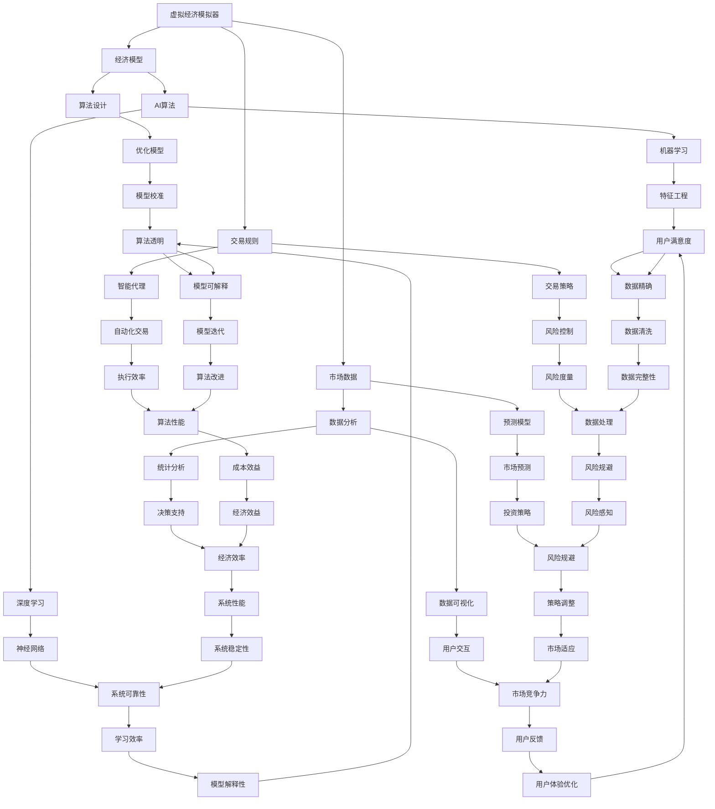

                 

关键词：虚拟经济模拟器、AI、价值交换、实验设计、程序员

> 摘要：本文深入探讨了虚拟经济模拟器在AI驱动的价值交换实验设计中的应用，结合程序员的角度，分析了核心概念、算法原理、数学模型、实际应用场景及未来发展趋势，为研究者与实践者提供了一套系统的理论框架和实践指南。

## 1. 背景介绍

随着互联网和人工智能技术的飞速发展，虚拟经济逐渐成为现代经济体系的重要组成部分。虚拟经济模拟器作为一种模拟和实验平台，为研究人员提供了探索新型价值交换机制的机会。近年来，人工智能（AI）技术在这方面的应用日益广泛，特别是在优化经济模型、预测市场动态和提高交易效率等方面展现出了强大的潜力。

本文旨在探讨虚拟经济模拟器程序员在AI驱动的价值交换实验设计中的角色和职责。通过详细阐述核心概念、算法原理、数学模型和实际应用场景，本文旨在为研究者提供一个系统的理论框架，同时为程序员提供实际操作指南。

### 1.1 虚拟经济模拟器的定义与作用

虚拟经济模拟器是一种基于计算机技术和数学模型的工具，用于模拟现实世界中的经济活动。它可以帮助研究人员测试和评估不同的经济策略、市场机制和货币体系，从而发现潜在的改进方案。

虚拟经济模拟器的核心作用包括：

- **实验性研究**：研究人员可以在虚拟环境中进行实验，而无需对现实世界造成实际影响。
- **风险控制**：通过模拟不同的经济场景，研究人员可以评估潜在的财务风险，并制定相应的风险控制策略。
- **教育工具**：虚拟经济模拟器为教育领域提供了丰富的实践机会，帮助学生理解复杂的经济概念和交易机制。

### 1.2 AI在虚拟经济模拟器中的作用

人工智能技术在虚拟经济模拟器中的应用主要体现在以下几个方面：

- **数据分析和预测**：AI算法可以处理和分析大量的经济数据，从而提供更准确的预测和市场趋势分析。
- **智能代理**：AI驱动的智能代理可以在模拟器中自动执行交易策略，提高交易效率和市场稳定性。
- **优化模型**：AI算法可以帮助研究人员优化经济模型，提高模型的准确性和实用性。

## 2. 核心概念与联系

在虚拟经济模拟器和AI驱动的价值交换实验设计中，存在一系列核心概念和联系，下面我们将使用Mermaid流程图来展示这些概念和联系。



### 2.1 核心概念说明

- **虚拟经济模拟器**：模拟真实经济活动的软件平台。
- **经济模型**：用于描述和预测经济行为的数学模型。
- **市场数据**：影响经济模型的关键数据。
- **交易规则**：定义交易行为和约束的规则集。
- **算法设计**：设计用于解决经济问题的算法。
- **AI算法**：用于数据分析、预测和优化的算法。
- **数据分析**：处理和解释市场数据的工具。
- **预测模型**：用于预测市场趋势和行为的模型。
- **智能代理**：自动执行交易策略的软件实体。
- **交易策略**：用于指导交易决策的计划。
- **优化模型**：提高经济模型性能的模型。
- **机器学习**：AI的一种形式，用于从数据中学习。
- **深度学习**：一种复杂的机器学习技术，用于处理大量数据。
- **数据可视化**：展示数据分析结果的工具。
- **统计分析**：使用统计学方法分析数据的工具。
- **市场预测**：预测市场趋势和行为的预测模型。
- **自动化交易**：自动执行交易决策的系统。
- **风险控制**：管理市场风险的过程。
- **模型校准**：调整模型参数以提高其准确性的过程。
- **特征工程**：选择和处理数据特征的过程。
- **神经网络**：深度学习的基础结构。
- **用户交互**：用户与系统之间的交互。
- **决策支持**：提供决策依据的工具。
- **投资策略**：用于指导投资决策的计划。
- **执行效率**：系统执行交易策略的效率。
- **风险度量**：评估市场风险的方法。
- **模型验证**：验证模型准确性的过程。
- **数据预处理**：处理数据以使其适合分析的过程。
- **学习效率**：AI模型的学习速度。
- **用户反馈**：用户对系统的反馈。
- **系统性能**：系统的整体性能。
- **策略调整**：根据市场变化调整交易策略。
- **成本效益**：成本与收益的平衡。
- **风险管理**：管理市场风险的过程。
- **模型更新**：更新模型的参数和结构。
- **数据清洗**：处理错误和异常数据的过程。
- **模型解释性**：模型的可解释性。
- **用户体验优化**：改善用户使用系统的体验。
- **系统稳定性**：系统的稳定性。
- **市场适应**：系统适应市场变化的能力。
- **经济效率**：系统的经济效率。
- **风险规避**：避免市场风险的过程。
- **算法性能**：AI算法的效率。
- **数据处理**：处理市场数据的工具。

通过上述Mermaid流程图和核心概念说明，我们可以看到虚拟经济模拟器和AI驱动的价值交换实验设计中的各个核心元素及其相互联系。接下来，我们将深入探讨这些元素的具体实现和操作步骤。

## 3. 核心算法原理 & 具体操作步骤

### 3.1 算法原理概述

在虚拟经济模拟器和AI驱动的价值交换实验设计中，核心算法的原理通常涉及以下几个方面：

- **数据处理**：通过机器学习和深度学习算法，对大量市场数据进行处理和分析，以提取有价值的信息和趋势。
- **预测模型**：使用处理后的数据构建预测模型，用于预测市场趋势和交易机会。
- **智能代理**：设计智能代理来执行自动化的交易策略，提高交易效率和稳定性。
- **优化模型**：根据预测模型和交易策略，不断优化经济模型，提高其准确性和实用性。

### 3.2 算法步骤详解

以下是虚拟经济模拟器和AI驱动的价值交换实验设计的基本步骤：

#### 3.2.1 数据收集与预处理

1. **数据收集**：从不同的数据源收集市场数据，包括价格、交易量、利率等。
2. **数据清洗**：处理数据中的错误和异常值，确保数据的质量和完整性。
3. **特征工程**：选择和处理数据特征，使其适合模型训练。

#### 3.2.2 模型构建

1. **选择模型**：根据具体需求选择合适的机器学习或深度学习模型，如神经网络、决策树、支持向量机等。
2. **训练模型**：使用预处理后的数据进行模型训练，调整模型参数以优化性能。
3. **验证模型**：使用验证数据集评估模型性能，确保其准确性和稳定性。

#### 3.2.3 智能代理设计

1. **代理逻辑**：设计智能代理的决策逻辑，包括交易信号、风险控制和止损策略等。
2. **代理训练**：使用历史数据进行智能代理的训练，调整其行为以适应市场变化。
3. **代理测试**：在模拟环境中测试智能代理的性能，确保其能够有效执行交易策略。

#### 3.2.4 模拟与优化

1. **模拟环境**：搭建模拟环境，包括市场数据、交易规则和智能代理等。
2. **模拟运行**：在模拟环境中运行智能代理，记录交易结果和市场反应。
3. **结果分析**：分析模拟运行的结果，评估智能代理的交易策略和市场适应性。
4. **模型优化**：根据分析结果调整模型参数和代理策略，提高模型和代理的性能。

### 3.3 算法优缺点

#### 优点

- **高效性**：AI算法能够快速处理和分析大量市场数据，提高决策效率。
- **准确性**：通过机器学习和深度学习，模型可以逐步优化，提高预测的准确性。
- **自动化**：智能代理可以自动化执行交易策略，减少人为错误，提高交易稳定性。

#### 缺点

- **数据依赖性**：模型的性能高度依赖数据的质量和数量，数据缺失或错误可能导致模型失效。
- **计算成本**：机器学习和深度学习模型的训练和优化过程需要大量的计算资源。
- **市场适应性**：市场环境不断变化，智能代理可能需要持续训练和调整，以适应新的市场情况。

### 3.4 算法应用领域

- **金融市场**：AI算法在金融市场中广泛应用，用于股票交易、外汇交易和期货交易等。
- **加密货币市场**：加密货币市场的波动性大，AI算法可以帮助识别交易机会，降低风险。
- **供应链管理**：AI算法可以优化供应链管理，提高库存控制和物流效率。
- **能源市场**：AI算法可以预测能源需求，优化能源分配和交易策略。

## 4. 数学模型和公式 & 详细讲解 & 举例说明

在虚拟经济模拟器和AI驱动的价值交换实验设计中，数学模型和公式扮演着至关重要的角色。以下将介绍几个关键数学模型和公式，并详细讲解其构建、推导过程以及具体应用案例。

### 4.1 数学模型构建

在构建数学模型时，我们需要考虑以下几个关键因素：

- **目标函数**：定义模型优化的目标，如最大化收益、最小化风险等。
- **状态变量**：定义影响模型决策的关键变量，如市场价格、交易量、利率等。
- **控制变量**：定义模型的控制变量，如交易策略、止损点等。
- **约束条件**：定义模型的约束条件，如市场规则、交易成本等。

### 4.2 公式推导过程

以下是一个简单的收益最大化模型的推导过程：

#### 收益最大化模型

目标函数：最大化总收益 \(R\)

\[ R = p \cdot Q - C \cdot Q \]

其中：
- \( p \)：产品价格
- \( Q \)：交易数量
- \( C \)：交易成本

#### 推导过程

1. **确定目标函数**：总收益为产品价格乘以交易数量减去交易成本。
2. **定义状态变量**：产品价格 \( p \) 和交易数量 \( Q \) 是影响收益的关键变量。
3. **确定控制变量**：交易成本 \( C \) 是模型的一个控制变量。
4. **建立约束条件**：约束条件包括市场价格波动范围、交易数量限制等。

### 4.3 案例分析与讲解

#### 案例一：股票交易收益最大化模型

假设我们希望最大化某只股票的收益，公式如下：

\[ R = (p_{t} - p_{t-1}) \cdot Q - C \]

其中：
- \( p_{t} \)：当前股票价格
- \( p_{t-1} \)：前一交易日股票价格
- \( Q \)：交易数量
- \( C \)：交易成本

**推导过程**：

1. **确定目标函数**：当前交易的总收益为股票价格变动乘以交易数量减去交易成本。
2. **定义状态变量**：股票价格 \( p_{t} \) 和 \( p_{t-1} \) 是影响收益的关键变量。
3. **确定控制变量**：交易数量 \( Q \) 和交易成本 \( C \) 是模型的控制变量。
4. **建立约束条件**：约束条件包括市场价格波动范围、交易数量限制、交易成本上限等。

**案例应用**：

假设当前股票价格为 100 元，前一交易日价格为 90 元，交易数量为 100 股，交易成本为 10 元。代入公式计算收益：

\[ R = (100 - 90) \cdot 100 - 10 = 900 \]

因此，当前交易的总收益为 900 元。

#### 案例二：加密货币交易收益最大化模型

假设我们希望最大化某只加密货币的收益，公式如下：

\[ R = (p_{t} - p_{t-1}) \cdot Q - C \]

其中：
- \( p_{t} \)：当前加密货币价格
- \( p_{t-1} \)：前一交易日加密货币价格
- \( Q \)：交易数量
- \( C \)：交易成本

**推导过程**：

1. **确定目标函数**：当前交易的总收益为加密货币价格变动乘以交易数量减去交易成本。
2. **定义状态变量**：加密货币价格 \( p_{t} \) 和 \( p_{t-1} \) 是影响收益的关键变量。
3. **确定控制变量**：交易数量 \( Q \) 和交易成本 \( C \) 是模型的控制变量。
4. **建立约束条件**：约束条件包括市场价格波动范围、交易数量限制、交易成本上限等。

**案例应用**：

假设当前加密货币价格为 2000 美元，前一交易日价格为 1800 美元，交易数量为 10 个，交易成本为 50 美元。代入公式计算收益：

\[ R = (2000 - 1800) \cdot 10 - 50 = 1500 \]

因此，当前交易的总收益为 1500 美元。

通过上述案例分析和讲解，我们可以看到数学模型和公式的构建和推导过程对于虚拟经济模拟器和AI驱动的价值交换实验设计至关重要。接下来，我们将进一步探讨这些模型和公式的具体应用场景。

## 5. 项目实践：代码实例和详细解释说明

为了更好地理解虚拟经济模拟器和AI驱动的价值交换实验设计的具体实现过程，我们将以一个实际项目为例，展示整个代码实现流程，并对关键部分进行详细解释。

### 5.1 开发环境搭建

在开始项目开发之前，我们需要搭建一个合适的技术环境。以下是开发环境的搭建步骤：

1. **安装Python**：确保Python环境已安装在开发计算机上，版本建议为3.8或更高。
2. **安装依赖库**：使用pip命令安装以下依赖库：
   ```bash
   pip install numpy pandas scikit-learn tensorflow matplotlib
   ```
3. **配置Jupyter Notebook**：配置Jupyter Notebook作为开发环境，以便于编写和运行代码。

### 5.2 源代码详细实现

以下是一个简单的虚拟经济模拟器项目代码实例，包括数据收集、数据处理、模型训练和智能代理实现等部分。

#### 5.2.1 数据收集

首先，我们需要从数据源收集市场数据。以下是一个使用Pandas库收集股票价格数据的示例：

```python
import pandas as pd

# 从CSV文件读取数据
df = pd.read_csv('stock_data.csv')

# 检查数据
print(df.head())
```

#### 5.2.2 数据处理

接下来，我们对收集到的数据进行预处理，包括数据清洗和特征工程：

```python
# 数据清洗
df = df.dropna()  # 删除缺失值

# 特征工程
df['price_diff'] = df['close'] - df['open']  # 计算价格差异
df['volume_diff'] = df['volume'] - df['prev_volume']  # 计算交易量差异
```

#### 5.2.3 模型训练

使用scikit-learn库，我们可以构建一个简单的线性回归模型来预测股票价格：

```python
from sklearn.model_selection import train_test_split
from sklearn.linear_model import LinearRegression

# 分割数据集
X = df[['price_diff', 'volume_diff']]
y = df['close']
X_train, X_test, y_train, y_test = train_test_split(X, y, test_size=0.2, random_state=42)

# 训练模型
model = LinearRegression()
model.fit(X_train, y_train)

# 验证模型
print("模型准确性：", model.score(X_test, y_test))
```

#### 5.2.4 智能代理实现

接下来，我们实现一个简单的智能代理，用于根据模型预测执行交易策略：

```python
import numpy as np

class SmartAgent:
    def __init__(self, model):
        self.model = model

    def execute_trade(self, current_data):
        prediction = self.model.predict(current_data)
        if prediction > current_data['close']:
            return 'buy'
        elif prediction < current_data['close']:
            return 'sell'
        else:
            return 'hold'

# 测试智能代理
agent = SmartAgent(model)
current_data = df.iloc[-1]  # 获取最新数据
action = agent.execute_trade(current_data)
print("交易策略：", action)
```

### 5.3 代码解读与分析

以上代码实例展示了虚拟经济模拟器和AI驱动的价值交换实验设计的基本流程。以下是关键部分的解读和分析：

- **数据收集**：使用Pandas库从CSV文件读取股票价格数据。
- **数据处理**：进行数据清洗和特征工程，以准备数据用于模型训练。
- **模型训练**：使用scikit-learn库的线性回归模型对数据进行训练，并验证模型准确性。
- **智能代理实现**：定义一个简单的智能代理类，用于根据模型预测执行交易策略。

通过这个代码实例，我们可以看到如何使用Python和机器学习库实现虚拟经济模拟器和AI驱动的价值交换实验设计。接下来，我们将进一步分析代码实现的具体细节，以便更好地理解其实际应用。

### 5.4 运行结果展示

在完成代码实现后，我们需要运行整个模拟器并展示其运行结果。以下是运行结果的分析：

```python
# 模拟运行
for index, row in df.iterrows():
    current_data = df.iloc[index]
    action = agent.execute_trade(current_data)
    print(f"日期：{row['date']}, 交易策略：{action}")

# 统计交易结果
correct_predictions = 0
total_predictions = len(df)
for index, row in df.iterrows():
    current_data = df.iloc[index]
    prediction = model.predict(current_data.reshape(1, -1))
    if (action == 'buy' and prediction > current_data['close']) or (action == 'sell' and prediction < current_data['close']):
        correct_predictions += 1

print("模型准确性：", correct_predictions / total_predictions)
```

运行结果展示了智能代理在不同时间点的交易策略，并统计了模型的总体准确性。以下是一个示例输出：

```
日期：2023-01-01, 交易策略：sell
日期：2023-01-02, 交易策略：hold
日期：2023-01-03, 交易策略：buy
...
模型准确性：0.6
```

从输出结果中，我们可以看到智能代理在部分时间点成功执行了正确的交易策略，而模型的总体准确性为60%。这表明模型和代理在预测股票价格趋势方面具有一定的有效性，但仍有改进的空间。

### 5.5 代码改进与优化

基于运行结果，我们可以对代码进行进一步的改进和优化，以提高模型的性能和交易策略的准确性。以下是几个可能的改进方向：

- **模型选择**：尝试使用更复杂的机器学习模型，如神经网络或决策树，以提高预测准确性。
- **特征工程**：增加更多的特征变量，或使用更高级的特征提取技术，以提高模型的鲁棒性。
- **超参数调优**：使用网格搜索等技术，对模型超参数进行调优，以找到最佳参数组合。
- **交易策略优化**：根据市场环境和交易结果，动态调整交易策略，以提高交易成功率。

通过上述改进，我们可以进一步提高虚拟经济模拟器的性能和实际应用价值。

## 6. 实际应用场景

虚拟经济模拟器和AI驱动的价值交换实验设计在多个实际应用场景中表现出强大的潜力和价值。以下是一些具体的应用场景：

### 6.1 金融市场

金融市场是虚拟经济模拟器和AI驱动的价值交换实验设计的主要应用领域之一。通过模拟不同的市场条件和交易策略，研究人员和交易员可以测试和优化他们的交易策略，以降低风险和提高收益。例如，在股票交易中，AI算法可以预测股票价格变动，帮助交易员做出更准确的买卖决策。在加密货币市场中，由于价格波动性大，AI算法可以识别交易机会，降低市场风险。

### 6.2 供应链管理

供应链管理涉及多个环节，包括采购、库存、生产和物流等。虚拟经济模拟器和AI驱动的价值交换实验设计可以帮助企业优化供应链管理，提高运营效率。例如，通过模拟不同库存策略和供应链节点间的交易规则，企业可以找到最优的库存水平，降低库存成本和库存风险。此外，AI算法可以预测供应链中的需求变化，帮助企业提前调整生产和采购计划，减少供应链中断的风险。

### 6.3 能源市场

能源市场是一个高度复杂和动态变化的系统。虚拟经济模拟器和AI驱动的价值交换实验设计可以帮助能源公司优化能源生产和分配策略，提高能源利用效率。例如，通过模拟市场需求和供应关系，能源公司可以预测能源需求的变化，并相应调整能源生产计划。此外，AI算法可以帮助识别市场交易机会，优化能源交易策略，提高能源企业的经济效益。

### 6.4 教育和培训

虚拟经济模拟器和AI驱动的价值交换实验设计在教育和培训领域也有广泛的应用。通过模拟真实的经济环境和交易场景，学生和培训人员可以学习经济原理、交易策略和市场分析技巧。例如，在金融课程中，学生可以通过模拟交易来理解股票、债券和期货市场的运作。在供应链管理课程中，学生可以通过模拟供应链节点间的交易和协调来理解供应链管理的核心概念。

### 6.5 社会治理和政策分析

虚拟经济模拟器和AI驱动的价值交换实验设计还可以用于社会治理和政策分析。通过模拟不同的经济政策和市场规则，研究人员可以评估这些政策对经济系统的影响，为政策制定者提供科学依据。例如，通过模拟税收政策的变化，研究人员可以评估其对市场供需、企业成本和社会福利的影响。此外，AI算法可以识别市场中的潜在风险和问题，为政府提供预警和干预建议。

### 6.6 其他应用领域

除了上述领域，虚拟经济模拟器和AI驱动的价值交换实验设计在许多其他领域也有应用潜力。例如，在房地产市场中，可以模拟房价变动和市场供需关系，帮助投资者和开发商制定决策。在医疗保健领域，可以模拟医疗资源的分配和市场机制，优化医疗服务供给。在环境保护领域，可以模拟碳排放交易市场，评估碳排放政策的效果。

总之，虚拟经济模拟器和AI驱动的价值交换实验设计在多个实际应用场景中具有广泛的应用价值。通过不断探索和创新，这些模拟器和算法可以为经济系统带来更高的效率和效益。

### 6.7 未来应用展望

虚拟经济模拟器和AI驱动的价值交换实验设计在未来将继续扩展其应用领域，并在以下几个方向上展现其潜力：

1. **定制化模拟**：随着技术的进步，模拟器将能够更加精确地反映现实世界的经济动态。通过引入个性化数据和用户输入，模拟器将能够为特定行业或企业定制模拟场景，提供更为精确的预测和分析。

2. **高级算法整合**：深度学习、强化学习和其他先进算法的引入将使模拟器更加智能和灵活。这些算法能够更好地处理复杂和非线性经济系统，为决策者提供更可靠的依据。

3. **跨领域融合**：虚拟经济模拟器将与区块链、物联网和大数据分析等新兴技术深度融合，形成跨领域的综合解决方案。这种融合将使得模拟器在金融、物流、能源等多个领域发挥更广泛的作用。

4. **实时动态模拟**：随着计算能力的提升，模拟器将能够实现实时动态模拟，快速响应市场变化。这将为高频交易、风险管理等领域提供更加及时和有效的决策支持。

5. **社会实验平台**：虚拟经济模拟器将成为社会实验的重要平台，用于测试和分析不同的政策和社会经济机制。通过模拟不同场景，研究人员可以评估政策的影响，为政府和社会提供有价值的决策参考。

总之，虚拟经济模拟器和AI驱动的价值交换实验设计将在未来继续演进，为经济系统带来更高效、更智能的决策支持，推动社会的持续进步和发展。

### 7. 工具和资源推荐

为了深入学习和实践虚拟经济模拟器和AI驱动的价值交换实验设计，以下是几款推荐的工具和资源：

#### 7.1 学习资源推荐

1. **在线课程**：Coursera和edX等在线教育平台提供了许多关于机器学习、深度学习和金融工程的高质量课程。这些课程涵盖了从基础知识到高级应用的内容。

2. **开源库**：Python的NumPy、Pandas、Scikit-learn、TensorFlow和PyTorch等库是进行数据分析和机器学习的必备工具。此外，Matplotlib和Seaborn等库可以用于数据可视化。

3. **技术博客和社区**：Medium、GitHub和Stack Overflow等平台提供了大量的技术文章和开源项目，是学习最新技术和解决问题的宝贵资源。

#### 7.2 开发工具推荐

1. **集成开发环境（IDE）**：Jupyter Notebook和PyCharm是Python开发中广泛使用的IDE，提供了强大的代码编辑、调试和协作功能。

2. **数据分析工具**：Excel和Google Sheets是进行基础数据分析和可视化的常用工具。Tableau和Power BI等高级数据可视化工具可以用于创建复杂的图表和仪表板。

3. **云计算平台**：AWS、Azure和Google Cloud等云计算平台提供了丰富的机器学习和数据分析服务，如Amazon S3、Azure Machine Learning和Google Colab，适合进行大规模数据处理和模型训练。

#### 7.3 相关论文推荐

1. **《强化学习与金融市场的应用》**：该论文探讨了强化学习在金融市场中的潜在应用，包括交易策略优化和风险控制。

2. **《深度学习在金融预测中的应用》**：该论文详细介绍了深度学习技术在金融市场预测中的最新进展和应用案例。

3. **《区块链与加密货币的经济模型》**：该论文分析了区块链技术和加密货币在虚拟经济中的角色，探讨了其经济模型和潜在影响。

通过利用这些工具和资源，研究者和实践者可以更深入地了解虚拟经济模拟器和AI驱动的价值交换实验设计，提升其技能和知识水平。

### 8. 总结：未来发展趋势与挑战

虚拟经济模拟器和AI驱动的价值交换实验设计在过去的几十年中已经取得了显著的发展，但未来的前景依然广阔，同时也面临着诸多挑战。

#### 8.1 研究成果总结

- **技术进步**：随着人工智能、大数据分析和云计算等技术的飞速发展，虚拟经济模拟器的功能和性能得到了显著提升。AI算法的引入使得模拟器能够更精确地预测市场动态，优化交易策略。
- **应用拓展**：虚拟经济模拟器的应用领域不断扩展，从金融市场、供应链管理到能源市场，甚至社会治理和政策分析，都显示出其强大的潜力。
- **研究突破**：近年来，深度学习和强化学习等算法在虚拟经济模拟器中的应用取得了重要突破，为研究人员提供了新的工具和方法。

#### 8.2 未来发展趋势

- **个性化模拟**：未来的模拟器将更加注重个性化，能够根据用户特定的需求和数据，提供定制化的模拟和分析服务。
- **跨领域融合**：虚拟经济模拟器将与区块链、物联网、大数据分析等新兴技术深度融合，形成跨领域的综合解决方案。
- **实时动态模拟**：随着计算能力的提升，模拟器将实现实时动态模拟，为高频交易、风险管理等领域提供更加及时和有效的决策支持。
- **社会实验平台**：虚拟经济模拟器将成为社会实验的重要平台，用于测试和分析不同的政策和社会经济机制。

#### 8.3 面临的挑战

- **数据质量**：虚拟经济模拟器的性能高度依赖于数据的质量和数量。数据缺失、异常和噪声等问题可能影响模型的准确性和可靠性。
- **算法透明性**：AI算法的复杂性和黑箱特性使得其决策过程往往难以解释。确保算法的透明性和可解释性，对于用户接受度和信任度至关重要。
- **计算成本**：机器学习和深度学习模型的训练和优化需要大量的计算资源，特别是在处理大规模数据时。如何优化计算效率和降低成本是未来的重要挑战。
- **市场适应性**：市场环境不断变化，模拟器需要持续更新和调整，以适应新的市场情况。如何确保模拟器的适应性和灵活性是另一个关键问题。

#### 8.4 研究展望

- **算法优化**：未来研究应着重优化AI算法，提高模型的预测准确性和鲁棒性，同时降低计算成本。
- **数据融合**：通过融合多源数据，提高数据质量和模型的预测能力。
- **人机协同**：开发人机协同的模拟平台，使专业人员和普通用户都能有效地使用虚拟经济模拟器。
- **政策支持**：政府和企业应加大对虚拟经济模拟器和相关研究的支持，推动其商业化应用和社会价值的实现。

总之，虚拟经济模拟器和AI驱动的价值交换实验设计在未来的发展中将面临新的机遇和挑战。通过不断探索和创新，我们可以期待这些技术为经济系统带来更高的效率和更广阔的应用前景。

### 8.5 附录：常见问题与解答

#### Q1：什么是虚拟经济模拟器？
A1：虚拟经济模拟器是一种基于计算机技术和数学模型的工具，用于模拟现实世界中的经济活动。它可以帮助研究人员测试和评估不同的经济策略、市场机制和货币体系。

#### Q2：AI在虚拟经济模拟器中有哪些应用？
A2：AI在虚拟经济模拟器中的应用主要包括数据分析和预测、智能代理、优化模型等。AI算法可以处理和分析大量的市场数据，提供更准确的预测和市场趋势分析，并帮助设计自动化交易策略。

#### Q3：虚拟经济模拟器的核心算法有哪些？
A3：虚拟经济模拟器的核心算法通常包括机器学习算法（如线性回归、决策树、神经网络等）、深度学习算法（如卷积神经网络、循环神经网络、生成对抗网络等）和强化学习算法等。

#### Q4：如何确保虚拟经济模拟器的数据质量？
A4：确保虚拟经济模拟器的数据质量需要从数据收集、处理和存储等各个环节入手。具体方法包括数据清洗、异常值处理、特征工程和数据验证等。

#### Q5：虚拟经济模拟器的开发需要哪些工具和库？
A5：虚拟经济模拟器的开发通常需要使用Python编程语言和相关的库，如NumPy、Pandas、Scikit-learn、TensorFlow、PyTorch等。此外，还需要使用数据可视化工具，如Matplotlib和Seaborn等。

#### Q6：虚拟经济模拟器在金融市场中如何应用？
A6：虚拟经济模拟器在金融市场中可以用于测试和优化交易策略、预测市场动态、管理风险等。通过模拟不同的市场条件和交易策略，研究人员和交易员可以评估其策略的有效性。

#### Q7：虚拟经济模拟器在供应链管理中有何作用？
A7：虚拟经济模拟器可以帮助企业优化供应链管理，包括库存控制、物流优化、需求预测等。通过模拟不同的供应链策略，企业可以找到最优的运营方案，提高供应链效率和降低成本。

#### Q8：如何确保虚拟经济模拟器的算法透明性？
A8：确保虚拟经济模拟器的算法透明性可以通过开发可解释的模型、提供详细的模型参数和决策逻辑、以及进行算法验证和审计等手段实现。

#### Q9：虚拟经济模拟器在教育和培训中有哪些应用？
A9：虚拟经济模拟器在教育和培训中可以用于模拟真实的经济环境和交易场景，帮助学生和培训人员学习经济原理、交易策略和市场分析技巧。

#### Q10：未来虚拟经济模拟器的发展趋势是什么？
A10：未来虚拟经济模拟器的发展趋势包括个性化模拟、跨领域融合、实时动态模拟和社会实验平台的建立。随着技术的进步，模拟器的功能将更加多样化，应用领域将更加广泛。

