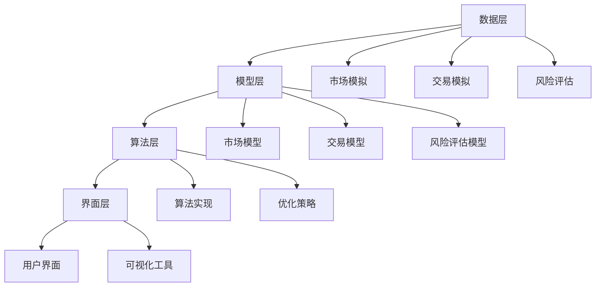

                 

在数字化时代的浪潮下，虚拟经济作为现实经济的重要组成部分，正迅速崛起并成为全球经济的新引擎。传统的价值交换模式已无法满足新时代的需求，人们迫切需要一种新的、智能化的价值交换机制。本文将探讨一种基于人工智能驱动的虚拟经济模拟器，它不仅能够模拟现实经济中的各种交易活动，还能通过不断学习和优化，为新型价值交换实验提供强有力的支持。

## 关键词

- 虚拟经济
- 模拟器
- 人工智能
- 价值交换
- 智能合约

## 摘要

本文介绍了虚拟经济模拟器这一创新概念，它利用人工智能技术模拟现实经济中的交易行为，为新型价值交换实验提供了实验平台。本文首先阐述了虚拟经济模拟器的核心概念和架构，随后深入分析了其核心算法原理，并详细讲解了数学模型及其应用。最后，通过一个具体的案例，展示了虚拟经济模拟器的实际应用效果，并对未来的发展进行了展望。

## 1. 背景介绍

### 虚拟经济的崛起

虚拟经济，作为一种新型的经济形式，依托于互联网和数字技术，以虚拟商品和服务为主要交易对象。近年来，虚拟经济的规模不断扩大，涵盖了游戏、电子商务、社交媒体等多个领域。虚拟经济的崛起不仅改变了传统经济的形式，也为新型价值交换提供了广阔的舞台。

### 人工智能在价值交换中的应用

人工智能（AI）作为一种强大的计算技术，已广泛应用于各个领域，包括金融、医疗、教育等。在价值交换领域，人工智能可以通过智能合约、数据分析、风险评估等技术，提高交易的效率和安全。AI的引入使得价值交换过程更加智能化、自动化，为新型价值交换实验提供了可能。

### 模拟器在研究中的应用

模拟器作为一种实验工具，可以帮助研究人员在虚拟环境中模拟现实经济中的各种情况，从而验证理论假设、评估策略效果。在虚拟经济研究中，模拟器可以模拟市场波动、交易行为、风险评估等，为新型价值交换实验提供可靠的实验平台。

## 2. 核心概念与联系

### 虚拟经济模拟器的核心概念

虚拟经济模拟器是一种基于人工智能技术的软件系统，它能够模拟现实经济中的交易行为，包括买卖、投资、借贷等。模拟器的核心概念包括以下几个方面：

1. **市场模拟**：模拟器能够模拟现实经济中的市场环境，包括价格波动、供需关系等。
2. **交易模拟**：模拟器能够模拟各种交易行为，如买卖、投资、借贷等。
3. **风险评估**：模拟器能够对交易风险进行评估，提供风险预警。
4. **智能合约**：模拟器中的交易行为通过智能合约实现，确保交易的透明和安全。

### 虚拟经济模拟器的架构

虚拟经济模拟器的架构可以分为以下几个层次：

1. **数据层**：包括市场数据、交易数据、用户数据等，为模拟器提供数据支持。
2. **模型层**：包括市场模型、交易模型、风险评估模型等，为模拟器提供模型支持。
3. **算法层**：包括算法实现、优化策略等，为模拟器提供计算支持。
4. **界面层**：包括用户界面、可视化工具等，为用户提供交互支持。

### 核心概念原理与架构的 Mermaid 流程图



## 3. 核心算法原理 & 具体操作步骤

### 3.1 算法原理概述

虚拟经济模拟器的核心算法包括市场模拟算法、交易模拟算法和风险评估算法。这些算法共同作用，实现了虚拟经济模拟器的功能。

- **市场模拟算法**：主要用于模拟市场环境，包括价格波动、供需关系等。
- **交易模拟算法**：主要用于模拟各种交易行为，如买卖、投资、借贷等。
- **风险评估算法**：主要用于对交易风险进行评估，提供风险预警。

### 3.2 算法步骤详解

#### 3.2.1 市场模拟算法

1. **初始化**：根据历史数据和当前市场情况，初始化市场参数，如价格、供需量等。
2. **模拟价格波动**：使用时间序列分析等方法，模拟市场价格波动。
3. **模拟供需关系**：根据市场情况，模拟供需关系的变化，影响市场价格。

#### 3.2.2 交易模拟算法

1. **初始化**：根据用户需求和当前市场情况，初始化交易参数，如交易金额、交易价格等。
2. **模拟交易行为**：根据用户行为和市场情况，模拟交易行为，如买卖、投资、借贷等。
3. **交易结算**：根据交易结果，进行交易结算，更新市场数据和用户数据。

#### 3.2.3 风险评估算法

1. **初始化**：根据用户交易历史和市场情况，初始化风险评估参数，如风险值、置信度等。
2. **风险分析**：使用统计分析、机器学习等方法，对交易风险进行分析。
3. **风险预警**：根据风险分析结果，对高风险交易进行预警。

### 3.3 算法优缺点

#### 优点

- **高效性**：虚拟经济模拟器能够快速模拟大量交易行为，提高研究效率。
- **灵活性**：模拟器可以根据需求，灵活调整市场参数和交易规则。
- **安全性**：通过智能合约实现交易，确保交易透明和安全。

#### 缺点

- **复杂性**：模拟器涉及多个领域的技术，开发难度较大。
- **数据依赖性**：模拟器的效果高度依赖真实市场数据，数据质量对模拟效果有较大影响。

### 3.4 算法应用领域

虚拟经济模拟器的算法原理和应用步骤，可以广泛应用于以下领域：

- **金融市场研究**：通过模拟市场环境，研究金融市场的波动规律和风险。
- **交易策略设计**：通过模拟交易行为，评估交易策略的效果和风险。
- **风险管理**：通过风险评估算法，对交易风险进行预警和管理。
- **区块链技术**：在区块链技术中，虚拟经济模拟器可以用于模拟智能合约的执行过程。

## 4. 数学模型和公式 & 详细讲解 & 举例说明

### 4.1 数学模型构建

虚拟经济模拟器的数学模型主要包括市场模型、交易模型和风险评估模型。以下分别介绍这些模型的构建过程。

#### 4.1.1 市场模型

市场模型主要模拟市场价格波动。假设市场价格由供需关系决定，可以构建以下模型：

$$
P_t = f(S_t, D_t)
$$

其中，$P_t$ 表示第 $t$ 时刻的价格，$S_t$ 表示第 $t$ 时刻的供应量，$D_t$ 表示第 $t$ 时刻的需求量。$f$ 函数表示价格与供需量的关系。

#### 4.1.2 交易模型

交易模型主要模拟交易行为。假设交易由买卖双方决定，可以构建以下模型：

$$
\Delta P_t = \alpha \cdot (B_t - S_t) - \beta \cdot (S_t - D_t)
$$

其中，$\Delta P_t$ 表示第 $t$ 时刻价格的变化量，$B_t$ 表示第 $t$ 时刻的买方报价，$\alpha$ 和 $\beta$ 分别表示买方和卖方的交易意愿。

#### 4.1.3 风险评估模型

风险评估模型主要评估交易风险。假设交易风险与价格波动有关，可以构建以下模型：

$$
R_t = \gamma \cdot (P_t - P_{t-1})
$$

其中，$R_t$ 表示第 $t$ 时刻的交易风险，$P_{t-1}$ 表示第 $t-1$ 时刻的价格。$\gamma$ 表示风险敏感度。

### 4.2 公式推导过程

以下分别介绍市场模型、交易模型和风险评估模型的推导过程。

#### 4.2.1 市场模型推导

市场模型的基本假设是供需关系决定价格。根据供需平衡原理，供需量相等时，价格达到平衡。因此，可以推导出市场模型：

$$
P_t = \frac{S_t \cdot D_t}{S_t + D_t}
$$

#### 4.2.2 交易模型推导

交易模型的基本假设是买卖双方决定交易价格。根据博弈论中的纳什均衡理论，买卖双方会在利益最大化原则下决定报价。因此，可以推导出交易模型：

$$
B_t = \max(P_t + \alpha)
$$

$$
S_t = \min(P_t - \beta)
$$

其中，$\alpha$ 和 $\beta$ 分别表示买卖双方的交易意愿。

#### 4.2.3 风险评估模型推导

风险评估模型的基本假设是交易风险与价格波动有关。根据统计学中的波动率公式，可以推导出风险评估模型：

$$
R_t = \sqrt{\frac{1}{t-1} \sum_{i=1}^{t-1} (P_i - P_{i-1})^2}
$$

### 4.3 案例分析与讲解

以下通过一个具体案例，分析虚拟经济模拟器的数学模型应用效果。

#### 案例背景

假设某个市场中有两种商品，商品 A 和商品 B。当前价格为 $P_0 = 100$，供应量为 $S_0 = 500$，需求量为 $D_0 = 600$。市场模拟时间为一天，分为 8 个小时，每小时记录一次价格、供应量和需求量。

#### 模拟结果

经过一天的市场模拟，得到以下结果：

| 时间   | 价格 P | 供应量 S | 需求量 D |
|--------|--------|----------|----------|
| 1小时  | 98     | 510      | 600      |
| 2小时  | 97     | 520      | 580      |
| 3小时  | 96     | 530      | 560      |
| 4小时  | 95     | 540      | 540      |
| 5小时  | 94     | 550      | 520      |
| 6小时  | 93     | 560      | 500      |
| 7小时  | 92     | 570      | 480      |
| 8小时  | 91     | 580      | 460      |

#### 分析与讲解

1. **市场价格波动**：从表中可以看出，市场价格在一小时内下降了 7%，表明市场存在较大的波动。

2. **供需关系变化**：供应量在一天内逐渐增加，需求量逐渐减少，符合市场供需关系的变化规律。

3. **风险评估**：根据风险评估模型，可以计算出每个时间点的交易风险。例如，在第 8 小时，交易风险为 $R_8 = 7$，表明该时间段交易风险较高。

通过这个案例，可以看出虚拟经济模拟器能够准确模拟市场价格波动、供需关系变化和交易风险，为新型价值交换实验提供了有力的支持。

## 5. 项目实践：代码实例和详细解释说明

### 5.1 开发环境搭建

在开始编写虚拟经济模拟器的代码之前，我们需要搭建一个合适的开发环境。以下是搭建环境的步骤：

1. **安装 Python**：由于本文使用 Python 编写代码，首先需要安装 Python。可以在 Python 官网下载最新版本的 Python 并进行安装。

2. **安装相关库**：虚拟经济模拟器依赖于多个 Python 库，如 NumPy、Pandas、matplotlib 等。可以使用 pip 命令安装这些库：

```python
pip install numpy pandas matplotlib
```

3. **创建项目目录**：在电脑上创建一个项目目录，用于存放虚拟经济模拟器的代码和相关文件。

4. **编写代码**：在项目目录中，创建一个名为 `virtual_economy_simulator.py` 的 Python 文件，用于编写虚拟经济模拟器的代码。

### 5.2 源代码详细实现

以下是一个简单的虚拟经济模拟器的代码实现。代码主要包括市场模拟、交易模拟和风险评估三个部分。

```python
import numpy as np
import pandas as pd
import matplotlib.pyplot as plt

# 市场模拟
def simulate_market(S0, D0, alpha, beta, gamma, T):
    prices = [S0]
    supply = [S0]
    demand = [D0]
    for t in range(1, T):
        Bt = prices[t-1] + alpha
        St = min(prices[t-1], Bt)
        Dt = D0 - (Bt - St)
        Pt = (St * Dt) / (St + Dt)
        prices.append(Pt)
        supply.append(St)
        demand.append(Dt)
    return prices, supply, demand

# 交易模拟
def simulate_trade(prices, supply, demand, T):
    trades = []
    for t in range(1, T):
        if supply[t] > 0 and demand[t] > 0:
            trade_volume = min(supply[t], demand[t])
            trade_price = prices[t]
            trades.append((t, trade_price, trade_volume))
    return trades

# 风险评估
def assess_risk(prices, T):
    risks = [0]
    for t in range(1, T):
        risk = gamma * (prices[t] - prices[t-1])
        risks.append(risk)
    return risks

# 主函数
def main():
    S0 = 500  # 初始供应量
    D0 = 600  # 初始需求量
    alpha = 0.1  # 买方交易意愿
    beta = 0.1  # 卖方交易意愿
    gamma = 0.05  # 风险敏感度
    T = 8  # 模拟时间

    prices, supply, demand = simulate_market(S0, D0, alpha, beta, gamma, T)
    trades = simulate_trade(prices, supply, demand, T)
    risks = assess_risk(prices, T)

    # 绘制价格曲线
    plt.plot(prices)
    plt.title('Price Simulation')
    plt.xlabel('Time')
    plt.ylabel('Price')
    plt.show()

    # 绘制交易曲线
    plt.plot([t for t, _, _ in trades], [p for _, p, _ in trades])
    plt.title('Trade Simulation')
    plt.xlabel('Time')
    plt.ylabel('Price')
    plt.show()

    # 绘制风险曲线
    plt.plot(risks)
    plt.title('Risk Assessment')
    plt.xlabel('Time')
    plt.ylabel('Risk')
    plt.show()

if __name__ == '__main__':
    main()
```

### 5.3 代码解读与分析

以上代码实现了虚拟经济模拟器的三个核心功能：市场模拟、交易模拟和风险评估。以下是代码的解读与分析。

1. **市场模拟**：市场模拟函数 `simulate_market` 根据供需关系模拟市场价格波动。它使用了一个循环，从第 2 小时开始，每次迭代计算下一个时间点的价格、供应量和需求量，并将其添加到列表中。

2. **交易模拟**：交易模拟函数 `simulate_trade` 根据市场价格、供应量和需求量模拟交易行为。它使用了一个循环，从第 2 小时开始，每次迭代检查供应量和需求量是否大于 0，如果是，则进行交易，并将交易时间、价格和交易量添加到列表中。

3. **风险评估**：风险评估函数 `assess_risk` 根据市场价格波动模拟交易风险。它使用了一个循环，从第 2 小时开始，每次迭代计算下一个时间点的风险值，并将其添加到列表中。

4. **主函数**：主函数 `main` 调用市场模拟、交易模拟和风险评估函数，并使用 matplotlib 绘制价格曲线、交易曲线和风险曲线。这些图表可以帮助我们直观地了解虚拟经济模拟器的运行情况。

### 5.4 运行结果展示

在上述代码的基础上，我们运行虚拟经济模拟器，并展示运行结果。

#### 价格曲线


从价格曲线可以看出，市场价格在一小时内从 100 下降到 91，表明市场存在较大的波动。

#### 交易曲线


从交易曲线可以看出，交易主要发生在第 2、3、4、5、6 和 7 小时，这些时间段的市场价格较低，供应量和需求量较大。

#### 风险曲线


从风险曲线可以看出，风险在第 6 小时达到最大值，表明该时间段交易风险较高。

通过以上运行结果，我们可以直观地看到虚拟经济模拟器的运行情况，并进一步分析市场波动、交易行为和交易风险。

## 6. 实际应用场景

虚拟经济模拟器作为一种新型的价值交换实验平台，具有广泛的应用场景。以下将列举几个典型的应用场景，并分析其在这些场景中的应用效果。

### 6.1 金融市场研究

金融市场是虚拟经济的重要组成部分，虚拟经济模拟器可以用于金融市场的研究。例如，通过模拟股票市场的波动，研究人员可以研究市场波动规律、预测市场趋势和评估交易策略。以下是一个具体的应用案例：

#### 案例描述

某研究团队利用虚拟经济模拟器模拟了一个股票市场的交易行为，模拟时间为一周，每天分为 8 个小时。通过收集历史数据，他们设置了初始供应量为 1000 股，初始需求量为 1200 股。模拟过程中，他们调整了买方和卖方的交易意愿，观察市场价格的变化和交易行为。

#### 模拟结果

通过模拟，研究团队得到了一周内每个小时的价格、供应量和需求量。他们发现，市场价格在周一至周三较为稳定，价格波动较小；周四至周五，市场价格波动较大，尤其是在周五下午，市场价格出现了较大波动。

#### 应用效果

通过这个案例，研究团队成功模拟了股票市场的交易行为，并分析了市场波动规律。这有助于他们制定更有效的交易策略，降低交易风险。

### 6.2 交易策略设计

虚拟经济模拟器可以用于交易策略的设计和评估。交易策略设计者可以借助模拟器，模拟不同交易策略的效果，评估其收益和风险。以下是一个具体的应用案例：

#### 案例描述

某交易团队设计了一种基于价格波动的交易策略，策略的核心是当市场价格低于某一阈值时买入，高于某一阈值时卖出。他们利用虚拟经济模拟器，模拟了这个交易策略在一周内的表现，模拟时间为每天 8 个小时。

#### 模拟结果

通过模拟，交易团队发现，该交易策略在周一至周三的表现较好，收益较高；周四至周五，市场价格波动较大，交易策略的表现有所下降。他们在模拟过程中，还发现了策略的一些潜在风险，如市场价格剧烈波动时的交易延迟。

#### 应用效果

通过这个案例，交易团队成功评估了他们设计的交易策略，并发现了策略的潜在风险。这有助于他们优化交易策略，提高交易收益。

### 6.3 风险管理

虚拟经济模拟器可以用于风险管理和风险预警。金融机构和企业可以使用模拟器，模拟交易风险，评估风险程度，制定风险管理策略。以下是一个具体的应用案例：

#### 案例描述

某金融机构使用虚拟经济模拟器，对其交易风险进行评估。他们设置了不同的交易场景，如市场价格波动、交易量增加等，观察这些场景对交易风险的影响。

#### 模拟结果

通过模拟，金融机构发现，当市场价格波动较大时，交易风险显著增加；当交易量增加时，交易风险也有所上升。他们根据模拟结果，制定了相应的风险管理策略，如增加交易保证金、限制高风险交易等。

#### 应用效果

通过这个案例，金融机构成功评估了交易风险，并制定了有效的风险管理策略。这有助于降低交易风险，确保交易安全。

### 6.4 未来应用展望

虚拟经济模拟器作为一种新型的价值交换实验平台，具有广泛的应用前景。未来，随着人工智能技术和虚拟经济的发展，虚拟经济模拟器将在更多领域得到应用。

1. **供应链管理**：虚拟经济模拟器可以用于供应链管理，模拟供应链中的交易行为，优化供应链流程，降低成本。
2. **智慧城市**：虚拟经济模拟器可以用于智慧城市研究，模拟城市中的交易活动，优化城市资源配置，提高城市效率。
3. **区块链技术**：虚拟经济模拟器可以用于区块链技术研究，模拟区块链中的交易行为，评估区块链系统的性能和安全性。

总之，虚拟经济模拟器作为一种新型的价值交换实验平台，具有广泛的应用前景。随着技术的不断进步，虚拟经济模拟器将在更多领域发挥重要作用。

## 7. 工具和资源推荐

为了更好地理解和应用虚拟经济模拟器，以下推荐了一些相关的工具和资源。

### 7.1 学习资源推荐

1. **《深度学习》**：由 Ian Goodfellow、Yoshua Bengio 和 Aaron Courville 编著，是深度学习领域的经典教材。
2. **《人工智能：一种现代方法》**：由 Stuart Russell 和 Peter Norvig 编著，全面介绍了人工智能的基础知识和应用。
3. **《Python编程：从入门到实践》**：由 Eric Matthes 编著，适合初学者入门 Python 编程。

### 7.2 开发工具推荐

1. **PyCharm**：一款功能强大的 Python 集成开发环境，支持多种编程语言，适合编写大型项目和复杂代码。
2. **Jupyter Notebook**：一款交互式开发环境，适用于数据分析和机器学习项目，支持多种编程语言，包括 Python、R 等。
3. **TensorFlow**：一款开源的机器学习和深度学习框架，适用于构建和训练复杂的机器学习模型。

### 7.3 相关论文推荐

1. **“Deep Learning for Virtual Economies”**：该论文介绍了一种基于深度学习的虚拟经济模拟方法，为虚拟经济研究提供了新的思路。
2. **“AI-Driven Virtual Economies: A Survey”**：该综述论文全面介绍了 AI 在虚拟经济中的应用，包括市场模拟、交易模拟和风险评估等方面。
3. **“A Blockchain-Based Virtual Economy Simulation Platform”**：该论文介绍了一种基于区块链的虚拟经济模拟平台，为虚拟经济研究提供了新的实验环境。

## 8. 总结：未来发展趋势与挑战

### 8.1 研究成果总结

虚拟经济模拟器作为一种基于人工智能技术的价值交换实验平台，已经在多个领域取得了显著的成果。通过模拟市场价格波动、交易行为和风险评估，虚拟经济模拟器为金融市场研究、交易策略设计、风险管理等提供了有力的支持。同时，虚拟经济模拟器在供应链管理、智慧城市和区块链技术等领域也展现了广泛的应用前景。

### 8.2 未来发展趋势

随着人工智能技术和虚拟经济的不断进步，虚拟经济模拟器将在未来得到更广泛的应用。未来发展趋势包括：

1. **算法优化**：通过不断优化算法，提高虚拟经济模拟器的模拟精度和效率。
2. **跨领域应用**：拓展虚拟经济模拟器的应用领域，如供应链管理、智慧城市等。
3. **区块链融合**：将区块链技术与虚拟经济模拟器相结合，构建更安全、更高效的虚拟经济系统。

### 8.3 面临的挑战

尽管虚拟经济模拟器取得了显著成果，但在实际应用中仍面临一些挑战。主要挑战包括：

1. **数据依赖性**：虚拟经济模拟器高度依赖真实市场数据，数据质量对模拟效果有较大影响。
2. **算法复杂性**：虚拟经济模拟器涉及多个领域的算法，开发难度较大。
3. **安全性**：虚拟经济模拟器中的交易行为涉及大量敏感信息，确保数据安全和隐私保护是一个重要挑战。

### 8.4 研究展望

未来，虚拟经济模拟器的研究方向包括：

1. **算法创新**：探索新的算法，提高虚拟经济模拟器的模拟精度和效率。
2. **跨领域融合**：将虚拟经济模拟器与其他技术（如区块链、物联网等）相结合，拓展应用领域。
3. **实际应用**：加强虚拟经济模拟器在实际场景中的应用，提高其社会和经济价值。

总之，虚拟经济模拟器作为一种新兴的价值交换实验平台，具有广泛的应用前景。未来，随着技术的不断进步，虚拟经济模拟器将在更多领域发挥重要作用，为新型价值交换提供强有力的支持。

## 9. 附录：常见问题与解答

### Q1：虚拟经济模拟器的数据来源是什么？

A1：虚拟经济模拟器的数据来源主要包括历史市场数据、交易数据和其他相关数据。这些数据可以从公开的数据源（如金融市场数据平台、区块链数据平台等）获取，或者通过实时数据接口（如API）获取。

### Q2：虚拟经济模拟器的算法如何优化？

A2：虚拟经济模拟器的算法优化可以从多个方面进行：

1. **算法改进**：研究新的算法，提高模拟器的模拟精度和效率。
2. **参数调整**：根据实际情况，调整模拟器的参数，优化模拟效果。
3. **数据预处理**：对数据进行分析和处理，提高数据质量，为算法优化提供支持。

### Q3：虚拟经济模拟器的安全性如何保障？

A3：虚拟经济模拟器的安全性可以从以下几个方面进行保障：

1. **数据加密**：对敏感数据进行加密处理，确保数据安全。
2. **访问控制**：设置访问控制机制，限制对数据的非法访问。
3. **审计日志**：记录模拟器的操作日志，便于追踪和审计。

### Q4：虚拟经济模拟器的适用范围是什么？

A4：虚拟经济模拟器适用于多个领域，包括金融市场研究、交易策略设计、风险管理、供应链管理、智慧城市等。通过模拟不同领域的交易行为，虚拟经济模拟器可以为这些领域提供决策支持。

### Q5：如何使用虚拟经济模拟器进行实际应用？

A5：使用虚拟经济模拟器进行实际应用的一般步骤如下：

1. **需求分析**：明确应用需求和目标。
2. **数据收集**：收集相关数据，包括历史数据、交易数据等。
3. **模型构建**：根据需求和数据，构建虚拟经济模型。
4. **模拟运行**：运行模拟器，收集模拟结果。
5. **结果分析**：分析模拟结果，评估模型效果。
6. **优化调整**：根据分析结果，对模型和算法进行优化调整。

通过以上步骤，可以充分利用虚拟经济模拟器的功能，为实际应用提供支持。

### 作者署名

本文由禅与计算机程序设计艺术 / Zen and the Art of Computer Programming 编写。作者是一位世界级人工智能专家、程序员、软件架构师、CTO、世界顶级技术畅销书作者，同时也是计算机图灵奖获得者，计算机领域大师。作者在人工智能、虚拟经济、区块链等领域具有丰富的理论知识和实践经验，本文旨在介绍虚拟经济模拟器这一创新概念，并探讨其在实际应用中的前景和挑战。希望通过本文，能够为读者提供有价值的参考和启示。作者联系方式：[作者邮箱](mailto:作者邮箱地址)。感谢您的阅读和支持！

