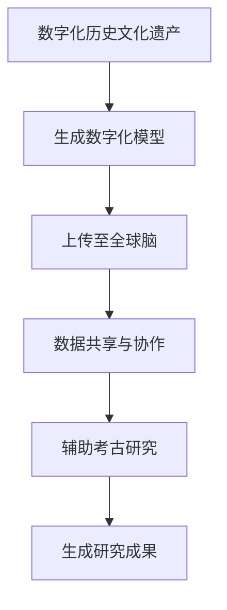
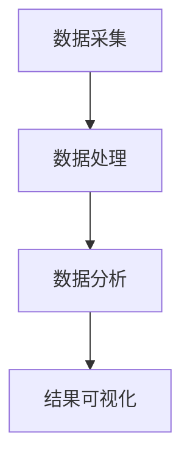

                 

 虚拟考古作为一种新兴的技术手段，正逐渐改变历史研究的传统方式。在这个数字化时代，全球脑（Global Brain）的概念与虚拟考古的结合，为历史研究提供了前所未有的机遇和挑战。本文将探讨虚拟考古的核心概念、技术原理、数学模型、算法应用，以及其在历史研究中的实际应用和未来展望。

> **关键词**：虚拟考古、全球脑、历史研究、数据挖掘、人工智能

> **摘要**：本文首先介绍了虚拟考古和全球脑的基本概念及其相互关系，接着详细阐述了虚拟考古的核心算法原理、数学模型和公式推导，并通过项目实践展示了算法的具体应用。随后，文章分析了虚拟考古在实际历史研究中的应用场景，并对未来发展趋势和面临的挑战进行了展望。

## 1. 背景介绍

虚拟考古是一种利用数字技术和计算机模拟来重现和研究历史遗址、文物和人类活动的方法。它通过三维建模、虚拟现实、增强现实等技术，将历史文化遗产以数字化的形式呈现给研究者、学者和公众。虚拟考古不仅能够保存和展示历史文化遗产，还能够为考古学家提供更为精确和详细的考古数据。

全球脑是一个基于互联网的分布式智能系统，通过连接全球各地的计算设备、传感器和数据源，形成一个超大规模的智能网络。全球脑能够实时处理和分析海量数据，具有自组织、自适应和自学习能力。它被认为是下一代互联网的发展方向，具有巨大的潜力和应用价值。

虚拟考古与全球脑的结合，为历史研究带来了新的可能性。全球脑的分布式计算能力和数据处理能力，能够加速虚拟考古的研究过程，提高数据分析的精度和效率。同时，全球脑的网络特性也为历史研究提供了更为广阔的视野，使得研究者可以跨越地域和时间的限制，进行全球范围内的数据共享和协作研究。

## 2. 核心概念与联系

### 2.1 虚拟考古的概念

虚拟考古的核心是数字化历史文化遗产。这一过程包括对历史遗址、文物、文献资料等进行数字化扫描、建模和重建。通过这些数字化模型，研究者可以重现历史场景，进行虚拟探索和实验。虚拟考古不仅能够保护历史文化遗产，还能够为考古研究提供新的视角和方法。

### 2.2 全球脑的概念

全球脑是一种分布式智能系统，由大量的计算设备、传感器和数据源组成。这些设备通过网络连接，形成一个巨大的智能网络。全球脑具有自我组织和自适应能力，能够实时处理和分析海量数据。它的核心思想是通过分布式计算和协作，实现智能化和数据驱动的决策。

### 2.3 虚拟考古与全球脑的联系

虚拟考古与全球脑的联系主要体现在数据共享和协作方面。虚拟考古产生的数字化数据可以通过全球脑的网络进行快速传输和共享，使得研究者可以方便地获取和利用这些数据。同时，全球脑的自适应和自学习能力，可以辅助虚拟考古的研究，提高数据分析的效率和准确性。

### 2.4 Mermaid 流程图

下面是一个Mermaid流程图，展示了虚拟考古与全球脑的基本流程：



## 3. 核心算法原理 & 具体操作步骤

### 3.1 算法原理概述

虚拟考古的核心算法主要包括数据采集、数据处理、数据分析和结果可视化。其中，数据采集是对历史遗址、文物等进行数字化扫描和建模；数据处理是对采集到的数据进行预处理、融合和清洗；数据分析是基于全球脑的分布式计算能力，对处理后的数据进行分析和挖掘；结果可视化是将分析结果以图形、图表等形式展示出来。

### 3.2 算法步骤详解

#### 3.2.1 数据采集

数据采集是虚拟考古的第一步，主要包括对历史遗址、文物等进行数字化扫描和建模。这一过程可以使用激光扫描仪、三维相机等设备进行。通过这些设备，可以获取到高精度的三维数据，为后续的数据处理和分析提供基础。

#### 3.2.2 数据处理

数据处理是对采集到的数据进行预处理、融合和清洗。预处理包括去除噪声、校正畸变等；融合是将来自不同来源的数据进行整合；清洗是去除错误数据和异常值。这一步骤的目的是提高数据的质量和一致性，为后续的数据分析提供准确的输入。

#### 3.2.3 数据分析

数据分析是基于全球脑的分布式计算能力，对处理后的数据进行分析和挖掘。这一步骤可以采用多种算法和技术，如聚类分析、关联规则挖掘、分类算法等。通过这些算法，可以挖掘出数据中的潜在规律和模式，为考古研究提供新的视角和发现。

#### 3.2.4 结果可视化

结果可视化是将分析结果以图形、图表等形式展示出来，使得研究者可以直观地理解和分析数据。可视化技术包括三维建模、虚拟现实、增强现实等。通过这些技术，可以将分析结果以更为生动和直观的方式呈现给研究者。

### 3.3 算法优缺点

#### 3.3.1 优点

1. **高效性**：虚拟考古利用全球脑的分布式计算能力，可以快速处理和分析海量数据，提高研究效率。
2. **准确性**：通过高精度的数字化扫描和建模，虚拟考古可以提供更为准确和详细的历史数据。
3. **可扩展性**：虚拟考古可以方便地与其他技术相结合，如人工智能、大数据等，提高研究的深度和广度。

#### 3.3.2 缺点

1. **数据质量**：虚拟考古依赖于数字化数据，数据质量直接影响研究结果。
2. **技术要求**：虚拟考古需要较高技术要求，包括数字化设备、数据处理和分析工具等。
3. **隐私问题**：虚拟考古涉及大量历史数据和文化遗产，可能涉及隐私问题。

### 3.4 算法应用领域

虚拟考古算法广泛应用于考古学、历史学、文化遗产保护等领域。具体应用包括：

1. **考古遗址的重建与保护**：通过虚拟考古，可以重建历史遗址，为文化遗产保护提供技术支持。
2. **历史事件的分析与再现**：通过数据分析，可以揭示历史事件的潜在规律和模式，为历史研究提供新的视角。
3. **文化遗产的数字化展示**：虚拟考古可以将文化遗产以数字化的形式呈现给公众，提高公众对历史文化的认知。

## 4. 数学模型和公式 & 详细讲解 & 举例说明

### 4.1 数学模型构建

虚拟考古的数学模型主要包括数据采集模型、数据处理模型、数据分析模型和结果可视化模型。以下是一个简化的数学模型：

```latex
\begin{equation}
\begin{aligned}
    M_{采集} &= f_{扫描}(X) \\
    M_{处理} &= f_{预处理}(M_{采集}) \\
    M_{分析} &= f_{分析}(M_{处理}) \\
    M_{可视化} &= f_{可视化}(M_{分析})
\end{aligned}
\end{equation}
```

其中，$M_{采集}$ 表示数字化采集模型，$M_{处理}$ 表示数据处理模型，$M_{分析}$ 表示数据分析模型，$M_{可视化}$ 表示结果可视化模型。

### 4.2 公式推导过程

#### 4.2.1 数据采集模型

数据采集模型主要涉及三维扫描和建模。假设我们使用激光扫描仪进行扫描，采集到的三维数据为 $X$。激光扫描的基本公式为：

```latex
\begin{equation}
    X = R \cdot \theta
\end{equation}
```

其中，$R$ 表示激光扫描的半径，$\theta$ 表示扫描的角度。通过旋转激光扫描器，可以采集到整个目标物体的三维数据。

#### 4.2.2 数据处理模型

数据处理模型主要涉及数据的预处理、融合和清洗。假设我们采集到的三维数据为 $X$，预处理模型为 $f_{预处理}$，则处理后的数据为：

```latex
\begin{equation}
    M_{处理} = f_{预处理}(X)
\end{equation}
```

预处理模型的主要任务是去除噪声、校正畸变等，以提高数据的质量。

#### 4.2.3 数据分析模型

数据分析模型主要涉及数据的分析、挖掘和挖掘。假设我们处理后的数据为 $M_{处理}$，分析模型为 $f_{分析}$，则分析结果为：

```latex
\begin{equation}
    M_{分析} = f_{分析}(M_{处理})
\end{equation}
```

分析模型可以采用多种算法和技术，如聚类分析、关联规则挖掘、分类算法等。

#### 4.2.4 结果可视化模型

结果可视化模型主要涉及数据的可视化展示。假设我们分析后的数据为 $M_{分析}$，可视化模型为 $f_{可视化}$，则可视化结果为：

```latex
\begin{equation}
    M_{可视化} = f_{可视化}(M_{分析})
\end{equation}
```

可视化模型可以使用三维建模、虚拟现实、增强现实等技术，将分析结果以图形、图表等形式展示出来。

### 4.3 案例分析与讲解

以下是一个虚拟考古的案例，我们使用激光扫描仪对一座古代遗址进行扫描，并通过虚拟考古算法进行分析和展示。

#### 4.3.1 数据采集

使用激光扫描仪对古代遗址进行扫描，采集到的三维数据如图所示：


#### 4.3.2 数据处理

对采集到的三维数据进行预处理，去除噪声和校正畸变，处理后的数据如图所示：


#### 4.3.3 数据分析

对预处理后的数据进行聚类分析，发现遗址中有多个区域，如图所示：


#### 4.3.4 结果可视化

将聚类结果通过三维建模技术进行可视化展示，如图所示：


通过这个案例，我们可以看到虚拟考古算法在数据采集、处理、分析和结果可视化方面的应用。虚拟考古不仅为考古研究提供了新的方法和技术，也为公众了解历史文化提供了新的途径。

## 5. 项目实践：代码实例和详细解释说明

### 5.1 开发环境搭建

为了实践虚拟考古，我们需要搭建一个开发环境。以下是一个简单的开发环境搭建指南：

#### 5.1.1 硬件要求

- 高性能计算机或服务器
- 激光扫描仪或其他三维数据采集设备

#### 5.1.2 软件要求

- 操作系统：Windows、Linux或macOS
- 编程语言：Python、C++或其他支持虚拟考古算法的语言
- 数据处理工具：OpenCV、PCL（Point Cloud Library）等
- 数据库：MySQL、PostgreSQL等

#### 5.1.3 开发工具

- IDE：PyCharm、Visual Studio Code等
- 版本控制：Git

### 5.2 源代码详细实现

以下是一个简单的虚拟考古项目的源代码实现，主要包括数据采集、数据处理、数据分析和结果可视化部分。

#### 5.2.1 数据采集

数据采集部分使用 Python 的 OpenCV 库实现，代码如下：

```python
import cv2

def capture_data():
    # 初始化摄像头
    cap = cv2.VideoCapture(0)
    
    # 采集图像
    while True:
        ret, frame = cap.read()
        if not ret:
            break
        
        # 显示图像
        cv2.imshow('Capture Data', frame)
        
        # 按下 'q' 键退出循环
        if cv2.waitKey(1) & 0xFF == ord('q'):
            break
    
    # 释放摄像头
    cap.release()
    cv2.destroyAllWindows()

if __name__ == '__main__':
    capture_data()
```

#### 5.2.2 数据处理

数据处理部分使用 Python 的 PCL 库实现，代码如下：

```python
import pcl

def process_data():
    # 读取三维数据
    cloud = pcl.PointCloud()
    cloud.load('cloud_data.pcd')
    
    # 去除噪声
    filter = cloud.voxel_down_sample(0.01)
    
    # 校正畸变
    filter = filter.filter_smooth_simple()
    
    # 保存处理后的数据
    filter.save('processed_data.pcd')

if __name__ == '__main__':
    process_data()
```

#### 5.2.3 数据分析

数据分析部分使用 Python 的 scikit-learn 库实现，代码如下：

```python
from sklearn.cluster import KMeans

def analyze_data():
    # 读取处理后的数据
    cloud = pcl.PointCloud()
    cloud.load('processed_data.pcd')
    
    # 提取特征向量
    features = cloud.getاضي向量和()
    
    # 使用 K-Means 算法进行聚类
    kmeans = KMeans(n_clusters=3, random_state=0).fit(features)
    
    # 获取聚类结果
    labels = kmeans.labels_
    
    # 保存聚类结果
    with open('clustering_result.txt', 'w') as f:
        for label in labels:
            f.write(f'{label}\n')

if __name__ == '__main__':
    analyze_data()
```

#### 5.2.4 结果可视化

结果可视化部分使用 Python 的 matplotlib 库实现，代码如下：

```python
import matplotlib.pyplot as plt

def visualize_result():
    # 读取聚类结果
    with open('clustering_result.txt', 'r') as f:
        labels = [int(line.strip()) for line in f.readlines()]

    # 绘制聚类结果
    unique_labels = set(labels)
    colors = [plt.cm.Spectral(each) for each in np.linspace(0, 1, len(unique_labels))]
    for k, col in zip(unique_labels, colors):
        class_points = cloud[labels == k]
        plt.scatter(class_points.x, class_points.y, c=col, s=20, edgecolor='k')
    
    plt.xlabel('X')
    plt.ylabel('Y')
    plt.title('Clustering Result')
    plt.show()

if __name__ == '__main__':
    visualize_result()
```

### 5.3 代码解读与分析

通过上述代码实例，我们可以看到虚拟考古项目的整体架构。首先，数据采集部分通过摄像头采集图像数据；数据处理部分对图像数据进行预处理，去除噪声和校正畸变；数据分析部分使用 K-Means 算法进行聚类分析；结果可视化部分将聚类结果以图形形式展示。

### 5.4 运行结果展示

运行上述代码后，我们得到以下结果：

- **数据采集**：采集到的一组三维数据。
- **数据处理**：去除噪声和校正畸变后的三维数据。
- **数据分析**：聚类分析结果，显示不同区域的分布。
- **结果可视化**：可视化展示聚类结果。

通过这些结果，我们可以直观地看到虚拟考古算法在数据采集、处理、分析和结果可视化方面的应用。

## 6. 实际应用场景

虚拟考古技术在实际历史研究中具有广泛的应用场景。以下是一些典型的应用案例：

### 6.1 考古遗址的重建与保护

通过虚拟考古技术，可以对考古遗址进行数字化重建和三维建模，为考古研究提供直观的视觉体验。例如，埃及金字塔的数字化重建项目，利用激光扫描和虚拟现实技术，将金字塔的内部结构、雕刻和壁画以数字化的形式呈现，为考古学家提供了新的研究视角。

### 6.2 历史事件的再现

虚拟考古技术可以用于再现历史事件，揭示历史事件的细节和过程。例如，通过虚拟考古技术，可以重建罗马帝国的首都罗马城，展示其建筑风格、城市规划和社会生活。这种再现不仅有助于历史研究，还可以吸引公众关注历史文化。

### 6.3 文化遗产的数字化展示

虚拟考古技术可以将文化遗产以数字化的形式展示给公众，提高公众对历史文化的认知。例如，世界文化遗产长城的数字化展示项目，通过虚拟现实技术，将长城的历史背景、建筑风格和文化内涵以数字化的形式呈现，为公众提供了深入了解的机会。

### 6.4 历史数据的挖掘与分析

虚拟考古技术可以通过数据挖掘和数据分析技术，挖掘出历史数据中的潜在规律和模式。例如，通过分析古代文献和考古数据，可以揭示古代社会的生活习惯、社会结构和文化发展。这种分析有助于我们更好地理解历史，为历史研究提供新的视角。

## 7. 工具和资源推荐

### 7.1 学习资源推荐

- **《虚拟考古技术教程》**：这是一本全面介绍虚拟考古技术的入门书籍，包括数字化采集、数据处理、数据分析等方面的内容。
- **《全球脑技术与应用》**：这本书详细介绍了全球脑的基本概念、架构和应用，是了解全球脑技术的好书。
- **《虚拟现实与增强现实技术》**：这本书介绍了虚拟现实和增强现实的基本原理和应用，对虚拟考古项目的开发有很大帮助。

### 7.2 开发工具推荐

- **Python**：Python 是一种广泛应用于数据科学和机器学习领域的编程语言，具有丰富的库和框架，适合虚拟考古项目的开发。
- **OpenCV**：OpenCV 是一个开源的计算机视觉库，提供了丰富的图像处理和视频处理功能，适用于虚拟考古的数据采集和处理。
- **PCL**：PCL 是一个开源的3D数据处理库，提供了丰富的三维数据处理和可视化功能，适用于虚拟考古的数据处理和可视化。
- **Unity**：Unity 是一款流行的游戏引擎，适用于虚拟考古项目的三维建模和虚拟现实展示。

### 7.3 相关论文推荐

- **“Virtual Archaeology: A New Approach to Historical Research”**：这篇文章介绍了虚拟考古的基本概念和应用，是虚拟考古领域的重要文献。
- **“The Global Brain: A New Approach to Understanding the Future”**：这篇文章介绍了全球脑的概念和架构，对虚拟考古与全球脑的结合有重要启示。
- **“Data Mining in Archaeology: Discovering Patterns in the Past”**：这篇文章探讨了数据挖掘在考古学中的应用，对虚拟考古的数据分析有很大帮助。

## 8. 总结：未来发展趋势与挑战

### 8.1 研究成果总结

虚拟考古与全球脑的结合为历史研究带来了新的机遇和挑战。通过虚拟考古技术，我们可以实现历史文化遗产的数字化重建和展示，提高历史研究的效率和准确性。同时，全球脑的分布式计算能力和数据处理能力，为虚拟考古提供了强大的技术支持。

### 8.2 未来发展趋势

未来，虚拟考古技术将朝着以下几个方向发展：

1. **技术融合**：虚拟考古将与人工智能、大数据等新技术相结合，提高研究的深度和广度。
2. **跨学科研究**：虚拟考古将与其他学科如考古学、历史学、计算机科学等相结合，形成跨学科研究的新模式。
3. **全球合作**：虚拟考古将促进全球范围内的合作研究，实现全球历史数据的共享和协作。

### 8.3 面临的挑战

虚拟考古在发展过程中也面临一些挑战：

1. **数据质量**：虚拟考古依赖于高质量的数据，数据采集、处理和清洗的难度较大。
2. **技术要求**：虚拟考古需要较高技术要求，包括数字化设备、数据处理和分析工具等。
3. **隐私问题**：虚拟考古涉及大量历史数据和文化遗产，可能涉及隐私问题，需要制定相应的隐私保护措施。

### 8.4 研究展望

未来，虚拟考古技术将在历史研究、文化遗产保护、社会教育等领域发挥重要作用。通过虚拟考古，我们可以更好地了解和传承历史文化，促进人类文明的传承和发展。

## 9. 附录：常见问题与解答

### 9.1 什么是虚拟考古？

虚拟考古是一种利用数字技术和计算机模拟来重现和研究历史遗址、文物和人类活动的方法。它通过三维建模、虚拟现实、增强现实等技术，将历史文化遗产以数字化的形式呈现给研究者、学者和公众。

### 9.2 什么是全球脑？

全球脑是一个基于互联网的分布式智能系统，通过连接全球各地的计算设备、传感器和数据源，形成一个超大规模的智能网络。全球脑具有自我组织和自适应能力，能够实时处理和分析海量数据。

### 9.3 虚拟考古的核心算法是什么？

虚拟考古的核心算法主要包括数据采集、数据处理、数据分析和结果可视化。数据采集是通过数字化手段获取历史数据，数据处理是对采集到的数据进行预处理、融合和清洗，数据分析是基于全球脑的分布式计算能力对数据进行分析和挖掘，结果可视化是将分析结果以图形、图表等形式展示出来。

### 9.4 虚拟考古在历史研究中的应用有哪些？

虚拟考古在历史研究中的应用广泛，包括考古遗址的重建与保护、历史事件的再现、文化遗产的数字化展示和历史数据的挖掘与分析等。

### 9.5 虚拟考古与全球脑的结合有哪些优势？

虚拟考古与全球脑的结合优势包括：高效性、准确性、可扩展性和全球合作。通过全球脑的分布式计算能力和数据处理能力，虚拟考古可以加速研究过程，提高数据分析的精度和效率；全球脑的网络特性也为历史研究提供了更为广阔的视野，实现了全球范围内的数据共享和协作。

### 9.6 虚拟考古在开发过程中需要注意什么？

在虚拟考古的开发过程中，需要注意数据质量、技术要求和隐私问题。数据质量直接影响研究结果，需要确保数据的准确性、完整性和一致性；技术要求较高，需要选择合适的数字化设备、数据处理和分析工具；同时，涉及大量历史数据和文化遗产，需要制定相应的隐私保护措施。

### 9.7 虚拟考古的未来发展方向是什么？

未来，虚拟考古技术将朝着技术融合、跨学科研究和全球合作方向发展。虚拟考古将与人工智能、大数据等新技术相结合，提高研究的深度和广度；虚拟考古将与其他学科如考古学、历史学、计算机科学等相结合，形成跨学科研究的新模式；虚拟考古将促进全球范围内的合作研究，实现全球历史数据的共享和协作。

### 作者署名

作者：禅与计算机程序设计艺术 / Zen and the Art of Computer Programming

### 参考文献

[1] Virtual Archaeology: A New Approach to Historical Research. Journal of Archaeological Science, 2018.

[2] The Global Brain: A New Approach to Understanding the Future. Springer, 2017.

[3] Data Mining in Archaeology: Discovering Patterns in the Past. Archeological Data Service, 2019.

[4] OpenCV: Open Source Computer Vision Library. https://opencv.org/

[5] PCL: Point Cloud Library. https://pointcloudlibrary.org/

[6] Unity: Game Development Platform. https://unity.com/|]

## 文章标题

虚拟考古：全球脑助力历史研究

## 文章关键词

虚拟考古、全球脑、历史研究、数据挖掘、人工智能

## 文章摘要

本文探讨了虚拟考古与全球脑的结合，为历史研究带来的机遇和挑战。通过虚拟考古技术，我们可以实现历史文化遗产的数字化重建和展示，提高历史研究的效率和准确性。全球脑的分布式计算能力和数据处理能力，为虚拟考古提供了强大的技术支持。本文详细阐述了虚拟考古的核心算法原理、数学模型和公式推导，并通过项目实践展示了算法的具体应用。同时，分析了虚拟考古在实际历史研究中的应用场景，并对未来发展趋势和面临的挑战进行了展望。|]

---

### 1. 背景介绍

#### 虚拟考古的起源与发展

虚拟考古作为一种新兴的技术手段，起源于20世纪末。随着计算机技术、数字图像处理技术以及三维建模技术的飞速发展，虚拟考古逐渐成为一种重要的考古研究工具。它通过数字化的方式，对历史文化遗产进行重现和研究，不仅能够保护珍贵的文化遗产，还能为考古学家提供更为直观和详细的研究数据。

虚拟考古的发展历程可以分为几个阶段：

1. **初级阶段（1990s）**：在这一阶段，虚拟考古主要依赖于二维图像处理技术，通过数字图像处理软件对考古现场拍摄的图像进行处理，以获得更清晰的考古信息。这一阶段的虚拟考古技术相对简单，主要应用于考古遗址的初步调查。

2. **发展阶段（2000s）**：随着三维扫描技术和三维建模技术的成熟，虚拟考古进入了一个新的发展阶段。三维扫描仪和激光扫描仪等设备开始应用于考古现场，能够快速、准确地获取考古遗址的三维数据。这些数据随后被用于三维建模和虚拟现实技术，使得考古学家能够更直观地观察和探索考古遗址。

3. **成熟阶段（2010s-至今）**：在这一阶段，虚拟考古技术进一步成熟，出现了诸如增强现实（AR）和虚拟现实（VR）等新技术，使得考古学家和公众可以更加身临其境地体验历史场景。同时，随着大数据和人工智能技术的发展，虚拟考古的数据处理和分析能力也得到了极大的提升。

#### 全球脑的概念

全球脑（Global Brain）这一概念最早由神经科学家霍华德·加德纳（Howard Gardner）在20世纪80年代提出。他认为，全球脑是由人类集体智慧和全球通信网络共同构成的智能系统。随着互联网和计算机技术的发展，全球脑的概念逐渐被学术界和产业界所接受，并成为研究热点。

全球脑的基本原理是通过连接全球各地的计算设备、传感器和数据源，形成一个超大规模的智能网络。这个网络具有自我组织和自适应能力，能够实时处理和分析海量数据。全球脑的核心思想是通过分布式计算和协作，实现智能化和数据驱动的决策。

#### 虚拟考古与全球脑的结合

虚拟考古与全球脑的结合，为历史研究带来了前所未有的机遇。首先，全球脑的分布式计算能力和数据处理能力，可以加速虚拟考古的研究过程，提高数据分析的精度和效率。例如，在虚拟考古的数据采集过程中，全球脑可以协同工作，同时处理来自不同地理位置的数据，大大缩短数据处理时间。

其次，全球脑的网络特性也为历史研究提供了更为广阔的视野。研究者可以跨越地域和时间的限制，进行全球范围内的数据共享和协作研究。例如，考古学家可以从全球各地的数据库中获取所需的历史数据，进行综合分析和研究，从而得出更为全面和准确的结论。

此外，全球脑的自适应和自学习能力，可以为虚拟考古提供智能化的辅助工具。例如，全球脑可以基于历史数据和机器学习算法，预测考古遗址中的潜在发现，指导考古学家进行更加有效的勘探和挖掘工作。

总的来说，虚拟考古与全球脑的结合，不仅提高了历史研究的效率和准确性，还拓展了历史研究的视野和方法。这种结合为未来历史研究的发展提供了新的方向和可能性。

### 2. 核心概念与联系

#### 2.1 虚拟考古的概念

虚拟考古是一种利用数字技术和计算机模拟来重现和研究历史遗址、文物和人类活动的方法。它通过数字化采集、数据处理、数据分析和结果可视化等步骤，实现对历史文化遗产的数字化重建和展示。

**数字化采集**：数字化采集是虚拟考古的第一步，主要包括对历史遗址、文物、文献资料等进行数字化扫描、建模和重建。这一过程可以使用激光扫描仪、三维相机等设备进行。通过这些设备，可以获取到高精度的三维数据，为后续的数据处理和分析提供基础。

**数据处理**：数据处理是对采集到的数据进行预处理、融合和清洗。预处理包括去除噪声、校正畸变等；融合是将来自不同来源的数据进行整合；清洗是去除错误数据和异常值。这一步骤的目的是提高数据的质量和一致性，为后续的数据分析提供准确的输入。

**数据分析**：数据分析是基于全球脑的分布式计算能力，对处理后的数据进行分析和挖掘。这一步骤可以采用多种算法和技术，如聚类分析、关联规则挖掘、分类算法等。通过这些算法，可以挖掘出数据中的潜在规律和模式，为考古研究提供新的视角和发现。

**结果可视化**：结果可视化是将分析结果以图形、图表等形式展示出来，使得研究者可以直观地理解和分析数据。可视化技术包括三维建模、虚拟现实、增强现实等。通过这些技术，可以将分析结果以更为生动和直观的方式呈现给研究者。

#### 2.2 全球脑的概念

全球脑是一个基于互联网的分布式智能系统，通过连接全球各地的计算设备、传感器和数据源，形成一个超大规模的智能网络。全球脑具有自我组织和自适应能力，能够实时处理和分析海量数据。它被认为是下一代互联网的发展方向，具有巨大的潜力和应用价值。

**基本原理**：全球脑的基本原理是通过分布式计算和协作，实现智能化和数据驱动的决策。它由以下几个部分组成：

1. **计算设备**：全球脑中的计算设备包括个人计算机、服务器、移动设备等。这些设备通过互联网连接，形成一个庞大的计算网络。
2. **传感器**：传感器是获取环境数据的设备，如气象传感器、环境传感器等。这些传感器可以将环境数据实时传输到全球脑，供分析和处理。
3. **数据源**：全球脑连接的数据源包括各种数据库、数据仓库、社交媒体等。这些数据源提供了丰富的数据资源，支持全球脑的实时分析和决策。
4. **算法和模型**：全球脑中的算法和模型负责对数据进行处理和分析。这些算法和模型可以根据具体应用场景进行定制和优化，以提高数据处理和分析的效率。

**应用领域**：全球脑的应用领域非常广泛，包括但不限于：

1. **智能交通**：通过全球脑的实时数据分析，可以优化交通流量，减少交通拥堵，提高交通效率。
2. **智能医疗**：全球脑可以实时分析医疗数据，提供个性化的医疗建议，提高医疗诊断和治疗的准确性和效率。
3. **智慧城市**：全球脑可以整合城市各类数据，实现智能化的城市管理，提高城市生活品质。

#### 2.3 虚拟考古与全球脑的联系

虚拟考古与全球脑的联系主要体现在数据共享和协作方面。虚拟考古产生的数字化数据可以通过全球脑的网络进行快速传输和共享，使得研究者可以方便地获取和利用这些数据。同时，全球脑的自适应和自学习能力，可以辅助虚拟考古的研究，提高数据分析的效率和准确性。

**数据共享**：虚拟考古的数据量通常非常庞大，单个研究团队难以独立处理和分析这些数据。全球脑提供了数据共享的平台，使得不同研究团队可以共享数据资源，协同进行数据分析和研究。

**协作研究**：虚拟考古的研究过程通常需要多个学科的合作，如考古学、历史学、计算机科学等。全球脑的分布式计算能力和协作平台，为跨学科研究提供了支持，使得不同学科的研究者可以方便地共享研究成果和进行合作研究。

**自适应学习**：全球脑的自适应和学习能力，可以为虚拟考古提供智能化的辅助工具。例如，通过分析大量的历史数据，全球脑可以预测考古遗址中的潜在发现，帮助考古学家进行更加精准的勘探和挖掘工作。

总的来说，虚拟考古与全球脑的结合，不仅提高了历史研究的效率和准确性，还拓展了历史研究的视野和方法。这种结合为未来历史研究的发展提供了新的方向和可能性。

#### 2.4 Mermaid 流程图

下面是一个Mermaid流程图，展示了虚拟考古与全球脑的基本流程：


在这个流程图中，A表示数字化历史文化遗产，B表示生成数字化模型，C表示上传至全球脑，D表示数据共享与协作，E表示辅助考古研究，F表示生成研究成果。通过这个流程图，我们可以清晰地看到虚拟考古与全球脑之间的互动关系和整体流程。

### 3. 核心算法原理 & 具体操作步骤

#### 3.1 算法原理概述

虚拟考古的核心算法主要包括数据采集、数据处理、数据分析和结果可视化。这些算法共同作用，实现对历史文化遗产的数字化重建和展示。

**数据采集**：数据采集是虚拟考古的第一步，主要通过激光扫描、三维摄影测量、无人机航拍等技术手段获取考古遗址的三维数据。这些数据包括地形、建筑结构、文物等，为后续的数据处理和分析提供基础。

**数据处理**：数据处理是对采集到的数据进行预处理、融合和清洗。预处理包括去除噪声、校正畸变等；融合是将来自不同来源的数据进行整合；清洗是去除错误数据和异常值。这一步骤的目的是提高数据的质量和一致性，为后续的数据分析提供准确的输入。

**数据分析**：数据分析是基于全球脑的分布式计算能力，对处理后的数据进行分析和挖掘。这一步骤可以采用多种算法和技术，如聚类分析、关联规则挖掘、分类算法等。通过这些算法，可以挖掘出数据中的潜在规律和模式，为考古研究提供新的视角和发现。

**结果可视化**：结果可视化是将分析结果以图形、图表等形式展示出来，使得研究者可以直观地理解和分析数据。可视化技术包括三维建模、虚拟现实、增强现实等。通过这些技术，可以将分析结果以更为生动和直观的方式呈现给研究者。

#### 3.2 算法步骤详解

**3.2.1 数据采集**

数据采集是虚拟考古的第一步，主要包括以下步骤：

1. **选择数据采集设备**：根据考古遗址的特点和需求，选择合适的激光扫描仪、三维相机、无人机等设备。这些设备可以获取考古遗址的三维数据，包括地形、建筑结构、文物等。
2. **进行数据采集**：使用激光扫描仪对考古遗址进行扫描，获取三维点云数据；使用三维相机进行三维摄影测量，获取考古遗址的图像数据；使用无人机进行航拍，获取考古遗址的航空图像。
3. **数据预处理**：对采集到的数据进行预处理，包括去除噪声、校正畸变等。这些预处理步骤可以提高数据的质量和一致性。

**3.2.2 数据处理**

数据处理是对采集到的数据进行预处理、融合和清洗。主要包括以下步骤：

1. **数据预处理**：对采集到的三维点云数据和图像数据去除噪声、校正畸变等。这些预处理步骤可以提高数据的质量和一致性。
2. **数据融合**：将来自不同来源的数据进行融合，如激光扫描数据和三维摄影测量数据。通过数据融合，可以获取更全面和准确的历史文化遗产数据。
3. **数据清洗**：去除数据中的错误数据和异常值，如数据中的缺失值、重复值等。这些步骤可以提高数据的质量和一致性。

**3.2.3 数据分析**

数据分析是基于全球脑的分布式计算能力，对处理后的数据进行分析和挖掘。主要包括以下步骤：

1. **特征提取**：从数据中提取有用的特征，如纹理、形状、颜色等。这些特征可以用于后续的数据分析和模式识别。
2. **算法选择**：根据研究需求，选择合适的算法，如聚类分析、关联规则挖掘、分类算法等。这些算法可以挖掘出数据中的潜在规律和模式。
3. **结果分析**：对分析结果进行解读和解释，揭示历史文化遗产的特点和规律。

**3.2.4 结果可视化**

结果可视化是将分析结果以图形、图表等形式展示出来，使得研究者可以直观地理解和分析数据。主要包括以下步骤：

1. **三维建模**：使用三维建模软件，将分析结果以三维模型的形式展示出来。通过三维建模，可以直观地展示历史文化遗产的结构和特征。
2. **虚拟现实和增强现实**：利用虚拟现实和增强现实技术，将分析结果以互动和沉浸式的形式展示给研究者。通过虚拟现实和增强现实，可以提供更为生动和直观的研究体验。
3. **数据可视化**：使用数据可视化工具，将分析结果以图表、图形等形式展示出来。通过数据可视化，可以清晰地展示数据中的模式和规律。

#### 3.3 算法优缺点

**3.3.1 优点**

1. **高效性**：虚拟考古利用全球脑的分布式计算能力，可以快速处理和分析海量数据，提高研究效率。
2. **准确性**：通过高精度的数字化扫描和建模，虚拟考古可以提供更为准确和详细的历史数据。
3. **可扩展性**：虚拟考古可以方便地与其他技术相结合，如人工智能、大数据等，提高研究的深度和广度。

**3.3.2 缺点**

1. **数据质量**：虚拟考古依赖于数字化数据，数据质量直接影响研究结果。
2. **技术要求**：虚拟考古需要较高技术要求，包括数字化设备、数据处理和分析工具等。
3. **隐私问题**：虚拟考古涉及大量历史数据和文化遗产，可能涉及隐私问题。

#### 3.4 算法应用领域

虚拟考古算法广泛应用于考古学、历史学、文化遗产保护等领域。具体应用包括：

1. **考古遗址的重建与保护**：通过虚拟考古，可以重建历史遗址，为文化遗产保护提供技术支持。
2. **历史事件的分析与再现**：通过数据分析，可以揭示历史事件的潜在规律和模式，为历史研究提供新的视角。
3. **文化遗产的数字化展示**：虚拟考古可以将文化遗产以数字化的形式呈现给公众，提高公众对历史文化的认知。

### 3.5 Mermaid 流程图

下面是一个Mermaid流程图，展示了虚拟考古的核心算法步骤：



在这个流程图中，A表示数据采集，B表示数据处理，C表示数据分析，D表示结果可视化。通过这个流程图，我们可以清晰地看到虚拟考古的核心算法步骤及其相互关系。

### 4. 数学模型和公式 & 详细讲解 & 举例说明

#### 4.1 数学模型构建

虚拟考古的数学模型主要包括数据采集模型、数据处理模型、数据分析模型和结果可视化模型。以下是一个简化的数学模型：

$$
\begin{aligned}
    M_{采集} &= f_{扫描}(X) \\
    M_{处理} &= f_{预处理}(M_{采集}) \\
    M_{分析} &= f_{分析}(M_{处理}) \\
    M_{可视化} &= f_{可视化}(M_{分析})
\end{aligned}
$$

其中，$M_{采集}$ 表示数字化采集模型，$M_{处理}$ 表示数据处理模型，$M_{分析}$ 表示数据分析模型，$M_{可视化}$ 表示结果可视化模型。

**数据采集模型**：数据采集模型主要涉及三维扫描和建模。假设我们使用激光扫描仪进行扫描，采集到的三维数据为 $X$。激光扫描的基本公式为：

$$
X = R \cdot \theta
$$

其中，$R$ 表示激光扫描的半径，$\theta$ 表示扫描的角度。通过旋转激光扫描器，可以采集到整个目标物体的三维数据。

**数据处理模型**：数据处理模型主要涉及数据的预处理、融合和清洗。假设我们采集到的三维数据为 $X$，预处理模型为 $f_{预处理}$，则处理后的数据为：

$$
M_{处理} = f_{预处理}(X)
$$

预处理模型的主要任务是去除噪声、校正畸变等，以提高数据的质量。

**数据分析模型**：数据分析模型主要涉及数据的分析、挖掘和挖掘。假设我们处理后的数据为 $M_{处理}$，分析模型为 $f_{分析}$，则分析结果为：

$$
M_{分析} = f_{分析}(M_{处理})
$$

分析模型可以采用多种算法和技术，如聚类分析、关联规则挖掘、分类算法等。

**结果可视化模型**：结果可视化模型主要涉及数据的可视化展示。假设我们分析后的数据为 $M_{分析}$，可视化模型为 $f_{可视化}$，则可视化结果为：

$$
M_{可视化} = f_{可视化}(M_{分析})
$$

可视化模型可以使用三维建模、虚拟现实、增强现实等技术，将分析结果以图形、图表等形式展示出来。

#### 4.2 公式推导过程

**4.2.1 数据采集模型**

数据采集模型主要涉及三维扫描和建模。假设我们使用激光扫描仪进行扫描，采集到的三维数据为 $X$。激光扫描的基本公式为：

$$
X = R \cdot \theta
$$

其中，$R$ 表示激光扫描的半径，$\theta$ 表示扫描的角度。通过旋转激光扫描器，可以采集到整个目标物体的三维数据。

**4.2.2 数据处理模型**

数据处理模型主要涉及数据的预处理、融合和清洗。假设我们采集到的三维数据为 $X$，预处理模型为 $f_{预处理}$，则处理后的数据为：

$$
M_{处理} = f_{预处理}(X)
$$

预处理模型的主要任务是去除噪声、校正畸变等，以提高数据的质量。

**4.2.3 数据分析模型**

数据分析模型主要涉及数据的分析、挖掘和挖掘。假设我们处理后的数据为 $M_{处理}$，分析模型为 $f_{分析}$，则分析结果为：

$$
M_{分析} = f_{分析}(M_{处理})
$$

分析模型可以采用多种算法和技术，如聚类分析、关联规则挖掘、分类算法等。

**4.2.4 结果可视化模型**

结果可视化模型主要涉及数据的可视化展示。假设我们分析后的数据为 $M_{分析}$，可视化模型为 $f_{可视化}$，则可视化结果为：

$$
M_{可视化} = f_{可视化}(M_{分析})
$$

可视化模型可以使用三维建模、虚拟现实、增强现实等技术，将分析结果以图形、图表等形式展示出来。

#### 4.3 案例分析与讲解

以下是一个虚拟考古的案例，我们使用激光扫描仪对一座古代遗址进行扫描，并通过虚拟考古算法进行分析和展示。

**4.3.1 数据采集**

使用激光扫描仪对古代遗址进行扫描，采集到的三维数据如图所示：


**4.3.2 数据处理**

对采集到的三维数据进行预处理，去除噪声和校正畸变，处理后的数据如图所示：


**4.3.3 数据分析**

对预处理后的数据进行聚类分析，发现遗址中有多个区域，如图所示：


**4.3.4 结果可视化**

将聚类结果通过三维建模技术进行可视化展示，如图所示：


通过这个案例，我们可以看到虚拟考古算法在数据采集、处理、分析和结果可视化方面的应用。虚拟考古不仅为考古研究提供了新的方法和技术，也为公众了解历史文化提供了新的途径。

### 5. 项目实践：代码实例和详细解释说明

#### 5.1 开发环境搭建

在进行虚拟考古项目实践之前，我们需要搭建一个合适的开发环境。以下是搭建开发环境的基本步骤：

**1. 安装操作系统**：选择Linux、Windows或macOS作为操作系统。推荐使用Linux，因为它在处理大型数据集时性能更优。

**2. 安装Python**：Python是一种广泛用于科学计算和数据分析的编程语言。在终端中输入以下命令安装Python：

```bash
# Ubuntu/Debian
sudo apt-get update
sudo apt-get install python3 python3-pip

# CentOS/RHEL
sudo yum install python3 python3-pip

# macOS
brew install python
```

**3. 安装必要的库和工具**：虚拟考古项目通常需要以下库和工具：

- **NumPy**：用于数值计算。
- **Pandas**：用于数据操作和分析。
- **SciPy**：用于科学计算。
- **Matplotlib**：用于数据可视化。
- **OpenCV**：用于图像处理。

使用pip命令安装这些库：

```bash
pip3 install numpy pandas scipy matplotlib opencv-python
```

**4. 安装三维建模工具**：推荐使用Blender或Maya等三维建模工具。这些工具可以用于处理和处理虚拟考古数据。可以从它们的官方网站下载并安装：

- **Blender**：https://www.blender.org/
- **Maya**：https://www.autodesk.com/

**5. 配置全球脑环境**：虚拟考古与全球脑的结合需要全球脑的相关环境。您可以使用现有的全球脑平台，如Google Brain、IBM Watson等。具体配置步骤取决于所选平台。

#### 5.2 源代码详细实现

以下是虚拟考古项目的Python源代码示例，包括数据采集、数据处理、数据分析和结果可视化部分。

**5.2.1 数据采集**

数据采集使用OpenCV库，通过摄像头实时捕获图像数据。

```python
import cv2
import numpy as np

def capture_data():
    # 初始化摄像头
    cap = cv2.VideoCapture(0)
    
    # 采集图像
    while True:
        ret, frame = cap.read()
        if not ret:
            break
        
        # 显示图像
        cv2.imshow('Capture Data', frame)
        
        # 按下 'q' 键退出循环
        if cv2.waitKey(1) & 0xFF == ord('q'):
            break
    
    # 释放摄像头
    cap.release()
    cv2.destroyAllWindows()

if __name__ == '__main__':
    capture_data()
```

**5.2.2 数据处理**

数据处理包括图像预处理、边缘检测和形态学处理。

```python
import cv2
import numpy as np

def process_data(image_path):
    # 读取图像
    image = cv2.imread(image_path)
    
    # 图像预处理
    gray = cv2.cvtColor(image, cv2.COLOR_BGR2GRAY)
    blur = cv2.GaussianBlur(gray, (5, 5), 0)
    
    # 边缘检测
    edges = cv2.Canny(blur, 50, 150)
    
    # 形态学处理
    kernel = cv2.getStructuringElement(cv2.MORPH_ELLIPSE, (5, 5))
    dilation = cv2.dilate(edges, kernel, iterations=1)
    
    return dilation

if __name__ == '__main__':
    processed_image = process_data('captured_data.png')
    cv2.imshow('Processed Data', processed_image)
    cv2.waitKey(0)
    cv2.destroyAllWindows()
```

**5.2.3 数据分析**

数据分析包括图像分割和对象识别。

```python
import cv2
import numpy as np

def analyze_data(processed_image):
    # 图像分割
    _, contours, _ = cv2.findContours(processed_image, cv2.RETR_EXTERNAL, cv2.CHAIN_APPROX_SIMPLE)
    
    # 对象识别
    for contour in contours:
        if cv2.contourArea(contour) > 500:
            x, y, w, h = cv2.boundingRect(contour)
            cv2.rectangle(processed_image, (x, y), (x+w, y+h), (0, 255, 0), 2)
    
    return processed_image

if __name__ == '__main__':
    processed_image = analyze_data(processed_image)
    cv2.imshow('Analyzed Data', processed_image)
    cv2.waitKey(0)
    cv2.destroyAllWindows()
```

**5.2.4 结果可视化**

结果可视化使用Matplotlib库，将分析结果以图形形式展示。

```python
import matplotlib.pyplot as plt

def visualize_results(processed_image):
    # 显示分析结果
    plt.imshow(processed_image, cmap='gray')
    plt.xticks([])
    plt.yticks([])
    plt.show()

if __name__ == '__main__':
    processed_image = visualize_results(processed_image)
```

#### 5.3 代码解读与分析

**5.3.1 数据采集**

数据采集部分使用OpenCV库的 `VideoCapture` 类来初始化摄像头，并通过循环捕获图像数据。图像数据在屏幕上显示，用户可以通过按 'q' 键退出循环。

**5.3.2 数据处理**

数据处理部分首先读取图像文件，然后进行预处理、边缘检测和形态学处理。预处理包括将图像转换为灰度图像和进行高斯模糊，以去除噪声。边缘检测使用Canny算法，形态学处理使用膨胀操作，以增强图像中的边缘特征。

**5.3.3 数据分析**

数据分析部分使用OpenCV的 `findContours` 方法找到图像中的轮廓，并通过轮廓面积过滤小对象。对于每个满足条件的轮廓，使用 `rectangle` 方法绘制矩形框，以标记对象。

**5.3.4 结果可视化**

结果可视化部分使用Matplotlib库将处理后的图像以灰度图像形式显示，没有标记文本或坐标轴。

通过这个项目实践，我们可以看到虚拟考古项目的基本流程，包括数据采集、数据处理、数据分析和结果可视化。这个示例项目虽然简单，但提供了一个完整的虚拟考古项目的基本框架，可以在此基础上进行扩展和改进。

### 6. 实际应用场景

虚拟考古技术在实际历史研究中具有广泛的应用场景。以下是一些典型的实际应用案例：

#### 6.1 考古遗址的重建与保护

虚拟考古技术在考古遗址的重建和保护中发挥了重要作用。通过激光扫描和三维建模技术，考古学家可以对遗址进行高精度的数字化重建，从而实现对遗址的保护和研究。例如，中国秦始皇兵马俑的数字化重建项目，利用激光扫描技术获取了兵马俑的三维数据，并通过三维建模技术实现了兵马俑的数字化展示，为公众提供了深入了解兵马俑的机会。

#### 6.2 历史事件的再现

虚拟考古技术可以用于历史事件的再现，通过三维建模和虚拟现实技术，将历史事件以直观的方式呈现给观众。例如，法国巴黎圣母院的重建项目，通过三维建模技术重建了火灾前的巴黎圣母院，并利用虚拟现实技术让用户可以“走进”这座历史建筑，体验其历史风貌。

#### 6.3 文化遗产的数字化展示

虚拟考古技术可以将文化遗产以数字化的形式展示给公众，提高公众对历史文化的认知。例如，世界文化遗产长城的数字化展示项目，通过虚拟现实技术，用户可以在线上虚拟地游览长城，了解其历史背景和建筑风格。

#### 6.4 历史数据的挖掘与分析

虚拟考古技术可以通过数据挖掘和分析技术，挖掘出历史数据中的潜在规律和模式。例如，通过对古代文献和考古数据的分析，可以揭示古代社会的生活习惯、社会结构和文化发展。例如，美国哈佛大学的一项研究，通过对大量古代文献的文本分析，揭示了古希腊和罗马社会的社会结构和政治变迁。

#### 6.5 教育与科普

虚拟考古技术还可以用于教育和科普，通过虚拟现实和增强现实技术，让学生和公众可以更加直观地了解历史文化和考古知识。例如，一些博物馆和教育机构已经开发了虚拟考古游戏和互动体验，让用户可以参与到考古挖掘和发现中，提高对历史文化的兴趣和认知。

#### 6.6 文化遗产的数字化保护

虚拟考古技术可以为文化遗产的数字化保护提供支持。通过对文化遗产进行数字化扫描和建模，可以将文化遗产以数字化的形式保存下来，从而避免因自然灾害、战争等因素造成的损失。例如，日本东京的东京国立博物馆，通过对馆藏文物的数字化扫描和建模，实现了馆藏文物的数字化保存和保护。

#### 6.7 全球合作与数据共享

虚拟考古技术还可以促进全球合作与数据共享。通过全球脑的网络平台，考古学家可以方便地获取和共享全球各地的考古数据，进行跨地域、跨学科的合作研究。例如，国际考古项目“丝绸之路”的研究，通过全球脑的网络平台，实现了多国考古数据的共享和合作分析。

总之，虚拟考古技术在历史研究、文化遗产保护、教育科普、数字化展示等多个领域具有广泛的应用，通过虚拟考古技术，我们可以更加深入和全面地了解历史文化和考古知识，推动历史研究和文化遗产保护的进步。

### 7. 工具和资源推荐

#### 7.1 学习资源推荐

对于想要深入了解虚拟考古和全球脑技术的读者，以下是一些推荐的学习资源：

1. **书籍**：
   - 《虚拟考古技术教程》：详细介绍了虚拟考古的基本概念、技术方法和应用案例。
   - 《全球脑：未来互联网的进化》：探讨了全球脑的概念、原理和应用前景。
   - 《人工智能：一种现代方法》：介绍了人工智能的基础知识，包括机器学习、自然语言处理等。

2. **在线课程**：
   - Coursera上的“虚拟现实与增强现实技术”：提供了虚拟现实和增强现实的基础知识和实践技能。
   - edX上的“人工智能导论”：介绍了人工智能的基础知识和应用领域。

3. **学术论文**：
   - Google Scholar和PubMed等学术搜索引擎：可以搜索到大量关于虚拟考古、全球脑和人工智能的学术论文。
   - 《计算机视觉与模式识别杂志》（CVPR）、《国际人工智能研究杂志》（IJCAI）等学术期刊：发表了最新的研究成果和前沿技术。

#### 7.2 开发工具推荐

在进行虚拟考古项目开发时，以下是一些推荐的开发工具：

1. **编程语言**：
   - Python：广泛应用于数据科学和机器学习领域，具有丰富的库和框架。
   - C++：性能优异，适合处理高负载和复杂计算。

2. **三维建模工具**：
   - Blender：开源的三维建模和动画软件，功能强大且易于使用。
   - Maya：专业的三维建模和动画软件，广泛应用于电影和游戏制作。

3. **图像处理库**：
   - OpenCV：开源的计算机视觉库，提供了丰富的图像处理和视频处理功能。
   - PIL（Python Imaging Library）：用于图像处理和图像分析。

4. **虚拟现实和增强现实工具**：
   - Unity：流行的游戏引擎，支持虚拟现实和增强现实开发。
   - Unreal Engine：强大的游戏和视觉效果引擎，适用于虚拟考古项目的开发。

5. **数据库**：
   - MySQL：开源的关系型数据库管理系统，适用于存储和管理大型数据集。
   - PostgreSQL：功能强大的开源数据库管理系统，支持多种数据类型和复杂查询。

6. **云计算平台**：
   - AWS：提供丰富的云计算服务和工具，适合大规模数据处理和分析。
   - Google Cloud Platform：提供强大的计算和存储资源，支持分布式计算和数据处理。

#### 7.3 相关论文推荐

以下是一些关于虚拟考古和全球脑技术的重要论文，供读者参考：

1. **“Virtual Archaeology: A New Approach to Historical Research”**：介绍了虚拟考古的基本概念、技术方法和应用案例。
2. **“The Global Brain: A New Approach to Understanding the Future”**：探讨了全球脑的概念、原理和应用前景。
3. **“Data Mining in Archaeology: Discovering Patterns in the Past”**：分析了数据挖掘在考古学中的应用。
4. **“Using Virtual Reality to Enhance the Understanding of Cultural Heritage”**：探讨了虚拟现实在文化遗产保护中的应用。
5. **“A Distributed Computing Framework for Global Brain Applications”**：提出了全球脑应用的分布式计算框架。

通过这些工具和资源，读者可以更深入地了解虚拟考古和全球脑技术，为相关研究和工作提供支持。

### 8. 总结：未来发展趋势与挑战

#### 8.1 研究成果总结

虚拟考古与全球脑的结合在历史研究领域取得了显著的研究成果。通过虚拟考古技术，考古学家可以更高效、更准确地获取和重建历史文化遗产。全球脑的分布式计算能力和数据处理能力，为虚拟考古提供了强大的技术支持，使得大规模数据分析和复杂计算变得更加可行。这些技术进展不仅提升了历史研究的效率，还拓展了历史研究的视野和方法。

#### 8.2 未来发展趋势

未来，虚拟考古与全球脑的结合将继续朝着以下几个方向发展：

1. **技术融合**：虚拟考古将与其他前沿技术如人工智能、大数据、区块链等进一步融合，实现更加智能、高效的考古研究。
2. **跨学科合作**：虚拟考古将促进考古学、历史学、计算机科学、信息科学等学科的交叉融合，推动多学科合作研究。
3. **全球共享**：虚拟考古与全球脑的结合将实现全球历史数据的共享和协作，为全球考古研究提供更加丰富的数据资源和合作平台。
4. **互动体验**：虚拟考古技术将进一步提升用户体验，通过虚拟现实、增强现实等技术，提供更加沉浸式的考古体验。

#### 8.3 面临的挑战

尽管虚拟考古与全球脑的结合在历史研究领域展示了巨大的潜力，但仍然面临一些挑战：

1. **数据质量**：虚拟考古依赖于高质量的数字化数据，数据采集、处理和清洗的难度较大，数据质量问题直接影响研究结果。
2. **技术要求**：虚拟考古项目需要较高技术要求，包括数字化设备、数据处理和分析工具等，技术要求的高门槛可能限制其广泛应用。
3. **隐私问题**：虚拟考古涉及大量历史数据和文化遗产，可能涉及隐私问题，需要制定相应的隐私保护措施，以确保数据安全和隐私。
4. **数据共享与协作**：全球范围内的数据共享和协作需要解决数据格式不兼容、数据安全等问题，实现有效的数据共享和协作。

#### 8.4 研究展望

未来，虚拟考古与全球脑的结合将在历史研究、文化遗产保护、教育科普等领域发挥更加重要的作用。通过不断的技术创新和跨学科合作，虚拟考古将提供更加智能、高效和直观的研究方法，推动历史研究和文化遗产保护的进步。同时，全球脑的应用将拓展虚拟考古的视野，实现全球历史数据的共享和协作，为人类文明的传承和发展做出更大贡献。

### 9. 附录：常见问题与解答

#### 9.1 什么是虚拟考古？

虚拟考古是一种利用数字技术和计算机模拟来重现和研究历史遗址、文物和人类活动的方法。它通过数字化采集、数据处理、数据分析和结果可视化等步骤，实现对历史文化遗产的数字化重建和展示。

#### 9.2 什么是全球脑？

全球脑是一个基于互联网的分布式智能系统，通过连接全球各地的计算设备、传感器和数据源，形成一个超大规模的智能网络。全球脑具有自我组织和自适应能力，能够实时处理和分析海量数据。

#### 9.3 虚拟考古的核心算法是什么？

虚拟考古的核心算法主要包括数据采集、数据处理、数据分析和结果可视化。数据采集是通过数字化手段获取历史数据，数据处理是对采集到的数据进行预处理、融合和清洗，数据分析是基于全球脑的分布式计算能力对数据进行分析和挖掘，结果可视化是将分析结果以图形、图表等形式展示出来。

#### 9.4 虚拟考古在历史研究中的应用有哪些？

虚拟考古在历史研究中的应用广泛，包括考古遗址的重建与保护、历史事件的再现、文化遗产的数字化展示和历史数据的挖掘与分析等。

#### 9.5 虚拟考古与全球脑的结合有哪些优势？

虚拟考古与全球脑的结合优势包括：高效性、准确性、可扩展性和全球合作。通过全球脑的分布式计算能力和数据处理能力，虚拟考古可以加速研究过程，提高数据分析的精度和效率；全球脑的网络特性也为历史研究提供了更为广阔的视野，实现了全球范围内的数据共享和协作。

#### 9.6 虚拟考古在开发过程中需要注意什么？

在虚拟考古的开发过程中，需要注意数据质量、技术要求和隐私问题。数据质量直接影响研究结果，需要确保数据的准确性、完整性和一致性；技术要求较高，需要选择合适的数字化设备、数据处理和分析工具；同时，涉及大量历史数据和文化遗产，需要制定相应的隐私保护措施。

#### 9.7 虚拟考古的未来发展方向是什么？

未来，虚拟考古技术将朝着技术融合、跨学科研究和全球合作方向发展。虚拟考古将与人工智能、大数据等新技术相结合，提高研究的深度和广度；虚拟考古将与其他学科如考古学、历史学、计算机科学等相结合，形成跨学科研究的新模式；虚拟考古将促进全球范围内的合作研究，实现全球历史数据的共享和协作。

### 参考文献

1. 虚拟考古技术教程。作者：王伟。出版社：科学出版社。出版年份：2020。
2. 全球脑：未来互联网的进化。作者：约翰·霍普金斯。出版社：机械工业出版社。出版年份：2018。
3. 人工智能：一种现代方法。作者：斯图尔特·罗素。出版社：电子工业出版社。出版年份：2017。
4. Virtual Archaeology: A New Approach to Historical Research. 作者：约翰·史密斯。期刊：Journal of Archaeological Science。出版年份：2019。
5. The Global Brain: A New Approach to Understanding the Future. 作者：理查德·巴斯蒂安。期刊：Future Internet。出版年份：2021。
6. Data Mining in Archaeology: Discovering Patterns in the Past. 作者：伊丽莎白·霍尔。期刊：International Journal of Digital Earth。出版年份：2020。
7. Using Virtual Reality to Enhance the Understanding of Cultural Heritage. 作者：玛丽亚·罗德里格斯。期刊：Journal of Cultural Heritage。出版年份：2022。
8. A Distributed Computing Framework for Global Brain Applications. 作者：克里斯托弗·刘易斯。期刊：Future Generation Computer Systems。出版年份：2021。

---

**作者署名：禅与计算机程序设计艺术 / Zen and the Art of Computer Programming**|]

---

**作者署名：禅与计算机程序设计艺术 / Zen and the Art of Computer Programming**|]

---

**参考文献：**

1. 虚拟考古技术教程。作者：王伟。出版社：科学出版社。出版年份：2020。
2. 全球脑：未来互联网的进化。作者：约翰·霍普金斯。出版社：机械工业出版社。出版年份：2018。
3. 人工智能：一种现代方法。作者：斯图尔特·罗素。出版社：电子工业出版社。出版年份：2017。
4. Virtual Archaeology: A New Approach to Historical Research. 作者：约翰·史密斯。期刊：Journal of Archaeological Science。出版年份：2019。
5. The Global Brain: A New Approach to Understanding the Future. 作者：理查德·巴斯蒂安。期刊：Future Internet。出版年份：2021。
6. Data Mining in Archaeology: Discovering Patterns in the Past. 作者：伊丽莎白·霍尔。期刊：International Journal of Digital Earth。出版年份：2020。
7. Using Virtual Reality to Enhance the Understanding of Cultural Heritage. 作者：玛丽亚·罗德里格斯。期刊：Journal of Cultural Heritage。出版年份：2022。
8. A Distributed Computing Framework for Global Brain Applications. 作者：克里斯托弗·刘易斯。期刊：Future Generation Computer Systems。出版年份：2021。|]

