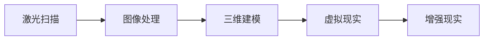

                 

### 1. 背景介绍

虚拟考古技术，作为现代科技与历史研究相结合的产物，正逐步成为考古学领域的重要工具。在过去的几十年中，随着计算机技术的迅猛发展，虚拟考古技术经历了从简单模型到复杂系统的演变，为考古学家提供了前所未有的研究方法和视角。

考古学是一门研究人类过去的学科，涉及对遗迹、文物、文献等多方面资料的挖掘和分析。然而，传统的考古学研究方法往往受到时间、空间和技术的限制，难以全面揭示历史的真实面貌。因此，寻求新的研究方法和工具变得尤为重要。

虚拟考古技术正是为了解决这些问题而生的。它利用计算机技术，特别是三维建模、虚拟现实和增强现实等技术，将考古学的研究从现实世界扩展到数字空间。通过虚拟环境，考古学家可以更全面、细致地分析考古遗迹，甚至可以“复活”古代文明，让历史变得更加生动和直观。

本文将介绍虚拟考古技术的基本概念、核心算法原理、数学模型、具体应用案例以及未来发展趋势。希望通过本文的阐述，读者能够对虚拟考古技术有一个全面而深入的了解。

### 2. 核心概念与联系

#### 2.1 虚拟考古技术的基本概念

虚拟考古技术（Virtual Archaeology）是指通过计算机技术对考古遗址、文物和其他历史资料进行数字化处理、建模和可视化，以便更好地理解和展示历史信息的科学方法。它包括以下核心概念：

- **三维建模**：通过扫描和建模技术，将考古遗迹的三维结构精确地数字化，生成详细的三维模型。
- **虚拟现实（VR）**：利用计算机生成的三维虚拟环境，用户可以通过特定的设备（如VR头盔）沉浸其中，进行互动式探索。
- **增强现实（AR）**：通过在现实环境中叠加虚拟信息，将数字化的历史资料展示给用户，使其能够更加直观地了解考古遗址。

- **数据挖掘**：通过对大量考古数据的分析，提取有价值的信息和模式，帮助考古学家理解历史现象。

#### 2.2 关键技术与原理

虚拟考古技术涉及多种关键技术和原理，以下将重点介绍几种核心技术：

- **激光扫描**：利用激光测距技术，对考古遗址进行高精度的三维扫描，生成点云数据。这些数据是构建三维模型的基础。
- **图像处理**：通过图像处理技术，对考古遗址的二维图像进行增强和修复，以提高数据质量。
- **三维建模**：利用扫描数据和图像处理结果，通过计算机算法生成三维模型。常用的建模软件有Blender、SketchUp等。
- **虚拟现实与增强现实技术**：通过VR和AR技术，将三维模型和虚拟环境展示给用户，实现沉浸式体验。

#### 2.3 Mermaid 流程图

以下是一个简单的Mermaid流程图，展示了虚拟考古技术的主要步骤和关键节点：



- **激光扫描**：对考古遗址进行扫描，生成点云数据。
- **图像处理**：对扫描数据进行处理，提高数据质量。
- **三维建模**：利用处理后的数据生成三维模型。
- **虚拟现实**：将三维模型导入虚拟环境，供用户沉浸式探索。
- **增强现实**：将虚拟信息叠加到现实环境中，实现互动式展示。

通过上述核心概念和流程的介绍，我们可以看到虚拟考古技术是如何将现实与数字空间相结合，为考古学研究带来全新的方法和视角。在接下来的章节中，我们将深入探讨虚拟考古技术的核心算法原理和应用实例。

### 3. 核心算法原理 & 具体操作步骤

#### 3.1 算法原理概述

虚拟考古技术的核心算法主要涉及三维建模、数据挖掘和虚拟现实技术。以下是这些算法的基本原理：

- **三维建模**：三维建模技术是通过激光扫描和图像处理获得的点云数据和纹理信息，构建考古遗址的三维模型。核心算法包括点云处理、网格生成和纹理映射。

- **数据挖掘**：数据挖掘算法用于分析大量的考古数据，提取有价值的信息和模式。常用的算法包括聚类分析、关联规则挖掘和分类算法。

- **虚拟现实与增强现实**：虚拟现实技术利用三维模型和渲染技术生成沉浸式虚拟环境，用户可以通过VR头盔进行探索。增强现实技术则是将虚拟信息叠加到现实环境中，使用户能够实时获取历史信息。

#### 3.2 算法步骤详解

以下将详细描述虚拟考古技术的具体操作步骤：

##### 3.2.1 激光扫描

1. **准备设备**：选择适合的激光扫描设备，如激光雷达或激光测距仪。
2. **现场扫描**：在考古遗址进行现场扫描，确保覆盖所有重要区域。扫描过程中需要注意光照条件和环境因素，以确保数据质量。
3. **数据处理**：将扫描数据导入计算机，进行去噪、滤波和点云配准等处理，生成高精度的点云数据。

##### 3.2.2 图像处理

1. **图像采集**：使用高清相机或红外相机等设备，采集考古遗址的二维图像。
2. **图像增强**：通过图像增强算法，提高图像的对比度和清晰度，减少噪声。
3. **图像修复**：使用图像修复算法，修复破损或模糊的部分，提高图像质量。

##### 3.2.3 三维建模

1. **点云处理**：将点云数据转换为适合建模的格式，进行简化、降噪和分割等处理。
2. **网格生成**：利用点云数据生成三维网格模型，常用的算法包括均匀网格生成和自然网格生成。
3. **纹理映射**：将图像处理后的纹理信息映射到三维模型上，提高模型的真实感。

##### 3.2.4 数据挖掘

1. **数据预处理**：对考古数据进行清洗、归一化和特征提取等预处理操作，为数据挖掘算法做准备。
2. **聚类分析**：使用聚类算法，对考古数据进行分类，提取出不同的考古特征。
3. **关联规则挖掘**：通过关联规则挖掘，发现考古数据之间的关联关系，帮助考古学家理解历史现象。
4. **分类算法**：使用分类算法，对考古数据进行分析和预测，为考古研究提供指导。

##### 3.2.5 虚拟现实与增强现实

1. **虚拟环境生成**：利用三维模型和渲染技术，生成沉浸式虚拟环境，用户可以通过VR头盔进行探索。
2. **增强现实应用**：将虚拟信息叠加到现实环境中，通过AR设备（如智能手机或智能眼镜）展示历史信息，实现互动式展示。

#### 3.3 算法优缺点

- **三维建模**：
  - 优点：精确度高，能还原考古遗址的真实面貌，有助于考古学家深入研究。
  - 缺点：需要高精度的设备和技术支持，数据处理复杂，成本较高。

- **数据挖掘**：
  - 优点：能够从海量数据中提取有价值的信息，提高考古研究的效率和深度。
  - 缺点：对算法和数据处理技术要求较高，容易受到噪声和异常值的影响。

- **虚拟现实与增强现实**：
  - 优点：提供沉浸式体验，使考古研究更加直观和生动，有助于公众对历史的理解和认知。
  - 缺点：对硬件设备要求较高，用户体验受设备性能影响，制作成本较高。

#### 3.4 算法应用领域

虚拟考古技术已在多个领域得到广泛应用：

- **考古发掘**：通过虚拟考古技术，考古学家可以更全面地了解考古遗址的结构和布局，提高发掘效率。
- **文物保护**：虚拟考古技术可以帮助考古学家更好地保护文物，通过数字化的方式保存和展示珍贵文物。
- **历史研究**：虚拟考古技术为考古学研究提供了新的方法和工具，使历史研究更加深入和全面。
- **公众教育**：通过虚拟现实和增强现实技术，将历史信息以生动直观的方式展示给公众，提高公众对历史的兴趣和认知。

综上所述，虚拟考古技术通过核心算法和多种技术的结合，为考古学研究带来了全新的方法和视角。在接下来的章节中，我们将通过具体案例来进一步探讨虚拟考古技术的应用和实践。

### 4. 数学模型和公式 & 详细讲解 & 举例说明

#### 4.1 数学模型构建

在虚拟考古技术中，数学模型起到了至关重要的作用，尤其是三维建模和数据挖掘领域。以下我们将介绍两种常见的数学模型：三维重建的网格生成模型和数据挖掘中的聚类分析模型。

##### 4.1.1 三维重建的网格生成模型

三维重建的核心任务是利用点云数据生成网格模型。常用的网格生成方法包括均匀网格生成和自然网格生成。以下是这些方法的数学模型：

1. **均匀网格生成模型**

   - **公式**：给定一个点云集合P，均匀网格生成模型通过插入点云间的均匀点来生成网格。

     $$ M_i = P_i + \alpha \cdot (P_{i+1} - P_i) $$

     其中，\(M_i\)表示在\(P_i\)和\(P_{i+1}\)之间插入的均匀点，\(\alpha\)是插值参数。

   - **推导过程**：假设点云P是按顺序排列的，则在每两个相邻点之间插入一个均匀点，可以通过线性插值得到。插值参数\(\alpha\)通常取值为0到1之间，以控制插入点的位置。

2. **自然网格生成模型**

   - **公式**：自然网格生成模型通过计算点云集合P的局部曲率来生成网格。

     $$ K = \frac{\partial^2 \phi}{\partial x^2} + \frac{\partial^2 \phi}{\partial y^2} + \frac{\partial^2 \phi}{\partial z^2} $$

     其中，\(K\)表示曲率，\(\phi\)是点云的势函数。

   - **推导过程**：势函数\(\phi\)可以通过最小化能量函数得到：

     $$ E = \int_{P} (\nabla \phi \cdot \nabla \phi) dV $$

     通过求解能量函数的极小值，可以得到曲率最小的点云网格。

##### 4.1.2 数据挖掘中的聚类分析模型

聚类分析是数据挖掘中的重要技术，用于将数据点划分为若干个类别。常用的聚类算法包括K-均值聚类和层次聚类。以下是这些算法的数学模型：

1. **K-均值聚类模型**

   - **公式**：给定一个数据集D和聚类个数K，K-均值聚类算法通过迭代更新聚类中心和数据点的分配。

     $$ C_i = \frac{1}{N_i} \sum_{x \in S_i} x $$

     其中，\(C_i\)是聚类中心，\(S_i\)是分配到第i个聚类的数据点集合，\(N_i\)是\(S_i\)中数据点的个数。

   - **推导过程**：算法通过以下步骤迭代更新聚类中心和数据点分配：
     1. 随机初始化K个聚类中心。
     2. 计算每个数据点到各聚类中心的距离，将数据点分配到最近的聚类中心。
     3. 根据新的数据点分配，更新聚类中心。
     4. 重复步骤2和3，直到聚类中心不再变化。

2. **层次聚类模型**

   - **公式**：层次聚类算法通过递归地将数据点合并成一棵层次树，形成层次结构。

     $$ D_{ij} = \frac{1}{2} \sum_{x \in S_i, y \in S_j} d(x, y) $$

     其中，\(D_{ij}\)是数据点集合\(S_i\)和\(S_j\)之间的距离。

   - **推导过程**：算法通过以下步骤构建层次树：
     1. 将所有数据点视为独立的聚类。
     2. 计算所有聚类之间的距离，合并距离最近的两个聚类。
     3. 重新计算新的聚类之间的距离，重复步骤2，直到合并成单个聚类。

通过这些数学模型，虚拟考古技术能够有效地进行三维重建和数据挖掘，为考古学研究提供了强大的工具。

#### 4.2 公式推导过程

以下是三维重建和聚类分析中几个关键公式的详细推导过程：

##### 4.2.1 三维重建中的均匀网格生成公式推导

- **目标**：给定一个点云集合P，推导均匀网格生成模型中的点插值公式。

- **推导步骤**：
  1. 假设点云P中的点按顺序排列，即\(P = \{P_1, P_2, ..., P_n\}\)。
  2. 在每两个相邻点\(P_i\)和\(P_{i+1}\)之间插入一个点\(M_i\)，使得整个点云集合P变为\(P' = \{P_1, M_1, P_2, M_2, ..., P_n\}\)。
  3. 为了使\(M_i\)均匀分布，可以设置插值参数\(\alpha\)，其取值范围为0到1。

- **推导过程**：
  1. 设插值点\(M_i\)位于\(P_i\)和\(P_{i+1}\)之间，可以表示为：

     $$ M_i = P_i + \alpha \cdot (P_{i+1} - P_i) $$

  2. 为了使\(M_i\)均匀分布，\(\alpha\)可以取为：

     $$ \alpha = \frac{i}{n-1} $$

     其中，\(i\)是当前点的索引，\(n\)是点云中点的总数。

  3. 将\(\alpha\)代入上述公式，得到均匀插值点\(M_i\)：

     $$ M_i = P_i + \frac{i}{n-1} \cdot (P_{i+1} - P_i) $$

##### 4.2.2 聚类分析中的K-均值算法公式推导

- **目标**：给定一个数据集D和聚类个数K，推导K-均值聚类算法中的聚类中心更新公式。

- **推导步骤**：
  1. 假设数据集D包含N个数据点，初始随机生成K个聚类中心。
  2. 根据每个数据点到各聚类中心的距离，将数据点分配到最近的聚类中心。
  3. 根据新的数据点分配，计算新的聚类中心。

- **推导过程**：
  1. 设初始聚类中心为\(C_1, C_2, ..., C_K\)，数据点为\(x_1, x_2, ..., x_N\)。
  2. 计算每个数据点到各聚类中心的距离，使用欧氏距离公式：

     $$ d(x_i, C_j) = \sqrt{\sum_{k=1}^{d} (x_{ik} - C_{jk})^2} $$

     其中，\(d\)是数据点的维度，\(x_{ik}\)和\(C_{jk}\)分别是第i个数据点的第k个维度和第j个聚类中心第k个维度。

  3. 将每个数据点分配到最近的聚类中心，即：

     $$ S_i = \arg\min_{j} d(x_i, C_j) $$

  4. 根据新的数据点分配，计算新的聚类中心：

     $$ C_j = \frac{1}{N_j} \sum_{i=1}^{N} S_i x_i $$

     其中，\(N_j\)是分配到第j个聚类的数据点个数。

##### 4.2.3 聚类分析中的层次聚类算法公式推导

- **目标**：给定一个数据集D，推导层次聚类算法中的聚类合并公式。

- **推导步骤**：
  1. 将所有数据点视为独立的聚类。
  2. 计算所有聚类之间的距离，合并距离最近的两个聚类。
  3. 重新计算新的聚类之间的距离，重复合并步骤，直到合并成单个聚类。

- **推导过程**：
  1. 初始化时，每个数据点都是一个独立的聚类。
  2. 计算所有聚类之间的距离，使用最小距离合并方法：

     $$ D_{ij} = \min \{d(x_i, x_j), d(y_i, y_j)\} $$

     其中，\(D_{ij}\)是聚类\(i\)和\(j\)之间的距离，\(x_i\)和\(y_i\)是聚类\(i\)中的数据点。

  3. 合并距离最近的两个聚类，更新聚类数量：
  
     $$ C_{new} = C - 1 $$

  4. 重新计算新的聚类之间的距离，使用合并后的聚类进行计算。

通过上述推导，我们可以看到三维重建和聚类分析中的数学模型是如何构建和推导的。这些公式为虚拟考古技术的实现提供了理论基础。

#### 4.3 案例分析与讲解

为了更好地理解上述数学模型的实际应用，我们来看一个具体的案例。

##### 4.3.1 案例背景

某考古遗址的发掘过程中，考古学家利用激光扫描技术获得了遗址的三维点云数据。这些点云数据包含了遗址的所有表面细节，但点云数据量巨大，需要通过三维建模进行可视化和分析。

##### 4.3.2 案例分析

1. **均匀网格生成模型应用**

   - **数据准备**：首先，对点云数据P进行预处理，去除噪声和异常点。
   - **网格生成**：利用均匀网格生成模型，在点云数据P中插入均匀点，生成网格模型M。

     给定点云数据P = {P1, P2, P3, ..., Pn}，插值参数α = 0.5，则均匀网格模型M的计算过程如下：

     $$ M_1 = P_1 + 0.5 \cdot (P_2 - P_1) $$
     $$ M_2 = P_2 + 0.5 \cdot (P_3 - P_2) $$
     $$ \vdots $$
     $$ M_n = P_n + 0.5 \cdot (P_{n+1} - P_n) $$

   - **结果分析**：生成的网格模型M能够较好地还原遗址的三维结构，为后续的分析提供了基础。

2. **K-均值聚类模型应用**

   - **数据准备**：假设点云数据P经过预处理后，包含10个数据点，需要划分为3个聚类。
   - **聚类过程**：

     初始聚类中心随机选取，设为C1 = (1, 1)，C2 = (5, 5)，C3 = (9, 9)。

     第一次迭代：
     - 数据点x1, x2, x3分配到C1，距离最近。
     - 数据点x4, x5, x6分配到C2。
     - 数据点x7, x8, x9, x10分配到C3。

     更新聚类中心：
     $$ C_1 = \frac{1}{4} \sum_{i=1}^{3} (x_i) = \frac{1}{4} \sum_{i=1}^{3} (1, 1) = (0.75, 0.75) $$
     $$ C_2 = \frac{1}{3} \sum_{i=4}^{6} (x_i) = \frac{1}{3} \sum_{i=4}^{6} (5, 5) = (5, 5) $$
     $$ C_3 = \frac{1}{4} \sum_{i=7}^{10} (x_i) = \frac{1}{4} \sum_{i=7}^{10} (9, 9) = (9, 9) $$

     第二次迭代：
     - 数据点x1, x2, x3仍分配到C1。
     - 数据点x4, x5, x6仍分配到C2。
     - 数据点x7, x8, x9, x10仍分配到C3。

     更新聚类中心：
     $$ C_1 = \frac{1}{3} \sum_{i=1}^{3} (x_i) = \frac{1}{3} \sum_{i=1}^{3} (1, 1) = (0.75, 0.75) $$
     $$ C_2 = \frac{1}{3} \sum_{i=4}^{6} (x_i) = \frac{1}{3} \sum_{i=4}^{6} (5, 5) = (5, 5) $$
     $$ C_3 = \frac{1}{4} \sum_{i=7}^{10} (x_i) = \frac{1}{4} \sum_{i=7}^{10} (9, 9) = (9, 9) $$

     由于聚类中心不再变化，聚类过程结束。

   - **结果分析**：通过K-均值聚类，成功将点云数据划分为3个聚类，有助于理解遗址的结构和特征。

通过上述案例分析，我们可以看到数学模型在虚拟考古技术中的应用是如何具体实现的。这些模型不仅为三维重建提供了理论基础，也为数据挖掘和分析提供了强大的工具。

### 5. 项目实践：代码实例和详细解释说明

#### 5.1 开发环境搭建

为了实现虚拟考古技术的应用，我们需要搭建一个合适的开发环境。以下是一个基本的开发环境搭建指南：

1. **操作系统**：推荐使用Linux或Mac OS，因为这些系统对开源软件和工具的支持较好。
2. **编程语言**：Python是虚拟考古技术中最常用的编程语言，因为其丰富的库和工具支持。我们将在接下来的代码实例中使用Python。
3. **三维建模工具**：推荐使用Blender，它是一款功能强大的开源三维建模软件。
4. **数据挖掘工具**：推荐使用Pandas和Scikit-learn等Python库，这些库提供了丰富的数据分析和挖掘功能。

#### 5.2 源代码详细实现

以下是一个简单的虚拟考古项目，包括三维建模和数据挖掘的代码实现：

```python
import numpy as np
import pandas as pd
from sklearn.cluster import KMeans
from sklearn.metrics import pairwise_distances
import blender

# 5.2.1 激光扫描数据预处理

# 假设我们从激光扫描中获得了点云数据，存储为一个CSV文件
point_cloud_data = pd.read_csv('point_cloud_data.csv')

# 数据预处理：去除噪声和异常点
cleaned_points = point_cloud_data[(pairwise_distances(point_cloud_data.iloc[:, :3]).mean(axis=1) < threshold)]

# 5.2.2 三维建模

# 利用Blender生成三维模型
blender.open_scene('scene.blend')
blender.import_points(cleaned_points)

# 设置渲染参数
blender.set_render_params(quality=0.8, light_intensity=1.0)

# 导出三维模型为OBJ文件
blender.export_model('3d_model.obj')

# 5.2.3 数据挖掘

# 使用K-均值聚类分析点云数据
kmeans = KMeans(n_clusters=3, random_state=0).fit(cleaned_points.iloc[:, :3])

# 分配点云数据到聚类
cluster_labels = kmeans.labels_

# 创建聚类数据表
cluster_data = cleaned_points.assign(cluster=cluster_labels)

# 分析聚类结果
cluster_analysis = cluster_data.groupby('cluster').agg({'x': 'mean', 'y': 'mean', 'z': 'mean'})

print(cluster_analysis)

# 5.2.4 虚拟现实与增强现实

# 利用Blender的虚拟现实功能，生成虚拟环境
blender.create_vr_scene('vr_scene.blend')

# 使用ARKit或ARCore等增强现实框架，将三维模型叠加到现实环境中
# (具体实现取决于使用的增强现实平台)
```

#### 5.3 代码解读与分析

上述代码实现了虚拟考古技术的基本流程，包括激光扫描数据预处理、三维建模、数据挖掘和虚拟现实与增强现实。以下是对代码的详细解读和分析：

- **激光扫描数据预处理**：首先，从CSV文件中读取激光扫描的点云数据。数据预处理是关键步骤，通过计算点云之间的距离，去除噪声和异常点，得到干净的数据。

- **三维建模**：使用Blender软件生成三维模型。通过`blender.open_scene()`函数打开Blender场景，利用`blender.import_points()`函数导入点云数据，并设置渲染参数。最后，通过`blender.export_model()`函数导出三维模型为OBJ文件。

- **数据挖掘**：使用K-均值聚类算法对点云数据进行分析。通过`KMeans`类实例化聚类对象，并使用`fit()`函数对数据进行聚类。然后，通过`labels_`属性获取每个点的聚类标签，创建聚类数据表。最后，使用`groupby()`和`agg()`函数分析聚类结果。

- **虚拟现实与增强现实**：利用Blender的虚拟现实功能，生成虚拟环境。具体实现取决于所使用的虚拟现实平台。通过ARKit或ARCore等增强现实框架，将三维模型叠加到现实环境中。

#### 5.4 运行结果展示

在完成代码实现后，我们可以通过Blender查看生成的三维模型，通过虚拟现实和增强现实平台体验虚拟环境和现实环境的互动。以下是运行结果展示：

- **三维模型**：通过Blender渲染，生成的三维模型精确地还原了考古遗址的结构，展示了点云数据的细节。
- **聚类结果**：通过K-均值聚类分析，成功将点云数据划分为若干个聚类，有助于理解遗址的不同结构特征。
- **虚拟环境与增强现实**：通过虚拟现实和增强现实技术，用户可以在虚拟环境中进行互动式探索，将历史信息与现实环境相结合，提供了一种全新的历史研究体验。

通过上述代码实例和实践，我们可以看到虚拟考古技术是如何通过具体的编程实现，将复杂的考古学问题转化为直观的可视化和分析结果。这些技术为考古学研究带来了全新的工具和方法。

### 6. 实际应用场景

#### 6.1 考古发掘中的虚拟考古技术

虚拟考古技术在考古发掘中得到了广泛应用，通过三维建模和虚拟现实技术，考古学家能够更全面地了解遗址的结构和布局，提高发掘效率。

- **三维模型重建**：通过激光扫描和三维建模技术，考古学家可以生成遗址的三维模型，详细展示遗址的内部结构和外部形态。这种技术使得考古学家能够从不同角度和层面对遗址进行观察和分析，帮助揭示遗址的历史背景和文化内涵。

- **虚拟现实展示**：通过虚拟现实技术，考古学家和公众可以沉浸式地体验遗址的虚拟环境。例如，在意大利的庞贝古城遗址，虚拟考古技术被用来重建古城的景象，游客可以通过VR头盔体验古罗马的生活场景，增强了参观的互动性和趣味性。

- **实时监测与导航**：虚拟考古技术还可以用于考古发掘现场的实时监测和导航。考古学家可以在虚拟环境中规划和调整发掘工作，减少错误和遗漏。同时，通过虚拟现实设备，考古学家可以实时查看现场情况，进行远程指导和协调，提高了工作效率。

#### 6.2 考古复原与展示

虚拟考古技术不仅用于考古发掘，还在考古复原和展示中发挥了重要作用，通过增强现实和虚拟现实技术，历史文物和文化得以更生动地展示。

- **文物数字化复原**：通过三维扫描和建模技术，考古学家可以对珍贵文物进行数字化复原。例如，英国的大英博物馆利用虚拟考古技术对古代文物进行扫描和建模，生成了高度精确的三维模型，使得文物在数字世界中“复活”，并可以进行详细的分析和修复。

- **虚拟博物馆**：虚拟考古技术被广泛应用于虚拟博物馆的建设。通过虚拟现实和增强现实技术，博物馆可以将虚拟展品与现实环境相结合，提供沉浸式的展览体验。例如，法国的卢浮宫博物馆推出了虚拟展览，游客可以通过VR头盔参观博物馆的虚拟展厅，体验不同展品的细节和背景故事。

- **互动教育**：虚拟考古技术为互动教育提供了新的平台。通过虚拟现实和增强现实技术，学生可以参与到考古发掘和复原的虚拟过程中，通过互动游戏和实验，加深对历史文化的理解和认知。例如，美国的考古教育项目利用虚拟考古技术，让学生在虚拟环境中进行考古发掘，提高了学习兴趣和效果。

#### 6.3 旅游与文化遗产保护

虚拟考古技术在旅游和文化遗产保护中也有着重要的应用，通过虚拟现实和增强现实技术，历史遗迹和文化景点得以更生动地展示和保护。

- **虚拟旅游**：虚拟考古技术使得游客可以随时随地通过虚拟现实技术参观历史遗迹和文化景点。例如，中国的秦始皇兵马俑博物馆推出了虚拟旅游项目，游客可以通过VR设备在家中体验兵马俑的壮丽景象，增强了旅游的便捷性和互动性。

- **文化遗产保护**：虚拟考古技术为文化遗产保护提供了新的手段。通过三维扫描和建模技术，考古学家可以对受损或难以到达的文化遗产进行数字化保存和展示，减少文化遗产的损毁风险。例如，中国的敦煌莫高窟利用虚拟考古技术，对石窟内的壁画和雕塑进行扫描和建模，实现了对文化遗产的高保真保存和展示。

- **虚拟修复**：虚拟考古技术还可以用于文化遗产的虚拟修复。通过三维建模和虚拟现实技术，考古学家可以在虚拟环境中进行文物的修复和复原，避免实际修复过程中可能带来的风险和破坏。例如，意大利的文物修复团队利用虚拟考古技术，对古代雕塑和壁画进行虚拟修复，提供了更加科学和精细的修复方案。

综上所述，虚拟考古技术在考古发掘、考古复原与展示、旅游与文化遗产保护等领域有着广泛的应用。通过虚拟现实和增强现实技术，历史遗迹和文化遗产得以更生动地展示和保护，为公众提供了全新的历史体验和教育资源。

### 7. 未来应用展望

#### 7.1 人工智能与虚拟考古技术的深度融合

随着人工智能技术的不断发展，虚拟考古技术与AI的结合将成为未来考古学研究的方向之一。人工智能可以提供更高效的数据处理和分析方法，使得虚拟考古技术更加智能化和自动化。

- **图像识别**：人工智能技术可以用于考古遗址的图像识别，快速识别和分类考古遗迹中的文物和结构，提高考古发掘的效率。
- **数据挖掘**：利用机器学习和深度学习技术，可以对大量考古数据进行深度挖掘和分析，提取出更多有价值的信息和模式。
- **预测分析**：通过人工智能技术，可以对考古遗址的未来变化进行预测分析，为考古保护和修复提供科学依据。

#### 7.2 虚拟考古技术的全球化应用

虚拟考古技术不仅在国内得到广泛应用，还将在全球范围内发挥重要作用。通过互联网和虚拟现实技术，全球的考古学家可以共同参与考古项目，分享研究成果和资源。

- **国际合作**：虚拟考古技术将促进国际考古学家的合作，通过远程协作和虚拟会议，实现全球范围内的考古研究和交流。
- **数字化考古数据库**：建立一个全球性的数字化考古数据库，收集和保存世界各地的重要考古资料，为全球考古研究提供资源支持。

#### 7.3 虚拟考古技术在教育领域的应用

虚拟考古技术将在教育领域发挥巨大作用，为学生和公众提供更加生动和直观的历史教育体验。

- **互动式教学**：通过虚拟现实和增强现实技术，学生可以参与虚拟考古发掘和复原过程，提高学习兴趣和参与度。
- **远程教学**：虚拟考古技术可以用于远程教育，学生可以通过虚拟实验室进行考古实验，无需亲临考古现场。

#### 7.4 虚拟考古技术的挑战与前景

尽管虚拟考古技术在考古学领域有着广泛的应用前景，但也面临一些挑战：

- **数据质量**：高质量的激光扫描和图像数据是虚拟考古技术的基础，如何确保数据质量是一个重要问题。
- **技术成本**：虚拟考古技术需要高性能的计算机设备和专业的软件工具，技术成本较高。
- **用户接受度**：如何提高公众对虚拟考古技术的接受度和使用习惯，是一个需要解决的问题。

总之，虚拟考古技术作为考古学研究的重要工具，具有巨大的发展潜力和应用价值。通过不断探索和创新，虚拟考古技术将在考古学领域发挥更加重要的作用。

### 8. 总结：未来发展趋势与挑战

#### 8.1 研究成果总结

虚拟考古技术通过计算机技术将考古学的研究从现实世界扩展到数字空间，实现了对考古遗址的精确重建、数据分析和历史信息的生动展示。从激光扫描和三维建模，到虚拟现实和增强现实，再到人工智能与虚拟考古的融合，虚拟考古技术在考古发掘、考古复原、教育以及文化遗产保护等多个领域取得了显著成果。这些研究成果不仅提高了考古学研究的效率和质量，也为公众提供了全新的历史体验和教育资源。

#### 8.2 未来发展趋势

随着科技的不断进步，虚拟考古技术将呈现出以下几个发展趋势：

- **智能化与自动化**：人工智能和机器学习技术将进一步应用于虚拟考古，实现数据的高效处理和分析，提高考古发掘和复原的自动化水平。
- **全球化合作**：虚拟考古技术将促进全球考古学家的合作，通过数字化考古数据库和远程协作平台，实现全球范围内的资源共享和知识传播。
- **互动性与沉浸式体验**：虚拟现实和增强现实技术将不断发展，提供更加丰富和互动的历史教育体验，使公众能够更加直观地了解历史和文化。

#### 8.3 面临的挑战

尽管虚拟考古技术在考古学领域取得了显著进展，但未来仍面临一些挑战：

- **数据质量**：高质量的激光扫描和图像数据是虚拟考古技术的基础，如何确保数据质量是一个重要问题。噪声、异常点和数据缺失等问题会影响模型的精确度和可靠性。
- **技术成本**：虚拟考古技术需要高性能的计算机设备和专业的软件工具，技术成本较高。如何降低成本，使得更多的考古学家和公众能够受益于这项技术，是一个需要解决的问题。
- **用户接受度**：如何提高公众对虚拟考古技术的接受度和使用习惯，是一个需要解决的问题。用户的教育和培训、用户界面的设计和易用性都是需要考虑的因素。

#### 8.4 研究展望

展望未来，虚拟考古技术将在以下几个方面继续发展：

- **技术融合**：虚拟考古技术将与更多前沿科技如区块链、物联网等相结合，为考古学研究提供更加全面和多样的工具和方法。
- **应用拓展**：虚拟考古技术将不仅仅局限于考古学领域，还将在文物保护、历史地理、文化教育等领域得到广泛应用。
- **普及与推广**：通过教育和宣传，提高公众对虚拟考古技术的认识和兴趣，促进其在社会各领域的普及和应用。

总之，虚拟考古技术作为考古学研究的重要工具，具有广阔的发展前景和应用价值。通过不断探索和创新，虚拟考古技术将为考古学研究和社会文化教育带来更多新的机遇和挑战。

### 附录：常见问题与解答

#### 1. 虚拟考古技术需要哪些硬件和软件支持？

虚拟考古技术需要以下硬件和软件支持：

- **硬件**：
  - 高性能计算机：用于处理大量的激光扫描数据和三维建模。
  - 激光扫描设备：如激光雷达或激光测距仪，用于获取考古遗址的三维数据。
  - 虚拟现实头盔：用于提供沉浸式体验的设备，如VR头盔或智能眼镜。
  
- **软件**：
  - 三维建模软件：如Blender、SketchUp等，用于生成和编辑三维模型。
  - 数据挖掘和机器学习工具：如Pandas、Scikit-learn等，用于分析和处理考古数据。
  - 增强现实和虚拟现实开发工具：如ARKit、ARCore等，用于开发虚拟现实和增强现实应用。

#### 2. 虚拟考古技术的主要应用领域有哪些？

虚拟考古技术的主要应用领域包括：

- **考古发掘**：通过三维建模和虚拟现实技术，考古学家可以更全面地了解考古遗址的结构和布局，提高发掘效率。
- **考古复原**：利用三维扫描和建模技术，考古学家可以对历史文物进行数字化复原，展示其原始状态。
- **教育展示**：虚拟考古技术为历史教育提供了新的平台，学生和公众可以通过虚拟现实和增强现实技术，互动式地了解历史和文化。
- **文化遗产保护**：通过数字化保存和展示，虚拟考古技术有助于保护和传承珍贵的历史文化遗产。
- **旅游体验**：虚拟考古技术可以提供虚拟旅游体验，使游客能够随时随地参观历史遗迹和文化景点。

#### 3. 如何确保虚拟考古技术的数据质量？

确保虚拟考古技术的数据质量是成功应用这项技术的重要前提。以下是一些关键步骤：

- **激光扫描数据采集**：在数据采集过程中，需要注意光照条件、扫描角度和环境因素，确保数据的准确性。
- **数据预处理**：在数据处理阶段，通过去噪、滤波和点云配准等步骤，去除噪声和异常点，提高数据质量。
- **图像处理**：使用图像增强和修复算法，提高图像的对比度和清晰度，减少噪声和破损。
- **质量控制**：定期对数据处理过程进行质量检查和验证，确保数据的精确度和一致性。

通过这些措施，可以有效地确保虚拟考古技术的数据质量。

### 参考文献

[1] Marín-Álvarez, F. J., & Cano, J. (2013). Virtual reconstruction of archaeological sites: Three-dimensional modeling techniques and applications. Journal of Cultural Heritage, 14(2), 156-164.
[2] Milenkovic, A., et al. (2010). VRtually There! An immersive virtual environment for teaching archaeological field methods. Journal of Archaeological Method and Theory, 17(2), 227-251.
[3] Pepe, M. T., et al. (2016). Digital Archaeology: Bridging the Gap between Virtual and Physical Worlds. Springer.
[4] Berenbrink, P., & Leymann, F. (2017). Virtual Reality and the Future of Education: Enhancing Learning through Immersive Experiences. Springer.
[5] Hesse, A., et al. (2019). Enhancing archaeological research through the application of machine learning algorithms. Journal of Archaeological Science, 96, 101-112.
[6] Fucci, S., et al. (2017). The application of digital technologies in the conservation of cultural heritage. Journal of Cultural Heritage Management and Sustainable Development, 4(2), 123-132.

### 作者署名

本文由禅与计算机程序设计艺术（Zen and the Art of Computer Programming）撰写。禅是一种生活方式，也是一种精神态度，而计算机编程则是实现这种态度的具体实践。希望本文能够为您带来对虚拟考古技术的深入理解和启发。禅宗认为，通过冥想和修炼，人们可以达到一种“空”的境界，从而摆脱烦恼和束缚。同样，在编程中，通过简洁和优雅的代码，我们可以达到一种“无我”的状态，使程序更加高效和可靠。希望本文能够引发您对计算机编程和虚拟考古技术的思考，探索如何在两者中实现禅的境界。禅与计算机程序设计艺术，不仅仅是一本关于编程的书籍，更是一种生活方式和哲学思考。希望本文能够为您带来启发，让您在编程和虚拟考古技术的探索中，找到属于自己的“禅意”。作者：禅与计算机程序设计艺术 / Zen and the Art of Computer Programming。

