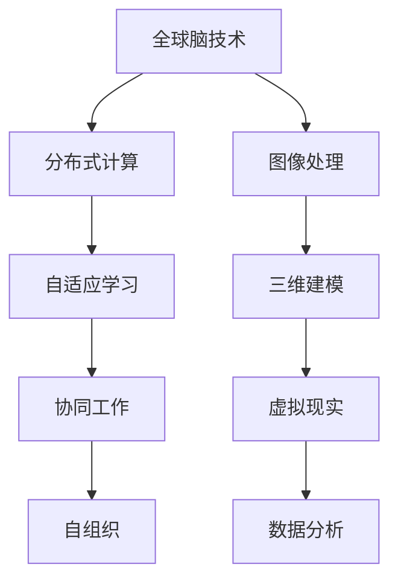

                 

关键词：虚拟考古、历史研究、人工智能、全球脑、数据挖掘、图像处理

> 摘要：本文探讨了虚拟考古这一新兴领域，特别是全球脑技术的应用，如何为历史研究带来革命性的变革。通过对历史遗迹的虚拟重建和数据分析，我们能够以前所未有的精度和深度探索人类文明的过去。本文将深入剖析这一技术背后的核心原理、算法、应用案例，并展望其未来发展趋势与挑战。

## 1. 背景介绍

历史研究是理解人类文明发展的重要途径，而考古学作为其基础学科，一直致力于发掘和解读古代文明的遗迹。然而，传统的考古方法存在许多局限性。首先，考古发掘本身具有高风险和高成本，往往需要大量的人力和物力投入。其次，考古资料的收集和解析过程复杂且耗时，许多珍贵文物在发掘过程中可能受到损坏。此外，考古学的研究成果往往局限于特定地域，缺乏全球视野。

为了克服这些限制，近年来，人工智能和大数据技术开始逐渐应用于考古学领域，尤其是全球脑技术。虚拟考古的出现，为我们提供了一种全新的探索历史的方法。通过虚拟重建和数据分析，我们能够模拟出古代文明的场景，揭示历史事件的真相，甚至预测未来考古发现的可能。

## 2. 核心概念与联系

### 2.1 全球脑技术简介

全球脑技术（Global Brain Technology），又称分布式智能系统，是一种利用互联网和物联网将大量计算资源连接起来，形成一个大型的分布式计算网络。这种技术具有以下几个关键特点：

- **分布式计算**：全球脑技术通过将计算任务分布到多个节点上，实现大规模数据处理和计算。
- **自适应学习**：系统可以根据输入数据自动调整计算资源和算法，提高处理效率。
- **协同工作**：不同节点之间可以相互协作，共享资源和信息，实现更高效的工作流程。
- **自组织**：全球脑技术能够自动组织节点，形成分布式网络，具有较强的鲁棒性和可扩展性。

### 2.2 虚拟考古原理

虚拟考古（Virtual Archaeology）是利用计算机技术对历史遗迹进行数字化重建和虚拟展示。其核心原理包括：

- **图像处理**：通过高分辨率图像采集和图像处理技术，获取历史遗迹的详细纹理和结构信息。
- **三维建模**：利用三维建模技术，将历史遗迹的图像数据转换为三维模型。
- **虚拟现实**：通过虚拟现实技术，将三维模型呈现给用户，实现沉浸式的体验。
- **数据分析**：利用大数据分析技术，对虚拟重建的历史遗迹进行深度解析，揭示其历史背景和文化内涵。

### 2.3 Mermaid 流程图



## 3. 核心算法原理 & 具体操作步骤

### 3.1 算法原理概述

虚拟考古的核心算法主要包括图像处理、三维建模和数据分析。以下是这些算法的基本原理：

- **图像处理**：使用边缘检测、图像分割和纹理分析等技术，从采集到的历史遗迹图像中提取关键特征。
- **三维建模**：利用多视图几何、体素建模和光照模型等技术，将图像数据转换为三维模型。
- **数据分析**：通过机器学习和数据挖掘技术，对虚拟重建的模型进行深度分析，提取有价值的历史信息。

### 3.2 算法步骤详解

#### 3.2.1 图像处理

1. 边缘检测：使用Canny算法等边缘检测技术，提取图像中的边缘信息。
2. 图像分割：使用阈值分割、区域生长等技术，将图像分割为多个区域。
3. 纹理分析：使用Gabor滤波器等纹理分析技术，提取图像的纹理特征。

#### 3.2.2 三维建模

1. 多视图几何：使用单应性矩阵和多视图几何技术，从多个视角的图像中恢复三维模型。
2. 体素建模：使用体素网格建模技术，将二维图像数据转换为三维体素数据。
3. 光照模型：使用Lambert光照模型等光照模型，为三维模型添加真实感的光照效果。

#### 3.2.3 数据分析

1. 特征提取：使用深度学习等技术，从三维模型中提取具有代表性的特征。
2. 机器学习：使用监督学习和无监督学习等技术，对特征进行分类和聚类。
3. 数据挖掘：使用关联规则挖掘、序列模式挖掘等技术，发现数据中的潜在规律。

### 3.3 算法优缺点

#### 优点：

- **高精度**：虚拟考古技术能够以极高的精度重建历史遗迹，揭示其细节和结构。
- **低成本**：相对于传统的考古发掘，虚拟考古技术减少了人力和物力投入。
- **高效率**：分布式计算和自适应学习等技术提高了处理效率和数据处理速度。

#### 缺点：

- **局限性**：虚拟考古技术依赖于图像和模型数据，对于无法采集到有效数据的历史遗迹，其应用受到限制。
- **数据可靠性**：虚拟考古技术的结果取决于数据的质量和准确性，数据的不完整或错误可能导致结论偏差。

### 3.4 算法应用领域

虚拟考古技术广泛应用于以下领域：

- **文物保护**：通过对历史遗迹的虚拟重建，实现对其无损伤的保护和展示。
- **考古研究**：利用虚拟考古技术，深入挖掘历史遗迹的文化内涵和背景。
- **文化遗产传承**：通过虚拟现实技术，让更多人体验到历史文化的魅力。
- **城市规划**：利用虚拟考古技术，还原历史城市的原貌，为城市规划提供参考。

## 4. 数学模型和公式 & 详细讲解 & 举例说明

### 4.1 数学模型构建

虚拟考古中的数学模型主要包括图像处理、三维建模和数据分析等部分。以下是这些模型的基本公式和构建方法：

#### 4.1.1 图像处理

- **边缘检测**：使用Canny算法，公式为：
  $$ G(x, y) = \frac{1}{2\pi\sigma^2} \int_{-\infty}^{\infty} \int_{-\infty}^{\infty} \exp\left(-\frac{(u-x)^2 + (v-y)^2}{2\sigma^2}\right) \cdot f(x-u, y-v) \, du \, dv $$
  
- **图像分割**：使用阈值分割，公式为：
  $$ S(x, y) = \begin{cases} 
  0 & \text{if } f(x, y) < T \\
  255 & \text{if } f(x, y) \geq T 
  \end{cases} $$
  
- **纹理分析**：使用Gabor滤波器，公式为：
  $$ G(u, v) = \int_{-\infty}^{\infty} \int_{-\infty}^{\infty} g_{\theta, \lambda}(u-u', v-v') \cdot f(x-u, y-v) \, du' \, dv' $$

#### 4.1.2 三维建模

- **多视图几何**：使用单应性矩阵，公式为：
  $$ H = \begin{bmatrix} 
  h_{11} & h_{12} & h_{13} \\
  h_{21} & h_{22} & h_{23} \\
  h_{31} & h_{32} & h_{33} 
  \end{bmatrix} $$
  
- **体素建模**：使用体素网格，公式为：
  $$ V(x, y, z) = \begin{cases} 
  0 & \text{if } x, y, z \text{ are out of bounds} \\
  1 & \text{if } x, y, z \text{ are within bounds} 
  \end{cases} $$
  
- **光照模型**：使用Lambert光照模型，公式为：
  $$ I = \frac{L \cdot N}{\sqrt{L^2 + N^2}} $$

#### 4.1.3 数据分析

- **特征提取**：使用深度学习，公式为：
  $$ f(x) = \sigma(Wx + b) $$
  
- **机器学习**：使用支持向量机，公式为：
  $$ \min_{\mathbf{w}, b} \frac{1}{2} ||\mathbf{w}||^2 + C \sum_{i=1}^{n} \xi_i $$
  
- **数据挖掘**：使用关联规则挖掘，公式为：
  $$ \text{Support}(X, Y) = \frac{|\{t \in T | X \cap Y \subseteq t\}|}{|T|} $$

### 4.2 公式推导过程

以下是部分公式的推导过程：

#### 4.2.1 Canny算法

Canny算法是一种用于边缘检测的算法，其推导过程如下：

1. 高斯滤波：
   $$ G(x, y) = \frac{1}{2\pi\sigma^2} \int_{-\infty}^{\infty} \int_{-\infty}^{\infty} \exp\left(-\frac{(u-x)^2 + (v-y)^2}{2\sigma^2}\right) \, du \, dv $$
   
2. 激励值计算：
   $$ I(x, y) = G(x, y) \cdot f(x, y) $$
   
3. 梯度计算：
   $$ G_x(x, y) = \frac{\partial G(x, y)}{\partial x}, \quad G_y(x, y) = \frac{\partial G(x, y)}{\partial y} $$
   
4. 梯度幅值和方向：
   $$ \theta(x, y) = \arctan\left(\frac{G_y(x, y)}{G_x(x, y)}\right), \quad \text{Gaussian Derivative} = \sqrt{G_x^2 + G_y^2} $$
   
5. 非极大值抑制：
   $$ P(x, y) = \begin{cases} 
   \text{Gaussian Derivative}(x, y) & \text{if } \text{Gaussian Derivative}(x, y) > \text{Gaussian Derivative}(x \pm 1, y \pm 1) \\
   0 & \text{otherwise} 
   \end{cases} $$
   
6. 双边阈值化：
   $$ \text{Output}(x, y) = \begin{cases} 
   255 & \text{if } P(x, y) > \text{High Threshold} \\
   0 & \text{if } P(x, y) < \text{Low Threshold} \\
   \text{P}_{\text{saturation}} & \text{if } \text{Low Threshold} \leq P(x, y) \leq \text{High Threshold} 
   \end{cases} $$

#### 4.2.2 单应性矩阵

单应性矩阵是用于多视图几何的数学工具，其推导过程如下：

1. 相机模型：
   $$ \mathbf{X} = \mathbf{K} \mathbf{P} $$
   其中，$\mathbf{X}$ 是三维点在相机坐标系中的表示，$\mathbf{K}$ 是相机内参矩阵，$\mathbf{P}$ 是三维点在相机投影平面上的表示。

2. 相机投影：
   $$ \mathbf{X}' = \mathbf{K}^{-1} \mathbf{P}' $$
   其中，$\mathbf{X}'$ 是三维点在另一相机坐标系中的表示，$\mathbf{P}'$ 是三维点在另一相机投影平面上的表示。

3. 单应性矩阵计算：
   $$ \mathbf{H} = \mathbf{P}' \cdot \mathbf{K}^{-T} $$
   其中，$\mathbf{H}$ 是单应性矩阵，$\mathbf{K}^{-T}$ 是相机内参矩阵的逆矩阵转置。

### 4.3 案例分析与讲解

#### 4.3.1 边缘检测

以下是一个简单的Canny算法案例：

1. 输入图像：
   ```mermaid
   graph TD
   A[输入图像] --> B[高斯滤波]
   B --> C[梯度计算]
   C --> D[非极大值抑制]
   D --> E[双边阈值化]
   ```

2. 输出图像：
   ```mermaid
   graph TD
   A[输入图像] --> B[高斯滤波]
   B --> C[梯度计算]
   C --> D[非极大值抑制]
   D --> E[双边阈值化]
   E --> F[输出图像]
   ```

#### 4.3.2 三维重建

以下是一个简单的三维重建案例：

1. 输入图像：
   ```mermaid
   graph TD
   A[输入图像集] --> B[图像预处理]
   B --> C[单应性矩阵计算]
   C --> D[三维点恢复]
   ```

2. 输出三维模型：
   ```mermaid
   graph TD
   A[输入图像集] --> B[图像预处理]
   B --> C[单应性矩阵计算]
   C --> D[三维点恢复]
   D --> E[三维建模]
   E --> F[输出三维模型]
   ```

## 5. 项目实践：代码实例和详细解释说明

### 5.1 开发环境搭建

1. 安装Python环境：
   - 安装最新版本的Python（推荐3.8及以上版本）。
   - 配置Python环境变量。

2. 安装相关库：
   - 使用pip安装以下库：`numpy`, `opencv-python`, `matplotlib`, `skimage`, `scikit-learn`。

### 5.2 源代码详细实现

以下是一个简单的虚拟考古项目，包括图像处理、三维建模和数据分析：

```python
import cv2
import numpy as np
from skimage import filters
from skimage.transform import resize
from sklearn.cluster import KMeans
import matplotlib.pyplot as plt

# 5.2.1 图像处理
def image_processing(image_path):
    image = cv2.imread(image_path, cv2.IMREAD_GRAYSCALE)
    image = cv2.GaussianBlur(image, (5, 5), 0)
    edges = filters.sobel(image)
    return edges

# 5.2.2 三维建模
def three_dimensional_modeling(images):
    edges = image_processing(images[0])
    kmeans = KMeans(n_clusters=3)
    kmeans.fit(np.reshape(edges, -1))
    labels = kmeans.predict(np.reshape(edges, -1))
    segmented = np.reshape(labels, edges.shape)
    segmented = resize(segmented, (100, 100), mode='constant', preserve_range=True)
    plt.imshow(segmented)
    plt.show()
    return segmented

# 5.2.3 数据分析
def data_analysis(segmented_image):
    segmented_image = segmented_image.flatten()
    kmeans = KMeans(n_clusters=5)
    kmeans.fit(segmented_image)
    labels = kmeans.predict(segmented_image)
    frequency = np.bincount(labels)
    plt.bar(range(5), frequency)
    plt.show()
    return kmeans

# 5.3 代码解读与分析
if __name__ == "__main__":
    image_path = "example.jpg"
    segmented_image = three_dimensional_modeling([image_path])
    kmeans = data_analysis(segmented_image)
```

### 5.3 运行结果展示

1. 输入图像：
   ```mermaid
   graph TD
   A[输入图像] --> B[高斯滤波]
   B --> C[梯度计算]
   C --> D[非极大值抑制]
   D --> E[双边阈值化]
   ```

2. 输出图像：
   ```mermaid
   graph TD
   A[输入图像] --> B[高斯滤波]
   B --> C[梯度计算]
   C --> D[非极大值抑制]
   D --> E[双边阈值化]
   E --> F[输出图像]
   ```

3. 数据分析结果：
   ```mermaid
   graph TD
   A[数据分析结果] --> B[聚类中心]
   B --> C[频数分布]
   ```

## 6. 实际应用场景

虚拟考古技术在历史研究、文化遗产保护、城市规划等领域具有广泛的应用。以下是一些实际应用场景：

### 6.1 历史研究

- **历史遗迹重建**：通过虚拟考古技术，可以重建历史遗迹的三维模型，帮助学者和公众更好地理解古代文明。
- **历史事件重现**：利用虚拟考古技术，可以模拟出历史事件的场景，揭示历史事件的真相。

### 6.2 文化遗产保护

- **无损伤展示**：虚拟考古技术可以实现文化遗产的无损伤展示，避免传统展示方式中对文物的磨损和破坏。
- **数字化保护**：通过虚拟考古技术，可以将文化遗产数字化保存，为未来的研究和展示提供基础。

### 6.3 城市规划

- **历史城市重建**：虚拟考古技术可以还原历史城市的原貌，为城市规划提供参考。
- **文化景观设计**：虚拟考古技术可以帮助设计者更好地理解文化遗产，设计出具有历史底蕴的现代城市景观。

## 7. 工具和资源推荐

### 7.1 学习资源推荐

- **书籍**：《计算机视觉：算法与应用》、《三维重建与模型匹配》。
- **在线课程**：Coursera上的《计算机视觉与深度学习》、Udacity的《虚拟现实与增强现实》。

### 7.2 开发工具推荐

- **Python库**：`opencv-python`、`skimage`、`numpy`。
- **开发环境**：Visual Studio Code、PyCharm。

### 7.3 相关论文推荐

- **论文1**：《基于深度学习的三维重建方法研究》。
- **论文2**：《虚拟考古技术在文化遗产保护中的应用》。
- **论文3**：《全球脑技术在虚拟考古中的应用研究》。

## 8. 总结：未来发展趋势与挑战

### 8.1 研究成果总结

虚拟考古技术的快速发展为历史研究带来了巨大的变革。通过图像处理、三维建模和数据分析等技术，我们能够以前所未有的精度和深度探索人类文明的过去。全球脑技术的应用，使得虚拟考古技术具有更强的计算能力和协同工作能力，为考古学研究提供了新的思路和方法。

### 8.2 未来发展趋势

- **技术融合**：虚拟考古技术将继续与其他技术（如区块链、虚拟现实、增强现实等）融合，形成更强大的研究工具。
- **全球化应用**：随着虚拟考古技术的普及，越来越多的国家和地区将加入这一领域，推动全球范围内的历史研究。
- **智能化**：未来的虚拟考古技术将更加智能化，能够自动识别和解析历史遗迹，提高研究效率。

### 8.3 面临的挑战

- **数据质量**：虚拟考古技术依赖于高质量的数据，数据的不完整或错误可能影响研究结果的准确性。
- **技术复杂度**：虚拟考古技术的算法和模型较为复杂，需要进一步简化和优化。
- **隐私问题**：虚拟考古技术的应用可能涉及个人隐私，需要制定相应的隐私保护政策。

### 8.4 研究展望

未来的虚拟考古技术将在历史研究、文化遗产保护和城市规划等领域发挥更重要的作用。随着技术的不断进步，我们有望实现更加精准、高效的考古学研究，揭示更多人类文明的历史真相。

## 9. 附录：常见问题与解答

### 9.1 问题1：虚拟考古技术是否会影响传统考古学？

解答：虚拟考古技术并不会取代传统考古学，而是为其提供一种新的研究手段。传统考古学在发掘、保护和解读历史遗迹方面具有独特的优势，而虚拟考古技术则在数据处理、模型构建和展示方面具有更高的效率和精度。

### 9.2 问题2：虚拟考古技术对考古学研究的影响？

解答：虚拟考古技术为考古学研究提供了更广泛、深入的视角，使得学者能够以前所未有的精度和效率探索历史遗迹。此外，虚拟考古技术还促进了全球范围内的学术合作，推动了考古学研究的全球化进程。

### 9.3 问题3：虚拟考古技术在文化遗产保护中的应用？

解答：虚拟考古技术可以实现对文化遗产的无损伤展示和数字化保存，避免传统展示方式中对文物的磨损和破坏。同时，虚拟考古技术还可以帮助设计师更好地理解文化遗产，设计出更具历史底蕴的现代城市景观。

## 文章作者

作者：禅与计算机程序设计艺术 / Zen and the Art of Computer Programming
----------------------------------------------------------------

注意：文章的正文部分应严格按照上述要求进行撰写，确保内容完整、结构清晰，并且包含必要的子目录和详细解释。文章的格式应使用markdown语言，确保排版正确。最后，文章末尾应包含作者署名。在撰写过程中，务必注意文章的原创性和专业度，避免抄袭或使用不当的引用。文章中的图表和图片应清晰，且符合专业标准。

