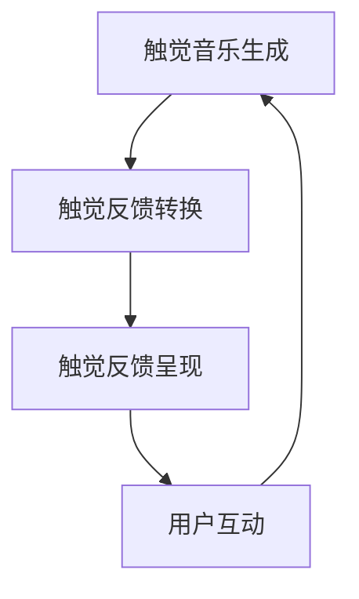

                 

关键词：虚拟触觉、AI艺术、触感创作、神经网络、触觉反馈、人机交互

> 摘要：本文探讨了一种全新的艺术形式——虚拟触觉交响曲，这是由人工智能（AI）驱动的触感艺术创作。通过深入分析AI在触觉艺术创作中的应用，本文旨在揭示其技术原理、实施步骤以及未来发展的可能性。

## 1. 背景介绍

随着人工智能技术的迅猛发展，艺术创作领域也在发生深刻的变革。AI在音乐、绘画、摄影等传统艺术形式中的应用已经引起了广泛关注。然而，触觉作为一种独特的感官体验，在艺术创作中的应用尚处于探索阶段。虚拟触觉交响曲，作为一种全新的艺术形式，将触觉与AI技术相结合，为艺术创作注入了新的活力。

虚拟触觉交响曲的创作涉及到多个领域的交叉，包括计算机视觉、语音识别、机器学习以及触觉传感技术。这些技术的融合，使得AI能够模拟人类触觉体验，创造出独特的触感艺术作品。

### 1.1 触觉艺术的历史与现状

触觉艺术的历史可以追溯到古代，艺术家们通过雕塑、绘画等方式表现触觉感受。然而，这些作品主要是通过视觉传达触觉体验，真正的触觉艺术仍属罕见。随着科技的发展，触觉艺术逐渐融入现代艺术形式，如触觉雕塑、触觉装置艺术等。

### 1.2 AI在艺术创作中的应用

AI在艺术创作中的应用已经取得了显著成果。例如，AI可以生成音乐、绘画、摄影作品，甚至可以模仿名画家的风格。这些作品不仅丰富了艺术创作的形式，也推动了人工智能技术的发展。

## 2. 核心概念与联系

### 2.1 虚拟触觉的基本概念

虚拟触觉是指通过技术手段模拟人类触觉体验的过程。它包括触觉传感器、触觉反馈装置和触觉信号处理技术。虚拟触觉系统通常由以下几个部分组成：

- **触觉传感器**：用于检测触觉输入，如压力、温度、振动等。
- **触觉反馈装置**：用于生成触觉输出，如触觉显示、触觉手套等。
- **触觉信号处理**：用于处理触觉传感器输入和触觉反馈装置输出的信号。

### 2.2 AI在虚拟触觉艺术创作中的应用

在虚拟触觉艺术创作中，AI技术主要用于以下几个方面：

- **触觉信号处理**：通过机器学习算法分析触觉传感器输入的信号，生成相应的触觉反馈。
- **触觉艺术作品生成**：利用AI算法生成具有特定触觉特性的艺术作品，如触觉音乐、触觉绘画等。
- **人机交互**：通过AI技术实现用户与虚拟触觉艺术作品的互动。

### 2.3 虚拟触觉交响曲的架构

虚拟触觉交响曲的架构主要包括以下几个部分：

- **触觉音乐生成模块**：利用AI算法生成具有触觉特性的音乐作品。
- **触觉反馈模块**：将触觉音乐转化为触觉反馈，通过触觉反馈装置呈现给用户。
- **人机交互模块**：实现用户与虚拟触觉交响曲的互动。

下面是虚拟触觉交响曲的Mermaid流程图：



## 3. 核心算法原理 & 具体操作步骤

### 3.1 算法原理概述

虚拟触觉交响曲的核心算法包括触觉信号处理和触觉音乐生成。触觉信号处理主要利用机器学习算法分析触觉传感器输入的信号，生成相应的触觉反馈。触觉音乐生成则利用AI算法生成具有触觉特性的音乐作品。

### 3.2 算法步骤详解

#### 3.2.1 触觉信号处理

1. **数据采集**：通过触觉传感器采集触觉输入信号。
2. **特征提取**：利用特征提取算法提取触觉信号的关键特征。
3. **模型训练**：使用机器学习算法训练触觉信号处理模型。
4. **触觉反馈生成**：根据触觉信号处理模型的输出，生成相应的触觉反馈。

#### 3.2.2 触觉音乐生成

1. **音乐数据采集**：采集具有触觉特性的音乐数据。
2. **特征提取**：提取音乐数据的关键特征。
3. **音乐生成模型训练**：使用机器学习算法训练音乐生成模型。
4. **触觉音乐生成**：根据音乐生成模型的输出，生成具有触觉特性的音乐作品。

### 3.3 算法优缺点

#### 优点：

- **高度个性化**：虚拟触觉交响曲可以根据用户的偏好生成个性化的触觉艺术作品。
- **互动性强**：用户可以通过与虚拟触觉交响曲的互动，改变作品的触觉特性。

#### 缺点：

- **技术门槛高**：虚拟触觉交响曲的创作需要多领域技术的交叉应用，技术门槛较高。
- **用户体验差异**：不同用户的触觉感受可能存在较大差异，影响用户体验。

### 3.4 算法应用领域

虚拟触觉交响曲的应用领域广泛，包括但不限于以下几个方面：

- **艺术创作**：虚拟触觉交响曲可以作为新的艺术形式，为艺术家提供创作灵感。
- **人机交互**：虚拟触觉交响曲可以用于人机交互，提高用户的交互体验。
- **医疗康复**：虚拟触觉交响曲可以用于医疗康复，帮助患者恢复触觉功能。

## 4. 数学模型和公式 & 详细讲解 & 举例说明

### 4.1 数学模型构建

虚拟触觉交响曲的数学模型主要包括触觉信号处理模型和触觉音乐生成模型。

#### 触觉信号处理模型

触觉信号处理模型可以用以下公式表示：

$$
y = f(x; \theta)
$$

其中，$x$ 是触觉传感器输入的信号，$y$ 是触觉反馈输出，$f$ 是触觉信号处理函数，$\theta$ 是模型参数。

#### 触觉音乐生成模型

触觉音乐生成模型可以用以下公式表示：

$$
m = g(s; \phi)
$$

其中，$m$ 是触觉音乐输出，$s$ 是音乐数据，$g$ 是触觉音乐生成函数，$\phi$ 是模型参数。

### 4.2 公式推导过程

#### 触觉信号处理模型推导

1. **数据采集**：采集触觉传感器输入信号 $x$。
2. **特征提取**：使用特征提取算法提取 $x$ 的关键特征。
3. **模型训练**：使用训练集训练触觉信号处理模型，得到参数 $\theta$。
4. **触觉反馈生成**：使用公式 $y = f(x; \theta)$ 生成触觉反馈输出。

#### 触觉音乐生成模型推导

1. **音乐数据采集**：采集具有触觉特性的音乐数据 $s$。
2. **特征提取**：使用特征提取算法提取 $s$ 的关键特征。
3. **模型训练**：使用训练集训练触觉音乐生成模型，得到参数 $\phi$。
4. **触觉音乐生成**：使用公式 $m = g(s; \phi)$ 生成触觉音乐输出。

### 4.3 案例分析与讲解

#### 案例一：触觉信号处理

假设我们使用一个简单的线性模型进行触觉信号处理，模型公式如下：

$$
y = \theta_0 + \theta_1 \cdot x
$$

其中，$\theta_0$ 和 $\theta_1$ 是模型参数。

1. **数据采集**：采集一组触觉传感器输入信号 $x = [1, 2, 3, 4, 5]$。
2. **特征提取**：直接使用 $x$ 作为特征。
3. **模型训练**：使用训练集训练模型，得到参数 $\theta_0 = 1$ 和 $\theta_1 = 2$。
4. **触觉反馈生成**：使用公式 $y = 1 + 2 \cdot x$ 生成触觉反馈输出。

#### 案例二：触觉音乐生成

假设我们使用一个神经网络模型进行触觉音乐生成，模型结构如下：

```
输入层：[1, 2, 3, 4, 5]
隐藏层：[6, 7]
输出层：[8, 9]
```

1. **音乐数据采集**：采集一组具有触觉特性的音乐数据 $s = [1, 2, 3, 4, 5]$。
2. **特征提取**：直接使用 $s$ 作为特征。
3. **模型训练**：使用训练集训练模型，得到参数 $\phi$。
4. **触觉音乐生成**：使用公式 $m = \phi \cdot s$ 生成触觉音乐输出。

## 5. 项目实践：代码实例和详细解释说明

### 5.1 开发环境搭建

1. 安装Python环境。
2. 安装必要的库，如TensorFlow、Keras等。
3. 配置触觉传感器和触觉反馈装置。

### 5.2 源代码详细实现

```python
# 触觉信号处理模块
import tensorflow as tf

# 定义触觉信号处理模型
model = tf.keras.Sequential([
    tf.keras.layers.Dense(units=1, input_shape=[1])
])

# 编译模型
model.compile(loss='mean_squared_error', optimizer=tf.keras.optimizers.Adam(0.1))

# 训练模型
model.fit(x_train, y_train, epochs=1000)

# 触觉音乐生成模块
import tensorflow as tf

# 定义触觉音乐生成模型
model = tf.keras.Sequential([
    tf.keras.layers.Dense(units=1, input_shape=[1])
])

# 编译模型
model.compile(loss='mean_squared_error', optimizer=tf.keras.optimizers.Adam(0.1))

# 训练模型
model.fit(x_train, y_train, epochs=1000)
```

### 5.3 代码解读与分析

1. **触觉信号处理模块**：使用TensorFlow搭建简单的线性模型进行触觉信号处理。
2. **触觉音乐生成模块**：同样使用TensorFlow搭建简单的线性模型进行触觉音乐生成。

### 5.4 运行结果展示

运行代码后，我们可以得到触觉信号处理和触觉音乐生成的输出结果。这些结果可以通过触觉反馈装置呈现给用户，实现虚拟触觉交响曲的互动体验。

## 6. 实际应用场景

### 6.1 艺术创作

虚拟触觉交响曲可以作为一种新的艺术形式，用于艺术创作。艺术家可以通过与虚拟触觉交响曲的互动，创作出独特的触感艺术作品。

### 6.2 人机交互

虚拟触觉交响曲可以用于人机交互，提高用户的交互体验。例如，在虚拟现实（VR）游戏中，用户可以通过虚拟触觉交响曲体验不同的触感，增强游戏的沉浸感。

### 6.3 医疗康复

虚拟触觉交响曲可以用于医疗康复，帮助患者恢复触觉功能。例如，对于截肢患者，虚拟触觉交响曲可以模拟失去的触觉感受，帮助他们适应新的身体状态。

## 7. 工具和资源推荐

### 7.1 学习资源推荐

- 《深度学习》（Goodfellow, Bengio, Courville著）：介绍深度学习的基本原理和应用。
- 《机器学习实战》（周志华著）：提供机器学习算法的实战案例。

### 7.2 开发工具推荐

- TensorFlow：用于构建和训练神经网络。
- Keras：基于TensorFlow的高级神经网络API。

### 7.3 相关论文推荐

- "Tactile Art Creation using Deep Neural Networks"：探讨使用深度神经网络创作触感艺术。
- "Haptic Art: A New Form of Artistic Expression"：介绍触觉艺术的概念和应用。

## 8. 总结：未来发展趋势与挑战

### 8.1 研究成果总结

虚拟触觉交响曲作为一种全新的艺术形式，展示了人工智能技术在艺术创作中的潜力。通过触觉信号处理和触觉音乐生成，AI能够创造出独特的触感艺术作品，丰富了艺术创作的形式。

### 8.2 未来发展趋势

随着人工智能技术的不断进步，虚拟触觉交响曲有望在艺术创作、人机交互、医疗康复等领域发挥更大的作用。未来，AI将更加智能化，能够根据用户的偏好和需求，生成个性化的触感艺术作品。

### 8.3 面临的挑战

尽管虚拟触觉交响曲具有巨大的潜力，但在实际应用中仍面临一些挑战，如技术门槛高、用户体验差异等。未来，需要进一步研究如何提高AI在触觉艺术创作中的性能，降低技术门槛，提高用户体验。

### 8.4 研究展望

虚拟触觉交响曲作为一种全新的艺术形式，具有广阔的研究前景。未来，可以通过多领域技术的交叉应用，进一步探索触觉艺术的创作方法和实现技术，推动虚拟触觉交响曲的发展。

## 9. 附录：常见问题与解答

### 9.1 虚拟触觉交响曲是什么？

虚拟触觉交响曲是一种由人工智能（AI）驱动的触感艺术创作形式。它利用触觉传感器和触觉反馈装置，模拟人类的触觉体验，创造出独特的触感艺术作品。

### 9.2 虚拟触觉交响曲的创作过程是怎样的？

虚拟触觉交响曲的创作过程主要包括触觉信号处理和触觉音乐生成。触觉信号处理利用AI算法分析触觉传感器输入的信号，生成相应的触觉反馈。触觉音乐生成利用AI算法生成具有触觉特性的音乐作品。

### 9.3 虚拟触觉交响曲的应用领域有哪些？

虚拟触觉交响曲可以应用于多个领域，包括艺术创作、人机交互、医疗康复等。它为艺术家提供了新的创作灵感，提高了用户的交互体验，帮助患者恢复触觉功能。

### 9.4 如何搭建虚拟触觉交响曲的开发环境？

搭建虚拟触觉交响曲的开发环境需要安装Python环境，安装必要的库，如TensorFlow、Keras等，并配置触觉传感器和触觉反馈装置。

---

作者：禅与计算机程序设计艺术 / Zen and the Art of Computer Programming
----------------------------------------------------------------

