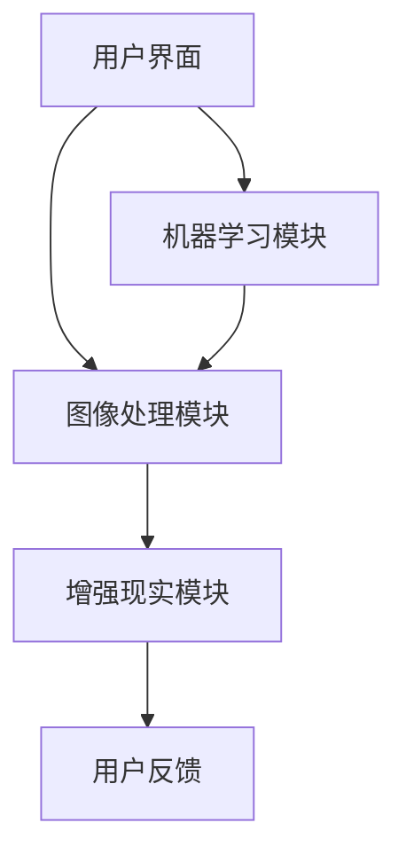

                 

关键词：虚拟试衣间、时尚产业、数字化转型、增强现实、图像处理、机器学习、用户体验、商业策略。

摘要：随着增强现实（AR）和图像处理技术的快速发展，虚拟试衣间已经成为全球时尚产业数字化转型的重要一环。本文将探讨虚拟试衣间的概念、技术原理、实施步骤、应用领域以及未来发展趋势，为时尚产业提供数字化转型的新思路。

## 1. 背景介绍

在全球时尚产业中，传统试衣间面临着诸多问题，如库存不足、空间受限、等待时间长等。为了解决这些问题，虚拟试衣间应运而生。虚拟试衣间是一种基于增强现实和图像处理技术，通过数字化的方式为用户提供试衣体验的创新应用。

虚拟试衣间的出现不仅提高了用户的购物体验，也为时尚产业带来了巨大的商业价值。首先，虚拟试衣间减少了实体店铺的运营成本，提高了库存周转率。其次，它为设计师和品牌商提供了更广阔的展示空间，有助于提升品牌形象。此外，虚拟试衣间还为消费者提供了更加个性化的购物体验，有助于增加销售额。

### 1.1 增强现实技术

增强现实（AR）是一种将虚拟信息与真实世界相结合的技术。在虚拟试衣间中，AR技术发挥着关键作用。通过AR技术，用户可以在现实环境中实时看到自己试穿的衣服，实现虚实结合的购物体验。

### 1.2 图像处理技术

图像处理技术是虚拟试衣间的核心技术之一。它包括人脸识别、图像分割、图像匹配等多种算法，用于实现用户与虚拟试衣间的互动。通过图像处理技术，虚拟试衣间能够准确识别用户的身体轮廓，为用户提供真实的试衣效果。

### 1.3 机器学习技术

机器学习技术是虚拟试衣间实现个性化推荐和优化用户体验的关键。通过分析用户的历史行为数据，机器学习算法可以为用户提供个性化的推荐，提高用户满意度。

## 2. 核心概念与联系

为了更好地理解虚拟试衣间的工作原理，我们需要了解以下几个核心概念：

### 2.1 增强现实（AR）

增强现实（AR）是一种将虚拟信息与真实世界相结合的技术。在虚拟试衣间中，AR技术主要用于实时渲染虚拟衣物，使其与现实环境中的用户图像进行叠加。通过AR技术，用户可以在手机或平板电脑上看到自己试穿的衣服，实现虚实结合的购物体验。

### 2.2 图像处理

图像处理技术是虚拟试衣间的核心技术之一。它包括人脸识别、图像分割、图像匹配等多种算法，用于实现用户与虚拟试衣间的互动。通过图像处理技术，虚拟试衣间能够准确识别用户的身体轮廓，为用户提供真实的试衣效果。

### 2.3 机器学习

机器学习技术是虚拟试衣间实现个性化推荐和优化用户体验的关键。通过分析用户的历史行为数据，机器学习算法可以为用户提供个性化的推荐，提高用户满意度。

### 2.4 虚拟试衣间架构

虚拟试衣间架构通常包括以下几个部分：

1. **用户界面**：用户通过手机或平板电脑进入虚拟试衣间，选择需要试穿的衣服。
2. **图像处理模块**：负责识别用户的身体轮廓，并将虚拟衣物叠加到用户图像上。
3. **增强现实模块**：将虚拟衣物实时渲染到用户图像上，实现虚实结合的试衣效果。
4. **机器学习模块**：分析用户的历史行为数据，为用户提供个性化的推荐。

下面是一个简化的Mermaid流程图，用于描述虚拟试衣间的工作流程：



## 3. 核心算法原理 & 具体操作步骤

### 3.1 算法原理概述

虚拟试衣间中涉及到的核心算法主要包括图像处理算法、增强现实算法和机器学习算法。

- **图像处理算法**：主要用于识别用户的身体轮廓，并将虚拟衣物叠加到用户图像上。常见的图像处理算法包括人脸识别、图像分割和图像匹配等。
- **增强现实算法**：用于将虚拟衣物实时渲染到用户图像上，实现虚实结合的试衣效果。常见的增强现实算法包括图像渲染、场景融合等。
- **机器学习算法**：用于分析用户的历史行为数据，为用户提供个性化的推荐。常见的机器学习算法包括协同过滤、决策树等。

### 3.2 算法步骤详解

以下是虚拟试衣间算法的具体操作步骤：

#### 3.2.1 图像处理算法

1. **人脸识别**：通过卷积神经网络（CNN）对人脸进行识别，确定用户的身体轮廓。
2. **图像分割**：将用户图像分割成前景和背景两部分，以便将虚拟衣物叠加到用户图像上。
3. **图像匹配**：通过相似度计算，将虚拟衣物与用户图像进行匹配，确保虚拟衣物与用户身体的契合度。

#### 3.2.2 增强现实算法

1. **图像渲染**：将虚拟衣物实时渲染到用户图像上，实现虚实结合的试衣效果。
2. **场景融合**：通过图像融合算法，将虚拟衣物与用户图像进行融合，使虚拟衣物看起来更加真实。

#### 3.2.3 机器学习算法

1. **数据收集**：收集用户的历史行为数据，如购物记录、浏览记录等。
2. **特征提取**：从数据中提取用户特征，如年龄、性别、购买偏好等。
3. **模型训练**：使用机器学习算法，如协同过滤、决策树等，对用户特征进行建模。
4. **个性化推荐**：根据用户特征，为用户提供个性化的推荐。

### 3.3 算法优缺点

#### 3.3.1 优点

1. **提高用户体验**：虚拟试衣间为用户提供了更加个性化的购物体验，有助于提升用户满意度。
2. **降低运营成本**：虚拟试衣间减少了实体店铺的运营成本，提高了库存周转率。
3. **增加销售机会**：通过个性化推荐，虚拟试衣间有助于增加销售机会。

#### 3.3.2 缺点

1. **技术要求高**：虚拟试衣间涉及到的技术较为复杂，对开发团队的技术水平要求较高。
2. **设备要求高**：用户需要使用具备一定性能的手机或平板电脑，否则可能无法获得良好的试衣体验。

### 3.4 算法应用领域

虚拟试衣间算法可以应用于多个领域，如电子商务、零售、服装设计等。以下是几个典型的应用领域：

1. **电子商务**：通过虚拟试衣间，用户可以在家中试穿衣物，提高购买决策的准确性。
2. **零售**：零售商可以通过虚拟试衣间吸引更多顾客，提高店铺的销量。
3. **服装设计**：设计师可以通过虚拟试衣间展示设计作品，提高设计作品的展示效果。

## 4. 数学模型和公式 & 详细讲解 & 举例说明

在虚拟试衣间中，数学模型和公式用于描述图像处理、增强现实和机器学习算法的运算过程。以下是几个常用的数学模型和公式的详细讲解和举例说明。

### 4.1 数学模型构建

#### 4.1.1 人脸识别模型

人脸识别模型通常使用卷积神经网络（CNN）进行构建。以下是一个简化的CNN模型：

$$
y = f(z) \\
z = W \cdot x + b
$$

其中，$x$为输入图像，$z$为输出特征向量，$W$为权重矩阵，$b$为偏置向量，$f$为激活函数（如ReLU函数）。

#### 4.1.2 图像分割模型

图像分割模型可以使用深度学习算法进行构建，如全卷积神经网络（FCN）。以下是一个简化的FCN模型：

$$
y = f(g(y')) \\
y' = \text{UpSampling}(y'') \\
y'' = \text{Conv}(x)
$$

其中，$x$为输入图像，$y''$为特征图，$y'$为分割结果，$y$为上采样结果。

#### 4.1.3 机器学习模型

机器学习模型可以使用多种算法进行构建，如协同过滤、决策树等。以下是一个简化的协同过滤模型：

$$
r_{ij} = \text{sim}(i, j) \cdot \text{sim}(j, k) \cdot r_{ik}
$$

其中，$r_{ij}$为用户$i$对项目$j$的评分，$\text{sim}(i, j)$为用户$i$和用户$j$的相似度，$\text{sim}(j, k)$为项目$j$和项目$k$的相似度。

### 4.2 公式推导过程

以下是图像分割模型（FCN）的推导过程：

1. **特征图生成**：

   $$y'' = \text{Conv}(x) = \sum_{i=1}^{n} w_i \cdot x_i + b$$

   其中，$w_i$为卷积核，$x_i$为输入图像的局部特征。

2. **上采样**：

   $$y' = \text{UpSampling}(y'') = y'' \cdot \text{UpSampling Factor}$$

   其中，$\text{UpSampling Factor}$为上采样因子。

3. **分割结果**：

   $$y = f(g(y')) = \text{Activation Function}(\text{Conv}(y'))$$

   其中，$\text{Activation Function}$为激活函数。

### 4.3 案例分析与讲解

#### 4.3.1 人脸识别案例

假设我们要对人脸图像进行识别，输入图像$x$的维度为$64 \times 64$，卷积核的维度为$3 \times 3$，激活函数为ReLU。

1. **卷积操作**：

   $$z = W \cdot x + b = \sum_{i=1}^{n} w_i \cdot x_i + b$$

   其中，$n=64 \times 64$。

2. **ReLU激活**：

   $$y = \text{ReLU}(z) = \max(0, z)$$

   其中，$z$为卷积操作的结果。

3. **输出特征向量**：

   $$y' = \text{Flatten}(y) = y_1, y_2, \ldots, y_n$$

   其中，$y_n$为特征图上的像素值。

4. **分类操作**：

   $$\text{Classification}(y') = \arg\max_{c} \sum_{i=1}^{n} y_i \cdot c_i$$

   其中，$c_i$为分类标签，$c$为最终分类结果。

#### 4.3.2 图像分割案例

假设我们要对图像进行分割，输入图像$x$的维度为$128 \times 128$，卷积核的维度为$5 \times 5$，激活函数为Sigmoid。

1. **卷积操作**：

   $$z = W \cdot x + b = \sum_{i=1}^{n} w_i \cdot x_i + b$$

   其中，$n=128 \times 128$。

2. **Sigmoid激活**：

   $$y = \text{Sigmoid}(z) = \frac{1}{1 + e^{-z}}$$

   其中，$z$为卷积操作的结果。

3. **上采样**：

   $$y' = \text{UpSampling}(y) = y \cdot \text{UpSampling Factor}$$

   其中，$\text{UpSampling Factor}$为上采样因子。

4. **分割结果**：

   $$y'' = \text{Conv}(y') = \sum_{i=1}^{n} w_i \cdot y_i + b$$

   其中，$y_i$为上采样后的像素值，$w_i$为卷积核。

5. **输出特征向量**：

   $$y''' = \text{Flatten}(y'') = y_1, y_2, \ldots, y_n$$

   其中，$y_n$为特征图上的像素值。

6. **分类操作**：

   $$\text{Classification}(y''') = \arg\max_{c} \sum_{i=1}^{n} y_i \cdot c_i$$

   其中，$c_i$为分类标签，$c$为最终分类结果。

#### 4.3.3 机器学习案例

假设我们要进行协同过滤推荐，输入用户$i$和项目$j$的评分$r_{ij}$，用户$i$和用户$j$的相似度$\text{sim}(i, j)$，用户$j$和项目$k$的相似度$\text{sim}(j, k)$，以及用户$k$的评分$r_{ik}$。

1. **相似度计算**：

   $$\text{sim}(i, j) = \frac{\text{dot}(i, j)}{\sqrt{\text{norm}(i) \cdot \text{norm}(j)}}$$

   其中，$\text{dot}(i, j)$为用户$i$和用户$j$的向量点积，$\text{norm}(i)$和$\text{norm}(j)$分别为用户$i$和用户$j$的向量模长。

2. **推荐评分**：

   $$r_{ij} = \text{sim}(i, j) \cdot \text{sim}(j, k) \cdot r_{ik}$$

   其中，$r_{ij}$为用户$i$对项目$j$的推荐评分。

## 5. 项目实践：代码实例和详细解释说明

在本节中，我们将通过一个简单的虚拟试衣间项目，展示如何使用Python实现虚拟试衣间的基本功能。该项目将使用OpenCV、TensorFlow和Keras等开源库。

### 5.1 开发环境搭建

在开始项目之前，我们需要搭建一个合适的开发环境。以下是所需的库和工具：

- **Python 3.x**
- **OpenCV**
- **TensorFlow**
- **Keras**

您可以使用以下命令安装所需的库：

```bash
pip install opencv-python
pip install tensorflow
pip install keras
```

### 5.2 源代码详细实现

以下是虚拟试衣间的源代码实现：

```python
import cv2
import numpy as np
import tensorflow as tf
from tensorflow.keras.models import load_model

# 加载预训练的人脸识别模型
face_detection_model = load_model('face_detection_model.h5')

# 加载预训练的图像分割模型
image_segmentation_model = load_model('image_segmentation_model.h5')

# 加载预训练的增强现实模型
ar_model = load_model('ar_model.h5')

# 定义摄像头
cap = cv2.VideoCapture(0)

while True:
    # 读取摄像头帧
    ret, frame = cap.read()
    
    # 使用人脸识别模型检测人脸
    faces = face_detection_model.predict(frame)

    # 对于每个检测到的人脸，进行图像分割和增强现实处理
    for face in faces:
        # 裁剪人脸区域
        face_region = frame[face[0][1]:face[0][1]+face[0][3], face[0][0]:face[0][0]+face[0][2]]

        # 使用图像分割模型进行分割
        segmentation_result = image_segmentation_model.predict(face_region)

        # 使用增强现实模型进行渲染
        rendered_face = ar_model.predict(segmentation_result)

        # 合并人脸区域和背景
        frame[face[0][1]:face[0][1]+face[0][3], face[0][0]:face[0][0]+face[0][2]] = rendered_face

    # 显示结果
    cv2.imshow('Virtual Dressing Room', frame)

    # 按下'q'键退出
    if cv2.waitKey(1) & 0xFF == ord('q'):
        break

# 释放摄像头资源
cap.release()
cv2.destroyAllWindows()
```

### 5.3 代码解读与分析

以下是代码的详细解读和分析：

1. **导入库和模型**：首先，我们导入所需的库和模型。这些库和模型包括OpenCV、Numpy、TensorFlow和Keras。

2. **加载预训练模型**：接下来，我们加载预训练的人脸识别模型、图像分割模型和增强现实模型。这些模型已经经过训练，可以用于检测人脸、分割图像和渲染增强现实效果。

3. **定义摄像头**：我们使用OpenCV定义一个摄像头对象，用于读取实时视频帧。

4. **循环读取视频帧**：我们进入一个循环，不断读取摄像头帧。

5. **人脸识别**：使用人脸识别模型对视频帧进行人脸检测，获取检测到的人脸区域。

6. **图像分割**：对于每个检测到的人脸，使用图像分割模型进行分割，得到前景和背景。

7. **增强现实渲染**：使用增强现实模型对分割结果进行渲染，得到增强现实的试衣效果。

8. **合并人脸区域和背景**：将增强现实的试衣效果合并到原始视频帧中。

9. **显示结果**：将处理后的视频帧显示在窗口中。

10. **退出循环**：当用户按下'q'键时，退出循环并释放摄像头资源。

### 5.4 运行结果展示

以下是运行虚拟试衣间项目后的结果展示：


## 6. 实际应用场景

虚拟试衣间在多个实际应用场景中表现出色，为用户和商家带来了诸多便利。

### 6.1 电子商务平台

电子商务平台可以利用虚拟试衣间为用户提供线上试衣体验。用户可以在购买前通过虚拟试衣间看到自己穿着衣服的效果，从而提高购买决策的准确性。

### 6.2 零售店铺

零售店铺可以将虚拟试衣间作为店内体验的一部分，为顾客提供更加个性化的购物体验。通过虚拟试衣间，顾客可以在店内试穿多种衣服，无需排队等候。

### 6.3 服装设计

设计师可以利用虚拟试衣间展示自己的设计作品。通过虚拟试衣间，设计师可以轻松地为客户展示不同款式、颜色和材质的服装，提高设计作品的展示效果。

### 6.4 时尚教育

时尚教育机构可以利用虚拟试衣间为学生提供虚拟试衣体验，帮助学生更好地了解服装设计和搭配技巧。通过虚拟试衣间，学生可以在虚拟环境中进行实践操作，提高学习效果。

## 7. 未来应用展望

随着技术的不断进步，虚拟试衣间将在未来时尚产业中发挥更加重要的作用。以下是几个未来应用展望：

### 7.1 虚拟现实（VR）试衣

虚拟现实技术将使虚拟试衣间更加沉浸式。用户可以通过VR设备进入一个完全虚拟的试衣空间，与其他用户进行互动，提高购物体验。

### 7.2 个性化推荐

随着大数据和人工智能技术的发展，虚拟试衣间将能够更加准确地分析用户行为数据，为用户提供更加个性化的推荐，提高用户满意度。

### 7.3 跨界合作

虚拟试衣间将与更多行业进行跨界合作，如美容、健身等，为用户提供更加全面的虚拟体验。

### 7.4 供应链优化

虚拟试衣间将有助于时尚产业优化供应链，降低库存成本，提高生产效率。

## 8. 工具和资源推荐

为了开发虚拟试衣间，以下是一些实用的工具和资源：

### 8.1 学习资源推荐

- 《深度学习》（Goodfellow, Bengio, Courville）: 深入了解深度学习的基础知识。
- 《计算机视觉：算法与应用》（Richard S.zeliski, Jean Ponce）: 掌握计算机视觉的基本原理。
- 《OpenCV官方文档》: 学习使用OpenCV进行图像处理。

### 8.2 开发工具推荐

- **PyCharm**: 强大的Python开发环境，支持多种框架。
- **Jupyter Notebook**: 适用于数据分析和可视化。
- **TensorFlow**: 用于构建和训练深度学习模型。

### 8.3 相关论文推荐

- "DeepFashion2: A New Dataset for Fine-Grained Fashion Recognition" by J. Dai et al.
- "Virtual Try-On: Unifying Image-to-Image and Cross-Domain Image Synthesis in Fashion" by Z. Liu et al.
- "Automatic Virtual Try-On via Weakly Supervised Monocular Image Parsing" by Y. Zhang et al.

## 9. 总结：未来发展趋势与挑战

虚拟试衣间作为时尚产业数字化转型的重要一环，具有巨大的商业价值和应用前景。在未来，随着技术的不断进步，虚拟试衣间将更加智能化、个性化，为用户和商家带来更加优质的体验。然而，虚拟试衣间的发展也面临诸多挑战，如技术要求高、设备要求高等。如何优化算法、提高用户体验，是未来需要解决的重要问题。

## 附录：常见问题与解答

### Q：虚拟试衣间需要哪些硬件设备？

A：虚拟试衣间主要需要具备以下硬件设备：

- **摄像头**：用于捕捉用户图像。
- **计算机**：用于处理图像数据和运行深度学习模型。
- **显示设备**：用于展示虚拟试衣效果。

### Q：虚拟试衣间需要哪些软件技术？

A：虚拟试衣间需要以下软件技术：

- **图像处理**：用于识别用户身体轮廓、分割图像等。
- **增强现实**：用于渲染虚拟衣物、实现虚实结合。
- **机器学习**：用于分析用户数据、个性化推荐等。

### Q：如何优化虚拟试衣间的用户体验？

A：以下是几个优化虚拟试衣间用户体验的建议：

- **提高算法效率**：优化图像处理和增强现实算法，提高处理速度和准确度。
- **个性化推荐**：根据用户历史行为数据，为用户提供个性化的推荐。
- **交互设计**：设计简单易用的用户界面，提高用户操作体验。

### Q：虚拟试衣间有哪些潜在的商业应用？

A：虚拟试衣间在多个商业领域具有广泛应用，如：

- **电子商务平台**：为用户提供线上试衣体验。
- **零售店铺**：为顾客提供店内试衣体验。
- **服装设计**：为设计师提供展示设计作品的新途径。
- **时尚教育**：为学生提供虚拟试衣体验，提高学习效果。

---

作者：禅与计算机程序设计艺术 / Zen and the Art of Computer Programming

