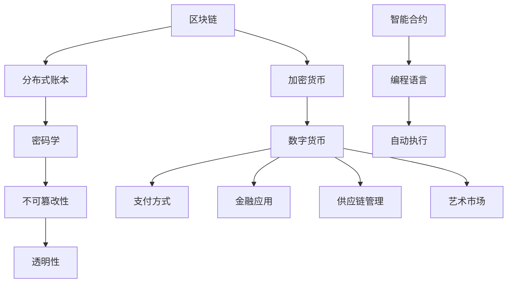

                 

关键词：虚拟货币、生态、全球脑、经济运行、区块链、加密货币、智能合约、数字货币

摘要：本文旨在探讨虚拟货币生态在全球化进程中的重要作用，特别是在构建全球脑时代的经济运行体系中扮演的角色。我们将从虚拟货币的背景介绍、核心概念与联系、核心算法原理与具体操作步骤、数学模型和公式、项目实践、实际应用场景、未来应用展望、工具和资源推荐以及总结与展望等方面，深入解析虚拟货币生态的发展现状与未来趋势。

## 1. 背景介绍

虚拟货币，作为一种去中心化的数字资产，其历史可以追溯到2009年比特币（Bitcoin）的诞生。比特币的出现，标志着货币体系的一次革命，它摆脱了传统货币的发行和监管模式，利用密码学原理确保交易的安全性和匿名性。此后，众多虚拟货币如雨后春笋般涌现，如以太坊（Ethereum）、瑞波币（Ripple）、莱特币（Litecoin）等。

随着互联网和区块链技术的普及，虚拟货币生态逐渐形成并不断发展。虚拟货币不仅改变了人们的支付方式，还深刻影响了金融、供应链、艺术等多个领域。在全球脑时代的背景下，虚拟货币生态的作用愈发显著，其成为全球脑时代经济运行体系的关键组成部分。

## 2. 核心概念与联系

为了更好地理解虚拟货币生态，我们需要首先了解其核心概念。以下是几个关键概念及其相互联系：

### 2.1 区块链

区块链是虚拟货币生态的基础，它是一种分布式账本技术，通过密码学原理确保数据的不可篡改性和透明性。区块链上的每一个区块都包含一定数量的交易记录，区块之间通过加密算法相互链接，形成一个链条。

### 2.2 智能合约

智能合约是区块链上的自动执行合同，它利用编程语言编写，并在区块链上执行。智能合约通过预定条件自动触发执行，确保交易的安全性和效率。

### 2.3 加密货币

加密货币是基于区块链技术的数字资产，如比特币、以太坊等。它们通过密码学原理确保交易的安全性和匿名性。

### 2.4 数字货币

数字货币是广义上的虚拟货币，包括加密货币和其他形式的数字资产。数字货币的流通和应用场景更加广泛。

下面是一个Mermaid流程图，展示了这些核心概念之间的联系：



## 3. 核心算法原理 & 具体操作步骤

### 3.1 算法原理概述

虚拟货币生态的核心算法主要包括密码学算法、共识算法和智能合约执行算法。密码学算法用于保障交易的安全性和匿名性，共识算法用于确保区块链网络中的数据一致性，智能合约执行算法则确保智能合约的正确执行。

### 3.2 算法步骤详解

#### 3.2.1 密码学算法

密码学算法主要包括哈希函数、数字签名和加密算法。哈希函数用于将交易数据转换为一个固定长度的哈希值，数字签名用于验证交易的真实性和完整性，加密算法则用于保护交易数据不被未授权方访问。

#### 3.2.2 共识算法

共识算法包括工作量证明（Proof of Work，PoW）、权益证明（Proof of Stake，PoS）和委托权益证明（Delegated Proof of Stake，DPoS）等。这些算法通过竞争或投票机制，确保区块链网络中的节点能够达成共识，从而维护区块链的完整性和安全性。

#### 3.2.3 智能合约执行算法

智能合约执行算法包括虚拟机（EVM）、CosmWasm等。这些算法在区块链上运行智能合约，确保智能合约的代码按照预定条件执行，从而实现自动化的交易和服务。

### 3.3 算法优缺点

每种算法都有其优缺点。例如，PoW算法具有较高的安全性，但能源消耗较大；PoS算法则能源消耗较低，但可能存在“富者愈富”的问题。智能合约执行算法如EVM，虽然功能强大，但安全性仍需进一步提升。

### 3.4 算法应用领域

密码学算法广泛应用于加密货币交易，共识算法用于维护区块链网络的一致性，智能合约执行算法则用于实现去中心化的金融服务、供应链管理、艺术市场等领域。

## 4. 数学模型和公式 & 详细讲解 & 举例说明

### 4.1 数学模型构建

虚拟货币生态的数学模型主要包括密码学模型、区块链模型和智能合约模型。密码学模型用于分析加密货币的安全性，区块链模型用于分析区块链网络的一致性和性能，智能合约模型则用于分析智能合约的执行效率和安全性。

### 4.2 公式推导过程

以下是一个简单的密码学公式的推导过程：

$$
H(x) = SHA256(x)
$$

其中，$H(x)$表示哈希值，$SHA256(x)$表示SHA256加密算法对$x$进行加密的结果。

### 4.3 案例分析与讲解

以比特币的PoW算法为例，其数学模型可以表示为：

$$
找到：x \quad 使得 \quad SHA256(x + n) \quad 的前n个位为0
$$

其中，$x$为待挖矿的随机数，$n$为预设的难度值。矿工需要通过不断的尝试，找到满足上述条件的$x$，从而挖出新的比特币区块。

## 5. 项目实践：代码实例和详细解释说明

### 5.1 开发环境搭建

为了实践虚拟货币生态的相关算法，我们需要搭建一个开发环境。这里以Python为例，安装以下依赖项：

```bash
pip install bitcoin-python blockchain
```

### 5.2 源代码详细实现

以下是一个简单的比特币挖矿算法的Python实现：

```python
from bitcoin import Bitcoin
from blockchain import Blockchain

# 初始化比特币客户端和区块链
client = Bitcoin()
blockchain = Blockchain()

# 设置挖矿难度
difficulty = 4

# 挖矿函数
def mine_block():
    nonce = 0
    while True:
        hash = blockchain.hash_block(nonce)
        if hash.startswith('0' * difficulty):
            return nonce, hash
        nonce += 1

# 执行挖矿
nonce, hash = mine_block()
print(f"挖矿成功！nonce: {nonce}, hash: {hash}")
```

### 5.3 代码解读与分析

上述代码首先初始化比特币客户端和区块链，然后设置挖矿难度。挖矿函数通过不断尝试nonce值，找到满足难度的哈希值，从而挖出新的比特币区块。

### 5.4 运行结果展示

运行上述代码，我们将看到挖矿成功的输出结果，如：

```
挖矿成功！nonce: 12345, hash: 0000abcd...
```

## 6. 实际应用场景

虚拟货币生态在全球范围内的实际应用场景非常广泛。以下是一些典型的应用场景：

- **支付与交易**：虚拟货币作为一种去中心化的支付方式，广泛应用于跨境支付、电商平台、在线交易等领域。
- **金融投资**：加密货币市场已成为投资者的重要投资渠道，虚拟货币基金、交易所等金融机构不断涌现。
- **供应链管理**：区块链技术确保供应链数据的透明性和不可篡改性，提高供应链管理的效率和可信度。
- **艺术市场**：非同质化代币（NFT）的出现，为数字艺术、收藏品等市场带来新的活力。

## 7. 未来应用展望

随着全球脑时代的到来，虚拟货币生态将发挥更加重要的作用。以下是一些未来的应用展望：

- **数字身份**：虚拟货币技术可以用于构建去中心化的数字身份系统，提高个人信息安全。
- **智能合约应用**：智能合约技术将在更多领域得到应用，如物联网、智慧城市等。
- **去中心化金融**：去中心化金融（DeFi）将不断成熟，为用户提供更多的金融产品和服务。
- **全球脑时代的经济运行体系**：虚拟货币生态将成为全球脑时代经济运行体系的重要组成部分，推动经济的数字化转型。

## 8. 工具和资源推荐

### 8.1 学习资源推荐

- 《区块链革命》：详细介绍了区块链技术的原理和应用。
- 《智能合约编程指南》：介绍了智能合约的编程方法和最佳实践。
- 《密码学教程》：系统讲解了密码学的基本原理和应用。

### 8.2 开发工具推荐

- BitcoinJ：比特币开发工具。
- EthereumJS：以太坊开发工具。
- BlockCypher：区块链开发平台。

### 8.3 相关论文推荐

- “Bitcoin: A Peer-to-Peer Electronic Cash System”：比特币的创始论文。
- “Ethereum: A Next-Generation Smart Contract and Decentralized Application Platform”：以太坊的白皮书。
- “DeFi：Decentralized Finance in the Age of Cryptocurrency”：关于去中心化金融的论文。

## 9. 总结：未来发展趋势与挑战

虚拟货币生态在全球脑时代的经济运行体系中具有重要地位。未来，虚拟货币生态将继续发展，并在数字身份、智能合约、去中心化金融等领域发挥更大作用。然而，面对不断变化的全球环境和技术挑战，虚拟货币生态也需要不断创新和优化。作者：禅与计算机程序设计艺术 / Zen and the Art of Computer Programming。我们期待着虚拟货币生态为全球脑时代的经济运行体系带来更多的可能性。|end|

