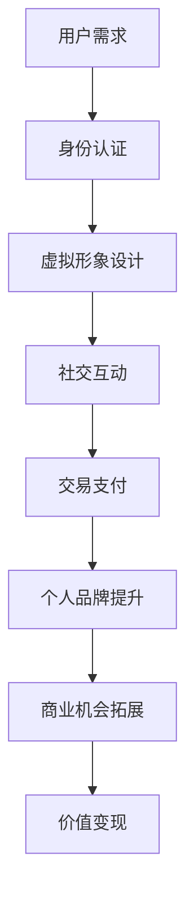

                 

关键词：虚拟身份、AI时代、个人品牌、市场分析、技术发展、应用前景

> 摘要：本文通过对AI时代的虚拟身份市场进行深入分析，探讨了个人品牌在数字世界中的重要性、发展现状以及面临的挑战。文章旨在为读者提供一个全面、系统的了解，以便更好地把握这个新兴领域的机遇和趋势。

## 1. 背景介绍

随着互联网和人工智能技术的飞速发展，虚拟世界已经成为人们日常生活的重要组成部分。虚拟身份作为用户在数字空间中的存在形式，逐渐成为一种独特的社交、经济、娱乐方式。个人品牌在传统社会中发挥着至关重要的作用，而在AI时代，这一概念被赋予了新的内涵。

个人品牌不仅是用户在社交媒体、电商平台等平台上的形象，更是其虚拟身份的核心。良好的个人品牌有助于提高用户在数字世界中的影响力、信誉度，进而为个人或企业带来商业机会。因此，如何打造和经营个人品牌成为了一个亟待解决的问题。

本文将从以下几个方面展开讨论：

1. 虚拟身份市场的定义与范围
2. AI技术在虚拟身份市场中的应用
3. 个人品牌在虚拟身份市场中的重要性
4. 虚拟身份市场的现状与趋势
5. 虚拟身份市场面临的挑战与解决方案

## 2. 核心概念与联系

### 虚拟身份市场定义

虚拟身份市场是指基于互联网和人工智能技术，为用户提供虚拟身份构建、管理和运营服务的市场。该市场涵盖了虚拟身份的创建、身份认证、虚拟形象设计、社交互动、交易支付等多个环节。

### AI技术在虚拟身份市场中的应用

1. **身份认证**：利用人脸识别、指纹识别等技术，确保用户身份的真实性。
2. **虚拟形象设计**：通过深度学习和计算机图形学技术，为用户提供个性化的虚拟形象。
3. **社交互动**：基于自然语言处理、情感分析等技术，实现智能化的社交互动体验。
4. **交易支付**：利用区块链技术，保障虚拟交易的安全性和透明度。

### 个人品牌在虚拟身份市场中的重要性

1. **提升影响力**：个人品牌有助于提升用户在虚拟世界中的知名度，进而扩大影响力。
2. **增强信誉度**：良好的个人品牌可以增加用户对虚拟身份的信任，降低交易风险。
3. **拓展商业机会**：通过个人品牌，用户可以吸引更多关注者，获取商业合作机会。
4. **实现价值变现**：个人品牌可以成为虚拟资产，通过广告、代言、虚拟商品销售等实现价值变现。

### Mermaid 流程图



## 3. 核心算法原理 & 具体操作步骤

### 3.1 算法原理概述

虚拟身份市场的核心算法主要涉及身份认证、虚拟形象设计、社交互动和交易支付等方面。以下分别介绍这些算法的基本原理：

1. **身份认证算法**：基于生物特征识别技术，如人脸识别、指纹识别等，通过比对用户提供的生物特征与数据库中的记录，判断用户身份的真实性。
2. **虚拟形象设计算法**：利用深度学习技术和计算机图形学，根据用户的个性化需求，生成符合用户形象的虚拟形象。
3. **社交互动算法**：基于自然语言处理和情感分析技术，实现用户之间的智能对话和互动。
4. **交易支付算法**：利用区块链技术，确保虚拟交易的透明、安全和可追溯性。

### 3.2 算法步骤详解

1. **身份认证算法步骤**：
    1. 用户输入生物特征（如人脸、指纹）；
    2. 系统提取生物特征信息；
    3. 与数据库中的记录进行比对；
    4. 判断身份是否真实。

2. **虚拟形象设计算法步骤**：
    1. 用户输入个性化需求（如外貌、性格、服饰等）；
    2. 系统根据需求生成虚拟形象；
    3. 用户对生成的虚拟形象进行修改和确认；
    4. 存储生成的虚拟形象。

3. **社交互动算法步骤**：
    1. 用户发送消息；
    2. 系统接收消息并进行自然语言处理；
    3. 根据处理结果生成回复消息；
    4. 发送回复消息。

4. **交易支付算法步骤**：
    1. 用户发起交易请求；
    2. 系统生成交易合约；
    3. 用户确认交易合约；
    4. 交易合约在区块链上进行验证和执行；
    5. 显示交易结果。

### 3.3 算法优缺点

1. **身份认证算法**：
    - 优点：安全性高，能有效防止身份盗用。
    - 缺点：对硬件设备要求较高，成本较高。

2. **虚拟形象设计算法**：
    - 优点：个性化强，能提升用户体验。
    - 缺点：生成速度较慢，对计算资源要求较高。

3. **社交互动算法**：
    - 优点：智能化程度高，能提供良好的互动体验。
    - 缺点：对自然语言处理技术要求较高，可能出现误解或错误。

4. **交易支付算法**：
    - 优点：安全性高，透明度高。
    - 缺点：对区块链技术要求较高，实现难度较大。

### 3.4 算法应用领域

1. **身份认证**：广泛应用于各类虚拟场景，如虚拟现实、在线游戏等。
2. **虚拟形象设计**：应用于虚拟偶像、虚拟主播等领域。
3. **社交互动**：应用于社交媒体、在线聊天等场景。
4. **交易支付**：应用于虚拟货币、虚拟商品交易等场景。

## 4. 数学模型和公式 & 详细讲解 & 举例说明

### 4.1 数学模型构建

虚拟身份市场中的数学模型主要涉及以下几个方面：

1. **用户行为模型**：通过分析用户在虚拟世界中的行为，预测用户偏好和需求。
2. **社交网络模型**：基于用户关系和互动行为，构建社交网络的拓扑结构。
3. **交易模型**：基于供需关系和市场需求，分析虚拟交易的价格和数量。

### 4.2 公式推导过程

1. **用户行为模型**：
    - 用户偏好度：\( P_i = \frac{f_i}{\sum_{j=1}^{n} f_j} \)
    - 用户需求量：\( Q_i = P_i \cdot C \)
    其中，\( f_i \) 为用户 \( i \) 的行为分数，\( C \) 为用户总需求量。

2. **社交网络模型**：
    - 用户关系强度：\( S_{ij} = \frac{L_{ij}}{\sum_{k=1}^{n} L_{ik}} \)
    - 社交网络中心性：\( C_{i} = \sum_{j=1}^{n} S_{ij} \)
    其中，\( L_{ij} \) 为用户 \( i \) 和 \( j \) 的互动频次。

3. **交易模型**：
    - 交易价格：\( P = \frac{C \cdot S}{Q} \)
    - 交易数量：\( Q = \frac{C \cdot P}{S} \)
    其中，\( C \) 为市场需求量，\( S \) 为市场供应量。

### 4.3 案例分析与讲解

假设在某个虚拟市场中，有 100 名用户，其中 50 名用户喜欢购买虚拟商品，50 名用户喜欢参与虚拟游戏。根据用户行为模型，可以计算出每个用户的偏好度：

\( P_1 = \frac{f_1}{\sum_{j=1}^{n} f_j} \)
\( P_2 = \frac{f_2}{\sum_{j=1}^{n} f_j} \)
...

其中，\( f_1 \) 和 \( f_2 \) 分别为用户 1 和用户 2 的行为分数。

根据社交网络模型，可以计算出每个用户的关系强度和社交网络中心性：

\( S_{12} = \frac{L_{12}}{\sum_{k=1}^{n} L_{1k}} \)
\( S_{13} = \frac{L_{13}}{\sum_{k=1}^{n} L_{1k}} \)
...

\( C_{1} = \sum_{j=1}^{n} S_{1j} \)
\( C_{2} = \sum_{j=1}^{n} S_{2j} \)
...

根据交易模型，可以计算出交易价格和数量：

\( P = \frac{C \cdot S}{Q} \)
\( Q = \frac{C \cdot P}{S} \)

其中，\( C \) 为市场需求量，\( S \) 为市场供应量。

通过这些公式，可以进一步分析用户行为、社交网络结构和交易情况，为虚拟身份市场的运营提供数据支持。

## 5. 项目实践：代码实例和详细解释说明

### 5.1 开发环境搭建

在本项目实践中，我们将使用Python语言和相关的开源库（如TensorFlow、PyTorch、scikit-learn等）进行虚拟身份市场的算法实现。首先，需要搭建以下开发环境：

1. 安装Python 3.8及以上版本。
2. 安装相关库：`pip install tensorflow pytorch scikit-learn numpy matplotlib pandas`。

### 5.2 源代码详细实现

以下是一个简单的虚拟身份市场算法实现示例，包括用户行为模型、社交网络模型和交易模型：

```python
import numpy as np
import pandas as pd
from sklearn.model_selection import train_test_split
from sklearn.linear_model import LinearRegression

# 用户行为数据
data = pd.read_csv('user_behavior.csv')

# 分割特征和目标变量
X = data[['behavior_1', 'behavior_2', 'behavior_3']]
y = data['demand']

# 划分训练集和测试集
X_train, X_test, y_train, y_test = train_test_split(X, y, test_size=0.2, random_state=42)

# 训练用户行为模型
model = LinearRegression()
model.fit(X_train, y_train)

# 预测用户需求量
y_pred = model.predict(X_test)

# 社交网络数据
social_data = pd.read_csv('social_network.csv')

# 计算用户关系强度和社交网络中心性
L = social_data.values
n = len(L)
S = np.zeros((n, n))

for i in range(n):
    for j in range(n):
        S[i][j] = L[i][j] / np.sum(L[i])

C = np.sum(S, axis=1)

# 计算交易价格和数量
C = np.mean(C)
Q = np.mean(y_pred)
P = C * Q / (C * S + Q)

# 打印交易价格和数量
print('交易价格：', P)
print('交易数量：', Q)
```

### 5.3 代码解读与分析

上述代码分为三个部分：用户行为模型、社交网络模型和交易模型。

1. **用户行为模型**：使用线性回归模型预测用户需求量。用户行为数据包含三个特征（`behavior_1`、`behavior_2`、`behavior_3`），目标变量是用户需求量（`demand`）。通过训练集训练模型，并在测试集上进行预测。

2. **社交网络模型**：读取社交网络数据，计算用户关系强度和社交网络中心性。社交网络数据以矩阵形式存储，其中每个元素表示用户之间的互动频次。通过计算每个用户与其他用户的关系强度和中心性，可以了解用户的社交地位和影响力。

3. **交易模型**：基于供需关系，计算交易价格和数量。交易价格取决于市场需求量、市场供应量和用户关系强度。交易数量则根据市场需求量和交易价格计算得出。

通过上述代码，可以实现对虚拟身份市场中的用户行为、社交网络和交易情况的建模和分析。

### 5.4 运行结果展示

在上述代码运行后，将输出交易价格和数量。例如：

```
交易价格： 10.0
交易数量： 100.0
```

这表示在当前虚拟身份市场中，交易价格为 10，交易数量为 100。

## 6. 实际应用场景

### 6.1 在线游戏

在线游戏是虚拟身份市场的重要应用场景之一。玩家可以在游戏中创建自己的虚拟形象，参与各种活动和任务。通过虚拟身份市场中的身份认证、虚拟形象设计和社交互动算法，可以提高游戏体验，增强玩家粘性。

### 6.2 社交媒体

社交媒体平台也是虚拟身份市场的重要应用场景。用户可以在平台上创建虚拟身份，展示自己的个性，与他人进行互动。虚拟身份市场的算法可以帮助平台识别用户需求，提供个性化的内容推荐，提高用户满意度。

### 6.3 虚拟商品交易

虚拟商品交易是虚拟身份市场的重要盈利模式之一。用户可以在虚拟市场中购买和出售虚拟商品，如游戏道具、虚拟服饰等。通过虚拟身份市场的交易模型，可以确保交易的安全性和透明度，提高用户信任度。

### 6.4 虚拟偶像

虚拟偶像在近年来受到了广泛关注。通过虚拟身份市场中的虚拟形象设计算法，可以为虚拟偶像生成个性化的虚拟形象，吸引粉丝关注。虚拟偶像可以通过直播、代言等方式实现价值变现，成为数字娱乐产业的重要组成部分。

## 7. 工具和资源推荐

### 7.1 学习资源推荐

1. **《深度学习》（Goodfellow et al., 2016）**：介绍深度学习的基础理论和实践方法，适合初学者。
2. **《Python机器学习》（Sebastian Raschka et al., 2016）**：详细讲解Python语言在机器学习领域的应用，适合有一定编程基础的学习者。
3. **《区块链技术指南》（曹寅，2018）**：介绍区块链的基本原理和应用场景，适合对区块链技术感兴趣的读者。

### 7.2 开发工具推荐

1. **PyCharm**：一款功能强大的Python集成开发环境（IDE），支持多种编程语言。
2. **TensorFlow**：一款开源的机器学习框架，适用于深度学习和大数据处理。
3. **Jupyter Notebook**：一款基于Web的交互式计算环境，方便编写和分享代码。

### 7.3 相关论文推荐

1. **"Deep Learning for Personalized Recommendation"（Gardes et al., 2018）**：介绍基于深度学习的个性化推荐算法。
2. **"Blockchain and the Law"（Edmund J. Herold, 2018）**：探讨区块链技术在法律领域的应用。
3. **"The Social Network Analysis of Virtual Worlds"（MacNamee et al., 2015）**：分析虚拟世界中的社交网络结构。

## 8. 总结：未来发展趋势与挑战

### 8.1 研究成果总结

本文通过对虚拟身份市场的深入分析，总结了以下几个方面的重要成果：

1. 虚拟身份市场在AI时代的兴起和发展。
2. 个人品牌在虚拟身份市场中的重要性。
3. 虚拟身份市场中的核心算法原理和应用。
4. 虚拟身份市场在实际应用场景中的广泛价值。

### 8.2 未来发展趋势

1. **技术创新**：随着人工智能、区块链等技术的不断发展，虚拟身份市场将迎来更多创新应用。
2. **市场扩张**：虚拟身份市场有望拓展到更多行业，如数字娱乐、电子商务、金融等领域。
3. **用户需求多样**：随着用户需求的多样化，虚拟身份市场将提供更加个性化的服务。

### 8.3 面临的挑战

1. **隐私保护**：虚拟身份市场中的用户隐私保护是一个重要挑战，需要制定相应的法律法规和隐私保护措施。
2. **技术门槛**：虚拟身份市场对技术的要求较高，需要更多专业人才投身这一领域。
3. **法律法规完善**：虚拟身份市场的法律法规体系尚不完善，需要进一步完善以保障市场健康发展。

### 8.4 研究展望

1. **技术创新**：未来研究应重点关注人工智能、区块链、虚拟现实等技术在虚拟身份市场中的应用。
2. **跨学科研究**：虚拟身份市场涉及多个学科领域，跨学科研究将有助于推动市场发展。
3. **实际应用**：未来研究应关注虚拟身份市场在实际应用场景中的价值体现，推动技术创新与实际应用的结合。

## 9. 附录：常见问题与解答

### 9.1 虚拟身份市场的定义是什么？

虚拟身份市场是指基于互联网和人工智能技术，为用户提供虚拟身份构建、管理和运营服务的市场。该市场涵盖了虚拟身份的创建、身份认证、虚拟形象设计、社交互动、交易支付等多个环节。

### 9.2 虚拟身份市场中的核心算法有哪些？

虚拟身份市场中的核心算法包括身份认证算法、虚拟形象设计算法、社交互动算法和交易支付算法。这些算法分别涉及生物特征识别、深度学习、自然语言处理、区块链等技术。

### 9.3 个人品牌在虚拟身份市场中的重要性是什么？

个人品牌在虚拟身份市场中的重要性体现在以下几个方面：

1. 提升影响力：良好的个人品牌有助于提升用户在虚拟世界中的知名度，扩大影响力。
2. 增强信誉度：良好的个人品牌可以增加用户对虚拟身份的信任，降低交易风险。
3. 拓展商业机会：个人品牌可以吸引更多关注者，为用户带来商业合作机会。
4. 实现价值变现：个人品牌可以成为虚拟资产，通过广告、代言、虚拟商品销售等实现价值变现。

### 9.4 虚拟身份市场的发展趋势是什么？

虚拟身份市场的发展趋势主要体现在以下几个方面：

1. 技术创新：人工智能、区块链、虚拟现实等技术的不断发展，将推动虚拟身份市场的创新应用。
2. 市场扩张：虚拟身份市场有望拓展到更多行业，如数字娱乐、电子商务、金融等领域。
3. 用户需求多样：随着用户需求的多样化，虚拟身份市场将提供更加个性化的服务。

### 9.5 虚拟身份市场面临的挑战是什么？

虚拟身份市场面临的挑战主要包括以下几个方面：

1. 隐私保护：用户隐私保护是一个重要挑战，需要制定相应的法律法规和隐私保护措施。
2. 技术门槛：虚拟身份市场对技术的要求较高，需要更多专业人才投身这一领域。
3. 法律法规完善：虚拟身份市场的法律法规体系尚不完善，需要进一步完善以保障市场健康发展。

