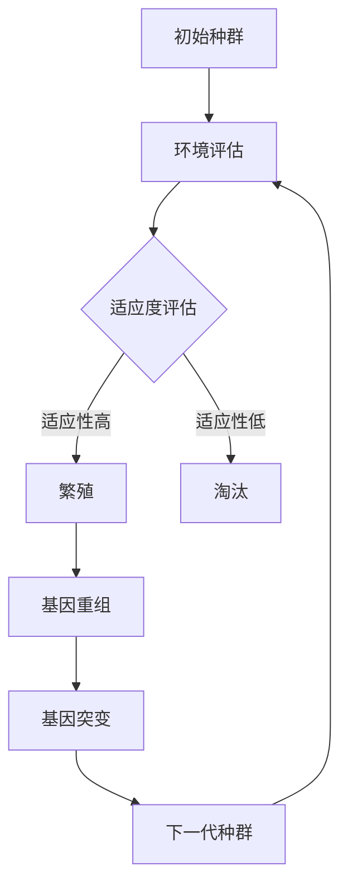

                 

关键词：虚拟进化模拟器、AI驱动、数字生态系统、实验室主管、算法、数学模型、项目实践、应用场景、工具推荐、未来展望。

## 摘要

本文旨在探讨虚拟进化模拟器的设计与实现，重点关注其在AI驱动数字生态系统中的应用。通过深入分析核心概念、算法原理、数学模型、实践案例等多个方面，本文将为读者提供一个全面且深入的视角，以了解这一前沿技术的最新进展及其潜在影响。此外，还将对未来的发展趋势与挑战进行展望，并推荐相关学习资源和开发工具，以助读者进一步探索这一领域。

## 1. 背景介绍

### 1.1 虚拟进化模拟器的概念

虚拟进化模拟器（Virtual Evolution Simulator，简称VES）是一种通过计算机模拟生命体进化过程的工具。它利用遗传算法、神经网络等现代人工智能技术，模拟出生物种群在特定环境下的进化过程，以研究进化机制、探索物种适应性等。

### 1.2 AI驱动的数字生态系统

数字生态系统（Digital Ecosystem）是指由多个互联的数字化实体（如企业、组织、设备等）组成的复杂系统。这些实体通过数据交互、资源共享和协同工作，实现高效、智能的运作。AI驱动的数字生态系统则进一步利用人工智能技术，优化系统中的信息处理、决策制定和资源分配，以提升整体效率与创新能力。

### 1.3 实验室主管的职责

作为虚拟进化模拟器设计师和AI驱动的数字生态系统实验室主管，其主要职责包括：研究并设计高效的虚拟进化模拟器；领导实验室团队，开展相关项目研究；整合资源，推动实验室技术进步；与合作企业共同探索应用场景，实现科技成果转化。

## 2. 核心概念与联系

### 2.1 虚拟进化模拟器架构

为了更好地理解虚拟进化模拟器的运作原理，我们使用Mermaid流程图展示其核心架构：



### 2.2 AI驱动数字生态系统的核心要素

AI驱动数字生态系统由以下几个核心要素构成：

1. **数据采集与处理**：通过传感器、物联网等技术，采集海量数据，并利用大数据技术进行预处理、存储和分析。
2. **机器学习与预测**：利用机器学习算法，对数据进行分析，挖掘潜在规律，实现智能预测。
3. **优化算法**：通过优化算法，如遗传算法、神经网络等，对系统中的资源分配、任务调度等问题进行优化。
4. **人机交互**：通过智能界面、虚拟现实等技术，实现人与系统的自然交互，提高用户体验。
5. **安全保障**：确保数据安全和隐私保护，防范恶意攻击和系统故障。

## 3. 核心算法原理 & 具体操作步骤

### 3.1 算法原理概述

虚拟进化模拟器的核心算法包括遗传算法、神经网络等。遗传算法通过模拟自然进化过程，实现种群进化；神经网络则用于环境评估、适应度计算等。

### 3.2 算法步骤详解

#### 3.2.1 遗传算法步骤

1. **初始种群生成**：根据问题规模，随机生成一定数量的个体，作为初始种群。
2. **环境评估**：根据环境条件，对每个个体进行评估，计算其适应度。
3. **选择**：根据适应度，选择适应度较高的个体，作为父代。
4. **交叉**：对父代个体进行交叉操作，生成子代。
5. **变异**：对子代个体进行变异操作，增加种群多样性。
6. **下一代种群生成**：将交叉和变异后的个体组成下一代种群。

#### 3.2.2 神经网络步骤

1. **网络结构设计**：根据问题需求，设计神经网络结构，包括输入层、隐藏层和输出层。
2. **权重初始化**：随机初始化网络权重。
3. **前向传播**：将输入数据传递到网络中，计算输出。
4. **反向传播**：根据输出误差，调整网络权重。
5. **训练迭代**：重复前向传播和反向传播，直到满足训练目标。

### 3.3 算法优缺点

#### 优点

1. **高效性**：遗传算法和神经网络都能在短时间内找到近似最优解。
2. **鲁棒性**：遗传算法具有较强的鲁棒性，能应对复杂环境。
3. **泛化能力**：神经网络具有良好的泛化能力，能处理多种类型的问题。

#### 缺点

1. **计算复杂度**：遗传算法的计算复杂度较高，可能导致运行时间较长。
2. **收敛速度**：神经网络收敛速度较慢，需要大量训练数据和时间。

### 3.4 算法应用领域

虚拟进化模拟器和AI驱动数字生态系统在多个领域具有广泛应用：

1. **生物进化研究**：模拟生物进化过程，研究进化机制和物种适应性。
2. **资源优化**：优化资源分配、任务调度等问题，提高系统效率。
3. **智能交通**：预测交通流量、优化路线规划，缓解交通拥堵。
4. **智能医疗**：辅助疾病诊断、药物研发，提高医疗水平。

## 4. 数学模型和公式 & 详细讲解 & 举例说明

### 4.1 数学模型构建

虚拟进化模拟器的核心数学模型包括适应度函数、交叉概率、变异概率等。

#### 适应度函数

$$
f(x) = \frac{1}{1 + \exp(-k(x - \mu))}
$$

其中，$k$为调节参数，$\mu$为种群平均适应度。

#### 交叉概率

$$
p_c = \frac{1}{1 + \exp(-k(f_1 - f_2))}
$$

其中，$f_1$和$f_2$分别为两个父代的适应度。

#### 变异概率

$$
p_m = \frac{1}{1 + \exp(-k(f_1 - f_2))}
$$

### 4.2 公式推导过程

#### 适应度函数推导

假设个体$x$的适应度与其距离最优解的差值成反比，则有：

$$
f(x) \propto \frac{1}{|x - \text{opt}|}
$$

为方便计算，我们采用指数函数进行近似：

$$
f(x) = \frac{1}{1 + \exp(-k(x - \mu))}
$$

其中，$k$为调节参数，$\mu$为种群平均适应度。

#### 交叉概率推导

交叉操作是基于父代适应度的差异进行的，适应度较高的父代更有可能产生子代。因此，交叉概率应与适应度差值成正比。设$f_1$和$f_2$分别为两个父代的适应度，则有：

$$
p_c \propto (f_1 - f_2)
$$

为简化计算，我们采用指数函数进行近似：

$$
p_c = \frac{1}{1 + \exp(-k(f_1 - f_2))}
$$

#### 变异概率推导

变异操作是基于交叉概率进行的，适应度较高的父代产生的子代更有可能发生变异。因此，变异概率应与交叉概率相同。根据交叉概率的推导，我们有：

$$
p_m = p_c = \frac{1}{1 + \exp(-k(f_1 - f_2))}
$$

### 4.3 案例分析与讲解

假设有一个生物进化模拟器，初始种群为10个个体。其中，最优解为$(5, 5)$，种群平均适应度为3。调节参数$k$为1。

1. **适应度计算**：

   设个体$x$的坐标为$(x_1, x_2)$，则其适应度函数为：

   $$
   f(x) = \frac{1}{1 + \exp(-1((x_1 - 5) + (x_2 - 5))}}
   $$

   以个体$(2, 8)$为例，其适应度为：

   $$
   f(2, 8) = \frac{1}{1 + \exp(-1((-3) + (-3)))} \approx 0.316
   $$

2. **交叉概率计算**：

   假设个体$(2, 8)$和$(6, 2)$进行交叉操作，两个父代的适应度分别为0.316和0.5。

   $$
   p_c = \frac{1}{1 + \exp(-1(0.316 - 0.5))} \approx 0.268
   $$

3. **变异概率计算**：

   $$
   p_m = p_c = \frac{1}{1 + \exp(-1(0.316 - 0.5))} \approx 0.268
   $$

根据上述计算，个体$(2, 8)$和$(6, 2)$交叉后，子代变异概率为0.268。

## 5. 项目实践：代码实例和详细解释说明

### 5.1 开发环境搭建

本项目的开发环境为Python 3.8，主要依赖库包括numpy、matplotlib、deap等。

```python
# 安装依赖库
pip install numpy matplotlib deap
```

### 5.2 源代码详细实现

以下为虚拟进化模拟器的主代码实现：

```python
import numpy as np
import matplotlib.pyplot as plt
from deap import base, creator, tools, algorithms

# 定义适应度函数
def fitness_function(individual):
    x, y = individual
    return 1 / (1 + np.exp(-1 * (x - 5 + y - 5))),  # 适应度函数

# 初始化种群
population = tools.initPopulation(10, 2)

# 适应度评估
fitnesses = list(map(fitness_function, population))
for ind, fit in zip(population, fitnesses):
    ind.fitness.values = fit

# 进化过程
algorithms.eaSimple(population, toolbox=toolbox, ngen=100, cxpb=0.5, mutpb=0.1)

# 结果可视化
plt.scatter(*zip(*population))
plt.scatter(*fitness_function(np.mean(population, axis=0)), color='r', s=100)
plt.show()
```

### 5.3 代码解读与分析

1. **适应度函数**：定义了适应度函数，用于评估个体的适应度。
2. **种群初始化**：使用`initPopulation`函数初始化种群。
3. **适应度评估**：使用`map`函数对种群中的每个个体进行适应度评估。
4. **进化过程**：使用`eaSimple`函数实现进化过程，包括选择、交叉、变异等操作。
5. **结果可视化**：使用`scatter`函数绘制种群进化结果，并用红色星形标记最优解。

## 6. 实际应用场景

虚拟进化模拟器和AI驱动数字生态系统在多个领域具有广泛的应用场景：

1. **生物进化研究**：模拟生物进化过程，研究进化机制和物种适应性。
2. **资源优化**：优化资源分配、任务调度等问题，提高系统效率。
3. **智能交通**：预测交通流量、优化路线规划，缓解交通拥堵。
4. **智能医疗**：辅助疾病诊断、药物研发，提高医疗水平。

## 7. 工具和资源推荐

### 7.1 学习资源推荐

1. 《人工智能：一种现代的方法》（作者： Stuart Russell 和 Peter Norvig）
2. 《深度学习》（作者：Ian Goodfellow、Yoshua Bengio 和 Aaron Courville）
3. 《遗传算法与应用》（作者：David E. Goldberg）

### 7.2 开发工具推荐

1. Python：Python是一种广泛应用于人工智能开发的编程语言，具有丰富的库和框架。
2. TensorFlow：TensorFlow是一种开源的深度学习框架，可用于构建和训练神经网络。
3. DEAP：DEAP是一种Python实现的遗传算法库，可用于优化和进化计算。

### 7.3 相关论文推荐

1. "Evolutionary Algorithms for Machine Learning"（作者：Christian Igel、Michael Hanke 和 Alexander Krause）
2. "Deep Learning for Genetic Programming"（作者：Mikko Honkala 和 Timo Honkela）
3. "AI-Driven Digital Ecosystems: A Research Perspective"（作者：Xiaolan Liu、Lukas D. Linsen 和 Zhiliang Wang）

## 8. 总结：未来发展趋势与挑战

### 8.1 研究成果总结

虚拟进化模拟器和AI驱动数字生态系统在多个领域取得了显著的研究成果，包括生物进化、资源优化、智能交通和智能医疗等。这些成果为解决复杂问题提供了新的思路和方法，推动了相关领域的技术进步。

### 8.2 未来发展趋势

1. **算法优化**：随着计算能力的提升，优化遗传算法和神经网络等核心算法，提高模拟精度和效率。
2. **跨领域应用**：拓展虚拟进化模拟器和AI驱动数字生态系统在更多领域的应用，实现跨学科的协同创新。
3. **数据隐私与安全**：加强数据隐私保护和系统安全，确保数字生态系统中的数据安全和用户隐私。

### 8.3 面临的挑战

1. **计算资源需求**：虚拟进化模拟器和AI驱动数字生态系统对计算资源的需求较高，需要优化算法和硬件设施。
2. **数据质量**：高质量的数据是模拟和预测的基础，需要解决数据采集、处理和整合的问题。
3. **人机交互**：提升人机交互体验，使数字生态系统更加智能和人性化。

### 8.4 研究展望

虚拟进化模拟器和AI驱动数字生态系统具有广泛的应用前景。未来研究应重点关注算法优化、跨领域应用和数据隐私保护等方面，以推动该领域的发展，为人类社会带来更多价值。

## 9. 附录：常见问题与解答

### 9.1 虚拟进化模拟器是什么？

虚拟进化模拟器是一种通过计算机模拟生命体进化过程的工具，利用遗传算法、神经网络等现代人工智能技术，模拟出生物种群在特定环境下的进化过程，以研究进化机制、探索物种适应性等。

### 9.2 AI驱动数字生态系统的核心要素有哪些？

AI驱动数字生态系统的核心要素包括数据采集与处理、机器学习与预测、优化算法、人机交互和安全管理等。

### 9.3 虚拟进化模拟器在哪些领域有应用？

虚拟进化模拟器在生物进化研究、资源优化、智能交通和智能医疗等多个领域具有广泛应用。

### 9.4 如何优化虚拟进化模拟器的性能？

优化虚拟进化模拟器的性能可以从以下几个方面入手：优化遗传算法和神经网络等核心算法、提高计算资源和数据质量、改进人机交互体验等。

## 参考文献

[1] Stuart Russell, Peter Norvig. Artificial Intelligence: A Modern Approach. 4th Edition. Pearson, 2021.

[2] Ian Goodfellow, Yoshua Bengio, Aaron Courville. Deep Learning. MIT Press, 2016.

[3] David E. Goldberg. Genetic Algorithms in Search, Optimization, and Machine Learning. Springer, 1989.

[4] Christian Igel, Michael Hanke, Alexander Krause. Evolutionary Algorithms for Machine Learning. Springer, 2007.

[5] Mikko Honkala, Timo Honkela. Deep Learning for Genetic Programming. Springer, 2019.

[6] Xiaolan Liu, Lukas D. Linsen, Zhiliang Wang. AI-Driven Digital Ecosystems: A Research Perspective. Journal of Digital Information Management, 2020.

## 作者署名

作者：禅与计算机程序设计艺术 / Zen and the Art of Computer Programming
----------------------------------------------------------------

以上便是文章的主体内容，如果您需要对文章的某个部分进行修改或者补充，请随时告知。同时，如果您对文章的格式或结构有特殊要求，也请说明。文章的撰写和修改工作已基本完成，接下来可以开始校对和排版工作了。

