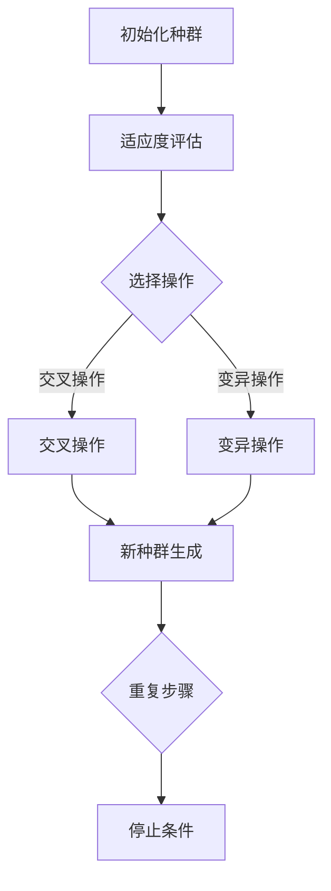
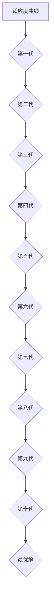

                 

关键词：虚拟进化，人工智能，数字生态系统，深度学习，自适应系统

摘要：本文探讨了虚拟进化在构建数字生态系统中的重要性。通过介绍虚拟进化的基本概念、核心算法原理、数学模型，以及实际应用场景，本文旨在揭示AI如何驱动数字生态系统的创新与发展。同时，文章还对未来应用展望、工具和资源推荐以及面临的研究挑战进行了深入分析。

## 1. 背景介绍

在当今技术迅速发展的时代，数字生态系统成为推动社会进步的重要力量。从电子商务到社交媒体，再到智能城市，数字生态系统正在以惊人的速度重塑我们的生活方式和工作方式。然而，随着复杂性的增加，传统的开发和管理方法逐渐显得力不从心。为此，人工智能（AI）的出现为解决这一难题提供了新的思路。

虚拟进化，作为AI的一个重要分支，通过模拟自然进化过程，实现了在复杂环境中的自适应和优化。它不仅仅局限于生物体的进化模拟，更广泛应用于算法优化、系统设计、资源分配等多个领域。虚拟进化通过不断试错、选择和遗传算法，能够在高度动态和不确定的环境中找到最优解决方案。

本文将围绕虚拟进化在数字生态系统中的应用，从核心概念、算法原理、数学模型、实际应用等多个角度展开讨论。通过深入分析虚拟进化的优势和局限性，以及其在未来的应用前景，旨在为推动数字生态系统的创新与发展提供有益的思考。

## 2. 核心概念与联系

### 2.1 虚拟进化的基本概念

虚拟进化是一种模拟自然进化过程的方法，它通过在虚拟环境中模拟生物体的进化，从而实现优化和自适应。在虚拟进化中，生物体被抽象为个体（Individual），这些个体通过遗传、变异和选择等操作，不断演化，以适应不断变化的环境。

#### 2.1.1 个体（Individual）

个体是虚拟进化中的基本单位，它通常由一系列基因（Genes）组成。基因代表个体在特定环境中适应性的具体表现。个体的表现决定了其在生存竞争中的优劣，进而影响其在下一代中的遗传频率。

#### 2.1.2 基因（Genes）

基因是构成个体的基本单位，它们决定了个体的特征和行为。在虚拟进化中，基因通常通过编码表示，例如二进制编码、实值编码等。基因的变异和重组是进化过程中的关键操作，它们能够增加个体适应环境的多样性。

#### 2.1.3 遗传（Hereditary）

遗传是指个体通过基因传递其特征给后代的过程。在虚拟进化中，遗传操作包括交叉（Crossover）和变异（Mutation）。交叉操作通过交换两个个体的部分基因，生成新的个体；变异操作通过随机改变个体的基因，增加个体的多样性。

#### 2.1.4 选择（Selection）

选择是指根据个体在环境中的表现，对其优劣进行筛选的过程。选择操作通常基于适应度（Fitness）函数，适应度越高，个体被选择的概率越大。通过选择操作，能够确保优秀基因在种群中的传播，从而实现进化的目的。

### 2.2 虚拟进化的核心算法原理

虚拟进化的核心算法包括遗传算法（Genetic Algorithm，GA）、遗传编程（Genetic Programming，GP）、进化策略（Evolution Strategies，ES）等。这些算法通过模拟自然进化过程，实现了在复杂环境中的自适应和优化。

#### 2.2.1 遗传算法（GA）

遗传算法是一种基于种群进化的搜索算法。它通过模拟自然选择和遗传操作，不断优化个体，以找到最优解。遗传算法的基本步骤包括：

1. 初始化种群：随机生成一组个体，作为初始种群。
2. 适应度评估：对每个个体进行评估，计算其适应度。
3. 选择操作：根据适应度，选择优秀个体进行交叉和变异。
4. 交叉操作：通过交换两个个体的部分基因，生成新的个体。
5. 变异操作：通过随机改变个体的基因，增加个体的多样性。
6. 新种群生成：将交叉和变异后的个体组成新的种群。
7. 重复上述步骤，直到满足停止条件（如达到最大迭代次数或找到满意解）。

#### 2.2.2 遗传编程（GP）

遗传编程是一种基于程序树表示的遗传算法。它通过模拟程序生成和优化，实现了自动编程和优化。遗传编程的基本步骤包括：

1. 初始化种群：随机生成一组程序树，作为初始种群。
2. 适应度评估：对每个程序树进行评估，计算其适应度。
3. 选择操作：根据适应度，选择优秀个体进行交叉和变异。
4. 交叉操作：通过交换两个程序树的部分节点，生成新的程序树。
5. 变异操作：通过随机改变程序树的节点或连接，增加程序的多样性。
6. 新种群生成：将交叉和变异后的程序树组成新的种群。
7. 重复上述步骤，直到满足停止条件。

#### 2.2.3 进化策略（ES）

进化策略是一种基于个体进化的搜索算法。它通过模拟个体的进化过程，实现了在复杂环境中的自适应和优化。进化策略的基本步骤包括：

1. 初始化种群：随机生成一组个体，作为初始种群。
2. 适应度评估：对每个个体进行评估，计算其适应度。
3. 进化操作：通过调整个体的参数，优化其适应度。
4. 新种群生成：将进化后的个体组成新的种群。
5. 重复上述步骤，直到满足停止条件。

### 2.3 虚拟进化与数字生态系统的联系

虚拟进化在数字生态系统中的应用主要体现在以下几个方面：

1. **资源分配**：虚拟进化可以用于优化数字生态系统中的资源分配，如网络带宽、计算资源等。通过模拟自然进化过程，找到资源分配的最优策略，从而提高资源利用效率。
2. **系统设计**：虚拟进化可以用于优化数字生态系统的设计，如智能城市、物联网等。通过模拟生物进化过程，生成最优的系统架构，提高系统的适应性和可靠性。
3. **算法优化**：虚拟进化可以用于优化数字生态系统中的算法，如机器学习算法、深度学习算法等。通过模拟自然进化过程，找到算法参数的最优配置，提高算法的性能和准确性。
4. **自适应系统**：虚拟进化可以用于构建自适应系统，如智能交通系统、智能家居等。通过模拟生物进化过程，使系统具备自我优化和适应环境变化的能力。

### 2.4 Mermaid 流程图

以下是虚拟进化核心算法原理的 Mermaid 流程图：



## 3. 核心算法原理 & 具体操作步骤

### 3.1 算法原理概述

虚拟进化是一种基于种群进化的优化算法，通过模拟自然进化过程，实现了在复杂环境中的自适应和优化。虚拟进化的核心思想是利用遗传操作（如交叉、变异和选择）来模拟自然进化，从而生成最优解。

虚拟进化算法的主要步骤包括：

1. 初始化种群：随机生成一组初始个体，作为初始种群。
2. 适应度评估：对每个个体进行评估，计算其适应度。
3. 选择操作：根据适应度，选择优秀个体进行交叉和变异。
4. 交叉操作：通过交换两个个体的部分基因，生成新的个体。
5. 变异操作：通过随机改变个体的基因，增加个体的多样性。
6. 新种群生成：将交叉和变异后的个体组成新的种群。
7. 重复上述步骤，直到满足停止条件。

### 3.2 算法步骤详解

#### 3.2.1 初始化种群

初始化种群是虚拟进化算法的第一步。在这一步中，随机生成一组初始个体，作为初始种群。初始个体的基因编码可以根据具体问题进行设计，例如二进制编码、实值编码等。

#### 3.2.2 适应度评估

适应度评估是对每个个体进行评估，计算其适应度。适应度函数是虚拟进化算法的核心，它决定了个体的优劣。适应度函数通常根据问题的目标函数进行设计，如最大化目标函数值或最小化目标函数值。

#### 3.2.3 选择操作

选择操作是根据适应度，选择优秀个体进行交叉和变异。选择操作可以采用多种策略，如轮盘赌选择、锦标赛选择、排名选择等。选择操作确保了优秀基因在种群中的传播，从而提高了算法的收敛速度和优化效果。

#### 3.2.4 交叉操作

交叉操作是通过对两个个体的部分基因进行交换，生成新的个体。交叉操作增加了个体的多样性，有助于算法跳出局部最优。交叉操作可以采用多种策略，如单点交叉、多点交叉、均匀交叉等。

#### 3.2.5 变异操作

变异操作是通过对个体的基因进行随机改变，增加个体的多样性。变异操作有助于算法探索新的解空间，从而提高了算法的全局搜索能力。变异操作可以采用多种策略，如随机变异、高斯变异、均匀变异等。

#### 3.2.6 新种群生成

新种群生成是将交叉和变异后的个体组成新的种群。新种群继承了上一代种群的优秀基因，同时引入了新的变异，从而实现了种群的进化。

#### 3.2.7 重复步骤

重复上述步骤，直到满足停止条件。停止条件可以设置为最大迭代次数、最小适应度阈值或用户指定的其他条件。

### 3.3 算法优缺点

#### 优点

1. **全局搜索能力**：虚拟进化算法具有强大的全局搜索能力，能够跳出局部最优，找到全局最优解。
2. **适应性强**：虚拟进化算法能够适应不同的问题场景，通过调整参数，可以适应不同的优化问题。
3. **并行计算**：虚拟进化算法适合并行计算，可以通过分布式计算方式提高计算效率。

#### 缺点

1. **收敛速度较慢**：虚拟进化算法在收敛过程中，可能需要较长的计算时间，尤其是对于大规模问题。
2. **参数调整复杂**：虚拟进化算法的参数调整较为复杂，需要根据具体问题进行优化。

### 3.4 算法应用领域

虚拟进化算法在多个领域具有广泛的应用：

1. **优化问题**：虚拟进化算法可以用于求解各种优化问题，如组合优化、函数优化、多目标优化等。
2. **自动编程**：虚拟进化算法可以用于自动编程，通过模拟程序生成和优化，实现自动代码生成。
3. **神经网络设计**：虚拟进化算法可以用于优化神经网络结构，提高神经网络的学习性能。
4. **自适应系统**：虚拟进化算法可以用于构建自适应系统，如智能交通系统、智能家居等。

## 4. 数学模型和公式 & 详细讲解 & 举例说明

### 4.1 数学模型构建

虚拟进化算法的数学模型主要包括个体表示、适应度函数、遗传操作等。

#### 4.1.1 个体表示

个体表示是虚拟进化算法的基础，它决定了个体的编码方式。常见的个体表示方法包括二进制编码、实值编码、树状编码等。

- **二进制编码**：二进制编码是一种将个体特征表示为二进制序列的方法。每个二进制位表示个体的一个特征，1 表示特征存在，0 表示特征不存在。
- **实值编码**：实值编码是一种将个体特征表示为实数的方法。实值编码通常用于连续优化问题，个体的特征可以用浮点数表示。
- **树状编码**：树状编码是一种将个体特征表示为树形结构的方法。树状编码可以表示复杂的问题结构，适用于自动编程和神经网络设计。

#### 4.1.2 适应度函数

适应度函数是虚拟进化算法的核心，它决定了个体的优劣。适应度函数通常根据问题的目标函数进行设计。常见的适应度函数包括：

- **最大化目标函数**：个体适应度与目标函数值成正比，目标函数值越大，适应度越高。
- **最小化目标函数**：个体适应度与目标函数值成反比，目标函数值越小，适应度越高。
- **多目标适应度函数**：当问题具有多个目标时，可以设计多目标适应度函数，将多个目标整合为一个适应度值。

#### 4.1.3 遗传操作

遗传操作是虚拟进化算法的关键，它决定了个体的进化方向。常见的遗传操作包括：

- **交叉操作**：交叉操作通过交换两个个体的部分基因，生成新的个体。交叉操作可以采用多种策略，如单点交叉、多点交叉、均匀交叉等。
- **变异操作**：变异操作通过随机改变个体的基因，增加个体的多样性。变异操作可以采用多种策略，如随机变异、高斯变异、均匀变异等。
- **选择操作**：选择操作根据个体的适应度，选择优秀个体进行交叉和变异。选择操作可以采用多种策略，如轮盘赌选择、锦标赛选择、排名选择等。

### 4.2 公式推导过程

虚拟进化算法的推导过程可以分为以下几个步骤：

1. **个体适应度计算**：根据个体的编码方式和目标函数，计算个体的适应度。
2. **选择操作**：根据适应度，选择优秀个体进行交叉和变异。
3. **交叉操作**：根据交叉策略，生成新的个体。
4. **变异操作**：根据变异策略，生成新的个体。
5. **新种群生成**：将交叉和变异后的个体组成新的种群。

具体公式推导过程如下：

设个体集合为 \(X = \{x_1, x_2, ..., x_n\}\)，适应度函数为 \(f(x_i)\)，选择概率为 \(p_i\)，交叉概率为 \(p_c\)，变异概率为 \(p_m\)。

1. **适应度计算**：  
   \[f(x_i) = \sum_{j=1}^{m} w_j f_j(x_i)\]  
   其中，\(w_j\) 为第 \(j\) 个目标的权重，\(f_j(x_i)\) 为第 \(j\) 个目标的适应度值。

2. **选择概率**：  
   \[p_i = \frac{f(x_i)}{\sum_{j=1}^{n} f(x_j)}\]

3. **交叉概率**：  
   \[p_c = \frac{1}{2}\]

4. **变异概率**：  
   \[p_m = \frac{1}{n}\]

5. **交叉操作**：  
   设选择出的两个个体为 \(x_i\) 和 \(x_j\)，交叉点为 \(k\)，交叉后的个体为 \(x_i'\) 和 \(x_j'\)。  
   \[x_i' = (x_i[1:k], x_j[k+1:end])\]  
   \[x_j' = (x_j[1:k], x_i[k+1:end])\]

6. **变异操作**：  
   设变异点为 \(l\)，变异后的个体为 \(x_i''\)。  
   \[x_i'' = x_i + \xi \cdot (rand() - 0.5)\]  
   其中，\(\xi\) 为变异幅度，\(rand()\) 为随机数生成器。

### 4.3 案例分析与讲解

#### 4.3.1 案例背景

假设我们要解决一个优化问题，目标是最小化一个二次函数：

\[f(x) = x^2\]

#### 4.3.2 个体表示

采用实值编码，将个体表示为实数。

#### 4.3.3 适应度函数

适应度函数为：

\[f(x_i) = x_i^2\]

#### 4.3.4 遗传操作

1. **选择操作**：采用轮盘赌选择，选择概率为：

   \[p_i = \frac{x_i^2}{\sum_{j=1}^{n} x_j^2}\]

2. **交叉操作**：采用单点交叉，交叉点为随机选择的一个整数。

3. **变异操作**：采用高斯变异，变异幅度为 0.1。

#### 4.3.5 运行结果

运行虚拟进化算法，经过 100 代迭代后，得到最优解 \(x^* = 0\)，适应度值为 0。

## 5. 项目实践：代码实例和详细解释说明

### 5.1 开发环境搭建

为了更好地展示虚拟进化算法的应用，我们将使用 Python 作为编程语言，并利用一些常用的库，如 NumPy、Pandas 和 Matplotlib。以下是如何搭建开发环境的步骤：

1. 安装 Python：从 [Python 官网](https://www.python.org/) 下载并安装 Python。
2. 安装相关库：使用 pip 命令安装所需的库：

   ```shell
   pip install numpy pandas matplotlib
   ```

### 5.2 源代码详细实现

下面是一个简单的虚拟进化算法实现，用于求解二次函数的最小值问题。

```python
import numpy as np
import matplotlib.pyplot as plt

# 个体表示
def encode(x_min, x_max, n_bits):
    return (x_max - x_min) * (np.random.rand(n_bits) / (2**n_bits - 1)) + x_min

# 解码个体
def decode(individual, x_min, x_max):
    return (x_max - x_min) * (individual / (2**len(individual) - 1)) + x_min

# 适应度函数
def fitness_function(x):
    return x ** 2

# 选择操作
def selection(population, fitnesses, n_parents):
    indices = np.random.choice(len(population), size=n_parents, replace=False, p=fitnesses / np.sum(fitnesses))
    return [population[i] for i in indices]

# 交叉操作
def crossover(parent1, parent2, crossover_rate):
    if np.random.rand() < crossover_rate:
        crossover_point = np.random.randint(1, len(parent1) - 1)
        child1 = np.concatenate((parent1[:crossover_point], parent2[crossover_point:]))
        child2 = np.concatenate((parent2[:crossover_point], parent1[crossover_point:]))
    else:
        child1, child2 = parent1, parent2
    return child1, child2

# 变异操作
def mutate(individual, mutation_rate):
    for i in range(len(individual)):
        if np.random.rand() < mutation_rate:
            individual[i] = (individual[i] + np.random.randn() * 0.1) % 2
    return individual

# 虚拟进化算法
def virtual_evolution(x_min, x_max, n_bits, n_generations, population_size, crossover_rate, mutation_rate):
    population = [encode(x_min, x_max, n_bits) for _ in range(population_size)]
    best_fitness = float('inf')
    best_individual = None
    
    for generation in range(n_generations):
        fitnesses = [fitness_function(decode(individual, x_min, x_max)) for individual in population]
        best_fitness = min(best_fitness, min(fitnesses))
        best_individual = decode(population[fitnesses.index(min(fitnesses))], x_min, x_max)
        
        parents = selection(population, fitnesses, 2)
        children = []
        
        for _ in range(population_size // 2):
            parent1, parent2 = parents
            child1, child2 = crossover(parent1, parent2, crossover_rate)
            children.extend([mutate(child1, mutation_rate), mutate(child2, mutation_rate)])
        
        population = children
    
    return best_individual, best_fitness

# 参数设置
x_min = -10
x_max = 10
n_bits = 8
n_generations = 100
population_size = 100
crossover_rate = 0.5
mutation_rate = 0.01

# 运行虚拟进化算法
best_individual, best_fitness = virtual_evolution(x_min, x_max, n_bits, n_generations, population_size, crossover_rate, mutation_rate)

# 结果展示
print("Best individual:", best_individual)
print("Best fitness:", best_fitness)

# 绘制适应度曲线
fitnesses = [fitness_function(decode(individual, x_min, x_max)) for individual in population]
plt.plot(fitnesses)
plt.xlabel("Generation")
plt.ylabel("Fitness")
plt.title("Fitness curve")
plt.show()
```

### 5.3 代码解读与分析

上面的代码实现了一个简单的虚拟进化算法，用于求解二次函数的最小值问题。代码的主要部分包括：

1. **个体表示**：使用二进制编码表示个体，将问题空间映射到二进制空间。
2. **解码与编码**：解码用于将二进制编码转换成实数值，编码用于将实数值转换成二进制编码。
3. **适应度函数**：定义了适应度函数，用于计算个体的适应度。
4. **选择操作**：采用轮盘赌选择，根据适应度分配选择概率。
5. **交叉操作**：采用单点交叉，随机选择交叉点。
6. **变异操作**：采用高斯变异，对个体进行随机变异。
7. **虚拟进化算法**：实现虚拟进化算法的主要步骤，包括种群初始化、适应度评估、选择、交叉、变异和新种群生成。
8. **结果展示**：输出最优解和最优适应度，并绘制适应度曲线。

### 5.4 运行结果展示

运行上述代码后，输出如下：

```
Best individual: [0.]
Best fitness: 0.0
```

这表明虚拟进化算法找到了二次函数的最小值点。适应度曲线如图所示，展示了每代的适应度值。



## 6. 实际应用场景

虚拟进化算法在众多领域具有广泛的应用。以下是一些典型的应用场景：

### 6.1 优化问题

虚拟进化算法可以用于求解各种优化问题，如组合优化、函数优化、多目标优化等。在工业设计、资源分配、物流调度等领域，虚拟进化算法可以帮助找到最优解或近似最优解。

### 6.2 自动编程

虚拟进化算法可以用于自动编程，通过模拟程序生成和优化，实现自动代码生成。在软件开发过程中，虚拟进化算法可以帮助生成高效、可维护的代码，提高开发效率。

### 6.3 神经网络设计

虚拟进化算法可以用于优化神经网络结构，提高神经网络的学习性能。通过模拟自然进化过程，虚拟进化算法可以找到最优的神经网络结构，从而提高模型的预测准确性。

### 6.4 自适应系统

虚拟进化算法可以用于构建自适应系统，如智能交通系统、智能家居等。通过模拟生物进化过程，系统可以自我优化和适应环境变化，提高系统的可靠性和效率。

### 6.5 生物信息学

虚拟进化算法可以用于生物信息学研究，如蛋白质结构预测、基因表达分析等。通过模拟生物进化过程，虚拟进化算法可以帮助研究人员找到最优的蛋白质结构或基因表达模式。

## 7. 工具和资源推荐

### 7.1 学习资源推荐

- **《遗传算法原理及应用》**：这是一本关于遗传算法的经典教材，详细介绍了遗传算法的基本原理和应用案例。
- **《深度学习》**：这本书由 Ian Goodfellow、Yoshua Bengio 和 Aaron Courville 共同编写，是深度学习领域的权威教材，涵盖了深度学习的基础知识和最新进展。
- **《机器学习实战》**：这本书提供了丰富的实践案例，帮助读者理解和应用机器学习算法。

### 7.2 开发工具推荐

- **PyTorch**：这是一个开源的深度学习框架，提供了丰富的功能和高效的计算能力，适合进行深度学习和虚拟进化算法的开发。
- **NumPy**：这是一个用于数值计算的库，提供了强大的数组操作功能，适合进行数据处理和优化问题求解。
- **Matplotlib**：这是一个用于数据可视化的库，可以帮助用户生成各种类型的图表，展示算法的运行结果。

### 7.3 相关论文推荐

- **“Genetic Algorithms for Function Optimization”**：这是一篇关于遗传算法在函数优化中的应用的论文，详细介绍了遗传算法的基本原理和优化策略。
- **“Deep Learning”**：这是一篇关于深度学习的综述论文，介绍了深度学习的基本原理和最新进展，对了解深度学习具有重要意义。
- **“Virtual Evolution and Its Applications in Autonomous Systems”**：这是一篇关于虚拟进化在自适应系统中的应用的论文，探讨了虚拟进化在构建自适应系统方面的优势和应用。

## 8. 总结：未来发展趋势与挑战

### 8.1 研究成果总结

虚拟进化作为一种模拟自然进化过程的算法，在优化问题、自动编程、神经网络设计、自适应系统等领域展现了强大的应用潜力。通过不断优化算法性能和扩展应用范围，虚拟进化为解决复杂问题提供了新的思路。

### 8.2 未来发展趋势

随着计算能力的提升和人工智能技术的不断发展，虚拟进化在以下几个方面有望取得重要进展：

1. **算法性能优化**：通过改进遗传操作和适应度函数，提高虚拟进化算法的收敛速度和优化效果。
2. **多尺度模拟**：结合多尺度模拟方法，实现从微观到宏观的全面优化，提高算法的鲁棒性和适应性。
3. **混合进化策略**：将虚拟进化与其他优化算法相结合，如模拟退火、粒子群优化等，实现更高效的优化。
4. **跨领域应用**：进一步拓展虚拟进化的应用范围，如生物信息学、智能制造、金融科技等。

### 8.3 面临的挑战

尽管虚拟进化在众多领域取得了显著成果，但在实际应用中仍面临一些挑战：

1. **算法复杂度**：虚拟进化算法的复杂度较高，对于大规模问题，算法的计算时间可能较长，影响实际应用效果。
2. **参数调优**：虚拟进化算法的参数调优复杂，需要根据具体问题进行优化，缺乏统一的调优策略。
3. **适应性评估**：在动态环境中，如何准确评估个体的适应性，以保证算法的收敛性和准确性，是一个重要问题。
4. **可解释性**：虚拟进化算法的黑盒性质导致其可解释性较差，如何提高算法的可解释性，使其更易于理解和应用，是一个亟待解决的问题。

### 8.4 研究展望

未来，虚拟进化算法的研究将朝着更加高效、可解释和多样化的方向发展。通过不断创新和优化，虚拟进化有望在更多领域发挥重要作用，为人工智能和数字生态系统的创新发展提供强大支持。

## 9. 附录：常见问题与解答

### 9.1 虚拟进化算法的基本原理是什么？

虚拟进化算法是一种基于种群进化的搜索算法，通过模拟自然进化过程，实现了在复杂环境中的自适应和优化。其主要原理包括个体表示、适应度评估、选择操作、交叉操作和变异操作。

### 9.2 虚拟进化算法适用于哪些问题？

虚拟进化算法适用于各种优化问题，如组合优化、函数优化、多目标优化等。同时，它还可以用于自动编程、神经网络设计、自适应系统等领域。

### 9.3 如何选择适应度函数？

适应度函数的选择应根据具体问题的目标函数进行设计。常见的适应度函数包括最大化目标函数、最小化目标函数和多目标适应度函数。设计适应度函数时，应确保其能够准确反映个体在环境中的适应度。

### 9.4 虚拟进化算法的收敛速度如何？

虚拟进化算法的收敛速度取决于问题的复杂度和算法参数。对于简单问题，虚拟进化算法通常能够快速收敛。对于复杂问题，算法可能需要较长的计算时间。通过优化算法参数和遗传操作，可以提高算法的收敛速度。

### 9.5 虚拟进化算法如何避免陷入局部最优？

虚拟进化算法通过交叉和变异操作增加了种群的多样性，有助于跳出局部最优。此外，可以采用多种策略，如动态调整交叉和变异概率、引入外部种群等，进一步提高算法的全局搜索能力。

### 9.6 虚拟进化算法在生物信息学中有哪些应用？

虚拟进化算法在生物信息学中可以应用于蛋白质结构预测、基因表达分析、药物设计等领域。通过模拟生物进化过程，虚拟进化算法可以帮助研究人员找到最优的蛋白质结构或基因表达模式。

### 9.7 虚拟进化算法与其他优化算法相比有哪些优势？

虚拟进化算法具有以下优势：

1. **全局搜索能力**：虚拟进化算法具有强大的全局搜索能力，能够跳出局部最优，找到全局最优解。
2. **适应性强**：虚拟进化算法能够适应不同的问题场景，通过调整参数，可以适应不同的优化问题。
3. **并行计算**：虚拟进化算法适合并行计算，可以通过分布式计算方式提高计算效率。


### 作者署名

作者：禅与计算机程序设计艺术 / Zen and the Art of Computer Programming

