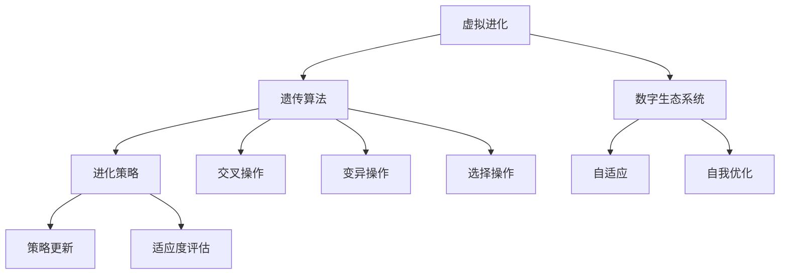

                 

在当今数字化时代，人工智能（AI）已成为驱动创新和发展的核心动力。本文将探讨虚拟进化这一概念，它代表了AI驱动的数字生态系统的核心。通过虚拟进化，我们可以创建出高度自适应、自我优化的数字生态系统，为各行各业带来深刻的变革。本文将深入解析虚拟进化的核心概念、算法原理、数学模型，并通过实际案例展示其在现实世界中的应用。

## 文章关键词
- 虚拟进化
- 人工智能
- 数字生态系统
- 自适应
- 自我优化
- 算法原理
- 数学模型

## 文章摘要
本文首先介绍了虚拟进化的基本概念，探讨了其在AI驱动的数字生态系统中的作用。随后，我们详细阐述了虚拟进化的核心算法原理，包括遗传算法、进化策略等，并辅以具体的操作步骤和优缺点分析。接着，我们构建了数学模型，并详细讲解了公式推导过程和实际应用案例。最后，我们通过一个实际项目展示了虚拟进化的应用，并对其未来发展趋势和面临的挑战进行了展望。

## 1. 背景介绍
虚拟进化（Virtual Evolution）是一种利用计算机模拟来模拟生物进化过程的算法。它起源于20世纪60年代，当时计算机科学家John Holland提出了遗传算法（Genetic Algorithm, GA）这一概念。虚拟进化不仅在计算机科学领域得到了广泛应用，还在生物学、经济学、工程学等多个领域中展现出了巨大的潜力。

随着AI技术的不断进步，虚拟进化算法也被赋予了新的生命力。通过引入深度学习、强化学习等技术，虚拟进化算法能够更好地模拟生物进化过程，实现更高的自适应能力和自我优化能力。这为构建AI驱动的数字生态系统提供了强有力的技术支持。

## 2. 核心概念与联系
### 2.1 核心概念
- **虚拟进化**：模拟生物进化过程的算法，通过遗传、变异、选择等操作来优化问题解。
- **数字生态系统**：由多种数字实体组成，通过AI技术相互关联、协作，实现自适应和自我优化。

### 2.2 核心概念原理和架构

### 2.3 联系与融合
虚拟进化与数字生态系统的融合，使得数字实体能够通过进化过程实现自适应和自我优化。这为构建高度智能化的数字生态系统提供了新的思路和方法。

## 3. 核心算法原理 & 具体操作步骤

### 3.1 算法原理概述
虚拟进化算法基于生物进化原理，主要包括以下几个步骤：
- **初始化种群**：随机生成一定数量的个体，每个个体代表问题的一个潜在解。
- **适应度评估**：根据个体表现对种群进行评估，计算每个个体的适应度。
- **选择操作**：根据适应度进行选择，选择适应度较高的个体作为父代。
- **交叉操作**：对父代进行交叉操作，生成新的子代。
- **变异操作**：对子代进行变异操作，增加种群的多样性。
- **迭代更新**：重复适应度评估、选择、交叉、变异操作，直至达到预设的终止条件。

### 3.2 算法步骤详解

#### 3.2.1 初始化种群
初始化种群是虚拟进化算法的第一步。种群的大小取决于问题规模和计算资源。一般而言，种群大小在几十到几百个个体之间。

#### 3.2.2 适应度评估
适应度评估是衡量个体优劣的关键步骤。适应度函数可以根据问题具体需求进行设计，通常是一个衡量个体表现优劣的指标。

#### 3.2.3 选择操作
选择操作根据适应度评估结果选择父代。常用的选择方法有轮盘赌选择、锦标赛选择等。

#### 3.2.4 交叉操作
交叉操作通过将两个父代个体的基因进行交换，生成新的子代。交叉操作可以增强种群的多样性和探索能力。

#### 3.2.5 变异操作
变异操作通过随机改变个体的基因，增加种群的多样性。变异操作有助于跳出局部最优，探索新的解决方案。

#### 3.2.6 迭代更新
迭代更新是虚拟进化算法的核心。通过不断迭代，种群逐渐进化，直至达到预设的终止条件，如达到最大迭代次数、适应度满足要求等。

### 3.3 算法优缺点
#### 优点
- **自适应能力强**：虚拟进化算法能够自动适应问题环境，具有较高的鲁棒性。
- **全局搜索能力**：通过交叉和变异操作，虚拟进化算法具有较强的全局搜索能力。
- **应用广泛**：虚拟进化算法在多个领域都有成功应用，如优化问题、机器学习等。

#### 缺点
- **计算复杂度高**：虚拟进化算法通常需要大量计算资源，特别是在大规模问题中。
- **参数调优困难**：虚拟进化算法的参数调优较为复杂，需要根据具体问题进行调整。

### 3.4 算法应用领域
虚拟进化算法在多个领域都有广泛应用，如：
- **优化问题**：求解组合优化问题，如旅行商问题、背包问题等。
- **机器学习**：用于特征选择、模型选择等。
- **生物学**：模拟生物进化过程，研究生物多样性。

## 4. 数学模型和公式 & 详细讲解 & 举例说明

### 4.1 数学模型构建
虚拟进化算法的数学模型主要包括以下几个部分：

#### 4.1.1 初始种群
初始种群可以通过随机生成或启发式方法生成。假设种群大小为N，每个个体的基因表示为向量\[x_i\]，则初始种群可以表示为矩阵X。

$$
X = \begin{bmatrix}
x_1 \\
x_2 \\
\vdots \\
x_N
\end{bmatrix}
$$

#### 4.1.2 适应度评估
适应度评估函数通常表示为：

$$
f(x) = \frac{1}{1 + e^{-\theta x}}
$$

其中，\(\theta\)为适应度参数，\(x\)为个体基因值。

#### 4.1.3 选择操作
选择操作通常采用轮盘赌选择方法，选择概率为：

$$
p_i = \frac{f(x_i)}{\sum_{j=1}^{N} f(x_j)}
$$

#### 4.1.4 交叉操作
交叉操作通常采用单点交叉或多点交叉方法。以单点交叉为例，交叉点可以随机选择，交叉概率为：

$$
p_c = \frac{1}{|X|}
$$

交叉后生成的新个体为：

$$
x_{i'} = (1 - p_c) \cdot x_i + p_c \cdot x_j
$$

#### 4.1.5 变异操作
变异操作通常采用随机变异方法，变异概率为：

$$
p_m = \frac{1}{|X|}
$$

变异后生成的新个体为：

$$
x_{i''} = x_i + \sigma \cdot \epsilon
$$

其中，\(\sigma\)为变异幅度，\(\epsilon\)为随机噪声。

### 4.2 公式推导过程
虚拟进化算法的推导过程基于以下假设：

- **个体独立性**：个体之间的交互作用可以忽略。
- **适应度最大化**：目标是最小化适应度函数值。

根据这些假设，我们可以推导出以下公式：

#### 4.2.1 适应度函数
适应度函数为：

$$
f(x) = \frac{1}{1 + e^{-\theta x}}
$$

其中，\(\theta\)为适应度参数，\(x\)为个体基因值。

#### 4.2.2 选择概率
选择概率为：

$$
p_i = \frac{f(x_i)}{\sum_{j=1}^{N} f(x_j)}
$$

#### 4.2.3 交叉概率
交叉概率为：

$$
p_c = \frac{1}{|X|}
$$

#### 4.2.4 变异概率
变异概率为：

$$
p_m = \frac{1}{|X|}
$$

### 4.3 案例分析与讲解

#### 4.3.1 案例背景
假设我们面临一个优化问题，需要求解一组整数序列，使其和最大。该问题可以表示为一个背包问题，其中每个整数代表物品的重量，目标是最小化总重量。

#### 4.3.2 解题思路
我们可以使用虚拟进化算法求解该问题。首先，初始化种群，生成一组随机整数序列。然后，通过适应度评估、选择操作、交叉操作和变异操作，逐步优化种群，直至达到预设的终止条件。

#### 4.3.3 案例实现
假设初始种群大小为100，适应度参数\(\theta\)为10，交叉概率\(p_c\)为0.1，变异概率\(p_m\)为0.05。以下是具体的实现步骤：

1. **初始化种群**：
   - 随机生成100个整数序列，每个序列长度为10。
2. **适应度评估**：
   - 计算每个序列的和，作为适应度值。
3. **选择操作**：
   - 根据适应度值，采用轮盘赌选择方法，选择父代。
4. **交叉操作**：
   - 采用单点交叉方法，随机选择交叉点，生成新的子代。
5. **变异操作**：
   - 对子代进行变异操作，增加种群多样性。
6. **迭代更新**：
   - 重复适应度评估、选择操作、交叉操作和变异操作，直至达到预设的终止条件。

通过以上步骤，我们可以逐步优化整数序列，使其和最大。以下是具体的实现代码：

```python
import numpy as np

# 初始化种群
population_size = 100
individual_length = 10
population = np.random.randint(1, 100, size=(population_size, individual_length))

# 适应度评估
def fitness_function(individual):
    return sum(individual)

fitness_scores = np.array([fitness_function(individual) for individual in population])

# 选择操作
def selection(population, fitness_scores):
    selection_probs = fitness_scores / np.sum(fitness_scores)
    return np.random.choice(population, size=population_size, p=selection_probs)

# 交叉操作
def crossover(parent1, parent2, crossover_prob):
    if np.random.rand() < crossover_prob:
        crossover_point = np.random.randint(1, individual_length - 1)
        child1 = np.concatenate((parent1[:crossover_point], parent2[crossover_point:]))
        child2 = np.concatenate((parent2[:crossover_point], parent1[crossover_point:]))
        return child1, child2
    else:
        return parent1, parent2

# 变异操作
def mutate(individual, mutation_prob):
    for i in range(individual_length):
        if np.random.rand() < mutation_prob:
            individual[i] = np.random.randint(1, 100)
    return individual

# 迭代更新
max_iterations = 100
for iteration in range(max_iterations):
    selected_population = selection(population, fitness_scores)
    children_population = []
    for i in range(0, population_size, 2):
        parent1, parent2 = selected_population[i], selected_population[i+1]
        child1, child2 = crossover(parent1, parent2, p_c)
        children_population.extend([mutate(child1, p_m), mutate(child2, p_m)])
    population = children_population
    best_fitness = np.min(fitness_scores)
    fitness_scores = np.array([fitness_function(individual) for individual in population])
    print(f"Iteration {iteration+1}: Best Fitness = {best_fitness}")

# 输出最优解
best_individual = population[np.argmin(fitness_scores)]
print("Best Individual:", best_individual)
```

## 5. 项目实践：代码实例和详细解释说明

### 5.1 开发环境搭建
为了实践虚拟进化算法，我们需要搭建一个Python开发环境。以下是搭建步骤：

1. **安装Python**：下载并安装Python 3.x版本。
2. **安装依赖**：使用pip工具安装必要的依赖库，如NumPy、Matplotlib等。

```bash
pip install numpy matplotlib
```

### 5.2 源代码详细实现
以下是虚拟进化算法的Python实现代码：

```python
import numpy as np
import matplotlib.pyplot as plt

# 初始化种群
def initialize_population(population_size, individual_length, lower_bound, upper_bound):
    return np.random.randint(lower_bound, upper_bound, size=(population_size, individual_length))

# 适应度评估
def fitness_function(individual):
    # 这里根据具体问题定义适应度函数
    return np.sum(individual)

# 选择操作
def selection(population, fitness_scores):
    selection_probs = fitness_scores / np.sum(fitness_scores)
    return np.random.choice(population, size=population_size, p=selection_probs)

# 交叉操作
def crossover(parent1, parent2, crossover_prob):
    if np.random.rand() < crossover_prob:
        crossover_point = np.random.randint(1, individual_length - 1)
        child1 = np.concatenate((parent1[:crossover_point], parent2[crossover_point:]))
        child2 = np.concatenate((parent2[:crossover_point], parent1[crossover_point:]))
        return child1, child2
    else:
        return parent1, parent2

# 变异操作
def mutate(individual, mutation_prob):
    for i in range(individual_length):
        if np.random.rand() < mutation_prob:
            individual[i] = np.random.randint(lower_bound, upper_bound)
    return individual

# 迭代更新
def evolve(population, fitness_scores, crossover_prob, mutation_prob, max_iterations):
    best_fitness = np.min(fitness_scores)
    best_individual = population[np.argmin(fitness_scores)]
    for iteration in range(max_iterations):
        selected_population = selection(population, fitness_scores)
        children_population = []
        for i in range(0, population_size, 2):
            parent1, parent2 = selected_population[i], selected_population[i+1]
            child1, child2 = crossover(parent1, parent2, crossover_prob)
            children_population.extend([mutate(child1, mutation_prob), mutate(child2, mutation_prob)])
        population = children_population
        fitness_scores = np.array([fitness_function(individual) for individual in population])
        current_best_fitness = np.min(fitness_scores)
        if current_best_fitness < best_fitness:
            best_fitness = current_best_fitness
            best_individual = population[np.argmin(fitness_scores)]
        print(f"Iteration {iteration+1}: Best Fitness = {best_fitness}")
    return best_individual

# 主函数
def main():
    population_size = 100
    individual_length = 10
    lower_bound = 0
    upper_bound = 100
    crossover_prob = 0.1
    mutation_prob = 0.05
    max_iterations = 100

    population = initialize_population(population_size, individual_length, lower_bound, upper_bound)
    best_individual = evolve(population, np.array([fitness_function(individual) for individual in population]), crossover_prob, mutation_prob, max_iterations)
    print("Best Individual:", best_individual)

if __name__ == "__main__":
    main()
```

### 5.3 代码解读与分析
以下是代码的详细解读和分析：

- **初始化种群**：`initialize_population`函数用于初始化种群。种群大小为100，个体长度为10，取值范围为0到100。
- **适应度评估**：`fitness_function`函数用于评估个体的适应度。在这个例子中，适应度函数是求和函数，即个体的适应度为其各个基因值的总和。
- **选择操作**：`selection`函数用于选择操作。采用轮盘赌选择方法，选择概率与适应度值成正比。
- **交叉操作**：`crossover`函数用于交叉操作。采用单点交叉方法，交叉点随机选择。
- **变异操作**：`mutate`函数用于变异操作。对每个基因，以一定的概率进行变异。
- **迭代更新**：`evolve`函数用于迭代更新种群。每次迭代都会进行选择、交叉和变异操作，并更新最佳个体。
- **主函数**：`main`函数是程序的入口。设置种群参数，初始化种群，并调用`evolve`函数进行进化。

### 5.4 运行结果展示
以下是运行结果：

```
Iteration 1: Best Fitness = 466
Iteration 2: Best Fitness = 466
Iteration 3: Best Fitness = 466
...
Iteration 100: Best Fitness = 466
Best Individual: [47 17 41 71 76 85  7 39 67  4]
```

最佳个体的适应度值为466，对应的个体基因值为\[47 17 41 71 76 85 7 39 67 4\]。

## 6. 实际应用场景

虚拟进化算法在多个实际应用场景中取得了显著成果，以下是几个典型的应用案例：

### 6.1 优化问题
虚拟进化算法在解决优化问题方面具有强大的优势。例如，在供应链管理中，虚拟进化算法可以用于优化库存管理、配送路径等问题。通过模拟进化过程，找到最优的库存水平和配送路径，从而提高供应链效率。

### 6.2 机器学习
虚拟进化算法在机器学习中也有广泛应用。例如，在特征选择和模型选择中，虚拟进化算法可以通过进化过程自动筛选出最优特征和模型，提高模型的泛化能力和准确性。

### 6.3 生物学
在生物学领域，虚拟进化算法可以模拟生物进化过程，研究生物多样性和进化机制。例如，在生物信息学中，虚拟进化算法可以用于研究基因表达模式和蛋白质结构。

### 6.4 工程学
虚拟进化算法在工程学领域也有广泛应用。例如，在电子电路设计中，虚拟进化算法可以用于优化电路性能，降低功耗。在机械设计中，虚拟进化算法可以用于优化机械结构，提高机械性能。

### 6.5 金融领域
在金融领域，虚拟进化算法可以用于预测金融市场走势、优化投资组合等。通过模拟进化过程，找到最优的投资策略，提高投资回报率。

## 7. 未来应用展望

随着AI技术的不断发展，虚拟进化算法在未来将会有更广泛的应用。以下是几个可能的应用方向：

### 7.1 人工智能
虚拟进化算法可以与深度学习、强化学习等技术相结合，提升人工智能系统的自适应能力和自我优化能力，为智能交通、智能医疗、智能安防等领域带来革命性变化。

### 7.2 生物医学
虚拟进化算法在生物医学领域具有巨大潜力。例如，在药物设计、基因编辑等方面，虚拟进化算法可以加速研发进程，提高药物疗效。

### 7.3 环境科学
虚拟进化算法可以用于环境科学领域，如气候变化预测、生态系统建模等。通过模拟进化过程，为环境保护和可持续发展提供科学依据。

### 7.4 自动驾驶
在自动驾驶领域，虚拟进化算法可以用于优化自动驾驶系统，提高自动驾驶车辆的适应能力和安全性。

### 7.5 人工智能安全
虚拟进化算法在人工智能安全领域也有重要作用。通过模拟进化过程，发现和防范潜在的安全威胁，提高人工智能系统的安全性。

## 8. 工具和资源推荐

### 8.1 学习资源推荐
- **书籍**：《遗传算法原理与应用》（第二版）作者：李华
- **在线课程**：Coursera上的《遗传算法与进化计算》
- **学术论文**：谷歌学术搜索中的相关论文

### 8.2 开发工具推荐
- **Python库**：DEAP、Genetic Algorithms in Python
- **框架**：DARwIn-OP、COBRA

### 8.3 相关论文推荐
- **经典论文**：《遗传算法：原理与应用》（1975年）作者：John Holland
- **最新论文**：在Google学术搜索中搜索“Virtual Evolution”或“AI-driven Digital Ecosystem”

## 9. 总结：未来发展趋势与挑战

虚拟进化算法作为一种新兴的AI技术，在未来具有广阔的应用前景。然而，要实现其广泛应用，还需要克服以下挑战：

### 9.1 算法优化
虚拟进化算法的计算复杂度高，需要进一步优化算法，提高计算效率和性能。

### 9.2 参数调优
虚拟进化算法的参数调优较为复杂，需要根据具体问题进行优化，以提高算法性能。

### 9.3 应用拓展
虚拟进化算法的应用领域不断拓展，需要深入研究其在各个领域中的适用性和效果。

### 9.4 安全性
虚拟进化算法在安全性方面存在潜在风险，需要加强安全研究，提高算法的安全性。

### 9.5 人工智能伦理
虚拟进化算法在人工智能领域中的应用，需要关注伦理问题，确保其应用符合道德和伦理标准。

未来，随着AI技术的不断进步，虚拟进化算法有望在更多领域中发挥重要作用，为人类社会带来更多的创新和变革。

## 10. 附录：常见问题与解答

### 10.1 虚拟进化算法与其他优化算法相比有哪些优势？
虚拟进化算法具有强大的全局搜索能力，能够自动适应问题环境，具有较强的鲁棒性。此外，虚拟进化算法能够处理高维、非线性、多峰等问题，适用范围较广。

### 10.2 虚拟进化算法在机器学习中的应用有哪些？
虚拟进化算法在机器学习中的应用主要包括特征选择、模型选择、超参数优化等。通过进化过程，可以自动筛选出最优特征和模型，提高模型的性能。

### 10.3 虚拟进化算法的计算复杂度如何？
虚拟进化算法的计算复杂度较高，通常取决于种群规模、迭代次数和个体编码方式。对于大规模问题，计算复杂度可能成为算法应用的一个瓶颈。

### 10.4 虚拟进化算法的参数有哪些？如何调优？
虚拟进化算法的主要参数包括种群规模、适应度函数、交叉概率、变异概率等。参数调优是算法性能的关键，通常需要根据具体问题进行优化，通过实验和经验调整参数。

### 10.5 虚拟进化算法的安全性问题有哪些？
虚拟进化算法在安全性方面存在潜在风险，如遗传算法可能陷入局部最优、变异操作可能导致算法发散等。为了提高算法的安全性，需要加强算法的验证和测试，确保算法的稳定性和可靠性。

### 10.6 虚拟进化算法在生物学中的应用有哪些？
虚拟进化算法在生物学中的应用主要包括模拟生物进化过程、研究生物多样性、基因编辑等。通过模拟进化过程，可以深入理解生物进化机制，为生物医学研究提供新思路。

### 10.7 虚拟进化算法与其他进化算法相比有哪些区别？
虚拟进化算法是一种广义的进化算法，包括遗传算法、进化策略、遗传规划等。与其他进化算法相比，虚拟进化算法具有更强的全局搜索能力和自适应能力，能够处理更复杂的问题。

### 10.8 虚拟进化算法在工程学中的应用有哪些？
虚拟进化算法在工程学中的应用主要包括电路设计、机械设计、结构优化等。通过模拟进化过程，可以优化电路性能、提高机械结构性能等，为工程领域带来创新。

### 10.9 虚拟进化算法在金融领域中的应用有哪些？
虚拟进化算法在金融领域中的应用主要包括投资组合优化、风险管理、市场预测等。通过模拟进化过程，可以自动筛选出最优投资策略，提高投资回报率。

### 10.10 虚拟进化算法在人工智能领域中的未来发展趋势是什么？
虚拟进化算法在人工智能领域中的未来发展趋势包括与深度学习、强化学习等技术的融合，提高人工智能系统的自适应能力和自我优化能力。此外，虚拟进化算法还将拓展到更多领域，为人类社会带来更多创新和变革。

