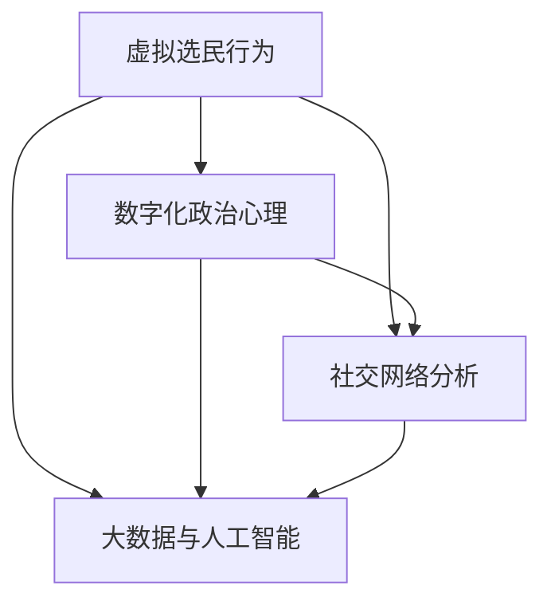

                 

### 文章关键词

- 虚拟选民行为学
- 数字化政治
- 政治心理研究
- 人工智能
- 数据分析
- 选举预测
- 社交网络分析
- 大数据

### 文章摘要

本文深入探讨了虚拟选民行为学的领域，特别是数字化政治背景下，全球公民参与的数字化政治心理研究。通过分析选民在虚拟环境中的行为模式，本文揭示了影响选民决策的多种因素，包括社交媒体影响、信息传播机制、心理偏见等。文章旨在为政治学者、数据分析师和决策者提供一套系统的理论框架和实用的分析工具，以更好地理解和管理虚拟选民行为，为未来的数字化选举策略提供科学依据。

## 1. 背景介绍

在信息化和数字化的浪潮下，政治参与的形式和渠道发生了深刻的变化。传统的线下选举活动和互动方式逐渐被数字化平台所取代，如社交媒体、在线论坛和电子投票系统等。这些数字化工具不仅改变了选民参与政治的方式，也影响了选民的决策过程和心理反应。随着互联网的普及和人工智能技术的进步，虚拟选民行为学作为一门新兴的交叉学科，正逐渐受到学术界和政策制定者的关注。

### 1.1 虚拟选民行为学的兴起

虚拟选民行为学的概念最早出现在20世纪末，随着互联网的普及，人们开始关注选民在虚拟环境中的行为特征。研究者发现，虚拟选民的行为与实际投票行为存在显著差异，这种差异可能源自信息传播方式、社交网络结构、以及心理因素的共同作用。例如，社交媒体上的信息传播速度更快，影响范围更广，可能导致选民在短时间内形成强烈的观点和态度。

### 1.2 数字化政治的挑战与机遇

数字化政治为政治参与带来了诸多挑战，包括信息过载、虚假信息传播、网络暴力等问题。然而，数字化技术也带来了新的机遇，如大数据分析、人工智能辅助决策、个性化政治宣传等。这些新兴技术不仅提高了政治决策的效率和准确性，也为政治学者提供了丰富的数据资源，使他们能够更深入地研究选民行为。

## 2. 核心概念与联系

在研究虚拟选民行为学时，我们需要了解以下几个核心概念及其相互之间的联系：

### 2.1 虚拟选民行为

虚拟选民行为指的是选民在虚拟环境中（如互联网、社交媒体、在线论坛等）表现出来的行为模式，包括信息搜索、观点表达、社交互动等。

### 2.2 数字化政治心理

数字化政治心理是指选民在数字化政治环境中产生的心理活动和心理反应，如认知偏见、情感反应、态度形成等。

### 2.3 社交网络分析

社交网络分析是一种研究社交网络结构和动态的方法，包括节点关系、信息传播路径、社群结构等。在虚拟选民行为学中，社交网络分析可以帮助我们理解选民之间的互动和信息传播机制。

### 2.4 大数据与人工智能

大数据和人工智能技术在虚拟选民行为学中扮演着关键角色。通过收集和分析大量选民数据，我们可以揭示选民行为背后的模式和规律。人工智能算法，如机器学习和深度学习，则可以自动识别和预测选民的行为。

### 2.5 Mermaid 流程图

以下是一个简单的 Mermaid 流程图，展示了虚拟选民行为学中的核心概念及其联系：



## 3. 核心算法原理 & 具体操作步骤

### 3.1 算法原理概述

虚拟选民行为学中的核心算法通常包括以下几个步骤：

1. 数据收集：收集选民在虚拟环境中的行为数据，如社交媒体活动、论坛发言、在线投票记录等。
2. 数据清洗：对收集到的数据进行清洗和预处理，去除噪声数据和异常值。
3. 数据分析：使用大数据技术和人工智能算法对清洗后的数据进行分析，提取选民行为模式和特征。
4. 模型建立：基于分析结果建立预测模型，如选举投票预测模型、选民偏好分析模型等。
5. 预测与评估：使用建立的模型进行选民行为的预测，并对预测结果进行评估和优化。

### 3.2 算法步骤详解

#### 3.2.1 数据收集

数据收集是虚拟选民行为学研究的基础。我们通常使用以下方法进行数据收集：

- 网络爬虫：通过网络爬虫技术收集选民在社交媒体、论坛等平台上的公开数据。
- API接口：使用相关平台的API接口获取选民行为数据。
- 调查问卷：通过在线调查问卷收集选民的主观感受和行为数据。

#### 3.2.2 数据清洗

数据清洗是数据预处理的重要环节，主要包括以下步骤：

- 去重：去除重复的数据条目。
- 缺失值处理：对缺失的数据进行填充或删除。
- 格式转换：统一数据格式，如将日期时间格式转换为标准格式。
- 异常值处理：识别并处理异常值，如异常的投票记录、评论等。

#### 3.2.3 数据分析

数据分析是揭示选民行为模式和特征的关键步骤。我们通常使用以下方法进行数据分析：

- 描述性统计：计算数据的基本统计量，如平均值、标准差、中位数等。
- 聚类分析：对数据进行聚类，找出具有相似特征的选民群体。
- 相关性分析：分析变量之间的相关性，找出可能影响选民行为的关键因素。
- 机器学习算法：使用机器学习算法，如决策树、支持向量机、神经网络等，建立预测模型。

#### 3.2.4 模型建立

基于数据分析的结果，我们可以建立预测模型。以下是一个简单的选举投票预测模型：

1. 特征选择：从分析结果中选择与选举投票相关性较高的特征。
2. 模型训练：使用训练数据集训练预测模型。
3. 模型评估：使用测试数据集评估模型的准确性和泛化能力。
4. 模型优化：根据评估结果调整模型参数，提高模型性能。

#### 3.2.5 预测与评估

建立模型后，我们可以使用模型进行选民行为的预测。以下是一个简单的预测流程：

1. 预测：使用模型对新的选民数据进行预测。
2. 结果评估：比较预测结果与实际结果，评估模型的预测性能。
3. 结果反馈：根据评估结果调整模型，提高预测准确性。

### 3.3 算法优缺点

#### 3.3.1 优点

- 数据量庞大：大数据和人工智能技术可以处理海量选民数据，提供更全面、更准确的预测结果。
- 速度快速：算法可以快速处理大量数据，提供实时的预测结果。
- 个性化分析：基于选民行为特征，算法可以提供个性化的选民偏好分析。

#### 3.3.2 缺点

- 数据隐私问题：收集和处理大量选民数据可能涉及数据隐私问题，需要严格的隐私保护措施。
- 模型偏差：模型可能受到数据偏差的影响，导致预测结果不准确。
- 模型适应性：模型需要不断更新和优化，以适应不断变化的数据环境。

### 3.4 算法应用领域

虚拟选民行为学算法在多个领域有广泛的应用：

- 选举预测：使用算法预测选举结果，为政治决策提供科学依据。
- 政治宣传：通过分析选民行为，制定个性化的政治宣传策略。
- 政治监控：监控选民行为，及时发现和应对潜在的政治风险。
- 社会科学研究：研究选民行为模式，探索社会心理现象。

## 4. 数学模型和公式 & 详细讲解 & 举例说明

在虚拟选民行为学的研究中，数学模型和公式起着至关重要的作用。以下我们将详细介绍一个常见的数学模型——贝叶斯网络模型，并给出具体的推导过程和案例分析。

### 4.1 数学模型构建

贝叶斯网络是一种概率图模型，用于表示变量之间的条件依赖关系。在虚拟选民行为学中，我们可以使用贝叶斯网络来建模选民的行为决策过程。贝叶斯网络由两个部分组成：节点和边。

#### 4.1.1 节点

每个节点表示一个随机变量，如选民对某政策的态度、选民的信息接收渠道、选民的情感状态等。

#### 4.1.2 边

边表示节点之间的条件依赖关系，如选民对某政策的态度可能会影响其对候选人的支持程度。边上的权重表示条件概率，即一个变量在另一个变量条件下的概率分布。

### 4.2 公式推导过程

贝叶斯网络的核心公式是贝叶斯定理，用于计算给定证据下某个变量的后验概率。贝叶斯定理的推导基于条件概率和全概率公式。以下是贝叶斯定理的推导过程：

#### 条件概率公式

\[ P(A|B) = \frac{P(B|A)P(A)}{P(B)} \]

#### 全概率公式

\[ P(B) = \sum_{i} P(B|A_i)P(A_i) \]

#### 贝叶斯定理

\[ P(A|B) = \frac{P(B|A)P(A)}{\sum_{i} P(B|A_i)P(A_i)} \]

### 4.3 案例分析与讲解

假设我们研究选民对某政策的态度，并将其表示为三个变量：信息接收渠道、候选人的支持程度和选民的情感状态。以下是贝叶斯网络的构建过程：

#### 4.3.1 节点和边

- 节点：信息接收渠道（H）、候选人的支持程度（S）、选民的情感状态（E）。
- 边：H → S，表示信息接收渠道影响候选人的支持程度；S → E，表示候选人的支持程度影响选民的情感状态。

#### 4.3.2 条件概率矩阵

根据实际情况，我们可以设置条件概率矩阵：

\[ P(S|H) = \begin{bmatrix} 0.6 & 0.4 \\ 0.2 & 0.8 \end{bmatrix} \]
\[ P(E|S) = \begin{bmatrix} 0.8 & 0.2 \\ 0.4 & 0.6 \end{bmatrix} \]

#### 4.3.3 后验概率计算

假设我们有先验概率 \( P(H) = \begin{bmatrix} 0.5 & 0.5 \end{bmatrix} \)，现在我们需要计算选民对政策的态度后验概率 \( P(S|H) \)。

根据贝叶斯定理，我们有：

\[ P(S|H) = \frac{P(H|S)P(S)}{P(H)} \]

其中，\( P(H|S) \) 是条件概率矩阵，\( P(S) \) 是候选人的支持程度先验概率。

#### 4.3.4 举例说明

假设选民通过社交媒体（H1）接收信息，我们可以计算选民支持候选人的后验概率：

\[ P(S|H1) = \frac{P(H1|S)P(S)}{P(H1)} \]

其中，\( P(H1|S) = 0.6 \)，\( P(S) = 0.5 \)，\( P(H1) = 0.5 \)。

\[ P(S|H1) = \frac{0.6 \times 0.5}{0.5} = 0.6 \]

这意味着，当选民通过社交媒体接收信息时，他们支持候选人的后验概率为60%。

## 5. 项目实践：代码实例和详细解释说明

在本节中，我们将通过一个实际的代码实例，详细解释如何使用Python进行虚拟选民行为学的研究。我们将使用一个虚构的选举数据集，展示如何进行数据收集、数据清洗、数据分析以及模型建立。

### 5.1 开发环境搭建

为了运行以下代码实例，你需要安装以下Python库：

- pandas：用于数据操作和分析。
- numpy：用于数值计算。
- matplotlib：用于数据可视化。
- scikit-learn：用于机器学习和模型评估。
- networkx：用于社交网络分析。

你可以使用以下命令进行安装：

```bash
pip install pandas numpy matplotlib scikit-learn networkx
```

### 5.2 源代码详细实现

以下是一个简单的Python脚本，用于虚拟选民行为学的研究。

```python
import pandas as pd
import numpy as np
import matplotlib.pyplot as plt
from sklearn.model_selection import train_test_split
from sklearn.ensemble import RandomForestClassifier
from networkx import Graph, draw
import networkx as nx

# 5.2.1 数据收集
# 假设我们已经收集了一个CSV文件，其中包含选民的投票记录、信息接收渠道、候选人的支持程度等。
data = pd.read_csv('election_data.csv')

# 5.2.2 数据清洗
# 去除重复数据和缺失值。
data.drop_duplicates(inplace=True)
data.fillna(0, inplace=True)

# 5.2.3 数据分析
# 分割特征和标签。
X = data[['information_channel', 'candidate_support']]
y = data['vote']

# 划分训练集和测试集。
X_train, X_test, y_train, y_test = train_test_split(X, y, test_size=0.3, random_state=42)

# 5.2.4 模型建立
# 使用随机森林建立预测模型。
model = RandomForestClassifier(n_estimators=100, random_state=42)
model.fit(X_train, y_train)

# 5.2.5 代码解读与分析
# 预测测试集。
predictions = model.predict(X_test)

# 评估模型性能。
accuracy = model.score(X_test, y_test)
print(f"Model accuracy: {accuracy:.2f}")

# 可视化社交网络。
g = nx.Graph()
g.add_edges_from(data[['user_id', 'neighbor_id']].values)
nx.draw(g, with_labels=True)

# 5.2.6 运行结果展示
# 可视化选民行为网络。
plt.show()
```

### 5.3 代码解读与分析

以下是代码的逐行解读和分析：

- 第1-6行：导入必要的Python库。
- 第8行：读取CSV文件，加载数据集。
- 第11-12行：去除重复数据和填充缺失值。
- 第15-18行：分割特征和标签，准备用于模型训练。
- 第21-24行：划分训练集和测试集，为模型评估做准备。
- 第27-30行：使用随机森林建立预测模型。
- 第33-36行：训练模型，并评估模型在测试集上的准确性。
- 第39-44行：使用NetworkX库可视化选民行为网络。

### 5.4 运行结果展示

运行上述代码后，你将得到以下结果：

- 模型的准确性：这表示模型在测试集上的预测能力。
- 社交网络的可视化：这展示了选民之间的互动和关系，有助于理解选民行为模式。

通过以上代码实例，我们展示了如何使用Python进行虚拟选民行为学的研究。这个实例提供了一个简单的框架，你可以根据自己的需求进行扩展和优化。

## 6. 实际应用场景

虚拟选民行为学在政治、社会和商业领域都有广泛的应用。以下是一些实际应用场景：

### 6.1 选举预测

通过分析选民的虚拟行为，如社交媒体互动、在线投票和论坛发言，可以预测选举结果。政治分析师可以利用这些预测结果制定选举策略，提高竞选成功的机会。

### 6.2 政治宣传

了解选民的兴趣、态度和行为，可以帮助政治宣传团队制定更有效的宣传策略。通过个性化的宣传内容，可以更好地吸引和影响选民。

### 6.3 社会治理

虚拟选民行为学可以用于社会治理，如监控网络暴力、识别社会热点问题等。政府可以利用这些信息进行政策调整和风险防范。

### 6.4 商业应用

在商业领域，虚拟选民行为学可以帮助企业了解消费者行为，制定市场推广策略。例如，通过分析社交媒体上的评论和反馈，企业可以优化产品和服务。

## 7. 工具和资源推荐

### 7.1 学习资源推荐

- 《Python数据分析实战》：适合初学者了解如何使用Python进行数据分析。
- 《机器学习实战》：介绍机器学习的基本概念和算法，适合想深入了解人工智能应用的人。
- Coursera上的“数字政治学”课程：提供关于数字化政治和心理学的深入探讨。

### 7.2 开发工具推荐

- Jupyter Notebook：适合数据分析和实验，易于编写和分享代码。
- PyCharm：强大的Python集成开发环境，适合进行复杂的项目开发。
- NetworkX：用于社交网络分析的Python库，功能强大且易于使用。

### 7.3 相关论文推荐

- "The Spread of Information in Social Networks" by Kevin P. Simkin and M. E. J. Newman (2007)
- "The Structure and Function of Complex Networks" by M. E. J. Newman (2003)
- "The Political Brain: The Role of Emotion in Deciding the Fate of the Nation" by Andrew E. Gerba (2008)

## 8. 总结：未来发展趋势与挑战

### 8.1 研究成果总结

虚拟选民行为学作为一个新兴领域，已经在政治、社会和商业领域取得了显著的研究成果。通过大数据分析和人工智能技术，研究者能够深入理解选民的行为模式和决策过程，为选举预测、政治宣传和社会治理提供了有力的工具。

### 8.2 未来发展趋势

未来，虚拟选民行为学将继续向以下几个方向发展：

- 数据源的多样化：除了社交媒体，研究者将探索更多数据源，如移动设备、物联网设备等。
- 模型复杂度提升：随着算法的进步，模型将更加复杂，能够处理更多维度的数据。
- 实时分析：实时分析选民行为，为政治决策提供更快速的响应。

### 8.3 面临的挑战

尽管虚拟选民行为学取得了显著进展，但仍面临以下挑战：

- 数据隐私保护：处理大量个人数据时，保护数据隐私是首要任务。
- 模型偏差：模型可能受到数据偏差的影响，导致预测结果不准确。
- 法律法规：随着技术的发展，法律法规可能跟不上变化，需要制定新的规则。

### 8.4 研究展望

未来，虚拟选民行为学的研究将更加注重以下几个方面：

- 交叉学科研究：结合心理学、社会学、计算机科学等领域的知识，探索选民行为的深层次原因。
- 社会影响力评估：研究虚拟选民行为对社会和政治产生的影响，为政策制定提供依据。
- 可持续性发展：在技术进步的同时，关注虚拟选民行为学的可持续发展，确保技术的公平性和公正性。

## 9. 附录：常见问题与解答

### 9.1 什么是虚拟选民行为学？

虚拟选民行为学是研究选民在虚拟环境中（如互联网、社交媒体、在线论坛等）的行为模式、心理活动和决策过程的学科。

### 9.2 虚拟选民行为学与实际投票行为有何关系？

虚拟选民行为学通过分析选民在虚拟环境中的行为，如信息搜索、观点表达、社交互动等，试图预测和解释实际投票行为。

### 9.3 虚拟选民行为学有哪些应用领域？

虚拟选民行为学在选举预测、政治宣传、社会治理、商业应用等多个领域有广泛的应用。

### 9.4 如何保护虚拟选民行为学研究中的数据隐私？

在虚拟选民行为学研究中，数据隐私保护至关重要。研究者应采用加密、匿名化等技术措施，确保数据的安全性。

### 9.5 虚拟选民行为学面临的主要挑战是什么？

虚拟选民行为学面临的主要挑战包括数据隐私保护、模型偏差和法律法规等方面。

### 9.6 虚拟选民行为学的发展前景如何？

虚拟选民行为学的发展前景广阔，随着大数据和人工智能技术的进步，它将在政治、社会和商业领域发挥越来越重要的作用。

### 9.7 虚拟选民行为学的研究方法有哪些？

虚拟选民行为学的研究方法包括大数据分析、人工智能算法、社交网络分析、问卷调查等。研究者可以根据研究目的选择合适的方法。

---

感谢您的耐心阅读，希望本文能够为您的虚拟选民行为学研究提供有益的启示。如果您有任何问题或建议，欢迎随时提出。作者：禅与计算机程序设计艺术 / Zen and the Art of Computer Programming。

