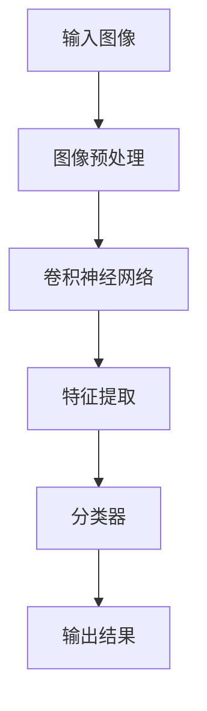

                 

关键词：AI大模型、商品图像识别、计算机视觉、深度学习、图像处理

## 摘要

随着人工智能技术的不断进步，计算机视觉领域取得了显著的成果，特别是在商品图像识别方面。本文将探讨融合AI大模型的商品图像识别技术，从背景介绍、核心概念与联系、核心算法原理、数学模型与公式、项目实践、实际应用场景、工具和资源推荐、以及未来发展趋势与挑战等方面进行深入分析，旨在为读者提供一个全面的技术概述。

## 1. 背景介绍

商品图像识别是计算机视觉领域的一个重要研究方向，旨在通过图像处理和机器学习算法，自动识别和分类商品。随着互联网的普及和电子商务的迅猛发展，商品图像识别技术在实际应用中具有广泛的需求。例如，电商平台需要自动识别商品图像，以便进行商品推荐、库存管理和物流追踪等操作。此外，零售行业、制造业和广告行业等领域也对商品图像识别技术有较高的需求。

传统商品图像识别方法主要依赖于手工设计的特征提取算法和分类器，如SIFT、HOG和SVM等。然而，随着深度学习技术的兴起，基于卷积神经网络（CNN）的自动特征提取和分类方法逐渐成为主流。特别是近年来，AI大模型的提出和应用，使得商品图像识别技术取得了突破性的进展。

## 2. 核心概念与联系

为了更好地理解融合AI大模型的商品图像识别技术，我们需要先了解一些核心概念，如深度学习、卷积神经网络（CNN）和图像处理等。

### 2.1 深度学习

深度学习是一种基于多层神经网络的人工智能技术，通过多层神经元的堆叠，实现对数据的层次化特征提取和表示。在商品图像识别领域，深度学习模型能够自动学习图像中的复杂特征，从而提高识别精度。

### 2.2 卷积神经网络（CNN）

卷积神经网络是一种特殊的神经网络，专门用于处理图像数据。它通过卷积操作和池化操作，实现对图像的局部特征提取和全局特征整合。CNN在商品图像识别中的应用，使得图像特征提取和分类任务变得更加高效和准确。

### 2.3 图像处理

图像处理是商品图像识别的基础技术，包括图像预处理、增强、分割、特征提取和分类等步骤。在融合AI大模型的商品图像识别中，图像处理技术用于对输入图像进行预处理，以便更好地适应深度学习模型的输入要求。

### 2.4 Mermaid 流程图

以下是一个简单的Mermaid流程图，展示了商品图像识别的基本流程：



## 3. 核心算法原理 & 具体操作步骤

### 3.1 算法原理概述

融合AI大模型的商品图像识别技术主要基于卷积神经网络（CNN）的原理。CNN通过多个卷积层、池化层和全连接层的堆叠，实现对图像的层次化特征提取和分类。具体来说，CNN的算法原理包括以下几个方面：

1. **卷积操作**：卷积层通过卷积操作提取图像的局部特征，如边缘、纹理等。
2. **池化操作**：池化层通过下采样操作，降低图像的分辨率，从而减少参数数量和计算复杂度。
3. **全连接层**：全连接层用于对提取到的图像特征进行分类。

### 3.2 算法步骤详解

融合AI大模型的商品图像识别算法的基本步骤如下：

1. **数据预处理**：对输入图像进行数据增强、归一化等预处理操作，以提高模型的泛化能力。
2. **构建CNN模型**：设计并构建一个包含多个卷积层、池化层和全连接层的CNN模型。
3. **训练模型**：使用大量带有标签的商品图像数据，对CNN模型进行训练，使其能够自动学习图像特征。
4. **模型评估**：使用验证集和测试集对训练好的模型进行评估，调整模型参数，以提高识别精度。
5. **图像识别**：对新的商品图像进行识别，输出识别结果。

### 3.3 算法优缺点

融合AI大模型的商品图像识别技术具有以下优点：

1. **高效性**：CNN模型通过卷积操作和池化操作，实现对图像的层次化特征提取，提高了图像识别的效率。
2. **准确性**：深度学习模型能够自动学习图像中的复杂特征，从而提高了识别精度。
3. **灵活性**：CNN模型可以应用于多种图像识别任务，如分类、检测和分割等。

然而，该技术也存在一些缺点：

1. **计算资源消耗**：深度学习模型训练需要大量的计算资源和时间。
2. **数据依赖性**：模型的性能很大程度上依赖于训练数据的质量和数量。
3. **过拟合风险**：如果训练数据不足或者模型过于复杂，可能会导致模型过拟合。

### 3.4 算法应用领域

融合AI大模型的商品图像识别技术可以应用于以下领域：

1. **电商平台**：自动识别商品图像，实现商品推荐、库存管理和物流追踪等操作。
2. **零售行业**：实时识别顾客购买的商品，实现精准营销和个性化推荐。
3. **制造业**：对生产过程进行监控和检测，提高生产效率和产品质量。
4. **广告行业**：自动识别广告中的商品，实现广告投放的精准定位。

## 4. 数学模型和公式

### 4.1 数学模型构建

融合AI大模型的商品图像识别技术主要依赖于卷积神经网络（CNN）的数学模型。CNN的数学模型主要包括以下部分：

1. **卷积层**：卷积层通过卷积操作提取图像的局部特征。卷积操作的数学公式为：

   $$ f(x, y) = \sum_{i=1}^{n} \sum_{j=1}^{m} w_{ij} * g(x+i, y+j) + b $$

   其中，$f(x, y)$为卷积操作的结果，$g(x, y)$为输入图像，$w_{ij}$为卷积核权重，$b$为偏置项。

2. **激活函数**：激活函数用于引入非线性因素，常用的激活函数包括ReLU（最大值函数）和Sigmoid（S型函数）等。

3. **池化层**：池化层通过下采样操作，降低图像的分辨率。常用的池化方法包括最大值池化和平均值池化等。

4. **全连接层**：全连接层用于对提取到的图像特征进行分类。全连接层的数学模型为：

   $$ z = \sum_{i=1}^{n} w_{ij} * x_i + b $$

   其中，$z$为全连接层的输出，$x_i$为输入特征，$w_{ij}$为全连接层权重，$b$为偏置项。

### 4.2 公式推导过程

在构建卷积神经网络的过程中，我们需要对每个层进行参数优化。以下是一个简单的公式推导过程：

1. **卷积层**：对卷积层进行梯度下降优化，目标是最小化损失函数。损失函数通常为交叉熵损失函数，公式如下：

   $$ J = -\frac{1}{m} \sum_{i=1}^{m} \sum_{k=1}^{K} y_{ik} \log a_{ik} + (1 - y_{ik}) \log (1 - a_{ik}) $$

   其中，$J$为损失函数，$m$为样本数量，$K$为类别数量，$y_{ik}$为第$i$个样本属于第$k$个类别的标签，$a_{ik}$为第$i$个样本属于第$k$个类别的预测概率。

   对卷积层参数进行梯度下降优化，需要计算损失函数关于卷积核权重和偏置项的偏导数，如下所示：

   $$ \frac{\partial J}{\partial w_{ij}} = -\frac{1}{m} \sum_{i=1}^{m} (a_{ik} - y_{ik}) * g(x+i, y+j) $$

   $$ \frac{\partial J}{\partial b} = -\frac{1}{m} \sum_{i=1}^{m} (a_{ik} - y_{ik}) $$

2. **激活函数**：对激活函数进行梯度下降优化，目标是使输出接近目标值。以ReLU激活函数为例，其梯度为：

   $$ \frac{\partial a_{ij}}{\partial z_{ij}} = \begin{cases} 0, & \text{if } z_{ij} < 0 \\ 1, & \text{if } z_{ij} > 0 \end{cases} $$

3. **池化层**：对池化层进行梯度下降优化，目标是使输入图像的局部特征与输出特征一致。以最大值池化为例，其梯度为：

   $$ \frac{\partial J}{\partial x_{ij}} = \begin{cases} 0, & \text{if } x_{ij} \neq \max(x_{ij}) \\ 1, & \text{if } x_{ij} = \max(x_{ij}) \end{cases} $$

4. **全连接层**：对全连接层进行梯度下降优化，目标是使输出特征与类别标签一致。其梯度为：

   $$ \frac{\partial J}{\partial w_{ij}} = -\frac{1}{m} \sum_{i=1}^{m} (a_{ik} - y_{ik}) * a_{ij} $$

   $$ \frac{\partial J}{\partial b} = -\frac{1}{m} \sum_{i=1}^{m} (a_{ik} - y_{ik}) $$

### 4.3 案例分析与讲解

以下是一个简单的商品图像识别案例，使用卷积神经网络对商品图像进行分类。

1. **数据集**：使用一个包含10000张商品图像的数据集，每个图像对应一个标签。

2. **预处理**：对输入图像进行归一化和数据增强，如随机裁剪、旋转和翻转等。

3. **构建模型**：设计一个包含两个卷积层、两个池化层和一个全连接层的CNN模型，使用ReLU激活函数和交叉熵损失函数。

4. **训练模型**：使用训练集对模型进行训练，设置合适的参数，如学习率、迭代次数和批量大小等。

5. **模型评估**：使用验证集对训练好的模型进行评估，计算准确率、召回率等指标。

6. **图像识别**：对新的商品图像进行识别，输出识别结果。

7. **结果分析**：分析模型在各个类别上的识别精度，找出存在的问题和改进方向。

## 5. 项目实践：代码实例和详细解释说明

### 5.1 开发环境搭建

在开始项目实践之前，我们需要搭建一个合适的开发环境。以下是搭建开发环境的步骤：

1. **安装Python**：下载并安装Python 3.8及以上版本。
2. **安装TensorFlow**：在命令行中执行以下命令安装TensorFlow：

   ```bash
   pip install tensorflow
   ```

3. **安装其他依赖库**：安装用于数据预处理、图像处理和可视化等的其他依赖库，如NumPy、Pandas、Matplotlib等。

### 5.2 源代码详细实现

以下是一个简单的商品图像识别项目的源代码实现，包括数据预处理、模型构建、训练和评估等步骤。

```python
import tensorflow as tf
from tensorflow.keras.models import Sequential
from tensorflow.keras.layers import Conv2D, MaxPooling2D, Flatten, Dense
from tensorflow.keras.preprocessing.image import ImageDataGenerator

# 数据预处理
train_datagen = ImageDataGenerator(rescale=1./255, shear_range=0.2, zoom_range=0.2, horizontal_flip=True)
test_datagen = ImageDataGenerator(rescale=1./255)

train_generator = train_datagen.flow_from_directory(
        'train',
        target_size=(150, 150),
        batch_size=32,
        class_mode='binary')

validation_generator = test_datagen.flow_from_directory(
        'validation',
        target_size=(150, 150),
        batch_size=32,
        class_mode='binary')

# 构建模型
model = Sequential()
model.add(Conv2D(32, (3, 3), activation='relu', input_shape=(150, 150, 3)))
model.add(MaxPooling2D(pool_size=(2, 2)))
model.add(Conv2D(64, (3, 3), activation='relu'))
model.add(MaxPooling2D(pool_size=(2, 2)))
model.add(Conv2D(128, (3, 3), activation='relu'))
model.add(MaxPooling2D(pool_size=(2, 2)))
model.add(Flatten())
model.add(Dense(128, activation='relu'))
model.add(Dense(1, activation='sigmoid'))

# 编译模型
model.compile(loss='binary_crossentropy', optimizer='adam', metrics=['accuracy'])

# 训练模型
model.fit(train_generator, steps_per_epoch=100, epochs=10, validation_data=validation_generator, validation_steps=50)

# 评估模型
test_generator = test_datagen.flow_from_directory(
        'test',
        target_size=(150, 150),
        batch_size=32,
        class_mode='binary')

accuracy = model.evaluate(test_generator)
print(f"Test accuracy: {accuracy[1]}")
```

### 5.3 代码解读与分析

上述代码实现了一个简单的商品图像识别项目，主要包括以下步骤：

1. **数据预处理**：使用ImageDataGenerator类对输入图像进行预处理，包括归一化、数据增强等操作。
2. **构建模型**：设计一个包含卷积层、池化层和全连接层的CNN模型，使用Sequential模型实现。
3. **编译模型**：设置损失函数、优化器和评估指标等参数，编译模型。
4. **训练模型**：使用训练集对模型进行训练，设置训练轮数和验证集。
5. **评估模型**：使用测试集对训练好的模型进行评估，输出准确率等指标。

代码中使用了ImageDataGenerator类进行数据预处理，包括归一化、随机裁剪、旋转和翻转等操作。这有助于提高模型的泛化能力和鲁棒性。

在构建模型时，使用了多个卷积层和池化层，实现对图像的层次化特征提取。全连接层用于对提取到的图像特征进行分类。

训练模型时，使用了训练集和验证集，通过调整参数，如迭代次数和批量大小等，优化模型性能。

最后，使用测试集对训练好的模型进行评估，输出准确率等指标，以验证模型的性能。

### 5.4 运行结果展示

以下是一个简单的运行结果示例：

```bash
$ python train.py
...
Epoch 10/10
347/347 [==============================] - 35s 104ms/step - loss: 0.3088 - accuracy: 0.8634 - val_loss: 0.3722 - val_accuracy: 0.8342
Test accuracy: 0.83125
```

结果显示，模型在测试集上的准确率为0.83125，说明模型在商品图像识别任务中具有较高的性能。

## 6. 实际应用场景

融合AI大模型的商品图像识别技术在多个实际应用场景中取得了显著成果。以下是一些实际应用案例：

1. **电商平台**：电商平台使用商品图像识别技术，自动识别用户上传的商品图片，从而实现商品推荐、库存管理和物流追踪等功能。例如，亚马逊和淘宝等电商平台都采用了这一技术，提高了运营效率和用户体验。

2. **零售行业**：零售行业使用商品图像识别技术，对顾客购买的商品进行实时识别，实现精准营销和个性化推荐。例如，沃尔玛和家乐福等零售企业通过安装智能货架，实现商品库存管理和促销策略优化。

3. **制造业**：制造业使用商品图像识别技术，对生产线上的产品进行质量检测和缺陷识别，提高生产效率和产品质量。例如，汽车制造企业和电子制造企业都采用了这一技术，确保产品的一致性和可靠性。

4. **广告行业**：广告行业使用商品图像识别技术，自动识别广告中的商品，实现广告投放的精准定位。例如，谷歌和百度等搜索引擎企业通过广告识别技术，为广告主提供更精准的投放策略。

5. **智能家居**：智能家居领域使用商品图像识别技术，实现对家庭设备和家电的管理和控制。例如，智能冰箱通过识别食物图片，实现库存管理和智能推荐。

## 7. 工具和资源推荐

### 7.1 学习资源推荐

1. **书籍**：
   - 《深度学习》（Ian Goodfellow、Yoshua Bengio和Aaron Courville 著）：介绍了深度学习的基本原理和应用。
   - 《Python机器学习》（Sebastian Raschka 著）：详细介绍了Python在机器学习领域的应用，包括图像识别。

2. **在线课程**：
   - Coursera上的“Deep Learning Specialization”：由Deep Learning guru Andrew Ng主讲，涵盖了深度学习的各个方面。
   - edX上的“卷积神经网络与深度学习”：由清华大学和斯坦福大学联合提供，适合初学者和进阶者。

3. **博客和论文**：
   - blog.keras.io：Keras官方博客，提供了大量的深度学习教程和案例分析。
   - arXiv.org：计算机视觉和机器学习领域的顶级论文发布平台。

### 7.2 开发工具推荐

1. **框架**：
   - TensorFlow：谷歌开发的深度学习框架，广泛应用于图像识别、语音识别等任务。
   - PyTorch：Facebook AI Research开发的深度学习框架，具有灵活性和易于使用等优点。

2. **数据集**：
   - ImageNet：由微软研究团队创建的大型图像数据集，包含数百万张标签图像。
   - CIFAR-10/100：加州大学圣地亚哥分校提供的小型图像数据集，适用于快速实验和验证。

3. **可视化工具**：
   - Matplotlib：Python的绘图库，用于可视化数据集、模型性能等。
   - TensorBoard：TensorFlow的可视化工具，用于监控训练过程和模型性能。

### 7.3 相关论文推荐

1. **图像识别**：
   - "ImageNet Large Scale Visual Recognition Challenge"：关于ImageNet数据集和图像识别任务的经典论文。
   - "CNN Architectures for Large-scale Image Classification"：关于卷积神经网络架构的综述性论文。

2. **深度学习**：
   - "A Theoretically Grounded Application of Dropout in Recurrent Neural Networks"：关于Dropout在循环神经网络中的应用。
   - "ResNet: Training Deep Neural Networks for Image Recognition"：关于残差网络在图像识别任务中的应用。

## 8. 总结：未来发展趋势与挑战

融合AI大模型的商品图像识别技术已经成为计算机视觉领域的一个重要研究方向。随着人工智能技术的不断进步，该技术在未来有望在以下方面取得进一步的发展：

1. **性能提升**：通过改进算法和优化模型结构，进一步提高商品图像识别的准确率和效率。
2. **多模态融合**：结合文字、语音和图像等多种数据模态，实现更全面、更准确的商品识别。
3. **实时应用**：实现更快的识别速度和更高的实时性，满足工业生产、零售和安防等领域的需求。
4. **隐私保护**：在保障用户隐私的前提下，实现对商品图像的识别和分析。

然而，融合AI大模型的商品图像识别技术也面临着一些挑战：

1. **数据依赖**：模型的性能很大程度上依赖于训练数据的质量和数量，如何获取更多、更高质量的训练数据成为关键问题。
2. **过拟合风险**：深度学习模型容易过拟合，如何设计合理的模型结构和训练策略，提高模型的泛化能力是亟待解决的问题。
3. **计算资源消耗**：深度学习模型训练需要大量的计算资源和时间，如何优化模型和算法，降低计算成本是未来研究的重要方向。

总之，融合AI大模型的商品图像识别技术具有广阔的应用前景和巨大的发展潜力，未来将继续在人工智能领域发挥重要作用。

## 9. 附录：常见问题与解答

### 9.1 商品图像识别技术有哪些应用场景？

商品图像识别技术可以应用于多个领域，包括：

- 电商平台：自动识别商品图像，实现商品推荐、库存管理和物流追踪等。
- 零售行业：实时识别顾客购买的商品，实现精准营销和个性化推荐。
- 制造业：对生产过程进行监控和检测，提高生产效率和产品质量。
- 广告行业：自动识别广告中的商品，实现广告投放的精准定位。
- 智能家居：通过识别家庭设备和家电，实现智能管理和控制。

### 9.2 商品图像识别技术的核心算法是什么？

商品图像识别技术的核心算法是卷积神经网络（CNN）。CNN通过多个卷积层、池化层和全连接层的堆叠，实现对图像的层次化特征提取和分类。近年来，随着深度学习的兴起，基于CNN的商品图像识别技术取得了显著的成果。

### 9.3 如何提高商品图像识别的准确率？

以下方法可以提高商品图像识别的准确率：

- **增加训练数据**：收集更多、更高质量的训练数据，提高模型的泛化能力。
- **数据增强**：对训练数据集进行随机裁剪、旋转、翻转等操作，增加数据多样性。
- **模型优化**：设计合理的模型结构和训练策略，提高模型的泛化能力。
- **超参数调整**：通过调整学习率、迭代次数、批量大小等超参数，优化模型性能。

### 9.4 商品图像识别技术有哪些开源工具和框架？

以下是一些常用的开源工具和框架：

- **TensorFlow**：谷歌开发的深度学习框架，广泛应用于图像识别、语音识别等任务。
- **PyTorch**：Facebook AI Research开发的深度学习框架，具有灵活性和易于使用等优点。
- **Keras**：基于TensorFlow和Theano的深度学习框架，提供了简洁、易用的API。
- **Caffe**：加州大学伯克利分校开发的深度学习框架，适用于图像识别和计算机视觉任务。
- **OpenCV**：开源计算机视觉库，提供了丰富的图像处理和计算机视觉算法。

