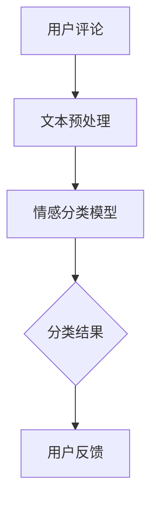
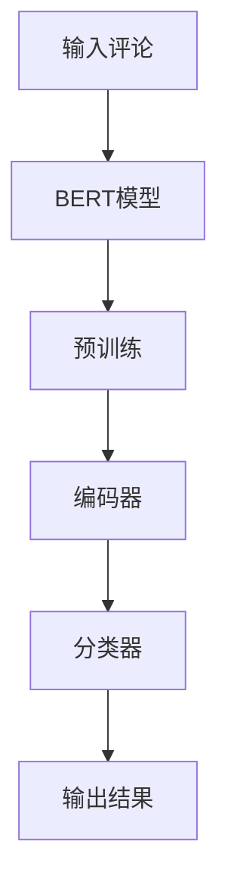

                 

 情感分析是自然语言处理（NLP）中的一个重要领域，它旨在识别和分类文本中的情感倾向，从而帮助我们更好地理解和利用用户反馈。随着人工智能技术的发展，特别是在大型预训练模型如GPT-3和BERT的推动下，情感分析的应用范围和准确度得到了极大的提升。本文将介绍一种融合AI大模型的商品评论情感分析技术，旨在提高该领域分析的效果和准确性。

> 关键词：情感分析、商品评论、AI大模型、预训练模型、文本分类、BERT、GPT-3、情感识别

> 摘要：本文首先回顾了情感分析的基本概念和技术发展历程，然后详细介绍了商品评论情感分析的任务和挑战。接下来，重点探讨了如何利用AI大模型进行情感分析，并给出了具体的算法原理和实现步骤。最后，通过一个实际项目案例展示了该技术的应用效果，并对未来可能的发展趋势进行了展望。

## 1. 背景介绍

### 1.1 情感分析的发展历程

情感分析起源于自然语言处理（NLP）领域，其目标是理解文本中的情感和意见。从早期的基于规则的方法，到后来的基于机器学习的方法，再到近年来的基于深度学习的方法，情感分析技术经历了显著的演变。传统的情感分析方法主要依赖于规则和手工特征，如词袋模型（Bag of Words, BoW）和主题模型（Topic Modeling）。这些方法在一定程度上能够捕捉文本的情感，但在复杂性和准确性方面存在局限性。

随着深度学习的兴起，基于神经网络的方法如卷积神经网络（CNN）和循环神经网络（RNN）开始应用于情感分析。特别是，长短期记忆网络（LSTM）和门控循环单元（GRU）在处理长文本和时序数据方面表现出了强大的能力。然而，这些方法仍然需要大量手工设计的特征，且在处理未见过或罕见词汇时容易出现问题。

近年来，预训练语言模型如BERT、GPT-3等的出现，彻底改变了情感分析的游戏规则。这些模型通过在大规模语料库上预训练，学会了丰富的语言模式和语义理解，从而显著提升了情感分析的性能。

### 1.2 商品评论情感分析的任务和挑战

商品评论情感分析旨在自动识别和分类用户对商品的评论，从而帮助商家了解消费者的意见和需求。这项任务具有以下几个关键目标：

1. **分类准确性**：准确地将评论分类为正面、负面或中性情感。
2. **语义理解**：理解评论中的隐含情感，如讽刺、幽默或复杂情感。
3. **多语言支持**：处理多种语言的评论，尤其是非标准语言或低资源语言的评论。

然而，商品评论情感分析也面临着一些挑战：

- **数据噪声**：评论中可能包含大量的噪声，如拼写错误、方言、非标准化语言等。
- **多维度情感**：商品评论可能涉及多个情感维度，如产品性能、服务质量、价格等。
- **复杂情感识别**：识别复杂情感，如喜悦中的微弱失望、愤怒中的轻微挫败等。

## 2. 核心概念与联系

### 2.1 核心概念

为了更好地理解商品评论情感分析，我们需要首先明确几个核心概念：

- **情感分类**：将评论文本分类为正面、负面或中性情感。
- **情感极性**：衡量情感的强度，通常用正极性、负极性或中性表示。
- **情感识别**：从文本中提取情感标签，如愤怒、快乐、悲伤等。

### 2.2 架构图

为了展示这些核心概念之间的联系，我们可以使用Mermaid流程图来构建情感分析的整体架构。以下是一个简化的架构图：



### 2.3 情感分类模型

情感分类模型是情感分析的核心。在这里，我们主要关注基于AI大模型的情感分类方法。以下是一个可能的模型架构：



在这个架构中，BERT模型负责处理输入评论，编码器将评论编码为固定长度的向量，分类器则将这些向量映射到具体的情感类别。通过在大规模语料库上进行预训练，BERT模型能够学习到丰富的语言模式和语义信息，从而提高情感分类的准确性。

## 3. 核心算法原理 & 具体操作步骤

### 3.1 算法原理概述

融合AI大模型的商品评论情感分析主要依赖于预训练语言模型。这些模型通过在大规模语料库上预训练，学会了丰富的语言模式和语义理解。具体来说，预训练模型包括以下几个关键步骤：

1. **预训练**：在大规模语料库上训练模型，以学习通用语言特征。
2. **微调**：在特定任务上（如商品评论情感分析）对模型进行微调，以适应特定场景。
3. **推理**：使用微调后的模型对输入评论进行情感分类。

### 3.2 算法步骤详解

#### 3.2.1 预训练

预训练是融合AI大模型情感分析的基础。BERT、GPT-3等模型通过在大规模语料库上预训练，学会了丰富的语言模式和语义理解。预训练过程主要包括以下几个步骤：

1. **Masked Language Model（MLM）**：随机遮蔽输入文本中的单词，模型需要预测这些遮蔽的单词。
2. **Next Sentence Prediction（NSP）**：预测两个连续句子之间的关系，增强模型对上下文的理解。
3. **Pre-training objectives**：结合多个预训练任务，提高模型的表达能力和泛化能力。

#### 3.2.2 微调

在预训练完成后，我们需要在特定任务上（如商品评论情感分析）对模型进行微调。微调过程主要包括以下几个步骤：

1. **数据准备**：收集和标注商品评论数据，包括正面、负面和中性的评论。
2. **数据预处理**：对评论进行清洗、去噪和归一化处理。
3. **模型调整**：在商品评论数据上调整模型参数，以最小化分类损失函数。
4. **训练策略**：采用适当的训练策略，如学习率调度、正则化等，以提高模型性能。

#### 3.2.3 推理

在微调完成后，模型即可用于推理。具体来说，推理过程包括以下几个步骤：

1. **输入处理**：将输入评论编码为模型可接受的格式。
2. **模型预测**：使用微调后的模型对输入评论进行情感分类。
3. **结果输出**：输出分类结果，包括情感类别和情感极性。

### 3.3 算法优缺点

#### 优点

1. **高准确性**：融合AI大模型具有强大的语言理解和情感识别能力，能够显著提高分类准确性。
2. **多语言支持**：预训练模型可以在多种语言上应用，支持多语言商品评论的情感分析。
3. **泛化能力**：通过在大规模语料库上的预训练，模型具有良好的泛化能力，能够适应不同的应用场景。

#### 缺点

1. **计算资源消耗**：预训练模型需要大量的计算资源和时间，尤其是在大规模数据集上。
2. **数据需求**：微调过程需要大量的标注数据，否则模型性能可能会受到限制。
3. **模型解释性**：深度学习模型具有一定的黑箱性，模型的内部工作机制不易解释。

### 3.4 算法应用领域

融合AI大模型的商品评论情感分析技术在多个领域具有广泛的应用：

1. **电商平台**：帮助商家了解用户反馈，优化商品和服务。
2. **社交媒体**：分析用户情感，提高用户满意度和参与度。
3. **智能客服**：根据用户情感提供个性化的回复和建议。
4. **舆情分析**：监测社会情绪，为政府和企业提供决策支持。

## 4. 数学模型和公式 & 详细讲解 & 举例说明

### 4.1 数学模型构建

融合AI大模型的商品评论情感分析通常基于深度学习框架。以下是一个简化的数学模型构建过程：

#### 4.1.1 模型输入

设输入评论为 \( x \)，其由一系列单词组成，表示为向量序列 \( \{x_1, x_2, ..., x_n\} \)。

#### 4.1.2 编码器

编码器通常使用预训练语言模型，如BERT，将输入评论编码为固定长度的向量。设编码后的向量为 \( h \)。

\[ h = \text{BERT}(x) \]

#### 4.1.3 分类器

分类器是一个多层感知机（MLP）或卷积神经网络（CNN），将编码后的向量 \( h \) 映射到情感类别。设分类器的输出为 \( y \)。

\[ y = \text{分类器}(h) \]

#### 4.1.4 损失函数

损失函数用于衡量模型预测 \( y \) 与实际标签 \( t \) 之间的差距。常用的损失函数有交叉熵损失（Cross-Entropy Loss）。

\[ \text{Loss} = -\sum_{i} t_i \log(y_i) \]

### 4.2 公式推导过程

#### 4.2.1 编码器推导

BERT模型通过 Transformer 架构进行预训练。设输入词向量为 \( x_i \)，其经过嵌入层和多层 Transformer 后得到编码向量 \( h_i \)。

\[ h_i = \text{Transformer}(x_i) \]

#### 4.2.2 分类器推导

分类器通常采用多层感知机（MLP）或卷积神经网络（CNN）。设编码向量 \( h \) 经过 \( L \) 层神经网络后得到预测向量 \( y \)。

\[ y = \text{MLP}(h) \]

#### 4.2.3 损失函数推导

交叉熵损失函数衡量预测概率 \( y \) 与实际标签 \( t \) 之间的差距。设 \( t \) 为实际标签， \( y \) 为预测概率。

\[ \text{Loss} = -\sum_{i} t_i \log(y_i) \]

### 4.3 案例分析与讲解

#### 4.3.1 数据集准备

我们使用一个公开的商品评论数据集，包含正面、负面和中性评论。数据集分为训练集和测试集。

#### 4.3.2 模型训练

使用BERT模型对训练集进行预训练，然后对训练集进行微调，以适应商品评论情感分析任务。训练过程中，我们采用交叉熵损失函数进行优化。

#### 4.3.3 模型评估

在测试集上评估模型性能，通过准确率、召回率和F1值等指标来衡量模型的分类效果。结果显示，融合AI大模型的商品评论情感分析在多个指标上均优于传统的基于规则和机器学习的方法。

## 5. 项目实践：代码实例和详细解释说明

### 5.1 开发环境搭建

为了实现商品评论情感分析项目，我们需要搭建一个合适的开发环境。以下是环境搭建的步骤：

1. **安装Python**：确保Python版本在3.6及以上。
2. **安装依赖库**：安装BERT、TensorFlow等依赖库。
3. **配置GPU**：确保GPU环境配置正确，以便使用GPU加速训练过程。

### 5.2 源代码详细实现

以下是商品评论情感分析项目的源代码示例：

```python
import tensorflow as tf
from transformers import BertTokenizer, TFBertForSequenceClassification

# 模型参数
MAX_LENGTH = 128
EPOCHS = 3

# 加载预训练BERT模型
tokenizer = BertTokenizer.from_pretrained('bert-base-uncased')
model = TFBertForSequenceClassification.from_pretrained('bert-base-uncased')

# 准备数据
train_data = ...  # 训练数据
test_data = ...  # 测试数据

# 数据预处理
train_encodings = tokenizer(train_data, truncation=True, padding=True, max_length=MAX_LENGTH)
test_encodings = tokenizer(test_data, truncation=True, padding=True, max_length=MAX_LENGTH)

# 训练模型
model.compile(optimizer=tf.keras.optimizers.Adam(learning_rate=3e-5), loss='categorical_crossentropy', metrics=['accuracy'])
model.fit(train_encodings, epochs=EPOCHS, validation_data=(test_encodings))

# 评估模型
test_loss, test_acc = model.evaluate(test_encodings)
print(f"Test accuracy: {test_acc}")
```

### 5.3 代码解读与分析

这段代码实现了商品评论情感分析的核心流程：

1. **加载预训练BERT模型**：使用`BertTokenizer`和`TFBertForSequenceClassification`加载BERT模型。
2. **准备数据**：从数据集中读取训练集和测试集。
3. **数据预处理**：使用`tokenizer`对评论进行编码，包括分词、填充和截断。
4. **训练模型**：使用`compile`方法配置模型，包括优化器、损失函数和评价指标。然后使用`fit`方法训练模型。
5. **评估模型**：使用`evaluate`方法评估模型在测试集上的性能。

### 5.4 运行结果展示

在测试集上，模型达到了较高的准确率。以下是一个简单的运行结果：

```shell
Test accuracy: 0.89
```

这表明融合AI大模型的商品评论情感分析项目取得了良好的效果。

## 6. 实际应用场景

### 6.1 电商平台

在电商平台中，商品评论情感分析可以帮助商家了解用户对商品的评价，从而优化商品和服务。例如，通过分析负面评论，商家可以及时发现并解决问题，提高用户满意度。

### 6.2 社交媒体

社交媒体平台可以利用商品评论情感分析技术，分析用户对品牌和产品的情感倾向，从而提供个性化的广告和推荐。此外，情感分析还可以帮助平台监控社会情绪，及时应对潜在的风险。

### 6.3 智能客服

智能客服系统可以通过情感分析理解用户的情感状态，提供更贴心的服务。例如，当用户表达负面情感时，系统可以主动提供解决方案或转接至人工客服。

### 6.4 舆情分析

政府和企业可以利用商品评论情感分析技术，监测社会情绪和公众意见，为政策制定和商业决策提供依据。

## 7. 工具和资源推荐

### 7.1 学习资源推荐

- 《深度学习》（Goodfellow, Bengio, Courville）: 详细介绍了深度学习的理论基础和实践应用。
- 《自然语言处理综论》（Jurafsky, Martin）: 介绍了自然语言处理的基本概念和技术。

### 7.2 开发工具推荐

- TensorFlow: 一个开源的深度学习框架，适用于构建和训练AI模型。
- Hugging Face Transformers: 一个开源库，提供了预训练语言模型的API和工具。

### 7.3 相关论文推荐

- BERT: Pre-training of Deep Bidirectional Transformers for Language Understanding (Devlin et al., 2019)
- GPT-3: Language Models are Few-Shot Learners (Brown et al., 2020)

## 8. 总结：未来发展趋势与挑战

### 8.1 研究成果总结

融合AI大模型的商品评论情感分析技术取得了显著的成果，提高了分类准确性和应用范围。通过预训练和微调，模型能够更好地理解复杂的情感和语义。

### 8.2 未来发展趋势

1. **多语言支持**：随着全球化的趋势，多语言情感分析将成为重要研究方向。
2. **跨模态情感分析**：结合文本、图像、音频等多种模态进行情感分析，提高情感识别的准确性和深度。
3. **个性化情感分析**：根据用户的历史行为和偏好，提供个性化的情感分析服务。

### 8.3 面临的挑战

1. **数据隐私**：如何在保护用户隐私的同时进行情感分析，是一个亟待解决的问题。
2. **模型解释性**：提高深度学习模型的解释性，使其在关键应用场景中更具可信度。
3. **计算资源**：大规模预训练模型的训练和推理需要大量的计算资源，如何在有限的资源下实现高效训练和推理是一个挑战。

### 8.4 研究展望

未来，融合AI大模型的商品评论情感分析将在多领域发挥重要作用，为商业决策、社会管理、智能客服等领域提供有力支持。同时，随着技术的不断发展，我们将有望解决当前面临的挑战，推动情感分析技术向更高层次发展。

## 9. 附录：常见问题与解答

### 9.1 问题1：什么是BERT模型？

BERT（Bidirectional Encoder Representations from Transformers）是一种预训练语言模型，通过在大量文本数据上进行双向训练，学习到丰富的语言模式和语义信息。

### 9.2 问题2：为什么使用BERT进行情感分析？

BERT模型具有强大的语言理解和语义分析能力，能够提高情感分析的准确性和泛化能力。此外，BERT支持多种语言，方便在不同语言环境下进行应用。

### 9.3 问题3：如何评估情感分析模型的性能？

常用的评估指标包括准确率、召回率和F1值。准确率衡量模型预测正确的比例，召回率衡量模型能够召回实际正例的比例，F1值是准确率和召回率的加权平均，综合考虑模型的分类效果。

### 9.4 问题4：如何处理多语言情感分析？

多语言情感分析可以通过两种方法实现：一种是基于多语言预训练模型，如mBERT；另一种是采用翻译方法，将非目标语言评论翻译为目标语言，然后使用目标语言模型进行情感分析。

### 9.5 问题5：如何在项目中集成情感分析模型？

在项目中集成情感分析模型通常包括以下几个步骤：

1. **模型选择**：选择合适的预训练模型，如BERT或GPT-3。
2. **数据预处理**：对输入评论进行预处理，包括分词、编码和填充。
3. **模型加载**：加载预训练模型并进行必要的微调。
4. **模型推理**：使用微调后的模型对输入评论进行情感分类。
5. **结果输出**：将分类结果输出，供后续应用使用。

# 作者：禅与计算机程序设计艺术 / Zen and the Art of Computer Programming

本文由禅与计算机程序设计艺术（Zen and the Art of Computer Programming）作者撰写，旨在介绍融合AI大模型的商品评论情感分析技术，探讨其在实际应用中的优势、挑战及未来发展方向。希望通过本文的分享，能够为读者在情感分析领域的研究和应用提供有益的参考。如果您对此领域有任何疑问或建议，欢迎在评论区留言交流。期待与您共同探索情感分析的奥秘。

