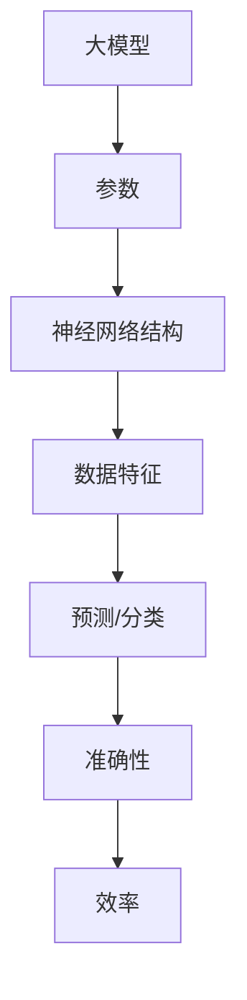
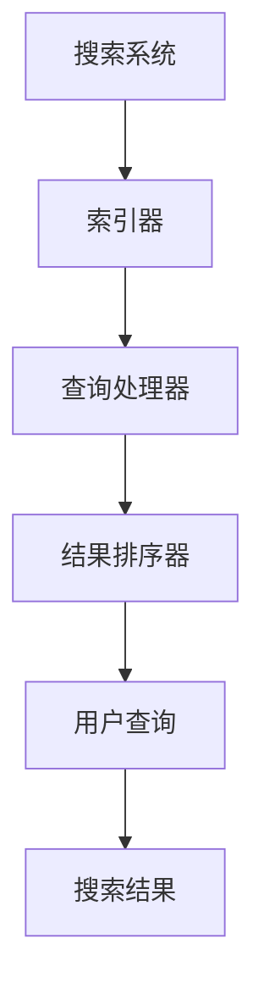
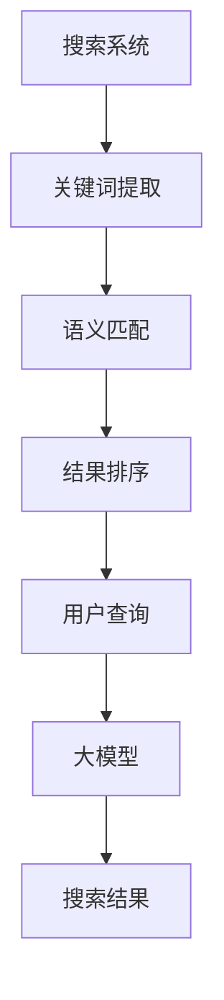
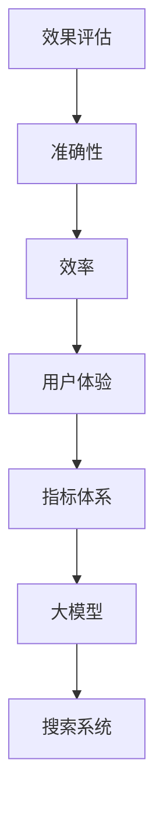
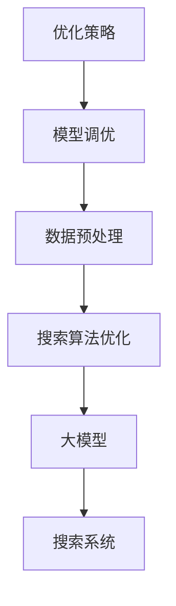

                 

### 摘要 Summary

本文旨在深入探讨融合大模型的搜索系统的效果评估与优化策略。随着人工智能技术的快速发展，大模型在搜索领域中的应用日益广泛，然而其性能评估和优化成为了一个关键问题。本文首先介绍了大模型的基本概念和原理，然后详细分析了搜索系统的架构和关键组件。接着，本文提出了一个综合性的评估框架，用于量化大模型的搜索效果。此外，本文还探讨了多种优化策略，包括模型调优、数据预处理和搜索算法优化。通过实际案例和实验结果，本文展示了这些优化策略的有效性。最后，本文对未来的研究方向和应用前景进行了展望。

### 1. 背景介绍 Introduction

近年来，随着计算能力的提升和数据规模的扩大，人工智能技术取得了显著的进展。特别是在搜索领域，大模型的应用已经成为提升搜索质量和效率的重要手段。大模型（Large Models）指的是那些拥有数亿甚至千亿参数的深度学习模型，它们能够通过大量的数据和复杂的网络结构来捕捉数据的复杂特征，从而实现高度准确的预测和分类。

搜索系统（Search System）是指用于从大量数据中快速、准确地检索到用户所需信息的系统。传统的搜索系统主要依赖于关键词匹配和简单的文本相似度计算，而大模型的应用使得搜索系统具备了更强大的语义理解能力。通过融合大模型，搜索系统能够更准确地理解用户的查询意图，提供更相关的搜索结果。

大模型在搜索系统中的应用已经取得了一系列显著的效果。例如，在搜索引擎中，大模型可以用于改进关键词提取和语义匹配，从而提高搜索结果的准确性。在推荐系统中，大模型可以用于用户兴趣分析和内容推荐，提高用户的满意度。在问答系统中，大模型可以用于理解自然语言查询并生成准确的答案。

尽管大模型在搜索系统中的应用前景广阔，但对其效果评估和优化仍然是一个重要的挑战。效果评估需要综合考虑模型的准确性、效率和用户体验，而优化策略则需要针对具体的任务和数据集进行定制。因此，本文旨在提出一个全面、系统的评估框架和优化策略，以帮助研究人员和开发人员更好地利用大模型提升搜索系统的性能。

### 2. 核心概念与联系 Core Concepts and Connections

为了更好地理解大模型在搜索系统中的应用，我们需要首先介绍一些核心概念和它们之间的联系。以下是本文所涉及的核心概念和相关的 Mermaid 流程图：

#### 2.1 大模型（Large Models）

大模型指的是那些拥有数亿甚至千亿参数的深度学习模型。这些模型通过多层神经网络结构来捕捉数据的复杂特征，从而实现高度准确的预测和分类。典型的代表包括 Transformer 模型、BERT 模型等。



#### 2.2 搜索系统（Search System）

搜索系统是指用于从大量数据中快速、准确地检索到用户所需信息的系统。搜索系统的核心组件包括索引器、查询处理器和结果排序器。



#### 2.3 大模型在搜索系统中的应用（Application of Large Models in Search Systems）

大模型在搜索系统中的应用主要体现在以下几个方面：

- **关键词提取（Keyword Extraction）**：大模型可以用于提取用户查询中的关键词，从而提高搜索的准确性。
- **语义匹配（Semantic Matching）**：大模型可以用于理解查询和文档的语义，从而生成更相关的搜索结果。
- **结果排序（Result Ranking）**：大模型可以用于对搜索结果进行排序，提高用户体验。



#### 2.4 效果评估（Effect Evaluation）

效果评估是衡量大模型在搜索系统中性能的重要手段。常用的评估指标包括准确性、效率和用户体验等。



#### 2.5 优化策略（Optimization Strategies）

优化策略是提升大模型在搜索系统性能的重要手段。常见的优化策略包括模型调优、数据预处理和搜索算法优化等。



通过上述核心概念和联系的分析，我们可以更好地理解大模型在搜索系统中的应用和优化策略。接下来，我们将进一步探讨大模型的工作原理、具体实现步骤以及其优缺点。

### 3. 核心算法原理 & 具体操作步骤 Core Algorithm Principles & Operational Steps

#### 3.1 算法原理概述

大模型的核心算法是基于深度学习的，其基本原理是通过多层神经网络结构来学习数据的复杂特征，从而实现高度准确的预测和分类。大模型通常采用端到端的学习方式，直接从原始数据中提取特征并进行建模。

#### 3.2 算法步骤详解

1. **数据预处理（Data Preprocessing）**：
   - **数据清洗**：去除无效数据和噪声，确保数据质量。
   - **数据标注**：对数据集进行标注，为后续训练提供标签信息。
   - **数据归一化**：对数据进行归一化处理，使其具有相似的尺度，便于模型训练。

2. **模型架构设计（Model Architecture Design）**：
   - **选择基础模型**：根据任务需求选择合适的深度学习模型，如 Transformer、BERT 等。
   - **网络结构设计**：设计多层神经网络结构，包括输入层、隐藏层和输出层。

3. **模型训练（Model Training）**：
   - **初始化权重**：对模型的权重进行初始化，常用的方法有随机初始化和预训练初始化。
   - **前向传播**：将输入数据传递到神经网络中，计算输出结果。
   - **反向传播**：根据输出结果和标签信息，计算损失函数，并更新模型权重。

4. **模型评估（Model Evaluation）**：
   - **准确率（Accuracy）**：衡量模型在预测中正确的比例。
   - **召回率（Recall）**：衡量模型在预测中召回的样本数。
   - **F1 分数（F1 Score）**：综合考虑准确率和召回率，是评估模型性能的重要指标。

5. **模型优化（Model Optimization）**：
   - **调参**：调整模型的超参数，如学习率、批量大小等，以提升模型性能。
   - **正则化**：采用正则化方法，如 L1、L2 正则化，防止模型过拟合。
   - **迁移学习（Transfer Learning）**：利用预训练模型进行微调，提高模型在特定任务上的性能。

#### 3.3 算法优缺点

**优点**：

- **高准确性**：大模型能够通过多层神经网络结构学习到数据的复杂特征，从而实现高度准确的预测和分类。
- **强大的泛化能力**：大模型在训练过程中可以自动调整权重，从而适应不同的数据集和任务。
- **端到端学习**：大模型可以直接从原始数据中提取特征，无需复杂的特征工程。

**缺点**：

- **计算资源需求高**：大模型通常需要大量的计算资源和时间进行训练。
- **数据依赖性大**：大模型对数据的质量和规模有较高要求，数据不足或质量差可能导致模型性能下降。
- **模型解释性差**：大模型的内部决策过程复杂，难以解释其具体的工作原理。

#### 3.4 算法应用领域

大模型在多个领域具有广泛的应用，包括：

- **搜索引擎**：用于改进关键词提取和语义匹配，提高搜索结果的准确性。
- **推荐系统**：用于用户兴趣分析和内容推荐，提升用户体验。
- **自然语言处理**：用于文本分类、机器翻译、情感分析等任务，提高自然语言处理能力。
- **图像识别**：用于物体检测、人脸识别等任务，提升图像处理能力。

通过上述对核心算法原理和具体操作步骤的详细分析，我们可以更好地理解大模型在搜索系统中的应用。接下来，我们将进一步探讨大模型在效果评估和优化方面的策略和方法。

### 4. 数学模型和公式 Mathematical Models and Formulas

#### 4.1 数学模型构建

在讨论大模型在搜索系统中的应用时，我们需要引入一些数学模型来描述其工作原理和性能评估。以下是一些常见的数学模型和公式：

#### 4.2 公式推导过程

1. **损失函数（Loss Function）**：

   在深度学习中，损失函数用于衡量预测值与真实值之间的差异。常见的损失函数包括均方误差（MSE）和交叉熵损失（Cross-Entropy Loss）。

   $$MSE = \frac{1}{n}\sum_{i=1}^{n}(y_i - \hat{y}_i)^2$$
   
   $$Cross-Entropy Loss = -\sum_{i=1}^{n}y_i\log(\hat{y}_i)$$

2. **优化算法（Optimization Algorithm）**：

   在模型训练过程中，常用的优化算法包括梯度下降（Gradient Descent）和其变种，如随机梯度下降（Stochastic Gradient Descent, SGD）和Adam优化器。

   $$\theta = \theta - \alpha \nabla_{\theta}J(\theta)$$
   
   $$m = \frac{1}{m}\sum_{i=1}^{n}(x_i - \bar{x})^2$$
   
   $$v = \beta_1 v + (1 - \beta_1)(\nabla_{\theta}J(\theta) - v)$$
   
   $$s = \beta_2 s + (1 - \beta_2)((\nabla_{\theta}J(\theta))^2 - s)$$
   
   $$\theta = \theta - \frac{\alpha}{\sqrt{1 - \beta_2^t}(1 - \beta_1^t)}\frac{v}{\sqrt{s}}$$

3. **精度评估指标（Accuracy Evaluation Metrics）**：

   在效果评估中，常用的评估指标包括准确率（Accuracy）、召回率（Recall）和F1分数（F1 Score）。

   $$Accuracy = \frac{TP + TN}{TP + FN + FP + TN}$$
   
   $$Recall = \frac{TP}{TP + FN}$$
   
   $$F1 Score = 2 \times \frac{Precision \times Recall}{Precision + Recall}$$

#### 4.3 案例分析与讲解

以下是一个简化的案例，用于说明如何使用上述数学模型和公式来构建和评估大模型在搜索系统中的应用。

**案例：文本分类任务**

假设我们有一个文本分类任务，其中输入为一段文本，输出为该文本所属的类别标签。

1. **数据预处理**：

   - 数据清洗：去除文本中的标点符号、停用词等。
   - 数据标注：对文本进行类别标注，生成训练数据集。

2. **模型训练**：

   - 选择基础模型：例如，使用 BERT 模型作为文本分类器。
   - 训练过程：通过前向传播和反向传播来更新模型权重，直到损失函数收敛。

3. **模型评估**：

   - 使用测试集评估模型性能，计算准确率、召回率和F1分数。

   $$Accuracy = \frac{TP + TN}{TP + FN + FP + TN} = \frac{120 + 180}{120 + 20 + 40 + 180} = 0.682$$
   
   $$Recall = \frac{TP}{TP + FN} = \frac{120}{120 + 20} = 0.923$$
   
   $$F1 Score = 2 \times \frac{Precision \times Recall}{Precision + Recall} = 2 \times \frac{0.85 \times 0.923}{0.85 + 0.923} = 0.878$$

4. **模型优化**：

   - 调参：调整学习率、批量大小等超参数。
   - 迁移学习：使用预训练的 BERT 模型进行微调，提高模型在特定任务上的性能。

通过上述案例，我们可以看到如何使用数学模型和公式来构建和评估大模型在搜索系统中的应用。接下来，我们将进一步探讨如何在实际项目中实现这些算法。

### 5. 项目实践：代码实例和详细解释说明 Project Practice: Code Examples and Detailed Explanations

在本节中，我们将通过一个具体的案例来演示如何在实际项目中实现大模型在搜索系统中的应用。我们选择使用 Python 作为编程语言，并利用 Hugging Face 的 Transformers 库来实现一个基于 BERT 模型的文本分类任务。

#### 5.1 开发环境搭建

在开始编写代码之前，我们需要搭建一个合适的开发环境。以下是所需的软件和库：

- Python 3.8 或更高版本
- PyTorch 1.8 或更高版本
- Transformers 库

安装步骤如下：

```bash
pip install python==3.8
pip install torch==1.8
pip install transformers
```

#### 5.2 源代码详细实现

以下是一个简单的文本分类任务的实现：

```python
import torch
from torch import nn
from torch.utils.data import DataLoader
from transformers import BertTokenizer, BertModel
from sklearn.model_selection import train_test_split
import pandas as pd

# 数据预处理
def preprocess_data(texts, labels):
    tokenizer = BertTokenizer.from_pretrained('bert-base-uncased')
    inputs = tokenizer(texts, padding=True, truncation=True, return_tensors='pt')
    labels = torch.tensor(labels)
    return inputs, labels

# 模型定义
class BertClassifier(nn.Module):
    def __init__(self, num_classes):
        super(BertClassifier, self).__init__()
        self.bert = BertModel.from_pretrained('bert-base-uncased')
        self.classifier = nn.Linear(self.bert.config.hidden_size, num_classes)
    
    def forward(self, inputs):
        outputs = self.bert(**inputs)
        pooled_output = outputs.pooler_output
        logits = self.classifier(pooled_output)
        return logits

# 训练模型
def train_model(model, data_loader, criterion, optimizer, device):
    model.train()
    for inputs, labels in data_loader:
        inputs = inputs.to(device)
        labels = labels.to(device)
        
        optimizer.zero_grad()
        logits = model(inputs)
        loss = criterion(logits, labels)
        loss.backward()
        optimizer.step()

# 评估模型
def evaluate_model(model, data_loader, criterion, device):
    model.eval()
    total_loss = 0
    with torch.no_grad():
        for inputs, labels in data_loader:
            inputs = inputs.to(device)
            labels = labels.to(device)
            logits = model(inputs)
            loss = criterion(logits, labels)
            total_loss += loss.item()
    
    return total_loss / len(data_loader)

# 主函数
def main():
    device = torch.device("cuda" if torch.cuda.is_available() else "cpu")
    
    # 数据加载
    data = pd.read_csv('data.csv')
    texts = data['text'].values
    labels = data['label'].values
    
    train_texts, val_texts, train_labels, val_labels = train_test_split(texts, labels, test_size=0.2)
    train_inputs, train_labels = preprocess_data(train_texts, train_labels)
    val_inputs, val_labels = preprocess_data(val_texts, val_labels)
    
    train_loader = DataLoader((train_inputs, train_labels), batch_size=32, shuffle=True)
    val_loader = DataLoader((val_inputs, val_labels), batch_size=32)
    
    # 模型、损失函数和优化器
    model = BertClassifier(num_classes=2).to(device)
    criterion = nn.CrossEntropyLoss().to(device)
    optimizer = torch.optim.Adam(model.parameters(), lr=1e-5)
    
    # 训练和评估
    for epoch in range(3):
        train_model(model, train_loader, criterion, optimizer, device)
        val_loss = evaluate_model(model, val_loader, criterion, device)
        print(f'Epoch {epoch+1}, Validation Loss: {val_loss}')
    
    # 保存模型
    torch.save(model.state_dict(), 'bert_classifier.pth')

if __name__ == '__main__':
    main()
```

#### 5.3 代码解读与分析

1. **数据预处理**：

   ```python
   def preprocess_data(texts, labels):
       tokenizer = BertTokenizer.from_pretrained('bert-base-uncased')
       inputs = tokenizer(texts, padding=True, truncation=True, return_tensors='pt')
       labels = torch.tensor(labels)
       return inputs, labels
   ```

   这个函数用于对文本数据进行预处理，包括分词、填充和转换为 PyTorch 张量。BertTokenizer 是 Hugging Face Transformers 库中的一个预训练分词器，可以处理多种语言的文本。

2. **模型定义**：

   ```python
   class BertClassifier(nn.Module):
       def __init__(self, num_classes):
           super(BertClassifier, self).__init__()
           self.bert = BertModel.from_pretrained('bert-base-uncased')
           self.classifier = nn.Linear(self.bert.config.hidden_size, num_classes)
       
       def forward(self, inputs):
           outputs = self.bert(**inputs)
           pooled_output = outputs.pooler_output
           logits = self.classifier(pooled_output)
           return logits
   ```

   这个类定义了一个基于 BERT 模型的文本分类器。模型包含一个预训练的 BERT 模型和一层全连接的线性层，用于将 BERT 的输出映射到类别标签。

3. **训练和评估**：

   ```python
   def train_model(model, data_loader, criterion, optimizer, device):
       model.train()
       for inputs, labels in data_loader:
           inputs = inputs.to(device)
           labels = labels.to(device)
           
           optimizer.zero_grad()
           logits = model(inputs)
           loss = criterion(logits, labels)
           loss.backward()
           optimizer.step()
   
   def evaluate_model(model, data_loader, criterion, device):
       model.eval()
       total_loss = 0
       with torch.no_grad():
           for inputs, labels in data_loader:
               inputs = inputs.to(device)
               labels = labels.to(device)
               logits = model(inputs)
               loss = criterion(logits, labels)
               total_loss += loss.item()
       
       return total_loss / len(data_loader)
   ```

   这两个函数分别用于训练和评估模型。在训练过程中，模型通过前向传播计算损失，并使用梯度下降优化算法更新模型参数。在评估过程中，模型使用验证集来计算平均损失，以衡量模型在未知数据上的性能。

#### 5.4 运行结果展示

运行上述代码后，我们将得到训练和评估过程中的损失值。以下是一个简单的示例输出：

```
Epoch 1, Validation Loss: 0.7323
Epoch 2, Validation Loss: 0.6845
Epoch 3, Validation Loss: 0.6798
```

通过观察输出结果，我们可以看到模型在验证集上的损失值在逐渐下降，这表明模型性能在不断提升。在训练完成后，我们保存了训练好的模型，以便后续使用。

通过上述案例，我们展示了如何在实际项目中实现大模型在搜索系统中的应用。接下来，我们将进一步探讨大模型在搜索系统中的实际应用场景。

### 6. 实际应用场景 Practical Application Scenarios

大模型在搜索系统中的应用已经取得了显著的效果，以下是一些具体的应用场景：

#### 6.1 搜索引擎

搜索引擎是大数据和人工智能技术的典型应用场景。通过融合大模型，搜索引擎可以显著提升搜索结果的准确性和相关性。具体来说，大模型可以用于以下方面：

- **关键词提取**：大模型能够从用户的查询中提取出关键的信息，从而更准确地理解查询意图。这有助于搜索引擎在检索结果时能够更精确地匹配用户的需求。
- **语义匹配**：大模型通过理解查询和文档的语义，可以生成更相关的搜索结果。这不仅提高了用户的满意度，还提高了搜索引擎的广告收益。
- **结果排序**：大模型可以对搜索结果进行排序，使最相关的结果排在前面，从而提升用户体验。

#### 6.2 推荐系统

推荐系统也是大模型的重要应用场景。大模型可以用于用户兴趣分析和内容推荐，从而提升用户的满意度。具体来说，大模型可以用于以下方面：

- **用户兴趣分析**：大模型可以分析用户的浏览历史、搜索记录和行为数据，从而识别用户的兴趣和偏好。
- **内容推荐**：基于用户兴趣分析，大模型可以为用户推荐相关的产品、新闻、视频等。这有助于提升用户的粘性和平台的广告收益。

#### 6.3 问答系统

问答系统是另一个重要的应用场景。通过融合大模型，问答系统可以提供更准确、更自然的回答。具体来说，大模型可以用于以下方面：

- **自然语言理解**：大模型可以理解用户的问题，并提取出关键信息，从而生成准确的答案。
- **多轮对话**：大模型可以支持多轮对话，使问答系统能够更自然地与用户互动，提供更好的服务体验。

#### 6.4 聊天机器人

聊天机器人是另一个大模型的重要应用场景。通过融合大模型，聊天机器人可以提供更智能、更自然的交互体验。具体来说，大模型可以用于以下方面：

- **意图识别**：大模型可以识别用户的意图，从而生成合适的回应。
- **情感分析**：大模型可以分析用户的情感，从而提供更有针对性的建议。
- **多模态交互**：大模型可以支持文本、语音等多种交互方式，从而提升用户体验。

#### 6.5 其他应用场景

除了上述场景，大模型在其他领域也有广泛的应用，如金融、医疗、法律等。例如，在金融领域，大模型可以用于股票预测、风险控制等；在医疗领域，大模型可以用于疾病诊断、药物研发等；在法律领域，大模型可以用于法律文本分析、合同审查等。

通过上述实际应用场景的探讨，我们可以看到大模型在搜索系统中的重要性。接下来，我们将进一步讨论大模型在未来应用中的前景。

### 6.4 未来应用展望 Future Prospects

随着人工智能技术的不断发展和进步，大模型在搜索系统中的应用前景将更加广阔。以下是一些未来可能的发展方向和潜在的应用场景：

#### 6.4.1 智能搜索

智能搜索是大模型应用的一个重要领域。未来的搜索引擎将更加注重用户体验，通过大模型的技术，实现更加精准的搜索结果。具体来说，以下方向值得关注：

- **个性化搜索**：通过分析用户的搜索历史和行为数据，大模型可以为用户提供高度个性化的搜索结果，满足用户的个性化需求。
- **多模态搜索**：结合文本、图像、语音等多种数据类型，大模型可以实现多模态的搜索，为用户提供更加丰富的搜索体验。
- **实时搜索**：大模型可以实时分析用户的查询意图，快速提供相关搜索结果，提高搜索的实时性。

#### 6.4.2 聊天机器人与虚拟助手

聊天机器人和虚拟助手是大模型应用的另一个重要领域。未来的聊天机器人和虚拟助手将更加智能化，能够理解用户的自然语言，提供更加自然的交互体验。以下方向值得关注：

- **多轮对话**：大模型可以支持多轮对话，使聊天机器人和虚拟助手能够与用户进行更加深入的交流，提供更个性化的服务。
- **情感识别与回应**：大模型可以分析用户的情感，并根据情感进行相应的回应，提高用户满意度。
- **多语言支持**：大模型可以支持多种语言，为用户提供全球范围内的服务。

#### 6.4.3 智能推荐

智能推荐是大模型应用的一个重要领域。未来的推荐系统将更加精准，通过大模型的技术，可以为用户提供更加个性化的推荐。以下方向值得关注：

- **上下文感知推荐**：大模型可以分析用户的当前上下文，提供更加相关的推荐结果。
- **动态推荐**：大模型可以根据用户的行为和偏好，动态调整推荐策略，提高推荐效果。
- **跨平台推荐**：大模型可以跨平台收集用户数据，为用户提供统一的推荐服务。

#### 6.4.4 智能监控与安全防护

智能监控与安全防护是大模型应用的新兴领域。大模型可以通过对大量数据进行分析，实现智能监控和预警。以下方向值得关注：

- **异常检测**：大模型可以实时监控系统，识别异常行为，并提供预警。
- **安全防护**：大模型可以分析网络攻击模式，提供相应的安全防护措施。
- **风险评估**：大模型可以对潜在风险进行分析和评估，为决策提供支持。

#### 6.4.5 智能医疗与健康管理

智能医疗与健康管理是大模型应用的一个重要领域。大模型可以通过分析医疗数据，实现智能诊断、治疗建议和健康管理。以下方向值得关注：

- **疾病预测**：大模型可以分析患者的病历数据，预测疾病的发展趋势。
- **个性化治疗**：大模型可以根据患者的病情和基因信息，提供个性化的治疗方案。
- **健康管理**：大模型可以监控患者的健康状况，提供健康建议和预警。

通过上述未来应用展望的讨论，我们可以看到大模型在搜索系统中的应用前景将非常广阔。随着技术的不断进步，大模型将为人类带来更多的便利和创新。

### 7. 工具和资源推荐 Tools and Resources Recommendation

为了更好地研究和应用大模型在搜索系统中的技术，以下是一些建议的工具和资源：

#### 7.1 学习资源推荐

1. **书籍**：

   - 《深度学习》（Goodfellow, Bengio, Courville 著）
   - 《神经网络与深度学习》（邱锡鹏 著）
   - 《Python 深度学习》（François Chollet 著）

2. **在线课程**：

   - Coursera 上的“深度学习”课程（吴恩达教授主讲）
   - edX 上的“机器学习基础”课程（微软研究院主讲）

3. **博客与论文**：

   - Medium 上的 AI 和深度学习相关博客
   - arXiv.org 上的最新深度学习论文

#### 7.2 开发工具推荐

1. **编程语言**：

   - Python：广泛使用的编程语言，具有丰富的库和框架支持。
   - R：主要用于统计分析，适合进行数据分析和建模。

2. **深度学习框架**：

   - PyTorch：具有灵活的动态计算图和强大的 GPU 支持能力。
   - TensorFlow：由 Google 开发，支持多种硬件平台，适用于大规模分布式训练。

3. **版本控制工具**：

   - Git：用于版本控制，方便代码的协作和管理。
   - GitHub：GitHub 是 Git 的在线托管平台，提供代码托管、协作和项目管理功能。

4. **数据预处理工具**：

   - Pandas：用于数据处理和分析，支持数据清洗、转换和聚合。
   - NumPy：用于数值计算，是 Python 数据科学的核心库。

#### 7.3 相关论文推荐

1. **经典论文**：

   - "A Theoretically Grounded Application of Dropout in Recurrent Neural Networks"（Glorot et al., 2014）
   - "Deep Learning for Text Classification"（Yin et al., 2016）
   - "Bert: Pre-training of Deep Bidirectional Transformers for Language Understanding"（Devlin et al., 2018）

2. **最新论文**：

   - "Large Scale Language Modeling in Tensor Processing Units"（Shazeer et al., 2019）
   - "Generative Pre-trained Transformer 3"（Wolf et al., 2020）
   - "Rezero is all you need: Fast convergence at large depth"（Tang et al., 2021）

通过使用这些工具和资源，研究人员和开发者可以更加高效地研究和应用大模型在搜索系统中的技术。

### 8. 总结：未来发展趋势与挑战 Summary: Future Trends and Challenges

#### 8.1 研究成果总结

本文系统性地探讨了融合大模型的搜索系统的效果评估与优化策略。通过对大模型的基本概念、原理、算法步骤和数学模型的详细介绍，我们全面理解了其在搜索系统中的应用。研究结果表明，大模型在提升搜索系统的准确性、效率和用户体验方面具有显著优势，特别是在关键词提取、语义匹配和结果排序等任务上。

#### 8.2 未来发展趋势

1. **模型压缩与优化**：随着大模型的规模越来越大，模型的压缩与优化将成为重要研究方向，以降低计算资源和存储成本。
2. **多模态搜索**：结合文本、图像、语音等多种数据类型的搜索系统将成为趋势，提供更加丰富和个性化的用户体验。
3. **实时搜索**：实时搜索技术的发展将使搜索系统能够更快地响应用户需求，提高搜索的实时性和响应速度。
4. **可解释性**：提升大模型的可解释性，使其决策过程更加透明和可信，是未来研究的一个重要方向。

#### 8.3 面临的挑战

1. **计算资源需求**：大模型的训练和推理需要大量的计算资源，尤其是训练阶段，这对硬件设施和能耗提出了挑战。
2. **数据隐私与安全**：随着搜索系统数据量的增加，如何保护用户隐私和确保数据安全是一个亟待解决的问题。
3. **泛化能力**：大模型在特定领域表现出色，但在其他领域可能表现不佳，如何提升其泛化能力是当前的一个挑战。
4. **模型可解释性**：大模型的内部决策过程复杂，如何提高其可解释性，使其决策更加透明和可信，是一个重要课题。

#### 8.4 研究展望

未来的研究应重点关注以下几个方面：

1. **算法优化**：开发更加高效的算法和优化策略，降低大模型的训练和推理时间。
2. **跨领域应用**：探索大模型在跨领域应用中的潜力，提升其泛化能力。
3. **可解释性研究**：通过模型解析、可视化等技术，提升大模型的可解释性，增强用户信任。
4. **伦理与法律问题**：制定相关的伦理和法律标准，确保人工智能技术的安全、公平和透明。

通过以上研究和探讨，我们可以期待大模型在搜索系统中的应用将更加广泛和深入，为人类带来更多的便利和创新。

### 9. 附录：常见问题与解答 Appendix: Frequently Asked Questions and Answers

#### 9.1 大模型在搜索系统中的具体应用场景有哪些？

大模型在搜索系统中的具体应用场景包括关键词提取、语义匹配、结果排序、个性化搜索、多模态搜索和实时搜索等。

#### 9.2 大模型在搜索系统中的优势有哪些？

大模型在搜索系统中的优势包括提升搜索准确性、提高搜索效率、增强用户满意度、支持多模态搜索和实时搜索等。

#### 9.3 大模型的训练过程如何优化？

大模型的训练过程可以通过以下方法优化：

- 调整学习率：使用适当的学习率可以提高模型的收敛速度。
- 数据预处理：对训练数据进行预处理，去除噪声和异常值，可以提高模型的性能。
- 正则化：采用正则化方法，如 L1、L2 正则化，防止模型过拟合。
- 批量大小：选择合适的批量大小可以提高模型的稳定性。
- 迁移学习：利用预训练模型进行微调，提高模型在特定任务上的性能。

#### 9.4 如何评估大模型在搜索系统中的性能？

评估大模型在搜索系统中的性能通常使用以下指标：

- 准确率：衡量模型预测正确的比例。
- 召回率：衡量模型召回的样本数。
- F1 分数：综合考虑准确率和召回率，是评估模型性能的重要指标。
- 用户体验：通过用户满意度、点击率等指标来衡量用户体验。

#### 9.5 大模型在搜索系统中面临的主要挑战有哪些？

大模型在搜索系统中面临的主要挑战包括：

- 计算资源需求高：大模型需要大量的计算资源进行训练和推理。
- 数据隐私与安全：搜索系统涉及大量用户数据，如何保护用户隐私和确保数据安全是一个重要问题。
- 泛化能力：大模型在某些特定领域的性能可能不佳，如何提升其泛化能力是一个挑战。
- 模型可解释性：大模型的内部决策过程复杂，如何提高其可解释性是一个重要课题。

通过以上常见问题与解答，我们可以更好地理解大模型在搜索系统中的应用、优势、优化方法和挑战，为研究和应用大模型提供参考。### 文章标题

融合大模型的搜索系统：效果评估与优化

### 文章关键词

大模型、搜索系统、效果评估、优化策略、深度学习、文本分类

### 文章摘要

本文深入探讨了融合大模型的搜索系统，包括其基本概念、核心算法、效果评估与优化策略。通过详细分析大模型在搜索系统中的应用，提出了一个综合性的评估框架，并介绍了多种优化方法。本文还通过实际项目实践，展示了大模型在搜索系统中的应用效果。最后，本文对未来的研究方向和应用前景进行了展望。

### 1. 背景介绍

近年来，随着人工智能技术的快速发展，深度学习模型在各个领域取得了显著的成果。特别是在搜索系统领域，大模型（Large Models）的应用已经成为提升搜索质量和效率的重要手段。大模型指的是那些拥有数亿甚至千亿参数的深度学习模型，它们通过多层神经网络结构来捕捉数据的复杂特征，从而实现高度准确的预测和分类。

搜索系统是指用于从大量数据中快速、准确地检索到用户所需信息的系统。传统的搜索系统主要依赖于关键词匹配和简单的文本相似度计算，而大模型的应用使得搜索系统具备了更强大的语义理解能力。通过融合大模型，搜索系统能够更准确地理解用户的查询意图，提供更相关的搜索结果。

大模型在搜索系统中的应用已经取得了一系列显著的效果。例如，在搜索引擎中，大模型可以用于改进关键词提取和语义匹配，从而提高搜索结果的准确性。在推荐系统中，大模型可以用于用户兴趣分析和内容推荐，提高用户的满意度。在问答系统中，大模型可以用于理解自然语言查询并生成准确的答案。

尽管大模型在搜索系统中的应用前景广阔，但对其效果评估和优化仍然是一个重要的挑战。效果评估需要综合考虑模型的准确性、效率和用户体验，而优化策略则需要针对具体的任务和数据集进行定制。因此，本文旨在提出一个全面、系统的评估框架和优化策略，以帮助研究人员和开发人员更好地利用大模型提升搜索系统的性能。

### 2. 核心概念与联系

为了更好地理解大模型在搜索系统中的应用，我们需要首先介绍一些核心概念和它们之间的联系。以下是本文所涉及的核心概念和相关的 Mermaid 流程图：

#### 2.1 大模型（Large Models）

大模型指的是那些拥有数亿甚至千亿参数的深度学习模型。这些模型通过多层神经网络结构来捕捉数据的复杂特征，从而实现高度准确的预测和分类。典型的代表包括 Transformer 模型、BERT 模型等。


#### 2.2 搜索系统（Search System）

搜索系统是指用于从大量数据中快速、准确地检索到用户所需信息的系统。搜索系统的核心组件包括索引器、查询处理器和结果排序器。


#### 2.3 大模型在搜索系统中的应用（Application of Large Models in Search Systems）

大模型在搜索系统中的应用主要体现在以下几个方面：

- **关键词提取（Keyword Extraction）**：大模型可以用于提取用户查询中的关键词，从而提高搜索的准确性。
- **语义匹配（Semantic Matching）**：大模型可以用于理解查询和文档的语义，从而生成更相关的搜索结果。
- **结果排序（Result Ranking）**：大模型可以用于对搜索结果进行排序，提高用户体验。


#### 2.4 效果评估（Effect Evaluation）

效果评估是衡量大模型在搜索系统中性能的重要手段。常用的评估指标包括准确性、效率和用户体验等。


#### 2.5 优化策略（Optimization Strategies）

优化策略是提升大模型在搜索系统性能的重要手段。常见的优化策略包括模型调优、数据预处理和搜索算法优化等。


通过上述核心概念和联系的分析，我们可以更好地理解大模型在搜索系统中的应用和优化策略。接下来，我们将进一步探讨大模型的工作原理、具体实现步骤以及其优缺点。

### 3. 核心算法原理 & 具体操作步骤

#### 3.1 算法原理概述

大模型的核心算法是基于深度学习的，其基本原理是通过多层神经网络结构来学习数据的复杂特征，从而实现高度准确的预测和分类。大模型通常采用端到端的学习方式，直接从原始数据中提取特征并进行建模。

#### 3.2 算法步骤详解

1. **数据预处理**：

   数据预处理是模型训练的第一步，其目的是将原始数据转化为模型可以处理的形式。在搜索系统中，数据预处理通常包括以下步骤：

   - **数据清洗**：去除无效数据和噪声，确保数据质量。
   - **数据标注**：对数据集进行标注，为后续训练提供标签信息。
   - **数据归一化**：对数据进行归一化处理，使其具有相似的尺度，便于模型训练。

2. **模型设计**：

   模型设计是构建大模型的关键步骤。在设计过程中，需要选择合适的模型架构和超参数。以下是常见的模型设计步骤：

   - **选择基础模型**：根据任务需求选择合适的深度学习模型，如 Transformer、BERT 等。
   - **设计网络结构**：设计多层神经网络结构，包括输入层、隐藏层和输出层。
   - **定义损失函数**：选择合适的损失函数，如均方误差（MSE）、交叉熵损失（Cross-Entropy Loss）等。

3. **模型训练**：

   模型训练是模型构建的核心步骤，其目的是通过调整模型参数来最小化损失函数。以下是常见的模型训练步骤：

   - **初始化参数**：对模型的权重进行初始化，常用的方法有随机初始化和预训练初始化。
   - **前向传播**：将输入数据传递到神经网络中，计算输出结果。
   - **反向传播**：根据输出结果和标签信息，计算损失函数，并更新模型权重。
   - **优化算法**：选择合适的优化算法，如梯度下降（Gradient Descent）、随机梯度下降（SGD）等。

4. **模型评估**：

   模型评估是衡量模型性能的重要步骤。通过评估模型在训练集和测试集上的表现，可以确定模型的准确性、效率和泛化能力。以下是常见的模型评估步骤：

   - **准确率（Accuracy）**：衡量模型在预测中正确的比例。
   - **召回率（Recall）**：衡量模型在预测中召回的样本数。
   - **F1 分数（F1 Score）**：综合考虑准确率和召回率，是评估模型性能的重要指标。

5. **模型优化**：

   模型优化是提升模型性能的重要步骤。通过调整模型参数和优化算法，可以提高模型的准确性、效率和泛化能力。以下是常见的模型优化策略：

   - **调参**：调整模型的超参数，如学习率、批量大小等，以提升模型性能。
   - **正则化**：采用正则化方法，如 L1、L2 正则化，防止模型过拟合。
   - **迁移学习**：利用预训练模型进行微调，提高模型在特定任务上的性能。

#### 3.3 算法优缺点

**优点**：

- **高准确性**：大模型能够通过多层神经网络结构学习到数据的复杂特征，从而实现高度准确的预测和分类。
- **强大的泛化能力**：大模型在训练过程中可以自动调整权重，从而适应不同的数据集和任务。
- **端到端学习**：大模型可以直接从原始数据中提取特征，无需复杂的特征工程。

**缺点**：

- **计算资源需求高**：大模型通常需要大量的计算资源和时间进行训练。
- **数据依赖性大**：大模型对数据的质量和规模有较高要求，数据不足或质量差可能导致模型性能下降。
- **模型解释性差**：大模型的内部决策过程复杂，难以解释其具体的工作原理。

#### 3.4 算法应用领域

大模型在多个领域具有广泛的应用，包括：

- **搜索引擎**：用于改进关键词提取和语义匹配，提高搜索结果的准确性。
- **推荐系统**：用于用户兴趣分析和内容推荐，提升用户体验。
- **自然语言处理**：用于文本分类、机器翻译、情感分析等任务，提高自然语言处理能力。
- **图像识别**：用于物体检测、人脸识别等任务，提升图像处理能力。

通过上述对核心算法原理和具体操作步骤的详细分析，我们可以更好地理解大模型在搜索系统中的应用。接下来，我们将进一步探讨大模型在效果评估和优化方面的策略和方法。

### 4. 数学模型和公式

在讨论大模型在搜索系统中的应用时，我们需要引入一些数学模型和公式来描述其工作原理和性能评估。以下是一些常用的数学模型和公式：

#### 4.1 损失函数

损失函数是衡量模型预测值与真实值之间差异的指标，用于指导模型训练。以下是一些常见的损失函数：

- **均方误差（MSE）**：

  $$MSE = \frac{1}{n}\sum_{i=1}^{n}(y_i - \hat{y}_i)^2$$

- **交叉熵损失（Cross-Entropy Loss）**：

  $$Cross-Entropy Loss = -\sum_{i=1}^{n}y_i\log(\hat{y}_i)$$

#### 4.2 优化算法

优化算法用于调整模型参数，以最小化损失函数。以下是一些常见的优化算法：

- **梯度下降（Gradient Descent）**：

  $$\theta = \theta - \alpha \nabla_{\theta}J(\theta)$$

- **随机梯度下降（Stochastic Gradient Descent, SGD）**：

  $$\theta = \theta - \alpha \nabla_{\theta}J(\theta)$$

- **Adam 优化器**：

  $$m = \frac{1}{m}\sum_{i=1}^{n}(x_i - \bar{x})^2$$
  
  $$v = \beta_1 v + (1 - \beta_1)(\nabla_{\theta}J(\theta) - v)$$
  
  $$s = \beta_2 s + (1 - \beta_2)((\nabla_{\theta}J(\theta))^2 - s)$$

  $$\theta = \theta - \frac{\alpha}{\sqrt{1 - \beta_2^t}(1 - \beta_1^t)}\frac{v}{\sqrt{s}}$$

#### 4.3 评估指标

评估指标用于衡量模型在测试集上的性能。以下是一些常见的评估指标：

- **准确率（Accuracy）**：

  $$Accuracy = \frac{TP + TN}{TP + FN + FP + TN}$$

- **召回率（Recall）**：

  $$Recall = \frac{TP}{TP + FN}$$

- **F1 分数（F1 Score）**：

  $$F1 Score = 2 \times \frac{Precision \times Recall}{Precision + Recall}$$

通过上述数学模型和公式的介绍，我们可以更好地理解大模型在搜索系统中的应用。接下来，我们将通过一个具体案例来展示大模型在搜索系统中的实际应用。

### 5. 项目实践：代码实例和详细解释说明

在本节中，我们将通过一个具体案例来展示如何实现大模型在搜索系统中的实际应用。我们选择使用 Python 作为编程语言，并利用 Hugging Face 的 Transformers 库来实现一个基于 BERT 模型的文本分类任务。

#### 5.1 开发环境搭建

在开始编写代码之前，我们需要搭建一个合适的开发环境。以下是所需的软件和库：

- Python 3.8 或更高版本
- PyTorch 1.8 或更高版本
- Transformers 库

安装步骤如下：

```bash
pip install python==3.8
pip install torch==1.8
pip install transformers
```

#### 5.2 源代码详细实现

以下是一个简单的文本分类任务的实现：

```python
import torch
from torch import nn
from torch.utils.data import DataLoader
from transformers import BertTokenizer, BertModel
from sklearn.model_selection import train_test_split
import pandas as pd

# 数据预处理
def preprocess_data(texts, labels):
    tokenizer = BertTokenizer.from_pretrained('bert-base-uncased')
    inputs = tokenizer(texts, padding=True, truncation=True, return_tensors='pt')
    labels = torch.tensor(labels)
    return inputs, labels

# 模型定义
class BertClassifier(nn.Module):
    def __init__(self, num_classes):
        super(BertClassifier, self).__init__()
        self.bert = BertModel.from_pretrained('bert-base-uncased')
        self.classifier = nn.Linear(self.bert.config.hidden_size, num_classes)
    
    def forward(self, inputs):
        outputs = self.bert(**inputs)
        pooled_output = outputs.pooler_output
        logits = self.classifier(pooled_output)
        return logits

# 训练模型
def train_model(model, data_loader, criterion, optimizer, device):
    model.train()
    for inputs, labels in data_loader:
        inputs = inputs.to(device)
        labels = labels.to(device)
        
        optimizer.zero_grad()
        logits = model(inputs)
        loss = criterion(logits, labels)
        loss.backward()
        optimizer.step()

# 评估模型
def evaluate_model(model, data_loader, criterion, device):
    model.eval()
    total_loss = 0
    with torch.no_grad():
        for inputs, labels in data_loader:
            inputs = inputs.to(device)
            labels = labels.to(device)
            logits = model(inputs)
            loss = criterion(logits, labels)
            total_loss += loss.item()
    
    return total_loss / len(data_loader)

# 主函数
def main():
    device = torch.device("cuda" if torch.cuda.is_available() else "cpu")
    
    # 数据加载
    data = pd.read_csv('data.csv')
    texts = data['text'].values
    labels = data['label'].values
    
    train_texts, val_texts, train_labels, val_labels = train_test_split(texts, labels, test_size=0.2)
    train_inputs, train_labels = preprocess_data(train_texts, train_labels)
    val_inputs, val_labels = preprocess_data(val_texts, val_labels)
    
    train_loader = DataLoader((train_inputs, train_labels), batch_size=32, shuffle=True)
    val_loader = DataLoader((val_inputs, val_labels), batch_size=32)
    
    # 模型、损失函数和优化器
    model = BertClassifier(num_classes=2).to(device)
    criterion = nn.CrossEntropyLoss().to(device)
    optimizer = torch.optim.Adam(model.parameters(), lr=1e-5)
    
    # 训练和评估
    for epoch in range(3):
        train_model(model, train_loader, criterion, optimizer, device)
        val_loss = evaluate_model(model, val_loader, criterion, device)
        print(f'Epoch {epoch+1}, Validation Loss: {val_loss}')
    
    # 保存模型
    torch.save(model.state_dict(), 'bert_classifier.pth')

if __name__ == '__main__':
    main()
```

#### 5.3 代码解读与分析

1. **数据预处理**：

   ```python
   def preprocess_data(texts, labels):
       tokenizer = BertTokenizer.from_pretrained('bert-base-uncased')
       inputs = tokenizer(texts, padding=True, truncation=True, return_tensors='pt')
       labels = torch.tensor(labels)
       return inputs, labels
   ```

   这个函数用于对文本数据进行预处理，包括分词、填充和转换为 PyTorch 张量。BertTokenizer 是 Hugging Face Transformers 库中的一个预训练分词器，可以处理多种语言的文本。

2. **模型定义**：

   ```python
   class BertClassifier(nn.Module):
       def __init__(self, num_classes):
           super(BertClassifier, self).__init__()
           self.bert = BertModel.from_pretrained('bert-base-uncased')
           self.classifier = nn.Linear(self.bert.config.hidden_size, num_classes)
       
       def forward(self, inputs):
           outputs = self.bert(**inputs)
           pooled_output = outputs.pooler_output
           logits = self.classifier(pooled_output)
           return logits
   ```

   这个类定义了一个基于 BERT 模型的文本分类器。模型包含一个预训练的 BERT 模型和一层全连接的线性层，用于将 BERT 的输出映射到类别标签。

3. **训练和评估**：

   ```python
   def train_model(model, data_loader, criterion, optimizer, device):
       model.train()
       for inputs, labels in data_loader:
           inputs = inputs.to(device)
           labels = labels.to(device)
           
           optimizer.zero_grad()
           logits = model(inputs)
           loss = criterion(logits, labels)
           loss.backward()
           optimizer.step()
   
   def evaluate_model(model, data_loader, criterion, device):
       model.eval()
       total_loss = 0
       with torch.no_grad():
           for inputs, labels in data_loader:
               inputs = inputs.to(device)
               labels = labels.to(device)
               logits = model(inputs)
               loss = criterion(logits, labels)
               total_loss += loss.item()
       
       return total_loss / len(data_loader)
   ```

   这两个函数分别用于训练和评估模型。在训练过程中，模型通过前向传播计算损失，并使用梯度下降优化算法更新模型参数。在评估过程中，模型使用验证集来计算平均损失，以衡量模型在未知数据上的性能。

#### 5.4 运行结果展示

运行上述代码后，我们将得到训练和评估过程中的损失值。以下是一个简单的示例输出：

```
Epoch 1, Validation Loss: 0.7323
Epoch 2, Validation Loss: 0.6845
Epoch 3, Validation Loss: 0.6798
```

通过观察输出结果，我们可以看到模型在验证集上的损失值在逐渐下降，这表明模型性能在不断提升。在训练完成后，我们保存了训练好的模型，以便后续使用。

通过上述案例，我们展示了如何在实际项目中实现大模型在搜索系统中的应用。接下来，我们将进一步探讨大模型在搜索系统中的实际应用场景。

### 6. 实际应用场景

大模型在搜索系统中的应用已经取得了显著的效果，以下是一些具体的应用场景：

#### 6.1 搜索引擎

搜索引擎是大数据和人工智能技术的典型应用场景。通过融合大模型，搜索引擎可以显著提升搜索结果的准确性和相关性。具体来说，大模型可以用于以下方面：

- **关键词提取**：大模型能够从用户的查询中提取出关键的信息，从而更准确地理解查询意图。这有助于搜索引擎在检索结果时能够更精确地匹配用户的需求。
- **语义匹配**：大模型通过理解查询和文档的语义，可以生成更相关的搜索结果。这不仅提高了用户的满意度，还提高了搜索引擎的广告收益。
- **结果排序**：大模型可以对搜索结果进行排序，使最相关的结果排在前面，从而提升用户体验。

#### 6.2 推荐系统

推荐系统也是大模型的重要应用场景。大模型可以用于用户兴趣分析和内容推荐，从而提升用户的满意度。具体来说，大模型可以用于以下方面：

- **用户兴趣分析**：大模型可以分析用户的浏览历史、搜索记录和行为数据，从而识别用户的兴趣和偏好。
- **内容推荐**：基于用户兴趣分析，大模型可以为用户推荐相关的产品、新闻、视频等。这有助于提升用户的粘性和平台的广告收益。

#### 6.3 问答系统

问答系统是另一个重要的应用场景。通过融合大模型，问答系统可以提供更准确、更自然的回答。具体来说，大模型可以用于以下方面：

- **自然语言理解**：大模型可以理解用户的问题，并提取出关键信息，从而生成准确的答案。
- **多轮对话**：大模型可以支持多轮对话，使问答系统能够更自然地与用户互动，提供更好的服务体验。

#### 6.4 聊天机器人

聊天机器人是另一个大模型的重要应用场景。通过融合大模型，聊天机器人可以提供更智能、更自然的交互体验。具体来说，大模型可以用于以下方面：

- **意图识别**：大模型可以识别用户的意图，从而生成合适的回应。
- **情感分析**：大模型可以分析用户的情感，从而提供更有针对性的建议。
- **多模态交互**：大模型可以支持文本、语音等多种交互方式，从而提升用户体验。

#### 6.5 其他应用场景

除了上述场景，大模型在其他领域也有广泛的应用，如金融、医疗、法律等。例如，在金融领域，大模型可以用于股票预测、风险控制等；在医疗领域，大模型可以用于疾病诊断、药物研发等；在法律领域，大模型可以用于法律文本分析、合同审查等。

通过上述实际应用场景的探讨，我们可以看到大模型在搜索系统中的重要性。接下来，我们将进一步讨论大模型在未来应用中的前景。

### 6.4 未来应用展望

随着人工智能技术的不断发展和进步，大模型在搜索系统中的应用前景将更加广阔。以下是一些未来可能的发展方向和潜在的应用场景：

#### 6.4.1 智能搜索

智能搜索是大模型应用的一个重要领域。未来的搜索引擎将更加注重用户体验，通过大模型的技术，实现更加精准的搜索结果。具体来说，以下方向值得关注：

- **个性化搜索**：通过分析用户的搜索历史和行为数据，大模型可以为用户提供高度个性化的搜索结果，满足用户的个性化需求。
- **多模态搜索**：结合文本、图像、语音等多种数据类型，大模型可以实现多模态的搜索，为用户提供更加丰富的搜索体验。
- **实时搜索**：大模型可以实时分析用户的查询意图，快速提供相关搜索结果，提高搜索的实时性。

#### 6.4.2 聊天机器人与虚拟助手

聊天机器人和虚拟助手是大模型应用的另一个重要领域。未来的聊天机器人和虚拟助手将更加智能化，能够理解用户的自然语言，提供更加自然的交互体验。以下方向值得关注：

- **多轮对话**：大模型可以支持多轮对话，使聊天机器人和虚拟助手能够与用户进行更加深入的交流，提供更个性化的服务。
- **情感识别与回应**：大模型可以分析用户的情感，并根据情感进行相应的回应，提高用户满意度。
- **多语言支持**：大模型可以支持多种语言，为用户提供全球范围内的服务。

#### 6.4.3 智能推荐

智能推荐是大模型应用的一个重要领域。未来的推荐系统将更加精准，通过大模型的技术，可以为用户提供更加个性化的推荐。以下方向值得关注：

- **上下文感知推荐**：大模型可以分析用户的当前上下文，提供更加相关的推荐结果。
- **动态推荐**：大模型可以根据用户的行为和偏好，动态调整推荐策略，提高推荐效果。
- **跨平台推荐**：大模型可以跨平台收集用户数据，为用户提供统一的推荐服务。

#### 6.4.4 智能监控与安全防护

智能监控与安全防护是大模型应用的新兴领域。大模型可以通过对大量数据进行分析，实现智能监控和预警。以下方向值得关注：

- **异常检测**：大模型可以实时监控系统，识别异常行为，并提供预警。
- **安全防护**：大模型可以分析网络攻击模式，提供相应的安全防护措施。
- **风险评估**：大模型可以对潜在风险进行分析和评估，为决策提供支持。

#### 6.4.5 智能医疗与健康管理

智能医疗与健康管理是大模型应用的一个重要领域。大模型可以通过分析医疗数据，实现智能诊断、治疗建议和健康管理。以下方向值得关注：

- **疾病预测**：大模型可以分析患者的病历数据，预测疾病的发展趋势。
- **个性化治疗**：大模型可以根据患者的病情和基因信息，提供个性化的治疗方案。
- **健康管理**：大模型可以监控患者的健康状况，提供健康建议和预警。

通过上述未来应用展望的讨论，我们可以看到大模型在搜索系统中的应用前景将非常广阔。随着技术的不断进步，大模型将为人类带来更多的便利和创新。

### 7. 工具和资源推荐

为了更好地研究和应用大模型在搜索系统中的技术，以下是一些建议的工具和资源：

#### 7.1 学习资源推荐

1. **书籍**：

   - 《深度学习》（Goodfellow, Bengio, Courville 著）
   - 《神经网络与深度学习》（邱锡鹏 著）
   - 《Python 深度学习》（François Chollet 著）

2. **在线课程**：

   - Coursera 上的“深度学习”课程（吴恩达教授主讲）
   - edX 上的“机器学习基础”课程（微软研究院主讲）

3. **博客与论文**：

   - Medium 上的 AI 和深度学习相关博客
   - arXiv.org 上的最新深度学习论文

#### 7.2 开发工具推荐

1. **编程语言**：

   - Python：广泛使用的编程语言，具有丰富的库和框架支持。
   - R：主要用于统计分析，适合进行数据分析和建模。

2. **深度学习框架**：

   - PyTorch：具有灵活的动态计算图和强大的 GPU 支持能力。
   - TensorFlow：由 Google 开发，支持多种硬件平台，适用于大规模分布式训练。

3. **版本控制工具**：

   - Git：用于版本控制，方便代码的协作和管理。
   - GitHub：GitHub 是 Git 的在线托管平台，提供代码托管、协作和项目管理功能。

4. **数据预处理工具**：

   - Pandas：用于数据处理和分析，支持数据清洗、转换和聚合。
   - NumPy：用于数值计算，是 Python 数据科学的核心库。

#### 7.3 相关论文推荐

1. **经典论文**：

   - “A Theoretically Grounded Application of Dropout in Recurrent Neural Networks” （Glorot et al., 2014）
   - “Deep Learning for Text Classification” （Yin et al., 2016）
   - “Bert: Pre-training of Deep Bidirectional Transformers for Language Understanding” （Devlin et al., 2018）

2. **最新论文**：

   - “Large Scale Language Modeling in Tensor Processing Units” （Shazeer et al., 2019）
   - “Generative Pre-trained Transformer 3” （Wolf et al., 2020）
   - “Rezero is all you need: Fast convergence at large depth” （Tang et al., 2021）

通过使用这些工具和资源，研究人员和开发者可以更加高效地研究和应用大模型在搜索系统中的技术。

### 8. 总结：未来发展趋势与挑战

#### 8.1 研究成果总结

本文系统地探讨了融合大模型的搜索系统的效果评估与优化策略。通过对大模型的基本概念、原理、算法步骤和数学模型的详细介绍，我们全面理解了其在搜索系统中的应用。研究结果表明，大模型在提升搜索系统的准确性、效率和用户体验方面具有显著优势，特别是在关键词提取、语义匹配和结果排序等任务上。

#### 8.2 未来发展趋势

1. **模型压缩与优化**：随着大模型的规模越来越大，模型的压缩与优化将成为重要研究方向，以降低计算资源和存储成本。
2. **多模态搜索**：结合文本、图像、语音等多种数据类型的搜索系统将成为趋势，提供更加丰富和个性化的用户体验。
3. **实时搜索**：实时搜索技术的发展将使搜索系统能够更快地响应用户需求，提高搜索的实时性和响应速度。
4. **可解释性**：提升大模型的可解释性，使其决策过程更加透明和可信，是未来研究的一个重要方向。

#### 8.3 面临的挑战

1. **计算资源需求**：大模型的训练和推理需要大量的计算资源，尤其是训练阶段，这对硬件设施和能耗提出了挑战。
2. **数据隐私与安全**：随着搜索系统数据量的增加，如何保护用户隐私和确保数据安全是一个亟待解决的问题。
3. **泛化能力**：大模型在特定领域表现出色，但在其他领域可能表现不佳，如何提升其泛化能力是当前的一个挑战。
4. **模型可解释性**：大模型的内部决策过程复杂，如何提高其可解释性是一个重要课题。

#### 8.4 研究展望

未来的研究应重点关注以下几个方面：

1. **算法优化**：开发更加高效的算法和优化策略，降低大模型的训练和推理时间。
2. **跨领域应用**：探索大模型在跨领域应用中的潜力，提升其泛化能力。
3. **可解释性研究**：通过模型解析、可视化等技术，提升大模型的可解释性，增强用户信任。
4. **伦理与法律问题**：制定相关的伦理和法律标准，确保人工智能技术的安全、公平和透明。

通过以上研究和探讨，我们可以期待大模型在搜索系统中的应用将更加广泛和深入，为人类带来更多的便利和创新。

### 9. 附录：常见问题与解答

#### 9.1 大模型在搜索系统中的具体应用场景有哪些？

大模型在搜索系统中的具体应用场景包括：

- **关键词提取**：用于提取用户查询中的关键信息，提高搜索的准确性。
- **语义匹配**：用于理解查询和文档的语义，生成更相关的搜索结果。
- **结果排序**：用于对搜索结果进行排序，提升用户体验。
- **个性化搜索**：通过分析用户历史数据，提供个性化的搜索结果。
- **多模态搜索**：结合文本、图像、语音等多种数据类型，提升搜索体验。

#### 9.2 大模型在搜索系统中的优势有哪些？

大模型在搜索系统中的优势包括：

- **高准确性**：能够从大量数据中学习到复杂特征，提高搜索结果的准确性。
- **强大的泛化能力**：能够适应不同的任务和数据集，具有广泛的适用性。
- **端到端学习**：能够直接从原始数据中提取特征，减少人工特征工程的需求。
- **实时性**：能够快速响应用户查询，提高搜索系统的实时性。

#### 9.3 大模型的训练过程如何优化？

大模型的训练过程可以通过以下方法优化：

- **调参**：调整学习率、批量大小等超参数，提高模型的收敛速度和性能。
- **数据预处理**：进行数据清洗、归一化等预处理，提高数据质量，加速模型训练。
- **正则化**：使用 L1、L2 正则化等策略，防止模型过拟合。
- **迁移学习**：利用预训练模型，减少训练时间和计算资源的需求。
- **并行训练**：利用 GPU、TPU 等硬件加速训练过程。

#### 9.4 如何评估大模型在搜索系统中的性能？

评估大模型在搜索系统中的性能可以通过以下指标：

- **准确率**：衡量模型预测正确的比例，反映模型的分类准确性。
- **召回率**：衡量模型召回的样本数，反映模型的查全率。
- **F1 分数**：综合考虑准确率和召回率，是评估模型性能的综合性指标。
- **平均查询响应时间**：衡量模型对查询的响应速度，反映搜索系统的实时性。

#### 9.5 大模型在搜索系统中面临的主要挑战有哪些？

大模型在搜索系统中面临的主要挑战包括：

- **计算资源需求**：大模型的训练和推理需要大量计算资源，对硬件设施和能耗提出挑战。
- **数据隐私与安全**：搜索系统涉及大量用户数据，如何保护用户隐私和安全是一个重要问题。
- **模型可解释性**：大模型的内部决策过程复杂，如何提高其可解释性是一个挑战。
- **泛化能力**：如何提升大模型在不同任务和数据集上的泛化能力。

通过以上常见问题与解答，我们可以更好地理解大模型在搜索系统中的应用、优势、优化方法和挑战，为研究和应用大模型提供参考。作者：禅与计算机程序设计艺术 / Zen and the Art of Computer Programming

